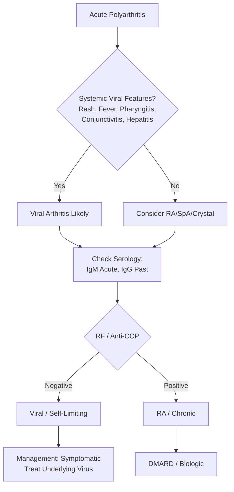
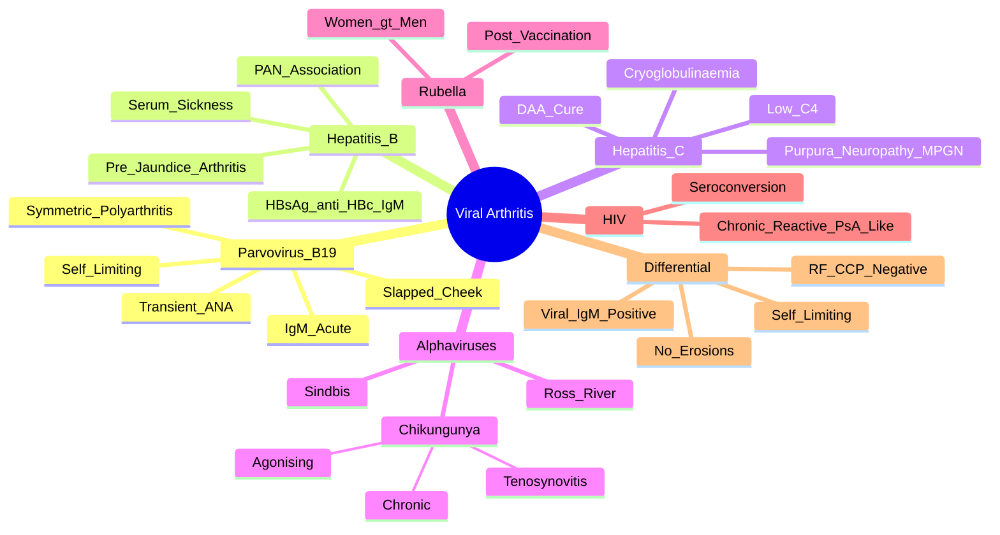

# Viral Arthritis

> [!tip] **FCPS/MRCP Priority: HIGH**
> Viral arthritis = **acute self-limiting polyarthritis** from viral infection. Key mimics of **early RA/SpA** but **RF/anti-CCP negative**, **no erosions**, **transient**. Key viruses: **Parvovirus B19** (slapped cheek + small joint polyarthritis), **Hepatitis B** (serum sickness-like + PAN), **Hepatitis C** (cryoglobulinaemia), **Alphaviruses** (Chikungunya — agonising polyarthralgia).

---

## Learning Objectives
By the end of this note you should be able to:
- [ ] Recognise the classic clinical patterns of major viral arthritides
- [ ] Differentiate viral arthritis from early RA (RF/anti-CCP negative, no erosions, self-limiting)
- [ ] Interpret serology correctly (IgM = acute, IgG = past)
- [ ] Identify Hepatitis C cryoglobulinaemic vasculitis and Hepatitis B PAN association
- [ ] Select appropriate management: symptomatic (NSAIDs) vs disease-specific (HCV/HBV antivirals)

---

## 1. Definition & Epidemiology

| Feature | Detail |
|---------|--------|
| **Definition** | **Acute inflammatory arthritis** triggered by **viral infection** — direct joint invasion or immune complex deposition |
| **Presentation** | **Acute polyarthritis** (symmetric small joints) or **polyarthralgia**, often with rash, fever, constitutional symptoms |
| **Course** | **Self-limiting** (days to weeks) in most; **chronic** may mimic chronic inflammatory arthritis |
| **Key Distinction from RA** | **RF/anti-CCP negative**, **no erosions**, **transient**, **associated systemic viral features** |

---

## 2. Major Viruses — High-Yield for FCPS/MRCP

### Parvovirus B19 (Fifth Disease)
| Feature | Detail |
|---------|--------|
| **Transmission** | Respiratory droplets; **school outbreaks** |
| **Children** | **"Slapped cheek" rash** (erythema infectiosum) → **lacy reticular rash** on trunk/limbs |
| **Adults** | **Symmetric small joint polyarthritis** (hands, wrists, knees) — **mimics RA**; **no rash** often |
| **Course** | **Self-limiting 1-3 weeks** (can recur for months) |
| **Transient ANA** | **Positive in 10-20%** during acute phase (low titre, speckled) |
| **High-Risk** | **Aplastic crisis** in sickle cell/haemolytic anaemia; **hydrops fetalis** in pregnancy |
| **Serology** | **IgM = acute** (peaks 7-10 days, 2-3 months); **IgG = immunity** |

### Hepatitis B Virus (HBV)
| Feature | Detail |
|---------|--------|
| **Pattern** | **Serum sickness-like prodrome**: fever, urticarial rash, **polyarthritis** → then jaundice |
| **Arthritis** | Symmetric, small joints (hands, wrists, knees) — **precedes jaundice** |
| **PAN Association** | **HBV-associated polyarteritis nodosa** — vasculitis, mononeuritis multiplex, hypertension, renal |
| **Serology** | **HBsAg +**, **Anti-HBc IgM +** (acute); **Anti-HBs** = immunity |
| **Treatment** | **Antivirals (entecavir/tenofovir)** for chronic HBV; **avoid immunosuppression** |

### Hepatitis C Virus (HCV)
| Feature | Detail |
|---------|--------|
| **Arthralgia** | Very common (20-30%) — often non-inflammatory |
| **Cryoglobulinaemic Vasculitis** | **Type II/III cryoglobulinaemia** — palpable purpura, peripheral neuropathy, **membranoproliferative GN (MPGN)**, low C4 |
| **Liver Disease** | Chronic hepatitis, cirrhosis, HCC risk |
| **Serology** | **Anti-HCV +**, **HCV RNA +** (active replication) |
| **Treatment** | **DAA (Direct-acting antivirals)** — **cures HCV + resolves cryoglobulinaemia** |

### Rubella (German Measles)
| Feature | Detail |
|---------|--------|
| **Pattern** | **Post-infection** or **post-vaccination** (MMR) |
| **Arthritis** | **Women > Men** (3:1); **symmetric small joints** (hands, wrists, knees) |
| **Course** | **Self-limiting weeks** |
| **Serology** | **Rubella IgM = acute/recent**; IgG = immunity |

### Alphaviruses (Arboviruses)
| Virus | Vector | Key Features |
|-------|--------|--------------|
| **Chikungunya** | **Aedes aegypti/albopictus** | **Agonising polyarthralgia/arthritis**, **tenosynovitis**, **chronic arthralgia months-years**, rash, fever; epidemic |
| **Ross River** | **Culex/Aedes** | Epidemic polyarthritis (Australia/Pacific), rash, fatigue |
| **Sindbis** | **Culex** | Mild fever, rash, polyarthritis (Northern Europe) |
| **Mayaro** | **Haemagogus** | South America, similar to Chikungunya |
| **O'nyong-nyong** | **Anopheles** | Africa, similar to Chikungunya |

> [!critical] **Chikungunya Arthritis**
> - **"Agonising" polyarthralgia** — **hands, wrists, ankles, feet**
> - **Tenosynovitis** prominent
> - **Chronic arthralgia** in **30-60%** persisting **months to years**
> - **Post-chikungunya chronic inflammatory rheumatism** — mimics RA

### Other Viruses
| Virus | Arthritis Pattern |
|-------|-------------------|
| **HIV** | Acute seroconversion syndrome (fever, rash, polyarthralgia); chronic: reactive-like, PsA-like, sicca |
| **EBV** | Acute mono/oligoarthritis (rare); post-infectious fatigue |
| **CMV** | Rare arthritis; immunocompromised |
| **Mumps** | Orchitis in males; rare arthritis |
| **Dengue/Zika** | Arthralgia common; acute febrile illness; Zika: congenital microcephaly |

---

## 3. Clinical Approach — Differentiating from RA

### Key Differentiators
| Feature | **Viral Arthritis** | **Early RA** |
|---------|---------------------|--------------|
| **Onset** | **Acute, sudden** | Insidious |
| **Symmetry** | Often symmetrical | Symmetrical |
| **Joints** | Small (hands, wrists) + large | MCP, PIP, wrists (small) |
| **RF / Anti-CCP** | **Negative** (usually) | **Positive** (70-80% / 60-70%) |
| **Erosions** | **None** | May be present |
| **Course** | **Self-limiting** (days-weeks) | Chronic, progressive |
| **Systemic Features** | **Rash, fever, hepatitis** | Rare (except Felty's) |
| **Serology** | **Viral IgM +** | — |

---

## 3. Investigations

### Serology Guidelines
| Test | Interpretation |
|------|----------------|
| **Viral IgM** | **Acute/recent infection** (peaks 1-2 weeks, declines 2-3 months) |
| **Viral IgG** | **Past infection / immunity** |
| **RF / Anti-CCP** | **Negative** = supports viral; **Positive** = think RA |
| **ANA** | Can be **transiently positive** (especially parvovirus) |
| **Cryoglobulins** | **HCV** (Type II/III) — cryoglobulinaemic vasculitis |
| **Liver Function** | **HBsAg, Anti-HBc IgM, Anti-HCV, HCV RNA** |
| **HCV RNA** | **Active replication** — treat with DAA |
| **Complement (C3, C4)** | **Low C4** = cryoglobulinaemia/HCV/SLE |

---

## 4. Management

| Virus | Management |
|-------|------------|
| **Most Viral Arthritis** | **Symptomatic**: NSAIDs, rest, analgesia; **self-limiting** |
| **Parvovirus B19** | NSAIDs; **IVIG** for chronic anaemia/pure red cell aplasia; **hydroxychloroquine** if persistent arthritis >6mo |
| **Hepatitis B** | **Antivirals (entecavir/tenofovir)** for chronic HBV; **avoid steroids/immunosuppression**; HBV-PAN = antivirals + plasmapheresis |
| **Hepatitis C** | **DAA (sofosbuvir/velpatasvir etc.)** — **cures HCV, resolves cryoglobulinaemia**; **Rituximab** for severe cryoglobulinaemic vasculitis |
| **Chikungunya** | NSAIDs, **chronic arthralgia: HCQ, MTX, sulfasalazine** (post-chikungunya chronic inflammatory rheumatism) |
| **Rubella** | NSAIDs, self-limiting |
| **HIV** | **ART** — immune reconstitution; manage HIV-associated rheumatic syndromes |

> [!important] **When to Treat Underlying Virus**
> - **HBV/HCV/HIV**: **Always** — disease-modifying
> - **Persistent Parvovirus** (>6mo): HCQ
> - **Post-chikungunya chronic**: HCQ/MTX/SSZ

---

## 5. FCPS/MRCP High-Yield Summary

| Virus | Classic Presentation | Key Serology | High-Yield Pearl |
|-------|---------------------|--------------|------------------|
| **Parvovirus B19** | **Slapped cheek (kids)** + **symmetric small joint polyarthritis (adults)** | **IgM acute**; transient ANA+ | **Self-limiting 1-3 weeks**; aplastic crisis in sickle cell |
| **Hepatitis B** | **Serum sickness-like** (fever, rash, arthritis) → jaundice; **PAN association** | **HBsAg +, anti-HBc IgM +** | **Antivirals for chronic**; avoid immunosuppression |
| **Hepatitis C** | Arthralgia + **cryoglobulinaemic vasculitis** (purpura, neuropathy, MPGN) | **Anti-HCV +, HCV RNA +** | **DAA cures HCV + resolves cryoglobulinaemia** |
| **Chikungunya** | **Agonising polyarthralgia**, tenosynovitis, **chronic months-years** | **IgM acute** | **Post-chikungunya chronic rheumatism = RA mimic** |
| **Rubella** | Post-vaccination/infection arthritis, **women > men** | **Rubella IgM acute** | Self-limiting weeks |
| **HIV** | Acute seroconversion polyarthralgia; chronic reactive/PsA-like | HIV serology | ART = disease-modifying |

---

## 6. Viva Questions (MRCP PACES / FCPS)

| Question | Expected Answer |
|----------|----------------|
| "A 30yo woman presents with 2 weeks of symmetric MCP/PIP arthritis, recent 'slapped cheek' rash in her child. ANA positive 1:80 speckled. RF/anti-CCP negative. Diagnosis?" | **Parvovirus B19 arthritis** — symmetric small joint polyarthritis, transient low-titre ANA, **RF/CCP negative**, self-limiting 1-3 weeks. |
| "A 45yo man with chronic HCV presents with palpable purpura, peripheral neuropathy, proteinuria. Cryoglobulins positive, C4 low. Diagnosis and management?" | **HCV-associated mixed cryoglobulinaemic vasculitis (Type II/III)**. **DAA for HCV** (cures HCV + resolves cryoglobulinaemia). **Rituximab** if severe vasculitis. |
| "What is the classic presentation of Hepatitis B-associated arthritis?" | **Serum sickness-like prodrome**: fever, urticarial rash, **polyarthritis** → then jaundice. **HBsAg+, anti-HBc IgM+**. |
| "How do you differentiate viral arthritis from early RA?" | Viral: **acute onset, self-limiting, RF/CCP negative, no erosions, systemic viral features**. RA: insidious, chronic, **RF/CCP positive, erosions**. |
| "What is the management of HCV cryoglobulinaemic vasculitis?" | **DAA for HCV** (cures both). **Rituximab** for severe/organ-threatening vasculitis. |
| "A traveller returns from Southeast Asia with fever, rash, agonising polyarthralgia/tenosynovitis. Diagnosis?" | **Chikungunya** (Aedes mosquito). **IgM acute**; chronic arthralgia in 30-60% (post-chikungunya chronic rheumatism). |
| "What is the significance of transient ANA positivity in acute parvovirus infection?" | **Low-titre, speckled ANA** in 10-20% — **transient**, resolves with infection; **does not imply SLE**. |
| "What is the association between Hepatitis B and PAN?" | **HBV-associated PAN** — immune complex vasculitis. **Antivirals + plasmapheresis**; **avoid prolonged immunosuppression**. |

---

## 7. Confusions & Mnemonics

| Confusion | Clarification |
|-----------|---------------|
| **Parvovirus vs RA** | Parvovirus: **acute, self-limiting 1-3 weeks, RF/CCP negative, transient ANA**. RA: chronic, RF/CCP positive, erosive. |
| **HBV Arthritis Timing** | Arthritis **precedes jaundice** (serum sickness-like prodrome). |
| **HCV Cryoglobulinaemia** | **Type II/III cryoglobulins** → purpura, neuropathy, **low C4**, MPGN. **DAA cures both**. |
| **Chikungunya Chronicity** | **30-60% develop chronic arthralgia >3 months** — post-chikungunya chronic inflammatory rheumatism. |
| **Viral ANA** | **Transient, low-titre, speckled** in parvovirus, EBV, HCV — **resolves**, does not imply SLE. |
| **Post-vaccination Rubella Arthritis** | **Adult women > men**; self-limiting weeks; MMR vaccine. |

**Mnemonic: Viral Arthritis Viruses = "P-H-C-R-A-C"**
- **P**arvovirus B19
- **H**epatitis B
- **C** (Hepatitis **C**)
- **R**ubella
- **A**lphaviruses (Chikungunya, Ross River)
- **C** (HIV, CMV, EBV, others)

**Mnemonic: Parvovirus = "SLAPPED CHEEK + ARTHRITIS"**
- **S**lapped cheek (kids)
- **L**ow-titre ANA
- **A**dults = polyarthritis
- **P**olyarthritis symmetric
- **P**arvovirus IgM
- **E**D (self-limiting 1-3 weeks)
- **D**oes not = RA

**Mnemonic: HBV = "SERUM SICKNESS + PAN"**
- **S**erum sickness-like
- **E**rthritis before jaundice
- **R**esolves with jaundice
- **U**rticaria
- **M**onomer (HBsAg+)

**Mnemonic: HCV = "CRYO + DAA"**
- **CRYO**globulinaemia (purpura, neuropathy, low C4, MPGN)
- **DAA** cures HCV + resolves cryoglobulinaemia

**Mnemonic: Chikungunya = "AGONISING + TENOSYNOVITIS + CHRONIC"**
- **A**gonising polyarthralgia
- **T**enosynovitis
- **C**hronic months-years

**Mnemonic: Differential RA vs Viral = "R-V"**
- **R**A: **R**F/CCP +, **E**rosions, **V**—
- **V**iral: **V**iral IgM +, **I**gG past, **R**F/CCP -, **A**lways self-limiting (mostly)

---

## 8. Mind Map

---

## 9. One-Page Revision Card

| Virus | Classic Presentation | Key Serology | Management |
|-------|---------------------|--------------|------------|
| **Parvovirus B19** | Slapped cheek (kids) + symmetric small joint polyarthritis (adults) | **IgM acute**; transient ANA+ | NSAIDs, self-limiting 1-3w; HCQ if persistent >6mo |
| **Hepatitis B** | Serum sickness-like (fever, rash, arthritis) → jaundice | **HBsAg+, anti-HBc IgM+** | Antivirals (entecavir/tenofovir) for chronic |
| **Hepatitis C** | Arthralgia + cryoglobulinaemic vasculitis (purpura, neuropathy, MPGN) | **Anti-HCV+, HCV RNA+**; low C4 | **DAA cures HCV + cryoglobulinaemia**; Rituximab if severe |
| **Chikungunya** | Agonising polyarthralgia, tenosynovitis, chronic months-years | **IgM acute** | NSAIDs; chronic: HCQ/MTX/SSZ |
| **Rubella** | Post-infection/vaccination arthritis; women > men | **Rubella IgM acute** | NSAIDs, self-limiting |
| **HIV** | Acute seroconversion polyarthralgia; chronic reactive/PsA-like | HIV serology | ART = disease-modifying |

---

## 10. Spaced Repetition Trackers

| Review Interval | Date Completed | Confidence (1-5) | Notes |
|-----------------|----------------|------------------|-------|
| 24 hours | | | |
| 7 days | | | |
| 15 days | | | |
| 30 days | | | |
| 90 days | | | |

---

## 11. Self-Test Scorecard

| Section | Score /5 | Last Attempt |
|---------|----------|--------------|
| Parvovirus Features | | |
| HBV Serum Sickness & PAN | | |
| HCV Cryoglobulinaemia & DAA | | |
| Chikungunya Chronicity | | |
| RA vs Viral Differentiation | | |
| Serology Interpretation | | |
| Viva Questions | | |

---

## Local Navigation
- **Parent Heading**: [[../Infectious Arthritis and Bone Infections|Infectious Arthritis and Bone Infections]]
- **Parent Topic Group**: [[Joint and bone infections]]
- **Chapter Map**: [[../Davidson Chapter 26 - Rheumatology Hierarchy|Rheumatology Hierarchy]]
- **Chapter MOC**: [[../Rheumatology MOC|Rheumatology MOC]]
- **Drug Reference**: [[../../Clinical Approach to Musculoskeletal Disease/Drugs in rheumatology|Drugs in rheumatology]]
- **Related**: [[Septic arthritis]] · [[Lyme disease]] · [[Rheumatic fever]]