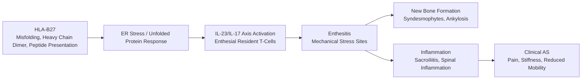
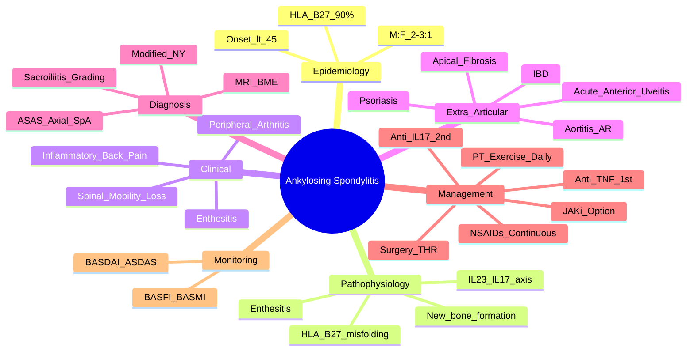

# Ankylosing Spondylitis (AS)

> [!tip] **FCPS/MRCP Priority: CRITICAL**
> AS = **prototype axial spondyloarthritis**. Inflammatory back pain + sacroiliitis + HLA-B27. Must know: ASAS criteria, Modified New York criteria, sacroiliitis grading, anti-TNF/IL-17 biologics, extra-articular features (uveitis 25-30%). Guaranteed viva/SBA/imaging topic.

---

## Learning Objectives
By the end of this note you should be able to:
- [ ] Apply Modified New York and ASAS classification criteria for AS/axial SpA
- [ ] Differentiate inflammatory from mechanical back pain
- [ ] Grade sacroiliitis on X-ray (0-4) and interpret MRI findings
- [ ] Select and sequence biologics (anti-TNF → anti-IL-17) for axial disease
- [ ] Recognise and manage extra-articular manifestations (uveitis, aortitis, conduction defects)
- [ ] Monitor disease activity (BASDAI, ASDAS) and spinal mobility (BASMI)

---

## 1. Definition & Epidemiology

| Feature | Detail |
|---------|--------|
| **Definition** | Chronic inflammatory disease primarily affecting **axial skeleton** (sacroiliac joints → spine) → **sacroiliitis**, **syndesmophytes**, **ankylosis** ("bamboo spine") |
| **Prevalence** | 0.1-0.5% (varies with HLA-B27 frequency) |
| **Incidence** | 0.5-14/100,000/year |
| **Peak Onset** | **<45 years** (typically 20-30); **rare >45** |
| **Sex Ratio** | **M:F = 2-3:1** (radiographic AS); non-radiographic axial SpA more equal |
| **Genetics** | **HLA-B27: 90-95% positive** (but 8% general population); ERAP1, IL23R, RUNX3 |
| **Risk Factors** | HLA-B27 + family history (recurrence risk ~15-20%), smoking (worse severity) |

---

## 2. Aetiology & Pathophysiology



### Key Pathogenic Concepts
| Concept | Detail |
|---------|--------|
| **HLA-B27 hypotheses** | 1) Misfolding → ER stress → IL-23 production; 2) Heavy chain dimers → NK receptor activation; 3) Altered peptide presentation |
| **IL-23/IL-17 axis** | **Central pathway** — enthesial resident T-cells → IL-17 → inflammation + new bone formation |
| **Enthesitis** | Primary lesion — mechanical stress sites (achilles, plantar fascia, costochondral, spinal entheses) |
| **New bone formation** | **Paradoxical** — inflammation → syndesmophytes → ankylosis (unlike RA where inflammation = erosion) |
| **No rheumatoid factor/ACPA** | **Seronegative** spondyloarthritis |

---

## 3. Clinical Features

### Axial Manifestations (Core)
| Feature | Description |
|---------|-------------|
| **Inflammatory Back Pain (IBP)** | **Age <45**, insidious onset, **>3 months**, **improves with exercise**, **no improvement with rest**, **night pain** (often 2nd half), **morning stiffness >30 min** |
| **Spinal Mobility Loss** | Progressive — lumbar → thoracic → cervical; **Schober's test <5cm expansion** |
| **Chest Expansion** | **<2.5cm** (costovertebral joint ankylosis) |
| **Buttock Pain** | Alternating (sacroiliitis) |
| **Peripheral Arthritis** | 30% — asymmetrical, lower limb > upper limb (knee, ankle, hip) |

### Extra-Articular Manifestations — **High-Yield**
| Manifestation | Frequency | Key Features |
|---------------|-----------|--------------|
| **Acute Anterior Uveitis (AAU)** | **25-30%** | **Acute painful red eye, photophobia, blurred vision** — **most common EAM**; recurrent, unilateral alternating; **HLA-B27+** |
| **Psoriasis** | 10-15% | Plaque, guttate, inverse |
| **Inflammatory Bowel Disease** | 5-10% | Subclinical in up to 60%; Crohn's > UC |
| **Aortitis** | 2-10% | **Ascending aorta** → aortic regurgitation, conduction defects (AV block) |
| **Apical Pulmonary Fibrosis** | Rare | Upper lobe fibrosis |
| **Renal (IgA Nephropathy)** | Rare | |
| **Neurological** | Rare | Cauda equina syndrome (late), compression fractures |

> [!critical] **AAU in AS**
> - **Acute onset** painful red eye, photophobia, blurred vision, circumcorneal injection
> - **Not** chronic iridocyclitis (JIA)
> - **Urgent ophthalmology** — topical steroids + cycloplegics; systemic if recurrent
> - **Recurrent, alternating eyes** — hallmark

### Enthesitis Sites
| Site | Clinical Relevance |
|------|-------------------|
| Achilles tendon insertion | Pain, swelling, tendonitis |
| Plantar fascia insertion | Heel pain |
| Costochondral joints | Chest wall pain, reduced expansion |
| Iliac crest, ischial tuberosities | Buttock/hip pain |
| Spinal entheses | Syndesmophyte formation |

---

## 4. Classification Criteria

### Modified New York Criteria (1984) — **For Definite AS (Radiographic)**
| Clinical Criteria | Radiological Criterion |
|-------------------|------------------------|
| 1. **Low back pain ≥3 months** improved by exercise, not rest | **Sacroiliitis Grade ≥2 bilaterally** OR **Grade ≥3 unilaterally** |
| 2. Limitation of lumbar spine motion (sagittal/frontal) | |
| 3. Limitation of chest expansion (vs age/sex norms) | |

**Definite AS = Radiological criterion + ≥1 clinical criterion**

### ASAS Axial SpA Criteria (2009) — **Includes Non-Radiographic (nr-axSpA)**
**Entry: Back pain ≥3 months, age at onset <45 years**

| Arm | Requirements |
|-----|--------------|
| **Imaging Arm** | **Sacroiliitis on imaging** (X-ray: Modified NY grade ≥2 bilateral OR grade ≥3 unilateral **OR** MRI: active inflammation = bone marrow oedema/osteitis) **+ ≥1 SpA feature** |
| **Clinical Arm** | **HLA-B27 positive** **+ ≥2 SpA features** (no imaging required) |

**SpA Features:**
- Inflammatory back pain
- Arthritis
- Enthesitis (heel)
- Uveitis
- Dactylitis
- Psoriasis
- Crohn's/colitis
- Good response to NSAIDs
- Family history of SpA
- HLA-B27 positive
- Elevated CRP

> [!important] **Modified NY vs ASAS**
> - **Modified NY** = **definite radiographic AS** only (excludes nr-axSpA)
> - **ASAS** = **broader** — includes nr-axSpA (MRI+ or HLA-B27+)
> - **nr-axSpA** = SpA features + MRI sacroiliitis **without** X-ray changes

---

## 5. Imaging — Sacroiliitis Grading (X-ray)

| Grade | Description | Modified NY |
|-------|-------------|-------------|
| **0** | Normal | — |
| **1** | Suspicious (blurring, sclerosis) | — |
| **2** | **Minimal** — definite erosion/sclerosis, **normal joint space** | **≥2 bilateral = definte** |
| **3** | **Moderate** — definite erosion/sclerosis, **joint space widening/narrowing** | **≥3 unilateral = definite** |
| **4** | **Ankylosis** — complete fusion | — |

> [!critical] **X-ray Limitations**
> - **Late changes** — 5-10 years from symptom onset to radiographic sacroiliitis
> - **False negatives** in early disease → **MRI for early diagnosis**
> - **Weight-bearing AP pelvis** + **oblique views** (or Ferguson view)

### MRI (STIR/T2 and T1)
| Finding | Significance |
|---------|--------------|
| **Bone Marrow Oedema (BME)** | **Active inflammation** (STIR/T2 hyperintense) — ASAS imaging criterion |
| **Fat metaplasia** | Chronic/post-inflammatory (T1 hyperintense) |
| **Erosions** | Structural damage (T1) |
| **Sclerosis/Ankylosis** | Late structural (T1) |

> [!tip] **MRI Protocol**
> - **Semi-coronal STIR/T2** (sacroiliac joints)
> - **Semi-coronal T1** (structural)
> - **BME in subchondral bone** = active sacroiliitis (highly specific if ≥2 lesions or ≥1 lesion in ≥2 slices)

---

## 6. Differential Diagnosis

| Condition | Distinguishing Features |
|-----------|------------------------|
| **Mechanical Low Back Pain** | Age >45, worse with activity, better with rest, **no night pain**, stiffness <15 min, normal ESR/CRP, normal imaging |
| **Non-Radiographic Axial SpA (nr-axSpA)** | Meets ASAS criteria, **positive MRI/X-ray negative** |
| **Psoriatic Arthritis (Axial)** | Psoriasis, **asymmetrical sacroiliitis**, cervical involvement, dactylitis, nail changes |
| **Reactive Arthritis** | Post-infectious (GU/GI), asymmetrical oligoarthritis, enthesitis, conjunctivitis/urethritis |
| **Enteropathic Arthritis** | IBD (Crohn's/UC), axial involvement in 20% |
| **DISH** | **Flowing ossification** (right thoracic spine), **no sacroiliitis**, **no inflammation**, elderly |
| **Rheumatoid Spondylitis** | RA with cervical spine involvement (atlantoaxial subluxation), no sacroiliitis |
| **Osteitis Condensans Ilii** | Women post-partum, triangular sclerosis on iliac side of SI joint, asymptomatic |

---

## 7. Management

```mermaid
flowchart TD
    A[AS Diagnosis] --> B[Core: Physiotherapy + Exercise\n(Daily spinal mobility, posture, chest expansion)]
    B --> C[NSAIDs First-Line\nCOX-2 preferred; continuous > PRN for efficacy]
    C --> D{Response?}
    D -->|Adequate| E[Continue NSAID + PT\nMonitor BASDAI/ASDAS]
    D -->|Inadequate\nor contraindicated| F[Biologic Therapy]
    F --> F1[Anti-TNF: Adalimumab, Etanercept, Infliximab, Certolizumab, Golimumab]
    F1 --> F2[Anti-IL-17: Secukinumab, Ixekizumab, Bimekizumab]
    F2 --> F3[Anti-IL-12/23: Not for axial]
    F3 --> G{Anti-TNF Failure?}
    G -->|Yes| H[Switch to Anti-IL-17\n(or another anti-TNF)]
    G -->|No| I[Continue + Monitor]
    H --> J[Consider JAKi\n(Upadacitinib FDA approved for AS)]
```

### Step-by-Step

| Step | Intervention | Details |
|------|--------------|---------|
| **1. Core (ALL)** | **Physiotherapy + Exercise** | Daily spinal extension, chest expansion, posture, hydrotherapy; **lifelong** |
| **2. 1st Line Drug** | **NSAIDs** (COX-2 preferred) | **Continuous > PRN** — better efficacy; assess response 4-8 weeks; **PPI if risk** |
| **3. Analgesia** | Paracetamol, weak opioids | Adjunct only |
| **4. Local Injection** | SI joint steroid | Diagnostic/therapeutic if unilateral |
| **5. Biologic (NSAID fail/contraindicated)** | **Anti-TNF** (adalimumab, etanercept, certolizumab SC; infliximab, golimumab IV) | **TB screen (IGRA) mandatory pre-start**; HBsAg, HIV; monitor for demyelination, HF, infections |
| **6. Anti-TNF Failure** | Switch to **Anti-IL-17** (secukinumab 150mg SC monthly, ixekizumab 80mg SC q4wk, bimekizumab 160mg SC q4wk) | **Avoid in IBD** (can flare Crohn's); Candida risk |
| **7. JAK Inhibitor** | **Upadacitinib 15mg daily** (FDA approved for AS) | **VTE risk assessment**; avoid in high CV risk |
| **8. Surgery** | **Total Hip Replacement** (severe hip involvement); spinal osteotomy (fixed deformity) | Late disease |

> [!warning] **csDMARDs Ineffective for Axial Disease**
> - **Sulfasalazine** — only for **peripheral arthritis** in SpA
> - **Methotrexate** — not effective for axial symptoms
> - **Only NSAIDs and biologics work for axial inflammation**

### Disease Activity Monitoring
| Tool | Components | Target |
|------|------------|--------|
| **BASDAI** (0-10) | Fatigue, spinal pain, joint pain/swelling, enthesitis, morning stiffness severity/duration | **<4** (inactive) |
| **ASDAS** (Ankylosing Spondylitis Disease Activity Score) | BASDAI items + CRP | **<1.3** (inactive); **<2.1** (low) |
| **BASFI** (Functional Index) | 10 functional activities | Track disability |
| **BASMI** (Metrology Index) | Tragus-to-wall, lumbar flexion, lumbar extension, cervical rotation, intermalleolar distance | Spinal mobility |

---

## 8. Extra-Articular Management

| Manifestation | Management |
|---------------|------------|
| **Acute Anterior Uveitis** | **Urgent ophthalmology** — topical steroids (prednisolone acetate 1% q1-2h) + cycloplegics; systemic steroids if severe/recurrent; **anti-TNF reduces recurrence** |
| **Aortitis/Aortic Regurgitation** | Annual echocardiogram; **cardiac surgery** if severe AR; monitor conduction (AV block → pacemaker) |
| **IBD** | Gastroenterology co-management; **avoid anti-IL-17** (secukinumab/ixekizumab flare Crohn's); **anti-TNF preferred** |
| **Psoriasis** | Dermatology co-management; anti-TNF/IL-17 effective for both |
| **Osteoporosis** | **High risk** (inflammation + reduced mobility + vertebral fractures); **DEXA + bisphosphonate/denosumab** |

---

## 9. FCPS/MRCP High-Yield Summary

| Topic | Key Points |
|-------|------------|
| **Demographics** | M:F 2-3:1, onset <45 (peak 20-30) |
| **Inflammatory Back Pain** | Age <45, insidious, >3mo, improves exercise, night pain, AM stiffness >30min |
| **HLA-B27** | **90-95% AS**; 8% population — **supportive, not diagnostic** |
| **Modified NY Criteria** | Sacroiliitis **grade ≥2 bilateral OR ≥3 unilateral** + ≥1 clinical criterion |
| **ASAS Criteria** | Imaging arm (sacroiliitis on X-ray/MRI + ≥1 SpA feature) **OR** Clinical arm (HLA-B27 + ≥2 SpA features) |
| **Sacroiliitis Grading** | 0=normal, 1=suspicious, 2=minimal, 3=moderate, 4=ankylosis |
| **MRI** | **Bone marrow oedema (STIR) = active inflammation** — ASAS imaging criterion |
| **Uveitis** | **25-30%**, acute anterior, painful red eye + photophobia — urgent ophthalmology |
| **NSAIDs** | **1st line; continuous > PRN**; COX-2 + PPI; response supports diagnosis |
| **Biologics** | Anti-TNF 1st line → Anti-IL-17 if fail; **anti-IL-17 avoid in IBD** |
| **csDMARDs** | **Ineffective for axial disease** (SSZ only for peripheral) |
| **Monitoring** | BASDAI (<4 inactive), ASDAS (<1.3 inactive), BASFI, BASMI |
| **Surgery** | THR for hip; spinal osteotomy for fixed deformity |

---

## 10. Viva Questions (MRCP PACES / FCPS)

| Question | Expected Answer |
|----------|----------------|
| "A 28yo man has 6 months of low back pain, worse at night, improves with exercise. Morning stiffness 1 hour. HLA-B27 positive. X-ray shows bilateral grade 2 sacroiliitis. Diagnosis?" | **Ankylosing Spondylitis** (meets Modified NY: grade ≥2 bilateral + clinical criterion). |
| "What is the difference between Modified NY and ASAS criteria?" | Modified NY = **radiographic AS only** (X-ray grade ≥2 bilateral/≥3 unilateral). ASAS = includes **nr-axSpA** (imaging arm: MRI/X-ray sacroiliitis + SpA feature; clinical arm: HLA-B27 + ≥2 SpA features). |
| "How do you differentiate inflammatory from mechanical back pain?" | Inflammatory: <45y, insidious, >3mo, improves exercise, no improvement rest, night pain, AM stiffness >30min. Mechanical: opposite. |
| "A patient with AS on adalimumab develops Crohn's disease. What biologic do you switch to?" | **Continue anti-TNF** (adalimumab/infliximab/etanercept) — **effective for both AS and Crohn's**. **Avoid anti-IL-17** (secukinumab/ixekizumab flare Crohn's). |
| "What is the role of sulfasalazine in AS?" | **Only for peripheral arthritis** (not axial). No effect on spinal inflammation. |
| "What is the typical uveitis in AS?" | **Acute anterior uveitis** (25-30%), painful red eye, photophobia, circumcorneal injection, **recurrent alternating eyes**. Urgent ophthalmology. |
| "What imaging for early AS if X-ray normal?" | **MRI SI joints (STIR/T2)** — bone marrow oedema = active sacroiliitis (ASAS imaging criterion). |
| "How do you monitor AS disease activity?" | **BASDAI** (0-10, <4 inactive), **ASDAS** (incorporates CRP, <1.3 inactive), **BASFI** (function), **BASMI** (spinal mobility). |

---

## 11. Confusions & Mnemonics

| Confusion | Clarification |
|-----------|---------------|
| **AS vs nr-axSpA** | **AS = radiographic sacroiliitis (Modified NY)**. nr-axSpA = ASAS criteria met but **X-ray negative** (MRI+HLA-B27). |
| **HLA-B27** | **Supportive only** — 90% AS positive, but 8% population positive. **Not diagnostic alone**. |
| **Anti-IL-17 in IBD** | **Contraindicated** in Crohn's — can flare disease. Use anti-TNF for AS+IBD. |
| **csDMARDs for axial** | **Ineffective** — MTX, SSZ, HCQ, LEF don't work for spinal inflammation. Only NSAIDs + biologics. |
| **Sacroiliitis grading** | Grade 2 = minimal definite; Grade 3 = moderate; **Grade ≥2 bilateral = definite AS**. |
| **Mechanical vs Inflammatory BP** | Use **PAIN** mnemonic: Persistence >3mo, Age <40, Improvement with exercise, Night pain. |

**Mnemonic: Inflammatory Back Pain = "PAIN"**
- **P**ersistence >3 months
- **A**ge of onset <40 years
- **I**mprovement with exercise
- **N**o improvement with rest (+ Night pain)

**Mnemonic: ASAS = "IMAGE or HLAB"**
- **IMAGE** arm: sacroiliitis on imaging + ≥1 SpA feature
- **HLAB** arm: HLA-B27 + ≥2 SpA features

**Mnemonic: Sacroiliitis Grades = "0 Normal, 1 Suspect, 2 Minimal, 3 Moderate, 4 Ankylosis"**

**Mnemonic: Extra-Articular = "U-P-A-A"**
- **U**veitis (25-30%, acute anterior)
- **P**soriasis
- **A**ortitis (AR, conduction)
- **A**IBD (Crohn's > UC)

**Mnemonic: Treatment = "N-B-I-J"**
- **N**SAIDs continuous (1st line)
- **B**iologics (anti-TNF → anti-IL-17)
- **I**neffective csDMARDs for axial
- **J**AKi (upadacitinib) as option

---

## 12. Mind Map



---

## 13. One-Page Revision Card

| Domain | Key Points |
|--------|------------|
| **Demographics** | Male 20-30, HLA-B27 90-95% (8% pop), seronegative |
| **Inflammatory Back Pain** | <45y, insidious, >3mo, improves exercise, night pain, AM stiffness >30min |
| **Modified NY** | Sacroiliitis **grade ≥2 bilateral OR ≥3 unilateral** + ≥1 clinical criterion |
| **ASAS** | Imaging arm (sacroiliitis X-ray/MRI + SpA feature) OR Clinical arm (HLA-B27 + ≥2 SpA features) |
| **Sacroiliitis X-ray** | 0=N, 1=Suspect, 2=Minimal, 3=Moderate, 4=Ankylosis |
| **MRI** | **Bone marrow oedema (STIR) = active inflammation** |
| **Uveitis** | 25-30%, acute anterior, painful red eye + photophobia, recurrent alternating |
| **Aortitis** | Ascending aorta → AR, conduction defects (AV block) |
| **1st Line** | **NSAIDs continuous** (COX-2 + PPI); PT/exercise daily |
| **Biologics** | Anti-TNF 1st → Anti-IL-17 if fail; **Avoid anti-IL-17 in IBD** |
| **csDMARDs** | **Ineffective for axial** (SSZ only for peripheral) |
| **Monitoring** | BASDAI <4, ASDAS <1.3, BASFI, BASMI |

---

## 14. Spaced Repetition Trackers

| Review Interval | Date Completed | Confidence (1-5) | Notes |
|-----------------|----------------|------------------|-------|
| 24 hours | | | |
| 7 days | | | |
| 15 days | | | |
| 30 days | | | |
| 90 days | | | |

---

## 15. Self-Test Scorecard

| Section | Score /5 | Last Attempt |
|---------|----------|--------------|
| Inflammatory vs Mechanical Back Pain | | |
| Modified NY vs ASAS Criteria | | |
| Sacroiliitis Grading | | |
| HLA-B27 Interpretation | | |
| Extra-Articular Manifestations | | |
| Biologic Selection & Sequencing | | |
| Uveitis Management | | |
| Disease Activity Monitoring | | |
| Viva Questions | | |

---

## Local Navigation
- **Parent Heading**: [[../Inflammatory Arthritis|Inflammatory Arthritis]]
- **Parent Topic Group**: [[Seronegative spondyloarthritis overview]]
- **Chapter Map**: [[../Davidson Chapter 26 - Rheumatology Hierarchy|Rheumatology Hierarchy]]
- **Chapter MOC**: [[../Rheumatology MOC|Rheumatology MOC]]
- **Drug Reference**: [[../../Clinical Approach to Musculoskeletal Disease/Drugs in rheumatology|Drugs in rheumatology]]
- **Investigation Reference**: [[../../Clinical Approach to Musculoskeletal Disease/Investigations in rheumatology|Investigations in rheumatology]]
- **Related**: [[Psoriatic arthritis]] · [[Reactive arthritis]] · [[Enteropathic arthritis]] · [[Undifferentiated spondyloarthritis]]
---

> Auto-generated study sections for "Inflammatory Arthritis" — Ch 25: Rheumatology & Bone Disease.

## Flashcards (22 generated)

- Q: What is the definition of Inflammatory Arthritis?
  A: | Definition | Chronic inflammatory disease primarily affecting axial skeleton (sacroiliac joints → spine) → sacroiliitis, syndesmophytes, ankylosis ("bamboo spine") |
- Q: What is Bone Marrow Oedema (BME) of Inflammatory Arthritis?
  A: Active inflammation (STIR/T2 hyperintense) — ASAS imaging criterion
- Q: What is Fat metaplasia of Inflammatory Arthritis?
  A: Chronic/post-inflammatory (T1 hyperintense)
- Q: What is Erosions of Inflammatory Arthritis?
  A: Structural damage (T1)
- Q: What is Sclerosis/Ankylosis of Inflammatory Arthritis?
  A: Late structural (T1)
- Q: What is Bone Marrow Oedema (BME) of Inflammatory Arthritis?
  A: Active inflammation (STIR/T2 hyperintense) — ASAS imaging criterion
- Q: What is Fat metaplasia of Inflammatory Arthritis?
  A: Chronic/post-inflammatory (T1 hyperintense)
- Q: What is Erosions of Inflammatory Arthritis?
  A: Structural damage (T1)
- Q: What is Sclerosis/Ankylosis of Inflammatory Arthritis?
  A: Late structural (T1)
- Q: What is Demographics of Inflammatory Arthritis?
  A: M:F 2-3:1, onset <45 (peak 20-30)
- Q: What is Inflammatory Back Pain of Inflammatory Arthritis?
  A: Age <45, insidious, >3mo, improves exercise, night pain, AM stiffness >30min
- Q: What is HLA-B27 of Inflammatory Arthritis?
  A: 90-95% AS; 8% population — supportive, not diagnostic
- Q: What is Modified NY Criteria of Inflammatory Arthritis?
  A: Sacroiliitis grade ≥2 bilateral OR ≥3 unilateral + ≥1 clinical criterion
- Q: What is ASAS Criteria of Inflammatory Arthritis?
  A: Imaging arm (sacroiliitis on X-ray/MRI + ≥1 SpA feature) OR Clinical arm (HLA-B27 + ≥2 SpA features)
- Q: What is Sacroiliitis Grading of Inflammatory Arthritis?
  A: 0=normal, 1=suspicious, 2=minimal, 3=moderate, 4=ankylosis
- Q: What is MRI of Inflammatory Arthritis?
  A: Bone marrow oedema (STIR) = active inflammation — ASAS imaging criterion
- Q: What is Uveitis of Inflammatory Arthritis?
  A: 25-30%, acute anterior, painful red eye + photophobia — urgent ophthalmology
- Q: What is NSAIDs of Inflammatory Arthritis?
  A: 1st line; continuous > PRN; COX-2 + PPI; response supports diagnosis
- Q: What is Biologics of Inflammatory Arthritis?
  A: Anti-TNF 1st line → Anti-IL-17 if fail; anti-IL-17 avoid in IBD
- Q: What is csDMARDs of Inflammatory Arthritis?
  A: Ineffective for axial disease (SSZ only for peripheral)
- Q: How is Inflammatory Arthritis monitored?
  A: BASDAI (<4 inactive), ASDAS (<1.3 inactive), BASFI, BASMI
- Q: What is Surgery of Inflammatory Arthritis?
  A: THR for hip; spinal osteotomy for fixed deformity

## MCQs (1 generated)

1. **Which of the following best describes Inflammatory Arthritis?**
   A. **| Definition | Chronic inflammatory disease primarily affecting axial skeleton (sacroiliac joints → spine) → sacroiliitis, syndesmophytes, ankylosis ("bamboo spine") |**
   B. An unrelated condition not matching the clinical picture of Inflammatory Arthritis
   C. A complication seen late in the disease course of Inflammatory Arthritis
   D. A condition that mimics Inflammatory Arthritis but has a different underlying cause

## SBA Questions (1 generated)

1. A patient with suspected Inflammatory Arthritis presents with: Definition — Chronic inflammatory disease primarily affecting axial skeleton (sacroiliac joints → spine) → sacroiliitis, syndesmophytes, ankylosis ("bamboo spine"); Prevalence — 0.1-0.5% (varies with HLA-B27 frequency); Peak Onset — <45 years (typically 20-30); rare >45. What is the most likely diagnosis?
   A. **Inflammatory Arthritis**
   B. A condition that mimics Inflammatory Arthritis but is not the same entity
   C. A complication of Inflammatory Arthritis rather than the primary diagnosis
   D. An unrelated condition in the same clinical category as Inflammatory Arthritis

