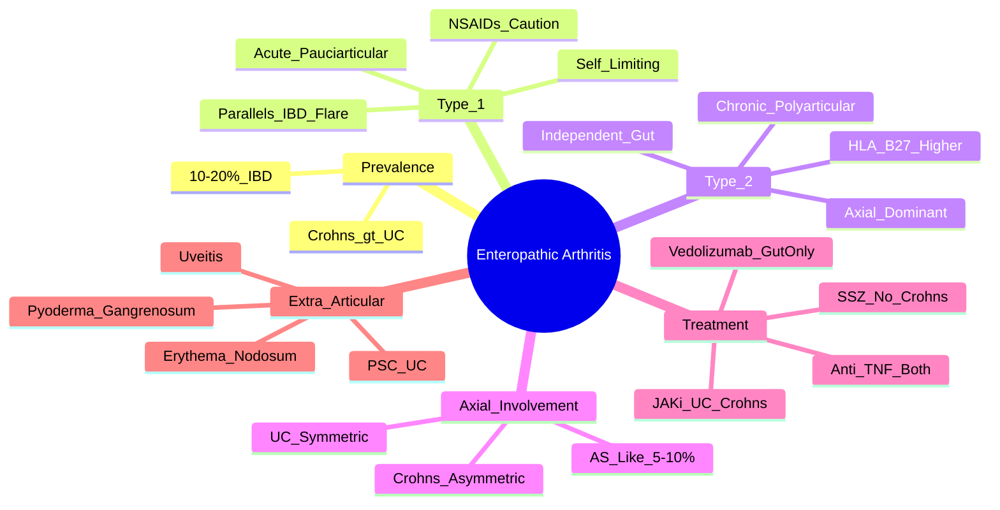

# Enteropathic Arthritis

> [!tip] **FCPS/MRCP Priority: HIGH**
> Enteropathic arthritis = **SpA associated with IBD** (Crohn's > UC). **10-20% of IBD** develop arthritis. Two types: **Type 1** (acute, pauciarticular, parallels IBD flare) vs **Type 2** (chronic, polyarticular, axial dominant, independent). **Anti-TNF treats both gut and joints**; **SSZ contraindicated in Crohn's**.

---

## Learning Objectives
By the end of this note you should be able to:
- [ ] Differentiate Type 1 (acute, IBD-parallel) vs Type 2 (chronic, axial-dominant, independent) enteropathic arthritis
- [ ] Recognise axial involvement patterns (asymmetric sacroiliitis in Crohn's, symmetric in UC)
- [ ] Select IBD-arthritis overlap treatment: **Anti-TNF (infliximab, adalimumab) for BOTH gut and joints**
- [ ] Avoid sulfasalazine in Crohn's (worsens colitis)
- [ ] Screen for extra-articular features (erythema nodosum, pyoderma gangrenosum, uveitis, PSC)

---

## 1. Definition & Epidemiology

| Feature | Detail |
|---------|--------|
| **Definition** | **Spondyloarthritis associated with inflammatory bowel disease** (Crohn's disease, ulcerative colitis) |
| **Prevalence in IBD** | **10-20%** of IBD patients develop arthritis |
| **IBD Type** | **Crohn's disease > Ulcerative colitis** |
| **Peak Onset** | 20-40 years (often after IBD diagnosis, but can precede) |
| **Sex Ratio** | M = F |
| **Genetics** | HLA-B27 (20-50%), NOD2/CARD15 (Crohn's), shared SpA loci |

---

## 2. Classification — Two Distinct Types

```mermaid
flowchart LR
    A[Enteropathic Arthritis] --> B{Type}
    B -->|Type 1| C[Acute, Pauciarticular\nParallels IBD Activity\nMirror Gut Flare]
    B -->|Type 2| D[Chronic, Polyarticular\nAxial Dominant\nIndependent of Gut Activity]
    C --> C1[Asymmetric Oligoarthritis\nLower Limb\nSelf-limiting (weeks)]
    D --> D1[Symmetric Polyarthritis\nAxial Involvement (Sacroiliitis)\nChronic Course]
```

| Feature | **Type 1 (Acute)** | **Type 2 (Chronic)** |
|---------|-------------------|---------------------|
| **Course** | Acute, self-limiting (weeks-months) | Chronic, progressive |
| **Joint Pattern** | **Pauciarticular** (≤4 joints), asymmetric | **Polyarticular** (≥5 joints), often symmetric |
| **IBD Correlation** | **Parallels IBD flare** — worsens with gut flare | **Independent** of bowel activity |
| **Axial Involvement** | Rare | **Common** — sacroiliitis, AS-like |
| **IBD Type** | More common in **Crohn's** | Both Crohn's and UC |
| **HLA-B27** | Low (10-20%) | Higher (30-50%) |

> [!important] **Type Distribution**
> - **Type 1 more common overall** (~60-70%)
> - **Type 2 more severe** — leads to structural damage

---

## 3. Clinical Features

### Peripheral Arthritis
| Type | Pattern |
|-------|---------|
| **Type 1** | Acute, asymmetrical oligoarthritis (knees, ankles), **transient**, parallels gut flare |
| **Type 2** | Chronic, symmetric polyarthritis (MCP, PIP, wrists — **RA-like**), may have dactylitis, enthesitis |

### Axial Involvement
| Feature | Detail |
|---------|--------|
| **Sacroiliitis** | **Asymmetric in Crohn's**, symmetric in UC (but still SpA pattern) |
| **AS-like Disease** | **5-10%** develop full AS radiographic picture (bamboo spine) |
| **HLA-B27** | Positive in **30-50% of axial disease** (lower than primary AS) |

### Extra-Articular (Overlap with IBD)
| Manifestation | Association |
|---------------|-------------|
| **Erythema Nodosum** | Tender nodules on shins — parallels IBD activity |
| **Pyoderma Gangrenosum** | Ulcerating skin lesions — often independent of gut activity |
| **Uveitis** | Acute anterior uveitis — HLA-B27 associated |
| **Primary Sclerosing Cholangitis (PSC)** | Especially UC — cholestatic LFTs, ERCP/MRCP diagnosis |
| **Oral Aphthous Ulcers** | Common in Crohn's |

---

## 4. Investigations

| Test | Role |
|------|------|
| **HLA-B27** | Positive in 20-50% (higher in axial/type 2) |
| **Inflammatory Markers** | ESR/CRP elevated (correlate with IBD activity in Type 1) |
| **Synovial Fluid** | Inflammatory, sterile, no crystals |
| **Imaging** | Sacroiliitis on X-ray/MRI (asymmetric in CD); peripheral erosions (late) |
| **IBD Workup** | Colonoscopy + biopsy (diagnose IBD if not known); faecal calprotectin |
| **LFTs** | Screen for PSC (alkaline phosphatase ↑) |

---

## 5. Management — **IBD-Arthritis Overlap Critical**

```mermaid
flowchart TD
    A[Enteropathic Arthritis Diagnosis] --> B{Type}
    B -->|Type 1\nAcute, IBD-flare linked| C[Control IBD Flare\n→ Arthritis often resolves]
    C --> C1[Optimise IBD Rx\n(5-ASA, steroids, immunomodulators, biologics)]
    C1 --> C2[NSAIDs: Use with CAUTION\n(May worsen IBD — COX-2 preferred)]
    C2 --> C3[Local IA Steroid\nif mono/oligoarticular]
    B -->|Type 2\nChronic, axial/independent| D[Joint-Directed Therapy\nIndependent of IBD Control]
    D --> D1[NSAIDs: Caution in IBD\n(COX-2 + PPI, short-term)]
    D1 --> D2[csDMARDs: **SSZ CONTRAINDICATED in Crohn's**\nMTX caution (hepatotoxicity + IBD)\n**Anti-TNF for BOTH joints + gut**]
    D2 --> D3[Anti-TNF: Infliximab, Adalimumab, Certolizumab\nTreat BOTH gut inflammation + arthritis]
    D3 --> D4[Ustekinumab/Vedolizumab\nIf gut-dominant / anti-TNF fail]
```

### Treatment Principles

| Principle | Detail |
|-----------|--------|
| **Anti-TNF (Infliximab, Adalimumab, Certolizumab)** | **1st line biologic** — treats **BOTH** gut inflammation AND peripheral/axial arthritis |
| **Sulfasalazine** | **CONTRAINDICATED in Crohn's** (worsens colitis); can use in UC but 5-ASA preferred for gut |
| **Methotrexate** | **Caution** — hepatotoxicity risk + IBD (AZA/6-MP preferred for IBD maintenance) |
| **Ustekinumab (Anti-IL-12/23)** | For Crohn's refractory to anti-TNF; joint data emerging |
| **Vedolizumab (Anti-α4β7)** | **Gut-selective** — excellent for IBD, **less effective for joints** |
| **Tofacitinib/Upadacitinib (JAKi)** | UC/Crohn's + arthritis; **VTE risk assessment** |
| **NSAIDs** | **Use with caution** — may trigger IBD flare; COX-2 + PPI if essential, short-term |
| **Local IA Steroids** | Safe, effective for mono/oligoarticular flares |

> [!critical] **Sulfasalazine in Crohn's = CONTRAINDICATED**
> - Can **precipitate or worsen colitis**
> - Use **mesalazine (5-ASA)** for UC gut involvement instead
> - **Anti-TNF is the bridge drug** for both gut and joints

---

## 6. Extra-Articular Overlap (Red Flags)

| Manifestation | IBD Context | Significance |
|---------------|-------------|--------------|
| **Erythema Nodosum** | Tender shin nodules — **parallels IBD activity** (Type 1 like) | Treat IBD flare |
| **Pyoderma Gangrenosum** | Ulcerating lesions — **often independent of gut activity** | Systemic immunosuppression (steroids, anti-TNF) |
| **Uveitis** | Acute anterior — HLA-B27 associated | Urgent ophthalmology + steroids |
| **PSC** | Cholestatic LFTs, ERCP/MRCP — **UC > Crohn's** | No effective medical therapy; UDCA, transplant if cirrhosis |
| **Oral Aphthae** | Crohn's | Topical steroids, optimise IBD control |

---

## 7. FCPS/MRCP High-Yield Summary

| Topic | Key Points |
|-------|------------|
| **Prevalence** | **10-20% of IBD** develop arthritis; **Crohn's > UC** |
| **Type 1** | **Acute, pauciarticular, parallels IBD flare** — treat gut, NSAIDs cautious, IA steroid |
| **Type 2** | **Chronic, polyarticular, axial dominant, independent** — SSZ contraindicated in Crohn's, **Anti-TNF 1st line** |
| **Axial Involvement** | **Asymmetric sacroiliitis in Crohn's**, symmetric in UC; **5-10% AS-like** |
| **HLA-B27** | 20-50% (higher in axial/type 2) |
| **Anti-TNF** | **Infliximab, Adalimumab, Certolizumab** — **treats BOTH gut + joints** |
| **SSZ in Crohn's** | **CONTRAINDICATED** (worsens colitis) — use in UC only if needed |
| **Vedolizumab/Ustekinumab** | Vedolizumab = gut-selective (less joint effect); Ustekinumab = Crohn's + emerging joint data |
| **Extra-Articular** | Erythema nodosum (parallels IBD), pyoderma gangrenosum (independent), uveitis, PSC (UC) |
| **NSAIDs** | Avoid in active IBD; COX-2 + PPI if essential, short-term |

---

## 8. Viva Questions (MRCP PACES / FCPS)

| Question | Expected Answer |
|----------|----------------|
| "A 30yo man with Crohn's disease presents with acute asymmetric oligoarthritis (knees/ankles) during a flare. HLA-B27 negative. Type and management?" | **Type 1 enteropathic arthritis** (acute, pauciarticular, parallels IBD flare). **Optimise Crohn's treatment** (steroids, immunomodulators, anti-TNF). **NSAIDs cautious** (COX-2 + PPI short-term). IA steroid if mono/oligo. |
| "What are the two types of enteropathic arthritis?" | **Type 1**: Acute, pauciarticular, **parallels IBD flare**, self-limiting. **Type 2**: Chronic, polyarticular, **axial dominant, independent of IBD activity**, HLA-B27 higher. |
| "How does axial involvement differ in Crohn's vs UC?" | **Crohn's: Asymmetric sacroiliitis**. **UC: Symmetric sacroiliitis** (but still SpA pattern). 5-10% develop AS-like disease in both. |
| "A patient with Crohn's disease on infliximab develops new polyarthritis. Why is sulfasalazine contraindicated?" | **SSZ worsens Crohn's colitis** — contraindicated. **Anti-TNF (infliximab/adalimumab/certolizumab) treats BOTH gut + joints** — 1st line biologic. |
| "What is the first-line biologic for enteropathic arthritis with active IBD?" | **Anti-TNF** (Infliximab, Adalimumab, Certolizumab) — **treats BOTH gut inflammation AND peripheral/axial arthritis**. |
| "How does enteropathic arthritis differ from reactive arthritis?" | Enteropathic = **IBD-associated** (can precede IBD diagnosis, parallels or independent). Reactive = **post-infectious** (GU/GI trigger 1-4wks prior), self-limiting. |
| "A patient with ulcerative colitis has cholestatic LFTs. What extra-articular manifestation?" | **Primary Sclerosing Cholangitis (PSC)** — UC > Crohn's. ERCP/MRCP for diagnosis. No effective medical Rx; UDCA, transplant if cirrhosis. |

---

## 9. Confusions & Mnemonics

| Confusion | Clarification |
|-----------|---------------|
| **Enteropathic vs Reactive Arthritis** | Enteropathic = **IBD-associated** (chronic gut disease). Reactive = **post-infectious** (1-4wks after GU/GI infection), self-limiting. |
| **SSZ in Crohn's** | **CONTRAINDICATED** — worsens colitis. Mnemonic: **SSZ = "Sorry, Stomach Zapped" in Crohn's**. |
| **Anti-TNF vs Vedolizumab** | **Anti-TNF treats BOTH gut + joints**. Vedolizumab = **gut-selective** (α4β7 integrin), less joint efficacy. |
| **Type 1 vs Type 2** | Type 1 = **Acute, gut-linked**. Type 2 = **Chronic, axial, independent**. |
| **Axial Pattern** | Crohn's = **Asymmetric SIJ**; UC = **Symmetric SIJ** (but still SpA). |
| **NSAIDs in IBD** | Avoid in active IBD; COX-2 + PPI short-term if essential. |

**Mnemonic: Types = "1=FLASH, 2=CHRONIC"**
- **Type 1**: **FL**are-linked, **A**cute, **S**hort-lived, **H**LA-B27 low
- **Type 2**: **CHRONIC**, axial, independent, HLA-B27 higher

**Mnemonic: Anti-TNF = "GUT + JOINT"**
- **GUT** inflammation
- **J**OINTS (peripheral + axial)

**Mnemonic: SSZ in Crohn's = "NO SSZ"**
- **N**o **S**S**Z** in **C**rohn's (worsens colitis)

**Mnemonic: Axial Pattern = "CROHN'S ASYMMETRIC"**
- **C**rohn's = **Asymmetric** sacroiliitis
- **UC** = **Symmetric** sacroiliitis

---

## 10. Mind Map



---

## 11. One-Page Revision Card

| Domain | Key Points |
|--------|------------|
| **Prevalence** | 10-20% IBD; Crohn's > UC |
| **Type 1** | Acute, pauciarticular, **parallels IBD flare**, self-limiting |
| **Type 2** | Chronic, polyarticular, **axial dominant**, independent of gut |
| **Axial** | Crohn's = **asymmetric** SIJ; UC = **symmetric** SIJ; 5-10% AS-like |
| **HLA-B27** | Higher in Type 2/axial (30-50%) |
| **Anti-TNF** | **1st line biologic** — treats **BOTH gut + joints** (Infliximab, Adalimumab, Certolizumab) |
| **SSZ in Crohn's** | **CONTRAINDICATED** (worsens colitis) |
| **Vedolizumab** | Gut-selective (less joint effect) |
| **Extra-Articular** | Erythema nodosum (flare), pyoderma gangrenosum (independent), PSC (UC) |

---

## 12. Spaced Repetition Trackers

| Review Interval | Date Completed | Confidence (1-5) | Notes |
|-----------------|----------------|------------------|-------|
| 24 hours | | | |
| 7 days | | | |
| 15 days | | | |
| 30 days | | | |
| 90 days | | | |

---

## 13. Self-Test Scorecard

| Section | Score /5 | Last Attempt |
|---------|----------|--------------|
| Type 1 vs Type 2 | | |
| Axial Patterns (CD vs UC) | | |
| Anti-TNF vs SSZ vs Vedolizumab | | |
| IBD-Arthritis Overlap Treatment | | |
| Extra-Articular Features | | |
| Differential: Reactive vs Enteropathic | | |
| Viva Questions | | |

---

## Local Navigation
- **Parent Heading**: [[../Inflammatory Arthritis|Inflammatory Arthritis]]
- **Parent Topic Group**: [[Seronegative spondyloarthritis overview]]
- **Chapter Map**: [[../Davidson Chapter 26 - Rheumatology Hierarchy|Rheumatology Hierarchy]]
- **Chapter MOC**: [[../Rheumatology MOC|Rheumatology MOC]]
- **Drug Reference**: [[../../Clinical Approach to Musculoskeletal Disease/Drugs in rheumatology|Drugs in rheumatology]]
- **Related**: [[Ankylosing spondylitis]] · [[Psoriatic arthritis]] · [[Reactive arthritis]] · [[Undifferentiated spondyloarthritis]]