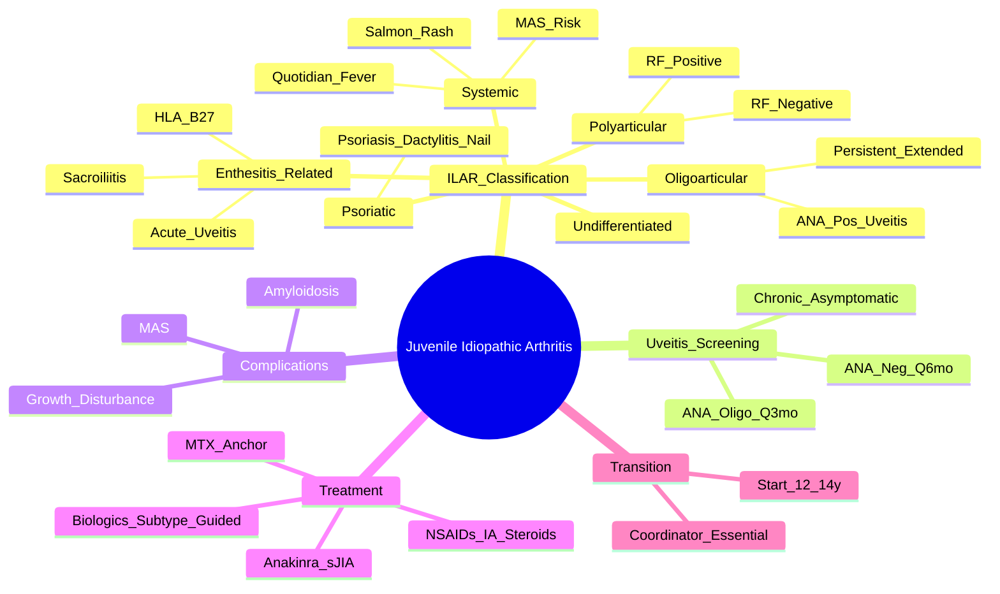

# Juvenile Idiopathic Arthritis (JIA) — Overview

> [!tip] **FCPS/MRCP Priority: HIGH**
> JIA = **most common chronic arthritis in children** (<16y). **ILAR classification (7 subtypes)**. **Systemic JIA = autoinflammatory** (quotidian fever, rash, MAS risk). **Oligoarticular = high uveitis risk**. **Polyarticular RF+ = resembles adult RA**. **Enthesitis-related = HLA-B27+ SpA spectrum**. High-yield for FCPS/MRCP differential.

---

## Learning Objectives
By the end of this note you should be able to:
- [ ] Classify JIA using ILAR criteria (7 categories) and apply to clinical vignettes
- [ ] Differentiate subtypes by age, joint pattern, autoantibodies, and extra-articular features
- [ ] Implement uveitis screening protocols (ANA+, oligoarticular = highest risk)
- [ ] Recognise and manage **Macrophage Activation Syndrome (MAS)** — ferritin >10,000, cytopenias
- [ ] Select treatment by subtype and disease activity (NSAIDs → csDMARDs → biologics)
- [ ] Apply transition care principles for adolescent patients

---

## 1. Definition & Epidemiology

| Feature | Detail |
|---------|--------|
| **Definition** | **Chronic arthritis** ≥6 weeks, onset **<16 years**, **idiopathic** (excluded other causes) |
| **Incidence** | 10-20/100,000/year |
| **Prevalence** | 20-150/100,000 |
| **Peak Onset** | **1-6 years** (systemic/oligo), **8-12 years** (poly/enthesis) |
| **Sex Ratio** | **F > M** (except enthesitis-related: M > F) |

---

## 2. ILAR Classification — 7 Subtypes

| Subtype | Age | Joints | Key Features | Autoantibodies | FHx |
|---------|-----|--------|--------------|----------------|-----|
| **1. Systemic JIA** | Any (peak 1-5y) | Variable (≥6wks after fever) | **Quotidian fever** (spiking once/twice daily), **salmon-pink evanescent rash**, hepatosplenomegaly, lymphadenopathy, serositis | **ANA/RF negative** | Low |
| **2. Oligoarticular** | **<6y** (peak 2-4y) | **1-4 joints** in first 6m | Asymmetric large joints (knee > ankle), **high uveitis risk** (ANA+), **asymmetric leg length** | **ANA+ (60-80%)**, RF- | Low |
| **Extended Oligoarticular** | | **>4 joints after 6m** | Higher uveitis risk, joint damage | ANA+ | |
| **3. Polyarticular RF-** | 1-16y | **≥5 joints** in first 6m | Symmetric small + large joints, ANA+ common, **growth disturbance** | **ANA+ (50-60%)**, RF- | Moderate |
| **4. Polyarticular RF+** | **>10y** (adolescent) | **≥5 joints** in first 6m | **Resembles adult RA**: symmetric, erosive, RF/anti-CCP+, nodules | **RF+** (≥2 occasions), anti-CCP+ | High |
| **5. Psoriatic JIA** | 6-12y | Variable | **Psoriasis + arthritis** OR arthritis + **2 of**: dactylitis, nail changes, psoriasis FHx | RF- | High (PsO) |
| **6. Enthesitis-related** | **>6y** (adolescent) | Variable (axial + peripheral) | **HLA-B27+**, enthesitis, sacroiliitis, **M > F**, uveitis (acute) | RF-, ANA- | High (SpA) |
| **7. Undifferentiated** | Any | Doesn't fit above or fits >1 category | | | |

> [!critical] **ILAR Criteria: ≥6 weeks arthritis, onset <16y, exclusion of other causes**

---

## 3. Subtype Deep Dives

### Systemic JIA (sJIA) — **Autolinflammatory**
| Feature | Detail |
|---------|--------|
| **Cardinal Triad** | **Quotidian fever** (spiking once/twice daily >39°C), **salmon-pink evanescent rash** (trunk/proximal limbs), **arthritis** (may lag weeks) |
| **Other** | Hepatosplenomegaly, lymphadenopathy, serositis, leukocytosis, high ESR/CRP, **ferritin >>1000**, glycosylated ferritin <20% |
| **Complication** | **MAS (Macrophage Activation Syndrome)** — HLH-like, **ferritin >10,000**, pancytopenia, coagulopathy, hypertriglyceridaemia, liver dysfunction, CNS involvement |
| **Autoantibodies** | **ANA/RF negative** |
| **Treatment** | **IL-1 blockade (anakinra/canakinumab)** 1st line; **IL-6 blockade (tocilizumab)**; steroids; MTX; **early biologics = better outcome** |

> [!critical] **sJIA = Autoinflammatory (not autoimmune)** — IL-1/IL-6/IL-18 driven; MAS = life-threatening

### Oligoarticular JIA
| Feature | Detail |
|---------|--------|
| **Joints** | **1-4** in first 6m; **asymmetric large joints** (knee > ankle > elbow) |
| **Uveitis Risk** | **Chronic anterior uveitis** — **ANA+ = high risk (20-30%)**; asymptomatic, insidious |
| **Screening** | **Slit-lamp every 3 months** (ANA+), every 6 months (ANA-) for 7y, then annually |
| **Leg Length Discrepancy** | **Asymmetric growth** → hemihypertrophy → limb length inequality |
| **Extended Oligo** | >4 joints after 6m → higher uveitis risk, joint damage |

### Polyarticular JIA RF-pos
| Feature | Detail |
|---------|--------|
| **Resembles Adult RA** | Symmetric small joints (MCP, PIP, wrists), **erosive**, **RF+ (≥2 occasions)**, **anti-CCP+**, nodules |
| **Age** | **Adolescent (>10y)** |
| **Treatment** | **Methotrexate 1st line** → **anti-TNF/biologics** if inadequate |

### Enthesitis-related Arthritis (ERA)
| Feature | Detail |
|---------|--------|
| **Demographics** | **>6 years, M > F** |
| **Genetics** | **HLA-B27+ (60-80%)** |
| **Features** | Enthesitis (Achilles, plantar), **sacroiliitis**, peripheral arthritis (asymmetric lower limb), **acute anterior uveitis** (painful, photophobia) |
| **Spectrum** | **Juvenile SpA** — can evolve to AS, PsA, IBD-associated |
| **Autoantibodies** | **ANA/RF negative** |

---

## 4. Uveitis Screening — **Critical for FCPS/MRCP**

| Subtype | Screening Interval |
|---------|-------------------|
| **Oligoarticular ANA+** | **Every 3 months** (highest risk) |
| **Oligoarticular ANA-** | Every 6 months |
| **Polyarticular RF-** | Every 6 months |
| **Psoriatic JIA** | Every 6-12 months |
| **Enthesitis-related** | Every 6 months (acute uveitis — symptomatic) |
| **Systemic JIA** | Low risk (usually no chronic uveitis) |

> [!critical] **Chronic anterior uveitis = ASYMPTOMATIC** — requires scheduled slit-lamp exams
> - **Acute anterior uveitis = SYMPTOMATIC** (pain, red eye, photophobia) — ERA, HLA-B27+

---

## 5. Complications

| Complication | Subtype | Key Features |
|--------------|---------|--------------|
| **MAS** | **Systemic JIA** | **Ferritin >10,000**, pancytopenia, coagulopathy, hypertriglyceridaemia, liver dysfunction, CNS dysfunction |
| **Growth Disturbance** | All | **Leg length discrepancy** (oligo), **micrognathia** (TMJ), **short stature** |
| **Amyloidosis (AA)** | **Untreated sJIA/Poly** | Renal, GI, cardiac |
| **TMJ Arthritis** | Polyarticular | Micrognathia, malocclusion |

---

## 5. Treatment Algorithms

```mermaid
flowchart TD
    A[JIA Diagnosis + Subtype] --> B{Systemic JIA?}
    B -->|Yes| C[**Anakinra/Canakinumab** (IL-1) 1st line\nOR Tocilizumab (IL-6)\nSteroids bridge\nMTX if chronic]
    B -->|No| D{Oligoarticular?}
    D -->|Yes| E[NSAIDs + IA steroids\nMTX if extended/persistent\n**Uveitis screen q3-6mo**]
    D -->|No| F{Polyarticular?}
    F -->|RF+| G[**MTX 1st line**\n→ Anti-TNF/IL-6/Abatacept\nResembles adult RA]
    F -->|RF-| H[MTX 1st line\n→ Biologics if inadequate\nUveitis screen]
    F -->|Enthesitis-related| I[NSAIDs → SSZ/MTX\nAnti-TNF if axial/sacroiliitis\nHLA-B27 screen]
    F -->|Psoriatic JIA| J[MTX/SSZ → Biologics\nTreat skin + joints\nUveitis screen]
```

### Pharmacotherapy by Line
| Line | Agents | Notes |
|------|--------|-------|
| **1st** | **NSAIDs** (naproxen, ibuprofen), **IA steroids** (triamcinolone) | Joint-specific, bridge |
| **2nd (csDMARD)** | **Methotrexate** (10-15mg/m²/week) — **anchor**; **Sulfasalazine** (ERA, PsA); **Leflunomide** | MTX = anchor for poly/oligo extended |
| **3rd (Biologics)** | **Anti-TNF** (etanercept, adalimumab), **IL-6** (tocilizumab — esp. sJIA), **IL-1** (anakinra/canakinumab — sJIA), **Abatacept**, **Rituximab** | Subtype-guided |
| **Advanced** | **JAK inhibitors** (tofacitinib — off-label), **HSCT** (refractory MAS) | Specialist |

---

## 6. Macrophage Activation Syndrome (MAS) — **Emergency**

| Feature | Detail |
|---------|--------|
| **Trigger** | Infection, flare, drug change (esp. in sJIA) |
| **Diagnosis (HLH-2004 adapted)** | **Ferritin >10,000** + **≥2 cytopenias** + **hypertriglyceridaemia** + **hypofibrinogenaemia** + **high LDH** + **CNS dysfunction** + **hemophagocytosis** (bone marrow) |
| **Immediate Management** | **IV MP 10-30mg/kg/day ×3-5d** + **Anakinra 4-10mg/kg/day IV/SC** + **IVIG** + **Ciclosporin A** + **Etoposide** (refractory) |

> [!critical] **MAS Mortality ~20-30%** — early recognition and anakinra life-saving

---

## 7. Transition Care — **FCPS/MRCP High-Yield**

| Aspect | Detail |
|--------|--------|
| **Timing** | Start **12-14 years**; complete by **18 years** |
| **Key Elements** | Disease education, self-management, medication adherence, reproductive health, vocational planning, adult rheumatology handover |
| **Transition Coordinator** | Essential (nurse specialist) |
| **Adult Rheumatology** | Continued uveitis screening, bone health, cardiovascular risk |

---

## 8. FCPS/MRCP High-Yield Summary

| Topic | Key Points |
|-------|------------|
| **ILAR 7 Subtypes** | Systemic, Oligo (persistent/extended), Poly RF-, Poly RF+, Psoriatic, Enthesitis-related, Undifferentiated |
| **Systemic JIA** | **Quotidian fever + salmon rash + arthritis** = classic; **IL-1/IL-6 driven**; **MAS risk** (ferritin >10k) |
| **Oligoarticular** | **<6y, 1-4 joints, asymmetric knee/ankle**, **ANA+ = high uveitis risk** (screen q3mo) |
| **Polyarticular RF+** | **Adolescent, mimics adult RA**, RF/anti-CCP+, erosive, MTX → anti-TNF |
| **Enthesitis-related** | **HLA-B27+**, M>F, >6y, enthesitis, sacroiliitis, acute uveitis |
| **Psoriatic JIA** | Psoriasis/arthritis + dactylitis/nail/FHx |
| **Uveitis Screening** | **ANA+ oligo = q3mo**; ANA- = q6mo; chronic uveitis = asymptomatic |
| **MAS** | **Ferritin >10,000 + cytopenias + coagulopathy** → **IV MP + Anakinra (IL-1Ra)** |
| **Transition** | Start 12-14y, complete 18y; coordinator essential |

---

## 9. Viva Questions (MRCP PACES / FCPS)

| Question | Expected Answer |
|----------|----------------|
| "A 4yo girl has 3 months of right knee swelling, ANA 1:320. No fever/rash. Diagnosis and screening?" | **Oligoarticular JIA (ANA+)**. **Slit-lamp every 3 months** for chronic anterior uveitis (asymptomatic). Monitor for leg length discrepancy. |
| "What is the classic triad of systemic JIA?" | **Quotidian fever (spiking once/twice daily) + salmon-pink evanescent rash + arthritis**. |
| "A 14yo boy has heel pain, lower back pain, HLA-B27+. Diagnosis and association?" | **Enthesitis-related arthritis (ERA)**. **HLA-B27+ (60-80%)**, enthesitis (Achilles), sacroiliitis, acute anterior uveitis. Can evolve to AS. |
| "What is MAS and how do you diagnose it in a child with sJIA?" | **Macrophage Activation Syndrome** — HLH-like. **Ferritin >10,000**, cytopenias (≥2 lineages), hypertriglyceridaemia, hypofibrinogenaemia, high LDH, CNS dysfunction. **Ferritin >10,000 = highly specific**. |
| "What is the first-line biologic for systemic JIA?" | **Anakinra (IL-1 receptor antagonist)** or **Canakinumab (anti-IL-1β)**. **Tocilizumab (IL-6R)** alternative. Steroids as bridge. |
| "How do you screen for uveitis in JIA?" | **ANA+ oligoarticular: every 3 months**. ANA- oligo/poly: every 6 months. Chronic uveitis is **asymptomatic** — requires scheduled slit-lamp. |
| "An adolescent has polyarticular arthritis, RF+, anti-CCP+. Diagnosis and treatment?" | **Polyarticular JIA RF+**. Resembles adult RA. **Methotrexate 1st line** → **Anti-TNF** (etanercept/adalimumab) if inadequate. |
| "What is the difference between systemic JIA and Adult-onset Still's disease?" | **Same disease spectrum**. sJIA = onset <16y, AOSD = ≥16y. Same pathophysiology (IL-1/IL-6), MAS risk, treatment. |

---

## 10. Confusions & Mnemonics

| Confusion | Clarification |
|-----------|---------------|
| **Systemic JIA vs AOSD** | **Same disease spectrum** — sJIA = onset <16y, AOSD = ≥16y. Same IL-1/IL-6 pathophysiology, MAS risk, treatment. |
| **Oligoarticular vs Polyarticular** | Oligo = **1-4 joints in first 6m**. Poly = **≥5 joints in first 6m**. Extended oligo = >4 joints after 6m. |
| **Chronic vs Acute Uveitis** | **Chronic = asymptomatic** (ANA+ oligo), needs screening. **Acute = painful, red, photophobic** (HLA-B27+ ERA). |
| **RF+ Polyarticular vs Adult RA** | **Same disease** — RF/anti-CCP+, erosive, symmetric small joints. Adolescent onset. |
| **sJIA vs Kawasaki** | sJIA = quotidian fever, rash, arthritis, **no coronary aneurysms**. Kawasaki = fever ≥5d + 4/5 criteria, **coronary aneurysms**. |
| **MAS vs Sepsis** | MAS = **ferritin >>10,000**, cytopenias, hypertriglyceridaemia, **normal/low procalcitonin**. Sepsis = **procalcitonin ↑, hypotension, culture +ve**. |

**Mnemonic: ILAR Subtypes = "SO-OP-PE-PS-EN-UN"**
- **S**ystemic
- **O**ligoarticular
- **O**ligo extended
- **P**oly RF-
- **P**oly RF+
- **P**soriatic
- **E**nthesitis-related
- **U**ndifferentiated

**Mnemonic: sJIA = "F-R-A"**
- **F**ever (quotidian, spiking)
- **R**ash (salmon-pink, evanescent)
- **A**rthritis (≥6wks after fever)

**Mnemonic: MAS = "FERRI-CYTO"**
- **FERRI**tin >10,000
- **CYTO**penias (≥2 lineages)
- **HYPER**triglyceridaemia / **HYPO**fibrinogenaemia
- **HIGH** LDH

**Mnemonic: Uveitis Screening = "ANA-POS = Q3MO"**
- **ANA**+ **Oligo** = **Q**uarterly (3 months)
- **ANA**- = **6** months

**Mnemonic: JIA Subtypes = "Kids PLAY Sports"**
- **K**ids (Systemic)
- **L**eg (Oligo)
- **A**rthritis (Poly)
- **Y**oung (Enthesitis-related)
- **S**kin (Psoriatic)

---

## 11. Mind Map



---

## 12. One-Page Revision Card

| Domain | Key Points |
|--------|------------|
| **Definition** | Chronic arthritis ≥6wks, onset <16y, idiopathic |
| **ILAR 7 Subtypes** | Systemic, Oligo (persistent/extended), Poly RF-/RF+, Psoriatic, Enthesitis-related, Undifferentiated |
| **Systemic JIA** | Quotidian fever + salmon rash + arthritis; IL-1/IL-6 driven; **MAS risk** |
| **Oligoarticular** | <6y, 1-4 joints, asymmetric knee/ankle, **ANA+ = high uveitis risk** |
| **Polyarticular RF+** | Adolescent, **mimics adult RA**, RF/CCP+, erosive |
| **Enthesitis-related** | HLA-B27+, M>F, >6y, enthesitis, sacroiliitis, acute uveitis |
| **Uveitis Screen** | **ANA+ oligo = q3mo**; ANA- = q6mo; sJIA low risk |
| **MAS** | Ferritin >10,000 + cytopenias + coagulopathy; **Anakinra 1st line biologic** |
| **sJIA Rx** | **Anakinra/Canakinumab (IL-1)** 1st; Tocilizumab (IL-6) 2nd; Steroids bridge |
| **Transition** | Start 12-14y, complete 18y; coordinator essential |

---

## 13. Spaced Repetition Trackers

| Review Interval | Date Completed | Confidence (1-5) | Notes |
|-----------------|----------------|------------------|-------|
| 24 hours | | | |
| 7 days | | | |
| 15 days | | | |
| 30 days | | | |
| 90 days | | | |

---

## 14. Self-Test Scorecard

| Section | Score /5 | Last Attempt |
|--------|----------|--------------|
| ILAR Classification | | |
| Subtype Differentiation | | |
| Uveitis Screening Protocols | | |
| MAS Recognition & Management | | |
| Subtype-Specific Treatment | | |
| Transition Care | | |
| Viva Questions | | |

---

## Local Navigation
- **Parent Heading**: [[../Inflammatory Arthritis|Inflammatory Arthritis]]
- **Parent Topic Group**: [[Juvenile idiopathic arthritis overview]]
- **Chapter Map**: [[../Davidson Chapter 26 - Rheumatology Hierarchy|Rheumatology Hierarchy]]
- **Chapter MOC**: [[../Rheumatology MOC|Rheumatology MOC]]
- **Drug Reference**: [[../../Clinical Approach to Musculoskeletal Disease/Drugs in rheumatology|Drugs in rheumatology]]
- **Related**: [[Adult-onset Still's disease]] · [[Ankylosing spondylitis]] · [[Psoriatic arthritis]] · [[Systemic Lupus Erythematosus]]