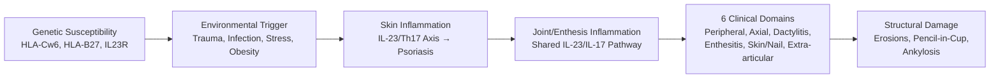
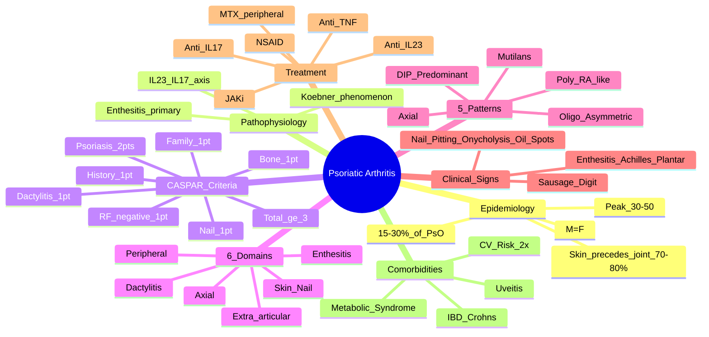

# Psoriatic Arthritis (PsA)

> [!tip] **FCPS/MRCP Priority: CRITICAL**
> PsA = **spondyloarthritis with psoriasis**. CASPAR classification, 6 domains (joints, skin, nail, dactylitis, enthesitis, extra-articular), distinct patterns (DIP, mutilans). Biologics: anti-TNF → anti-IL-17/23. Guaranteed viva/SBA/OSCE topic.

---

## Learning Objectives
By the end of this note you should be able to:
- [ ] Apply CASPAR classification criteria for PsA
- [ ] Describe the 6 clinical domains and 5 joint patterns
- [ ] Recognise characteristic nail changes and dactylitis
- [ ] Select treatment sequence: NSAID → csDMARD → biologic (anti-TNF → anti-IL-17/23)
- [ ] Differentiate PsA from RA, OA, gout, reactive arthritis
- [ ] Monitor disease activity (DAPSA, PASDAS) and comorbidities (CV risk)

---

## 1. Definition & Epidemiology

| Feature | Detail |
|---------|--------|
| **Definition** | Chronic inflammatory arthritis associated with **psoriasis** — seronegative spondyloarthritis with distinct clinical domains |
| **Prevalence in Psoriasis** | **15-30%** of psoriasis patients develop PsA |
| **Overall Prevalence** | 0.1-0.3% |
| **Peak Onset** | **30-50 years** (10 years after psoriasis onset typically) |
| **Sex Ratio** | **M = F** |
| **Genetics** | HLA-B27 (20-50% axial), HLA-C*06:02 (psoriasis), IL23R, TNFAIP3; **40% family history** |
| **Skin-Joint Interval** | Psoriasis precedes arthritis in **70-80%**; simultaneous in 15%; arthritis first in 10-15% |

---

## 2. Aetiology & Pathophysiology



### Key Concepts
| Concept | Detail |
|---------|--------|
| **IL-23/IL-17 axis** | Central to both skin and joint inflammation — **anti-IL-17/23 highly effective** |
| **Enthesitis as primary lesion** | Enthesis resident immune cells → inflammation → adjacent joint/synovium |
| **Koebner phenomenon** | Trauma triggers psoriatic lesions — applies to joints (dactylitis after injury) |
| **Skin-Joint discordance** | Skin and joint activity may not parallel — treat both domains |

---

## 3. Clinical Features — The 6 Domains

| Domain | Features | Assessment |
|--------|----------|------------|
| **1. Peripheral Arthritis** | Inflammatory (pain, swelling, stiffness); asymmetrical or symmetrical | 66/68 joint count; DAPSA |
| **2. Axial Disease** | Inflammatory back pain, sacroiliitis (asymmetric) | BASDAI, ASDAS, imaging |
| **3. Dactylitis** | **'Sausage digit'** — diffuse swelling of entire digit (flexor tenosynovitis + synovitis) | Leeds Dactylitis Index (LDI) |
| **4. Enthesitis** | Tenderness at insertions: **Achilles, plantar fascia, costochondral, iliac crest** | SPARCC, LEI, MASES |
| **5. Skin & Nail** | **Current psoriasis** (2 pts CASPAR), nail pitting, onycholysis, oil spots | PASI, NAPSI |
| **6. Extra-Articular** | **Uveitis** (acute anterior, 7-20%), IBD, CV risk | Ophthalmology, gastro |

---

## 4. Joint Patterns (5 Patterns)

| Pattern | Frequency | Key Features |
|---------|-----------|--------------|
| **1. DIP Predominant** | **Classic** (20-30%) | **DIP > PIP**, associated with **nail changes**; M > F |
| **2. Oligoarticular Asymmetrical** | 30-40% | ≤4 joints, lower limb > upper, **asymmetric** |
| **3. Polyarticular (RA-like)** | 20-30% | ≥5 joints, **symmetrical**, MCP/PIP/wrist — mimic RA |
| **4. Axial / Spondylitis** | 20-50% | **Asymmetric sacroiliitis**, cervical/thoracic involvement, **cervical fusion** |
| **5. Arthritis Mutilans** | <5% | **Severe destructive** — osteolysis → **"pencil-in-cup"**, **telescoping digits**, opera glass hand |

> [!important] **Pattern Overlap**
> - Patients often have **multiple patterns simultaneously**
> - Pattern can **change over time**

---

## 5. Characteristic Clinical Signs

### Nail Changes (80% PsA) — **Correlate with DIP Disease**
| Sign | Description | Specificity |
|------|-------------|-------------|
| **Pitting** | Pinpoint depressions in nail plate | 70% PsA; also in psoriasis alone |
| **Onycholysis** | Separation of nail plate from bed (distal/lateral) | High |
| **Subungual Hyperkeratosis** | Thickening under nail | High |
| **Oil Spots (Salmon Patches)** | Translucent yellow-red discoloration | High |
| **Nail Dystrophy** | Crumbling, ridging, discoloration | Non-specific |

### Dactylitis ('Sausage Digit')
- **Diffuse swelling** of entire digit (dorsal + volar)
- **Flexor tenosynovitis + synovitis** of adjacent joints
- **Asymmetric**, often feet > hands
- **Leeds Dactylitis Index (LDI)**: circumference + tenderness score

### Enthesitis
| Site | Clinical |
|------|----------|
| Achilles tendon insertion | Posterior heel pain, swelling |
| Plantar fascia insertion | Plantar heel pain (worst AM) |
| Costochondral joints | Anterior chest wall pain |
| Iliac crest / ischial tuberosity | Buttock/hip pain |
| **SPARCC/MASES/LEI** | Standardised enthesitis indices |

---

## 6. Classification — CASPAR Criteria (2006)

**Entry:** Inflammatory articular disease (joint, spine, or enthesis)

| Criterion | Points |
|-----------|--------|
| **Current psoriasis** (diagnosed by dermatologist/rheumatologist) | **2** |
| **Personal history of psoriasis** (patient report) | 1 |
| **Family history of psoriasis** (1st/2nd degree relative) | 1 |
| **Nail dystrophy** (pitting, onycholysis, hyperkeratosis on exam) | 1 |
| **Dactylitis** (current or history, recorded by rheumatologist) | 1 |
| **Negative RF** (by any method except latex which is <40 IU/mL) | 1 |
| **Juxta-articular new bone formation** (X-ray: ill-defined ossification near joints) | 1 |

**≥3 Points = PsA** (Sensitivity 91%, Specificity 98%)

> [!critical] **CASPAR Pearls**
> - **Current psoriasis = 2 points** (major weight)
> - **Negative RF mandatory context** — but not mandatory to have (just 1 point if negative)
> - **Psoriasis history** = patient report accepted (1 point)
> - **Family history** = 1st/2nd degree relative (1 point)

---

## 7. Differential Diagnosis

| Condition | Distinguishing Features |
|-----------|------------------------|
| **Rheumatoid Arthritis** | **Symmetrical MCP/PIP/wrist**, **+RF/anti-CCP**, no skin/nail/dactylitis/enthesitis, erosive (marginal) |
| **Osteoarthritis** | **DIP nodes (Heberden's)**, **1st CMC squaring**, **mechanical pain**, **no inflammation**, normal ESR/CRP |
| **Gout** | **Acute monoarticular**, **MSU crystals**, hyperuricaemia, tophi (chronic) — can coexist with PsA |
| **Reactive Arthritis** | **Post-infectious** (GU/GI), **conjunctivitis/urethritis**, HLA-B27+, **no psoriasis**, asymmetric oligoarthritis |
| **Ankylosing Spondylitis** | **Axial predominant**, symmetric sacroiliitis, no skin/nail, HLA-B27 90% |
| **Enteropathic Arthritis** | **IBD** (Crohn's/UC), axial in 20%, peripheral asymmetric |
| **SAPHO Syndrome** | Sternocostoclavicular hyperostosis, acne/pustulosis, no psoriasis |

---

## 8. Imaging

| Modality | Findings |
|----------|----------|
| **X-ray** | **Pencil-in-cup** (DIP mutilans), **periostitis** (fluffy), **asymmetric sacroiliitis**, **ankylosis**, **bone proliferation** |
| **Ultrasound** | Synovitis (power Doppler), **enthesitis** (tendon thickening, calcifications), **dactylitis** (flexor tenosynovitis), nail changes |
| **MRI** | Bone marrow oedema (entheses, SI joints), synovitis, tenosynovitis |

> [!important] **X-ray PsA vs RA**
> - **PsA**: Pencil-in-cup, periostitis, **asymmetric sacroiliitis**, DIP involvement, **bone proliferation** (not just erosion)
> - **RA**: Uniform JSN, marginal erosions, **symmetric**, MCP/PIP/wrist, **no bone proliferation**

---

## 9. Management

```mermaid
flowchart TD
    A[PsA Diagnosis] --> B[Assess Domains:\nPeripheral, Axial, Dactylitis, Enthesitis, Skin, Nail]
    B --> C[Core: PT/OT, Education, Skin Care\n(Dermatology co-management)]
    C --> D{Peripheral Arthritis\nPredominant?}
    D -->|Yes| E[NSAIDs ± Local Steroid\n(earliest)]
    E --> F{Inadequate\nResponse}
    F -->|Yes| G[csDMARD: MTX 1st\n(SSZ/LEF alternatives)]
    G --> H{Inadequate\nResponse}
    H -->|Yes| I[Biologic]
    D -->|No (Axial/Dactylitis/\nEnthesitis predominant)| J[NSAIDs → Biologic Direct\n(csDMARDs ineffective for axial/dactylitis/enthesitis)]
    I --> I1[Anti-TNF 1st\n(Adalimumab, Etanercept, Infliximab, Certolizumab, Golimumab)]
    I1 --> I2[Anti-IL-17\n(Secukinumab, Ixekizumab, Bimekizumab)]
    I2 --> I3[Anti-IL-23\n(Guselkumab, Risankizumab)]
    I3 --> K[Inadequate Response?]
    K -->|Yes| L[Switch Mechanism\nAnti-TNF → IL-17 → IL-23\nor JAKi]
    K -->|No| M[Continue + Monitor\nDAPSA/PASDAS + PASI/NAPSI]
```

### Peripheral Arthritis — Step-Up
| Step | Drug | Details |
|------|------|---------|
| **1. NSAIDs** | COX-2 preferred | Symptomatic; ± local IA steroid |
| **2. csDMARD** | **MTX 1st** (15-25mg weekly) | **Anchor for peripheral**; ± SSZ/LEF; **ineffective for axial/dactylitis/enthesitis** |
| **3. Biologic** | **Anti-TNF 1st** (adalimumab, etanercept, certolizumab SC) | **Skin + joint efficacy**; TB screen mandatory |
| **4. Anti-TNF Fail** | **Anti-IL-17** (secukinumab 150mg/300mg, ixekizumab 80mg q4wk, bimekizumab 160mg q4wk) | **Superior skin clearance**; ∉ IBD |
| **5. Further Fail** | **Anti-IL-23** (guselkumab 100mg q8wk, risankizumab 150mg q12wk) | Skin + joint; long dosing interval |
| **6. JAKi** | **Upadacitinib 15mg daily** | Oral; VTE risk assessment |

### Axial / Dactylitis / Enthesitis Predominant
- **csDMARDs INEFFECTIVE** → **NSAIDs → Biologic directly**
- **Anti-TNF** or **Anti-IL-17** (both effective for axial)
- **Anti-IL-23** — limited axial data (guselkumab approved for PsA axial)

### Monitoring
| Tool | Domains |
|------|---------|
| **DAPSA** (Disease Activity in PsA) | Peripheral joints (66/68), Pt global, pain, CRP |
| **PASDAS** (PsA Disease Activity Score) | All 6 domains (joints, skin, nail, dactylitis, enthesitis, CRP) |
| **PASI** | Skin |
| **NAPSI** | Nails |
| **SPARCC/MASES/LEI** | Enthesitis |
| **LDI** | Dactylitis |
| **BASDAI/ASDAS** | If axial predominant |

---

## 10. Comorbidities

| Comorbidity | Prevalence | Management |
|-------------|------------|------------|
| **Cardiovascular** | **2x risk** vs general pop | **Aggressive risk factor modification**; statin per guidelines |
| **Metabolic Syndrome** | 40-50% | Weight loss, glucose/lipid control |
| **IBD** | 5-10% | Gastroenterology; avoid anti-IL-17 if Crohn's |
| **Depression/Anxiety** | 20-30% | Screen (PHQ-9/GAD-7); treat |
| **Uveitis** | 7-20% | Acute anterior; ophthalmology co-management |
| **Osteoporosis** | Increased | DEXA if steroids/prolonged inflammation |

---

## 11. FCPS/MRCP High-Yield Summary

| Topic | Key Points |
|-------|------------|
| **Prevalence** | 15-30% of psoriasis; peak 30-50y; M=F |
| **CASPAR Criteria** | **≥3 points**: Current psoriasis (2), history (1), family (1), nail dystrophy (1), dactylitis (1), -RF (1), new bone (1) |
| **6 Domains** | Peripheral, Axial, Dactylitis, Enthesitis, Skin/Nail, Extra-articular (uveitis) |
| **5 Joint Patterns** | DIP predominant, Oligo asymmetrical, Poly RA-like, Axial, Mutilans (pencil-in-cup) |
| **Nail Signs** | **Pitting (70%)**, onycholysis, oil spots, hyperkeratosis — **correlate with DIP** |
| **Dactylitis** | **Sausage digit** — flexor tenosynovitis + synovitis |
| **Enthesitis** | Achilles, plantar fascia, costochondral — **SPARCC/MASES** |
| **Imaging** | **Pencil-in-cup**, periostitis, **asymmetric sacroiliitis** |
| **Treatment** | NSAID → **MTX (peripheral)** → **Anti-TNF** → **Anti-IL-17/23** → JAKi |
| **csDMARDs** | **Ineffective for axial/dactylitis/enthesitis** |
| **Anti-IL-17** | **Superior skin**; avoid in Crohn's IBD |
| **CV Risk** | 2x — aggressive prevention |

---

## 12. Viva Questions (MRCP PACES / FCPS)

| Question | Expected Answer |
|----------|----------------|
| "A 40yo man with psoriasis has asymmetrical oligoarthritis, sausage digit (2nd toe), nail pitting. RF negative. Diagnose and classify." | **Psoriatic Arthritis**. CASPAR: current psoriasis (2) + nail dystrophy (1) + dactylitis (1) + negative RF (1) = **5 points** (≥3 = PsA). Domains: peripheral, dactylitis, enthesitis, skin/nail. |
| "What are the CASPAR criteria for PsA?" | Inflammatory articular disease + ≥3 points: current psoriasis (2), personal history (1), family history (1), nail dystrophy (1), dactylitis (1), negative RF (1), juxta-articular new bone (1). |
| "What are the 6 domains of PsA?" | 1) Peripheral arthritis, 2) Axial disease, 3) Dactylitis, 4) Enthesitis, 5) Skin & Nail, 6) Extra-articular (uveitis). |
| "A PsA patient on MTX has inadequate response. What biologic do you choose?" | **Anti-TNF 1st line** (adalimumab/etanercept/certolizumab) — effective for joints + skin. TB screen mandatory. |
| "Same patient has Crohn's disease. Which biologic do you avoid?" | **Avoid anti-IL-17 (secukinumab/ixekizumab/bimekizumab)** — flares Crohn's. **Use anti-TNF** (adalimumab/infliximab effective for both). |
| "What is the classic X-ray finding in PsA arthritis mutilans?" | **Pencil-in-cup** deformity (osteolysis → telescoping digits). Also periostitis, asymmetric sacroiliitis. |
| "How does PsA imaging differ from RA?" | PsA: **pencil-in-cup, periostitis, asymmetric SI joints, bone proliferation, DIP involvement**. RA: uniform JSN, marginal erosions, symmetric, MCP/PIP, no proliferation. |
| "What enthesitis indices are used in PsA?" | **SPARCC** (16 sites), **MASES** (6 sites: Achilles, plantar fascia), **LEI** (Leeds Enthesitis Index, 6 sites). |
| "What is the monitoring tool for PsA that includes all 6 domains?" | **PASDAS** (PsA Disease Activity Score) — incorporates joints, skin, nail, dactylitis, enthesitis, CRP. DAPSA = peripheral only. |

---

## 13. Confusions & Mnemonics

| Confusion | Clarification |
|-----------|---------------|
| **PsA vs RA (polyarticular pattern)** | PsA: asymmetrical or symmetrical, **RF/CCP negative**, skin/nail/dactylitis/enthesitis, DIP involvement, pencil-in-cup. RA: symmetrical MCP/PIP/wrist, **RF/CCP positive**, no skin/nail/dactylitis. |
| **CASPAR: Current vs History Psoriasis** | **Current psoriasis = 2 points** (diagnosed by physician). **History = 1 point** (patient report). Family history = 1 point. |
| **csDMARDs for axial PsA** | **Ineffective** — MTX, SSZ, LEF don't work for spinal inflammation. Use NSAIDs → Biologic (anti-TNF or anti-IL-17). |
| **Anti-IL-17 in IBD** | **Contraindicated in Crohn's** (flares disease). Safe in UC. Use anti-TNF for PsA + Crohn's. |
| **Dactylitis vs Gout/Infection** | Dactylitis: diffuse swelling entire digit, tender, **flexor tenosynovitis** on US. Gout: acute, crystals. Infection: fever, acute, purulent. |
| **Pencil-in-cup** | **PsA mutilans** (also late RA) — osteolysis of proximal phalanx → "pencil" into "cup" of distal. |

**Mnemonic: CASPAR = "P2-H-F-N-D-R-B"**
- **P**soriasis current **2** points
- **H**istory personal 1
- **F**amily history 1
- **N**ail dystrophy 1
- **D**actylitis 1
- **R**F negative 1
- **B**one (juxta-articular) 1

**Mnemonic: 6 Domains = "P-A-D-E-S-E"**
- **P**eripheral arthritis
- **A**xial disease
- **D**actylitis
- **E**nthesitis
- **S**kin & Nail
- **E**xtra-articular (uveitis)

**Mnemonic: 5 Patterns = "D-O-P-A-M"**
- **D**IP predominant
- **O**ligoarticular asymmetric
- **P**olyarticular (RA-like)
- **A**xial / Spondylitis
- **M**utilans (pencil-in-cup)

**Mnemonic: Nail Signs = "P-O-O-H"**
- **P**itting (70%)
- **O**nycholysis
- **O**il spots (salmon patches)
- **H**yperkeratosis (subungual)

**Mnemonic: Biologic Sequence = "T-I-23-J"**
- **T**NF (1st line)
- **I**L-17 (2nd line; best skin; avoid Crohn's)
- **23** = IL-23 (3rd line; skin + joint)
- **J**AKi (option)

---

## 14. Mind Map



---

## 15. One-Page Revision Card

| Domain | Key Points |
|--------|------------|
| **Prevalence** | 15-30% psoriasis, peak 30-50y, M=F, skin precedes joint 70-80% |
| **CASPAR** | Inflammatory articular disease + **≥3 pts**: current psoriasis (2), history (1), family (1), nail (1), dactylitis (1), -RF (1), new bone (1) |
| **6 Domains** | Peripheral, Axial, Dactylitis, Enthesitis, Skin/Nail, Extra-articular (uveitis) |
| **5 Patterns** | DIP predominant, Oligo asymmetric, Poly RA-like, Axial, Mutilans (pencil-in-cup) |
| **Nail Signs** | **Pitting (70%)**, onycholysis, oil spots, hyperkeratosis — correlate with DIP |
| **Dactylitis** | Sausage digit — flexor tenosynovitis + synovitis |
| **Enthesitis** | Achilles, plantar fascia, costochondral — SPARCC/MASES |
| **Imaging** | Pencil-in-cup, periostitis, asymmetric sacroiliitis |
| **Treatment** | NSAID → **MTX (peripheral)** → **Anti-TNF** → **Anti-IL-17/23** → JAKi |
| **csDMARDs** | **Ineffective for axial/dactylitis/enthesitis** |
| **Anti-IL-17** | Best skin; **avoid in Crohn's** |
| **CV Risk** | 2x population — aggressive prevention |
| **Monitoring** | PASDAS (all domains), DAPSA (peripheral), PASI/NAPSI, BASDAI (axial) |

---

## 16. Spaced Repetition Trackers

| Review Interval | Date Completed | Confidence (1-5) | Notes |
|-----------------|----------------|------------------|-------|
| 24 hours | | | |
| 7 days | | | |
| 15 days | | | |
| 30 days | | | |
| 90 days | | | |

---

## 17. Self-Test Scorecard

| Section | Score /5 | Last Attempt |
|---------|----------|--------------|
| CASPAR Criteria Application | | |
| 6 Domains & 5 Patterns | | |
| Nail/Dactylitis/Enthesitis Recognition | | |
| PsA vs RA Differentiation | | |
| Biologic Sequencing & IBD | | |
| Imaging Findings | | |
| Monitoring Tools | | |
| Viva Questions | | |

---

## Local Navigation
- **Parent Heading**: [[../Inflammatory Arthritis|Inflammatory Arthritis]]
- **Parent Topic Group**: [[Seronegative spondyloarthritis overview]]
- **Chapter Map**: [[../Davidson Chapter 26 - Rheumatology Hierarchy|Rheumatology Hierarchy]]
- **Chapter MOC**: [[../Rheumatology MOC|Rheumatology MOC]]
- **Drug Reference**: [[../../Clinical Approach to Musculoskeletal Disease/Drugs in rheumatology|Drugs in rheumatology]]
- **Investigation Reference**: [[../../Clinical Approach to Musculoskeletal Disease/Investigations in rheumatology|Investigations in rheumatology]]
- **Related**: [[Ankylosing spondylitis]] · [[Reactive arthritis]] · [[Enteropathic arthritis]] · [[Undifferentiated spondyloarthritis]]
---

> Auto-generated study sections for "Inflammatory Arthritis" — Ch 25: Rheumatology & Bone Disease.

## Flashcards (21 generated)

- Q: What is the definition of Inflammatory Arthritis?
  A: | Definition | Chronic inflammatory arthritis associated with psoriasis — seronegative spondyloarthritis with distinct clinical domains |
- Q: What is IL-23/IL-17 axis of Inflammatory Arthritis?
  A: Central to both skin and joint inflammation — anti-IL-17/23 highly effective
- Q: What is Enthesitis as primary lesion of Inflammatory Arthritis?
  A: Enthesis resident immune cells → inflammation → adjacent joint/synovium
- Q: What is Koebner phenomenon of Inflammatory Arthritis?
  A: Trauma triggers psoriatic lesions — applies to joints (dactylitis after injury)
- Q: What is Skin-Joint discordance of Inflammatory Arthritis?
  A: Skin and joint activity may not parallel — treat both domains
- Q: What is IL-23/IL-17 axis of Inflammatory Arthritis?
  A: Central to both skin and joint inflammation — anti-IL-17/23 highly effective
- Q: What is Enthesitis as primary lesion of Inflammatory Arthritis?
  A: Enthesis resident immune cells → inflammation → adjacent joint/synovium
- Q: What is Koebner phenomenon of Inflammatory Arthritis?
  A: Trauma triggers psoriatic lesions — applies to joints (dactylitis after injury)
- Q: What is Skin-Joint discordance of Inflammatory Arthritis?
  A: Skin and joint activity may not parallel — treat both domains
- Q: What is the epidemiology of Inflammatory Arthritis?
  A: 15-30% of psoriasis; peak 30-50y; M=F
- Q: What is CASPAR Criteria of Inflammatory Arthritis?
  A: ≥3 points: Current psoriasis (2), history (1), family (1), nail dystrophy (1), dactylitis (1), -RF (1), new bone (1)
- Q: What is 6 Domains of Inflammatory Arthritis?
  A: Peripheral, Axial, Dactylitis, Enthesitis, Skin/Nail, Extra-articular (uveitis)
- Q: What is 5 Joint Patterns of Inflammatory Arthritis?
  A: DIP predominant, Oligo asymmetrical, Poly RA-like, Axial, Mutilans (pencil-in-cup)
- Q: What is Nail Signs of Inflammatory Arthritis?
  A: Pitting (70%), onycholysis, oil spots, hyperkeratosis — correlate with DIP
- Q: What is Dactylitis of Inflammatory Arthritis?
  A: Sausage digit — flexor tenosynovitis + synovitis
- Q: What is Enthesitis of Inflammatory Arthritis?
  A: Achilles, plantar fascia, costochondral — SPARCC/MASES
- Q: What is Imaging of Inflammatory Arthritis?
  A: Pencil-in-cup, periostitis, asymmetric sacroiliitis
- Q: How is Inflammatory Arthritis managed?
  A: NSAID → MTX (peripheral) → Anti-TNF → Anti-IL-17/23 → JAKi
- Q: What is csDMARDs of Inflammatory Arthritis?
  A: Ineffective for axial/dactylitis/enthesitis
- Q: What is Anti-IL-17 of Inflammatory Arthritis?
  A: Superior skin; avoid in Crohn's IBD
- Q: What is CV Risk of Inflammatory Arthritis?
  A: 2x — aggressive prevention

## MCQs (1 generated)

1. **Which of the following best describes Inflammatory Arthritis?**
   A. **| Definition | Chronic inflammatory arthritis associated with psoriasis — seronegative spondyloarthritis with distinct clinical domains |**
   B. An unrelated condition not matching the clinical picture of Inflammatory Arthritis
   C. A complication seen late in the disease course of Inflammatory Arthritis
   D. A condition that mimics Inflammatory Arthritis but has a different underlying cause

## SBA Questions (1 generated)

1. A patient with suspected Inflammatory Arthritis presents with: Definition — Chronic inflammatory arthritis associated with psoriasis — seronegative spondyloarthritis with distinct clinical domains; Prevalence in Psoriasis — 15-30% of psoriasis patients develop PsA; Overall Prevalence — 0.1-0.3%. What is the most likely diagnosis?
   A. **Inflammatory Arthritis**
   B. A condition that mimics Inflammatory Arthritis but is not the same entity
   C. A complication of Inflammatory Arthritis rather than the primary diagnosis
   D. An unrelated condition in the same clinical category as Inflammatory Arthritis

## PasTest Scenario SBAs (Clinical Vignettes)

> **Auto-generated PasTest/Mediscope-style scenario SBAs** grounded in the authored source. Each scenario tests a real clinical fact (triad, specific sign, contraindication, trial, first-line Rx) extracted from the topic. *Source: Ch 25: Rheumatology — Psoriatic arthritis*

**Q1.** Which of the following features is most specific or characteristic of Psoriatic arthritis?

  - **A.** Nail Dystrophy
  - **B.** A feature common to many acute inflammatory conditions
  - **C.** A non-specific sign that does not localise the diagnosis
  - **D.** An investigation finding rather than a clinical feature

  > **Answer: A** — Nail Dystrophy
  >
  > *Source:* er nail | High |
| **Oil Spots (Salmon Patches)** | Translucent yellow-red discoloration | High |
| **Nail Dystrophy** | Crumbling, ridging, discoloration | Non-specific |

### Dactylitis ('Sausage Di

**Q2.** What is the most appropriate first-line therapy for Psoriatic arthritis?

  - **A.** 2. csDMARD + MTX + Anchor for peripheral
  - **B.** An advanced/surgical therapy reserved for refractory disease
  - **C.** Symptomatic treatment only, no disease-modifying therapy
  - **D.** Empiric broad-spectrum therapy without specific indication

  > **Answer: A** — 2. csDMARD + MTX + Anchor for peripheral
  >
  > *Source:* **2. csDMARD**   **MTX 1st** (15-25mg weekly)   **Anchor for peripheral**; ± SSZ/LEF; **ineffective for axial/dactylitis/enthesitis**

