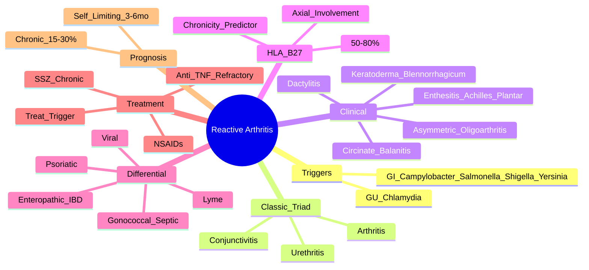

# Reactive Arthritis

> [!tip] **FCPS/MRCP Priority: HIGH**
> Reactive arthritis = **post-infectious sterile arthritis** (classic triad: arthritis + conjunctivitis + urethritis). **HLA-B27 50-80%**. Self-limiting (3-6 months) but chronic in 15-30% (especially HLA-B27+). **GU (Chlamydia) > GI (Campylobacter/Salmonella/Shigella/Yersinia)** triggers.

---

## Learning Objectives
By the end of this note you should be able to:
- [ ] Apply the classic triad (arthritis + conjunctivitis + urethritis) and recognise mucocutaneous features
- [ ] Identify antecedent infections (GU: Chlamydia; GI: Campylobacter, Salmonella, Shigella, Yersinia)
- [ ] Differentiate from gonococcal arthritis, Lyme, other SpA, viral arthritis
- [ ] Select management: treat trigger → NSAIDs → csDMARDs (SSZ) if chronic → biologics if refractory
- [ ] Recognise prognostic factors for chronicity (HLA-B27+, sacroiliitis, hip involvement)

---

## 1. Definition & Epidemiology

| Feature | Detail |
|---------|--------|
| **Definition** | **Sterile inflammatory arthritis** following an **extra-articular infection** (GU or GI) — "reactive" to distant infection |
| **Incidence** | 1-30/100,000/year (varies by population) |
| **Peak Onset** | **20-40 years** |
| **Sex Ratio** | **GU: M = F**; **GI: M > F** |
| **HLA-B27** | **50-80% positive** — associated with chronicity and axial involvement |
| **Trigger Interval** | **1-4 weeks** post-infection |

---

## 2. Aetiology — Antecedent Infections

| Category | Organisms | Remarks |
|----------|-----------|---------|
| **Genitourinary (GU)** | **Chlamydia trachomatis** (most common), Ureaplasma urealyticum | Most common trigger overall; often asymptomatic |
| **Gastrointestinal (GI)** | **Campylobacter jejuni**, **Salmonella**, **Shigella**, **Yersinia enterocolitica** | Foodborne; Yersinia → more chronic/severe |

> [!important] **Mechanism**
> - **Molecular mimicry** — bacterial antigens cross-react with joint tissues (HLA-B27 presents)
> - **Bacterial antigens/RNA found in synovium** (Chlamydia)
> - **NOT septic arthritis** — synovial fluid is sterile

---

## 3. Clinical Features

### Classic Triad (Reiter's Syndrome — Historical Term)
| Component | Description |
|-----------|-------------|
| **Arthritis** | **Asymmetric oligoarticular** (≤4 joints), **lower limb predominant** (knees, ankles, feet), can involve heels (enthesitis) |
| **Conjunctivitis** | **Bilateral, non-purulent**, mild photophobia — **most common ocular** |
| **Urethritis/Cervicitis** | Dysuria, discharge (mild), often **asymptomatic** in women |

### Other Key Features
| Feature | Description |
|---------|-------------|
| **Enthesitis** | **Achilles tendonitis**, **plantar fasciitis** (heel pain) — hallmark of SpA |
| **Dactylitis** | **'Sausage digit'** (toes > fingers) — flexor tenosynovitis + synovitis |
| **Mucocutaneous** | **Circinate balanitis** (painless annular lesions on glans), **Keratoderma blennorrhagicum** (pustular palmoplantar lesions — like pustular psoriasis) |
| **Axial** | Sacroiliitis (asymmetric), inflammatory back pain — develops in 20-50% if chronic |
| **Systemic** | Low-grade fever, fatigue, weight loss (acute phase) |

> [!critical] **Timing**
> - **1-4 weeks** post-infection
> - **Self-limiting**: most resolve in **3-6 months**
> - **Chronic/recurrent**: 15-30% (especially **HLA-B27+**, sacroiliitis, hip involvement)

---

## 4. Differential Diagnosis

| Condition | Distinguishing Features |
|-----------|------------------------|
| **Gonococcal Arthritis (DGIS)** | **Migratory polyarthritis**, **tenosynovitis**, dermatitis, **cervical/urethral discharge**, **culture/NAAT +ve** — **septic, not sterile** |
| **Lyme Arthritis** | Endemic area, **erythema migrans** history, large joint (knee), **Borrelia serology/PCR +ve** |
| **Ankylosing Spondylitis** | Chronic inflammatory back pain, symmetric sacroiliitis, **no antecedent infection**, HLA-B27 90% |
| **Psoriatic Arthritis** | Psoriasis, nail changes, DIP involvement, dactylitis, **no trigger infection** |
| **Enteropathic Arthritis** | **IBD** (Crohn's/UC) — arthritis parallels or independent of bowel activity |
| **Viral Arthritis** | Parvovirus, HBV, HCV, HIV, rubella — acute polyarthritis, self-limiting, serology +ve |
| **SARA (Post-Streptococcal Reactive Arthritis)** | Post-GAS, **prolonged (>1 month)**, no major Jones criteria, **ASO/anti-DNase B +ve** |

---

## 5. Investigations

| Test | Role |
|------|------|
| **STI Screen** | **NAAT for Chlamydia trachomatis** (urine/urethral/cervical) — **most critical** |
| **Stool Culture/PCR** | Campylobacter, Salmonella, Shigella, Yersinia (if GI symptoms) |
| **HLA-B27** | **Supportive** (50-80% positive) — predicts chronicity/axial involvement |
| **Synovial Fluid** | **Inflammatory** (WBC 2,000-50,000), **sterile culture**, no crystals |
| **Acute Phase Reactants** | ESR/CRP elevated |
| **Imaging** | X-ray: periostitis, erosions (late); US/MRI: enthesitis, sacroiliitis (if axial) |
| **Serology** | Chlamydia IgG/IgA (less useful than NAAT); ASO/anti-DNase B (exclude SARA) |

---

## 6. Management

```mermaid
flowchart TD
    A[Reactive Arthritis Diagnosis] --> B[Treat Antecedent Infection]
    B --> B1[Chlamydia: Doxycycline 100mg BD ×14d\nOR Azithromycin 1g stat → 500mg daily ×2d]
    B --> B2[GI pathogens: Usually self-limited;\nSevere: ciprofloxacin/azithromycin]
    B1 --> C[NSAIDs First-Line\nCOX-2 + PPI if risk]
    B2 --> C
    C --> D{Chronic >6 months\nor Recurrent?}
    D -->|No| E[Continue NSAIDs\nMost resolve 3-6mo]
    D -->|Yes| F[csDMARD: Sulfasalazine 2-3g/day\n(MTX/LEF alternatives)]
    F --> G{Refractory csDMARD}
    G -->|Yes| H[Biologic: Anti-TNF\n(Adalimumab, Etanercept, Infliximab)]
    G -->|No| I[Monitor: joints, enthesitis,\nspine, HLA-B27 status]
```

### Step-by-Step

| Step | Intervention | Details |
|------|--------------|---------|
| **1. Treat Trigger** | **Chlamydia**: Doxycycline 100mg BD ×14d **OR** Azithromycin 1g stat → 500mg daily ×2d | **Partner notification/treatment essential** |
| | GI pathogens: Usually self-limited; severe: ciprofloxacin/azithromycin | |
| **2. NSAIDs** | **1st line** (COX-2 + PPI if risk) | Indomethacin traditionally used; continuous > PRN |
| **3. Local Therapy** | IA corticosteroids | For persistent mono/oligoarticular joints |
| **4. csDMARD (if chronic >6mo/recurrent)** | **Sulfasalazine 2-3g/day** (1st choice); MTX/LEF alternatives | **Evidence for SSZ in chronic reactive arthritis** |
| **5. Biologic (if refractory)** | **Anti-TNF** (adalimumab, etanercept, infliximab) | For severe refractory disease |
| **6. Physiotherapy** | Maintain ROM, strengthen | Especially for enthesitis/heel pain |

> [!important] **Prognostic Factors for Chronicity**
> - **HLA-B27 positive** (50-80%)
> - **Sacroiliitis** (asymmetric)
> - **Hip involvement**
> - **Persistent enthesitis**
> - **Genetic factors** (ERAP1)

---

## 7. FCPS/MRCP High-Yield Summary

| Topic | Key Points |
|-------|------------|
| **Classic Triad** | **Arthritis + Conjunctivitis + Urethritis** (Reiter's syndrome — historical) |
| **Trigger** | **GU: Chlamydia trachomatis** (most common); **GI: Campylobacter, Salmonella, Shigella, Yersinia** |
| **Timing** | **1-4 weeks** post-infection |
| **HLA-B27** | **50-80% positive** — predicts chronicity + axial involvement |
| **Self-Limiting** | **Most resolve 3-6 months**; chronic/recurrent in **15-30%** (HLA-B27+) |
| **Mucocutaneous** | **Circinate balanitis** (painless glans lesions), **Keratoderma blennorrhagicum** (palmoplantar pustules) |
| **Enthesitis** | **Achilles, plantar fascia** — hallmark SpA feature |
| **Differential: Gonococcal** | **Migratory polyarthritis + tenosynovitis + dermatitis + culture +ve** — septic, not sterile |
| **Treatment** | **Treat infection** (doxycycline/azithromycin for Chlamydia) → **NSAIDs** → **SSZ if chronic >6mo** → **Anti-TNF** if refractory |
| **Differential: Gonococcal** | Migratory polyarthritis, tenosynovitis, dermatitis, **septic** (culture/NAAT +ve) |

---

## 8. Viva Questions (MRCP PACES / FCPS)

| Question | Expected Answer |
|----------|----------------|
| "A 28yo man presents with 2 weeks of asymmetric knee/ankle swelling, conjunctivitis, dysuria. Had diarrhoea 3 weeks ago. HLA-B27 positive. Diagnosis and management?" | **Reactive arthritis** (post-GI). **Treat trigger** (Campylobacter/Salmonella — usually self-limited, ciprofloxacin if severe). **NSAIDs** (indomethacin/COX-2). Monitor for chronicity (HLA-B27+ → higher risk). |
| "What are the classic mucocutaneous features of reactive arthritis?" | **Circinate balanitis** (painless annular glans lesions) and **Keratoderma blennorrhagicum** (pustular palmoplantar lesions, like pustular psoriasis). |
| "How do you differentiate reactive arthritis from gonococcal arthritis?" | **Reactive**: sterile synovial fluid, asymmetric oligoarthritis, antecedent infection 1-4wks prior, HLA-B27 50-80%. **Gonococcal**: migratory polyarthritis, tenosynovitis, dermatitis, **septic** (culture/NAAT +ve), migratory pattern. |
| "What is the role of HLA-B27 in reactive arthritis?" | **50-80% positive** — **predicts chronicity, recurrence, axial involvement (sacroiliitis), hip involvement**. Not diagnostic alone. |
| "What is the first-line antibiotic for Chlamydia-induced reactive arthritis?" | **Doxycycline 100mg BD ×14 days** OR **Azithromycin 1g stat → 500mg daily ×2 days**. Treat partners. |
| "When do you start csDMARDs (sulfasalazine) in reactive arthritis?" | **Chronic >6 months** or **recurrent disease** unresponsive to NSAIDs. SSZ 2-3g/day. |
| "What is the prognosis of reactive arthritis?" | **Self-limiting in most (3-6 months)**. **Chronic/recurrent in 15-30%** — risk factors: HLA-B27+, sacroiliitis, hip involvement. |

---

## 9. Confusions & Mnemonics

| Confusion | Clarification |
|-----------|---------------|
| **Reactive vs Gonococcal Arthritis** | Reactive = **sterile**, asymmetric oligoarthritis, **antecedent infection 1-4wks**, HLA-B27+. Gonococcal = **septic**, **migratory polyarthritis**, **tenosynovitis**, dermatitis, culture/NAAT +ve. |
| **Reactive vs Enteropathic Arthritis** | Reactive = **post-infectious** (GU/GI), no IBD. Enteropathic = **IBD-associated** (Crohn's/UC), can precede IBD diagnosis. |
| **Reactive vs SARA** | Reactive = post-enteric/GU, self-limiting. SARA = **post-streptococcal**, **prolonged >1 month**, ASO/anti-DNase B +ve. |
| **Sterile vs Septic** | Reactive = **sterile synovial fluid** (inflammatory WBC, culture negative). Septic = culture positive, WBC >50,000. |
| **Chronic Reactive Arthritis** | >6 months or recurrent → start **SSZ**; if refractory → **anti-TNF**. |

**Mnemonic: Reactive Arthritis = "C-C-U"**
- **C**hamydia (GU trigger)
- **C**ampylobacter/Salmonella (GI triggers)
- **U**niversal triad: Arthritis + Conjunctivitis + Urethritis

**Mnemonic: Mucocutaneous = "BAL-KER"**
- **BAL**anitis (circinate)
- **KER**atoderma blennorrhagicum

**Mnemonic: Chronicity Risks = "HIP-SAC"**
- **H**LA-B27 positive
- **I**liac/sacroiliitis
- **P**ersistent enthesitis
- **S**acroiliitis
- **A**xial involvement
- **C**hronic >6mo

**Mnemonic: Differential = "G-L-E-P-V"**
- **G**onococcal (septic, migratory)
- **L**yme (erythema migrans, endemic)
- **E**nteropathic (IBD)
- **P**soriatic (psoriasis, nail, DIP)
- **V**iral (parvovirus, self-limiting)

---

## 10. Mind Map



---

## 11. One-Page Revision Card

| Domain | Key Points |
|--------|------------|
| **Triad** | Arthritis (asymmetric oligo) + Conjunctivitis + Urethritis |
| **Trigger** | **Chlamydia** (GU) > **Campylobacter/Salmonella/Shigella/Yersinia** (GI) |
| **Timing** | 1-4 weeks post-infection |
| **HLA-B27** | 50-80% — predicts chronicity, axial involvement |
| **Mucocutaneous** | Circinate balanitis (painless), Keratoderma blennorrhagicum |
| **Enthesitis** | Achilles, plantar fascia — hallmark SpA |
| **Self-Limiting** | 3-6 months (most); chronic 15-30% (HLA-B27+) |
| **Differential: Gonococcal** | Migratory polyarthritis, tenosynovitis, dermatitis, **septic** |
| **Treatment** | Treat infection (doxy/azithro for Chlamydia) → NSAIDs → **SSZ if >6mo** → Anti-TNF |

---

## 12. Spaced Repetition Trackers

| Review Interval | Date Completed | Confidence (1-5) | Notes |
|-----------------|----------------|------------------|-------|
| 24 hours | | | |
| 7 days | | | |
| 15 days | | | |
| 30 days | | | |
| 90 days | | | |

---

## 13. Self-Test Scorecard

| Section | Score /5 | Last Attempt |
|---------|----------|--------------|
| Triad & Triggers | | |
| HLA-B27 & Chronicity | | |
| Gonococcal vs Reactive | | |
| Mucocutaneous Signs | | |
| Treatment Algorithm | | |
| Differential Diagnosis | | |
| Viva Questions | | |

---

## Local Navigation
- **Parent Heading**: [[../Inflammatory Arthritis|Inflammatory Arthritis]]
- **Parent Topic Group**: [[Seronegative spondyloarthritis overview]]
- **Chapter Map**: [[../Davidson Chapter 26 - Rheumatology Hierarchy|Rheumatology Hierarchy]]
- **Chapter MOC**: [[../Rheumatology MOC|Rheumatology MOC]]
- **Drug Reference**: [[../../Clinical Approach to Musculoskeletal Disease/Drugs in rheumatology|Drugs in rheumatology]]
- **Related**: [[Ankylosing spondylitis]] · [[Psoriatic arthritis]] · [[Enteropathic arthritis]] · [[Undifferentiated spondyloarthritis]]
---

> Auto-generated study sections for "Inflammatory Arthritis" — Ch 25: Rheumatology & Bone Disease.

## Flashcards (20 generated)

- Q: What is the definition of Inflammatory Arthritis?
  A: Reactive arthritis = post-infectious sterile arthritis (classic triad: arthritis + conjunctivitis + urethritis).
- Q: What is Enthesitis of Inflammatory Arthritis?
  A: Achilles tendonitis, plantar fasciitis (heel pain) — hallmark of SpA
- Q: What is Dactylitis of Inflammatory Arthritis?
  A: 'Sausage digit' (toes > fingers) — flexor tenosynovitis + synovitis
- Q: What is Mucocutaneous of Inflammatory Arthritis?
  A: Circinate balanitis (painless annular lesions on glans), Keratoderma blennorrhagicum (pustular palmoplantar lesions — like pustular psoriasis)
- Q: What is Axial of Inflammatory Arthritis?
  A: Sacroiliitis (asymmetric), inflammatory back pain — develops in 20-50% if chronic
- Q: What is Systemic of Inflammatory Arthritis?
  A: Low-grade fever, fatigue, weight loss (acute phase)
- Q: What is Enthesitis of Inflammatory Arthritis?
  A: Achilles tendonitis, plantar fasciitis (heel pain) — hallmark of SpA
- Q: What is Dactylitis of Inflammatory Arthritis?
  A: 'Sausage digit' (toes > fingers) — flexor tenosynovitis + synovitis
- Q: What is Mucocutaneous of Inflammatory Arthritis?
  A: Circinate balanitis (painless annular lesions on glans), Keratoderma blennorrhagicum (pustular palmoplantar lesions — like pustular psoriasis)
- Q: What is Axial of Inflammatory Arthritis?
  A: Sacroiliitis (asymmetric), inflammatory back pain — develops in 20-50% if chronic
- Q: What is Systemic of Inflammatory Arthritis?
  A: Low-grade fever, fatigue, weight loss (acute phase)
- Q: What is Classic Triad of Inflammatory Arthritis?
  A: Arthritis + Conjunctivitis + Urethritis (Reiter's syndrome — historical)
- Q: What is Trigger of Inflammatory Arthritis?
  A: GU: Chlamydia trachomatis (most common); GI: Campylobacter, Salmonella, Shigella, Yersinia
- Q: What is Timing of Inflammatory Arthritis?
  A: 1-4 weeks post-infection
- Q: What is HLA-B27 of Inflammatory Arthritis?
  A: 50-80% positive — predicts chronicity + axial involvement
- Q: What is Self-Limiting of Inflammatory Arthritis?
  A: Most resolve 3-6 months; chronic/recurrent in 15-30% (HLA-B27+)
- Q: What is Mucocutaneous of Inflammatory Arthritis?
  A: Circinate balanitis (painless glans lesions), Keratoderma blennorrhagicum (palmoplantar pustules)
- Q: What is Enthesitis of Inflammatory Arthritis?
  A: Achilles, plantar fascia — hallmark SpA feature
- Q: What is Differential: Gonococcal of Inflammatory Arthritis?
  A: Migratory polyarthritis + tenosynovitis + dermatitis + culture +ve — septic, not sterile
- Q: How is Inflammatory Arthritis managed?
  A: Treat infection (doxycycline/azithromycin for Chlamydia) → NSAIDs → SSZ if chronic >6mo → Anti-TNF if refractory

## MCQs (1 generated)

1. **Which of the following best describes Inflammatory Arthritis?**
   A. **Reactive arthritis = post-infectious sterile arthritis (classic triad: arthritis + conjunctivitis + urethritis).**
   B. An unrelated condition not matching the clinical picture of Inflammatory Arthritis
   C. A complication seen late in the disease course of Inflammatory Arthritis
   D. A condition that mimics Inflammatory Arthritis but has a different underlying cause

## SBA Questions (1 generated)

1. A patient with suspected Inflammatory Arthritis presents with: Definition — Sterile inflammatory arthritis following an extra-articular infection (GU or GI) — "reactive" to distant infection; Incidence — 1-30/100,000/year (varies by population); Peak Onset — 20-40 years. What is the most likely diagnosis?
   A. **Inflammatory Arthritis**
   B. A condition that mimics Inflammatory Arthritis but is not the same entity
   C. A complication of Inflammatory Arthritis rather than the primary diagnosis
   D. An unrelated condition in the same clinical category as Inflammatory Arthritis

