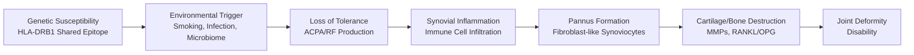
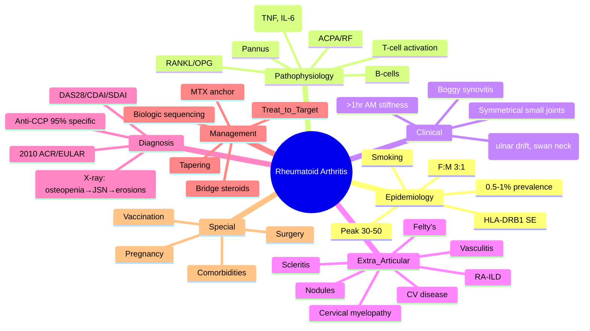

# Rheumatoid Arthritis (RA)

> [!tip] **FCPS/MRCP Priority: CRITICAL**
> RA is the **most common inflammatory arthritis** and the **prototype csDMARD-treated disease**. Must know: 2010 ACR/EULAR criteria, treat-to-target, MTX anchor, biologic sequencing, extra-articular manifestations.

---

## Learning Objectives
By the end of this note you should be able to:
- [ ] Apply 2010 ACR/EULAR classification criteria for RA
- [ ] Differentiate RA from mimics (SLE, PsA, viral, palindromic, crystal)
- [ ] Implement treat-to-target strategy with MTX anchor and biologic sequencing
- [ ] Recognise and manage extra-articular manifestations (lung, eye, skin, nerve, vasculitis, Felty's)
- [ ] Monitor disease activity (DAS28, CDAI, SDAI) and drug toxicity
- [ ] Manage RA in pregnancy and perioperative settings

---

## 1. Definition & Epidemiology

| Feature | Detail |
|---------|--------|
| **Definition** | Chronic symmetric polyarthritis of synovial joints → erosive damage, functional disability, systemic comorbidities |
| **Prevalence** | 0.5-1% worldwide |
| **Incidence** | 20-50/100,000/year |
| **Peak Onset** | 30-50 years (can occur at any age) |
| **Sex Ratio** | **F:M = 3:1** |
| **Genetics** | **HLA-DRB1 shared epitope** (SE) alleles (DRB1*04:01, *04:04, *01:01) — 60-70% RA vs 20-30% controls |
| **Risk Factors** | **Smoking** (dose-dependent, interacts with SE), female sex, age, family history, obesity, silica exposure |

---

## 2. Aetiology & Pathophysiology



### Key Pathogenic Pathways
| Pathway | Mechanism | Therapeutic Target |
|---------|-----------|-------------------|
| **Autoantibodies** | RF (IgM anti-IgG), **ACPA** (anti-citrullinated protein antibodies) — precede clinical onset by years | — |
| **T-cell activation** | HLA-DR SE presents citrullinated peptides → CD4+ T-cell activation | Abatacept (CTLA4-Ig) |
| **Cytokines** | **TNF-α**, IL-6, IL-1, GM-CSF → synovitis, acute phase response | Anti-TNF, anti-IL-6R, JAKi |
| **B-cells** | Autoantibody production, antigen presentation, cytokine secretion | Rituximab (anti-CD20) |
| **Synovial fibroblasts** | Invasive pannus → MMPs, RANKL → osteoclast activation | — |
| **Bone erosion** | **RANKL/OPG imbalance** → osteoclastogenesis | Denosumab (anti-RANKL) |

> [!important] **ACPA vs RF**
> - **ACPA (anti-CCP)**: 95-98% specific for RA; **predicts erosive disease**; present years before onset
> - **RF**: 70-80% sensitive, 85% specific; also in Sjögren's, SLE, infections, elderly
> - **Double positive** = highest specificity and worst prognosis

---

## 3. Clinical Features

### Articular Manifestations
| Feature | Description |
|---------|-------------|
| **Joint Pattern** | **Symmetrical polyarthritis** — MCP, PIP, wrists, MTP (spares DIP, sacroiliac) |
| **Pain** | Inflammatory: worse at rest, morning stiffness **>1 hour**, improves with activity |
| **Swelling** | **Boggy synovitis** (not bony), warm, tender; tendon sheaths (tenosynovitis) |
| **Deformities** (late/untreated) | **Ulnar drift**, **swan neck** (PIP hyperextension/DIP flexion), **boutonnière** (PIP flexion/DIP extension), **Z-thumb**, **hitchhiker's thumb** |
| **Functional** | Reduced grip strength, difficulty with ADLs |

### Extra-Articular Manifestations (EAMs) — **High-Yield for MRCP**

| System | Manifestation | FCPS/MRCP Pearl |
|--------|--------------|-----------------|
| **Skin** | **Rheumatoid nodules** (20-30%) — olecranon, forearm, Achilles; **Rheumatoid vasculitis** (cutaneous ulcers, palpable purpura, digital infarcts) | Nodules = RF+ve, erosive disease; Vasculitis = severe, treat with CYC/RTX |
| **Eye** | **Scleritis** (painful, vision threat), **episcleritis** (mild), **keratoconjunctivitis sicca** (Sjögren's overlap) | Scleritis = urgent ophthalmology + immunosuppression |
| **Lung** | **RA-ILD** (UIP/NSIP pattern), pleural effusion, rheumatoid nodules (Caplan's syndrome with pneumoconiosis), bronchiolitis obliterans | **HRCT + PFTs** at baseline; MTX pneumonitis = exclusion diagnosis |
| **Heart** | Pericarditis (most common), myocarditis, **accelerated atherosclerosis** (CV risk ×1.5-2), conduction defects | **Treat inflammation = reduce CV risk**; statin per guidelines |
| **Neurological** | **Mononeuritis multiplex** (vasculitis), cervical myelopathy (atlantoaxial subluxation), entrapment neuropathies (CTS) | Atlantoaxial subluxation = risk on intubation; screen pre-op |
| **Haematological** | **Felty's syndrome** (RA + splenomegaly + neutropenia), TTP-like, anaemia of chronic disease | Felty's: G-CSF, splenectomy (rare), RTX |
| **Renal** | Amyloidosis (AA, from chronic inflammation), drug toxicity (NSAID, MTX, gold) | **Control inflammation = prevent amyloid** |
| **Vasculitis** | Rheumatoid vasculitis (cutaneous, digital, nerve, visceral) — **RF high titre, long-standing severe RA** | **CYC + steroids** or **RTX** |

> [!warning] **Felty's Syndrome**
> - Triad: **RA + Splenomegaly + Neutropenia** (<1.5 or <1.0 ×10⁹/L)
> - Complications: recurrent infections, leg ulcers
> - Management: **G-CSF**, RTX, splenectomy (refractory)

> [!warning] **Rheumatoid Vasculitis**
> - Small/medium vessel vasculitis in **long-standing, seropositive, severe RA**
> - Features: digital infarcts, cutaneous ulcers, mononeuritis multiplex, mesenteric/renal involvement
> - **CYC + high-dose steroids** or **RTX** (preferred now)

---

## 4. Classification Criteria — 2010 ACR/EULAR

| Domain | Score | Details |
|--------|-------|---------|
| **Joint Involvement** | 0-5 | 1 large joint = 0; 2-10 large = 1; 1-3 small = 2; 4-10 small = 3; >10 (at least 1 small) = 5 |
| **Serology** | 0-3 | RF/ACPA negative = 0; low positive (<3×ULN) = 2; high positive (≥3×ULN) = 3 |
| **Acute Phase Reactants** | 0-1 | Normal CRP/ESR = 0; abnormal = 1 |
| **Duration** | 0-1 | <6 weeks = 0; ≥6 weeks = 1 |
| **Total** | **≥6/10 = Definite RA** | |

> [!important] **Criteria Notes**
> - **Small joints** = MCP, PIP, MTP 2-5, thumb IP, wrists
> - **Large joints** = shoulders, elbows, hips, knees, ankles
> - **DIP, 1st CMC, 1st MTP** excluded from count
> - **Apply ONLY to patients with ≥1 swollen joint not better explained by another disease**

---

## 5. Differential Diagnosis

| Mimic | Distinguishing Features |
|-------|------------------------|
| **SLE** | Non-erosive, +ANA/dsDNA, renal/skin/CNS, Jaccoud's (reducible ulnar drift) |
| **Psoriatic Arthritis** | Asymmetrical, DIP involvement, **dactylitis**, nail changes, enthesitis, HLA-B27+, RF/ACPA negative |
| **Viral Polyarthritis** | Acute, self-limiting (weeks), parvovirus B19 (adults: polyarthritis + rash), hep B/C, HIV, rubella, chikungunya |
| **Palindromic Rheumatism** | Recurrent acute mono/oligoarthritis (hours-days), **complete resolution**, no erosions, **+RF/ACPA in 30-50%** (precursor to RA) |
| **Crystal Arthritis** | Acute mono/oligo, crystals on aspiration, normal between attacks (if untreated) |
| **Sarcoidosis** | Löfgren's (erythema nodosum + bilateral hilar lymphadenopathy + ankle arthritis), ACE ↑ |
| **Osteoarthritis** | Mechanical pain, DIP/PIP/1st CMC bony swelling, <15 min stiffness, no systemic features |
| **Fibromyalgia** | Widespread pain + fatigue + sleep disturbance, **normal ESR/CRP, no swelling** |

---

## 6. Diagnosis — Investigations

| Test | Role | Interpretation |
|------|------|----------------|
| **RF** | Support diagnosis | 70-80% sensitive, 85% specific |
| **Anti-CCP** | **Confirm diagnosis + prognosis** | 60-70% sensitive, **95-98% specific**; high titre = erosive |
| **ESR/CRP** | Disease activity | Elevated in active disease; **discordant ESR↑/CRP normal = paraprotein/SLE** |
| **FBC** | Anaemia of chronic disease, thrombocytosis (inflammation), neutropenia (Felty's, drug) | Normocytic normochromic anaemia |
| **X-ray hands/feet** | Baseline, progression | Periarticular osteopenia → uniform JSN → marginal erosions → subluxation |
| **Ultrasound/MRI** | Early synovitis, erosions (more sensitive than X-ray) | Power Doppler = active inflammation |
| **DAS28/CDAI/SDAI** | Disease activity monitoring | Target: remission (DAS28 <2.6) |

### Disease Activity Scores
| Score | Components | Remission | Low | Moderate | High |
|-------|------------|-----------|-----|----------|------|
| **DAS28-ESR** | TJC28, SJC28, ESR, Pt global | <2.6 | <3.2 | 3.2-5.1 | >5.1 |
| **DAS28-CRP** | TJC28, SJC28, CRP, Pt global | <2.6 | <3.2 | 3.2-5.1 | >5.1 |
| **CDAI** | TJC28, SJC28, Pt global, Dr global | ≤2.8 | ≤10 | 10-22 | >22 |
| **SDAI** | CDAI + CRP | ≤3.3 | ≤11 | 11-26 | >26 |

> [!tip] **CDAI/SDAI preferred** — no lab wait, usable in clinic

---

## 7. Management — Treat-to-Target Algorithm

```mermaid
flowchart TD
    A[New RA Diagnosis] --> B[Start MTX ASAP\n7.5-15mg weekly → escalate to 20-25mg]
    B --> C[Add Folic Acid 5mg weekly\n(24-48h post-MTX)]
    C --> D[Short-term Bridge\nPred 10-20mg daily → taper 4-8wk]
    D --> E[Monitor DAS28 q1-3mo]
    E -->|Target met\nRemission/LDA| F[Maintain → Consider taper\nafter sustained remission]
    E -->|Target NOT met at 3mo| G[Optimise MTX → 25mg/week SC]
    G -->|Still not met at 6mo| H[Add/biologic\n1st: Anti-TNF + MTX]
    H -->|Anti-TNF fail| I[Switch mechanism:\nRTX (if RF+), Tocilizumab, Abatacept]
    I -->|Multiple fail| J[JAK inhibitor\n(if no VTE contraindication)]
```

### Step-by-Step Management

| Step | Intervention | Details |
|------|--------------|---------|
| **1. csDMARD Anchor** | **Methotrexate** | Start 7.5-15mg weekly → escalate q4wk to **20-25mg weekly**; **SC if GI intolerance/failure**; Folic acid 5mg weekly (24-48h post-MTX) |
| **2. Bridge** | Prednisolone | 10-20mg daily → taper over 4-8 weeks (2.5mg q1-2wk) |
| **3. Combo csDMARD** (if MTX alone inadequate) | **Triple therapy**: MTX + SSZ + HCQ | Equivalent efficacy to MTX + anti-TNF in some studies; cheaper |
| **4. 1st Biologic** | **Anti-TNF + MTX** | Adalimumab/etanercept/certolizumab (SC preferred); infliximab/golimumab (IV) |
| **5. 2nd Biologic (Anti-TNF fail)** | **Switch mechanism** | **RF+ve**: Rituximab (preferred); **RF-ve**: Tocilizumab or Abatacept |
| **6. 3rd+ Line** | JAK inhibitor / another non-TNF | Tofacitinib/baricitinib/upadacitinib — **assess VTE risk first** |
| **7. Tapering** | After sustained remission | Taper biologics first → reduce MTX → stop bridge steroids already gone |

> [!critical] **MTX Intolerance/Failure Definitions**
> - **Intolerance**: Nausea, mucositis, LFT elevation, pneumonitis → try SC, split dose, folinic acid rescue
> - **Failure**: Inadequate response at **25mg weekly (or max tolerated) for 3 months** → escalate

---

## 8. Drug-Specific Monitoring in RA

| Drug | Monitoring Schedule | Key Toxicity to Act On |
|------|---------------------|------------------------|
| **MTX** | FBC, LFT, U&E, Cr: monthly ×3, then 3-monthly | LFT >2×ULN → ↓ dose; >3×ULN → stop; pneumonitis → stop permanently |
| **SSZ** | FBC, LFT, U&E: monthly ×3, then 3-monthly | Neutropenia <1.5 → stop; rash → stop |
| **LEF** | FBC, LFT, **BP**, weight: monthly ×3, then 3-monthly | LFT >2×ULN → ↓ dose; hypertension → treat/stop; diarrhoea |
| **HCQ** | **Annual ophthalmology** (after 5 years or baseline if risk) | Retinopathy → stop immediately |
| **Anti-TNF** | FBC, LFT, U&E: 3-monthly; TB screen annually | Infection → hold; demyelination → stop; new HF → stop |
| **Rituximab** | IgG pre-infusion; FBC, LFT; B-cells (CD19) | IgG <4g/L → consider IVIg; severe infection → delay |
| **Tocilizumab** | FBC (neutrophils, platelets), LFT, **lipids**: 3-monthly | Neutrophils <1.0 → hold; platelets <50 → hold; LFT >3×ULN → stop |
| **JAKi** | FBC, LFT, lipids, **VTE risk**: 3-monthly | Neutrophils <1.0, Lymphocytes <0.5 → hold; VTE → stop permanently |

---

## 9. Extra-Articular Management

| Manifestation | First-Line | Refractory |
|---------------|------------|------------|
| **Rheumatoid nodules** | Usually none; MTX can paradoxically enlarge (nodulosis) | Rituximab, surgical excision if compressive |
| **Scleritis** | High-dose steroids + csDMARD/biologic (anti-TNF, RTX) | IV CYC, IVIG |
| **RA-ILD** | **Avoid MTX** (pneumonitis risk); RTX, abatacept, tacrolimus; antifibrotics (nintedanib) for progressive fibrosing | Lung transplant |
| **Felty's** | G-CSF for infections; RTX | Splenectomy (last resort) |
| **Rheumatoid vasculitis** | **CYC + high-dose steroids** | RTX, IVIG, plasma exchange |
| **Cervical spine (AA subluxation)** | Neck collar, avoid flexion/extension; **pre-op screening** MRI if symptomatic | Surgical fusion (neurosurgery) |

---

## 10. Special Situations

### Pregnancy & Breastfeeding
| Drug | Pregnancy | Breastfeeding |
|------|-----------|---------------|
| **MTX** | **X** (stop 3mo pre) | **X** |
| **SSZ** | ✓ (continue + folate 5mg) | ✓ (monitor infant) |
| **HCQ** | ✓ (continue) | ✓ |
| **LEF** | **X** (washout cholestyramine) | **X** |
| **AZA** | ✓ | ✓ |
| **Anti-TNF** | **Certolizumab** ✓ (no Fc); others stop 20-24wk | ✓ (low transfer) |
| **Rituximab** | **X** (B-cell depletion) | **X** |
| **JAKi** | **X** | **X** |
| **Prednisolone** | ✓ (<20mg preferred) | ✓ |

### Surgery / Perioperative
- **MTX**: **Continue** perioperatively (evidence supports no ↑ infection risk)
- **Biologics**: **Hold** — skip 1 dose (SC) or time surgery at trough (IV); restart when wound healed (7-14 days)
- **JAKi**: Hold 1-2 weeks pre-op (thrombosis/infection risk)
- **Steroids**: **Stress-dose** if on >5mg pred >4 weeks (hydrocortisone 50mg IV q8h peri-op)

### Vaccination
- **Inactivated**: Give anytime (flu, pneumococcal, COVID, Hep B)
- **Live**: **≥4 weeks BEFORE** starting biologics/JAKi; avoid on immunosuppression
- **Shingrix (RZV)**: 2 doses 2-6mo apart — **give BEFORE JAKi/biologic if possible**

---

## 11. Comorbidities & CV Risk

| Comorbidity | RA-Specific Consideration |
|-------------|---------------------------|
| **Cardiovascular** | **Risk ×1.5-2** (inflammation-driven atherosclerosis); **treat inflammation = reduce CV events**; statin per QRISK3 (RA = risk enhancer) |
| **Infection** | **Risk ×2** (disease + drugs); screen TB/HepB/HIV pre-biologic; pneumococcal/flu/COVID vax |
| **Malignancy** | **Lymphoma risk ×2** (chronic inflammation); skin cancer ↑ on immunosuppression; age-appropriate screening |
| **Osteoporosis** | Inflammation + steroids + immobility → **DEXA at diagnosis**; bisphosphonate if T-score ≤-2.5 or steroids >7.5mg |
| **Depression/Fibromyalgia** | Common overlap; **Fibromyalgia mimics active RA** (high patient global, normal CRP) — use CDAI/SDAI |

---

## 12. Prognosis & Outcomes

| Factor | Good Prognosis | Poor Prognosis |
|--------|----------------|----------------|
| **Serology** | RF/ACPA negative | **RF+ve, ACPA+ve, high titre** |
| **Erosions** | None at baseline | **Early erosions** |
| **Functional** | Low HAQ | High HAQ, early disability |
| **EAMs** | None | Nodules, vasculitis, ILD, Felty's |
| **Response** | Early remission on MTX | Multiple biologic failures |

> [!tip] **Window of Opportunity**
> - **First 3-6 months** = critical for preventing irreversible damage
> - **Early aggressive treatment** → better long-term outcomes, higher drug-free remission rates

---

## 13. FCPS/MRCP High-Yield Summary

| Topic | Key Points |
|-------|------------|
| **Classification** | 2010 ACR/EULAR: ≥6/10 (joints, serology, CRP/ESR, duration) |
| **Diagnosis** | Symmetrical small joint polyarthritis + >1hr AM stiffness + RF/ACPA + elevated CRP/ESR |
| **Best Diagnostic Test** | **Anti-CCP** (95-98% specific, prognostic) |
| **Anchor Drug** | **Methotrexate** (weekly + folic acid) |
| **Treat-to-Target** | Monitor DAS28/CDAI q1-3mo; target remission (DAS28 <2.6) |
| **Biologic Sequence** | MTX fail → **Anti-TNF** → **Non-TNF** (RTX if RF+, TCZ/ABA if RF-) → **JAKi** |
| **EAMs** | Nodules, scleritis, ILD, Felty's, vasculitis, cervical myelopathy, CV disease |
| **Pregnancy Safe** | HCQ, SSZ, AZA, Certolizumab, low-dose pred |
| **Pregnancy Avoid** | MTX, LEF, most biologics, JAKi |
| **MTX Pneumonitis** | Exclusion diagnosis; stop MTX permanently; HRCT + BAL |
| **Felty's** | RA + splenomegaly + neutropenia → G-CSF, RTX |

---

## 14. Viva Questions (MRCP PACES / FCPS)

| Question | Expected Answer |
|----------|----------------|
| "A 40yo woman has 6 weeks of symmetrical MCP/PIP swelling, 2hr AM stiffness. Anti-CCP 200 IU (ULN 20). CRP 40. What is the diagnosis and management?" | **RA** (2010 criteria: 4 small joints=3, high positive ACPA=3, abnormal CRP=1, ≥6wk=1 → total 8/10). Start **MTX 15mg weekly + folic acid 5mg weekly + pred 15mg bridge**. Monitor DAS28 monthly. |
| "What is the 2010 ACR/EULAR criteria for RA?" | Joint involvement (0-5), Serology RF/ACPA (0-3), Acute phase (0-1), Duration (0-1). **≥6/10 = definite RA**. |
| "MTX 25mg weekly for 3 months, DAS28 4.8. What next?" | **Add biologic** — 1st line **anti-TNF + continued MTX** (adalimumab/etanercept/certolizumab SC). |
| "Anti-TNF failed. RF positive. What next?" | **Rituximab** (preferred for RF+ve) — 2x 1000mg IV 2 weeks apart + MTX. Monitor IgG, B-cells. |
| "RA patient on MTX develops dry cough, fever, bilateral infiltrates. What do you suspect?" | **MTX pneumonitis** — **STOP MTX**, HRCT, exclude infection, consider biopsy. **Never rechallenge**. |
| "RA patient needs hip replacement. On adalimumab 40mg SC fortnightly. Perioperative plan?" | **Hold adalimumab** — skip 1 dose (surgery at week 2 of cycle). Restart when wound healed (7-14 days). **Continue MTX**. Stress-dose steroids if on pred >5mg. |
| "What extra-articular manifestation of RA causes neutropenia and splenomegaly?" | **Felty's syndrome**. Manage with G-CSF, RTX, splenectomy (refractory). |
| "How do you differentiate RA from SLE arthritis?" | RA: erosive, symmetrical MCP/PIP, +RF/ACPA. SLE: **non-erosive**, Jaccoud's (reducible deformity), +ANA/dsDNA/Sm, renal/skin/CNS. |

---

## 15. Confusions & Mnemonics

| Confusion | Clarification |
|-----------|---------------|
| **Palindromic rheumatism vs RA** | Palindromic: recurrent self-limiting attacks (hours-days), **complete resolution**, no erosions. 30-50% progress to RA. |
| **Jaccoud's vs RA deformity** | Jaccoud's (SLE): **reducible** ulnar deviation, no erosions. RA: **fixed**, erosive. |
| **MTX pneumonitis vs RA-ILD** | MTX pneum: acute, eosinophilia, **exclusion**, stop MTX permanently. RA-ILD: chronic, UIP/NSIP on HRCT, treat with RTX/abatacept. |
| **Biologic failure definitions** | Primary = no response by 3-6mo; Secondary = loss of response after initial success. Both → switch. |
| **DAS28 vs CDAI** | DAS28 needs ESR/CRP; CDAI clinical only (preferred for clinic visits). |

**Mnemonic: 2010 Criteria = "J.S.A.D."**
- **J**oints (0-5)
- **S**erology (0-3)
- **A**cute phase (0-1)
- **D**uration (0-1)

**Mnemonic: EAMs = "S.L.I.F.E.N.C.V."**
- **S**kin (nodules, vasculitis)
- **L**ung (ILD, pleural, Caplan's)
- **I**nfection risk
- **F**elty's
- **E**ye (scleritis, sicca)
- **N**eurological (mononeuritis, AA subluxation)
- **C**ardiovascular (accelerated atherosclerosis)
- **V**asculitis (rheumatoid)

**Mnemonic: Pregnancy Safe = "H.A.S.C.P."**
- **H**CQ, **A**ZA, **S**SZ, **C**ertolizumab, **P**red (low dose)

---

## 16. Mind Map



---

## 17. One-Page Revision Card

| Domain | Key Points |
|--------|------------|
| **Epidemiology** | 0.5-1%, F:M 3:1, peak 30-50, HLA-DRB1 SE, smoking |
| **Diagnosis** | Symmetrical MCP/PIP/wrist/MTP + >1hr AM stiffness + RF/ACPA + ↑CRP/ESR |
| **Criteria** | 2010 ACR/EULAR ≥6/10 (Joints 0-5, Serology 0-3, CRP/ESR 0-1, Duration 0-1) |
| **Best Test** | **Anti-CCP** (95-98% specific, prognostic for erosions) |
| **Anchor Drug** | **MTX** 7.5→25mg weekly + folic acid 5mg weekly (24h post) |
| **Treat-to-Target** | DAS28 <2.6 remission; monitor q1-3mo; escalate by 3-6mo if not at target |
| **Biologic Sequence** | Anti-TNF → RTX (RF+) / TCZ / ABA (RF-) → JAKi |
| **Key EAMs** | Nodules, scleritis, ILD, Felty's (RA+splenomegaly+neutropenia), vasculitis, CV ×1.5-2 |
| **Pregnancy Safe** | HCQ, SSZ, AZA, Certolizumab, pred <20mg |
| **Pregnancy Avoid** | MTX (stop 3mo), LEF (washout), most biologics, JAKi |
| **MTX Toxicity** | Hepatotoxicity, pneumonitis (stop permanently), myelosuppression, mucositis |
| **Felty's** | RA + splenomegaly + neutropenia → G-CSF, RTX |

---

## 18. Spaced Repetition Trackers

| Review Interval | Date Completed | Confidence (1-5) | Notes |
|-----------------|----------------|------------------|-------|
| 24 hours | | | |
| 7 days | | | |
| 15 days | | | |
| 30 days | | | |
| 90 days | | | |

---

## 19. Self-Test Scorecard

| Section | Score /5 | Last Attempt |
|---------|----------|--------------|
| 2010 Criteria Application | | |
| Anti-CCP vs RF Interpretation | | |
| Treat-to-Target Algorithm | | |
| Biologic Sequencing | | |
| MTX Monitoring & Toxicity | | |
| Extra-Articular Manifestations | | |
| Pregnancy Management | | |
| Viva Questions | | |

---

## Local Navigation
- **Parent Heading**: [[../Inflammatory Arthritis|Inflammatory Arthritis]]
- **Parent Topic Group**: [[Rheumatoid arthritis and related conditions]]
- **Chapter Map**: [[../Davidson Chapter 26 - Rheumatology Hierarchy|Rheumatology Hierarchy]]
- **Chapter MOC**: [[../Rheumatology MOC|Rheumatology MOC]]
- **Drug Reference**: [[../../Clinical Approach to Musculoskeletal Disease/Drugs in rheumatology|Drugs in rheumatology]]
- **Investigation Reference**: [[../../Clinical Approach to Musculoskeletal Disease/Investigations in rheumatology|Investigations in rheumatology]]