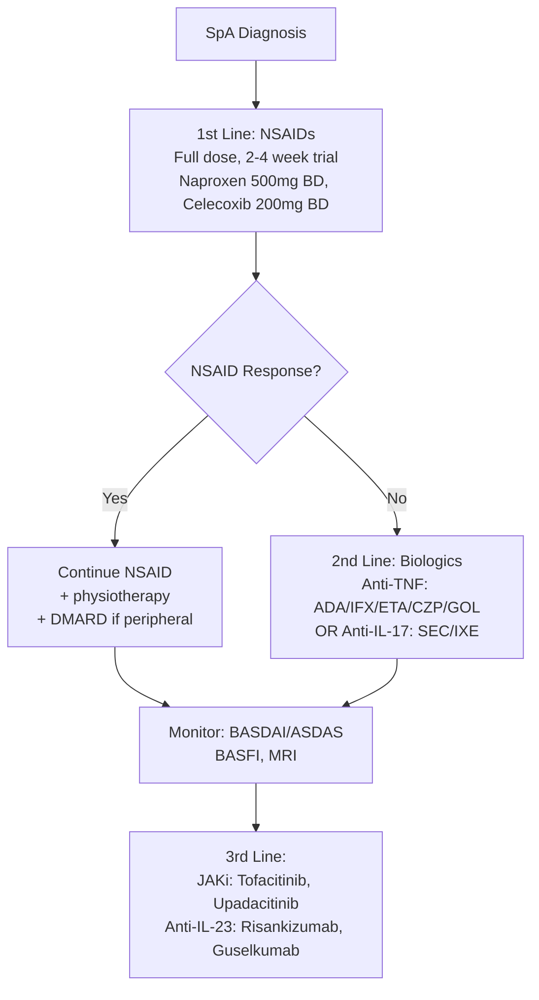
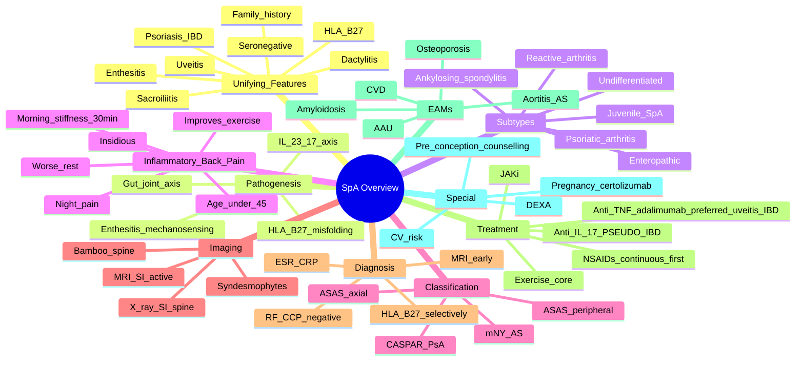

# Seronegative Spondyloarthritis (SpA) — Integrated Overview

> [!tip] **FCPS/MRCP Priority: CRITICAL**
> SpA is a **family of related disorders** sharing **HLA-B27**, **axial involvement (sacroiliitis, spondylitis)**, **enthesitis**, and **seronegativity** (RF/CCP negative). Must know: **ASAS classification** (axial vs peripheral), **inflammatory back pain features**, **HLA-B27 utility**, **CASPAR for PsA**, **NSAIDs first-line**, **anti-TNF/IL-17i for axial disease**, and the **uveitis association** (acute anterior, HLA-B27+).

---

## Learning Objectives
By the end of this note you should be able to:
- [ ] Define the **spondyloarthritis concept** and its unifying features (HLA-B27, enthesitis, dactylitis, uveitis)
- [ ] Apply **ASAS classification criteria** for axial and peripheral SpA
- [ ] Differentiate **inflammatory back pain** from mechanical back pain
- [ ] Recognise **extra-articular manifestations** (uveitis, psoriasis, IBD, aortitis)
- [ ] Differentiate subtypes: **AS, PsA, ReA, Enteropathic, Undifferentiated**
- [ ] Apply **CASPAR criteria** for psoriatic arthritis
- [ ] Plan treatment: **NSAIDs first-line**, **anti-TNF/IL-17i for axial disease**
- [ ] Use **HLA-B27 testing** appropriately (high pre-test probability needed)

---

## 1. Definition & Concept
| Feature | Spondyloarthritis Spectrum |
|---------|------------------------------|
| **Definition** | Family of interrelated inflammatory disorders sharing **axial skeleton involvement, enthesitis, dactylitis, seronegativity, HLA-B27 association** |
| **Common themes** | **Enthesitis, sacroiliitis, dactylitis, uveitis, psoriasis, IBD, family history** |
| **Seronegative** | **RF negative, anti-CCP negative** (anti-CCP differentiates from RA) |
| **Spectrum** | Ankylosing spondylitis (AS), Psoriatic arthritis (PsA), Reactive arthritis (ReA), Enteropathic arthritis, **Undifferentiated SpA**, **Juvenile SpA** |

### Why "Seronegative"?
- **RF negative** (vs RA, Sjögren's, hepatitis C, cryoglobulinemia)
- **Anti-CCP negative** (vs RA)
- **ANA negative** (typically)
- **ANCA negative** (vs vasculitis)
- **No specific autoantibody**; **HLA-B27** is the closest genetic marker (90% AS, 50-80% other SpA)

---

## 2. Pathogenesis — Unified Model
```mermaid
flowchart TD
    A[Genetic Susceptibility\nHLA-B27 + ERAP1\n+ IL-23R variants] --> B[Trigger\nInfection, Gut dysbiosis,\nMechanical stress (enthesitis)]
    B --> C[IL-23/17 Axis Activation\nIL-23 from enthesis/IL-17 from Th17]
    C --> D[Enthesitis\nInsertion inflammation\n+ Bone oedema]
    C --> E[Sacroiliitis\nSacroiliac joint\n+ Spondylitis]
    C --> F[Dactylitis\nFlexor tenosynovitis\n+ Enthesitis]
    C --> G[Uveitis\nAcute anterior\n(IL-23/17 in eye)]
    D & E & F & G --> H[Spondyloarthritis\nPhenotype\nAS / PsA / ReA / IBD]
```

### Key Concepts
| Concept | Detail |
|---------|--------|
| **HLA-B27** | Class I MHC; misfolded protein → **IL-23 production** → Th17 activation; population prevalence **8%** (Western); **>90% AS**; **20% of carriers develop SpA** |
| **IL-23/IL-17 axis** | Master cytokine pathway in SpA; **target of ustekinumab (anti-IL-12/23)**, **risankizumab (anti-IL-23)**, **secukinumab/ixekizumab (anti-IL-17)** |
| **Enthesitis** | Insertion of tendon/ligament into bone; **IL-23-expressing cells** at enthesis → IL-17 → inflammation + bone oedema |
| **Gut-joint axis** | Subclinical gut inflammation in **60% of SpA**; **IBD increases SpA risk**; HLA-B27+ rats develop both gut and joint disease |
| **Mucosal immunity** | ReA follows GU/GI infection; PsA follows psoriasis; common mucosal immune dysregulation |

---

## 3. Epidemiology
| Subtype | Prevalence | HLA-B27 | Male:Female | Age Onset |
|---------|-----------|---------|-------------|-----------|
| **Ankylosing spondylitis** | 0.1-0.5% | **>90%** | 3:1 | 20-30y |
| **Psoriatic arthritis** | 0.1-0.3% (6-42% of psoriasis pts) | **20-50%** axial subset | 1:1 | 30-50y |
| **Reactive arthritis** | 0.1% lifetime risk | **60-80%** | 5:1 (post-venereal), 1:1 (post-enteric) | 20-40y |
| **Enteropathic arthritis** | 5-20% of IBD | 30-50% axial subset | 1:1 | 20-40y |
| **Undifferentiated SpA** | 0.5-1% | 50-70% | 1:1 | 20-40y |
| **Juvenile SpA** | 0.1% | 50-80% | 3-5:1 | <16y |

---

## 4. Clinical Features — Unifying and Subtype-Specific
### Unifying SpA Features
| Feature | Detail |
|---------|--------|
| **Inflammatory back pain** | Age <45, insidious, >3 months, improves with exercise, worse with rest, **night pain**, AM stiffness >30 min |
| **Sacroiliitis** | Buttock pain (often alternating), positive **FABER / Patrick's test**, **Mennel**, direct pressure; imaging: X-ray (subchondral sclerosis, erosions, ankylosis) or MRI (bone marrow oedema) |
| **Enthesitis** | Achilles, plantar fascia, lateral epicondyle, costochondral; **MASES index** (Maastricht Ankylosing Spondylitis Enthesitis Score) |
| **Dactylitis** | "Sausage digit" — flexor tenosynovitis + enthesitis + synovitis |
| **Uveitis** | **Acute anterior uveitis (AAU)**; HLA-B27+; unilateral, painful, photophobic, red eye — **emergency ophthalmology** |
| **Psoriasis** | Skin (often occult) or nail changes (pitting, onycholysis) |
| **IBD** | Crohn's, UC; can be subclinical |
| **Family history** | SpA, psoriasis, IBD, AAU in 1st-degree relatives |
| **Synovitis pattern** | **Asymmetrical, oligoarticular, lower limb predominant** (vs RA: symmetrical, small joints) |
| **Axial skeleton** | Spine (spondylitis), chest wall (costovertebral, manubriosternal) |

### Subtype-Specific Features
| Subtype | Distinguishing Features |
|---------|-------------------------|
| **AS** | **Bamboo spine**, syndesmophytes, severe restriction; bilateral SI joint; enthesitis predominant |
| **PsA** | **6 clinical domains** (CASPAR): skin psoriasis, nail dystrophy, dactylitis, negative RF, juxta-articular new bone; **Moll and Wright patterns**: asymmetric oligoarthritis, symmetric polyarthritis (RA-like), DIP predominant, arthritis mutilans, spondylitis |
| **ReA** | Preceding infection (GU: Chlamydia; GI: Shigella, Salmonella, Yersinia, Campylobacter); classic triad = arthritis + urethritis + conjunctivitis ("can't see, can't pee, can't climb a tree"); 3-6 wk post-infection |
| **Enteropathic** | Coincides with IBD activity (or independent); type 1 (pauciarticular, IBD activity) vs type 2 (polyarticular, IBD independent) |
| **Undifferentiated** | SpA features but doesn't meet criteria for specific subtype |

---

## 5. Diagnosis — Investigations
### Baseline Workup
| Test | Purpose |
|------|---------|
| **ESR, CRP** | Inflammatory markers (may be normal despite active disease) |
| **FBC** | Anaemia of chronic disease; leucocytosis (acute) |
| **HLA-B27** | **Supportive**; high pre-test probability needed (positive in 8% normal population) |
| **RF, anti-CCP** | **NEGATIVE** (seronegative); anti-CCP differentiates from RA |
| **U&E, LFT** | Baseline for monitoring (NSAID, biologic) |
| **Urinalysis** | Baseline (NSAID nephrotoxicity, secondary amyloidosis) |
| **CXR** | Chest wall, cardiac (aortitis rare) |
| **Pelvis X-ray (AP)** | **Sacroiliitis** (modified New York criteria); spine X-ray (bamboo spine) |
| **MRI SI joints** | **Gold standard for early sacroiliitis** (bone marrow oedema, enthesitis) — when X-ray normal |
| **Ultrasound** | Enthesitis (Doppler), dactylitis, peripheral synovitis |

### Modified New York Criteria for AS (Radiographic Axial SpA)
| Criterion | Detail |
|-----------|--------|
| **Clinical** | Low back pain ≥3 months, improved by exercise, not relieved by rest; limitation of lumbar spine; limitation of chest expansion |
| **Radiographic** | Bilateral sacroiliitis grade ≥2 OR unilateral sacroiliitis grade ≥3-4 |
| **Definite AS** | Radiographic criterion + ≥1 clinical criterion |

### Imaging Features
| Modality | Findings |
|----------|----------|
| **X-ray SI joints** | **Subchondral sclerosis, erosions, ankylosis**; modified New York grading 0-4 |
| **MRI SI joints** | **Bone marrow oedema** (STIR/T2 fat-suppressed), capsulitis, enthesitis, retroarticular enhancement; **ASAS positive = ≥1 lesion on ≥2 consecutive slices, OR ≥2 lesions on single slice** |
| **X-ray spine** | **Squaring**, **syndesmophytes** (thin, vertical), **bamboo spine** (late), **dagger sign** (ossification of supraspinous/interspinous ligaments), **trolley track sign** (3 lines on AP) |
| **MRI spine** | **Anterior spondylitis** (Romanus lesions = shiny corner), **posterior element enthesitis**, **Andersson lesions** (discovertebral) |

> [!tip] **X-ray vs MRI in Axial SpA**
> - **X-ray** shows **structural damage** (erosions, ankylosis) — takes **years** to develop
> - **MRI** shows **active inflammation** (bone marrow oedema) — present from **weeks** of disease
> - Use **MRI** in early/non-radiographic axial SpA; **X-ray** for established disease

### HLA-B27 Testing
| Aspect | Detail |
|--------|--------|
| **Method** | Flow cytometry or PCR; not a "screening" test |
| **Pre-test probability matters** | Symptomatic patient with inflammatory back pain → post-test probability high |
| **Population prevalence** | 8% in West; up to 50% in Haida, indigenous populations |
| **SpA subtypes** | AS 90%, ReA 60-80%, PsA axial 20-50%, IBD 30-50%, acute anterior uveitis 50% |
| **Positive in healthy** | 8% → **lifetime SpA risk 2-5%**; HLA-B27 alone does not diagnose SpA |
| **Negative result** | Does not exclude SpA (10-20% of AS, 50% of PsA are HLA-B27−) |

> [!warning] **Don't Test HLA-B27 as Screening**
> **Inappropriate** to test in patients with **non-specific back pain** (low pre-test probability). In inflammatory back pain + features → high yield. **Always interpret in clinical context**.

---

## 6. Classification — ASAS Criteria
### Axial SpA (2009) — Apply in Patients with Back Pain ≥3 Months, Age <45
| Arm | Required | + ≥1 SpA Feature |
|-----|----------|-------------------|
| **Imaging arm** | **Sacroiliitis on imaging** (active inflammation on MRI **OR** definite radiographic sacroiliitis per mNY) | + ≥1 SpA feature |
| **Clinical arm** | **HLA-B27 positive** | + ≥2 other SpA features |

### SpA Features
| Domain | Features |
|--------|----------|
| **Inflammatory back pain** | Age <40, insidious, improvement with exercise, no improvement with rest, night pain |
| **Arthritis** | Past or present, diagnosed by a doctor |
| **Enthesitis** | Heel (Achilles, plantar fascia) |
| **Uveitis** | Past or present, confirmed by ophthalmologist |
| **Dactylitis** | Past or present, diagnosed by a doctor |
| **Psoriasis** | Past or present, diagnosed by a doctor |
| **IBD** | Crohn's, UC, diagnosed by a doctor |
| **NSAID response** | Good response to full-dose NSAID (24-48h) |
| **Family history** | 1st/2nd degree relative with AS, psoriasis, acute uveitis, ReA, IBD |
| **HLA-B27** | Positive |
| **CRP** | Elevated (acute inflammation) |

### Peripheral SpA (2011) — Apply in Patients with Arthritis, Enthesitis, or Dactylitis
| Required | + ≥1 Feature | OR | Required | + ≥2 Features |
|----------|--------------|-----|----------|----------------|
| **Arthritis OR enthesitis OR dactylitis** | + ≥1: uveitis, psoriasis, IBD, preceding infection, HLA-B27, sacroiliitis on imaging, OR **arthritis + enthesitis + dactylitis** (all 3) | | **Arthritis + enthesitis + dactylitis** | + ≥2: uveitis, psoriasis, IBD, preceding infection, HLA-B27, sacroiliitis on imaging |

> [!important] **ASAS Axial SpA Includes Non-Radiographic Form**
> **Non-radiographic axial SpA (nr-axSpA)**: inflammatory back pain + MRI sacroiliitis + SpA features, but **X-ray normal**. This is the **early phase of AS** (progression: nr-axSpA → radiographic axSpA/AS over years).

---

## 7. CASPAR Criteria for Psoriatic Arthritis
| Domain | Points |
|--------|--------|
| **Current psoriasis** (skin/scalp, diagnosed by rheumatologist/dermatologist) | +2 |
| **Psoriasis history** (personal or family, patient-reported) | +1 |
| **Nail dystrophy** (pitting, onycholysis, hyperkeratosis) | +1 |
| **Negative RF** (ELISA or nephelometry; any method except latex) | +1 |
| **Dactylitis** (current or history, by rheumatologist) | +1 |
| **Juxta-articular new bone formation** (X-ray hand/foot — ill-defined ossification near joint, excluding osteophyte) | +1 |
| **Maximum** | **6** |
| **Diagnostic** | **≥3 points** |

> [!tip] **CASPAR has 91-99% Specificity for PsA**
> Apply in patient with **inflammatory articular disease** (joint, spine, enthesis). Most discriminative: **current psoriasis (+2)**, **nail dystrophy (+1)**, **juxta-articular new bone (+1)**.

---

## 8. Extra-Articular Manifestations
### Acute Anterior Uveitis (AAU) — Most Common EAM
| Feature | Detail |
|---------|--------|
| **Prevalence** | 25-40% of AS; 50% of HLA-B27+ SpA |
| **Clinical** | **Unilateral, painful, red eye, photophobia, blurred vision, miosis**; acute onset |
| **Pathology** | **Non-granulomatous iritis**; HLA-B27 strongly associated |
| **Course** | Acute (weeks); recurrent in 50% (often alternating eyes) |
| **Complications** | Posterior synechiae, cataract, glaucoma, **macular oedema** |
| **Management** | **Emergency ophthalmology**; **topical steroid + cycloplegic**; systemic steroid for severe; anti-TNF (especially **adalimumab**) reduces recurrence |
| **Differential** | Conjunctivitis (no pain, no photophobia), episcleritis, scleritis, keratitis |

### Cardiac
| Manifestation | Detail |
|---------------|--------|
| **Aortitis** | Ascending aortic root dilatation → AR (1% AS); higher risk with long-standing disease |
| **Conduction** | AV block (1st/2nd/3rd degree); HLA-B27+ |
| **LV dysfunction** | Rare |

### Pulmonary
- **Apical fibrosis** (rare, late AS)
- **Restrictive** from chest wall restriction (costovertebral joint fusion)

### Renal
- **Secondary (AA) amyloidosis** from chronic inflammation (rare but serious)
- **NSAID nephropathy**

### Skin/Mucosa
- **Psoriasis** (PsA)
- **Keratoderma blennorrhagicum** (ReA) — palms/soles
- **Circinate balanitis** (ReA) — glans penis
- **Oral ulcers** (ReA, Behçet's)

### Bone
- **Syndesmophytes** (axial)
- **Periostitis** (ReA)
- **Enthesophytes** (chronic enthesitis)

---

## 9. Management — Treat-to-Target


### 1st Line — NSAIDs
| Drug | Dose | Notes |
|------|------|-------|
| **Naproxen** | 500 mg BD | First choice, CV safe-ish |
| **Ibuprofen** | 400-600 mg TDS | Less CV risk than diclofenac |
| **Diclofenac** | 50 mg TDS | ↑ CV risk; avoid in CV disease |
| **Celecoxib** | 200 mg BD | **COX-2 selective**; ↓ GI risk, similar CV risk; use if GI risk ↑ |
| **Etoricoxib** | 60-90 mg daily | COX-2; same CV concerns |

- **Continuous NSAID** preferred for axial SpA (not PRN) — reduces radiographic progression
- **GI protection** (PPI) in older, steroid, anticoagulant users
- **CV risk assessment** (QRISK3, ASCVD) before long-term use
- **TNF inhibitors** + NSAIDs increase IBD risk (paradoxal)

### 2nd Line — Biologics (Failure of ≥2 NSAIDs)
| Class | Drug | Indication | Notes |
|-------|------|------------|-------|
| **Anti-TNF** | **Adalimumab** | AS, nr-axSpA, PsA, IBD, uveitis | **Preferred for uveitis**; SC |
| | **Infliximab** | AS, PsA, IBD | IV infusion; **chimeric** (immunogenicity) |
| | **Etanercept** | AS, PsA | SC; **NOT effective for IBD or uveitis** (decoy receptor — doesn't fix gut) |
| | **Certolizumab** | AS, nr-axSpA, PsA, IBD | SC; **PEGylated** (no Fc) — **safe in pregnancy** |
| | **Golimumab** | AS, PsA | SC monthly |
| **Anti-IL-17** | **Secukinumab** | AS, nr-axSpA, PsA | SC; **NO efficacy in IBD** (can flare) |
| | **Ixekizumab** | AS, PsA | SC |
| | **Bimekizumab** | AS, nr-axSpA, PsA | Dual IL-17A/F; SC |
| **Anti-IL-12/23** | **Ustekinumab** | PsA, IBD (CD) | SC q12w; less effective for axial |
| **Anti-IL-23** | **Risankizumab** | PsA | SC; less evidence for axial |
| | **Guselkumab** | PsA | SC |
| **JAK inhibitor** | **Tofacitinib** | PsA | Oral; **boxed warning MACE/VTE/malignancy** |
| | **Upadacitinib** | AS, PsA, RA | Oral |
| | **Filgotinib** | PsA | Oral |

### 3rd Line / Special Situations
- **Peripheral arthritis (not axial)**: **csDMARDs** (SSZ, MTX) may be used (no efficacy in axial)
- **Dactylitis**: local steroid injection, anti-TNF/IL-17
- **Enthesitis**: NSAIDs, anti-TNF/IL-17 (csDMARDs no efficacy)
- **Uveitis**: **adalimumab preferred**; secukinumab also reduces recurrence
- **Pregnancy**: continue certolizumab; stop MTX, leflunomide

### Non-Pharmacological
- **Exercise** — **core** of treatment; AS exercise programme (NASS in UK)
- **Physiotherapy** (aquatic, land-based)
- **Smoking cessation** — worsens progression
- **Pacing** (avoid boom-bust)
- **Cardiorespiratory fitness** (chest expansion, posture)
- **Psychological support** (chronic disease, anxiety, depression)
- **Patient education** (Arthritis Research UK, NASS, Spondylitis Association of America)

---

## 10. Disease Monitoring
### Composite Scores
| Score | Components | Use |
|-------|------------|-----|
| **BASDAI** (Bath Ankylosing Spondylitis Disease Activity Index) | 6 questions (fatigue, spinal pain, joint pain, enthesitis, morning stiffness duration, severity) | Self-reported disease activity; 0-10; active ≥4 |
| **ASDAS** (Ankylosing Spondylitis Disease Activity Score) | BASDAI Q2, Q3, Q6 + CRP/ESR + Pt global | Better than BASDAI; <1.3 inactive, <2.1 low, <3.5 high, ≥3.5 very high |
| **BASFI** (Bath Ankylosing Spondylitis Functional Index) | 10 questions on function | Function; 0-10 |
| **BASMI** (Bath Ankylosing Spondylitis Metrology Index) | Spinal mobility measures (tragus-wall, lumbar flexion, cervical rotation, lumbar side flexion, intermalleolar distance) | Mobility |
| **MASES** | 13 enthesis sites | Enthesitis activity |

### Imaging Follow-Up
- **X-ray spine/SI joints** every 2-3 years to monitor progression
- **MRI** for active inflammation when treatment escalation considered
- **Spine radiograph** for new bone (syndesmophytes) — mSASSS score

### Treatment Targets
- **Inactive disease (ASDAS <1.3)** or **low disease activity (ASDAS <2.1)**
- Treat-to-target approach (T2T)
- Monitor **CRP, ESR, BASDAI/ASDAS** every 3-6 months

---

## 11. Special Situations
### Pregnancy
- **Active disease → high-risk** (preterm, IUGR, flare)
- **Pre-conception counselling**, multidisciplinary care
- **Safe in pregnancy**: NSAIDs (1st and 2nd trimester; stop 3rd), **paracetamol**, **certolizumab** (PEGylated, no Fc — minimal placental transfer), sulfasalazine
- **Avoid**: MTX, leflunomide (teratogenic), JAKi
- **Continue adalimumab** if needed for severe disease (limited placental transfer in 1st/2nd trimester)
- **Anti-TNF in 3rd trimester**: check **neonatal vaccination timing** (live vaccines deferred 6-12 months if exposed in utero)

### Surgery
- **Total hip replacement** for AS hip involvement (very effective)
- **Spinal osteotomy** for severe kyphosis (rare, complex)
- **Cataract surgery** for chronic uveitis with synechiae

### Cardiovascular
- **↑ CVD risk** in SpA (chronic inflammation, NSAID use)
- **Screen and manage** traditional CV risk factors
- **Aortitis** screening with **echocardiogram** in long-standing AS

### Cancer
- **↑ Lymphoma risk** (chronic inflammation)
- **Anti-TNF + malignancy** debate — slightly ↑ skin cancer, no clear ↑ lymphoma
- **Age-appropriate screening**

### Bone Health
- **SpA → ↑ fracture risk** (low BMD, syndesmophytes mask vertebral fractures)
- **DEXA** at diagnosis, then per risk
- **Vitamin D** supplementation (low in many SpA patients)

---

## 12. FCPS/MRCP High-Yield Summary
| Topic | Key Points |
|-------|------------|
| **Unifying features** | **HLA-B27, enthesitis, dactylitis, sacroiliitis, uveitis, psoriasis, IBD, family hx, seronegative** |
| **Inflammatory back pain** | **<45y, insidious, >3 months, improves with exercise, worse with rest, night pain, AM stiffness >30 min** |
| **ASAS axial SpA** | Back pain ≥3 months, <45y: **imaging arm** (sacroiliitis on MRI/X-ray + ≥1 feature) OR **clinical arm** (HLA-B27 + ≥2 features) |
| **ASAS peripheral SpA** | Arthritis OR enthesitis OR dactylitis + ≥1 feature (OR all 3 + ≥2 features) |
| **HLA-B27** | 90% AS, 60-80% ReA, 20-50% PsA, 30-50% IBD; **don't screen in non-specific back pain** |
| **CASPAR for PsA** | Current psoriasis +2, hx psoriasis +1, nail dystrophy +1, RF neg +1, dactylitis +1, juxta-articular new bone +1; **≥3 = PsA** |
| **AS mNY criteria** | Radiographic sacroiliitis (bilateral ≥2 or unilateral ≥3) + ≥1 clinical |
| **MRI vs X-ray** | **MRI** for early active inflammation (bone marrow oedema); **X-ray** for late structural damage (years) |
| **Uveitis** | **Acute anterior uveitis**; HLA-B27; unilateral, painful, red; **emergency**; **adalimumab** reduces recurrence |
| **NSAID first-line** | Naproxen 500 BD or celecoxib 200 BD; **continuous** for axial SpA; GI + CV protection |
| **Biologics (axial)** | **Anti-TNF** (ADA, IFX, ETA, CZP, GOL) or **anti-IL-17** (SEC, IXE, BIM); **csDMARDs no efficacy in axial** |
| **Anti-TNF for uveitis/IBD** | **Adalimumab** (best for both); **etanercept does NOT work for IBD/uveitis** (decoy receptor) |
| **JAKi** | Tofacitinib (PsA), upadacitinib (AS, PsA); **boxed warning MACE/VTE/malignancy** |
| **Pregnancy safe** | NSAIDs (1st/2nd tri), paracetamol, certolizumab, sulfasalazine; **avoid MTX, LEF** |
| **Complications** | **AA amyloidosis** (chronic inflammation), **AAU** (uveitis), **aortitis** (AS), **CVD** (↑ risk), **fractures** (osteoporosis) |

---

## 13. Viva Questions (MRCP PACES / FCPS)
| Question | Expected Answer |
|----------|-----------------|
| "Differentiate inflammatory from mechanical back pain." | **Inflammatory**: <45y, insidious, >3 months, improves with exercise, **worse with rest**, night pain, AM stiffness >30 min, alternating buttock pain. **Mechanical**: any age, acute, related to activity, better with rest, no night pain. |
| "Why is HLA-B27 not a screening test?" | Population prevalence 8% — most positive people don't have SpA. **Pre-test probability must be high** (inflammatory back pain + features). In a 30yo with mechanical back pain, 8% will be HLA-B27+ but don't have SpA. |
| "A 30yo man with 6 months back pain, alternating buttock pain, Achilles enthesitis, AAU. HLA-B27+. Diagnosis?" | **Ankylosing spondylitis** (radiographic or non-radiographic). Apply ASAS — imaging arm: sacroiliitis on MRI + features. |
| "Best initial treatment for AS?" | **NSAIDs** (naproxen 500 BD or celecoxib 200 BD) continuously + exercise. If inadequate response in 2-4 weeks, escalate. |
| "Differentiate psoriatic arthritis from RA in a patient with hand arthritis." | **PsA**: asymmetric, **DIP involvement, dactylitis, nail pitting, RF negative**, juxta-articular new bone. **RA**: symmetric, **MCP/PIP sparing DIP**, RF/anti-CCP positive, marginal erosions. |
| "Anti-TNF for AS patient with IBD and uveitis — which is best?" | **Adalimumab** (or infliximab, certolizumab). **Etanercept does NOT work for IBD or uveitis** (decoy receptor — doesn't address gut). |
| "Anti-IL-17 in SpA with IBD — caution?" | **Secukinumab/ixekizumab can flare IBD** (paradoxal). Avoid in active IBD; use cautiously in patients with IBD history. |
| "Differentiate nr-axSpA from AS." | **nr-axSpA**: inflammatory back pain + features + **MRI sacroiliitis positive** BUT **X-ray normal** (early disease). **AS** (radiographic): **X-ray** definite sacroiliitis (modified NY criteria). |
| "Reactive arthritis — classic triad?" | **"Can't see, can't pee, can't climb a tree"** — **conjunctivitis (uveitis) + urethritis + arthritis**. Post-GU (Chlamydia) or GI (Shigella, Salmonella, Yersinia) infection. |
| "Enthesitis vs mechanical tendon pain — how to differentiate?" | **Enthesitis** (SpA): insertion pain + **bone oedema on MRI + enthesitis on ultrasound (Doppler) + associated features** (uveitis, psoriasis, IBD, HLA-B27, sacroiliitis). **Mechanical**: degenerative, focal, no systemic features, improves with eccentric exercise. |

---

## 14. Confusions & Mnemonics
| Confusion | Clarification |
|-----------|---------------|
| **HLA-B27 in normal people** | **8% of healthy people** are HLA-B27+ but only 2-5% develop SpA. Don't screen in low pre-test probability. |
| **Anti-TNF for IBD/uveitis** | **Adalimumab/infliximab/certolizumab** work. **Etanercept does NOT** (decoy receptor). |
| **Anti-IL-17 and IBD** | Can **flare** IBD — use cautiously. Ustekinumab and risankizumab are alternatives for IBD-associated SpA. |
| **csDMARDs in axial SpA** | **No efficacy** for axial disease. Used for peripheral arthritis (SSZ, MTX). |
| **Mechanical vs inflammatory back pain** | Inflammatory: <45y, insidious, >3 months, improves with exercise, AM stiffness >30 min, **night pain, alternating buttock pain** |
| **Bamboo spine** | **Late AS**; flowing syndesmophytes bridging vertebral bodies; seen on X-ray (mSASSS progression) |
| **Dactylitis vs tenosynovitis** | Dactylitis = **sausage digit** = combined flexor tenosynovitis + enthesitis + synovitis (vs isolated tenosynovitis) |
| **nr-axSpA vs AS** | **nr-axSpA**: MRI positive, X-ray negative (early). **AS (radiographic)**: X-ray positive. Same disease continuum. |
| **Uveitis in SpA** | **AAU** (acute anterior, unilateral, painful); **emergency**; HLA-B27+; **adalimumab reduces recurrence** |
| **NSAID in axial SpA** | **Continuous** NSAID (not PRN) reduces radiographic progression; switch if no response in 2-4 weeks |

**Mnemonic: SpA Unifying Features = "HESPA-EUPID"**
- **H**LA-B27
- **E**nthesis (enthesitis)
- **S**acroiliitis
- **P**soriasis
- **A**A**U** (uveitis)
- **E**nteropathic (IBD)
- **P**ositive family history
- **I**mmune (IL-23/17 axis)
- **D**actylitis

**Mnemonic: Inflammatory Back Pain = "I AM INFLAMED"**
- **I**nsidious onset
- **A**ge <40
- **M**orning stiffness >30 min
- **I**mproves with exercise
- **N**ight pain
- **F**irst-degree family hx
- **L**asting >3 months
- **A**lternating buttock pain
- **M**odest response to NSAID
- **E**nthesis
- **D**actylitis

**Mnemonic: SpA Subtypes = "ASPRE"**
- **A**nkylosing spondylitis
- **S**pondylitis with psoriasis (PsA)
- **P**ost-infectious (ReA)
- **R**elated to IBD (Enteropathic)
- **E**xtra = Undifferentiated

**Mnemonic: Anti-TNF for AS = "5 Drugs AICEG"**
- **A**dalimumab (SC, uveitis, IBD)
- **I**nfliximab (IV, IBD)
- **C**ertolizumab (SC, PEGylated, pregnancy safe)
- **E**tanercept (SC, **NOT IBD/uveitis**)
- **G**olimumab (SC monthly)

**Mnemonic: Anti-IL-17 = "SIB"**
- **S**ecukinumab (AS, PsA; avoid IBD)
- **I**xekizumab (AS, PsA)
- **B**imekizumab (AS, PsA)

**Mnemonic: Uveitis in SpA = "AAU"**
- **A**cute
- **A**nterior
- **U**veitis
- **HLA-B27+**; unilateral; painful; emergency

**Mnemonic: ReA Triad = "Can't see, can't pee, can't climb a tree"**
- Conjunctivitis/uveitis + Urethritis + Arthritis
- Post-Chlamydia (GU) or Shigella/Salmonella (GI)

**Mnemonic: Axial SpA Treatment = "NSAID → Anti-TNF → Anti-IL-17 → JAKi"**
- **NSAID** first (continuous)
- **Anti-TNF** (AICEG) if NSAID fail
- **Anti-IL-17** (SIB) if anti-TNF fail
- **JAKi** (Upadacitinib) for AS

**Mnemonic: Etanercept Doesn't Work For = "E no E"**
- **E**tanercept does NOT work for **E**nteropathic (IBD) or **E**ye (uveitis)
- Decoy receptor — no effect on gut or eye

---

## 15. Mind Map


---

## 16. One-Page Revision Card
| Domain | Key Points |
|--------|------------|
| **Unifying features** | **HLA-B27, enthesitis, dactylitis, sacroiliitis, uveitis, psoriasis, IBD, family hx, seronegative** |
| **Inflammatory back pain** | <45y, insidious, >3 months, **improves with exercise, worse with rest, night pain, AM stiffness >30 min** |
| **ASAS axial SpA** | Back pain ≥3 months, <45y: **imaging arm** (sacroiliitis + ≥1 feature) OR **clinical arm** (HLA-B27 + ≥2 features) |
| **ASAS peripheral SpA** | Arthritis/enthesitis/dactylitis + ≥1 feature (or all 3 + ≥2 features) |
| **CASPAR for PsA** | Current psoriasis +2, hx +1, nail dystrophy +1, RF neg +1, dactylitis +1, juxta-articular new bone +1; **≥3 = PsA** |
| **HLA-B27** | 90% AS, 60-80% ReA, 20-50% PsA; **don't screen in non-specific back pain** |
| **MRI vs X-ray** | **MRI** for early active inflammation; **X-ray** for late structural damage (years) |
| **Uveitis** | **AAU**; HLA-B27; unilateral, painful, red; **emergency**; **adalimumab reduces recurrence** |
| **NSAID first-line** | Naproxen 500 BD or celecoxib 200 BD; **continuous**; GI + CV protection |
| **Anti-TNF** | **Adalimumab** (preferred for uveitis/IBD), Infliximab, Certolizumab, **Etanercept does NOT work for IBD/uveitis** |
| **Anti-IL-17** | Secukinumab, Ixekizumab, Bimekizumab; **avoid in active IBD** (can flare) |
| **JAKi** | Upadacitinib (AS, PsA); **boxed warning MACE/VTE/malignancy** |
| **csDMARDs axial** | **No efficacy** for axial; used for peripheral (SSZ, MTX) |
| **Pregnancy** | NSAIDs (1st/2nd tri), paracetamol, certolizumab, SSZ; **avoid MTX, LEF, JAKi** |
| **Exercise** | **Core** of treatment; AS-specific programmes (NASS) |
| **Complications** | AA amyloidosis, AAU, aortitis (AS), CVD ↑, fractures (osteoporosis) |

---

## 17. Spaced Repetition Trackers
| Review Interval | Date Completed | Confidence (1-5) | Notes |
|-----------------|----------------|------------------|-------|
| 24 hours | | | |
| 7 days | | | |
| 15 days | | | |
| 30 days | | | |
| 90 days | | | |

---

## 18. Self-Test Scorecard
| Section | Score /5 | Last Attempt |
|---------|----------|--------------|
| Unifying SpA features | | |
| Inflammatory vs mechanical back pain | | |
| ASAS classification (axial + peripheral) | | |
| CASPAR criteria for PsA | | |
| HLA-B27 testing (when and how) | | |
| MRI vs X-ray in axial SpA | | |
| Uveitis recognition and management | | |
| NSAID and biologic treatment sequence | | |
| Anti-TNF choice (adalimumab vs etanercept) | | |
| Anti-IL-17 and IBD caution | | |
| Pregnancy and SpA | | |
| ReA triad | | |
| Extra-articular manifestations | | |
| Disease monitoring (BASDAI/ASDAS) | | |
| Viva Questions | | |

---

## Local Navigation
- **Parent Heading**: [[../Inflammatory Arthritis|Inflammatory Arthritis]]
- **Parent Topic Group**: [[Seronegative spondyloarthritis overview]]
- **Sibling Topics**: [[Ankylosing spondylitis]] · [[Psoriatic arthritis]] · [[Reactive arthritis]] · [[Enteropathic arthritis]] · [[Undifferentiated spondyloarthritis]] · [[Juvenile idiopathic arthritis overview]]
- **Chapter Map**: [[../Davidson Chapter 26 - Rheumatology Hierarchy|Rheumatology Hierarchy]]
- **Chapter MOC**: [[../Rheumatology MOC|Rheumatology MOC]]
- **Related**: [[../Clinical Approach to Musculoskeletal Disease/Investigations in rheumatology|Investigations in rheumatology]] · [[Drugs in rheumatology]]
---

> Auto-generated study sections for "Inflammatory Arthritis" — Ch 25: Rheumatology & Bone Disease.

## Flashcards (97 generated)

- Q: What is the definition of Inflammatory Arthritis?
  A: Family of interrelated inflammatory disorders sharing axial skeleton involvement, enthesitis, dactylitis, seronegativity, HLA-B27 association
- Q: What is Common themes of Inflammatory Arthritis?
  A: Enthesitis, sacroiliitis, dactylitis, uveitis, psoriasis, IBD, family history
- Q: What is Seronegative of Inflammatory Arthritis?
  A: RF negative, anti-CCP negative (anti-CCP differentiates from RA)
- Q: What is Spectrum of Inflammatory Arthritis?
  A: Ankylosing spondylitis (AS), Psoriatic arthritis (PsA), Reactive arthritis (ReA), Enteropathic arthritis, Undifferentiated SpA, Juvenile SpA
- Q: What is HLA-B27 of Inflammatory Arthritis?
  A: Class I MHC; misfolded protein → IL-23 production → Th17 activation; population prevalence 8% (Western); >90% AS; 20% of carriers develop SpA
- Q: What is IL-23/IL-17 axis of Inflammatory Arthritis?
  A: Master cytokine pathway in SpA; target of ustekinumab (anti-IL-12/23), risankizumab (anti-IL-23), secukinumab/ixekizumab (anti-IL-17)
- Q: What is Enthesitis of Inflammatory Arthritis?
  A: Insertion of tendon/ligament into bone; IL-23-expressing cells at enthesis → IL-17 → inflammation + bone oedema
- Q: What is Gut-joint axis of Inflammatory Arthritis?
  A: Subclinical gut inflammation in 60% of SpA; IBD increases SpA risk; HLA-B27+ rats develop both gut and joint disease
- Q: What is Mucosal immunity of Inflammatory Arthritis?
  A: ReA follows GU/GI infection; PsA follows psoriasis; common mucosal immune dysregulation
- Q: What is Inflammatory back pain of Inflammatory Arthritis?
  A: Age <45, insidious, >3 months, improves with exercise, worse with rest, night pain, AM stiffness >30 min
- Q: What is Sacroiliitis of Inflammatory Arthritis?
  A: Buttock pain (often alternating), positive FABER / Patrick's test, Mennel, direct pressure; imaging: X-ray (subchondral sclerosis, erosions, ankylosis) or MRI (bone marrow oedema)
- Q: What is Enthesitis of Inflammatory Arthritis?
  A: Achilles, plantar fascia, lateral epicondyle, costochondral; MASES index (Maastricht Ankylosing Spondylitis Enthesitis Score)
- Q: What is Dactylitis of Inflammatory Arthritis?
  A: "Sausage digit" — flexor tenosynovitis + enthesitis + synovitis
- Q: What is Uveitis of Inflammatory Arthritis?
  A: Acute anterior uveitis (AAU); HLA-B27+; unilateral, painful, photophobic, red eye — emergency ophthalmology
- Q: What is Psoriasis of Inflammatory Arthritis?
  A: Skin (often occult) or nail changes (pitting, onycholysis)
- Q: What is IBD of Inflammatory Arthritis?
  A: Crohn's, UC; can be subclinical
- Q: What is Family history of Inflammatory Arthritis?
  A: SpA, psoriasis, IBD, AAU in 1st-degree relatives
- Q: What is Synovitis pattern of Inflammatory Arthritis?
  A: Asymmetrical, oligoarticular, lower limb predominant (vs RA: symmetrical, small joints)
- Q: What is Axial skeleton of Inflammatory Arthritis?
  A: Spine (spondylitis), chest wall (costovertebral, manubriosternal)
- Q: What is ESR, CRP of Inflammatory Arthritis?
  A: Inflammatory markers (may be normal despite active disease)
- Q: What is FBC of Inflammatory Arthritis?
  A: Anaemia of chronic disease; leucocytosis (acute)
- Q: What is HLA-B27 of Inflammatory Arthritis?
  A: Supportive; high pre-test probability needed (positive in 8% normal population)
- Q: What is RF, anti-CCP of Inflammatory Arthritis?
  A: NEGATIVE (seronegative); anti-CCP differentiates from RA
- Q: What is U&E, LFT of Inflammatory Arthritis?
  A: Baseline for monitoring (NSAID, biologic)
- Q: What is Urinalysis of Inflammatory Arthritis?
  A: Baseline (NSAID nephrotoxicity, secondary amyloidosis)
- Q: What is CXR of Inflammatory Arthritis?
  A: Chest wall, cardiac (aortitis rare)
- Q: What is Pelvis X-ray (AP) of Inflammatory Arthritis?
  A: Sacroiliitis (modified New York criteria); spine X-ray (bamboo spine)
- Q: What is MRI SI joints of Inflammatory Arthritis?
  A: Gold standard for early sacroiliitis (bone marrow oedema, enthesitis) — when X-ray normal
- Q: What is Ultrasound of Inflammatory Arthritis?
  A: Enthesitis (Doppler), dactylitis, peripheral synovitis
- Q: What is Clinical of Inflammatory Arthritis?
  A: Low back pain ≥3 months, improved by exercise, not relieved by rest; limitation of lumbar spine; limitation of chest expansion
- Q: What is Radiographic of Inflammatory Arthritis?
  A: Bilateral sacroiliitis grade ≥2 OR unilateral sacroiliitis grade ≥3-4
- Q: What is Definite AS of Inflammatory Arthritis?
  A: Radiographic criterion + ≥1 clinical criterion
- Q: What is Method of Inflammatory Arthritis?
  A: Flow cytometry or PCR; not a "screening" test
- Q: What is the investigation of choice for Inflammatory Arthritis?
  A: Symptomatic patient with inflammatory back pain → post-test probability high
- Q: What is the epidemiology of Inflammatory Arthritis?
  A: 8% in West; up to 50% in Haida, indigenous populations
- Q: How is Inflammatory Arthritis classified?
  A: AS 90%, ReA 60-80%, PsA axial 20-50%, IBD 30-50%, acute anterior uveitis 50%
- Q: What is Positive in healthy of Inflammatory Arthritis?
  A: 8% → lifetime SpA risk 2-5%; HLA-B27 alone does not diagnose SpA
- Q: What is Negative result of Inflammatory Arthritis?
  A: Does not exclude SpA (10-20% of AS, 50% of PsA are HLA-B27−)
- Q: What is the epidemiology of Inflammatory Arthritis?
  A: 25-40% of AS; 50% of HLA-B27+ SpA
- Q: What is Clinical of Inflammatory Arthritis?
  A: Unilateral, painful, red eye, photophobia, blurred vision, miosis; acute onset
- Q: What is Pathology of Inflammatory Arthritis?
  A: Non-granulomatous iritis; HLA-B27 strongly associated
- Q: What is Course of Inflammatory Arthritis?
  A: Acute (weeks); recurrent in 50% (often alternating eyes)
- Q: What are the complications of Inflammatory Arthritis?
  A: Posterior synechiae, cataract, glaucoma, macular oedema
- Q: How is Inflammatory Arthritis managed?
  A: Emergency ophthalmology; topical steroid + cycloplegic; systemic steroid for severe; anti-TNF (especially adalimumab) reduces recurrence
- Q: What is Differential of Inflammatory Arthritis?
  A: Conjunctivitis (no pain, no photophobia), episcleritis, scleritis, keratitis
- Q: What is HLA-B27 of Inflammatory Arthritis?
  A: Class I MHC; misfolded protein → IL-23 production → Th17 activation; population prevalence 8% (Western); >90% AS; 20% of carriers develop SpA
- Q: What is IL-23/IL-17 axis of Inflammatory Arthritis?
  A: Master cytokine pathway in SpA; target of ustekinumab (anti-IL-12/23), risankizumab (anti-IL-23), secukinumab/ixekizumab (anti-IL-17)
- Q: What is Enthesitis of Inflammatory Arthritis?
  A: Insertion of tendon/ligament into bone; IL-23-expressing cells at enthesis → IL-17 → inflammation + bone oedema
- Q: What is Gut-joint axis of Inflammatory Arthritis?
  A: Subclinical gut inflammation in 60% of SpA; IBD increases SpA risk; HLA-B27+ rats develop both gut and joint disease
- Q: What is Mucosal immunity of Inflammatory Arthritis?
  A: ReA follows GU/GI infection; PsA follows psoriasis; common mucosal immune dysregulation
- Q: What is Inflammatory back pain of Inflammatory Arthritis?
  A: Age <45, insidious, >3 months, improves with exercise, worse with rest, night pain, AM stiffness >30 min
- Q: What is Sacroiliitis of Inflammatory Arthritis?
  A: Buttock pain (often alternating), positive FABER / Patrick's test, Mennel, direct pressure; imaging: X-ray (subchondral sclerosis, erosions, ankylosis) or MRI (bone marrow oedema)
- Q: What is Enthesitis of Inflammatory Arthritis?
  A: Achilles, plantar fascia, lateral epicondyle, costochondral; MASES index (Maastricht Ankylosing Spondylitis Enthesitis Score)
- Q: What is Dactylitis of Inflammatory Arthritis?
  A: "Sausage digit" — flexor tenosynovitis + enthesitis + synovitis
- Q: What is Uveitis of Inflammatory Arthritis?
  A: Acute anterior uveitis (AAU); HLA-B27+; unilateral, painful, photophobic, red eye — emergency ophthalmology
- Q: What is Psoriasis of Inflammatory Arthritis?
  A: Skin (often occult) or nail changes (pitting, onycholysis)
- Q: What is IBD of Inflammatory Arthritis?
  A: Crohn's, UC; can be subclinical
- Q: What is Family history of Inflammatory Arthritis?
  A: SpA, psoriasis, IBD, AAU in 1st-degree relatives
- Q: What is Synovitis pattern of Inflammatory Arthritis?
  A: Asymmetrical, oligoarticular, lower limb predominant (vs RA: symmetrical, small joints)
- Q: What is ESR, CRP of Inflammatory Arthritis?
  A: Inflammatory markers (may be normal despite active disease)
- Q: What is FBC of Inflammatory Arthritis?
  A: Anaemia of chronic disease; leucocytosis (acute)
- Q: What is HLA-B27 of Inflammatory Arthritis?
  A: Supportive; high pre-test probability needed (positive in 8% normal population)
- Q: What is RF, anti-CCP of Inflammatory Arthritis?
  A: NEGATIVE (seronegative); anti-CCP differentiates from RA
- Q: What is U&E, LFT of Inflammatory Arthritis?
  A: Baseline for monitoring (NSAID, biologic)
- Q: What is Urinalysis of Inflammatory Arthritis?
  A: Baseline (NSAID nephrotoxicity, secondary amyloidosis)
- Q: What is CXR of Inflammatory Arthritis?
  A: Chest wall, cardiac (aortitis rare)
- Q: What is Pelvis X-ray (AP) of Inflammatory Arthritis?
  A: Sacroiliitis (modified New York criteria); spine X-ray (bamboo spine)
- Q: What is MRI SI joints of Inflammatory Arthritis?
  A: Gold standard for early sacroiliitis (bone marrow oedema, enthesitis) — when X-ray normal
- Q: What is Clinical of Inflammatory Arthritis?
  A: Low back pain ≥3 months, improved by exercise, not relieved by rest; limitation of lumbar spine; limitation of chest expansion
- Q: What is Radiographic of Inflammatory Arthritis?
  A: Bilateral sacroiliitis grade ≥2 OR unilateral sacroiliitis grade ≥3-4
- Q: What is Method of Inflammatory Arthritis?
  A: Flow cytometry or PCR; not a "screening" test
- Q: What is the investigation of choice for Inflammatory Arthritis?
  A: Symptomatic patient with inflammatory back pain → post-test probability high
- Q: What is the epidemiology of Inflammatory Arthritis?
  A: 8% in West; up to 50% in Haida, indigenous populations
- Q: How is Inflammatory Arthritis classified?
  A: AS 90%, ReA 60-80%, PsA axial 20-50%, IBD 30-50%, acute anterior uveitis 50%
- Q: What is Positive in healthy of Inflammatory Arthritis?
  A: 8% → lifetime SpA risk 2-5%; HLA-B27 alone does not diagnose SpA
- Q: What is Negative result of Inflammatory Arthritis?
  A: Does not exclude SpA (10-20% of AS, 50% of PsA are HLA-B27−)
- Q: What is the epidemiology of Inflammatory Arthritis?
  A: 25-40% of AS; 50% of HLA-B27+ SpA
- Q: What is Clinical of Inflammatory Arthritis?
  A: Unilateral, painful, red eye, photophobia, blurred vision, miosis; acute onset
- Q: What is Pathology of Inflammatory Arthritis?
  A: Non-granulomatous iritis; HLA-B27 strongly associated
- Q: What is Course of Inflammatory Arthritis?
  A: Acute (weeks); recurrent in 50% (often alternating eyes)
- Q: What are the complications of Inflammatory Arthritis?
  A: Posterior synechiae, cataract, glaucoma, macular oedema
- Q: How is Inflammatory Arthritis managed?
  A: Emergency ophthalmology; topical steroid + cycloplegic; systemic steroid for severe; anti-TNF (especially adalimumab) reduces recurrence
- Q: What are the clinical features of Inflammatory Arthritis?
  A: HLA-B27, enthesitis, dactylitis, sacroiliitis, uveitis, psoriasis, IBD, family hx, seronegative
- Q: What is Inflammatory back pain of Inflammatory Arthritis?
  A: <45y, insidious, >3 months, improves with exercise, worse with rest, night pain, AM stiffness >30 min
- Q: What is ASAS axial SpA of Inflammatory Arthritis?
  A: Back pain ≥3 months, <45y: imaging arm (sacroiliitis on MRI/X-ray + ≥1 feature) OR clinical arm (HLA-B27 + ≥2 features)
- Q: What is ASAS peripheral SpA of Inflammatory Arthritis?
  A: Arthritis OR enthesitis OR dactylitis + ≥1 feature (OR all 3 + ≥2 features)
- Q: What is HLA-B27 of Inflammatory Arthritis?
  A: 90% AS, 60-80% ReA, 20-50% PsA, 30-50% IBD; don't screen in non-specific back pain
- Q: What is CASPAR for PsA of Inflammatory Arthritis?
  A: Current psoriasis +2, hx psoriasis +1, nail dystrophy +1, RF neg +1, dactylitis +1, juxta-articular new bone +1; ≥3 = PsA
- Q: What is AS mNY criteria of Inflammatory Arthritis?
  A: Radiographic sacroiliitis (bilateral ≥2 or unilateral ≥3) + ≥1 clinical
- Q: What is MRI vs X-ray of Inflammatory Arthritis?
  A: MRI for early active inflammation (bone marrow oedema); X-ray for late structural damage (years)
- Q: What is Uveitis of Inflammatory Arthritis?
  A: Acute anterior uveitis; HLA-B27; unilateral, painful, red; emergency; adalimumab reduces recurrence
- Q: What is the first-line treatment for Inflammatory Arthritis?
  A: Naproxen 500 BD or celecoxib 200 BD; continuous for axial SpA; GI + CV protection
- Q: What is Biologics (axial) of Inflammatory Arthritis?
  A: Anti-TNF (ADA, IFX, ETA, CZP, GOL) or anti-IL-17 (SEC, IXE, BIM); csDMARDs no efficacy in axial
- Q: What is Anti-TNF for uveitis/IBD of Inflammatory Arthritis?
  A: Adalimumab (best for both); etanercept does NOT work for IBD/uveitis (decoy receptor)
- Q: What is JAKi of Inflammatory Arthritis?
  A: Tofacitinib (PsA), upadacitinib (AS, PsA); boxed warning MACE/VTE/malignancy
- Q: What is Pregnancy safe of Inflammatory Arthritis?
  A: NSAIDs (1st/2nd tri), paracetamol, certolizumab, sulfasalazine; avoid MTX, LEF
- Q: What are the complications of Inflammatory Arthritis?
  A: AA amyloidosis (chronic inflammation), AAU (uveitis), aortitis (AS), CVD (↑ risk), fractures (osteoporosis)

## MCQs (1 generated)

1. **Which of the following best describes Inflammatory Arthritis?**
   A. **SpA is a family of related disorders sharing HLA-B27, axial involvement (sacroiliitis, spondylitis), enthesitis, and seronegativity (RF/CCP negative).**
   B. An unrelated condition not matching the clinical picture of Inflammatory Arthritis
   C. A complication seen late in the disease course of Inflammatory Arthritis
   D. A condition that mimics Inflammatory Arthritis but has a different underlying cause

## SBA Questions (1 generated)

1. A patient with suspected Inflammatory Arthritis presents with: Feature — Spondyloarthritis Spectrum; Definition — Family of interrelated inflammatory disorders sharing axial skeleton involvement, enthesitis, dactylitis, seronegativity, HLA-B27 association; Common themes — Enthesitis, sacroiliitis, dactylitis, uveitis, psoriasis, IBD, family history. What is the most likely diagnosis?
   A. **Inflammatory Arthritis**
   B. A condition that mimics Inflammatory Arthritis but is not the same entity
   C. A complication of Inflammatory Arthritis rather than the primary diagnosis
   D. An unrelated condition in the same clinical category as Inflammatory Arthritis

