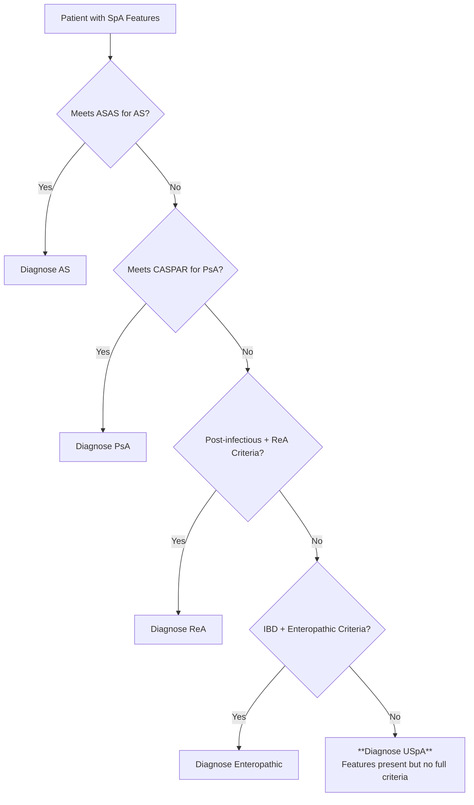
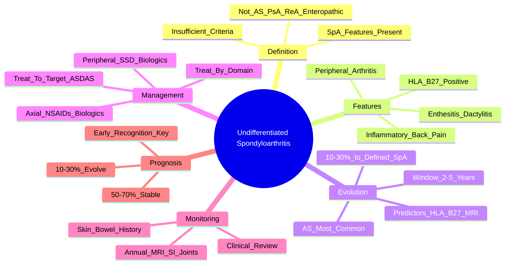

# Undifferentiated spondyloarthritis

---
tags: [medicine, rheumatology, davidson, uspa, fcps, mrcp]
chapter: Rheumatology
davidson_part: Part 3: Clinical Medicine
davidson_chapter: Chapter 26: Rheumatology and bone disease
heading: Inflammatory Arthritis
topic_group: Seronegative spondyloarthritis overview
topic: Undifferentiated spondyloarthritis
status: full-fcps-mrcp-note
priority: high
cards: 15
created: 2026-06-11
modified: 2026-06-11
exam_relevance: [FCPS, MRCP Part 1, MRCP Part 2, PACES]
see_also:
  - "[[Ankylosing spondylitis]]"
  - "[[Psoriatic arthritis]]"
  - "[[Reactive arthritis]]"
  - "[[Enteropathic arthritis]]"
  - "[[Drugs in rheumatology]]"
---

# Undifferentiated Spondyloarthritis (USpA)

> [!tip] **FCPS/MRCP Priority: HIGH**
> USpA = **SpA features present but insufficient criteria for AS, PsA, ReA, or enteropathic**. **HLA-B27 often +ve (60-80%)**. **10-30% evolve to defined SpA over 2-5 years**. Manage by domain (axial vs peripheral) with treat-to-target.

---

## Learning Objectives
By the end of this note you should be able to:
- [ ] Define USpA and differentiate from AS, PsA, ReA, enteropathic arthritis
- [ ] Apply ASAS criteria understanding: features present but **insufficient for specific classification**
- [ ] Recognise **progression risk**: 10-30% evolve to defined SpA (especially HLA-B27+, sacroiliitis on MRI)
- [ ] Manage by domain (axial vs peripheral) following SpA principles
- [ ] Monitor for evolution to defined SpA subtype

---

## 1. Definition & Epidemiology

| Feature | Detail |
|---------|--------|
| **Definition** | **SpA features present** (inflammatory back pain, arthritis, enthesitis, dactylitis, uveitis, psoriasis, IBD, HLA-B27, sacroiliitis) **but DO NOT meet ASAS criteria for AS, PsA, ReA, or enteropathic arthritis** |
| **Prevalence** | ~0.1-0.2% (similar to AS) |
| **Peak Onset** | **20-40 years** |
| **Sex Ratio** | **M = F** (varies) |
| **HLA-B27** | **60-80% positive** (predicts evolution to AS) |
| **Course** | May **remain undifferentiated**, **evolve to AS/PsA/ReA**, or **resolve** |

---

## 2. Clinical Features — SpA Features Without Full Criteria

| Domain | Features Present | Criteria Not Met |
|--------|------------------|------------------|
| **Axial** | Inflammatory back pain, MRI sacroiliitis (active) | **Insufficient for ASAS imaging arm** (e.g., unilateral grade 2 SIJ) |
| **Peripheral** | Asymmetric oligoarthritis, dactylitis, enthesitis | **Insufficient for PsA** (no psoriasis/nail/dactylitis), **ReA** (no trigger) |
| **Extraskeletal** | Acute anterior uveitis, IBD features (subclinical), psoriasis (minimal) | **Insufficient for specific SpA** |
| **Genetic** | **HLA-B27 +ve (60-80%)** | — |

> [!critical] **USpA = "SpA Incomplete"**
> - Has **≥1 SpA feature** but **fails to reach threshold** for AS, PsA, ReA, enteropathic
> - Often **prodromal/early phase** of a defined SpA

---

## 3. Evolution & Prognosis

| Outcome | Frequency | Predictors |
|---------|-----------|------------|
| **Evolves to AS** | **10-20%** | HLA-B27+, MRI sacroiliitis, male, inflammatory back pain |
| **Evolves to PsA** | 5-10% | Psoriasis development, nail changes, dactylitis |
| **Evolves to ReA** | <5% | Post-infectious trigger identified later |
| **Evolves to Enteropathic** | <5% | IBD diagnosis |
| **Remains USpA / Resolves** | **50-70%** | HLA-B27 negative, no MRI sacroiliitis, peripheral only |

> [!important] **Evolution Window**
> - **Highest risk in first 2-5 years** after presentation
> - **Annual review** for evolution to defined SpA
> - **MRI sacroiliitis + HLA-B27 = highest progression risk**

---

## 3. Diagnostic Approach

### Required for USpA Diagnosis
1. **≥1 SpA feature**: Inflammatory back pain, arthritis, enthesitis, dactylitis, uveitis, psoriasis, IBD, HLA-B27+, sacroiliitis on imaging
2. **Does NOT meet** ASAS criteria for AS, PsA, ReA, or enteropathic arthritis
3. **Exclusions**: RA (RF/CCP+), crystal arthritis, septic, mechanical back pain

---

## 4. Management — Treat by Domain

| Domain | Management |
|--------|------------|
| **Axial (Inflammatory Back Pain, Sacroiliitis)** | **NSAIDs 1st line** (continuous > PRN); **Physiotherapy**; **Anti-TNF/IL-17** if NSAID failure |
| **Peripheral Arthritis** | NSAIDs → **csDMARDs (SSZ, MTX)** → **Biologics (Anti-TNF, IL-17, IL-23)** |
| **Enthesitis/Dactylitis** | NSAIDs → Local steroid injection → **Biologics (Anti-TNF, IL-17, IL-23)** |
| **Uveitis** | **Urgent ophthalmology** → Topical steroids ± systemic |
| **IBD Features** | Gastroenterology referral; **Anti-TNF if joint + gut** |

> [!important] **Treat-to-Target in USpA**
> - **Target**: ASDAS <2.1 (low) or <1.3 (inactive) for axial; DAPSA/PASDAS for peripheral
> - **Monitor**: ASDAS/BASDAI q3-6mo; MRI if clinical change
> - **Escalate** if target not met at 3-6 months

---

## 4. Evolution Monitoring

| Monitoring | Frequency | Action if Positive |
|------------|-----------|-------------------|
| **HLA-B27** | Baseline | If +ve: higher evolution risk |
| **MRI SI Joints** | Baseline, then q1-2yr | New sacroiliitis → reclassify as AS |
| **X-ray SI Joints** | Annually | New radiographic changes → AS |
| **Skin/Nail Exam** | Each visit | New psoriasis/nail changes → PsA |
| **Stool/Calprotectin** | If GI symptoms | IBD diagnosis → Enteropathic |
| **Post-infectious History** | Each visit | New trigger → ReA |

---

## 5. FCPS/MRCP High-Yield Summary

| Topic | Key Points |
|-------|------------|
| **Definition** | SpA features **present but insufficient** for AS, PsA, ReA, enteropathic |
| **HLA-B27** | **60-80% positive** — predicts evolution to AS |
| **Evolution** | **10-30% evolve to defined SpA** over 2-5 years (AS most common) |
| **ASAS Criteria** | **Insufficient** for AS imaging arm (e.g., unilateral grade 2) or clinical arm |
| **Management** | **Treat by domain** (axial: NSAIDs → anti-TNF/IL-17; peripheral: NSAIDs → SSZ/MTX → biologics) |
| **Monitoring** | **Annual MRI SI joints** + clinical review for evolution |
| **Prognosis** | 50-70% remain stable/resolve; **early recognition → early treat-to-target** |

---

## 6. Viva Questions (MRCP PACES / FCPS)

| Question | Expected Answer |
|----------|----------------|
| "A 28yo man has inflammatory back pain for 1 year, HLA-B27 positive. MRI shows unilateral grade 2 sacroiliitis. No psoriasis, no preceding infection, no IBD. Diagnosis?" | **Undifferentiated Spondyloarthritis (USpA)** — features of SpA but **insufficient for ASAS AS criteria** (unilateral grade 2 not bilateral ≥2). |
| "What is the difference between USpA and AS?" | **USpA = SpA features but does NOT meet ASAS criteria for AS** (insufficient imaging or clinical criteria). AS = meets Modified NY or ASAS criteria. |
| "What proportion of USpA evolves to a defined SpA?" | **10-30% over 2-5 years** (AS most common). Predictors: HLA-B27+, MRI sacroiliitis, male sex. |
| "How do you manage USpA with axial symptoms?" | **NSAIDs continuous (1st line)** + physiotherapy. If inadequate → **Anti-TNF or Anti-IL-17** (as per AS algorithm). |
| "A USpA patient develops psoriasis and nail pitting. What is the new diagnosis?" | **Psoriatic Arthritis** — now meets CASPAR criteria. |
| "What is the role of MRI in USpA?" | **Baseline and surveillance** — detects early sacroiliitis; **progression to radiographic AS** = reclassification. |

---

## 7. Confusions & Mnemonics

| Confusion | Clarification |
|-----------|---------------|
| **USpA vs Early AS** | **USpA = doesn't meet ASAS criteria**. Early AS = **meets criteria** (imaging or clinical arm). USpA is a classification "holding pen". |
| **USpA vs Non-Radiographic Axial SpA (nr-axSpA)** | **nr-axSpA = meets ASAS clinical arm (HLA-B27 + ≥2 SpA features) or imaging arm (MRI sacroiliitis)**. USpA = **doesn't meet ASAS criteria at all** (fewer features). |
| **USpA vs Mechanical Back Pain** | USpA = **inflammatory back pain features** (age <45, improves exercise, night pain, AM stiffness >30min). Mechanical = opposite. |
| **USpA vs PsA** | PsA = **meets CASPAR** (psoriasis + features). USpA = **SpA features but NO psoriasis/nail/dactylitis meeting CASPAR**. |
| **Progression Risk** | **Not all USpA progresses** — 50-70% remain stable/resolve. Only HLA-B27+ with sacroiliitis progress. |

**Mnemonic: USpA = "UNSURE SpA"**
- **U**NSURE which SpA
- **N**OT meeting criteria
- **S**pA features present
- **U**ntil evolves
- **R**eview annually
- **E**volves 10-30%

**Mnemonic: Evolution Predictors = "HLA-MRI-MALE"**
- **HLA**-B27 positive
- **MRI** sacroiliitis
- **MALE** sex
- **E**arly inflammatory back pain

---

## 8. Mind Map

---

## 9. One-Page Revision Card

| Domain | Key Points |
|--------|------------|
| **Definition** | SpA features present but **insufficient for AS, PsA, ReA, enteropathic** |
| **HLA-B27** | **60-80% positive** — predicts evolution to AS |
| **Evolution** | **10-30%** evolve to defined SpA over 2-5 years (AS most common) |
| **Criteria Gap** | Fails ASAS for AS (imaging/clinical), CASPAR for PsA, ReA, enteropathic |
| **Management** | Treat by domain: **Axial = NSAIDs → Anti-TNF/IL-17**; Peripheral = NSAIDs → SSZ/MTX → Biologics |
| **Monitoring** | Annual MRI SI joints + clinical review for evolution |
| **Prognosis** | 50-70% stable/resolve; 10-30% evolve; early treat-to-target if evolves |

---

## 10. Spaced Repetition Trackers

| Review Interval | Date Completed | Confidence (1-5) | Notes |
|-----------------|----------------|------------------|-------|
| 24 hours | | | |
| 7 days | | | |
| 15 days | | | |
| 30 days | | | |
| 90 days | | | |

---

## 11. Self-Test Scorecard

| Section | Score /5 | Last Attempt |
|---------|----------|--------------|
| Definition vs AS/PsA/ReA | | |
| Evolution Predictors | | |
| Domain-Based Management | | |
| Monitoring for Evolution | | |
| Viva Questions | | |

---

## Local Navigation
- **Parent Heading**: [[../Inflammatory Arthritis|Inflammatory Arthritis]]
- **Parent Topic Group**: [[Seronegative spondyloarthritis overview]]
- **Chapter Map**: [[../Davidson Chapter 26 - Rheumatology Hierarchy|Rheumatology Hierarchy]]
- **Chapter MOC**: [[../Rheumatology MOC|Rheumatology MOC]]
- **Drug Reference**: [[../../Clinical Approach to Musculoskeletal Disease/Drugs in rheumatology|Drugs in rheumatology]]
- **Related**: [[Ankylosing spondylitis]] · [[Psoriatic arthritis]] · [[Reactive arthritis]] · [[Enteropathic arthritis]]
---

> Auto-generated study sections for "Inflammatory Arthritis" — Ch 25: Rheumatology & Bone Disease.

## Flashcards (7 generated)

- Q: What is the definition of Inflammatory Arthritis?
  A: SpA features present but insufficient for AS, PsA, ReA, enteropathic
- Q: What is HLA-B27 of Inflammatory Arthritis?
  A: 60-80% positive — predicts evolution to AS
- Q: What is Evolution of Inflammatory Arthritis?
  A: 10-30% evolve to defined SpA over 2-5 years (AS most common)
- Q: What is ASAS Criteria of Inflammatory Arthritis?
  A: Insufficient for AS imaging arm (e.g., unilateral grade 2) or clinical arm
- Q: How is Inflammatory Arthritis managed?
  A: Treat by domain (axial: NSAIDs → anti-TNF/IL-17; peripheral: NSAIDs → SSZ/MTX → biologics)
- Q: How is Inflammatory Arthritis monitored?
  A: Annual MRI SI joints + clinical review for evolution
- Q: What is the prognosis of Inflammatory Arthritis?
  A: 50-70% remain stable/resolve; early recognition → early treat-to-target

## MCQs (1 generated)

1. **Which of the following best describes Inflammatory Arthritis?**
   A. **USpA = SpA features present but insufficient criteria for AS, PsA, ReA, or enteropathic.**
   B. An unrelated condition not matching the clinical picture of Inflammatory Arthritis
   C. A complication seen late in the disease course of Inflammatory Arthritis
   D. A condition that mimics Inflammatory Arthritis but has a different underlying cause

## SBA Questions (1 generated)

1. A patient with suspected Inflammatory Arthritis presents with: Definition — SpA features present (inflammatory back pain, arthritis, enthesitis, dactylitis, uveitis, psoriasis, IBD, HLA-B27, sacroiliitis) but DO NOT meet ASAS criteria for AS, PsA, ReA, or enteropathic arthritis; Prevalence — ~0.1-0.2% (similar to AS); Peak Onset — 20-40 years. What is the most likely diagnosis?
   A. **Inflammatory Arthritis**
   B. A condition that mimics Inflammatory Arthritis but is not the same entity
   C. A complication of Inflammatory Arthritis rather than the primary diagnosis
   D. An unrelated condition in the same clinical category as Inflammatory Arthritis

## PasTest Scenario SBAs (Clinical Vignettes)

> **Auto-generated PasTest/Mediscope-style scenario SBAs** grounded in the authored source. Each scenario tests a real clinical fact (triad, specific sign, contraindication, trial, first-line Rx) extracted from the topic. *Source: Ch 25: Rheumatology — Undifferentiated spondyloarthritis*

**Q1.** Which of the following features is most specific or characteristic of Undifferentiated spondyloarthritis?

  - **A.** Extraskeletal
  - **B.** A feature common to many acute inflammatory conditions
  - **C.** A non-specific sign that does not localise the diagnosis
  - **D.** An investigation finding rather than a clinical feature

  > **Answer: A** — Extraskeletal
  >
  > *Source:* tis, enthesitis | **Insufficient for PsA** (no psoriasis/nail/dactylitis), **ReA** (no trigger) |
| **Extraskeletal** | Acute anterior uveitis, IBD features (subclinical), psoriasis (minimal) | **Insu

**Q2.** What is the most appropriate first-line therapy for Undifferentiated spondyloarthritis?

  - **A.** IBD Features + Anti-TNF if joint + gut + Treat-to-Target in USpA
  - **B.** An advanced/surgical therapy reserved for refractory disease
  - **C.** Symptomatic treatment only, no disease-modifying therapy
  - **D.** Empiric broad-spectrum therapy without specific indication

  > **Answer: A** — IBD Features + Anti-TNF if joint + gut + Treat-to-Target in USpA
  >
  > *Source:* **IBD Features**   Gastroenterology referral; **Anti-TNF if joint + gut**  

> [!important] **Treat-to-Target in USpA**
> - **Target**: ASDAS <2.1 (low) or <1.3 (inactive) for axial; DAPSA/PASDAS for 

