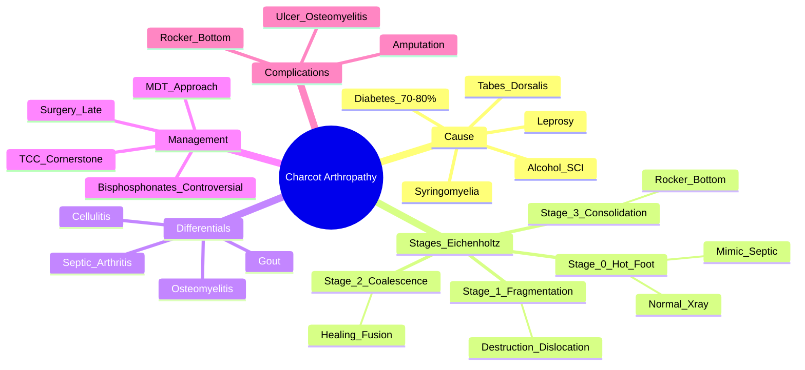

# Charcot Arthropathy (Neuropathic Arthropathy)

> [!tip] **FCPS/MRCP Priority: HIGH**
> Charcot = **neuropathic arthropathy** — **diabetes #1 cause**. **Stage 0 (acute): hot swollen foot = mimics septic arthritis/cellulitis**. **Eichenholtz stages 0-3**. **Key: neuropathy + preserved pulses + hot foot = Charcot until proven otherwise**. **Total contact cast = cornerstone**.

---

## Learning Objectives
By the end of this note you should be able to:
- [ ] Recognise **Charcot foot** as **neuropathy + trauma → unregulated bone destruction**
- [ ] Apply **Eichenholtz staging** (0-3) for classification and management
- [ ] Differentiate **acute Charcot (Stage 0)** from **septic arthritis** and **cellulitis**
- [ ] Identify **common causes**: **diabetes (most common)**, tabes dorsalis, syringomyelia, leprosy, alcohol, spinal cord injury
- [ ] Apply **management**: **offloading (total contact cast) = cornerstone**, bisphosphonates controversial, surgery for deformity/ulceration
- [ ] Recognise **multidisciplinary team**: orthopaedics, vascular, podiatry, diabetology

---

## 1. Definition & Epidemiology

| Feature | Detail |
|---------|--------|
| **Definition** | **Neuropathic arthropathy** — **neuropathy + repetitive trauma** → **unregulated bone resorption/formation** → joint destruction, dislocation, deformity |
| **Most Common Cause** | **Diabetes mellitus** (70-80%) — peripheral neuropathy |
| **Other Causes** | Tabes dorsalis (syphilis), syringomyelia, leprosy, alcohol, spinal cord injury, spina bifida, amyloidosis |
| **Incidence** | 0.1-0.5% of diabetics; rising with diabetes epidemic |
| **Peak Age** | 50-70 years |
| **Joints** | **Tarsometatarsal (midfoot) > ankle > knee > hip > shoulder** |

---

## 2. Pathophysiology

```mermaid
flowchart LR
    A[Neuropathy\n(Sensory + Autonomic)] --> B[Loss of Protective Sensation\n+ Pain Insensitivity]
    A --> C[Autonomic Dysfunction\n→ Arteriovenous Shunting\n→ Increased Blood Flow]
    B --> D[Repetitive Microtrauma\nUnperceived]
    C --> D
    D --> E[Unregulated Bone Turnover\nOsteoclast > Osteoblast\n→ Bone Resorption]
    D --> E
    E --> F[Joint Destruction\nDislocation, Fractures\nDeformity]
    F --> G[Charcot Arthropathy\nStages 0-3]
```

### Two Main Theories
| Theory | Mechanism |
|--------|-----------|
| **Neurotraumatic** | **Loss of pain/proprioception** → repetitive microtrauma → joint destruction |
| **Neurovascular** | **Autonomic neuropathy** → arteriovenous shunting → **increased blood flow** → osteopenia → bone resorption |

---

## 3. Eichenholtz Staging (0-3)

| Stage | Name | Clinical | Radiographic | Management |
|-------|------|----------|--------------|------------|
| **Stage 0** | **Acute Inflammation** | **Hot, red, swollen** foot; **erythema, warmth, oedema**; **mimics septic arthritis/cellulitis** | **Normal** or **mild osteopenia** | **IMMOBILISATION** (total contact cast) — **EMERGENCY** |
| **Stage 1** | **Fragmentation** | Decreasing inflammation; **joint destruction, dislocation, fractures**; "mushroom" deformity | **Bone destruction, dislocation, debris, osteophytes** | **Immobilisation** (TCC), offloading |
| **Stage 2** | **Coalescence** | Swelling subsides; **bone healing, sclerosis**, early fusion | **Decreased destruction, early fusion, rounding of fragments** | **Protected weight-bearing**, orthotics |
| **Stage 3** | **Consolidation** | **Stable, deformed foot**; "rocker-bottom" deformity; cool, non-inflamed | **Consolidation, remodelling, stable deformity** | **Accommodative footwear**, orthotics, surgery if ulcer/deformity |

> [!critical] **Stage 0 = Diagnostic Emergency**
> - **Hot, swollen, erythematous foot** in diabetic with neuropathy
> - **Preserved pulses** (vs vascular compromise)
> - **Neuropathy present** (absent protective sensation)
> - **Differential: Septic arthritis, cellulitis, gout, osteomyelitis**

---

## 4. Clinical Features by Stage

| Feature | Stage 0 (Acute) | Stage 1 (Fragmentation) | Stage 2 (Coalescence) | Stage 3 (Consolidation) |
|---------|-----------------|-------------------------|----------------------|------------------------|
| **Temperature** | **Hot** | Warm | Normal | Cool |
| **Erythema/Oedema** | **Marked** | Moderate | Minimal | None |
| **Pain** | **Mild** (neuropathy) | Moderate | Mild | None |
| **Deformity** | None | **Dislocation, fragmentation** | Early fusion | **Rocker-bottom, stable** |
| **Pulses** | **Preserved** (usually bounding) | Preserved | Preserved | Preserved |
| **Neuropathy** | **Present** (absent monofilament) | Present | Present | Present |

> [!critical] **Charcot vs Septic Arthritis**
> | Feature | **Charcot (Stage 0)** | **Septic Arthritis** |
> |---------|----------------------|---------------------|
> | **Systemic** | Afebrile, well | **Febrile, toxic** |
> | **Inflammatory Markers** | Normal/mildly ↑ | **Markedly ↑** (CRP >100) |
> | **Neuropathy** | **Present** | Absent (usually) |
> | **Pulses** | **Preserved** | Preserved |
> | **Skin** | Intact initially | May have portal of entry |
> | **Imaging** | Normal early | Rapid destruction |

---

## 5. Common Causes

| Cause | Mechanism | Typical Joints |
|-------|-----------|----------------|
| **Diabetes** (most common) | Peripheral + autonomic neuropathy | **Tarsometatarsal (midfoot) > ankle** |
| **Tabes Dorsalis** (Syphilis) | Dorsal column loss | Knee > hip |
| **Syringomyelia** | Spinothalamic loss | Shoulder > elbow |
| **Leprosy** | Peripheral nerve destruction | Hands, feet |
| **Alcohol** | Peripheral neuropathy | Feet |
| **Spinal Cord Injury** | Autonomic + sensory loss | Knee, hip |
| **Spina Bifida** | Congenital neuropathy | Feet, knees |

---

## 5. Diagnosis & Investigations

| Test | Role |
|------|------|
| **Clinical** | Neuropathy (10g monofilament, tuning fork), hot swollen foot, preserved pulses |
| **X-ray** | **Stage-dependent**: normal → fragmentation → coalescence → consolidation |
| **MRI** | **Gold standard early** — **bone marrow oedema** (Stage 0), soft tissue oedema, joint destruction |
| **Bone Scan** | Increased uptake (all stages) — sensitive not specific |
| **Inflammatory Markers** | **CRP/ESR normal/mildly ↑** (vs septic: markedly ↑) |
| **Vascular** | **Pulses preserved**, ABI/TBI normal (unless PAD coexistent) |

> [!important] **Diagnostic Criteria (Clinical)**
> 1. **Diabetes/neuropathy** (or other cause)
> 2. **Hot, swollen, erythematous foot** (Stage 0)
> 3. **Preserved pulses**
> 4. **Absent protective sensation** (10g monofilament)
> 5. **Exclusion of infection** (normal CRP, no portal, afebrile)

---

## 6. Management

```mermaid
flowchart TD
    A[Suspected Charcot Stage 0] --> B[**EXCLUDE INFECTION**\nCRP, ESR, blood cultures\nMRI if uncertain]
    B --> C[**IMMEDIATE TOTAL CONTACT CAST (TCC)**\nNon-weightbearing / minimal weightbearing]
    C --> D[**Weekly Cast Changes + Clinical Review**]
    D --> E{Stage Progression}
    E -->|Stage 1| F[Continue TCC 3-6 months\nSerial X-rays]
    E -->|Stage 2| G[Removable Walker Boot\nCustom Orthotics\nGradual Weight-Bearing]
    E -->|Stage 3| H[Accommodative Footwear\nCustom Orthotics\nSurgery if Ulcer/Deformity]
```

### Key Management Principles

| Principle | Detail |
|-----------|--------|
| **Offloading = Cornerstone** | **Total Contact Cast (TCC)** — gold standard; weekly changes; 3-12 months |
| **Weight-Bearing** | **Non-weightbearing** (Stage 0-1) → gradual progression |
| **Bisphosphonates** | **Controversial** — may reduce bone turnover; short course (3-6mo) in acute phase |
| **Surgery** | **Deformity correction, ulcer management, amputation** (last resort) |
| **Multidisciplinary** | **Orthopaedics, Vascular, Podiatry, Diabetology, Orthotist** |

> [!warning] **Bisphosphonates in Charcot**
> - **Evidence weak** — some RCTs show faster coalescence
> - **Short course (3-6 months)** in acute phase only
> - **Not standard of care** — offloading is primary

---

## 6. Complications

| Complication | Detail |
|--------------|--------|
| **Rocker-Bottom Foot** | Midfoot collapse (tarsometatarsal) → abnormal pressure distribution |
| **Ulceration** | Over bony prominences (especially with deformity) → osteomyelitis risk |
| **Osteomyelitis** | Contiguous from ulcer → contiguous spread |
| **Amputation** | Non-healing ulcer, uncontrolled infection, failed reconstruction |
| **Recurrence** | Contralateral foot or same foot if offloading inadequate |

---

## 7. FCPS/MRCP High-Yield Summary

| Topic | Key Points |
|-------|------------|
| **Definition** | Neuropathy + trauma → unregulated bone destruction |
| **Diabetes** | **#1 cause** (70-80%) — peripheral + autonomic neuropathy |
| **Stage 0** | **Hot, swollen, erythematous foot** = **mimics septic/cellulitis** — **PRESERVED PULSES, NEUROPATHY** |
| **Eichenholtz** | **0=Acute inflammation, 1=Fragmentation, 2=Coalescence, 3=Consolidation/Rocker-bottom** |
| **Differentiation** | **Charcot: afebrile, normal CRP, neuropathy, preserved pulses**. **Septic: febrile, CRP↑↑, no neuropathy** |
| **Management** | **Total Contact Cast (TCC) = cornerstone**; bisphosphonates controversial; surgery late |
| **Rocker-Bottom** | Midfoot collapse (tarsometatarsal) = late deformity |
| **Multidisciplinary** | Orthopaedics, vascular, podiatry, diabetology, orthotist |

---

## 8. Viva Questions (MRCP PACES / FCPS)

| Question | Expected Answer |
|----------|----------------|
| "A 60yo diabetic man has a hot, swollen, erythematous right foot. Pulses palpable, monofilament sensation absent. CRP 15. X-ray normal. Diagnosis and immediate management?" | **Charcot Stage 0 (acute)**. **Immediate total contact cast (TCC)**. Exclude infection (normal CRP helps). Non-weightbearing. |
| "What are the Eichenholtz stages of Charcot arthropathy?" | **0: Acute inflammation (hot foot, normal X-ray). 1: Fragmentation (destruction, dislocation). 2: Coalescence (healing, decreased swelling). 3: Consolidation (rocker-bottom deformity, stable)**. |
| "How do you differentiate acute Charcot foot from septic arthritis?" | **Charcot: afebrile, normal/mild CRP, neuropathy present, preserved pulses, intact skin initially. Septic: febrile, toxic, CRP↑↑, no neuropathy, may have skin breach.** |
| "What is the rocker-bottom deformity in Charcot foot?" | **Midfoot collapse (tarsometatarsal joint destruction)** → **convex plantar surface** → abnormal pressure → ulcer risk. |
| "What is the cornerstone of Charcot management?" | **Total Contact Cast (TCC)** — immediate immobilisation, non-weightbearing, weekly changes, 3-12 months. |
| "When do you use bisphosphonates in Charcot?" | **Controversial** — some evidence for short course (3-6mo) in acute phase to reduce bone turnover; not standard of care. |
| "What are the common causes of Charcot arthropathy?" | **Diabetes (70-80%)**, tabes dorsalis, syringomyelia, leprosy, alcohol, spinal cord injury, spina bifida. |
| "A diabetic with Charcot foot develops ulcer over rocker-bottom deformity. Next step?" | **Offloading (TCC/orthotics), vascular assessment, wound care, antibiotics if infected, orthopaedic referral for possible surgery**. |

---

## 9. Confusions & Mnemonics

| Confusion | Clarification |
|-----------|---------------|
| **Charcot vs Septic Arthritis** | Charcot: **afebrile, normal CRP, neuropathy, preserved pulses, intact skin**. Septic: **febrile, CRP↑↑, toxic, no neuropathy**. |
| **Charcot vs Cellulitis** | Cellulitis: **spreading erythema, fever, elevated CRP**, no joint destruction. Charcot: **joint destruction on imaging**, neuropathy. |
| **Stage 0 X-ray** | **Normal** — diagnosis clinical; MRI shows marrow oedema. |
| **Bisphosphonates** | **Not standard** — short course in acute phase may help; **offloading is primary**. |
| **Rocker-Bottom** | **Midfoot collapse (tarsometatarsal)** → **convex plantar surface** → ulcer risk. |
| **Pulses in Charcot** | **Preserved** (often bounding due to autonomic neuropathy) — key differentiator from vascular disease. |

**Mnemonic: Charcot = "NEUROPATHY + TRAUMA"**
- **N**europathy
- **E**arly (Stage 0 = hot foot)
- **U**nregulated bone turnover
- **R**ocker-bottom (late)
- **O**ffloading (TCC)
- **P**reserved pulses
- **A**utonomic dysfunction
- **T**rauma (repetitive microtrauma)
- **H**ot foot (Stage 0)
- **Y**ellow? No — diabetes

**Mnemonic: Eichenholtz = "0-1-2-3 = HOT-FRAG-COAL-ROCK"**
- **0** = **HOT** (acute inflammation)
- **1** = **FRAG**mentation (destruction)
- **2** = **COAL**escence (healing)
- **3** = **ROCK**er-bottom (stable deformity)

**Mnemonic: Stage 0 vs Septic = "CAPS"**
- **C**RP normal (Charcot) vs ↑↑ (Septic)
- **A**fibrile (Charcot) vs Febrile (Septic)
- **P**ulses preserved (both)
- **S**ensation absent (Charcot) vs present (Septic)

**Mnemonic: ROcker-Bottom = "MIDFOOT COLLAPSE"**
- **MID**foot
- **FOOT** collapse (tarsometatarsal)
- **CONVEX** plantar surface

---

## 10. Mind Map



---

## 11. One-Page Revision Card

| Domain | Key Points |
|--------|------------|
| **Cause** | **Diabetes #1** (70-80%) — peripheral + autonomic neuropathy |
| **Stage 0** | **Hot, swollen, erythematous foot** = mimics septic; **normal X-ray**; **preserved pulses**, neuropathy |
| **Eichenholtz** | 0=Hot, 1=Fragmentation, 2=Coalescence, 3=Rocker-bottom |
| **Differentiation** | **Charcot: afebrile, normal CRP, neuropathy, preserved pulses**. **Septic: febrile, CRP↑↑, toxic** |
| **Management** | **TCC = cornerstone** (immediate, non-weightbearing, weekly changes, 3-12mo) |
| **Bisphosphonates** | Controversial; short course acute phase only |
| **Rocker-Bottom** | Midfoot collapse (tarsometatarsal) → convex plantar → ulcer risk |
| **Multidisciplinary** | Orthopaedics, vascular, podiatry, diabetology, orthotist |

---

## 12. Spaced Repetition Trackers

| Review Interval | Date Completed | Confidence (1-5) | Notes |
|-----------------|----------------|------------------|-------|
| 24 hours | | | |
| 7 days | | | |
| 15 days | | | |
| 30 days | | | |
| 90 days | | | |

---

## 13. Self-Test Scorecard

| Section | Score /5 | Last Attempt |
|---------|----------|--------------|
| Eichenholtz Staging | | |
| Stage 0 vs Septic | | |
| TCC Application | | |
| Rocker-Bottom Recognition | | |
| Differential Diagnosis | | |
| Viva Questions | | |

---

## Local Navigation
- **Parent Heading**: [[../Osteoarthritis and Related Disorders|Osteoarthritis and Related Disorders]]
- **Parent Topic Group**: [[Common regional musculoskeletal problems]]
- **Chapter Map**: [[../Davidson Chapter 26 - Rheumatology Hierarchy|Rheumatology Hierarchy]]
- **Chapter MOC**: [[../Rheumatology MOC|Rheumatology MOC]]
- **Drug Reference**: [[../../Clinical Approach to Musculoskeletal Disease/Drugs in rheumatology|Drugs in rheumatology]]
- **Related**: [[Osteoarthritis]] · [[Septic arthritis]] · [[Osteomyelitis]] · [[Diabetic foot]]