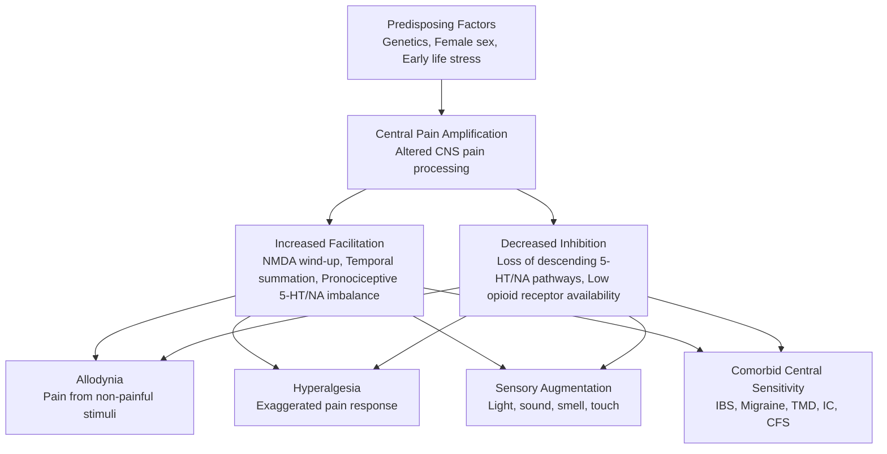
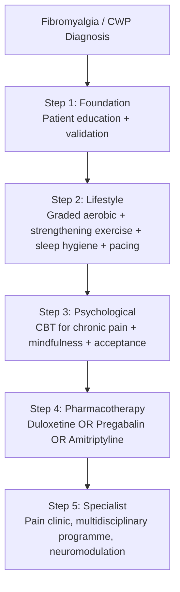
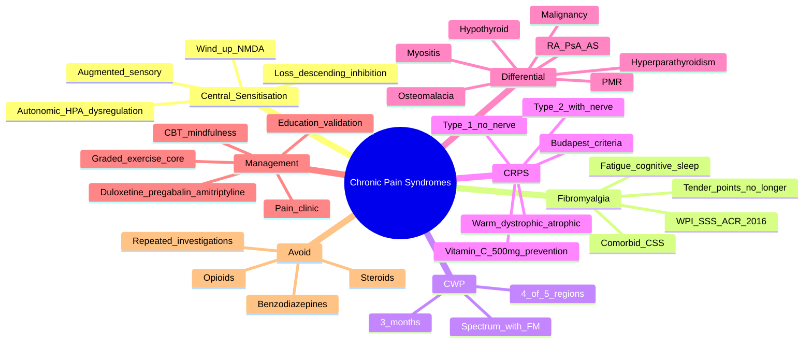

# Chronic Pain Syndromes and Fibromyalgia — Integrated Overview

> [!tip] **FCPS/MRCP Priority: HIGH**
> Chronic pain syndromes are **prevalent (1 in 5 adults)** but **frequently missed or mismanaged**. Must know: **central sensitisation** as the unifying mechanism, **ACR 2016 criteria** for fibromyalgia (WPI + SSS — no tender points), the **multidisciplinary management pyramid** (exercise + education + CBT + duloxetine/amitriptyline), and the **rules of engagement**: **avoid opioids, validate the patient, exclude inflammatory mimics**. **CRPS** (formerly reflex sympathetic dystrophy) is a separate entity — Budapest criteria + aggressive early rehab.

---

## Learning Objectives
By the end of this note you should be able to:
- [ ] Explain **central sensitisation** and how it unifies fibromyalgia, CWP, IBS, migraine, TMD
- [ ] Apply **ACR 2016 criteria** for fibromyalgia (WPI ≥7/SSS ≥5 or WPI 4-6/SSS ≥9)
- [ ] Differentiate fibromyalgia from **inflammatory polyarthritis, hypothyroidism, hyperparathyroidism, polymyalgia**
- [ ] Implement **stepped multidisciplinary management** (education → exercise → pharmacotherapy)
- [ ] Recognise and apply **Budapest criteria** for **complex regional pain syndrome (CRPS)**
- [ ] Counsel patients on **central sensitivity syndromes** comorbidity and prognosis
- [ ] Avoid harm: **no opioids, no long-term steroids, no multiple escalating investigations**

---

## 1. Definition & Epidemiology
| Feature | Fibromyalgia | Chronic Widespread Pain | CRPS |
|---------|--------------|--------------------------|------|
| **Definition** | Chronic widespread pain + fatigue + sleep/cognitive dysfunction; **no tissue damage** | Pain in **≥4/5 body regions** (axial + 3 of 4 quadrants) ≥3 months | Pain disproportionate to injury, sensory/vascular/motor/trophic changes in a **limb** |
| **Prevalence** | **2-8%** of adults; F:M 3:1 | Up to 10-15% in primary care | **5-26/100,000** person-years; F > M; usually limb trauma (fracture, sprain, surgery) |
| **Age** | **30-60y** peak | Any adult | **40-60y**, post-trauma |
| **Risk factors** | Female sex, family history, **early life stress**, other central sensitivity syndromes (IBS, migraine, TMD) | Age, female sex, low SES, prior regional pain | **Immobilisation, trauma, surgery, fracture**; rare post-stroke |
| **Cost** | High healthcare utilisation, **£/$$/৳ disproportionate to pathology** | Functional disability, work absence | Severe disability, often chronic |

---

## 2. Pathophysiology — Central Sensitisation

### Key Mechanisms
| Mechanism | Description | Therapeutic Implication |
|-----------|-------------|--------------------------|
| **Wind-up / temporal summation** | Repeated stimuli → progressively amplified response (NMDA-mediated) | NMDA antagonists (ketamine — research); SNRIs |
| **Loss of descending inhibition** | Reduced efficacy of brainstem pain modulatory pathways (5-HT, NA, endogenous opioids) | SNRIs (duloxetine), TCAs (amitriptyline), gabapentinoids |
| **Augmented sensory processing** | Functional MRI: increased activity in insula, S1, ACC; reduced connectivity in default mode | CBT, mindfulness — top-down modulation |
| **Altered autonomic / HPA axis** | Dysregulated cortisol, sympathetic hyperactivity (especially CRPS) | Graded exercise, relaxation |
| **Peripheral input (nociplastic)** | Small fibre pathology in subset (reduced IENFD); not classical nociceptive | Role of immunomodulation is uncertain |
| **Genetic & epigenetic** | Family clustering; **COMT, ADRB2, HTR2A** polymorphisms; stress-related DNA methylation | Explains family aggregation and female predominance |

> [!important] **Fibromyalgia Is a Real Disease**
> It is **nociplastic pain** — a state of altered nociception. Imaging shows reproducible CNS changes. Patient education must validate the experience while explaining the absence of tissue damage.

---

## 3. Fibromyalgia — Clinical Features
### Core Symptoms
| Domain | Features |
|--------|----------|
| **Pain** | **Widespread** (axial + 4 quadrants), dull aching, "deep," both muscles and joints, **migratory** |
| **Fatigue** | Profound, **non-restorative sleep** (95%), morning stiffness (often reported but not true inflammation) |
| **Cognitive** | **"Fibro fog"**: poor concentration, working memory, word finding |
| **Sensory** | Allodynia (clothing, light touch), hyperresponsiveness to light/sound/smell |
| **Other** | Headaches, IBS, dysmenorrhoea, Raynaud-like symptoms, anxiety/depression (50%), restless legs |

### Examination
- **Pain on palpation** of soft tissues (often in the 18 tender points historically, **no longer required**)
- **Normal joints** (no synovitis), **normal neurology**
- **Skin** may be hyperaesthetic; **mechanical allodynia** on stroking
- **Fibro fog** evident on cognitive testing
- **Functional impact**: reduced grip, slow movements, "clumsy" but no weakness

---

## 4. Diagnostic Criteria — ACR 2016 (Self-Report)
| Component | Definition |
|-----------|------------|
| **Widespread Pain Index (WPI)** | Count of **19 body regions** with pain in past week (range 0-19) |
| **Symptom Severity (SSS)** | 3 symptoms × 0-3 scale: **fatigue, unrefreshing sleep, cognitive symptoms** (0-3 each, total 0-9) |
| **Somatic symptoms** | Count of somatic symptoms in past 6 months (0 = none, 1 = few, 2 = moderate, 3 = many) — added 2010/2011 |
| **Duration** | Symptoms ≥ **3 months** |
| **Other diagnoses** | No other disorder explains the pain |

### Diagnostic Cut-Off
- **WPI ≥ 7 AND SSS ≥ 5** → meets criteria
- **OR WPI 4-6 AND SSS ≥ 9** → meets criteria
- **Polysymptomatic distress (PSD) scale** (WPI + SSS 0-31) — continuous measure of severity

> [!tip] **ACR 2016 — No Tender Points Required**
> The 1990 ACR criteria (11/18 tender points) was **replaced** in 2010/2011 and superseded by 2016 self-report. Tender point examination is **no longer recommended** for diagnosis. Diagnosis is **clinical**, not based on tender points.

### Differential Diagnosis
| Condition | Distinguishing Features |
|-----------|-------------------------|
| **Inflammatory polyarthritis (RA, PsA, AS)** | Joint swelling, morning stiffness >1h, raised CRP/ESR, autoantibodies |
| **Polymyalgia rheumatica** | **Age >50**, shoulder/pelvic girdle, **ESR/CRP very high**, dramatic steroid response |
| **Hypothyroidism** | Fatigue, weight gain, cold intolerance, ↑TSH |
| **Hyperparathyroidism** | Bone pain, weakness, stones, moans, groans; ↑Ca, ↑PTH |
| **Vitamin D deficiency / osteomalacia** | Bone pain, proximal weakness, ↓vitamin D, ↓Ca/PO4 |
| **Myositis (polymyositis)** | Symmetrical proximal weakness, ↑CK, abnormal EMG/biopsy |
| **Inflammatory myopathy/mitochondrial** | Exercise intolerance, CK, EMG |
| **Multiple sclerosis** | CNS lesions, demyelination, MRI |
| **Cancer (especially prostate, lung, breast with bone mets)** | Weight loss, night sweats, focal bone pain, ↑ALP, ↑PSA |
| **Depression** | Anhedonia, low mood, sleep disturbance, **but pain pattern atypical** |
| **Lyme disease** | Travel/exposure, erythema migrans, serology, joint (typically mono/oligo) |

> [!warning] **Rules Before Fibromyalgia Diagnosis**
> 1. **Always check ESR, CRP, TSH, vitamin D, Ca, CK** (basic screen)
> 2. **Consider autoantibodies** (RF, anti-CCP, ANA) if joint swelling/morning stiffness
> 3. **Imaging** only if focal exam findings or red flags
> 4. **Do not under- or over-investigate** — repeated normal investigations reinforce illness anxiety

---

## 5. Chronic Widespread Pain (CWP)
- **Definition** (ACR 1990): Pain in **≥4 of 5 body regions** (axial + 3 of 4 quadrants) **≥3 months**
- **Spectrum**: CWP includes fibromyalgia (at more severe end) + less symptomatic chronic regional pain
- **Mechanism**: Same as fibromyalgia — **central sensitisation**
- **Management**: Same principles — **multidisciplinary, exercise, education, pharmacotherapy** as needed

> [!note] **CWP and Fibromyalgia Are a Spectrum, Not Separate Diseases**
> CWP = symptom (pain in 4/5 regions); Fibromyalgia = clinical syndrome (CWP + fatigue + cognitive + sleep). Both share the same central mechanism.

---

## 6. Complex Regional Pain Syndrome (CRPS) — Budapest Criteria
| Feature | Detail |
|---------|--------|
| **Old name** | Reflex sympathetic dystrophy (type 1), causalgia (type 2) |
| **Trigger** | **Trauma** (fracture, sprain, surgery) — sometimes minor or no clear injury |
| **Pathophysiology** | **Peripheral + central sensitisation**, neurogenic inflammation, sympathetic dysregulation, small fibre neuropathy |
| **Type 1** | **No identifiable nerve lesion** (most common) |
| **Type 2** | **Identifiable nerve lesion** (formerly causalgia) |

### Budapest Diagnostic Criteria (4 categories, must have ≥1 sign in ≥3 categories at time of assessment)
| Category | Symptoms (subjective) | Signs (objective) |
|----------|----------------------|-------------------|
| **Sensory** | Hyperaesthesia, allodynia | Pinprick, light touch, thermal, deep pressure allodynia |
| **Vasomotor** | Temperature asymmetry, skin colour changes | Temperature >1°C asymmetry, colour change (red/pale/cyanosed) |
| **Sudomotor/oedema** | Oedema, sweating asymmetry | Oedema, sweating asymmetry |
| **Motor/trophic** | Decreased ROM, weakness, tremor, dystonia, trophic changes | Weakness, tremor, dystonia, hair/nail/skin atrophy |

### Phases
| Phase | Features |
|-------|----------|
| **Acute (warm)** | Hot, red, swollen, painful, sweaty limb; hyperaesthesia |
| **Dystrophic (cold)** | Cool, pale/cyanosed, oedema, stiffness, trophic changes |
| **Atrophic (chronic)** | Skin atrophy, contractures, osteoporosis, fixed deformities |

### Management of CRPS
- **Early physiotherapy** (mirror therapy, graded motor imagery, desensitisation) — **single most important**
- **Pharmacotherapy**: Bisphosphonates (acute inflammatory), **gabapentin/pregabalin**, TCAs, SNRIs, **topical capsaicin**, **IV ketamine** (refractory)
- **Sympathetic blocks** (stellate ganglion, lumbar) — limited evidence, time-limited benefit
- **Spinal cord stimulation** (severe, refractory)
- **Psychological support**: CBT for chronic pain, anxiety, depression
- **Vitamin C 500 mg daily for 50 days** post-wrist fracture (prevention, based on Zollinger)

> [!warning] **CRPS Recognition**
> Suspect in: **pain disproportionate to injury, out-of-proportion allodynia, vasomotor asymmetry, swelling/tremor/dystonia** in a limb, often **delayed recovery**. **Early mobilisation + vitamin C** is best prevention; **delay leads to chronic disability**.

---

## 7. Other Central Sensitivity Syndromes — Comorbidities
| Syndrome | Key Features | Overlap with FM |
|----------|--------------|-----------------|
| **Irritable bowel syndrome (IBS)** | Abdominal pain, altered bowel habit, no organic cause | **70%** of FM patients have IBS |
| **Migraine** | Recurrent severe headache, photophobia, aura | 2-3× higher in FM |
| **Temporomandibular disorder (TMD)** | Jaw pain, clicking, restricted opening | Common in FM |
| **Chronic fatigue syndrome (CFS/ME)** | Fatigue ≥6 months, post-exertional malaise, cognitive dysfunction | 50-70% overlap with FM |
| **Interstitial cystitis / painful bladder** | Suprapubic pain, urgency, frequency | Common in FM (especially women) |
| **Endometriosis** | Pelvic pain, dysmenorrhoea | Increased FM risk |
| **Restless legs syndrome** | Urge to move legs, worse at night | Common in FM |
| **Multiple chemical sensitivity** | Symptoms with low-level chemical exposure | Reported in subset of FM |

> [!important] **The "Central Sensitivity Spectrum"**
> Fibromyalgia + IBS + migraine + TMD + CFS + IC = the **central sensitivity syndromes**. Recognising this cluster is key: patients often have multiple overlapping conditions, each benefiting from the same multidisciplinary approach.

---

## 8. Investigations — What to Do and What to Avoid
### Minimal Screen (Rule Out Mimics)
| Test | Why |
|------|-----|
| **ESR, CRP** | Inflammatory mimic (PMR, RA, infection, cancer) |
| **FBC** | Anaemia, infection, haematological malignancy |
| **TFTs (TSH)** | Hypothyroidism (fatigue, myalgia) |
| **Vitamin D, Ca, PO4, ALP** | Osteomalacia, hyperparathyroidism, Paget's |
| **Creatine kinase (CK)** | Myositis |
| **LFTs** | Hepatitis, alcohol |
| **Glucose / HbA1c** | Diabetic neuropathy |
| **Iron studies / ferritin** | Iron deficiency, haemochromatosis (with transferrin sat) |
| **Urine dipstick** | Protein, blood, glucose |

### Do NOT Do (Unless Specific Indication)
- **Routine autoantibody panel** (RF, anti-CCP, ANA) — high false-positive in primary care population
- **Whole-body imaging** (CT, MRI) — low yield, reinforces illness anxiety
- **Multiple repeated investigations** when initial workup normal
- **Biopsy of trigger points** (no diagnostic value)

> [!tip] **"Reassurance Without Reassuring"**
> Avoid vague reassurance ("it's all in your head," "nothing wrong with you"). Instead, **explain the mechanism** (sensitisation, not damage), **validate the experience**, and **outline a plan** (exercise, sleep, therapy). This is more effective than normal investigations.

---

## 9. Management — Stepped Multidisciplinary Approach
### Pyramid of Care

### Step 1 — Education and Validation
- **Explain the diagnosis** as a **real, biological condition** (altered pain processing, not damage)
- **Set expectations**: improvement over months, not days; function > pain
- **Validate** the impact on life
- **Explain** role of stress, sleep, activity, mood
- **Resources**: Arthritis Research UK / EULAR / ACR patient information; books (e.g., "The Fibromyalgia Book")

### Step 2 — Lifestyle (Core of Treatment)
| Intervention | Effect | Notes |
|--------------|--------|-------|
| **Graded aerobic exercise** | **30 min × 3/week**, swimming/walking, **moderate intensity** (60-70% HRmax); **strongest evidence** | Start very low, **increase slowly (10%/week)** to avoid flare |
| **Strengthening** | Twice weekly, light → moderate | Pilates, resistance bands, gym |
| **Pacing** | **Activity-rest balance**; break tasks into small chunks; avoid boom-bust | Use "3 Ps" (Pace, Plan, Prioritise) |
| **Sleep hygiene** | Regular schedule, no screens, cool room, no caffeine/alcohol before bed; treat insomnia | **CBT-I** first-line for chronic insomnia |
| **Stress management** | Relaxation, mindfulness, hobbies, social support | Reduces central sensitisation |

> [!tip] **Exercise — The Most Evidence-Based "Drug"**
> Aerobic exercise is **first-line** with the strongest RCT evidence. The "FM flare" after exercise is **expected** early — reassure and **encourage to persist** (start low, build up).

### Step 3 — Psychological Therapies
| Modality | Effect | Notes |
|----------|--------|-------|
| **Cognitive behavioural therapy (CBT)** | **Reduces catastrophising, improves coping**; moderate effect on pain/function | EULAR recommended |
| **Acceptance and commitment therapy (ACT)** | Improves function, reduces disability | Alternative to CBT |
| **Mindfulness-based stress reduction (MBSR)** | Reduces pain perception, improves wellbeing | 8-week programs |
| **Pain neuroscience education** | Explains central sensitisation; reduces fear | Often combined with exercise |

### Step 4 — Pharmacotherapy
| Drug | Mechanism | Dose | Evidence | Notes |
|------|-----------|------|----------|-------|
| **Duloxetine** | SNRI | **30-60 mg/day** | **Strong** (FDA-approved for FM) | Start 30 mg; avoid in severe liver disease |
| **Pregabalin** | α2δ Ca channel | **150-450 mg/day** | **Strong** (FDA-approved) | Start 75 mg BD; dizziness, weight gain |
| **Amitriptyline** | TCA | **10-50 mg nocte** | **Moderate** (used off-label) | Low-dose, **NOT antidepressant dose**; dry mouth, drowsiness |
| **Gabapentin** | α2δ Ca channel | 900-2400 mg/day | Moderate | Less evidence than pregabalin |
| **Milnacipran** | SNRI | 50-100 mg BD | FDA-approved (US) | Not widely available in UK |
| **Tramadol** (last-line) | μ-opioid + SNRI | — | Limited | **Avoid if possible**; dependence risk |
| **Paracetamol, NSAIDs, opioids** | — | — | **NOT recommended** | Ineffective or harmful long-term |

> [!warning] **Drugs to AVOID in Fibromyalgia**
> - **Long-term opioids** (no efficacy, dependence, hyperalgesia)
> - **Oral steroids** (no role, harms)
> - **Benzodiazepines** (dependence, cognitive decline)
> - **Sodium valproate, gabapentinoids in young women** (teratogenicity — discuss contraception)
> - **Antipsychotics** (unless for separate psychiatric indication)
> - **Multiple sedating drugs in combination** (falls, cognitive impairment)

### Step 5 — Specialist Referral
- **Pain clinic**: if refractory to optimised primary care management
- **Multidisciplinary programmes**: 4-8 week residential or outpatient
- **Neuromodulation**: TENS (limited), **spinal cord stimulation** (severe CRPS)
- **IV ketamine/lidocaine**: experimental, specialist centres only
- **Cannabinoids**: research ongoing, not currently recommended
- **Complementary therapies**: acupuncture (modest benefit), tai chi, yoga, hydrotherapy (helpful adjuncts)

---

## 10. Special Populations
### Pregnancy
- **Continue amitriptyline/gabapentin** if benefitting (discuss with obstetrician)
- **Duloxetine**: limited data; consider tapering if newly pregnant
- **Pregabalin**: register; discuss with teratology service
- **Exercise and CBT** should be primary
- **Multidisciplinary** care with obstetric anaesthesia

### Children and Adolescents
- **Juvenile fibromyalgia** exists (often misdiagnosed as growing pains)
- **Family-based CBT** + graded exercise; minimise school absence
- **No pharmacological** management as first-line
- **Address sleep, mood, school avoidance**

### Older Adults
- **Higher comorbidity** (OA, polymyalgia, falls risk)
- **Lower-dose amitriptyline** start (5-10 mg)
- **Beware falls** with gabapentinoids
- **Exercise** still first-line

### Comorbid Inflammatory Arthritis
- **Fibromyalgia can coexist** with RA, AS, PsA — **30% of RA patients** have FM
- **Causes "high patient global"** despite objective low disease activity — use CDAI/SDAI
- **Treat both** aggressively; FM does not invalidate the inflammatory disease

---

## 11. FCPS/MRCP High-Yield Summary
| Topic | Key Points |
|-------|------------|
| **Mechanism** | **Central sensitisation** = ↑ facilitation (NMDA wind-up) + ↓ inhibition (5-HT/NA, opioid) |
| **Fibromyalgia definition** | Widespread pain + fatigue + cognitive + sleep symptoms ≥3 months; no tissue damage |
| **ACR 2016 criteria** | WPI ≥7 + SSS ≥5, OR WPI 4-6 + SSS ≥9; **no tender points**; self-report |
| **SSS** | Fatigue + unrefreshing sleep + cognitive symptoms (0-3 each) + somatic count |
| **CWP** | Pain in ≥4/5 body regions ≥3 months (axial + 3 quadrants); same spectrum as FM |
| **Differential** | RA/AS/PsA, PMR, hypothyroid, hyperparathyroidism, osteomalacia, myositis, malignancy, depression |
| **Screening tests** | ESR, CRP, FBC, TSH, vitamin D, Ca, PO4, ALP, CK, LFT, glucose, ferritin |
| **Core treatment** | **Education + graded aerobic exercise**; **avoid opioids and steroids** |
| **Drugs** | **Duloxetine, pregabalin, amitriptyline** (low-dose); tramadol last-line |
| **Avoid** | **Opioids, steroids, benzodiazepines, antipsychotics** |
| **CRPS** | Pain disproportionate to injury; Budapest criteria (4 categories); **early rehab + vitamin C 500 mg** (prevention post-fracture) |
| **Central sensitivity syndromes** | FM + IBS + migraine + TMD + CFS + IC = overlapping central mechanisms |
| **Comorbid RA** | 30% of RA patients have FM; use CDAI/SDAI not DAS28-Pt global |

---

## 12. Viva Questions (MRCP PACES / FCPS)
| Question | Expected Answer |
|----------|-----------------|
| "A 45yo woman has 2 years of widespread pain, fatigue, 'fibro fog'. Examination normal. ESR 12, TSH 2. Diagnosis?" | **Fibromyalgia**. Apply **ACR 2016 criteria** (WPI ≥7 + SSS ≥5; or WPI 4-6 + SSS ≥9) + ≥3 months + no other cause. |
| "What is the mechanism of fibromyalgia?" | **Central sensitisation** — augmented pain facilitation (NMDA wind-up) + impaired descending inhibition (5-HT, NA, opioid). |
| "First-line management of fibromyalgia?" | **Education + graded aerobic exercise (30 min × 3/week, build slowly)** + sleep hygiene + pacing. Then add CBT, then consider duloxetine, pregabalin, or amitriptyline. |
| "What drugs should be AVOIDED in fibromyalgia?" | **Opioids, oral steroids, benzodiazepines, antipsychotics**; paracetamol and NSAIDs ineffective. |
| "Differentiate fibromyalgia from polymyalgia rheumatica." | **PMR**: age >50, **shoulder/pelvic girdle**, **ESR/CRP very high** (often >50), **dramatic steroid response**. **FM**: any age, **widespread axial + peripheral**, **normal ESR/CRP**, central sensitisation, no steroid response. |
| "A patient has hand and foot pain after a wrist fracture 6 weeks ago. The hand is now red, swollen, sweaty, hypersensitive. Diagnosis?" | **CRPS type 1** (Budapest criteria: sensory, vasomotor, sudomotor, motor in ≥3 categories). **Early mobilisation** + vitamin C, gabapentin, pain clinic. |
| "What is the relationship between fibromyalgia and other chronic conditions?" | **Central sensitivity syndromes** — IBS, migraine, TMD, CFS, interstitial cystitis share central sensitisation. 50-70% overlap. |
| "How do you differentiate active RA from comorbid fibromyalgia?" | FM causes high patient global despite low CRP/SJC. Use **CDAI/SDAI** (clinician-measured) rather than DAS28-Pt global. Treat both; treat-to-target for RA. |

---

## 13. Confusions & Mnemonics
| Confusion | Clarification |
|-----------|---------------|
| **Tender points still required?** | **No** — 1990 ACR (11/18 tender points) was replaced in 2010/2011. **2016 ACR is self-report** (WPI + SSS). |
| **Is fibromyalgia a "real" disease?** | **Yes** — reproducible CNS changes on fMRI, nociplastic pain mechanism. Validation in patient education is essential. |
| **Polymyalgia vs fibromyalgia** | PMR: **age >50, girdle pain, ↑ESR/CRP, steroids work**. FM: **any age, widespread, normal labs, no steroid response**. |
| **CWP vs fibromyalgia** | **Spectrum** — CWP = pain only (≥4/5 regions); FM = CWP + fatigue + cognitive + sleep. Same mechanism. |
| **CRPS type 1 vs 2** | **Type 1**: no nerve lesion (most common, e.g., after fracture); **Type 2**: identifiable nerve injury (formerly causalgia). |
| **Duloxetine vs amitriptyline** | Duloxetine = SNRI (FDA-approved, 30-60 mg); Amitriptyline = TCA (off-label, low-dose 10-50 mg nocte). |
| **Pregabalin vs gabapentin** | Pregabalin = better evidence, **FDA-approved**; gabapentin = also used but less robust RCT data. |
| **Opioids in chronic pain** | **Avoid** in FM, CWP, CRPS — no efficacy, dependence, opioid-induced hyperalgesia, falls. |

**Mnemonic: ACR 2016 Criteria = "WPI 7/4 + SSS 5/9"**
- **WPI ≥ 7** + SSS ≥ 5 → FM
- **WPI 4-6** + SSS ≥ 9 → FM

**Mnemonic: Central Sensitivity Syndromes = "FIB-IC-MT"**
- **F**ibromyalgia
- **I**BS, **I**nterstitial cystitis
- **B**lurred? — actually: **C**hronic fatigue, **M**igraine, **T**MD

**Mnemonic: Fibromyalgia Drugs to Avoid = "OBSAN"**
- **O**pioids
- **B**enzodiazepines
- **S**teroids
- **A**ntipsychotics
- **N**SAIDs/paracetamol (don't help)

**Mnemonic: Budapest CRPS Categories = "SVSM"**
- **S**ensory
- **V**asomotor
- **S**udomotor/oedema
- **M**otor/trophic
- (need ≥1 sign in ≥3 of 4)

---

## 14. Mind Map

---

## 15. One-Page Revision Card
| Domain | Key Points |
|--------|------------|
| **Mechanism** | **Central sensitisation** — augmented facilitation + impaired inhibition (nociplastic pain) |
| **Fibromyalgia** | Widespread pain + fatigue + sleep + cognitive symptoms; ACR 2016: **WPI ≥7/SSS ≥5 or WPI 4-6/SSS ≥9**; ≥3 months; **no tender points** |
| **SSS** | Fatigue + unrefreshing sleep + cognitive (0-3 each, 0-9) + somatic count |
| **CWP** | Pain in ≥4/5 regions ≥3 months; same spectrum as FM |
| **CRPS** | Pain disproportionate to injury, **Budapest criteria**, early rehab, **vitamin C 500 mg post-fracture** |
| **Differential** | RA/AS/PsA, PMR, hypothyroid, hyperparathyroidism, osteomalacia, myositis, malignancy, depression |
| **Screening** | ESR, CRP, FBC, TSH, vit D, Ca, PO4, ALP, CK, LFT, glucose |
| **Core Rx** | **Education + graded aerobic exercise (30 min × 3/week)** + sleep hygiene + pacing |
| **Drugs** | **Duloxetine 30-60 mg** OR **pregabalin 150-450 mg** OR **amitriptyline 10-50 mg nocte** |
| **AVOID** | **Opioids, steroids, benzodiazepines, antipsychotics, paracetamol, NSAIDs** (no efficacy) |
| **Psych** | CBT, ACT, mindfulness, pain neuroscience education (EULAR recommended) |
| **Central sensitivity** | FM + IBS + migraine + TMD + CFS + IC = overlapping CSS (50-70%) |
| **Comorbid RA** | 30% of RA patients have FM; use CDAI/SDAI; treat both |

---

## 16. Spaced Repetition Trackers
| Review Interval | Date Completed | Confidence (1-5) | Notes |
|-----------------|----------------|------------------|-------|
| 24 hours | | | |
| 7 days | | | |
| 15 days | | | |
| 30 days | | | |
| 90 days | | | |

---

## 17. Self-Test Scorecard
| Section | Score /5 | Last Attempt |
|---------|----------|--------------|
| Central sensitisation mechanism | | |
| ACR 2016 criteria application | | |
| CWP vs fibromyalgia spectrum | | |
| CRPS Budapest criteria | | |
| Differential diagnosis | | |
| Drug choice and escalation | | |
| Drugs to avoid | | |
| Comorbidity with inflammatory arthritis | | |
| Viva Questions | | |

---

## Local Navigation
- **Parent Heading**: [[../Osteoarthritis and Related Disorders|Osteoarthritis and Related Disorders]]
- **Parent Topic Group**: [[Chronic pain syndromes and fibromyalgia]]
- **Sibling Topics**: [[Fibromyalgia]] · [[Chronic widespread pain]] · [[Complex regional pain syndrome]]
- **Chapter Map**: [[../Davidson Chapter 26 - Rheumatology Hierarchy|Rheumatology Hierarchy]]
- **Chapter MOC**: [[../Rheumatology MOC|Rheumatology MOC]]
- **Related**: [[Common regional musculoskeletal problems]] · [[Drugs in rheumatology]]
---

> Auto-generated study sections for "Osteoarthritis and Related Disorders" — Ch 25: Rheumatology & Bone Disease.

## Flashcards (21 generated)

- Q: What is Old name of Osteoarthritis and Related Disorders?
  A: Reflex sympathetic dystrophy (type 1), causalgia (type 2)
- Q: What is Trigger of Osteoarthritis and Related Disorders?
  A: Trauma (fracture, sprain, surgery) — sometimes minor or no clear injury
- Q: What is the pathogenesis of Osteoarthritis and Related Disorders?
  A: Peripheral + central sensitisation, neurogenic inflammation, sympathetic dysregulation, small fibre neuropathy
- Q: How is Osteoarthritis and Related Disorders classified?
  A: No identifiable nerve lesion (most common)
- Q: What is Old name of Osteoarthritis and Related Disorders?
  A: Reflex sympathetic dystrophy (type 1), causalgia (type 2)
- Q: What is Trigger of Osteoarthritis and Related Disorders?
  A: Trauma (fracture, sprain, surgery) — sometimes minor or no clear injury
- Q: What is the pathogenesis of Osteoarthritis and Related Disorders?
  A: Peripheral + central sensitisation, neurogenic inflammation, sympathetic dysregulation, small fibre neuropathy
- Q: How is Osteoarthritis and Related Disorders classified?
  A: No identifiable nerve lesion (most common)
- Q: What is the mechanism of Osteoarthritis and Related Disorders?
  A: Central sensitisation = ↑ facilitation (NMDA wind-up) + ↓ inhibition (5-HT/NA, opioid)
- Q: What is the definition of Osteoarthritis and Related Disorders?
  A: Widespread pain + fatigue + cognitive + sleep symptoms ≥3 months; no tissue damage
- Q: What is ACR 2016 criteria of Osteoarthritis and Related Disorders?
  A: WPI ≥7 + SSS ≥5, OR WPI 4-6 + SSS ≥9; no tender points; self-report
- Q: What is SSS of Osteoarthritis and Related Disorders?
  A: Fatigue + unrefreshing sleep + cognitive symptoms (0-3 each) + somatic count
- Q: What is CWP of Osteoarthritis and Related Disorders?
  A: Pain in ≥4/5 body regions ≥3 months (axial + 3 quadrants); same spectrum as FM
- Q: What is Differential of Osteoarthritis and Related Disorders?
  A: RA/AS/PsA, PMR, hypothyroid, hyperparathyroidism, osteomalacia, myositis, malignancy, depression
- Q: What is the investigation of choice for Osteoarthritis and Related Disorders?
  A: ESR, CRP, FBC, TSH, vitamin D, Ca, PO4, ALP, CK, LFT, glucose, ferritin
- Q: How is Osteoarthritis and Related Disorders managed?
  A: Education + graded aerobic exercise; avoid opioids and steroids
- Q: What is Drugs of Osteoarthritis and Related Disorders?
  A: Duloxetine, pregabalin, amitriptyline (low-dose); tramadol last-line
- Q: What is Avoid of Osteoarthritis and Related Disorders?
  A: Opioids, steroids, benzodiazepines, antipsychotics
- Q: What is CRPS of Osteoarthritis and Related Disorders?
  A: Pain disproportionate to injury; Budapest criteria (4 categories); early rehab + vitamin C 500 mg (prevention post-fracture)
- Q: What is Central sensitivity syndromes of Osteoarthritis and Related Disorders?
  A: FM + IBS + migraine + TMD + CFS + IC = overlapping central mechanisms
- Q: What is Comorbid RA of Osteoarthritis and Related Disorders?
  A: 30% of RA patients have FM; use CDAI/SDAI not DAS28-Pt global

## MCQs (1 generated)

1. **Which of the following best describes Osteoarthritis and Related Disorders?**
   A. **# Chronic Pain Syndromes and Fibromyalgia — Integrated Overview**
   B. An unrelated condition not matching the clinical picture of Osteoarthritis and Related Disorders
   C. A complication seen late in the disease course of Osteoarthritis and Related Disorders
   D. A condition that mimics Osteoarthritis and Related Disorders but has a different underlying cause

## SBA Questions (1 generated)

1. A patient with suspected Osteoarthritis and Related Disorders presents with: Definition — Chronic widespread pain + fatigue + sleep/cognitive dysfunction; no tissue damage; Prevalence — 2-8% of adults; F:M 3:1; Age — 30-60y peak. What is the most likely diagnosis?
   A. **Osteoarthritis and Related Disorders**
   B. A condition that mimics Osteoarthritis and Related Disorders but is not the same entity
   C. A complication of Osteoarthritis and Related Disorders rather than the primary diagnosis
   D. An unrelated condition in the same clinical category as Osteoarthritis and Related Disorders

