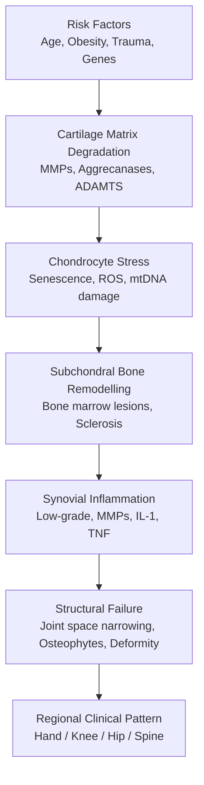
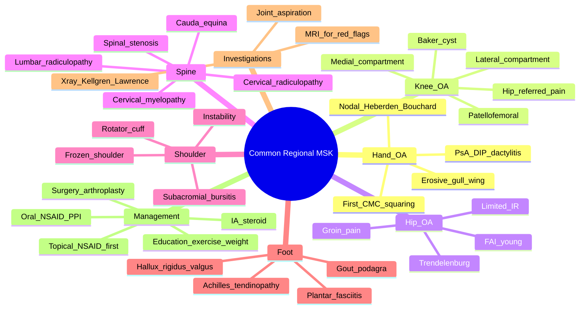

# Common Regional Musculoskeletal Problems

> [!tip] **FCPS/MRCP Priority: HIGH**
> Common regional MSK problems are the **most frequent cause of rheumatology referrals**. Must know: **Hand OA patterns (nodal, erosive, 1st CMC)**, **knee compartments (medial > lateral)**, **hip OA (groin pain, limited IR)**, **spine (spondylosis, radiculopathy, spinal stenosis)**, and **regional red flags** (septic arthritis, cauda equina, malignancy). Each region has characteristic pain patterns, exam findings, and imaging features.

---

## Learning Objectives
By the end of this note you should be able to:
- [ ] Identify characteristic **regional OA patterns** (hand nodal/erosive/1st CMC, knee, hip, spine)
- [ ] Perform **focused regional examination** (Look, Feel, Move, special tests)
- [ ] Interpret **regional imaging** (X-ray, ultrasound, MRI) for OA and related disorders
- [ ] Recognise **red flags** requiring urgent referral (septic, cauda equina, malignancy, cord compression)
- [ ] Apply **NICE/OARSI 2019** stepwise management for knee/hip OA
- [ ] Differentiate **regional OA** from referred pain, inflammatory arthritis, and tendinopathy

---

## 1. Definition & Epidemiology
| Feature | Detail |
|---------|--------|
| **Definition** | Group of **regional musculoskeletal disorders** — predominantly OA, soft tissue, and referred pain — affecting specific joints/anatomical sites |
| **Prevalence** | Up to **30-50% of adults ≥50** have symptomatic regional MSK pain; knee OA in **10-15% of >60y** |
| **Common sites** | **Knee** (most common symptomatic OA), **hand** (most common radiographic OA), **hip**, **spine**, **1st CMC**, **shoulder**, **foot** |
| **Risk factors** | **Age, female sex (hand/knee), obesity (knee), prior trauma (post-traumatic OA), occupational (kneeling, lifting), genetics (hand nodal OA: strong familial)** |
| **Impact** | Leading cause of **years lived with disability (YLD)** globally; **2nd only to back pain** in MSK burden |

---

## 2. Pathophysiology — Site-Specific Mechanisms

### Site-Specific Drivers
| Site | Key Local Drivers |
|------|-------------------|
| **Hand (DIP/PIP/1st CMC)** | **Genetics** (nodal OA, strong heritability), **female sex**, **oestrogen decline** (postmenopausal), **hypermobility** (1st CMC) |
| **Knee** | **Obesity** (3-5× risk; mechanical + adipokine), **malalignment** (varus → medial, valgus → lateral), **meniscal injury**, **occupation** (kneeling) |
| **Hip** | **Cam/pincer FAI** (femoroacetabular impingement), **congenital dysplasia**, **Perthes'/SUFE** (young adult), **subchondral insufficiency** |
| **Spine** | **Disc degeneration** (DDD), **facet joint OA**, **ligamentum flavum hypertrophy** (stenosis), **spondylolisthesis** |

---

## 3. Hand — Regional OA Patterns
### Nodal OA (Most Common)
| Feature | Detail |
|---------|--------|
| **Heberden's nodes** | **DIP** bony swellings (osteophytes); strong familial (3×); F > M 10:1; onset **40-60y** |
| **Bouchard's nodes** | **PIP** bony swellings; less common than Heberden's; often co-occur |
| **1st CMC squaring** | Thumb base (trapeziometacarpal); pinch weakness; "grind test" positive |
| **Functional** | Loss of grip, fine pinch, key pinch; correlates with radiographic severity |
| **Disease course** | Often **burns out** with stable functional impairment after initial progression |

### Erosive (Inflammatory) OA
| Feature | Detail |
|---------|--------|
| **Demographics** | Postmenopausal women; **40-65y** peak |
| **Pattern** | **DIP > PIP**; bilateral, often **symmetric** |
| **Imaging** | **"Gull-wing" / "saw-tooth"** central erosions + marginal osteophytes (subchondral collapse → gives central erosion appearance) |
| **Inflammation** | Acute flares with **red, hot, swollen IP joints**; can mimic RA/psoriatic |
| **Serology** | **RF/CCP negative**; ESR/CRP mildly elevated in flares |
| **Outcome** | Worse functional outcome than nodal OA; ~15% progress to ankylosis |

### 1st CMC (Trapeziometacarpal) OA
- **Epidemiology**: 30% of postmenopausal women; 5-10% symptomatic
- **Pathogenesis**: **Hypermobility** + axial loading on saddle joint → degeneration
- **Exam**: **Squaring** of thumb base, **adduction** of thumb (Dart/thumb-in-palm deformity), **thenar wasting**
- **Tests**: **Grind test** (axial load + rotation → pain/crepitus), **Lever/stress test**, **Eichhoff** (less specific)
- **Management**: Splinting (thumb spica), activity modification, intra-articular steroid; **trapeziectomy** (with or without LRTI) for refractory

### Differential by Joint
| Joint | Common Pathology | Distinguishing Feature |
|-------|-----------------|------------------------|
| **DIP** | **Nodal OA (Heberden's)**, **psoriatic** (DIP + nail), **erosive OA** | Bony, hard, painless swellings (OA) vs dactylitis (PsA) |
| **PIP** | **Bouchard's OA**, **RA**, **Jaccoud's** (SLE) | OA: bony, hard. RA: soft, boggy, multiple |
| **MCP** | **RA**, **haemochromatosis** (2nd/3rd MCP), SLE | OA: sparing of MCPs (rare) |
| **1st CMC** | **OA**, **RA** | OA: squaring, grind test. RA: pancarpal synovitis |
| **Wrist** | **SC joint OA**, **post-traumatic**, **Kienböck's**, RA | **1st CMC + STT** OA most common in OA |

> [!warning] **Red Flag in Hand Pain**
> - **Hot, swollen, red joint** = septic (aspirate)
> - **Dactylitis + nail pitting** = psoriatic
> - **Symmetrical polyarthritis with systemic features** = RA/SLE
> - **Calcinosis, Raynaud, sclerodactyly** = systemic sclerosis
> - **2nd/3rd MCP arthropathy + bronze skin** = haemochromatosis

---

## 4. Knee — Compartments, Patterns, and Pitfalls
### Compartments
| Compartment | Frequency | Features |
|-------------|-----------|----------|
| **Medial tibiofemoral** | **Most common** (70% of symptomatic knee OA) | Varus deformity, **medial JSN**, subchondral sclerosis |
| **Lateral tibiofemoral** | Less common (10-15%) | Valgus deformity, **lateral JSN** |
| **Patellofemoral** | Common (40% of knee OA, often with TF) | **Anterior knee pain** (stairs > walking), crepitus, positive **patellar grind** |

### Clinical Pearls
- **Pain pattern**: Worse with **weight-bearing, stairs (especially down), kneeling, squatting**; **relieved by rest** (mechanical)
- **Stiffness**: **<15-30 min** morning or inactivity stiffness (vs >1h in inflammatory)
- **Locking/catching**: Suggests **loose body, meniscal tear** (trapped fragment), or **osteophyte** catching
- **Giving way**: Quadriceps weakness (pain inhibition), instability, or **meniscal flap**
- **Baker's cyst**: **Popliteal swelling** (posterior); may rupture → pseudothrombophlebitis (calf pain, swelling, Homan's sign); **ultrasound** confirms

### Examination Sequence
1. **Look**: Varus/valgus, quadriceps wasting, swelling, scars, skin
2. **Feel**: Warmth, joint line tenderness (medial = medial meniscus, lateral = lateral), effusion (**patellar tap** for moderate, **bulge sign** for small)
3. **Move**: Flexion (normal 0-140°), extension (0°), crepitus
4. **Special tests**: **McMurray's** (meniscus), **anterior/posterior drawer + Lachman** (ACL/PCL), **valgus/varus stress** (collaterals), **patellar grind** (PF joint)

### Knee X-ray Features (Kellgren-Lawrence Grading)
| Grade | Features |
|-------|----------|
| **0** | None |
| **1** | Doubtful JSN, possible osteophytic lipping |
| **2** | Definite osteophytes, possible JSN |
| **3** | Multiple osteophytes, definite JSN, some sclerosis, possible deformity |
| **4** | Large osteophytes, marked JSN, severe sclerosis, definite deformity |

> [!important] **Pitfall: Knee Pain Referred from Hip**
> Hip OA commonly presents as **knee pain** (obturator nerve, geniculate branch). **Always examine the hip** in any adult with knee pain — restricted hip **internal rotation** is the most sensitive sign of hip OA.

### Management (NICE NG226 / OARSI 2019)
| Step | Intervention |
|------|--------------|
| **Core** | **Education, exercise (strength + aerobic), weight loss (5-10% → meaningful pain reduction)** |
| **1st-line drug** | **Topical NSAID** (knee/hand; low GI/CV risk); **oral NSAID** + PPI short-term (COX-2 + PPI if CV risk ↑) |
| **2nd-line drug** | **Topical capsaicin**, **duloxetine** (if centralised pain), **weak opioid** (paracetamol/codeine) if NSAIDs CI |
| **Injections** | **Intra-articular steroid** (knee, thumb base; benefit 4-8wk, avoid >4/yr); **hyaluronic acid** (limited, NNT ~5) |
| **Surgical** | **Arthroplasty** (TKA for end-stage refractory OA); **osteotomy** (younger, unicompartmental); **arthroscopy** (only for locked knee, meniscal tear) |

---

## 5. Hip — Groin Pain and the "C Sign"
### Clinical Pattern
- **Pain location**: **Groin** (most specific), **lateral hip**, **anterior thigh**, **referred to knee** (obturator nerve)
- **"C Sign"**: Patient cups hand over trochanter/hip in a C shape (deep, ill-defined)
- **Stiffness**: Internal rotation + extension lost **earliest and most** (capsular pattern)
- **Trendelenburg gait**: Hip abductor weakness (gluteus medius) → contralateral pelvic drop
- **Limitation**: Cannot cut toenails, put on socks, get out of low chair

### Hip X-ray Features
| Feature | Description |
|---------|-------------|
| **Joint space narrowing** | **Superolateral** (most common pattern); superomedial and medial patterns exist |
| **Subchondral sclerosis** | Dense white line below cartilage |
| **Subchondral cysts** | Geodes, often multiple |
| **Osteophytes** | Marginal (lateral acetabular, femoral head) |
| **Femoral head migration** | Superolateral (most common), axial, medial (Protrusio — suggests other cause) |

### Differential — Hip Pain
| Condition | Distinguishing Feature |
|-----------|------------------------|
| **Hip OA** | Groin pain, restricted IR, morning stiffness <30 min, **X-ray changes** |
| **GTPS (trochanteric bursitis)** | **Lateral hip pain**, tender over trochanter, pain lying on side, **FABER** uncomfortable |
| **FAI (femoroacetabular impingement)** | **Young adult**, groin pain on flexion/IR (anterior impingement), positive **FADIR** |
| **Avascular necrosis** | **Sudden onset**, risk factors (steroids, alcohol, SLE), MRI diagnostic |
| **Stress fracture (femoral neck)** | **Elderly / athletic**, antalgic gait, MRI, bone scan |
| **Referred (lumbar spine)** | L1-L2 radiculopathy, **knee pain**, positive femoral stretch test |
| **Inguinal hernia** | Groin bulge, Valsalva-related |
| **Labral tear** | Young adult, mechanical (click, lock), MRI arthrogram |

> [!warning] **Hip Pain Red Flags**
> - **Sudden onset in elderly/steroid use** → **AVN** (MRI)
> - **Night pain, weight loss, atypical** → **malignancy** (bone scan, MRI)
> - **Severe pain + inability to weight-bear** → **fracture** (MRI if X-ray normal)
> - **Hip + systemic features** → **septic arthritis** (aspiration)

### Hip OA Management
- **Core**: Exercise (water-based if land difficult), weight loss, education
- **Drugs**: Oral NSAID + PPI; topical NSAID (less effective at hip)
- **Injections**: **Intra-articular steroid** (image-guided preferred); **hyaluronic acid** (limited)
- **Surgery**: **Total hip arthroplasty (THA)** — **one of the most successful operations in medicine** (90%+ satisfaction at 10y); indications: refractory pain + functional loss + radiographic changes

---

## 6. Spine — Spondylosis, Radiculopathy, and Stenosis
### Cervical Spondylosis
| Feature | Detail |
|---------|--------|
| **Prevalence** | **>50% asymptomatic >40y** on imaging; 10% symptomatic |
| **Pathology** | Disc degeneration + facet joint OA + osteophytes + ligamentum flavum hypertrophy |
| **Symptoms** | Neck pain, occipital headache, **radiculopathy** (arm pain/paresthesia), **myelopathy** (cord compression) |
| **Levels** | **C5-6 (most common)**, C6-7, C4-5 |

#### Cervical Radiculopathy
| Root | Pain/Sensory | Weakness | Reflex Loss |
|------|-------------|----------|-------------|
| **C5** | Shoulder, lateral arm | Deltoid, biceps | Biceps |
| **C6** | Lateral arm, thumb, index | Biceps, brachioradialis, wrist extension | Biceps, brachioradialis |
| **C7** | Posterior arm, middle finger | Triceps, wrist flexion, finger extension | Triceps |

#### Cervical Myelopathy
- **Triad**: Gait disturbance (spastic), clumsy hands, urinary symptoms
- **Signs**: **Hoffmann's** (thumb IP flexion on flicking middle finger distal phalanx), **inverted supinator**, **upper motor neuron signs** (brisk reflexes, extensor plantars, ankle clonus)
- **Imaging**: **MRI** essential; cord signal change = severity
- **Management**: **Surgical decompression** if progressive (anterior cervical discectomy/corpectomy or posterior laminectomy)

> [!critical] **Cervical Myelopathy = Surgical Emergency if Acute**
> Progressive neurological deficit, difficulty walking, hand clumsiness → **urgent MRI and surgical referral**. Do not delay — cord damage is irreversible.

### Lumbar Spondylosis
| Feature | Detail |
|---------|--------|
| **Prevalence** | **75% of adults** have lumbar disc degeneration on MRI; 5-10% symptomatic radiculopathy |
| **Pathology** | Disc desiccation + annular tears + facet OA + ligamentum flavum hypertrophy → stenosis |
| **Most common levels** | **L4-5, L5-S1** (90% of disc herniations) |

#### Lumbar Radiculopathy (Disc Herniation)
| Root | Pain/Sensory | Weakness | Reflex Loss |
|------|-------------|----------|-------------|
| **L3** | Anterior thigh | Knee extension (quadriceps) | Knee (patellar) |
| **L4** | Anteromedial leg, medial foot | Knee extension, ankle dorsiflexion | Knee (patellar) |
| **L5** | Lateral leg, **dorsum of foot, big toe** | **Ankle dorsiflexion** (heel walk), extensor hallucis longus | None reliable |
| **S1** | Posterior leg, **lateral foot, sole** | **Plantarflexion** (toe walk) | **Ankle (Achilles)** |

#### Lumbar Spinal Stenosis — Neurogenic Claudication
- **Pathology**: Central canal narrowing → cauda equina compression
- **Symptoms**: **Bilateral leg pain/heaviness on walking/standing**, **relieved by flexion** (sitting, leaning forward, walking uphill — "shopping cart sign")
- **Differentiation from vascular claudication**: Pain **on standing** alone (vascular needs walking); relief with **lumbar flexion** (vascular not); pulses present; normal ABI
- **Imaging**: **MRI** for confirmation (T2 sagittal + axial)
- **Management**: Conservative (PT, weight, NSAIDs), **epidural steroid injection** (limited), **decompressive surgery** (laminectomy) for refractory

> [!warning] **Cauda Equina Syndrome — Surgical Emergency**
> - **Saddle anaesthesia** (perineum, buttocks, posterior thighs)
> - **Bladder dysfunction** (urinary retention, overflow incontinence)
> - **Bowel dysfunction** (faecal incontinence)
> - **Bilateral leg weakness/numbness**
> - **Reduced anal tone** on DRE
> - **Action**: **Urgent MRI** within hours → **emergency surgical decompression** (within 24-48h of onset for best recovery)

### Mechanical vs Inflammatory Back Pain
| Feature | Mechanical | Inflammatory (SpA) |
|---------|-----------|-------------------|
| **Age** | Any, >40 common | <45 typical |
| **Onset** | Acute, related to activity | **Insidious, no trigger** |
| **Morning stiffness** | <30 min | **>30-60 min** |
| **Effect of exercise** | Worse | **Better** |
| **Effect of rest** | Better | **Worse** (especially night)** |
| **Radiation** | Radicular, dermatomal | Buttock (alternating), diffuse |
| **Red flags** | Cauda equina, fracture, malignancy | Uveitis, psoriasis, IBD, family hx |

---

## 7. Shoulder — Subregional Patterns
### Pain Patterns by Region
| Region | Likely Pathology | Tests |
|--------|------------------|-------|
| **Anterior** | Bicipital tendinopathy, OA, instability | Speed's, Yergason's, apprehension |
| **Lateral** | **Rotator cuff**, subacromial bursitis, GTPS-spillover | Painful arc, Hawkins-Kennedy, Neer, drop arm |
| **Posterior** | Posterior capsule, scapular dyskinesis | Scapular assistance test |
| **Diffuse + stiffness** | **Frozen shoulder** (capsulitis), polymyalgia | Global restriction (active = passive) |

### Frozen Shoulder (Adhesive Capsulitis)
| Feature | Detail |
|---------|--------|
| **Epidemiology** | **F > M 3:1**, **40-60y peak**; **diabetes** (5× risk), thyroid disease, post-stroke, post-MI |
| **Phases** | **Painful freezing (2-9mo) → adhesive (4-12mo) → resolution (5-24mo)**; total 12-36mo |
| **Exam** | **Global restriction**: active = passive, **external rotation most limited**, abduction limited |
| **Imaging** | Plain X-ray normal; MRI shows capsular thickening, no rotator cuff tear |
| **Management** | Analgesia, intra-articular steroid (early), **hydrodilatation**, gentle mobilisation; **avoid arthrolysis unless refractory** |

> [!tip] **Frozen Shoulder vs Rotator Cuff Tear**
> - Frozen: **active = passive** restriction, ER most limited
> - Cuff tear: **active < passive**, painful arc, weakness on specific test (drop arm, lag signs)

---

## 8. Foot and Ankle — First MTP and Plantar Fasciitis
### 1st MTP (Hallux) — Most Common Foot Joint Affected
| Pattern | Features |
|---------|----------|
| **Hallux rigidus** | **Dorsal osteophyte**, restricted dorsiflexion, pain walking; **MTP OA** |
| **Hallux valgus (bunion)** | Lateral deviation of great toe, medial eminence, 1st MTP subluxation; often associated with **2nd hammer toe** |
| **Gout (podagra)** | Acute, hot, red 1st MTP; **MSU crystals** (negatively birefringent needles) |

### Plantar Fasciitis
- **Most common cause of heel pain** in adults
- **Pain**: Worse with **first steps in morning** (post-static dyskinesia), after prolonged standing
- **Exam**: **Tenderness at medial calcaneal tubercle** (plantar fascia origin); **windlass test** (passive dorsiflexion of toes → pain)
- **Imaging**: Heel spur (incidental, not diagnostic); ultrasound shows thickened plantar fascia (>4mm)
- **Management**: **Stretching (plantar fascia + Achilles)**, **heel pads/cups**, **night splints**, NSAIDs; **shockwave** (refractory); surgery (last resort)

### Achilles Tendinopathy
- **Insertional** (at calcaneal insertion) vs **mid-portion** (2-7cm above insertion)
- **Risk factors**: Fluoroquinolones, sudden increase in training, **obesity, seronegative SpA**
- **Exam**: Tenderness, thickening, **crepitus** (paratenonitis); **Simmonds/Thompson test** negative (intact tendon)
- **Imaging**: Ultrasound (hypoechoic, neovessels on Doppler) or MRI
- **Management**: **Eccentric loading exercises** (gold standard — Alfredson protocol), activity modification, heel raise; avoid steroid injection (rupture risk); surgery (chronic)

---

## 9. Investigations — When and What
### Baseline for New Regional OA
| Investigation | Indication |
|---------------|-----------|
| **X-ray** (weight-bearing for knee, AP pelvis for hip) | Diagnostic (OA features) |
| **FBC, ESR, CRP** | **Only if inflammatory features** (red flags); **not for routine primary OA** |
| **MRI** | Suspected **avascular necrosis, stress fracture, labral tear, soft tissue mass, tumour**; red flags |
| **Ultrasound** | **Effusion, bursitis, tendon pathology, guided injection** |
| **Joint aspiration** | **Effusion + red flag** (septic, crystal); not routine |
| **Autoantibodies** (RF, anti-CCP, ANA) | **Only if inflammatory polyarthritis** suspected; NOT for nodal OA |
| **Bone densitometry (DEXA)** | **Osteoporosis risk** (postmenopausal women, men >70, fragility fracture history) |

> [!important] **Autoantibodies Are NOT Part of OA Workup**
> Nodal hand OA in a 60-year-old with normal inflammatory markers does **not** need RF/CCP. Reserve autoantibodies for **symmetrical small joint polyarthritis** with morning stiffness >30 min and systemic features.

---

## 10. FCPS/MRCP High-Yield Summary
| Topic | Key Points |
|-------|------------|
| **Nodal OA** | DIP = Heberden's, PIP = Bouchard's, 1st CMC = squaring; strong familial (especially in women) |
| **Erosive OA** | Postmenopausal women, DIP/PIP, **gull-wing/saw-tooth erosions**, inflammatory flares, RF/CCP negative |
| **Knee OA** | Medial > lateral compartment; varus deformity; Baker's cyst possible; **referred hip pain must be excluded** |
| **Hip OA** | **Groin pain** (most specific), **limited internal rotation** (earliest sign), superolateral migration |
| **Lumbar radiculopathy** | L4-5/L5-S1 most common; L5 = big toe/ankle dorsi; S1 = lateral foot/plantar |
| **Spinal stenosis** | **Neurogenic claudication**: pain on standing/walking, **relieved by flexion** (shopping cart sign) |
| **Cauda equina** | **Saddle anaesthesia + bladder/bowel dysfunction** → **urgent MRI + surgery** |
| **Cervical myelopathy** | **Gait disturbance, clumsy hands, urinary symptoms**; **Hoffmann's sign**; urgent MRI + surgery |
| **Mechanical vs inflammatory back pain** | Inflammatory: <45, insidious, >30 min stiffness, better with exercise, night pain |
| **Frozen shoulder** | F:M 3:1, 40-60y, **diabetes association** (5×), ER most limited, self-limiting 12-36mo |
| **Plantar fasciitis** | **Worst first steps in morning**, tenderness at medial calcaneal tubercle; stretching first-line |
| **Kellgren-Lawrence** | X-ray OA grading 0-4 (osteophytes → JSN → sclerosis → deformity) |
| **Management pyramid** | Education + exercise + weight loss → topical NSAID → oral NSAID + PPI → IA steroid → surgery |

---

## 11. Viva Questions (MRCP PACES / FCPS)
| Question | Expected Answer |
|----------|-----------------|
| "A 65yo woman has Heberden's nodes, painful PIPs, ESR 18. Anti-CCP negative. Diagnosis?" | **Erosive osteoarthritis** — DIP > PIP, central erosions (gull-wing), postmenopausal, RF/CCP negative. |
| "A 50yo man with knee pain. Where do you expect pain in hip OA?" | **Groin** (most specific), with **referred pain to the knee** (obturator nerve). **Always examine the hip.** |
| "Kellgren-Lawrence grade 3 means what?" | Multiple osteophytes, definite JSN, some sclerosis, possible bony deformity. **Grade 4** = marked JSN, large osteophytes, severe sclerosis, definite deformity. |
| "Patient with bilateral leg heaviness on walking, relieved by sitting forward. Diagnosis?" | **Lumbar spinal stenosis** (neurogenic claudication). Differentiation from vascular: pain on standing, relief with flexion, normal pulses. |
| "Cauda equina syndrome features and management?" | **Saddle anaesthesia, bladder/bowel dysfunction, bilateral leg weakness, reduced anal tone**. **Urgent MRI → surgical decompression within 24-48h.** |
| "Best initial management for knee OA in a 70yo obese patient?" | **Core: education, weight loss (5-10%), exercise (aerobic + strengthening)**; **topical NSAID first**, oral NSAID + PPI if insufficient; **intra-articular steroid** for flares. |
| "Differentiate frozen shoulder from rotator cuff tear on exam." | **Frozen**: global restriction (active = passive), **ER most limited**; **Cuff tear**: active < passive, painful arc, specific weakness (drop arm, lag). |
| "Plantar fasciitis — first-line management?" | **Plantar fascia and Achilles stretching** (most evidence); heel cups, night splints, NSAIDs; shockwave for refractory. **Avoid steroid injection** (fat pad atrophy, fascia rupture). |

---

## 12. Confusions & Mnemonics
| Confusion | Clarification |
|-----------|---------------|
| **Heberden's vs Bouchard's** | **Heberden's = DIP**, **Bouchard's = PIP**. Both = OA. (Mnemonic: **"H"igher up = DIP**; "B"oth in middle = PIP) |
| **Erosive vs nodal hand OA** | Nodal: hard, bony, painless; Erosive: hot, swollen, inflammatory, central erosions |
| **Knee OA compartments** | Medial > lateral (varus = medial, valgus = lateral); **patellofemoral** = anterior knee pain on stairs |
| **Spinal stenosis vs vascular claudication** | Neurogenic: pain on standing, **relief with flexion**, normal pulses; Vascular: pain on walking, **relief with rest standing**, ↓ pulses |
| **L5 vs S1 radiculopathy** | L5 = **big toe/ankle dorsiflexion**; S1 = **lateral foot/plantarflexion/ankle reflex** |
| **Cervical myelopathy red flags** | **Gait** disturbance, **hand** clumsiness, **urinary** symptoms — the "3 G's/H/U" |

**Mnemonic: Hand OA Nodal Pattern = "DIP-PIP-CMC"**
- **DIP** = Heberden's
- **PIP** = Bouchard's
- **CMC** = Squaring/grind

**Mnemonic: Knee OA Compartment Frequency = "M(ost) L(ess) P(atella)"**
- Medial 70% > Lateral 10% > Patellofemoral 20% (often with TF)

**Mnemonic: Cervical Myelopathy = "Hop, Drop, Stop"**
- **Hop**ping (spastic gait)
- **Drop**ping things (hand clumsiness)
- **Stop** (urinary hesitancy/retention)

---

## 13. Mind Map

---

## 14. One-Page Revision Card
| Domain | Key Points |
|--------|------------|
| **Hand nodal OA** | DIP = Heberden's, PIP = Bouchard's, 1st CMC = squaring; postmenopausal, familial |
| **Erosive OA** | Postmenopausal women, DIP/PIP, **gull-wing erosions**, inflammatory, RF/CCP negative |
| **Knee OA** | Medial 70% > Lateral > Patellofemoral; varus deformity; **always examine hip** (referred pain) |
| **Hip OA** | **Groin pain** + **limited IR**; Trendelenburg gait; THA 90%+ satisfaction at 10y |
| **Cervical radiculopathy** | C5-6 most common; myelopathy = surgical emergency (Hoffmann, gait, hand, urinary) |
| **Lumbar radiculopathy** | L4-5/L5-S1; L5 = big toe/dorsiflex; S1 = lateral foot/plantarflex/Achilles reflex |
| **Spinal stenosis** | **Neurogenic claudication** — pain on standing, **relief with flexion**; shopping cart sign |
| **Cauda equina** | **Saddle + bladder + bowel + anal tone**; **urgent MRI → surgery within 24-48h** |
| **Frozen shoulder** | F > M, 40-60y, **diabetes (5×)**, ER most limited, self-limiting 12-36mo |
| **Plantar fasciitis** | **Worst first steps in morning**; medial calcaneal tenderness; **stretching first-line** |
| **Kellgren-Lawrence** | 0 = none, 1 = doubtful, 2 = osteophytes + possible JSN, 3 = definite JSN + sclerosis, 4 = severe |
| **Core OA Rx** | **Education + exercise + weight loss** (5-10% = meaningful pain ↓); topical NSAID first |

---

## 15. Spaced Repetition Trackers
| Review Interval | Date Completed | Confidence (1-5) | Notes |
|-----------------|----------------|------------------|-------|
| 24 hours | | | |
| 7 days | | | |
| 15 days | | | |
| 30 days | | | |
| 90 days | | | |

---

## 16. Self-Test Scorecard
| Section | Score /5 | Last Attempt |
|---------|----------|--------------|
| Hand nodal/erosive/1st CMC patterns | | |
| Knee compartments + referred pain | | |
| Hip OA features + red flags | | |
| Cervical + lumbar radiculopathy levels | | |
| Spinal stenosis vs vascular claudication | | |
| Cauda equina recognition | | |
| Frozen shoulder vs rotator cuff | | |
| Regional management escalation | | |
| Viva Questions | | |

---

## Local Navigation
- **Parent Heading**: [[../Osteoarthritis and Related Disorders|Osteoarthritis and Related Disorders]]
- **Parent Topic Group**: [[Common regional musculoskeletal problems]]
- **Sibling Topics**: [[Osteoarthritis]] · [[Erosive osteoarthritis]] · [[Charcot arthropathy]]
- **Chapter Map**: [[../Davidson Chapter 26 - Rheumatology Hierarchy|Rheumatology Hierarchy]]
- **Chapter MOC**: [[../Rheumatology MOC|Rheumatology MOC]]
- **Related**: [[../Soft Tissue Rheumatism and Chronic Pain Syndromes/Fibromyalgia|Fibromyalgia]] · [[../Soft Tissue Rheumatism and Chronic Pain Syndromes/Chronic widespread pain|Chronic widespread pain]]
