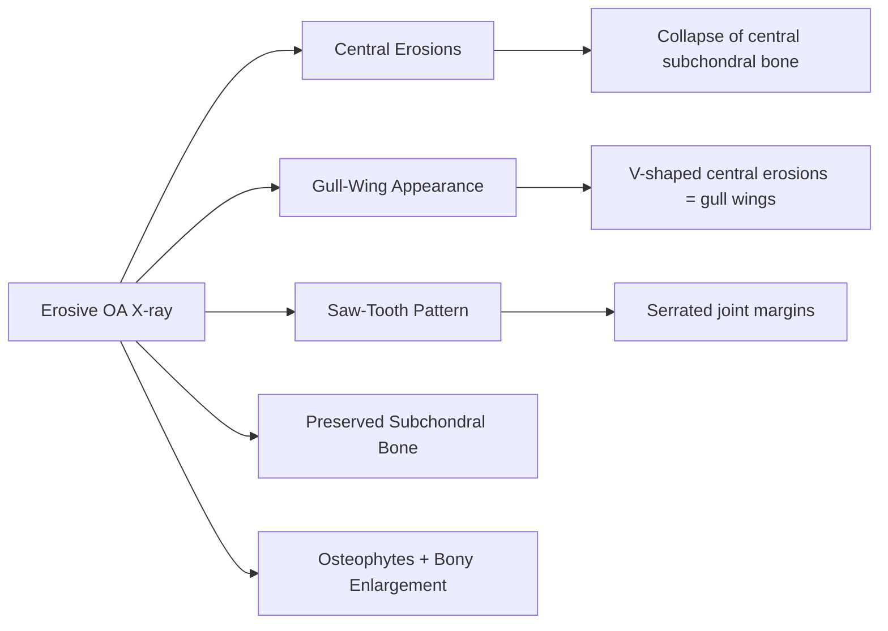
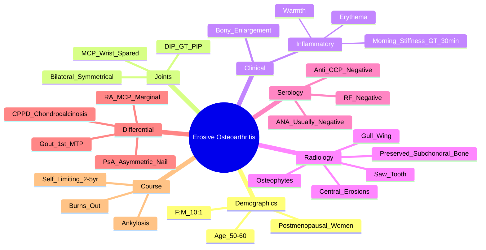

# Erosive Osteoarthritis (EOA)

> [!tip] **FCPS/MRCP Priority: HIGH**
> EOA = **inflammatory variant of hand OA** in **postmenopausal women**. **DIP > PIP, bilateral, symmetrical**. **Central "gull-wing" and "saw-tooth" erosions**. **RF/CCP negative, ANA negative**. **Burns out → ankylosis**. Differentiate from RA (RF/CCP+, MCP/PIP) and PsA (skin/nail, DIP but asymmetric).

---

## Learning Objectives
By the end of this note you should be able to:
- [ ] Recognise **EOA demographics**: **postmenopausal women (F:M 10:1), age 50-60**
- [ ] Identify **joint pattern**: **DIP > PIP, bilateral, symmetrical; MCP/wrist spared**
- [ ] Interpret **radiographic erosions**: **central "gull-wing" and "saw-tooth"**, preserved subchondral bone
- [ ] Differentiate from **RA (RF/CCP+, MCP/PIP)**, **PsA (skin/nail, DIP but asymmetric)**, **CPPD (chondrocalcinosis)**
- [ ] Understand **natural history**: **self-limiting, "burns out" → stable ankylosis**
- [ ] Select management: **similar to OA + NSAIDs, IA steroids, rare csDMARDs**

---

## 1. Definition & Epidemiology

| Feature | Detail |
|---------|--------|
| **Definition** | **Inflammatory subset of hand OA** — DIP/PIP erosions + inflammation, distinct from typical OA |
| **Prevalence** | ~2-3% of OA patients; **rare overall** |
| **Peak Onset** | **50-60 years** (postmenopausal) |
| **Sex Ratio** | **F:M = 10:1** (strong female predominance) |
| **Genetics** | Familial clustering; ERG, IL-1β polymorphisms |

---

## 2. Clinical Features

| Feature | Description |
|---------|-------------|
| **Joints** | **DIP > PIP** (bilateral, symmetrical); **1st CMC often involved**; **MCP/wrist spared** |
| **Symptoms** | **Pain, stiffness, swelling** — **inflammatory** (worse morning, >30min stiffness) + mechanical |
| **Signs** | **Erythema, warmth, soft tissue swelling** + **bony enlargement** (Heberden's/Bouchard's) |
| **Function** | Reduced grip, difficulty with fine motor tasks |
| **Systemic** | None (no fever, weight loss, fatigue) |

> [!critical] **EOA vs Typical OA**
> - **EOA = INFLAMMATORY** (warmth, erythema, prolonged morning stiffness, erosions)
> - **Typical OA = MECHANICAL** (stiffness <15min, no warmth, no erosions, just osteophytes/JSN)

---

## 3. Radiographic Features — **Key Differentiator**

| Feature | EOA | RA | PsA |
|---------|-----|----|-----|
| **Erosion Location** | **Central** (subchondral) | **Marginal** (bare areas) | Central + marginal |
| **Gull-Wing** | **Yes** (central collapse) | No | Sometimes |
| **Saw-Tooth** | **Yes** (serrated margins) | No | Sometimes |
| **Subchondral Bone** | **Preserved** | Eroded | Eroded |
| **Joint Space** | Narrowed (late) | Uniformly narrowed | Narrowed |
| **Osteophytes** | **Prominent** | Absent/Minimal | Variable |
| **Distribution** | **DIP > PIP, bilateral, symmetrical** | **MCP/PIP/wrist, symmetrical** | DIP + PIP, asymmetric |

> [!critical] **Erosive OA = Central Erosions + Preserved Subchondral Bone + Gull-Wing + Saw-Tooth**
> - **NOT marginal erosions** (like RA)
> - **NOT pencil-in-cup** (like PsA mutilans)
> - **Central collapse** = "gull-wing" / "saw-tooth"

---

## 4. Differential Diagnosis

| Feature | **EOA** | **RA** | **PsA** |
|---------|---------|--------|---------|
| **Demographics** | Postmenopausal women (F:M 10:1) | F:M 3:1, 30-50y | 30-50y, M=F |
| **Joints** | DIP > PIP, **MCP spared** | MCP/PIP/wrist, **DIP spared** | DIP + PIP, **asymmetric** |
| **Inflammation** | **Yes** (warmth, erythema) | **Yes** (boggy synovitis) | **Yes** (synovitis + enthesitis) |
| **Morning Stiffness** | >30 min | >1 hour | Variable |
| **RF / Anti-CCP** | **Negative** | **Positive** (70-80% / 60-70%) | Negative |
| **ANA** | Usually negative | May be + | Usually negative |
| **Erosions** | **Central, gull-wing, saw-tooth** | **Marginal, juxta-articular** | Central + marginal, pencil-in-cup |
| **Skin/Nail** | None | None | **Psoriasis, nail pitting, onycholysis** |
| **Course** | **Burns out → ankylosis** | Chronic progressive | Variable |

> [!critical] **EOA "Burns Out"**
> - **Self-limiting**: active inflammation 2-5 years → **burns out**
> - **End-stage**: **ankylosis** (bony fusion), fixed flexion deformities
> - **No systemic morbidity** (unlike RA)

---

## 5. Diagnostic Criteria (Verbruggen / Modified)

| Criterion | Requirement |
|-----------|-------------|
| **1. OA criteria met** | Clinical + radiographic OA |
| **2. Inflammatory features** | ≥1: erythema, warmth, swelling, morning stiffness >30min |
| **3. Erosions on X-ray** | **Central erosions** (gull-wing/saw-tooth) in ≥2 DIP/PIP joints |
| **4. Negative serology** | **RF negative, Anti-CCP negative** |
| **5. Exclusion** | No psoriasis, no IBD, no gout/CPPD, no RA |

---

## 6. Management

| Step | Treatment |
|------|-----------|
| **1. Core (as OA)** | Exercise, joint protection, analgesia, weight loss |
| **2. Anti-inflammatory** | **NSAIDs** (COX-2 + PPI), **IA corticosteroids** (for flares) |
| **3. csDMARDs (Rare)** | **Hydroxychloroquine** (anecdotal), **SSZ/MTX** if persistent inflammation |
| **4. Surgical** | **Arthrodesis** (for painful ankylosis), **arthroplasty** (rare) |

> [!important] **No Disease-Modifying Therapy Proven**
> - **Self-limiting** course → most need only symptomatic treatment
> - **HCQ/SSZ/MTX** reserved for persistent inflammatory flares
> - **Biologics NOT indicated** (no RCT evidence)

---

## 6. FCPS/MRCP High-Yield Summary

| Topic | Key Points |
|-------|------------|
| **Demographics** | **Postmenopausal women** (F:M 10:1), age 50-60 |
| **Joints** | **DIP > PIP, bilateral, symmetrical**; **MCP/wrist spared** |
| **Signs** | **Inflammatory** (erythema, warmth, swelling) + bony enlargement |
| **X-ray** | **Central erosions** → **gull-wing** + **saw-tooth**; **preserved subchondral bone** |
| **Serology** | **RF negative, Anti-CCP negative, ANA usually negative** |
| **Differential** | **RA**: MCP/PIP, RF/CCP+, marginal erosions. **PsA**: skin/nail, asymmetric, pencil-in-cup. |
| **Natural History** | **Self-limiting** (2-5 years) → **burns out → stable ankylosis** |
| **Management** | NSAIDs, IA steroids, rare HCQ/SSZ; **no biologics** |

---

## 7. Viva Questions (MRCP PACES / FCPS)

| Question | Expected Answer |
|----------|----------------|
| "A 55yo postmenopausal woman has bilateral DIP/PIP pain, swelling (erythema, warmth), morning stiffness 45min. X-ray shows central erosions with gull-wing appearance. RF/CCP negative. Diagnosis?" | **Erosive Osteoarthritis** — postmenopausal woman, DIP/PIP inflammatory, central gull-wing/saw-tooth erosions, seronegative. |
| "How do you distinguish erosive OA from RA on X-ray?" | **EOA: central erosions (gull-wing/saw-tooth), preserved subchondral bone, MCP spared. RA: marginal erosions, juxta-articular, MCP/PIP/wrist involved, RF/CCP+.** |
| "What is the classic radiographic appearance of erosive OA?" | **Central erosions** → **gull-wing** (V-shaped collapse of central subchondral bone) and **saw-tooth** (serrated joint margins). |
| "How does erosive OA differ from psoriatic arthritis?" | EOA: **no skin/nail changes**, RF/CCP negative, symmetrical DIP/PIP, gull-wing erosions. PsA: **psoriasis/nail changes**, asymmetric, pencil-in-cup, DIP but often with dactylitis/enthesitis. |
| "What is the natural history of erosive OA?" | **Self-limiting** (2-5 years of active inflammation) → **"burns out" → stable ankylosis** (bony fusion). No systemic morbidity. |
| "What is the management of erosive OA?" | **NSAIDs, IA steroids** for flares. **Hydroxychloroquine** anecdotal. **No biologics**. Surgery (arthrodesis) for end-stage painful ankylosis. |

---

## 8. Confusions & Mnemonics

| Confusion | Clarification |
|-----------|---------------|
| **EOA vs RA** | EOA: **DIP/PIP, central erosions (gull-wing), MCP spared, RF/CCP negative**. RA: **MCP/PIP/wrist, marginal erosions, RF/CCP positive**. |
| **EOA vs PsA** | EOA: **symmetrical, no skin/nail, RF/CCP negative, gull-wing**. PsA: **asymmetric, skin/nail/DIP, pencil-in-cup**. |
| **EOA vs Typical OA** | EOA: **inflammatory** (warmth, erythema, morning stiffness >30min, erosions). OA: **mechanical** (stiffness <15min, no warmth, osteophytes only). |
| **EOA vs CPPD** | CPPD: **chondrocalcinosis on X-ray**, CPPD crystals, knee/wrist. EOA: **no chondrocalcinosis**, hand DIP/PIP. |
| **EOA vs Gout** | Gout: **acute monoarthritis**, 1st MTP, MSU crystals, hyperuricaemia. EOA: **chronic polyarthritis**, DIP/PIP. |

**Mnemonic: EOA Demographics = "POST-MENO"**
- **POST**menopausal
- **MEN** (rare) / **O**ne in 10 women
- **PAIN** (inflammatory)

**Mnemonic: EOA X-ray = "GULL-SAW-CENTRAL"**
- **GULL**-wing erosions
- **SAW**-tooth pattern
- **CENTRAL** erosions (not marginal)
- **PRESERVED** subchondral bone

**Mnemonic: EOA vs RA = "DIP vs MCP"**
- **EOA** = **DIP**/PIP, **Central** erosions
- **RA** = **MCP**/PIP/wrist, **Marginal** erosions

**Mnemonic: EOA Course = "BURN OUT"**
- **B**urns
- **O**ut
- **R**esolves to
- **N**ormal? No → **A**nkylosis
- **S**table

---

## 9. Mind Map

---

## 9. One-Page Revision Card

| Domain | Key Points |
|--------|------------|
| **Demographics** | Postmenopausal women (F:M 10:1), age 50-60 |
| **Joints** | **DIP > PIP, bilateral, symmetrical**; **MCP/wrist spared** |
| **Clinical** | **Inflammatory** (warmth, erythema, stiffness >30min) + bony enlargement |
| **X-ray** | **Central erosions → gull-wing + saw-tooth**; **preserved subchondral bone**; osteophytes |
| **Serology** | **RF negative, Anti-CCP negative, ANA negative** |
| **vs RA** | EOA = DIP/PIP, central gull-wing, MCP spared. RA = MCP/PIP/wrist, marginal erosions |
| **vs PsA** | EOA = symmetrical, no skin/nail. PsA = asymmetric, psoriasis/nail, pencil-in-cup |
| **Natural History** | **Self-limiting (2-5yr)** → **burns out → ankylosis** |
| **Management** | NSAIDs, IA steroids, rare HCQ; **no biologics** |

---

## 10. Spaced Repetition Trackers

| Review Interval | Date Completed | Confidence (1-5) | Notes |
|-----------------|----------------|------------------|-------|
| 24 hours | | | |
| 7 days | | | |
| 15 days | | | |
| 30 days | | | |
| 90 days | | | |

---

## 11. Self-Test Scorecard

| Section | Score /5 | Last Attempt |
|---------|----------|--------------|
| X-ray Gull-Wing/Saw-Tooth | | |
| EOA vs RA vs PsA | | |
| Inflammatory vs Mechanical OA | | |
| Serology Interpretation | | |
| Natural History | | |
| Viva Questions | | |

---

## Local Navigation
- **Parent Heading**: [[../Osteoarthritis and Related Disorders|Osteoarthritis and Related Disorders]]
- **Parent Topic Group**: [[Common regional musculoskeletal problems]]
- **Chapter Map**: [[../Davidson Chapter 26 - Rheumatology Hierarchy|Rheumatology Hierarchy]]
- **Chapter MOC**: [[../Rheumatology MOC|Rheumatology MOC]]
- **Drug Reference**: [[../../Clinical Approach to Musculoskeletal Disease/Drugs in rheumatology|Drugs in rheumatology]]
- **Related**: [[Osteoarthritis]] · [[Psoriatic arthritis]] · [[Rheumatoid Arthritis]]
---

> Auto-generated study sections for "Osteoarthritis and Related Disorders" — Ch 25: Rheumatology & Bone Disease.

## Flashcards (15 generated)

- Q: What is the definition of Osteoarthritis and Related Disorders?
  A: Inflammatory subset of hand OA — DIP/PIP erosions + inflammation, distinct from typical OA
- Q: What is the epidemiology of Osteoarthritis and Related Disorders?
  A: ~2-3% of OA patients; rare overall
- Q: What is Peak Onset of Osteoarthritis and Related Disorders?
  A: 50-60 years (postmenopausal)
- Q: What is Sex Ratio of Osteoarthritis and Related Disorders?
  A: F:M = 10:1 (strong female predominance)
- Q: What is Genetics of Osteoarthritis and Related Disorders?
  A: Familial clustering; ERG, IL-1β polymorphisms
- Q: What is Joints of Osteoarthritis and Related Disorders?
  A: DIP > PIP (bilateral, symmetrical); 1st CMC often involved; MCP/wrist spared
- Q: What are the clinical features of Osteoarthritis and Related Disorders?
  A: Pain, stiffness, swelling — inflammatory (worse morning, >30min stiffness) + mechanical
- Q: What is Signs of Osteoarthritis and Related Disorders?
  A: Erythema, warmth, soft tissue swelling + bony enlargement (Heberden's/Bouchard's)
- Q: What is Function of Osteoarthritis and Related Disorders?
  A: Reduced grip, difficulty with fine motor tasks
- Q: What is Systemic of Osteoarthritis and Related Disorders?
  A: None (no fever, weight loss, fatigue)
- Q: What is 1. OA criteria met of Osteoarthritis and Related Disorders?
  A: Clinical + radiographic OA
- Q: What are the clinical features of Osteoarthritis and Related Disorders?
  A: ≥1: erythema, warmth, swelling, morning stiffness >30min
- Q: What is 3. Erosions on X-ray of Osteoarthritis and Related Disorders?
  A: Central erosions (gull-wing/saw-tooth) in ≥2 DIP/PIP joints
- Q: What is 4. Negative serology of Osteoarthritis and Related Disorders?
  A: RF negative, Anti-CCP negative
- Q: What is 5. Exclusion of Osteoarthritis and Related Disorders?
  A: No psoriasis, no IBD, no gout/CPPD, no RA

## MCQs (1 generated)

1. **Which of the following best describes Osteoarthritis and Related Disorders?**
   A. **EOA = inflammatory variant of hand OA in postmenopausal women.**
   B. An unrelated condition not matching the clinical picture of Osteoarthritis and Related Disorders
   C. A complication seen late in the disease course of Osteoarthritis and Related Disorders
   D. A condition that mimics Osteoarthritis and Related Disorders but has a different underlying cause

## SBA Questions (1 generated)

1. A patient with suspected Osteoarthritis and Related Disorders presents with: Definition — Inflammatory subset of hand OA — DIP/PIP erosions + inflammation, distinct from typical OA; Prevalence — ~2-3% of OA patients; rare overall; Peak Onset — 50-60 years (postmenopausal). What is the most likely diagnosis?
   A. **Osteoarthritis and Related Disorders**
   B. A condition that mimics Osteoarthritis and Related Disorders but is not the same entity
   C. A complication of Osteoarthritis and Related Disorders rather than the primary diagnosis
   D. An unrelated condition in the same clinical category as Osteoarthritis and Related Disorders

## PasTest Scenario SBAs (Clinical Vignettes)

> **Auto-generated PasTest/Mediscope-style scenario SBAs** grounded in the authored source. Each scenario tests a real clinical fact (triad, specific sign, contraindication, trial, first-line Rx) extracted from the topic. *Source: Ch 25: Rheumatology — Erosive osteoarthritis*

**Q1.** What is the most appropriate first-line therapy for Erosive osteoarthritis?

  - **A.** Anti-inflammatory   NSAIDs (COX-2 + PPI), IA corticosteroids (for flares)
  - **B.** An advanced/surgical therapy reserved for refractory disease
  - **C.** Symptomatic treatment only, no disease-modifying therapy
  - **D.** Empiric broad-spectrum therapy without specific indication

  > **Answer: A** — Anti-inflammatory   NSAIDs (COX-2 + PPI), IA corticosteroids (for flares)
  >
  > *Source:* Anti-inflammatory**   **NSAIDs** (COX-2 + PPI), **IA corticosteroids** (for flares)

