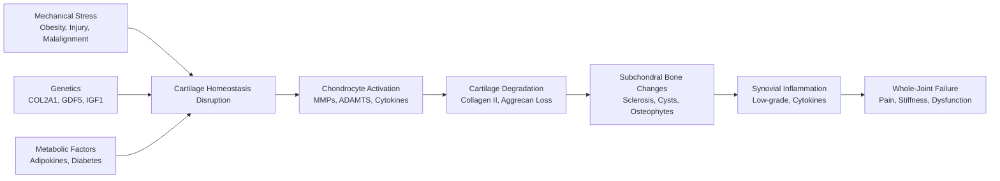
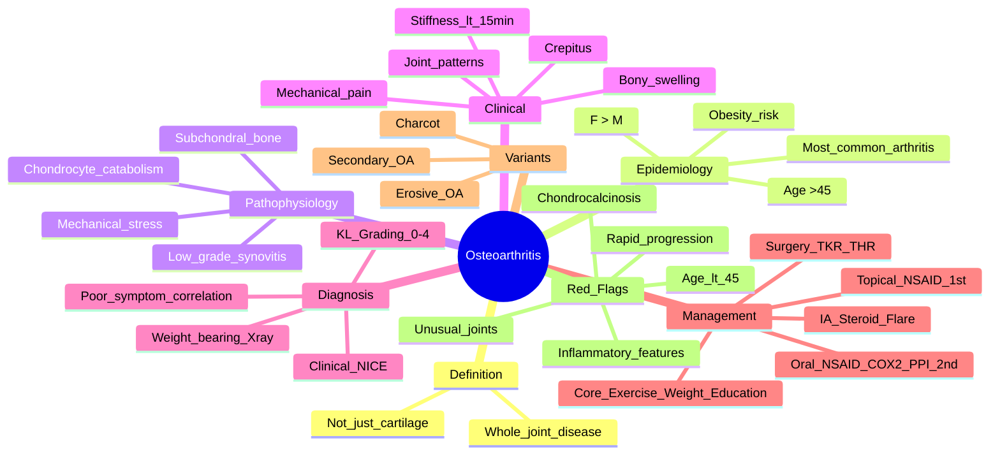

# Osteoarthritis (OA)

> [!tip] **FCPS/MRCP Priority: CRITICAL**
> OA is the **most common joint disease** — mechanical pain pattern, bony swelling, Kellgren-Lawrence grading, core treatments (exercise/weight loss/NSAIDs), joint replacement criteria. Guaranteed SBA/viva topic.

---

## Learning Objectives
By the end of this note you should be able to:
- [ ] Differentiate OA from inflammatory arthritis using pain pattern, stiffness duration, and examination findings
- [ ] Apply Kellgren-Lawrence grading for radiographic OA severity
- [ ] Identify characteristic joint involvement patterns (nodal hand OA, knee, hip, 1st CMC, spine)
- [ ] Implement NICE/OARSI management algorithm: core → pharmacological → surgical
- [ ] Recognise erosive OA and secondary OA red flags
- [ ] Counsel on joint replacement indications and outcomes

---

## 1. Definition & Epidemiology

| Feature | Detail |
|---------|--------|
| **Definition** | **Whole-joint disease** — cartilage loss, subchondral bone sclerosis, osteophytes, synovitis, capsule/ligament changes, meniscal damage; not just "wear and tear" |
| **Prevalence** | **Most common arthritis** — 10% men, 18% women >60y symptomatic; radiographic > clinical |
| **Incidence** | Increases exponentially with age |
| **Peak Onset** | **>45 years** (rare <40 unless secondary) |
| **Sex Ratio** | **F > M** (especially hand, knee); hip similar |
| **Risk Factors** | **Age**, **obesity** (knee > hip), **female sex**, **joint injury** (ACL/meniscus), **occupation** (kneeling, heavy lifting), **genetics** (nodal OA heritability ~40-60%), **malalignment**, **muscle weakness** |

---

## 2. Aetiology & Pathophysiology



### Key Pathogenic Concepts
| Concept | Detail |
|---------|--------|
| **Not just cartilage** | Whole joint: bone, synovium, capsule, ligaments, menisci, muscles |
| **Mechanical + inflammatory** | Low-grade synovitis (cytokines: IL-1, TNF, IL-6) drives pain and progression |
| **Subchondral bone** | Sclerosis → altered load distribution → cartilage loss; bone marrow lesions (BMLs) on MRI = pain correlate |
| **Osteophytes** | Stabilisation attempt at joint margins; **not the cause of pain** |
| **Chondrocyte phenotype shift** | Anabolic → catabolic (MMPs, ADAMTS-5) |

---

## 3. Clinical Features

### Pain Pattern — **The Diagnostic Key**
| Feature | **OA (Mechanical)** | **Inflammatory (RA, SpA)** |
|---------|---------------------|---------------------------|
| **Timing** | Worse **with activity**, end of day | Worse **at rest**, night, early morning |
| **Relief** | Improves **with rest** | Improves **with activity** |
| **Morning Stiffness** | **<15 minutes** (often none) | **>30-60 minutes** (hours) |
| **Night Pain** | Late disease (advanced) | Early (inflammatory) |
| **Quality** | Sharp, catching, mechanical | Dull, gnawing, throbbing |

> [!critical] **MRCP Pearl**
> - **Stiffness <15 min = mechanical (OA)**
> - **Stiffness >30-60 min = inflammatory**
> - **Gel phenomenon** (stiffness after sitting) = inflammatory

### Examination Findings
| Sign | OA | Inflammatory |
|------|-----|--------------|
| **Swelling** | **Bony** (hard, fixed, cool), osteophytes | **Synovial** (boggy, warm, doughy), effusion |
| **Crepitus** | **Coarse, audible/ palpable** | Absent or fine |
| **Tenderness** | Joint line, osteophytes | Joint line, synovium |
| **ROM** | Reduced (late), painful end-range | Reduced, painful throughout |
| **Deformity** | Bony enlargement, fixed flexion | Subluxation, ulnar drift, swan neck |

### Characteristic Joint Patterns

| Joint | Pattern | Key Features |
|-------|---------|--------------|
| **Hand (Nodal OA)** | **DIP (Heberden's nodes) + PIP (Bouchard's nodes) + 1st CMC (squaring)**; **MCP SPARED** | Female > male, familial, often asymptomatic |
| **Erosive OA** | DIP/PIP **erosions + inflammation** (gull-wing, saw-tooth), postmenopausal women | Subset of nodal OA; can mimic RA/PsA |
| **1st CMC (Thumb base)** | **Squaring**, thenar wasting, pain pinch/grip | Very common, functionally limiting |
| **Knee** | Medial compartment > lateral; patellofemoral; varus deformity; effusion (often mild) | Varus = medial OA; valgus = lateral OA |
| **Hip** | Groin pain (referral to knee), reduced IR (earliest), flexion contracture (Thomas test +) | Antalgic gait, Trendelenburg |
| **Spine** | **Facet joint OA** + disc degeneration; cervical/lumbar > thoracic; osteophytes (syndesmophytes in DISH) | Stiffness <15 min, mechanical pain |

---

## 4. Classification

| Type | Description |
|------|-------------|
| **Primary (Idiopathic)** | No identifiable cause; multifactorial (age, genetics, biomechanics) |
| **Secondary** | Identifiable cause: trauma, congenital (dysplasia), metabolic (CPPD, haemochromatosis, OI), inflammatory (RA sequelae), neuropathic (Charcot), endocrine (acromegaly, hypothyroidism) |

> [!warning] **Red Flags for Secondary OA**
> - **Age <45** with significant OA
> - **Inflammatory features** (prolonged stiffness, warmth, systemic symptoms)
> - **Unusual joints** (shoulder, elbow, ankle, MCP — think secondary)
> - **Rapid progression** (joint space loss >2mm/year)
> - **Chondrocalcinosis** on X-ray → CPPD
> - **Family history** of early OA → genetic (COL2A1, COMP)

---

## 5. Diagnosis — Clinical + Radiographic

### Clinical Diagnosis (NICE)
**Diagnose OA clinically IF:**
- Age **≥45**
- **Activity-related joint pain**
- **Morning stiffness ≤30 minutes** (or none)
- **No** other cause identified

> **No imaging required for diagnosis** if clinical picture fits

### Radiographic Features (Kellgren-Lawrence Grading 0-4)

| Grade | Description | Findings |
|-------|-------------|----------|
| **0** | Normal | No features |
| **1** | Doubtful | **Possible osteophyte** (minimal), no JSN |
| **2** | Minimal | **Definite osteophyte**, **possible JSN**, normal bone |
| **3** | Moderate | **Definite JSN**, **multiple osteophytes**, **sclerosis**, possible cysts |
| **4** | Severe | **Marked JSN** (bone-on-bone), **large osteophytes**, **sclerosis**, **cysts**, deformity |

> [!important] **X-ray ≠ Symptoms**
> - **Poor correlation**: Grade 4 radiograph can be asymptomatic; severe pain with Grade 1-2
> - **Weight-bearing views** essential (knee: AP weight-bearing + lateral + skyline; hip: AP pelvis + lateral)

### Advanced Imaging
| Modality | Role |
|----------|------|
| **MRI** | Bone marrow lesions (BMLs) = pain correlate; cartilage volume; meniscal tears; effusion; synovitis |
| **Ultrasound** | Effusion, synovitis (power Doppler), osteophytes, Baker's cyst, guided injection |
| **CT** | Bony detail (pre-op planning), malalignment |

### Differential Diagnosis
| Condition | Distinguishing Features |
|-----------|------------------------|
| **Inflammatory arthritis (RA, PsA)** | Prolonged stiffness, synovial swelling, symmetrical small joints, +RF/ACPA, elevated CRP |
| **CPPD** | Chondrocalcinosis on X-ray, acute pseudogout attacks, MCP/2nd-3rd metacarpal involvement |
| **Septic arthritis** | Acute hot swollen joint, fever, WBC >50k in fluid — **emergency** |
| **Avascular necrosis** | Hip > knee; risk factors (steroids, alcohol, trauma); crescent sign on X-ray |
| **Charcot arthropathy** | Neuropathy (diabetes), gross deformity, dislocation, warm foot, minimal pain |
| **Fibromyalgia** | Widespread pain, fatigue, sleep disturbance, **normal exam/ESR/CRP**, no swelling |

---

## 6. Management — NICE/OARSI Algorithm (2022)

```mermaid
flowchart TD
    A[OA Diagnosis] --> B[Core Treatments\nALL PATIENTS]
    B --> C1[Exercise: Strengthen + Aerobic]
    B --> C2[Weight Loss: ≥5% if BMI >25]
    B --> C3[Education + Self-management]
    B --> C4[Assistive Devices: Cane, Insoles, Braces]
    C1 --> D{Inadequate Control}
    C2 --> D
    C3 --> D
    C4 --> D
    D -->|Yes| E[Pharmacological\nStep-up]
    D -->|No| F[Continue Core + Review]
    E --> E1[Topical NSAID (knee/hand) 1st line]
    E1 --> E2[Oral NSAID/COX-2 + PPI\nLowest dose, shortest duration]
    E2 --> E3[Intra-articular Corticosteroid\nFlare / pre-op bridge]
    E3 --> E4[Consider: Capsaicin, Duloxetine, Weak Opioid]
    E4 --> G{Still Inadequate\n+ Structural Severity}
    G -->|Yes| H[Surgical Referral]
    G -->|No| I[Optimise Medical + Review]
```

### Step 1: Core Treatments (Non-Pharmacological) — **Mandatory for ALL**

| Intervention | Evidence | Implementation |
|--------------|----------|----------------|
| **Exercise** | **Strongest evidence** — strength + aerobic | Quadriceps strengthening (knee), gluteal (hip), hand exercises; **supervised → home**; water-based if severe |
| **Weight Loss** | **5% body weight → 20-30% pain improvement** (knee) | Diet + exercise; **BMI >25 target ≥5% loss**; bariatric if BMI >35 |
| **Education** | Improves self-efficacy, adherence | Written info, signpost to Versus Arthritis, group programmes (ESCAPE-pain) |
| **Assistive Devices** | Offloading | **Cane (contralateral hand)**, insoles (medial wedge for medial knee OA), thumb splint (1st CMC), knee brace (unloader) |

### Step 2: Pharmacological (Add to Core, Not Replace)

| Drug | Indication | Dose/Route | Key Points |
|------|------------|------------|------------|
| **Topical NSAID** | **1st line knee/hand OA** | QID (gel/cream) | **Lower systemic SE**; preferred > oral in >75y |
| **Oral NSAID/COX-2** | Topical inadequate | Lowest effective dose, shortest duration | **COX-2 + PPI** or **non-selective + PPI** if GI risk; **avoid in CKD, HF, IHD** |
| **IA Corticosteroid** | Moderate-severe flare / pre-op bridge | Methylpred 40-80mg (knee), 20-40mg (med), 10-20mg (small) | **Max 3-4/year/joint**; screen for infection; transient hyperglycaemia |
| **Paracetamol** | Weak evidence alone | 1g QDS | Use as adjunct, not monotherapy |
| **Topical Capsaicin** | Adjunct (knee/hand) | 0.025-0.075% QID | Burning sensation initially; depletes substance P |
| **Duloxetine** | Central sensitisation, widespread pain | 30mg → 60mg daily | SNRI; evidence for knee OA; SE: nausea, dizziness |
| **Weak Opioid** | Short-term severe pain | Codeine/tramadol PRN | **Avoid long-term** — dependence, falls, constipation |
| **IA Hyaluronic Acid** | Not NICE recommended | Variable | **NICE: do not offer** (insufficient evidence) |
| **Glucosamine/Chondroitin** | Not NICE recommended | — | **NICE: do not offer** (no consistent benefit) |

> [!critical] **NSAID + PPI Co-prescription**
> - Age >65
> - Prior GI bleed/ulcer
> - Concurrent steroid/anticoagulant/SSRI
> - High-dose/long-term NSAID
> - **H. pylori** positive (eradicate first)

### Step 3: Surgical Referral

| Procedure | Indication | Outcomes |
|-----------|------------|----------|
| **Total Knee Replacement (TKR)** | Severe symptoms + radiographic Grade 3-4 **AND** failed core + pharmacological | **90-95% excellent pain relief**; 15-20% dissatisfaction (residual pain, stiffness); revision rate 5% at 10yr |
| **Total Hip Replacement (THR)** | Severe symptoms + radiographic Grade 3-4 **AND** failed conservative | **95% excellent**; lower dissatisfaction than TKR; revision 4% at 10yr |
| **Unicompartmental Knee (UKR)** | Isolated medial compartment OA, intact ACL, correctable deformity | Faster rehab, more natural feel; higher revision than TKR |
| **1st CMC Arthroplasty / Trapeziectomy** | Thumb base OA failed conservative | Good pain relief, pinch strength recovery |
| **Arthroscopic Lavage/Debridement** | **Not recommended** for pure OA (NICE) | No benefit over placebo |

> [!important] **Surgical Referral Criteria (NICE)**
> - **Severe symptoms** affecting QoL (pain, function, sleep)
> - **Radiographic Grade 3-4** (Kellgren-Lawrence)
> - **Failed adequate trial** of core + pharmacological (3-6 months)
> - **Patient fit for surgery** and willing

---

## 7. Joint-Specific Management Pearls

| Joint | Core | Pharmacological | Surgical |
|-------|------|----------------|----------|
| **Hand (nodal)** | Exercise, splinting (thumb), joint protection | Topical NSAID 1st; oral NSAID; IA steroid (1st CMC) | Trapeziectomy / arthroplasty (1st CMC) |
| **Knee** | **Quadriceps strengthen**, weight loss, **cane (contralateral)**, patellar taping | Topical NSAID → Oral NSAID/COX-2+PPI → IA steroid (max 3-4/yr) | TKR / UKR / HTO (young, varus, medial OA) |
| **Hip** | Gluteal strengthening, weight loss, cane | Oral NSAID/COX-2+PPI (topical less effective) | THR (gold standard) |
| **Spine** | Core strengthening, posture, weight loss | NSAID, muscle relaxants (short-term) | Fusion (rare, specific indications) |

---

## 8. Erosive Osteoarthritis (EOA) — Distinct Subset

| Feature | Detail |
|---------|--------|
| **Population** | Postmenopausal women (40-60) |
| **Joints** | DIP/PIP (nodal distribution) |
| **Clinical** | **Inflammatory** (pain, stiffness >30min, warmth, swelling) + erosions |
| **Radiographic** | **Central erosions** (gull-wing, saw-tooth), osteophytes, **preserved MCP** |
| **Serology** | RF/ACPA negative, CRP normal/mildly elevated |
| **Course** | **Burns out** → stable bony ankylosis; can mimic RA/PsA |
| **Management** | NSAID, IA steroid, HCQ (anecdotally), **avoid aggressive immunosuppression** |

---

## 9. FCPS/MRCP High-Yield Summary

| Topic | Key Points |
|-------|------------|
| **Pain Pattern** | Mechanical: worse activity, better rest, stiffness **<15 min** |
| **Examination** | **Bony swelling** (hard, cool), **crepitus**, **reduced ROM**; MCP spared in hand |
| **Hand OA Pattern** | **Heberden's (DIP) + Bouchard's (PIP) + 1st CMC squaring**; MCP spared |
| **Kellgren-Lawrence** | 0-4: 0=normal, 1=doubtful osteophyte, 2=minimal, 3=moderate JSN+sclerosis, 4=severe bone-on-bone |
| **Core Treatment** | **Exercise + Weight loss + Education** (mandatory for ALL) |
| **1st Line Drug** | **Topical NSAID** (knee/hand) |
| **2nd Line Drug** | **Oral NSAID/COX-2 + PPI** (lowest dose, shortest duration) |
| **IA Steroid** | Flare / bridge; max 3-4/year/joint |
| **Surgery** | TKR/THR: severe symptoms + KL 3-4 + failed 3-6mo conservative |
| **Erosive OA** | Postmenopausal women, DIP/PIP erosions + inflammation, gull-wing, RF/CCP negative |
| **Red Flags for Secondary OA** | Age <45, inflammatory features, unusual joints, rapid progression, chondrocalcinosis |

---

## 10. Viva Questions (MRCP PACES / FCPS)

| Question | Expected Answer |
|----------|----------------|
| "How do you clinically differentiate OA from RA?" | OA: mechanical pain (worse activity), stiffness <15 min, **bony swelling** (Heberden's/Bouchard's, 1st CMC squaring), crepitus, MCP spared. RA: inflammatory pain (worse rest), stiffness >1hr, **boggy synovitis**, MCP/PIP/wrist symmetrical, +RF/CCP. |
| "What is the Kellgren-Lawrence grading for knee OA?" | 0=normal, 1=doubtful osteophyte, 2=definite osteophyte ± minimal JSN, 3=moderate JSN + sclerosis + cysts, 4=severe JSN (bone-on-bone) + large osteophytes + deformity. |
| "A 65yo obese woman with knee OA BMI 32. What non-pharmacological advice?" | **Weight loss ≥5%** (20-30% pain improvement), **quadriceps strengthening exercises**, **cane in contralateral hand**, education, patellar taping. |
| "First-line pharmacological treatment for knee OA?" | **Topical NSAID** (gel/cream QID). If inadequate → oral NSAID/COX-2 + PPI. |
| "When do you refer for total knee replacement?" | Severe symptoms affecting QoL + KL Grade 3-4 + failed 3-6 months core (exercise/weight loss) + pharmacological (topical/oral NSAID, IA steroid) management. |
| "What is erosive osteoarthritis and how does it differ from RA?" | Postmenopausal women, DIP/PIP erosions with inflammation (gull-wing), **central erosions**, osteophytes, **RF/CCP negative**, burns out to ankylosis. RA: MCP/PIP/wrist, marginal erosions, +RF/CCP, progressive. |
| "A 50yo man presents with hip pain, reduced internal rotation, Thomas test positive. X-ray shows KL Grade 3. Management?" | Core: gluteal strengthening, weight loss, cane. Pharmacological: oral NSAID/COX-2 + PPI. Refer for **THR** if failed conservative (symptoms severe, KL 3-4). |

---

## 11. Confusions & Mnemonics

| Confusion | Clarification |
|-----------|---------------|
| **OA vs RA hand pattern** | OA: **DIP + PIP + 1st CMC** (MCP spared). RA: **MCP + PIP + wrist** (DIP spared). |
| **Heberden's vs Bouchard's** | **Heberden's = DIP** (H for "High" / distal); **Bouchard's = PIP** (B for "Between" / proximal). |
| **Mechanical vs Inflammatory stiffness** | Mechanical: **<15 min**, worse end of day. Inflammatory: **>30-60 min**, worse morning. |
| **IA steroid frequency** | **Max 3-4 per year per joint** — more → cartilage damage, infection risk |
| **Glucosamine/Chondroitin** | **NICE: do not offer** — no consistent evidence of benefit over placebo |
| **Secondary OA clues** | Age <45, inflammatory features, unusual joints (shoulder/elbow/ankle/MCP), rapid progression, chondrocalcinosis, family history |

**Mnemonic: OA Pain = "Mechanical"**
- **M**orning stiffness <15 min
- **E**nd-of-day pain
- **C**repitus
- **H**ard bony swelling
- **A**ctivity worsens
- **N**o systemic features
- **I**mproves with rest
- **C**artilage loss on X-ray
- **A**ge >45
- **L**arge weight-bearing joints

**Mnemonic: Hand OA = "H.B.C."**
- **H**eberden's (DIP)
- **B**ouchard's (PIP)
- **C**MC (1st CMC squaring)
- **MCP SPARED**

**Mnemonic: KL Grading = "0 Normal, 1 Doubtful, 2 Minimal, 3 Moderate, 4 Severe"**

---

## 12. Mind Map



---

## 13. One-Page Revision Card

| Domain | Key Points |
|--------|------------|
| **Pain** | Mechanical: worse activity, better rest, **stiffness <15 min** |
| **Exam** | **Bony swelling** (hard, cool), crepitus, reduced ROM; **no warmth/boggy synovitis** |
| **Hand Pattern** | **Heberden's (DIP) + Bouchard's (PIP) + 1st CMC squaring**; **MCP SPARED** |
| **Knee** | Medial > lateral, varus, effusion mild, KL grading weight-bearing |
| **Hip** | Groin pain, reduced IR (earliest), flexion contracture, antalgic gait |
| **KL Grade** | 0=N, 1=Doubtful, 2=Minimal osteophyte, 3=Moderate JSN+sclerosis, 4=Severe bone-on-bone |
| **Core Rx** | **Exercise + Weight loss ≥5% + Education** (ALL patients) |
| **Drugs** | 1st: **Topical NSAID** → 2nd: **Oral NSAID/COX-2 + PPI** → IA steroid (flare) |
| **Surgery** | TKR/THR: severe symptoms + KL 3-4 + failed 3-6mo conservative |
| **Erosive OA** | Postmenopausal women, DIP/PIP erosions + inflammation, **RF/CCP negative** |
| **Red Flags** | <45y, inflammatory signs, unusual joints, rapid progression, chondrocalcinosis |

---

## 14. Spaced Repetition Trackers

| Review Interval | Date Completed | Confidence (1-5) | Notes |
|-----------------|----------------|------------------|-------|
| 24 hours | | | |
| 7 days | | | |
| 15 days | | | |
| 30 days | | | |
| 90 days | | | |

---

## 15. Self-Test Scorecard

| Section | Score /5 | Last Attempt |
|---------|----------|--------------|
| Mechanical vs Inflammatory Pain | | |
| Kellgren-Lawrence Grading | | |
| Hand OA Patterns | | |
| NICE Management Algorithm | | |
| IA Steroid Indications/Limits | | |
| Surgical Referral Criteria | | |
| Erosive OA Recognition | | |
| Viva Questions | | |

---

## Local Navigation
- **Parent Heading**: [[../Osteoarthritis and Related Disorders|Osteoarthritis and Related Disorders]]
- **Parent Topic Group**: [[Common regional musculoskeletal problems]]
- **Chapter Map**: [[../Davidson Chapter 26 - Rheumatology Hierarchy|Rheumatology Hierarchy]]
- **Chapter MOC**: [[../Rheumatology MOC|Rheumatology MOC]]
- **Drug Reference**: [[../../Clinical Approach to Musculoskeletal Disease/Drugs in rheumatology|Drugs in rheumatology]]
- **Investigation Reference**: [[../../Clinical Approach to Musculoskeletal Disease/Investigations in rheumatology|Investigations in rheumatology]]
- **Related**: [[Erosive osteoarthritis]] · [[Charcot arthropathy]] · [[Common regional musculoskeletal problems]]
---

> Auto-generated study sections for "Osteoarthritis and Related Disorders" — Ch 25: Rheumatology & Bone Disease.

## Flashcards (40 generated)

- Q: What is the definition of Osteoarthritis and Related Disorders?
  A: Whole-joint disease — cartilage loss, subchondral bone sclerosis, osteophytes, synovitis, capsule/ligament changes, meniscal damage; not just "wear and tear"
- Q: What is the epidemiology of Osteoarthritis and Related Disorders?
  A: Most common arthritis — 10% men, 18% women >60y symptomatic; radiographic > clinical
- Q: What is Peak Onset of Osteoarthritis and Related Disorders?
  A: >45 years (rare <40 unless secondary)
- Q: What is Sex Ratio of Osteoarthritis and Related Disorders?
  A: F > M (especially hand, knee); hip similar
- Q: What causes Osteoarthritis and Related Disorders?
  A: Age, obesity (knee > hip), female sex, joint injury (ACL/meniscus), occupation (kneeling, heavy lifting), genetics (nodal OA heritability ~40-60%), malalignment, muscle weakness
- Q: What is Not just cartilage of Osteoarthritis and Related Disorders?
  A: Whole joint: bone, synovium, capsule, ligaments, menisci, muscles
- Q: What is Mechanical + inflammatory of Osteoarthritis and Related Disorders?
  A: Low-grade synovitis (cytokines: IL-1, TNF, IL-6) drives pain and progression
- Q: What is Subchondral bone of Osteoarthritis and Related Disorders?
  A: Sclerosis → altered load distribution → cartilage loss; bone marrow lesions (BMLs) on MRI = pain correlate
- Q: What is Osteophytes of Osteoarthritis and Related Disorders?
  A: Stabilisation attempt at joint margins; not the cause of pain
- Q: How is Osteoarthritis and Related Disorders classified?
  A: Anabolic → catabolic (MMPs, ADAMTS-5)
- Q: What is Population of Osteoarthritis and Related Disorders?
  A: Postmenopausal women (40-60)
- Q: What is Joints of Osteoarthritis and Related Disorders?
  A: DIP/PIP (nodal distribution)
- Q: What is Clinical of Osteoarthritis and Related Disorders?
  A: Inflammatory (pain, stiffness >30min, warmth, swelling) + erosions
- Q: What is Radiographic of Osteoarthritis and Related Disorders?
  A: Central erosions (gull-wing, saw-tooth), osteophytes, preserved MCP
- Q: What is Serology of Osteoarthritis and Related Disorders?
  A: RF/ACPA negative, CRP normal/mildly elevated
- Q: What is Course of Osteoarthritis and Related Disorders?
  A: Burns out → stable bony ankylosis; can mimic RA/PsA
- Q: How is Osteoarthritis and Related Disorders managed?
  A: NSAID, IA steroid, HCQ (anecdotally), avoid aggressive immunosuppression
- Q: What is Not just cartilage of Osteoarthritis and Related Disorders?
  A: Whole joint: bone, synovium, capsule, ligaments, menisci, muscles
- Q: What is Mechanical + inflammatory of Osteoarthritis and Related Disorders?
  A: Low-grade synovitis (cytokines: IL-1, TNF, IL-6) drives pain and progression
- Q: What is Subchondral bone of Osteoarthritis and Related Disorders?
  A: Sclerosis → altered load distribution → cartilage loss; bone marrow lesions (BMLs) on MRI = pain correlate
- Q: What is Osteophytes of Osteoarthritis and Related Disorders?
  A: Stabilisation attempt at joint margins; not the cause of pain
- Q: How is Osteoarthritis and Related Disorders classified?
  A: Anabolic → catabolic (MMPs, ADAMTS-5)
- Q: What is Population of Osteoarthritis and Related Disorders?
  A: Postmenopausal women (40-60)
- Q: What is Joints of Osteoarthritis and Related Disorders?
  A: DIP/PIP (nodal distribution)
- Q: What is Clinical of Osteoarthritis and Related Disorders?
  A: Inflammatory (pain, stiffness >30min, warmth, swelling) + erosions
- Q: What is Radiographic of Osteoarthritis and Related Disorders?
  A: Central erosions (gull-wing, saw-tooth), osteophytes, preserved MCP
- Q: What is Serology of Osteoarthritis and Related Disorders?
  A: RF/ACPA negative, CRP normal/mildly elevated
- Q: What is Course of Osteoarthritis and Related Disorders?
  A: Burns out → stable bony ankylosis; can mimic RA/PsA
- Q: How is Osteoarthritis and Related Disorders managed?
  A: NSAID, IA steroid, HCQ (anecdotally), avoid aggressive immunosuppression
- Q: What is Pain Pattern of Osteoarthritis and Related Disorders?
  A: Mechanical: worse activity, better rest, stiffness <15 min
- Q: What is Examination of Osteoarthritis and Related Disorders?
  A: Bony swelling (hard, cool), crepitus, reduced ROM; MCP spared in hand
- Q: What is Hand OA Pattern of Osteoarthritis and Related Disorders?
  A: Heberden's (DIP) + Bouchard's (PIP) + 1st CMC squaring; MCP spared
- Q: What is Kellgren-Lawrence of Osteoarthritis and Related Disorders?
  A: 0-4: 0=normal, 1=doubtful osteophyte, 2=minimal, 3=moderate JSN+sclerosis, 4=severe bone-on-bone
- Q: How is Osteoarthritis and Related Disorders managed?
  A: Exercise + Weight loss + Education (mandatory for ALL)
- Q: What is 1st Line Drug of Osteoarthritis and Related Disorders?
  A: Topical NSAID (knee/hand)
- Q: What is 2nd Line Drug of Osteoarthritis and Related Disorders?
  A: Oral NSAID/COX-2 + PPI (lowest dose, shortest duration)
- Q: What is IA Steroid of Osteoarthritis and Related Disorders?
  A: Flare / bridge; max 3-4/year/joint
- Q: What is Surgery of Osteoarthritis and Related Disorders?
  A: TKR/THR: severe symptoms + KL 3-4 + failed 3-6mo conservative
- Q: What is Erosive OA of Osteoarthritis and Related Disorders?
  A: Postmenopausal women, DIP/PIP erosions + inflammation, gull-wing, RF/CCP negative
- Q: What is Red Flags for Secondary OA of Osteoarthritis and Related Disorders?
  A: Age <45, inflammatory features, unusual joints, rapid progression, chondrocalcinosis

## MCQs (1 generated)

1. **Which of the following best describes Osteoarthritis and Related Disorders?**
   A. **OA is the most common joint disease — mechanical pain pattern, bony swelling, Kellgren-Lawrence grading, core treatments (exercise/weight loss/NSAIDs), joint replacement criteria.**
   B. An unrelated condition not matching the clinical picture of Osteoarthritis and Related Disorders
   C. A complication seen late in the disease course of Osteoarthritis and Related Disorders
   D. A condition that mimics Osteoarthritis and Related Disorders but has a different underlying cause

## SBA Questions (1 generated)

1. A patient with suspected Osteoarthritis and Related Disorders presents with: Definition — Whole-joint disease — cartilage loss, subchondral bone sclerosis, osteophytes, synovitis, capsule/ligament changes, meniscal damage; not just "wear and tear"; Prevalence — Most common arthritis — 10% men, 18% women >60y symptomatic; radiographic > clinical; Incidence — Increases exponentially with age. What is the most likely diagnosis?
   A. **Osteoarthritis and Related Disorders**
   B. A condition that mimics Osteoarthritis and Related Disorders but is not the same entity
   C. A complication of Osteoarthritis and Related Disorders rather than the primary diagnosis
   D. An unrelated condition in the same clinical category as Osteoarthritis and Related Disorders

