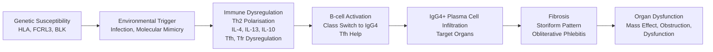
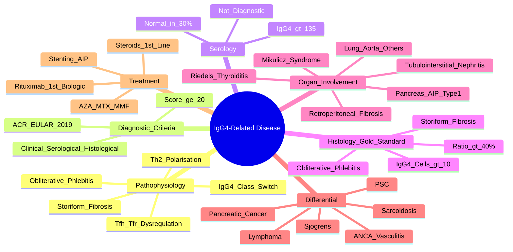

# IgG4-Related Disease (IgG4-RD)

> [!tip] **FCPS/MRCP Priority: HIGH**
> IgG4-RD = **immune-mediated fibroinflammatory condition** with **IgG4+ plasma cell infiltration**. **Serum IgG4 >135 mg/dL** (not specific). **Histology: storiform fibrosis, obliterative phlebitis, IgG4+ plasma cells**. **Organ involvement**: pancreas (autoimmune pancreatitis), salivary/lacrimal glands (Mikulicz), retroperitoneal fibrosis, Riedel's thyroiditis, tubulointerstitial nephritis. **Steroids 1st line**; **rituximab refractory**.

---

## Learning Objectives
By the end of this note you should be able to:
- [ ] Apply **comprehensive diagnostic criteria** (serum IgG4, histology, imaging) for IgG4-RD
- [ ] Recognise **classic organ involvement**: pancreas (type 1 AIP), salivary/lacrimal glands (Mikulicz), retroperitoneal fibrosis, Riedel's thyroiditis, tubulointerstitial nephritis
- [ ] Interpret **serum IgG4** (>135 mg/dL supportive but not specific; can be normal in 30%)
- [ ] Apply **histopathological criteria**: **storiform fibrosis, obliterative phlebitis, IgG4+/IgG >40%, >10 IgG4+ cells/HPF**
- [ ] Differentiate from **sarcoidosis, lymphoma, ANCA vasculitis, malignancy**
- [ ] Select treatment: **steroids 1st line**, **steroid-sparing (azathioprine, MTX, rituximab)** for refractory/relapse

---

## 1. Definition & Epidemiology

| Feature | Detail |
|---------|--------|
| **Definition** | **Immune-mediated fibroinflammatory condition** characterised by **IgG4+ plasma cell infiltration**, **storiform fibrosis**, **obliterative phlebitis**, and **elevated serum IgG4** |
| **Incidence** | 0.5-1.5/100,000/year (increasing recognition) |
| **Peak Age** | **50-70 years** |
| **Sex Ratio** | **M > F** (1.5-2:1) |
| **Aetiology** | Unknown — **immune dysregulation**, **Th2 polarisation**, **regulatory T-cell dysfunction** |

---

## 2. Pathophysiology



### Key Pathogenic Features
| Feature | Detail |
|---------|--------|
| **Th2 Polarisation** | **IL-4, IL-13, IL-10, IL-21** → B-cell class switch to IgG4 |
| **Tfh/Tfr Dysregulation** | **Follicular helper T-cells** promote IgG4; **follicular regulatory T-cells** deficient |
| **IgG4 Properties** | **Poor complement activation**, **Fab-arm exchange** (bispecific, anti-inflammatory?) |
| **Fibrosis** | **Storiform** (whorled), **obliterative phlebitis** (vein occlusion) |
| **Organ Involvement** | Multi-organ — **pancreas, salivary, lacrimal, retroperitoneum, thyroid, kidney, lung, aorta** |

---

## 3. Clinical Features — **Multi-Organ**

| Organ System | Manifestations | Frequency |
|--------------|----------------|-----------|
| **Pancreas** | **Type 1 Autoimmune Pancreatitis (AIP)** — obstructive jaundice, pancreatic mass, weight loss | **~30%** |
| **Salivary/Lacrimal** | **Mikulicz syndrome** (bilateral lacrimal + salivary enlargement), dry eyes/mouth | **~30%** |
| **Retroperitoneum** | **Retroperitoneal fibrosis** — hydronephrosis, back pain, aortic encasement | **~20%** |
| **Thyroid** | **Riedel's thyroiditis** — woody, fixed thyroid, compressive symptoms | **<5%** |
| **Kidney** | **Tubulointerstitial nephritis** — AKI/CKD, sterile pyuria, eosinophilia | **~15%** |
| **Lung** | **Pleural/parenchymal nodules**, interstitial fibrosis, pleural effusions | **~10%** |
| **Aorta** | **Periaortitis/aneurysm** — inflammatory abdominal aortic aneurysm | **<5%** |
| **Nose/Sinuses** | Chronic sinusitis, nasal polyps | **~10%** |
| **Other** | Prostate, breast, skin, meninges, pericardium | Rare |

> [!critical] **Multi-organ involvement = rule not exception** — mean **3-4 organs** involved at diagnosis

---

## 3. Diagnostic Criteria — **Comprehensive (ACR/EULAR 2019)**

**Entry Requirement**: **≥1 typical organ involvement** (clinical/imaging)

### Domains (Score ≥20 = Definite IgG4-RD)

| Domain | Item | Points |
|--------|------|--------|
| **Clinical** | **Pancreas** (AIP type 1) | 6 |
| | **Salivary/Lacrimal** (Mikulicz) | 5 |
| | **Retroperitoneal fibrosis** | 4 |
| | **Riedel's thyroiditis** | 4 |
| | **Tubulointerstitial nephritis** | 4 |
| | **Lung** (nodules/fibrosis) | 3 |
| | **Aorta/periaortitis** | 3 |
| | **Other organ** (prostate, breast, etc.) | 1 |
| **Serological** | **Serum IgG4 >135 mg/dL** | 6 |
| | **Serum IgG4 2-3x ULN** | 3 |
| **Histopathological** | **Storiform fibrosis** | 4 |
| | **Obliterative phlebitis** | 4 |
| | **IgG4+ plasma cells >10/HPF** | 3 |
| | **IgG4+/IgG >40%** | 3 |

**Total ≥20 = Definite IgG4-RD** (Sensitivity 94%, Specificity 99%)

> [!important] **Exclusion Criteria** (must be absent):
> - **Malignancy** (pancreatic cancer, lymphoma)
> - **ANCA-associated vasculitis** (GPA, MPA, EGPA)
> - **Sarcoidosis** (non-caseating granulomas)
> - **ANCA+ vasculitis, Anti-GBM, Sjögren's, SLE, MCTD**
> - **Infections** (TB, syphilis, fungal)
> - **Drug-induced** (checkered flag)

---

## 4. Key Organ Manifestations

### Type 1 Autoimmune Pancreatitis (AIP)
| Feature | Detail |
|---------|--------|
| **Definition** | **IgG4-RD of pancreas** — **obstructive jaundice, pancreatic mass, weight loss** |
| **Imaging (CT/MRI)** | **Diffuse enlargement** ("sausage pancreas"), **rim sign** (capsular-like rim), **delayed enhancement** |
| **ERCP/MRCP** | **Long strictures** (pancreatic/bile duct), **diffuse irregular narrowing** |
| **Serology** | **IgG4 >135 mg/dL** (90%), **elevated IgG**, **elevated CA19-9** (can mimic cancer) |
| **Histology** | **Lymphoplasmacytic sclerosing pancreatitis (LPSP)** — storiform fibrosis, obliterative phlebitis, IgG4+ cells |
| **Differs from Pancreatic Cancer** | **No weight loss/cachexia** (or less severe), **steroid responsive**, **no vascular invasion** |

### Mikulicz Syndrome
| Feature | Detail |
|---------|--------|
| **Definition** | **Bilateral lacrimal + salivary gland enlargement** (IgG4-RD related) |
| **Classic** | **Painless, bilateral, symmetrical** enlargement of lacrimal, parotid, submandibular glands |
| **Dryness** | **Keratoconjunctivitis sicca**, **xerostomia** |
| **Differential** | **Sjögren's** (anti-Ro/La+, focus score, usually RF+), **lymphoma**, **sarcoidosis** |

### Retroperitoneal Fibrosis
| Feature | Detail |
|---------|--------|
| **Presentation** | **Flank/back pain**, **hydronephrosis** (ureteric obstruction), **aortic encasement** |
| **Imaging** | **CT/MRI**: **soft tissue mass encasing aorta/ureters**, "candle wax" aorta |
| **IgG4-Related** | ~30-50% of idiopathic retroperitoneal fibrosis |
| **Treatment** | **Steroids + stenting** (ureteric stents) |

### Riedel's Thyroiditis
| Feature | Detail |
|---------|--------|
| **Presentation** | **Woody, fixed, hard thyroid** — **compressive symptoms** (dysphagia, dyspnoea, hoarseness) |
| **Histology** | **Dense fibrosis** extending beyond thyroid, **IgG4+ plasma cells** |
| **Differential** | Anaplastic thyroid cancer, Hashimoto's, sarcoidosis |

### Tubulointerstitial Nephritis
| Feature | Detail |
|---------|--------|
| **Presentation** | **AKI/CKD**, **sterile pyuria**, **eosinophilia**, **normal/high IgE** |
| **Biopsy** | **Tubulointerstitial nephritis** with IgG4+ plasma cells, storiform fibrosis |
| **Urine** | **Eosinophiluria**, low-grade proteinuria |

---

## 4. Investigations

### Serology
| Test | Threshold | Significance |
|------|-----------|--------------|
| **Serum IgG4** | **>135 mg/dL (or >2x ULN)** | **Supportive** — elevated in ~70% active IgG4-RD; **30% normal** |
| **IgG Subclasses** | IgG4 >2x ULN | Supports diagnosis |
| **Total IgG** | Often elevated | Polyclonal hypergammaglobulinaemia |
| **Autoantibodies** | ANA, RF, ANCA | Usually **negative** (exclude SLE, RA, ANCA vasculitis) |
| **Complement** | C3, C4 | Often normal (low in SLE, cryoglobulinaemia) |
| **ESR/CRP** | Mildly elevated | Not markedly elevated |
| **Eosinophilia** | Peripheral blood | Common (20-40%) |

> [!critical] **Serum IgG4 >135 mg/dL = supportive but NOT diagnostic** — **30% normal in active disease**; can be elevated in other conditions (pancreatic cancer, cholangiocarcinoma, PSC, allergic disease, pemphigus)

### Histopathology (Gold Standard)
| Feature | Description |
|---------|-------------|
| **Storiform Fibrosis** | **Whorled/cartwheel pattern** of fibroblasts |
| **Obliterative Phlebitis** | **Venous occlusion** by inflammatory infiltrate |
| **IgG4+ Plasma Cells** | **>10 IgG4+ cells/HPF** (in most involved tissue) |
| **IgG4+/IgG Ratio** | **>40%** (highly specific) |

> [!critical] **Histology = Gold Standard** — **Storiform fibrosis + Obliterative phlebitis + IgG4+ cells >10/HPF + IgG4/IgG >40%**

### Imaging
| Modality | Key Findings |
|----------|--------------|
| **CT/MRI** | Organ enlargement, mass-like lesions, retroperitoneal mass, "sausage pancreas," Mikulicz glands |
| **PET-CT** | **FDG-avid lesions** in multiple organs — excellent for extent assessment |
| **ERCP/MRCP** | **Long pancreatic/biliary strictures** (AIP) |
| **MRCP** | Non-invasive biliary/pancreatic duct imaging |

---

## 5. Differential Diagnosis

| Condition | Distinguishing Features |
|-----------|------------------------|
| **Malignancy** (Pancreatic Ca, Cholangiocarcinoma) | **Weight loss, cachexia**, **vascular invasion**, **CA19-9 >> Og**, **no steroid response**, **no IgG4+ plasma cells** |
| **ANCA Vasculitis (GPA/MPA/EGPA)** | **ANCA+**, necrotising granulomas (GPA), **no storiform fibrosis**, **no IgG4+ cells** |
| **Sarcoidosis** | **Non-caseating granulomas**, **ACE elevated**, **no storiform fibrosis**, **no IgG4+ cells** |
| **Sjögren's Syndrome** | **Anti-Ro/La+**, **focus score ≥1**, **sicca dominant**, **RF+**, **no storiform fibrosis** |
| **Primary Sclerosing Cholangitis (PSC)** | **Beaded strictures** (cholangiography), **IBD association**, **no IgG4+ plasma cells** |
| **Malignancy (Lymphoma)** | **Clonality on flow/biopsy**, **B symptoms**, **no IgG4+ plasma cells**, **no storiform fibrosis** |
| **Primary Biliary Cholangitis (PBC)** | **AMA+**, **cholestatic LFTs**, **florid duct lesions** |
| **Drug-Induced** | **Temporal relationship**, **resolution on withdrawal** |

> [!critical] **Exclude Malignancy Before Steroids!** — IgG4-RD mimics pancreatic cancer, cholangiocarcinoma, lymphoma

---

## 5. Management

```mermaid
flowchart TD
    A[IgG4-RD Diagnosis] --> B{Active Disease / Organ Threat}
    B -->|Yes| C[**Glucocorticoids**\nPrednisolone 0.6-1mg/kg/day\n(30-60mg daily)\nTaper over 3-6 months]
    B -->|No (Incidental) | D[Observe / Monitor]
    C --> E[Steroid Taper\nMonitor: IgG4, organ imaging, symptoms]
    E --> F{Relapse / Steroid-Dependent}
    F -->|Yes| G[**Steroid-Sparing**\n**Rituximab** 1000mg ×2 (2wks apart)\nOR **Azathioprine** 2mg/kg/day\nOR **Methotrexate** 15-25mg/wk\nOR **Mycophenolate** 2-3g/day]
    F -->|No| H[Taper to Stop\nLong-term Follow-up]
```

### Treatment by Scenario

| Scenario | 1st Line | Refractory/Relapse |
|----------|----------|-------------------|
| **Active Disease** | **Prednisolone 0.6-1mg/kg/day** (30-60mg) → taper over 3-6 months | **Rituximab 1000mg ×2 (2wks apart)** — **1st line biologic** |
| **AIP (Type 1)** | **Steroids + biliary stenting** (if obstructive jaundice) | **Rituximab** |
| **Retroperitoneal Fibrosis** | **Steroids + ureteric stenting** (if hydronephrosis) | **Rituximab, Tamoxifen** |
| **Mikulicz** | **Steroids** | **Rituximab** |
| **Renal** | **Steroids + MMF/AZA** | **Rituximab** |

> [!critical] **Rituximab = preferred steroid-sparing agent** — high remission rates, B-cell depletion targets IgG4+ plasma cells

### Monitoring
| Parameter | Frequency |
|-----------|-----------|
| **Serum IgG4** | Every 3 months during taper, then 6-monthly |
| **Organ Imaging** | CT/MRI every 6-12 months (organ-dependent) |
| **Renal Function** | Every 3 months if renal involvement |
| **Eosinophilia** | Monitor if present initially |
| **Relapse** | **IgG4 rise often precedes clinical relapse** |

---

## 6. FCPS/MRCP High-Yield Summary

| Topic | Key Points |
|-------|------------|
| **Definition** | **IgG4+ plasma cell infiltration + storiform fibrosis + obliterative phlebitis + elevated serum IgG4** |
| **Diagnostic Criteria** | **ACR/EULAR 2019**: ≥20 points (clinical + serological + histopathological) |
| **Serum IgG4** | **>135 mg/dL (or >2x ULN)** — **supportive, NOT diagnostic** (30% normal in active disease) |
| **Histology (Gold Standard)** | **Storiform fibrosis + obliterative phlebitis + >10 IgG4+ cells/HPF + IgG4/IgG >40%** |
| **Classic Organ Involvement** | **Pancreas (AIP type 1), Salivary/Lacrimal (Mikulicz), Retroperitoneal fibrosis, Riedel's thyroiditis, Tubulointerstitial nephritis** |
| **Exclusions** | **Malignancy, ANCA vasculitis, Sarcoidosis, Sjögren's, PSC, Infection, Drug-induced** |
| **Serum IgG4 Caveats** | **>135 mg/dL supportive only**; **normal in 30% active disease**; **elevated in cancer, PSC, allergic disease** |
| **Treatment** | **Steroids 1st line** (0.6-1mg/kg/day → taper); **Rituximab** 1st line steroid-sparing; **AZA/MTX/MMF** alternatives |
| **Relapse** | **Common** — monitor IgG4; **Rituximab preferred for relapse** |

---

## 7. Viva Questions (MRCP PACES / FCPS)

| Question | Expected Answer |
|----------|----------------|
| "What is IgG4-related disease and how is it diagnosed?" | **Immune-mediated fibroinflammatory disease** with **IgG4+ plasma cells, storiform fibrosis, obliterative phlebitis, elevated serum IgG4**. Diagnosed by **ACR/EULAR 2019 criteria** (≥20 points: clinical + serological + histopathological). |
| "What are the histopathological hallmarks of IgG4-RD?" | **1) Storiform fibrosis (whorled); 2) Obliterative phlebitis (venous occlusion); 3) IgG4+ plasma cells >10/HPF; 4) IgG4/IgG ratio >40%**. |
| "What is the significance of serum IgG4 level?" | **>135 mg/dL supportive** but **NOT diagnostic** — **30% of active IgG4-RD have normal IgG4**; also elevated in pancreatic cancer, PSC, allergic disease. |
| "What is type 1 autoimmune pancreatitis (AIP) and how does it differ from pancreatic cancer?" | **IgG4-RD of pancreas** — diffuse enlargement ("sausage pancreas"), rim sign, **steroid responsive**, **no vascular invasion**. Cancer = weight loss, cachexia, vascular invasion, **no steroid response**. |
| "What is Mikulicz syndrome and how does it differ from Sjögren's?" | Mikulicz = **bilateral lacrimal + salivary enlargement** in IgG4-RD. Sjögren's = **anti-Ro/La+, focus score ≥1, sicca dominant, RF+**. Mikulicz = IgG4-RD, **steroid responsive**. |
| "What is retroperitoneal fibrosis in IgG4-RD?" | **Soft tissue mass encasing aorta/ureters** → hydronephrosis, back pain. **CT/MRI: "candle wax" aorta**. ~30-50% idiopathic retroperitoneal fibrosis is IgG4-related. |
| "What is the diagnostic gold standard for IgG4-RD?" | **Histopathology**: **Storiform fibrosis + obliterative phlebitis + >10 IgG4+ cells/HPF + IgG4/IgG >40%**. |
| "How does IgG4-RD differ from sarcoidosis?" | **Sarcoidosis**: non-caseating granulomas, **ACE elevated**, **no storiform fibrosis, no IgG4+ cells**. IgG4-RD: **storiform fibrosis, obliterative phlebitis, IgG4+ cells, elevated IgG4**, ACE normal. |
| "What is the role of rituximab in IgG4-RD?" | **1st line steroid-sparing biologic** — **depletes B-cells** producing IgG4, high remission rates, used for refractory/relapse disease. |
| "How do you differentiate IgG4-RD from pancreatic cancer?" | **IgG4-RD: steroid responsive, diffuse "sausage" pancreas, rim sign, no vascular invasion, elevated IgG4. Cancer: weight loss, cachexia, focal mass, vascular invasion, no steroid response, CA19-9 >> IgG4.** |

---

## 10. Confusions & Mnemonics

| Confusion | Clarification |
|-----------|---------------|
| **IgG4-RD vs Pancreatic Cancer** | IgG4-RD = **steroid responsive**, diffuse "sausage" pancreas, **rim sign**, **no vascular invasion**. Cancer = **weight loss, focal mass, vascular invasion, no steroid response**. |
| **IgG4-RD vs Sarcoidosis** | **Sarcoid = non-caseating granulomas, ACE↑, no storiform fibrosis, no IgG4+ cells**. IgG4-RD = **storiform fibrosis, obliterative phlebitis, IgG4+ cells, IgG4↑**. |
| **IgG4-RD vs Sjögren's** | **Sjögren's = anti-Ro/La+, focus score ≥1, RF+, sicca dominant**. Mikulicz (IgG4-RD) = **IgG4+ plasma cells, storiform fibrosis, steroid responsive**. |
| **IgG4-RD vs PSC** | **PSC = beaded strictures on cholangiography, IBD association, ANCA+**. IgG4-RD = **long strictures, steroid responsive, IgG4+ plasma cells**. |
| **Serum IgG4 Normal in Active Disease** | **~30% of active IgG4-RD have normal serum IgG4** — **don't rely solely on serology**. |
| **IgG4-RD vs Lymphoma** | **Lymphoma = clonal B-cells, B symptoms, no IgG4+ plasma cells/storiform fibrosis**. IgG4-RD = **polyclonal, steroid responsive, histology specific**. |

**Mnemonic: IgG4-RD Histology = "STORIFORM OBLITERATIVE IgG4"**
- **STORIFORM** fibrosis (whorled)
- **OBLITERATIVE** phlebitis (venous occlusion)
- **IgG4+** plasma cells >10/HPF
- **IgG4/IgG >40%**

**Mnemonic: Organ Involvement = "PAN-SAL-RET-RIED-KID"**
- **PAN**creas (Type 1 AIP)
- **SAL**ivary/Lacrimal (Mikulicz)
- **RET**roperitoneal fibrosis
- **RIED**el's thyroiditis
- **KID**ney (Tubulointerstitial nephritis)

**Mnemonic: Serum IgG4 = "HIGH BUT NOT DIAGNOSTIC"**
- **HIGH** >135 mg/dL = supportive
- **NOT** diagnostic alone
- **DIAGNOSTIC** = histology required

**Mnemonic: AIP vs Cancer = "STEROID RESPONDS"**
- **S**teroids → response in AIP
- **T**umor not responding
- **E**ndoscopic (rim sign)
- **R**im sign
- **O**bservation of response
- **I**gG4 elevated
- **D**iffuse enlargement

**Mnemonic: Diagnostic Criteria = "CLINICAL + SERUM + HISTO"**
- **CLINICAL** (organ involvement)
- **SERUM** (IgG4 >135)
- **HISTO** (storiform, obliterative phlebitis, IgG4+ cells, ratio >40%)

**Mnemonic: Exclusions = "MASI"**
- **M**alignancy
- **A**NCA vasculitis
- **S**arcoidosis
- **I**gG4 mimic (Sjögren's, PSC, drug-induced, infection)

**Mnemonic: Rituximab = "RITUX = B-CELL DEPLETION"**
- **RITUX**imab → **B**-cell depletion → ↓ IgG4+ plasma cells → remission

---

## 11. Mind Map



---

## 12. One-Page Revision Card

| Domain | Key Points |
|--------|------------|
| **Definition** | IgG4+ plasma cell infiltration + **storiform fibrosis + obliterative phlebitis** + elevated IgG4 |
| **Diagnostic Gold Standard** | **Histology**: **Storiform fibrosis + obliterative phlebitis + >10 IgG4+ cells/HPF + IgG4/IgG >40%** |
| **Serum IgG4** | **>135 mg/dL supportive** — **NOT diagnostic** (30% normal in active disease) |
| **ACR/EULAR 2019** | **Score ≥20** (Clinical + Serological + Histological) |
| **Classic Triad** | **Pancreas (AIP Type 1), Salivary/Lacrimal (Mikulicz), Retroperitoneal fibrosis** |
| **Other Organs** | Riedel's thyroiditis, Tubulointerstitial nephritis, Lung, Aorta |
| **Exclusions** | **Malignancy, ANCA vasculitis, Sarcoidosis, Sjögren's, PSC, Infection, Drug-induced** |
| **Treatment** | **Steroids 1st line** (0.6-1mg/kg → taper) → **Rituximab 1st line biologic** for refractory/relapse |
| **Serum IgG4 Caveat** | **>135 mg/dL supportive only**; **normal in 30% active disease**; elevated in cancer, PSC, allergy |

---

## 12. Spaced Repetition Trackers

| Review Interval | Date Completed | Confidence (1-5) | Notes |
|-----------------|----------------|------------------|-------|
| 24 hours | | | |
| 7 days | | | |
| 15 days | | | |
| 30 days | | | |
| 90 days | | | |

---

## 13. Self-Test Scorecard

| Section | Score /5 | Last Attempt |
|--------|----------|--------------|
| Histological Criteria Application | | |
| Serum IgG4 Interpretation | | |
| Organ Manifestations Recognition | | |
| Differential Diagnosis | | |
| Treatment Algorithm | | |
| AIP vs Pancreatic Cancer | | |
| Viva Questions | | |

---

## Local Navigation
- **Parent Heading**: [[../Polymyalgia Rheumatica and Related Disorders|Polymyalgia Rheumatica and Related Disorders]]
- **Parent Topic Group**: [[Other granulomatous conditions]]
- **Chapter Map**: [[../Davidson Chapter 26 - Rheumatology Hierarchy|Rheumatology Hierarchy]]
- **Chapter MOC": [[../Rheumatology MOC|Rheumatology MOC]]
- **Drug Reference**: [[../../Clinical Approach to Musculoskeletal Disease/Drugs in rheumatology|Drugs in rheumatology]]
- **Related**: [[Sarcoidosis]] · [[Drugs in rheumatology]] · [[Autoimmune Pancreatitis]]
---

> Auto-generated study sections for "Polymyalgia Rheumatica and Related Disorders" — Ch 25: Rheumatology & Bone Disease.

## Flashcards (73 generated)

- Q: What is Th2 Polarisation of Polymyalgia Rheumatica and Related Disorders?
  A: IL-4, IL-13, IL-10, IL-21 → B-cell class switch to IgG4
- Q: What is Tfh/Tfr Dysregulation of Polymyalgia Rheumatica and Related Disorders?
  A: Follicular helper T-cells promote IgG4; follicular regulatory T-cells deficient
- Q: What is IgG4 Properties of Polymyalgia Rheumatica and Related Disorders?
  A: Poor complement activation, Fab-arm exchange (bispecific, anti-inflammatory?)
- Q: What is Fibrosis of Polymyalgia Rheumatica and Related Disorders?
  A: Storiform (whorled), obliterative phlebitis (vein occlusion)
- Q: What is Organ Involvement of Polymyalgia Rheumatica and Related Disorders?
  A: Multi-organ — pancreas, salivary, lacrimal, retroperitoneum, thyroid, kidney, lung, aorta
- Q: What is the definition of Polymyalgia Rheumatica and Related Disorders?
  A: IgG4-RD of pancreas — obstructive jaundice, pancreatic mass, weight loss
- Q: What is Imaging (CT/MRI) of Polymyalgia Rheumatica and Related Disorders?
  A: Diffuse enlargement ("sausage pancreas"), rim sign (capsular-like rim), delayed enhancement
- Q: What is ERCP/MRCP of Polymyalgia Rheumatica and Related Disorders?
  A: Long strictures (pancreatic/bile duct), diffuse irregular narrowing
- Q: What is Serology of Polymyalgia Rheumatica and Related Disorders?
  A: IgG4 >135 mg/dL (90%), elevated IgG, elevated CA19-9 (can mimic cancer)
- Q: What is Histology of Polymyalgia Rheumatica and Related Disorders?
  A: Lymphoplasmacytic sclerosing pancreatitis (LPSP) — storiform fibrosis, obliterative phlebitis, IgG4+ cells
- Q: What is Differs from Pancreatic Cancer of Polymyalgia Rheumatica and Related Disorders?
  A: No weight loss/cachexia (or less severe), steroid responsive, no vascular invasion
- Q: What is the definition of Polymyalgia Rheumatica and Related Disorders?
  A: Bilateral lacrimal + salivary gland enlargement (IgG4-RD related)
- Q: What is Classic of Polymyalgia Rheumatica and Related Disorders?
  A: Painless, bilateral, symmetrical enlargement of lacrimal, parotid, submandibular glands
- Q: What is Dryness of Polymyalgia Rheumatica and Related Disorders?
  A: Keratoconjunctivitis sicca, xerostomia
- Q: What is Differential of Polymyalgia Rheumatica and Related Disorders?
  A: Sjögren's (anti-Ro/La+, focus score, usually RF+), lymphoma, sarcoidosis
- Q: What are the clinical features of Polymyalgia Rheumatica and Related Disorders?
  A: Flank/back pain, hydronephrosis (ureteric obstruction), aortic encasement
- Q: What is Imaging of Polymyalgia Rheumatica and Related Disorders?
  A: CT/MRI: soft tissue mass encasing aorta/ureters, "candle wax" aorta
- Q: What is IgG4-Related of Polymyalgia Rheumatica and Related Disorders?
  A: ~30-50% of idiopathic retroperitoneal fibrosis
- Q: How is Polymyalgia Rheumatica and Related Disorders managed?
  A: Steroids + stenting (ureteric stents)
- Q: What are the clinical features of Polymyalgia Rheumatica and Related Disorders?
  A: Woody, fixed, hard thyroid — compressive symptoms (dysphagia, dyspnoea, hoarseness)
- Q: What is Histology of Polymyalgia Rheumatica and Related Disorders?
  A: Dense fibrosis extending beyond thyroid, IgG4+ plasma cells
- Q: What is Differential of Polymyalgia Rheumatica and Related Disorders?
  A: Anaplastic thyroid cancer, Hashimoto's, sarcoidosis
- Q: What are the clinical features of Polymyalgia Rheumatica and Related Disorders?
  A: AKI/CKD, sterile pyuria, eosinophilia, normal/high IgE
- Q: What is Biopsy of Polymyalgia Rheumatica and Related Disorders?
  A: Tubulointerstitial nephritis with IgG4+ plasma cells, storiform fibrosis
- Q: What is Urine of Polymyalgia Rheumatica and Related Disorders?
  A: Eosinophiluria, low-grade proteinuria
- Q: What is Storiform Fibrosis of Polymyalgia Rheumatica and Related Disorders?
  A: Whorled/cartwheel pattern of fibroblasts
- Q: What is Obliterative Phlebitis of Polymyalgia Rheumatica and Related Disorders?
  A: Venous occlusion by inflammatory infiltrate
- Q: What is IgG4+ Plasma Cells of Polymyalgia Rheumatica and Related Disorders?
  A: >10 IgG4+ cells/HPF (in most involved tissue)
- Q: What is IgG4+/IgG Ratio of Polymyalgia Rheumatica and Related Disorders?
  A: >40% (highly specific)
- Q: What is Serum IgG4 of Polymyalgia Rheumatica and Related Disorders?
  A: Every 3 months during taper, then 6-monthly
- Q: What is Organ Imaging of Polymyalgia Rheumatica and Related Disorders?
  A: CT/MRI every 6-12 months (organ-dependent)
- Q: What is Renal Function of Polymyalgia Rheumatica and Related Disorders?
  A: Every 3 months if renal involvement
- Q: What is Eosinophilia of Polymyalgia Rheumatica and Related Disorders?
  A: Monitor if present initially
- Q: What is Relapse of Polymyalgia Rheumatica and Related Disorders?
  A: IgG4 rise often precedes clinical relapse
- Q: What is Th2 Polarisation of Polymyalgia Rheumatica and Related Disorders?
  A: IL-4, IL-13, IL-10, IL-21 → B-cell class switch to IgG4
- Q: What is Tfh/Tfr Dysregulation of Polymyalgia Rheumatica and Related Disorders?
  A: Follicular helper T-cells promote IgG4; follicular regulatory T-cells deficient
- Q: What is IgG4 Properties of Polymyalgia Rheumatica and Related Disorders?
  A: Poor complement activation, Fab-arm exchange (bispecific, anti-inflammatory?)
- Q: What is Fibrosis of Polymyalgia Rheumatica and Related Disorders?
  A: Storiform (whorled), obliterative phlebitis (vein occlusion)
- Q: What is Organ Involvement of Polymyalgia Rheumatica and Related Disorders?
  A: Multi-organ — pancreas, salivary, lacrimal, retroperitoneum, thyroid, kidney, lung, aorta
- Q: What is the definition of Polymyalgia Rheumatica and Related Disorders?
  A: IgG4-RD of pancreas — obstructive jaundice, pancreatic mass, weight loss
- Q: What is Imaging (CT/MRI) of Polymyalgia Rheumatica and Related Disorders?
  A: Diffuse enlargement ("sausage pancreas"), rim sign (capsular-like rim), delayed enhancement
- Q: What is ERCP/MRCP of Polymyalgia Rheumatica and Related Disorders?
  A: Long strictures (pancreatic/bile duct), diffuse irregular narrowing
- Q: What is Serology of Polymyalgia Rheumatica and Related Disorders?
  A: IgG4 >135 mg/dL (90%), elevated IgG, elevated CA19-9 (can mimic cancer)
- Q: What is Histology of Polymyalgia Rheumatica and Related Disorders?
  A: Lymphoplasmacytic sclerosing pancreatitis (LPSP) — storiform fibrosis, obliterative phlebitis, IgG4+ cells
- Q: What is the definition of Polymyalgia Rheumatica and Related Disorders?
  A: Bilateral lacrimal + salivary gland enlargement (IgG4-RD related)
- Q: What is Classic of Polymyalgia Rheumatica and Related Disorders?
  A: Painless, bilateral, symmetrical enlargement of lacrimal, parotid, submandibular glands
- Q: What is Dryness of Polymyalgia Rheumatica and Related Disorders?
  A: Keratoconjunctivitis sicca, xerostomia
- Q: What are the clinical features of Polymyalgia Rheumatica and Related Disorders?
  A: Flank/back pain, hydronephrosis (ureteric obstruction), aortic encasement
- Q: What is Imaging of Polymyalgia Rheumatica and Related Disorders?
  A: CT/MRI: soft tissue mass encasing aorta/ureters, "candle wax" aorta
- Q: What is IgG4-Related of Polymyalgia Rheumatica and Related Disorders?
  A: ~30-50% of idiopathic retroperitoneal fibrosis
- Q: What are the clinical features of Polymyalgia Rheumatica and Related Disorders?
  A: Woody, fixed, hard thyroid — compressive symptoms (dysphagia, dyspnoea, hoarseness)
- Q: What is Histology of Polymyalgia Rheumatica and Related Disorders?
  A: Dense fibrosis extending beyond thyroid, IgG4+ plasma cells
- Q: What are the clinical features of Polymyalgia Rheumatica and Related Disorders?
  A: AKI/CKD, sterile pyuria, eosinophilia, normal/high IgE
- Q: What is Biopsy of Polymyalgia Rheumatica and Related Disorders?
  A: Tubulointerstitial nephritis with IgG4+ plasma cells, storiform fibrosis
- Q: What is Urine of Polymyalgia Rheumatica and Related Disorders?
  A: Eosinophiluria, low-grade proteinuria
- Q: What is Storiform Fibrosis of Polymyalgia Rheumatica and Related Disorders?
  A: Whorled/cartwheel pattern of fibroblasts
- Q: What is Obliterative Phlebitis of Polymyalgia Rheumatica and Related Disorders?
  A: Venous occlusion by inflammatory infiltrate
- Q: What is IgG4+ Plasma Cells of Polymyalgia Rheumatica and Related Disorders?
  A: >10 IgG4+ cells/HPF (in most involved tissue)
- Q: What is IgG4+/IgG Ratio of Polymyalgia Rheumatica and Related Disorders?
  A: >40% (highly specific)
- Q: What is Serum IgG4 of Polymyalgia Rheumatica and Related Disorders?
  A: Every 3 months during taper, then 6-monthly
- Q: What is Organ Imaging of Polymyalgia Rheumatica and Related Disorders?
  A: CT/MRI every 6-12 months (organ-dependent)
- Q: What is Renal Function of Polymyalgia Rheumatica and Related Disorders?
  A: Every 3 months if renal involvement
- Q: What is Eosinophilia of Polymyalgia Rheumatica and Related Disorders?
  A: Monitor if present initially
- Q: What is Relapse of Polymyalgia Rheumatica and Related Disorders?
  A: IgG4 rise often precedes clinical relapse
- Q: What is the definition of Polymyalgia Rheumatica and Related Disorders?
  A: IgG4+ plasma cell infiltration + storiform fibrosis + obliterative phlebitis + elevated serum IgG4
- Q: What is Diagnostic Criteria of Polymyalgia Rheumatica and Related Disorders?
  A: ACR/EULAR 2019: ≥20 points (clinical + serological + histopathological)
- Q: What is Serum IgG4 of Polymyalgia Rheumatica and Related Disorders?
  A: >135 mg/dL (or >2x ULN) — supportive, NOT diagnostic (30% normal in active disease)
- Q: What is Histology (Gold Standard) of Polymyalgia Rheumatica and Related Disorders?
  A: Storiform fibrosis + obliterative phlebitis + >10 IgG4+ cells/HPF + IgG4/IgG >40%
- Q: What is Classic Organ Involvement of Polymyalgia Rheumatica and Related Disorders?
  A: Pancreas (AIP type 1), Salivary/Lacrimal (Mikulicz), Retroperitoneal fibrosis, Riedel's thyroiditis, Tubulointerstitial nephritis
- Q: What is Exclusions of Polymyalgia Rheumatica and Related Disorders?
  A: Malignancy, ANCA vasculitis, Sarcoidosis, Sjögren's, PSC, Infection, Drug-induced
- Q: What is Serum IgG4 Caveats of Polymyalgia Rheumatica and Related Disorders?
  A: >135 mg/dL supportive only; normal in 30% active disease; elevated in cancer, PSC, allergic disease
- Q: How is Polymyalgia Rheumatica and Related Disorders managed?
  A: Steroids 1st line (0.6-1mg/kg/day → taper); Rituximab 1st line steroid-sparing; AZA/MTX/MMF alternatives
- Q: What is Relapse of Polymyalgia Rheumatica and Related Disorders?
  A: Common — monitor IgG4; Rituximab preferred for relapse

## MCQs (1 generated)

1. **Which of the following best describes Polymyalgia Rheumatica and Related Disorders?**
   A. **IgG4-RD = immune-mediated fibroinflammatory condition with IgG4+ plasma cell infiltration.**
   B. An unrelated condition not matching the clinical picture of Polymyalgia Rheumatica and Related Disorders
   C. A complication seen late in the disease course of Polymyalgia Rheumatica and Related Disorders
   D. A condition that mimics Polymyalgia Rheumatica and Related Disorders but has a different underlying cause

## SBA Questions (1 generated)

1. A patient with suspected Polymyalgia Rheumatica and Related Disorders presents with: Definition — Immune-mediated fibroinflammatory condition characterised by IgG4+ plasma cell infiltration, storiform fibrosis, obliterative phlebitis, and elevated serum IgG4; Incidence — 0.5-1.5/100,000/year (increasing recognition); Peak Age — 50-70 years. What is the most likely diagnosis?
   A. **Polymyalgia Rheumatica and Related Disorders**
   B. A condition that mimics Polymyalgia Rheumatica and Related Disorders but is not the same entity
   C. A complication of Polymyalgia Rheumatica and Related Disorders rather than the primary diagnosis
   D. An unrelated condition in the same clinical category as Polymyalgia Rheumatica and Related Disorders

