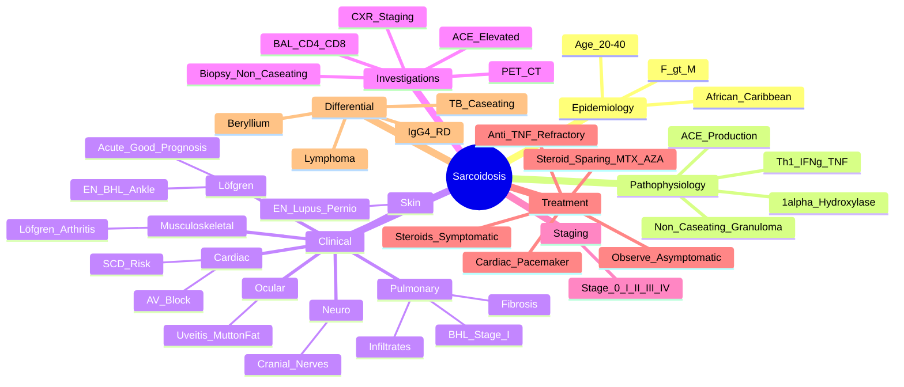

# Sarcoidosis

> [!tip] **FCPS/MRCP Priority: HIGH**
> Sarcoidosis = **multisystem granulomatous disease (non-caseating)**, **bilateral hilar lymphadenopathy (BHL)** hallmark. **Löfgren syndrome** (EN + BHL + arthritis) = acute, good prognosis. **Hypercalcaemia** (↑1,25 vit D). **ACE elevated** (non-specific). **Uveitis + hilar adenopathy** classic.

---

## Learning Objectives
By the end of this note you should be able to:
- [ ] Apply clinical criteria for sarcoidosis diagnosis (clinical + radiological + histological)
- [ ] Recognise **Löfgren syndrome** (EN + BHL + ankle arthritis) — acute, good prognosis
- [ ] Differentiate sarcoidosis from TB (caseating vs non-caseating granulomas), lymphoma, other granulomatous diseases
- [ ] Interpret **ACE levels** (elevated but non-specific) and **hypercalcaemia mechanism** (↑1,25 vit D)
- [ ] Apply organ-specific management: steroids for acute/progressive, steroid-sparing for chronic
- [ ] Recognise organ-threatening manifestations (neurosarcoid, cardiac, pulmonary fibrosis)

---

## 1. Definition & Epidemiology

| Feature | Detail |
|---------|--------|
| **Definition** | **Multisystem granulomatous disease** of unknown aetiology — **non-caseating epithelioid granulomas** in involved organs |
| **Incidence** | 10-40/100,000/year |
| **Prevalence** | 10-40/100,000 |
| **Peak Onset** | **20-40 years** (bimodal: 20-29, 50-60 in women) |
| **Sex Ratio** | **F > M** (1.5:1) |
| **Ethnicity** | **African-Caribbean > Caucasian** (2-3x higher, more severe) |
| **Genetics** | HLA-DRB1*03, BTNL2, ANXA11 |

---

## 2. Aetiology & Pathophysiology

```mermaid
flowchart LR
    A[Genetic Susceptibility\nHLA-DR, BTNL2] --> B[Environmental Trigger\nInfection (Propionibacterium, Mycobacteria), Silica, Mould]
    B --> C[Immune Dysregulation\nTh1 Polarisation\nCD4+ T-cell Activation]
    C --> D[Macrophage Activation\nEpithelioid Cell Formation\nNon-Caseating Granuloma]
    D --> E[Cytokine Release\nIL-2, IFN-γ, TNF-α, IL-12, IL-18]
    E --> F[Multisystem Involvement\nLung, LN, Skin, Eye,\nLiver, Spleen, Heart, CNS,\nBone, Kidney]
```

### Key Pathogenic Features
| Feature | Detail |
|---------|--------|
| **Non-caseating granuloma** | **Epithelioid macrophages** + **multinucleated giant cells** + **CD4+ T-cells** — **no necrosis** (vs TB) |
| **Th1 polarisation** | **IFN-γ, IL-2, TNF-α, IL-12, IL-18** drive granuloma formation |
| **Vitamin D dysregulation** | **Granuloma 1α-hydroxylase** → **↑1,25-(OH)2 Vit D** → **hypercalcaemia/hypercalciuria** |
| **ACE production** | **Granuloma macrophages** produce ACE → **elevated serum ACE** (non-specific) |

---

## 3. Clinical Features by Organ

### Pulmonary (90%+)
| Manifestation | Description |
|---------------|-------------|
| **Bilateral Hilar Lymphadenopathy (BHL)** | **Hallmark** — symmetrical, discrete, "potato nodes"; **paratracheal nodes** (1-2-3 sign) |
| **Pulmonary Infiltrates** | Reticulonodular, mid-upper zone predominance |
| **Fibrosis** | Late — upper lobe predilection, honeycombing, traction bronchiectasis |
| **Pulmonary Hypertension** | Late complication of fibrosis |

### Constitutional
| Feature | Frequency |
|---------|-----------|
| Fatigue, weight loss, low-grade fever, night sweats | 30-50% |

### Cutaneous (25%)
| Lesion | Description |
|--------|-------------|
| **Erythema Nodosum (EN)** | **Tender erythematous nodules** (shins) — **Löfgren syndrome** |
| **Lupus Pernio** | Violaceous plaques (nose, cheeks, ears) — **chronic, fibrotic** |
| **Maculopapular rash** | Trunk, extremities |
| **Scar sarcoidosis** | Old scars become erythematous/raised |

### Ocular (25-50%)
| Manifestation | Detail |
|---------------|--------|
| **Anterior Uveitis** | Most common — **mutton-fat KPs**, iris nodules (Koeppe/Busacca) |
| **Posterior Uveitis** | Retinal vasculitis, periphlebitis, optic disc oedema |
| **Lacrimal Gland Enlargement** | Dry eye, swelling |

### Musculoskeletal (10-15%)
| Feature | Detail |
|---------|--------|
| **Löfgren Arthritis** | **Acute, symmetric ankle/ankle + knee** — **EN + BHL** = **good prognosis** |
| **Chronic Arthritis** | Rare — mimics RA, erosive |

### Neurological (5%)
| Manifestation | Description |
|---------------|-------------|
| **Cranial Nerve Palsies** | **VII > V > VIII** (Bell's palsy most common) |
| **CNS Involvement** | Meningitis, mass lesions (hypothalamic), seizures |
| **Peripheral Neuropathy** | Axonal, small fibre |

### Cardiac (5%)
| Manifestation | Significance |
|---------------|--------------|
| **Conduction Defects** | **AV block** (most common), bundle branch block |
| **Cardiomyopathy** | Heart failure, VT/VF, sudden death risk |
| **Pericarditis** | Rare |

### Renal (5%)
| Feature | Detail |
|---------|--------|
| **Hypercalciuria** | ↑1,25 Vit D → ↑Ca absorption → stones, nephrocalcinosis |
| **Hypercalcaemia** | Severe — confusion, polyuria, renal impairment |
| **Granulomatous Interstitial Nephritis** | Rare |

### Other
| System | Manifestation |
|--------|---------------|
| **Lymphadenopathy** | Generalised (cervical, axillary, epitrochlear) |
| **Splenomegaly** | 10-20% |
| **Hepatic** | Granulomas (often asymptomatic), cholestatic LFTs |

---

## 3. Key Syndromes — **High-Yield**

### Löfgren Syndrome (Acute Sarcoidosis)
| Feature | Detail |
|---------|--------|
| **Triad** | **Erythema Nodosum + Bilateral Hilar Lymphadenopathy + Ankle Arthritis** |
| **Demographics** | Young adults, **F > M**, spring/summer peak |
| **Course** | **Acute**, **self-limiting** (6-24 months), **excellent prognosis** |
| **Labs** | **ACE elevated**, ESR/CRP ↑, **hypercalcaemia rare** |

> [!critical] **Löfgren = EN + BHL + Ankle Arthritis** — **acute, good prognosis**, often resolves without immunosuppression

---

## 4. Investigations

| Test | Role | Typical Finding |
|------|------|-----------------|
| **Chest X-ray** | **Staging** | **Stage 0**: normal; **I**: BHL only; **II**: BHL + infiltrates; **III**: infiltrates only; **IV**: fibrosis |
| **ACE** | **Supportive** | **Elevated in 60%** (active disease) — **non-specific** (also in Gaucher, leprosy, TB, silicosis, hyperthyroidism) |
| **Serum Calcium** | Complication | **Hypercalcaemia** (↑1,25 Vit D), hypercalciuria |
| **25-OH Vit D / 1,25 Vit D** | Pathophysiology | **Normal/low 25-OH Vit D**, **high 1,25 Vit D** (granuloma 1α-hydroxylase) |
| **BAL (Bronchoalveolar Lavage)** | Diagnostic support | **Lymphocytosis** (>20%), **CD4/CD8 >3.5** |
| **Biopsy** | **Gold standard** | **Non-caseating epithelioid granulomas** — **no necrosis** (vs TB) |
| **PET-CT** | Extent assessment | Active granulomatous inflammation (FDG-avid) |
| **HRCT Chest** | Pulmonary detail | Ground-glass, nodules, fibrosis, traction bronchiectasis |
| **ECG / Holter / Echo** | Cardiac screen | Conduction defects, cardiomyopathy |
| **Ophthalmology (Slit-lamp)** | Ocular screen | Anterior uveitis, mutton-fat KPs |

> [!critical] **Biopsy: Non-caseating granuloma = sarcoid**; **Caseating = TB** (but TB can be non-caseating early)

---

## 4. Staging — Chest X-ray (Scadding)

| Stage | Findings | Prognosis |
|-------|----------|-----------|
| **0** | Normal | — |
| **I** | **BHL only** | 70-90% spontaneous remission |
| **II** | **BHL + pulmonary infiltrates** | 40-70% remission |
| **III** | **Pulmonary infiltrates only** | 10-20% remission |
| **IV** | **Pulmonary fibrosis** | **Poor** — irreversible |

---

## 5. Differential Diagnosis

| Condition | Distinguishing Features |
|-----------|------------------------|
| **Tuberculosis** | **Caseating granulomas**, AFB+, PCR+, **TB endemic**, night sweats, weight loss |
| **Lymphoma** | Malignant cells on biopsy, B symptoms, lymphadenopathy asymmetric |
| **IgG4-RD** | **IgG4+ plasma cells**, storiform fibrosis, obliterative phlebitis, **elevated serum IgG4** |
| **Hypersensitivity Pneumonitis** | Exposure history, centrilobular nodules, **lymphocytosis but CD4/CD8 <1** |
| **Chronic Beryllium Disease** | Identical to sarcoid — **BeLPT (Be lymphocyte proliferation test)** |
| **Fungal (Histoplasma, Coccidioides)** | Endemic areas, positive serology/culture, **caseating granulomas** |
| **Granulomatosis with Polyangiitis (GPA)** | **c-ANCA/PR3+**, ENT involvement, necrotising granulomas, renal |

> [!critical] **TB vs Sarcoid**: **Biopsy** — **TB = caseating; Sarcoid = non-caseating** (but early TB can be non-caseating)

---

## 5. Management

```mermaid
flowchart TD
    A[Sarcoidosis Diagnosis] --> B{Asymptomatic / Stage I}
    B -->|Yes| C[**Observe**\nMonitor q3-6mo: CXR, PFT, ACE, Calcium, Ophthalmology]
    B -->|No (Symptomatic/Progressive)| D{Organ Involvement}
    D -->|Pulmonary (symptomatic)| E[**Prednisolone 0.5mg/kg/day**\nTaper over 6-12mo\nMonitor PFT, CXR, Calcium]
    D -->|Ocular (Uveitis)| F[Topical steroids + mydriatics\nSystemic if posterior/refractory]
    D -->|Cardiac / Neurosarcoid| G[**High-dose steroids**\nPulse MP 500-1000mg ×3d\n→ Pred 1mg/kg\n+ Steroid-sparing (MTX, AZA, MMF)]
    D -->|Hypercalcaemia| H[**Pred + Low Ca diet**\nHydration\nKetoconazole (inhibits 1α-hydroxylase)\nBisphosphonates]
    D -->|Skin (Lupus Pernio)| I[**Hydroxychloroquine**\nMTX, Anti-TNF (refractory)]
    E --> J[**Steroid-Sparing**\nMTX 15-25mg/wk (1st line)\nAzathioprine 2mg/kg\nMethotrexate\nAnti-TNF (Infliximab/Adalimumab) if refractory\nJAK inhibitors (emerging)]
```

### Treatment by Organ

| Organ | 1st Line | Refractory |
|-------|----------|------------|
| **Pulmonary** | Pred 0.5mg/kg/day (taper 6-12mo) | MTX, AZA, MMF, **Anti-TNF (infliximab/adalimumab)** |
| **Ocular** | Topical steroids + cycloplegics | Systemic steroids, MTX, **Anti-TNF (infliximab)** |
| **Cardiac** | **High-dose steroids** (pulse MP → pred 1mg/kg) + **immunosuppression** (MTX, AZA, MMF) | Pacemaker/ICD for conduction defects |
| **Neurosarcoid** | Pulse MP + Pred 1mg/kg + **CYC/MTX/MM** | Anti-TNF, RTX |
| **Hypercalcaemia** | **Pred + hydration + low Ca diet** + **Ketoconazole** (inhibits 1α-hydroxylase) | Bisphosphonates |
| **Skin (Lupus Pernio)** | **Hydroxychloroquine** | MTX, **Anti-TNF** |

> [!important] **Many patients (Stage I/II) spontaneously remit** — observe asymptomatic
> **Steroid-sparing**: **Methotrexate 15-25mg/wk** = 1st line; **Azathioprine 2mg/kg**; **MMF**; **Anti-TNF (infliximab/adalimumab)** for refractory

---

## 6. Complications

| Complication | Significance |
|--------------|--------------|
| **Pulmonary Fibrosis** | Stage IV — irreversible, restrictive physiology, PH |
| **Pulmonary Hypertension** | Late — elevated RVSP, cor pulmonale |
| **Cardiac** | Conduction defects, VT/VF, sudden death |
| **Neurosarcoid** | Cranial nerve palsies, CNS mass lesions |
| **Renal Stones/Failure** | Hypercalciuria, nephrocalcinosis |
| **Blindness** | Untreated uveitis, optic nerve compression |

---

## 6. FCPS/MRCP High-Yield Summary

| Topic | Key Points |
|-------|------------|
| **Hallmark** | **Bilateral Hilar Lymphadenopathy (BHL)** — symmetrical, "potato nodes", Stage I |
| **Löfgren Syndrome** | **EN + BHL + Ankle Arthritis** — acute, young F, **excellent prognosis** |
| **Hypercalcaemia** | **Granuloma 1α-hydroxylase** → ↑1,25 Vit D → **hypercalcaemia/hypercalciuria** |
| **ACE** | Elevated 60% (active disease) — **non-specific** (TB, leprosy, Gaucher, hyperthyroidism) |
| **Biopsy** | **Non-caseating granulomas** — **no necrosis** (vs TB = caseating) |
| **Staging (Scadding)** | 0=normal, I=BHL, II=BHL+infiltrates, III=infiltrates, IV=fibrosis |
| **Treatment** | **Asymptomatic Stage I/II = observe**; Symptomatic = **pred 0.5mg/kg** → **steroid-sparing (MTX 1st)**; **Refractory = Anti-TNF** |
| **Cardiac** | **Conduction defects (AV block)** — most common; screen with ECG |
| **Ocular** | **Anterior uveitis** — mutton-fat KPs, iris nodules; **slit-lamp screen** |
| **Differential TB** | **Non-caseating = sarcoid**; **Caseating = TB** (but early TB can be non-caseating) |
| **IgG4-RD** | **Serum IgG4 >135**, storiform fibrosis, obliterative phlebitis — **pancreas, salivary (Mikulicz), retroperitoneal fibrosis** |

---

## 7. Viva Questions (MRCP PACES / FCPS)

| Question | Expected Answer |
|----------|----------------|
| "A 25yo woman presents with bilateral hilar lymphadenopathy, erythema nodosum, and ankle arthritis. Diagnosis?" | **Löfgren Syndrome (acute sarcoidosis)** — triad of EN + BHL + ankle arthritis. Excellent prognosis, often self-limiting. |
| "What is the histological hallmark of sarcoidosis?" | **Non-caseating epithelioid granulomas** with multinucleated giant cells — **no necrosis** (vs TB which has caseating necrosis). |
| "How does hypercalcaemia occur in sarcoidosis?" | **Granuloma macrophages express 1α-hydroxylase** → convert 25-OH Vit D to **active 1,25-(OH)2 Vit D** → ↑ intestinal Ca absorption. |
| "A patient with sarcoidosis has complete heart block. Management?" | **High-dose IV methylprednisolone 1000mg ×3 days** → pred 1mg/kg taper + **permanent pacemaker** + steroid-sparing (AZA/MTX). |
| "How do you differentiate sarcoidosis from TB on biopsy?" | **Sarcoid = non-caseating granulomas** (no necrosis); **TB = caseating granulomas** (central necrosis). Culture/PCR for TB definitive. |
| "What is the treatment for Löfgren syndrome?" | **Often self-limiting** — NSAIDs for arthritis/EN; **observe**; steroids only if severe/prolonged. **Excellent prognosis** (90% remission). |
| "What are the cardiac manifestations of sarcoidosis?" | **Conduction defects (AV block)** most common; cardiomyopathy, VT/VF, pericarditis. **ECG/Holter/echo screen annually**. |
| "How do you treat neurosarcoidosis?" | **Pulse IV MP 1g ×3d → pred 1mg/kg** + **CYC/MTX/MMF**; refractory → **anti-TNF (infliximab)** or **RTX**. |
| "How does IgG4-related disease differ from sarcoidosis?" | **IgG4-RD: serum IgG4 >135, storiform fibrosis, obliterative phlebitis, IgG4/IgG >40%**; organs: pancreas (AIP), salivary (Mikulicz), retroperitoneal fibrosis. |

---

## 9. Confusions & Mnemonics

| Confusion | Clarification |
|-----------|---------------|
| **Sarcoid vs TB Granuloma** | **Sarcoid = non-caseating** (no necrosis); **TB = caseating** (central necrosis). Early TB can be non-caseating — need AFB/PCR. |
| **ACE in Sarcoidosis** | **Elevated in 60%** active disease — **NOT specific** (also elevated in TB, leprosy, Gaucher, silicosis, hyperthyroidism). |
| **Löfgren vs Chronic Sarcoid** | Löfgren = **acute, EN + BHL + ankle arthritis**, excellent prognosis, self-limiting. Chronic = insidious, progressive, fibrosis. |
| **Hypercalcaemia Mechanism** | **Granuloma 1α-hydroxylase** → ↑1,25 Vit D → ↑Ca absorption. **Not PTH-mediated**. |
| **Cardiac Sarcoid** | **AV block most common** — risk of sudden death. **ECG/Holter/Echo screen**. Pacemaker often needed. |
| **IgG4-RD vs Sarcoid** | **IgG4-RD: serum IgG4 >135, storiform fibrosis, obliterative phlebitis, IgG4/IgG >40%**; organs: pancreas (AIP), salivary (Mikulicz), retroperitoneal fibrosis, kidney. |

**Mnemonic: Sarcoidosis = "SARCOID"**
- **S** (BHL)
- **A** (ACE elevated)
- **R** (Rash - EN, lupus pernio)
- **C** (Calcium - hypercalcaemia)
- **O** (Ocular - uveitis)
- **I** (Infiltrates - pulmonary)
- **D** (Disease - multisystem)

**Mnemonic: Löfgren = "EN + BHL + ANKLE"**
- **E**rythema **N**odosum
- **B**ilateral **H**ilar **L**ymphadenopathy
- **A**nkle **A**rthritis = **Good Prognosis**

**Mnemonic: Chest X-ray Stages = "0-I-II-III-IV"**
- **0** = Normal
- **I** = BHL only
- **II** = BHL + Infiltrates
- **III** = Infiltrates only
- **IV** = Fibrosis (poor prognosis)

**Mnemonic: Differential = "T-L-I-F"**
- **T**B (caseating)
- **L**ymphoma (malignant cells)
- **I**gG4-RD (IgG4+, storiform)
- **F**ungal (caseating, endemic)

**Mnemonic: Cardiac Sarcoid = "AV BLOCK"**
- **A**V **B**lock = most common
- **C**ardiomyopathy
- **S**udden death risk

---

## 10. Mind Map



---

## 12. One-Page Revision Card

| Domain | Key Points |
|--------|------------|
| **Hallmark** | **Bilateral Hilar Lymphadenopathy (BHL)** — symmetrical, discrete |
| **Löfgren Syndrome** | **EN + BHL + Ankle Arthritis** — acute, young F, **excellent prognosis** |
| **Hypercalcaemia** | **Granuloma 1α-hydroxylase** → ↑1,25 Vit D → ↑Ca absorption |
| **ACE** | Elevated 60% — **non-specific** (TB, leprosy, Gaucher, silicosis) |
| **Biopsy** | **Non-caseating granulomas** — **vs TB = caseating** |
| **Staging** | I=BHL, II=BHL+infiltrates, III=infiltrates, IV=fibrosis |
| **Treatment** | Asymptomatic = observe; Symptomatic = pred 0.5mg/kg → MTN/AZA; Refractory = anti-TNF |
| **Cardiac** | **AV block** most common; pacemaker + steroids + immunosuppression |
| **Ocular** | Anterior uveitis, mutton-fat KPs, iris nodules — slit-lamp screen |
| **Löfgren** | EN + BHL + ankle arthritis — **acute, good prognosis** |

---

## 12. Spaced Repetition Trackers

| Review Interval | Date Completed | Confidence (1-5) | Notes |
|-----------------|----------------|------------------|-------|
| 24 hours | | | |
| 7 days | | | |
| 15 days | | | |
| 30 days | | | |
| 90 days | | | |

---

## 13. Self-Test Scorecard

| Section | Score /5 | Last Attempt |
|--------|----------|--------------|
| Löfgren Syndrome Recognition | | |
| TB vs Sarcoid Biopsy | | |
| Hypercalcaemia Mechanism | | |
| Staging & Prognosis | | |
| Organ-Specific Management | | |
| Cardiac/Neuro Manifestations | | |
| Viva Questions | | |

---

## Local Navigation
- **Parent Heading**: [[../Polymyalgia Rheumatica and Related Disorders|Polymyalgia Rheumatica and Related Disorders]]
- **Parent Topic Group**: [[Other granulomatous conditions]]
- **Chapter Map**: [[../Davidson Chapter 26 - Rheumatology Hierarchy|Rheumatology Hierarchy]]
- **Chapter MOC**: [[../Rheumatology MOC|Rheumatology MOC]]
- **Drug Reference**: [[../../Clinical Approach to Musculoskeletal Disease/Drugs in rheumatology|Drugs in rheumatology]]
- **Related**: [[IgG4-related disease]] · [[Drugs in rheumatology]] · [[Tuberculous arthritis]]
---

> Auto-generated study sections for "Polymyalgia Rheumatica and Related Disorders" — Ch 25: Rheumatology & Bone Disease.

## Flashcards (32 generated)

- Q: What is the definition of Polymyalgia Rheumatica and Related Disorders?
  A: Sarcoidosis = multisystem granulomatous disease (non-caseating), bilateral hilar lymphadenopathy (BHL) hallmark.
- Q: What is Non-caseating granuloma of Polymyalgia Rheumatica and Related Disorders?
  A: Epithelioid macrophages + multinucleated giant cells + CD4+ T-cells — no necrosis (vs TB)
- Q: What is Th1 polarisation of Polymyalgia Rheumatica and Related Disorders?
  A: IFN-γ, IL-2, TNF-α, IL-12, IL-18 drive granuloma formation
- Q: What is Vitamin D dysregulation of Polymyalgia Rheumatica and Related Disorders?
  A: Granuloma 1α-hydroxylase → ↑1,25-(OH)2 Vit D → hypercalcaemia/hypercalciuria
- Q: What is ACE production of Polymyalgia Rheumatica and Related Disorders?
  A: Granuloma macrophages produce ACE → elevated serum ACE (non-specific)
- Q: What is Löfgren Arthritis of Polymyalgia Rheumatica and Related Disorders?
  A: Acute, symmetric ankle/ankle + knee — EN + BHL = good prognosis
- Q: What is Chronic Arthritis of Polymyalgia Rheumatica and Related Disorders?
  A: Rare — mimics RA, erosive
- Q: What is Triad of Polymyalgia Rheumatica and Related Disorders?
  A: Erythema Nodosum + Bilateral Hilar Lymphadenopathy + Ankle Arthritis
- Q: What is Demographics of Polymyalgia Rheumatica and Related Disorders?
  A: Young adults, F > M, spring/summer peak
- Q: What is Course of Polymyalgia Rheumatica and Related Disorders?
  A: Acute, self-limiting (6-24 months), excellent prognosis
- Q: What is Labs of Polymyalgia Rheumatica and Related Disorders?
  A: ACE elevated, ESR/CRP ↑, hypercalcaemia rare
- Q: What is Non-caseating granuloma of Polymyalgia Rheumatica and Related Disorders?
  A: Epithelioid macrophages + multinucleated giant cells + CD4+ T-cells — no necrosis (vs TB)
- Q: What is Th1 polarisation of Polymyalgia Rheumatica and Related Disorders?
  A: IFN-γ, IL-2, TNF-α, IL-12, IL-18 drive granuloma formation
- Q: What is Vitamin D dysregulation of Polymyalgia Rheumatica and Related Disorders?
  A: Granuloma 1α-hydroxylase → ↑1,25-(OH)2 Vit D → hypercalcaemia/hypercalciuria
- Q: What is ACE production of Polymyalgia Rheumatica and Related Disorders?
  A: Granuloma macrophages produce ACE → elevated serum ACE (non-specific)
- Q: What is Hypercalciuria of Polymyalgia Rheumatica and Related Disorders?
  A: ↑1,25 Vit D → ↑Ca absorption → stones, nephrocalcinosis
- Q: What is Hypercalcaemia of Polymyalgia Rheumatica and Related Disorders?
  A: Severe — confusion, polyuria, renal impairment
- Q: What is Triad of Polymyalgia Rheumatica and Related Disorders?
  A: Erythema Nodosum + Bilateral Hilar Lymphadenopathy + Ankle Arthritis
- Q: What is Demographics of Polymyalgia Rheumatica and Related Disorders?
  A: Young adults, F > M, spring/summer peak
- Q: What is Course of Polymyalgia Rheumatica and Related Disorders?
  A: Acute, self-limiting (6-24 months), excellent prognosis
- Q: What is Labs of Polymyalgia Rheumatica and Related Disorders?
  A: ACE elevated, ESR/CRP ↑, hypercalcaemia rare
- Q: What is Hallmark of Polymyalgia Rheumatica and Related Disorders?
  A: Bilateral Hilar Lymphadenopathy (BHL) — symmetrical, "potato nodes", Stage I
- Q: What is Löfgren Syndrome of Polymyalgia Rheumatica and Related Disorders?
  A: EN + BHL + Ankle Arthritis — acute, young F, excellent prognosis
- Q: What is Hypercalcaemia of Polymyalgia Rheumatica and Related Disorders?
  A: Granuloma 1α-hydroxylase → ↑1,25 Vit D → hypercalcaemia/hypercalciuria
- Q: What is ACE of Polymyalgia Rheumatica and Related Disorders?
  A: Elevated 60% (active disease) — non-specific (TB, leprosy, Gaucher, hyperthyroidism)
- Q: What is Biopsy of Polymyalgia Rheumatica and Related Disorders?
  A: Non-caseating granulomas — no necrosis (vs TB = caseating)
- Q: What is Staging (Scadding) of Polymyalgia Rheumatica and Related Disorders?
  A: 0=normal, I=BHL, II=BHL+infiltrates, III=infiltrates, IV=fibrosis
- Q: How is Polymyalgia Rheumatica and Related Disorders managed?
  A: Asymptomatic Stage I/II = observe; Symptomatic = pred 0.5mg/kg → steroid-sparing (MTX 1st); Refractory = Anti-TNF
- Q: What is Cardiac of Polymyalgia Rheumatica and Related Disorders?
  A: Conduction defects (AV block) — most common; screen with ECG
- Q: What is Ocular of Polymyalgia Rheumatica and Related Disorders?
  A: Anterior uveitis — mutton-fat KPs, iris nodules; slit-lamp screen
- Q: What is Differential TB of Polymyalgia Rheumatica and Related Disorders?
  A: Non-caseating = sarcoid; Caseating = TB (but early TB can be non-caseating)
- Q: What is IgG4-RD of Polymyalgia Rheumatica and Related Disorders?
  A: Serum IgG4 >135, storiform fibrosis, obliterative phlebitis — pancreas, salivary (Mikulicz), retroperitoneal fibrosis

## MCQs (1 generated)

1. **Which of the following best describes Polymyalgia Rheumatica and Related Disorders?**
   A. **Sarcoidosis = multisystem granulomatous disease (non-caseating), bilateral hilar lymphadenopathy (BHL) hallmark.**
   B. An unrelated condition not matching the clinical picture of Polymyalgia Rheumatica and Related Disorders
   C. A complication seen late in the disease course of Polymyalgia Rheumatica and Related Disorders
   D. A condition that mimics Polymyalgia Rheumatica and Related Disorders but has a different underlying cause

## SBA Questions (1 generated)

1. A patient with suspected Polymyalgia Rheumatica and Related Disorders presents with: Peak Onset — 20-40 years (bimodal: 20-29, 50-60 in women); Sex Ratio — F > M (1.5:1); Ethnicity — African-Caribbean > Caucasian (2-3x higher, more severe). What is the most likely diagnosis?
   A. **Polymyalgia Rheumatica and Related Disorders**
   B. A condition that mimics Polymyalgia Rheumatica and Related Disorders but is not the same entity
   C. A complication of Polymyalgia Rheumatica and Related Disorders rather than the primary diagnosis
   D. An unrelated condition in the same clinical category as Polymyalgia Rheumatica and Related Disorders

## PasTest Scenario SBAs (Clinical Vignettes)

> **Auto-generated PasTest/Mediscope-style scenario SBAs** grounded in the authored source. Each scenario tests a real clinical fact (triad, specific sign, contraindication, trial, first-line Rx) extracted from the topic. *Source: Ch 25: Rheumatology — Other granulomatous conditions*

**Q1.** Which of the following features is most specific or characteristic of Other granulomatous conditions?

  - **A.** Bilateral Hilar Lymphadenopathy
  - **B.** A feature common to many acute inflammatory conditions
  - **C.** A non-specific sign that does not localise the diagnosis
  - **D.** An investigation finding rather than a clinical feature

  > **Answer: A** — Bilateral Hilar Lymphadenopathy
  >
  > *Source:* ## Pulmonary (90%+)
| Manifestation | Description |
|---------------|-------------|
| **Bilateral Hilar Lymphadenopathy (BHL)** | **Hallmark** — symmetrical, discrete, "potato nodes"; **paratracheal n

**Q2.** What is the most appropriate first-line therapy for Other granulomatous conditions?

  - **A.** Cardiac + High-dose steroids + immunosuppression
  - **B.** An advanced/surgical therapy reserved for refractory disease
  - **C.** Symptomatic treatment only, no disease-modifying therapy
  - **D.** Empiric broad-spectrum therapy without specific indication

  > **Answer: A** — Cardiac + High-dose steroids + immunosuppression
  >
  > *Source:* **Cardiac**   **High-dose steroids** (pulse MP → pred 1mg/kg) + **immunosuppression** (MTX, AZA, MMF)   Pacemaker/ICD for conduction defects

