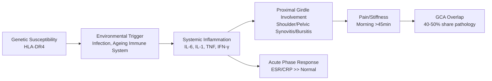
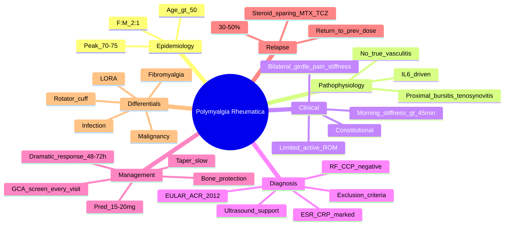

# Polymyalgia Rheumatica (PMR)

> [!tip] **FCPS/MRCP Priority: CRITICAL**
> PMR = **bilateral shoulder/pelvic girdle pain + stiffness in elderly** + **markedly elevated ESR/CRP** + **dramatic steroid response**. Must always screen for GCA overlap (40-50%). Guaranteed viva/SBA topic.

---

## Learning Objectives
By the end of this note you should be able to:
- [ ] Apply EULAR/ACR 2012 classification criteria for PMR
- [ ] Differentiate PMR from mimics (late-onset RA, rotator cuff, fibromyalgia, malignancy, infections)
- [ ] Initiate and taper glucocorticoids with appropriate monitoring
- [ ] Screen for and manage GCA overlap
- [ ] Recognise red flags for alternative diagnoses

---

## 1. Definition & Epidemiology

| Feature | Detail |
|---------|--------|
| **Definition** | Inflammatory condition causing **bilateral shoulder and pelvic girdle pain/stiffness** in adults >50, with **marked acute phase response** and **rapid response to low-dose glucocorticoids** |
| **Incidence** | 50-60/100,000/year >50y |
| **Peak Age** | **>50 years** (mean 70-75) |
| **Sex Ratio** | **F:M = 2:1** |
| **Ethnicity** | Caucasian > Asian > African |
| **Genetics** | HLA-DR4 association (shared with RA) |

---

## 2. Aetiology & Pathophysiology



### Key Pathogenic Features
| Feature | Detail |
|---------|--------|
| **IL-6 driven** | Central cytokine → explains tocilizumab efficacy |
| **Proximal synovitis/bursitis** | Subdeltoid/subacromial bursitis, biceps tenosynovitis, hip trochanteric bursitis (US/MRI) |
| **No true vasculitis** | Distinct from GCA (though overlap exists) |
| **Acute phase response** | IL-6 → hepatic CRP/fibrinogen → **ESR/CRP markedly elevated** |

---

## 3. Clinical Features

| Feature | Description |
|---------|-------------|
| **Core** | **Bilateral shoulder + pelvic girdle pain/stiffness**, worse morning, **>45 minutes duration** |
| **Onset** | Subacute (weeks-months) or acute |
| **Functional Impact** | Difficulty dressing, combing hair, rising from chair, climbing stairs |
| **Constitutional** | Fatigue, low-grade fever, weight loss, anorexia, malaise (40-50%) |
| **Peripheral** | Mild distal joint swelling (wrists, MCPs, knees) in 10-30% — **not true synovitis** |
| **Examination** | **Limited active ROM** (pain) > passive ROM; **no true synovitis**; tenderness over girdles |

> [!critical] **PMR vs Late-Onset RA (LORA)**
> - **PMR**: girdle only, no synovitis, seronegative (RF/CCP -ve), dramatic steroid response (15-20mg)
> - **LORA**: true synovitis (MCP/PIP/wrist), may be seropositive, needs higher steroids/csDMARD

---

## 4. Classification Criteria — EULAR/ACR 2012

### Clinical Criteria (Ultrasound Not Required)
| Criterion | Score |
|-----------|-------|
| Morning stiffness >45 minutes | 2 |
| Hip pain/limited ROM | 1 |
| Absence of RF **AND** absence of anti-CCP | 2 |
| Absence of other joint involvement | 1 |
| **Total ≥4 = PMR** | |

### With Ultrasound (At least 1 Shoulder + 1 Hip)
| Criterion | Score |
|-----------|-------|
| Morning stiffness >45 minutes | 2 |
| Hip pain/limited ROM | 1 |
| Absence of RF **AND** absence of anti-CCP | 2 |
| Absence of other joint involvement | 1 |
| **Ultrasound**: Bilateral subdeltoid/subacromial bursitis **OR** biceps tenosynovitis **OR** hip trochanteric bursitis | 1 |
| **Total ≥5 = PMR** | |

> [!important] **Exclusion Criteria (Must All Be Absent)**
> - Other inflammatory arthritis (RA, SpA, PsA, crystal, infection)
> - Malignancy
> - Infection (TB, endocarditis)
> - Other causes of girdle pain (rotator cuff, cervical myelopathy, fibromyalgia, hypothyroidism, statin myopathy)

---

## 5. Diagnosis — Investigations

| Test | Typical Finding in PMR | Role |
|------|------------------------|------|
| **ESR** | **Markedly elevated** (often >50, frequently >100 mm/hr) | **Primary marker**; supports diagnosis, monitors response |
| **CRP** | **Markedly elevated** (often >50-100 mg/L) | More sensitive than ESR; better for monitoring |
| **FBC** | Normochromic normocytic anaemia, **thrombocytosis** (reactive) | Exclude other causes |
| **RF / Anti-CCP** | **Negative** (critical for criteria) | Rule out RA |
| **CK** | Normal | Exclude myositis/myopathy |
| **Creatinine/LFT** | Normal | Baseline for steroids |
| **Bone profile** | Normal (ALP may be mildly elevated) | Exclude osteomalacia/Paget's |
| **Imaging** | US: bilateral subdeltoid/subacromial bursitis, biceps tenosynovitis, hip trochanteric bursitis | Supports diagnosis if clinical uncertainty |
| **Temporal artery biopsy** | Only if GCA symptoms | Rule out GCA |

> [!warning] **Normal ESR/CRP Does NOT Exclude PMR**
> - ~5-10% have normal ESR/CRP (especially on steroids/NSAIDs)
> - Clinical picture + exclusion of mimics + steroid response = diagnosis

---

## 6. Management

```mermaid
flowchart TD
    A[Suspected PMR] --> B[Exclude Mimics:\nRF/CCP, CK, CXR, urine, age-appropriate cancer screen]
    B --> C[Screen for GCA Symptoms:\nHeadache, jaw claudication, visual, scalp tenderness]
    C --> D{GCA Symptoms?}
    D -->|Yes| E[Manage as GCA:\nPred 60-100mg + urgent TAB]
    D -->|No| F[Start Prednisolone 15-20mg daily]
    F --> G[Review 1-2 weeks:\nDramatic response expected]
    G -->{Response?}
    G -->|Yes| H[Confirm PMR]
    G -->|No| I[Reconsider Diagnosis:\nLORA, malignancy, infection, GCA]
    H --> J[Taper: 2.5mg q2-4wk to 10mg → 1mg/month]
    J --> K[Monitor ESR/CRP + Symptoms q4-8wk]
    K --> L{Flare?}
    L -->|Yes| M[Return to previous effective dose → slower taper]
    L -->|No| N[Continue taper to stop]
```

### Glucocorticoid Regimen
| Phase | Dose | Duration | Monitoring |
|-------|------|----------|------------|
| **Initial** | **Prednisolone 15-20mg daily** | 2-4 weeks | **Dramatic response within 48-72h = diagnostic** |
| **Taper to 10mg** | ↓ 2.5mg every 2-4 weeks | ~3-6 months | ESR/CRP, symptoms q4-8wk |
| **Taper <10mg** | ↓ 1mg every 4-8 weeks | ~1-2 years | Slower taper; flares common |
| **Maintenance** | Lowest effective dose | Until remission | Average treatment 1.5-2.5 years |

> [!critical] **Steroid Response = Diagnostic**
> - **No response in 1 week → RECONSIDER DIAGNOSIS** (LORA, malignancy, infection, GCA)
> - **Dramatic response (pain/stiffness gone in 48-72h) = supports PMR**

### GCA Screening (Every Visit)
- **New headache?**
- **Jaw claudication?**
- **Visual symptoms (amaurosis fugax, diplopia, blur)?**
- **Scalp tenderness?**
- **Temporal artery abnormalities (tender, pulseless, nodular)?**

### Bone Protection
- **All patients on >7.5mg pred >3 months**: Calcium 1g + Vitamin D 800-1000 IU + **Bisphosphonate** (alendronate 70mg weekly)

---

## 7. Differential Diagnosis

| Mimic | Distinguishing Features |
|-------|------------------------|
| **Late-Onset RA** | True synovitis (MCP/PIP/wrist), +RF/CCP in 60-70%, needs csDMARD |
| **Rotator Cuff Pathology** | Unilateral/bilateral, mechanical pain, normal ESR/CRP, US shows tear |
| **Cervical Myelopathy** | Upper motor neuron signs, sensory levels, normal ESR/CRP, MRI cervical spine |
| **Fibromyalgia** | Widespread pain, fatigue, sleep disturbance, **normal ESR/CRP, no girdle pattern** |
| **Malignancy** | Weight loss, night sweats, abnormal bloods, age-appropriate screen needed |
| **Hypothyroidism** | Elevated TSH, normal ESR/CRP, myxedema, slow relaxation reflexes |
| **Statin Myopathy** | Proximal weakness, elevated CK, temporal relation to statin |
| **Infections (TB, Endocarditis)** | Fever, raised inflammatory markers, positive cultures, imaging findings |

---

## 8. Relapse & Flare Management

| Scenario | Action |
|----------|--------|
| **Relapse during taper** | Increase to **previous effective dose** (not necessarily initial dose) → hold 4-8 weeks → slower taper |
| **Relapse after stop** | Restart prednisolone 10-15mg daily → taper again |
| **Frequent relapses** | Consider **steroid-sparing**: MTX (evidence limited), tocilizumab (emerging), azathioprine |

> [!important] **Relapse Rate: 30-50%**
> - Most during taper <10mg
> - Risk factors: high initial ESR/CRP, rapid initial taper, no bone protection

---

## 9. FCPS/MRCP High-Yield Summary

| Topic | Key Points |
|-------|------------|
| **Core Triad** | Age >50 + bilateral girdle pain/stiffness >45min AM + markedly elevated ESR/CRP |
| **Diagnostic Response** | **Pred 15-20mg → dramatic improvement in 48-72h** |
| **EULAR/ACR 2012** | ≥4/6 clinical (≥5/7 with US); exclusion criteria mandatory |
| **GCA Overlap** | **40-50% GCA have PMR; 10-20% PMR have GCA** — screen every visit |
| **Taper** | 2.5mg q2-4wk to 10mg → 1mg/month; monitor ESR/CRP + symptoms |
| **Bone Protection** | Ca/Vit D + bisphosphonate (all >7.5mg pred >3mo) |
| **No Response in 1 Week** | Reconsider: LORA, malignancy, infection, GCA |
| **Relapse** | 30-50%; return to previous effective dose |
| **Exclusion** | RF/CCP negative, no other joint involvement, no malignancy/infection |

---

## 10. Viva Questions (MRCP PACES / FCPS)

| Question | Expected Answer |
|----------|----------------|
| "A 72yo woman has 6 weeks of bilateral shoulder/hip girdle pain with morning stiffness 2 hours. ESR 85, CRP 95. RF/CCP negative. What is the diagnosis and initial management?" | **PMR**. Start **prednisolone 15-20mg daily**. Expect dramatic response in 48-72h. Screen for GCA. Bone protection (Ca/Vit D + bisphosphonate). Taper 2.5mg q2-4wk to 10mg then 1mg/month. |
| "What are the EULAR/ACR 2012 criteria for PMR?" | Clinical: morning stiffness >45min (2), hip pain/limited ROM (1), absence of RF/CCP (2), absence of other joint involvement (1). **≥4 = PMR**. With US: add bilateral bursitis/tenosynovitis (1), **≥5 = PMR**. Exclusion criteria must be absent. |
| "How do you differentiate PMR from late-onset RA?" | PMR: girdle only, no true synovitis, seronegative, dramatic response to 15-20mg pred. LORA: true synovitis (MCP/PIP/wrist), often seropositive, needs csDMARD. |
| "A PMR patient on pred 10mg develops new headache and jaw claudication. What do you do?" | **Suspect GCA**. **Increase pred to 60mg daily urgently**. Arrange **temporal artery biopsy** (do not delay steroids). Aspirin 75mg. Urgent ophthalmology if visual symptoms. |
| "What is the steroid taper regimen for PMR?" | 15-20mg daily → reduce 2.5mg every 2-4 weeks to 10mg → then 1mg every 4-8 weeks. Monitor ESR/CRP and symptoms each step. Flares = return to previous effective dose. |
| "How long does PMR treatment typically last?" | Average **1.5-2.5 years**. 30-50% relapse (mostly <10mg). |
| "What bone protection for a 75yo on pred 15mg for PMR?" | **Calcium 1g + Vitamin D 800-1000 IU daily + alendronate 70mg weekly** (all patients >7.5mg pred >3 months). |

---

## 11. Confusions & Mnemonics

| Confusion | Clarification |
|-----------|---------------|
| **PMR vs LORA** | PMR = girdle only, seronegative, dramatic low-dose steroid response. LORA = true synovitis, often seropositive, needs csDMARD. |
| **PMR vs GCA** | PMR = girdle pain/stiffness. GCA = headache, jaw claudication, visual symptoms. **Overlap 40-50%**. |
| **Normal ESR in PMR** | ~5-10% have normal ESR/CRP (especially if recently on steroids/NSAIDs). Clinical picture + exclusion + steroid response = diagnosis. |
| **Taper Speed** | **Slow taper <10mg** (1mg/month) — most relapses occur here. Rushing = relapse. |
| **Steroid Response** | **No response in 1 week = NOT PMR**. Reconsider LORA, malignancy, infection, GCA. |

**Mnemonic: PMR Core = "GIRDLE"**
- **G**irdle pain (shoulder + hip)
- **I**nflammatory markers (ESR/CRP ↑↑)
- **R**esponse to steroids (dramatic 48-72h)
- **D**uration of stiffness >45min
- **L**ate onset (>50)
- **E**xclusion of mimics (RF/CCP -, no other joints)

**Mnemonic: EULAR/ACR = "M-H-A-A" (+US = "B")**
- **M**orning stiffness >45min (2)
- **H**ip pain/limited ROM (1)
- **A**bsence of RF/CCP (2)
- **A**bsence of other joint involvement (1)
- **B**ursitis bilateral on US (1)

**Mnemonic: GCA Screen = "H-J-V-S-T"**
- **H**eadache
- **J**aw claudication
- **V**isual symptoms
- **S**calp tenderness
- **T**emporal artery abnormality

---

## 12. Mind Map



---

## 13. One-Page Revision Card

| Domain | Key Points |
|--------|------------|
| **Demographics** | >50y (mean 70-75), F:M 2:1, Caucasian |
| **Core** | Bilateral shoulder/hip girdle pain + stiffness **>45min AM** |
| **Labs** | **ESR/CRP markedly elevated** (often >50/100); **RF/CCP negative** |
| **Diagnosis** | EULAR/ACR 2012: ≥4 clinical (≥5 with US); dramatic steroid response |
| **Initial Rx** | **Prednisolone 15-20mg daily** → response in 48-72h (diagnostic) |
| **Taper** | 2.5mg q2-4wk to 10mg → 1mg/month; monitor ESR/CRP + symptoms |
| **GCA Overlap** | **40-50% GCA have PMR; 10-20% PMR have GCA** — screen every visit |
| **Bone Protection** | Ca 1g + Vit D 800-1000 IU + bisphosphonate (all >7.5mg pred >3mo) |
| **No Response 1 Week** | Reconsider LORA, malignancy, infection, GCA |
| **Relapse** | 30-50%; return to previous effective dose; slower taper |

---

## 14. Spaced Repetition Trackers

| Review Interval | Date Completed | Confidence (1-5) | Notes |
|-----------------|----------------|------------------|-------|
| 24 hours | | | |
| 7 days | | | |
| 15 days | | | |
| 30 days | | | |
| 90 days | | | |

---

## 15. Self-Test Scorecard

| Section | Score /5 | Last Attempt |
|---------|----------|--------------|
| EULAR/ACR Criteria Application | | |
| PMR vs LORA Differentiation | | |
| Steroid Initiation & Taper | | |
| GCA Screening | | |
| Bone Protection | | |
| Relapse Management | | |
| Viva Questions | | |

---

## Local Navigation
- **Parent Heading**: [[../Polymyalgia Rheumatica and Related Disorders|Polymyalgia Rheumatica and Related Disorders]]
- **Parent Topic Group**: [[PMR and GCA]]
- **Cross-Reference**: [[../../Vasculitis/Giant cell arteritis (temporal arteritis)|Vasculitis/GCA]]
- **Chapter Map**: [[../Davidson Chapter 26 - Rheumatology Hierarchy|Rheumatology Hierarchy]]
- **Chapter MOC**: [[../Rheumatology MOC|Rheumatology MOC]]
- **Drug Reference**: [[../../Clinical Approach to Musculoskeletal Disease/Drugs in rheumatology|Drugs in rheumatology]]
- **Investigation Reference**: [[../../Clinical Approach to Musculoskeletal Disease/Investigations in rheumatology|Investigations in rheumatology]]