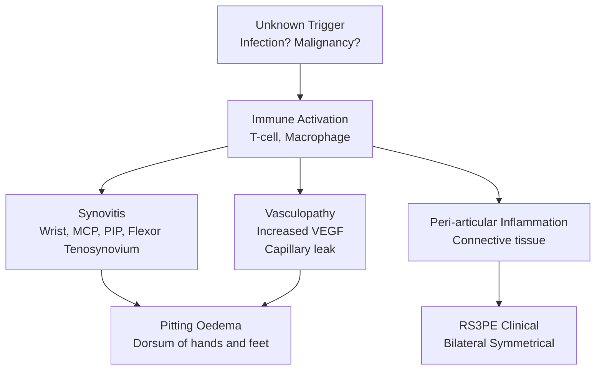
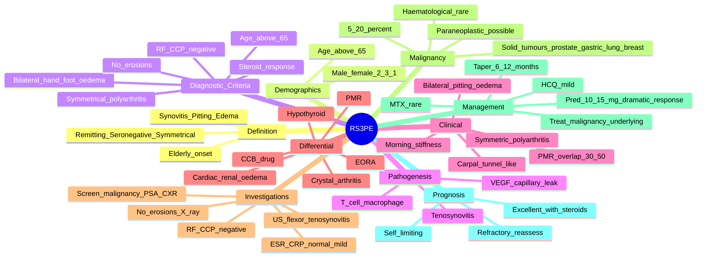

# RS3PE Syndrome

> [!tip] **FCPS/MRCP Priority: MEDIUM**
> RS3PE = **Remitting Seronegative Symmetrical Synovitis with Pitting Oedema** — a **rare but distinct** inflammatory condition of **elderly men >65y**. Must know: **bilateral pitting oedema of hands and feet** (pathognomonic), **negative RF/CCP, normal ESR/CRP usually, no bony erosions**, association with **malignancy (5-20%)** and **PMR overlap**, and **excellent response to low-dose steroids**.

---

## Learning Objectives
By the end of this note you should be able to:
- [ ] Define RS3PE and its classic acronym
- [ ] Recognise **bilateral pitting oedema of hands and feet** as the cardinal feature
- [ ] Apply **diagnostic criteria** (Olivé criteria)
- [ ] Differentiate from **PMR, elderly-onset RA, oedema from other causes**
- [ ] Investigate to **exclude malignancy** (5-20% association)
- [ ] Manage with **low-dose steroids (prednisolone 10-15 mg)** + consider PMR overlap
- [ ] Counsel on **excellent prognosis with steroids** but **screen for malignancy**

---

## 1. Definition & Epidemiology
| Feature | Detail |
|---------|--------|
| **Definition** | **Remitting Seronegative Symmetrical Synovitis with Pitting Oedema** — elderly onset inflammatory condition; bilateral distal extremity oedema |
| **First described** | McCarty, 1985 |
| **Prevalence** | Rare; ~0.1% of elderly |
| **Age** | **>65 years** (mean 70-80y) |
| **Sex** | **M > F (2-3:1)** (vs RA F > M; vs PMR F > M) |
| **HLA** | **HLA-B27** (some cases) |
| **Course** | Often **self-limiting** (months to years) with steroid Rx |

> [!important] **RS3PE ≠ RA ≠ PMR**
> RS3PE is a **distinct entity** with characteristic distal pitting oedema, negative RF/CCP, and excellent steroid response. **Do not classify as RA or PMR** even when features overlap.

---

## 2. Diagnostic Criteria
### Olivé Criteria (1997) — All Required
1. **Age >65 years**
2. **Bilateral pitting oedema of hands and feet** (distal extremity swelling)
3. **Symmetrical polyarthritis** (small joints of hands, wrists)
4. **Negative RF and anti-CCP**
5. **No bony erosions on X-ray**
6. **Excellent response to low-dose steroids** (prednisolone ≤15 mg/day)

### Additional Features
- **ESR/CRP** often normal or mildly elevated
- **Morning stiffness** (>30 min)
- **Tenosynovitis** of flexor tendons of hands/feet
- **Negative ANA, anti-dsDNA, HLA-B27 usually**

---

## 3. Pathophysiology

### Key Concepts
| Concept | Detail |
|---------|--------|
| **VEGF (vascular endothelial growth factor)** | **Markedly elevated**; drives capillary leak → pitting oedema |
| **Tenosynovitis** | Flexor tendon sheaths of hands/feet |
| **No erosions** | Distinguishes from RA |
| **Steroid-responsive** | Excellent, rapid |

---

## 4. Clinical Features
### Cardinal
| Feature | Detail |
|---------|--------|
| **Bilateral pitting oedema** | **Dorsum of hands and feet** (pathognomonic) |
| **Symmetrical** | Both hands, both feet |
| **Sudden onset** | Often over days to weeks |
| **Polyarthritis** | Wrists, MCPs, PIPs, flexor tenosynovitis |

### Other
| Feature | Detail |
|---------|--------|
| **Morning stiffness** | >30 min |
| **Pain** | Hands, wrists, feet, ankles; bilateral |
| **Functional** | Difficulty gripping, walking |
| **Constitutional** | Fatigue, low-grade fever (less than PMR) |
| **Carpal tunnel-like symptoms** | Due to wrist tenosynovitis |
| **PMR features** | Shoulder/pelvic girdle pain, stiffness (overlap in 30-50%) |
| **Skin** | Normal over oedema |

> [!tip] **Bilateral Pitting Oedema of Hands = RS3PE**
> Sudden bilateral hand swelling with pitting in an **elderly man** is **RS3PE until proven otherwise**. Differentiate from: cardiac/renal/hepatic oedema, venous insufficiency, lymphoedema, drug-induced (CCB, gabapentin), hypothyroid, etc.

---

## 5. Differential Diagnosis
| Condition | Distinguishing |
|-----------|---------------|
| **Polymyalgia rheumatica (PMR)** | Shoulder/pelvic girdle, **no distal hand/foot oedema**, ↑ESR/CRP, female predominance |
| **Elderly-onset RA (EORA)** | Erosive disease, RF/anti-CCP +ve (sometimes seronegative), persistent synovitis without oedema |
| **Crystal arthritis (gout, CPPD)** | Acute, hot/red joint, crystals on aspiration |
| **Remitting seronegative oligoarthritis** | Limited joint count |
| **Cardiac/renal/hepatic oedema** | Bilateral, **dependent**, no joint pain, systemic features |
| **Venous insufficiency** | Varicose veins, hyperpigmentation, chronic |
| **Lymphoedema** | Non-pitting, Stemmer sign +ve |
| **Drug-induced (CCB, gabapentin, oestrogen)** | Medication history |
| **Hypothyroid myxedema** | Non-pitting, dry skin, fatigue, ↑TSH |
| **Cyclic oedema (idiopathic)** | Younger women, menstrual cycle |
| **Pachydermoperiostosis** | Primary hypertrophic osteoarthropathy; rare |
| **Remitting seronegative symmetrical synovitis with pitting oedema (RS3PE) — itself** | Distinct entity |

---

## 6. Investigations
### Baseline
| Test | Purpose |
|------|---------|
| **FBC, ESR, CRP** | Often **normal or mildly elevated** (despite dramatic clinical features) |
| **U&E, LFT, urinalysis** | Exclude renal/hepatic oedema |
| **TFTs (TSH)** | Exclude hypothyroid |
| **ECG, echo** | If cardiac cause |
| **ANA, RF, anti-CCP** | **Negative** (essential for diagnosis) |
| **HLA-B27** | Some cases +ve (SpA overlap) |
| **CK** | Exclude myositis |
| **PSA** | **Malignancy screen (prostate)** in elderly men |
| **CXR** | Malignancy screen (lung) |
| **Mammography** (if applicable) | Malignancy screen (breast) |
| **SPEP, UPEP** | Paraproteinaemia (rare association) |
| **CT chest/abdomen/pelvis** | **If malignancy suspected** (weight loss, atypical features) |

### Imaging
| Modality | Findings |
|----------|----------|
| **X-ray hands/feet** | **No erosions** (essential); soft tissue swelling, peri-articular osteopenia (mild) |
| **Ultrasound** | **Flexor tenosynovitis**, MCP synovitis; **Doppler** for active inflammation |
| **MRI** | Synovitis, tenosynovitis, soft tissue oedema (rarely needed) |
| **Bone scan** | Symmetric uptake in hands/feet (rarely done) |
| **Capillaroscopy** | Often normal (vs scleroderma) |

---

## 7. Malignancy Association
### Critical Screening
| Association | Frequency |
|-------------|-----------|
| **Solid tumours** (prostate, gastric, lung, breast, bladder, colon) | **5-20%** |
| **Haematological malignancy** (lymphoma, MDS, leukaemia) | Rare |
| **Paraneoplastic RS3PE** | Possible |

> [!warning] **Screen for Malignancy**
> RS3PE can be **paraneoplastic** — 5-20% of cases have associated malignancy. **Screen all patients** with: history, exam, **PSA** (elderly men), **CXR**, **mammography** (women), age-appropriate cancer screening, **consider CT chest/abdomen/pelvis** if any red flag.

### Red Flags for Malignancy
- Atypical course (failure to respond to steroids)
- Constitutional symptoms (weight loss, night sweats)
- Persistent inflammation despite treatment
- New organomegaly, lymphadenopathy
- Abnormal blood counts
- Paraprotein on SPEP

---

## 8. Management
### First-Line: Low-Dose Steroids
| Regimen | Dose | Notes |
|---------|------|-------|
| **Prednisolone 10-15 mg/day** | Initial | **Excellent response** within days (1-2 weeks) |
| **Tapering** | Reduce by 1-2.5 mg/month over 6-12 months | Slow taper; some need longer |
| **Relapse** | Re-escalate | Reassess for malignancy |
| **Duration** | 6-12 months typically | Some need 2-3 years |

> [!important] **Dramatic Steroid Response**
> RS3PE has one of the **most dramatic steroid responses** in rheumatology — patients often feel better within **24-48 hours** and oedema resolves within **1-2 weeks**. This is a **diagnostic feature**.

### Steroid-Sparing (Rarely Needed)
| Drug | Use |
|------|-----|
| **HCQ 200-400 mg/day** | Mild cases or steroid-sparing |
| **MTX 15-20 mg weekly** | Severe/refractory; rare |
| **AZA 2 mg/kg** | Alternative csDMARD |
| **Biologics (TNF-i, IL-6)** | Case reports; very rare |

### PMR Overlap
- **30-50% have PMR features** (shoulder/pelvic girdle)
- Treat as PMR initially if predominant girdle symptoms
- Same dose of pred often works

### Malignancy Management
- If malignancy found, **treat underlying**
- RS3PE usually resolves with cancer treatment
- Steroids for symptomatic relief

### Supportive
- **Elevation** of oedematous extremities
- **Compression** stockings
- **Physiotherapy** (joint mobility, muscle strength)
- **Treat comorbidities** (HTN, diabetes, etc.)

---

## 9. Special Situations
### Malignancy-Associated RS3PE
- **Persistent** despite steroids
- Treat underlying cancer
- RS3PE often resolves with cancer Rx

### Refractory Disease
- Re-assess diagnosis (consider RA, paraneoplastic)
- Screen for occult malignancy
- Consider **MTX, AZA** (steroid-sparing)
- Biologics in extreme cases

---

## 10. FCPS/MRCP High-Yield Summary
| Topic | Key Points |
|-------|------------|
| **Definition** | **Remitting Seronegative Symmetrical Synovitis with Pitting Oedema** |
| **Demographics** | **Elderly >65y, M > F (2-3:1)** |
| **Cardinal** | **Bilateral pitting oedema of hands and feet** + symmetric polyarthritis |
| **Olivé criteria** | Age >65, bilateral pitting oedema, symmetric polyarthritis, **RF/CCP neg**, no erosions, steroid response |
| **VEGF** | **Markedly elevated** → capillary leak → pitting oedema |
| **Tenosynovitis** | Flexor tendons of hands/feet (US/MRI) |
| **Labs** | ESR/CRP often **normal or mild** (despite dramatic clinical) |
| **RF/CCP** | **Negative** (essential) |
| **X-ray** | **No erosions** (essential) |
| **Differential** | PMR (no oedema), EORA (erosions), cardiac/renal oedema, hypothyroid, CCB |
| **Malignancy** | **5-20% association**; screen (PSA, CXR, age-appropriate) |
| **Treatment** | **Prednisolone 10-15 mg/day** (dramatic response in 24-48h) |
| **Duration** | 6-12 months; slow taper |
| **PMR overlap** | 30-50% |
| **Prognosis** | **Excellent** with steroids; some self-limiting |
| **Refractory** | Re-assess (malignancy, alternative diagnosis) |

---

## 11. Viva Questions (MRCP PACES / FCPS)
| Question | Expected Answer |
|----------|-----------------|
| "RS3PE — what does it stand for?" | **Remitting Seronegative Symmetrical Synovitis with Pitting Oedema**. |
| "Cardinal clinical features?" | **Bilateral pitting oedema of hands and feet** in elderly man, symmetric polyarthritis (wrists, MCPs, PIPs), flexor tenosynovitis, **RF/CCP negative**, no erosions. |
| "Differentiate RS3PE from PMR?" | **PMR: shoulder/pelvic girdle, no distal oedema, ↑ESR/CRP, F > M**. **RS3PE: distal hand/foot oedema, normal/mild ↑ESR/CRP, M > F**. **30-50% overlap**. |
| "Differentiate RS3PE from elderly-onset RA?" | **EORA: erosive, RF/CCP +ve (or seronegative but persistent synovitis)**, gradual onset. **RS3PE: oedema, RF/CCP neg, no erosions, dramatic steroid response**. |
| "Most important screening in RS3PE?" | **Malignancy screen** (5-20% association) — PSA (men), CXR, age-appropriate, consider CT if red flags. |
| "Mechanism of pitting oedema?" | **VEGF (vascular endothelial growth factor) elevated** → capillary leak → pitting oedema of distal extremities. |
| "Treatment of RS3PE?" | **Low-dose prednisolone (10-15 mg/day)** with **dramatic response in 24-48h**. Tapering over 6-12 months. |
| "What if RS3PE doesn't respond to steroids?" | **Re-assess diagnosis** (consider RA, paraneoplastic); screen for occult malignancy. |

---

## 12. Confusions & Mnemonics
| Confusion | Clarification |
|-----------|---------------|
| **RS3PE vs PMR** | PMR: girdle, no oedema, F, ↑ESR. RS3PE: distal oedema, M, normal/mild ESR. 30-50% overlap |
| **RS3PE vs EORA** | EORA: erosive, gradual. RS3PE: oedema, sudden, no erosions |
| **RS3PE vs cardiac oedema** | Cardiac: dependent, no joint pain, systemic. RS3PE: bilateral hands/feet + polyarthritis |
| **RS3PE vs hypothyroid** | Hypothyroid: non-pitting, dry skin, fatigue, ↑TSH. RS3PE: pitting, polyarthritis |
| **RS3PE vs CCB oedema** | CCB: drug history, no polyarthritis. RS3PE: arthralgia, oedema |
| **Malignancy screen** | **Every patient** — PSA, CXR, age-appropriate |

**Mnemonic: RS3PE = "ReSerS with PitEdema"**
- **R**emitting
- **Se**ronegative
- **S**ymmetrical
- **S**ynovitis
- **P**itting
- **E**dema

**Mnemonic: "OLD MAN HAND-FOOT EDEMA"**
- **O**ld (>65)
- **L**ittle inflammation in blood (ESR/CRP often normal)
- **D**istal oedema
- **M**ale > Female
- **A**t hands and feet
- **N**egative RF/CCP
- **-**
- **H**ands (dorsal) oedema
- **A**symmetric joint pain
- **N**ormal X-ray
- **D**ramatic steroid response
- **-**
- **F**eet dorsal pitting oedema
- **O**edema is the cardinal sign
- **O**ther causes excluded
- **T**enosynovitis (flexor)
| **EDEMA = Extra-capsular fluid (VEGF driven)**

**Mnemonic: Differentials "R-PEACE"**
- **R**S3PE
- **P**MR
- **E**ORA (elderly RA)
- **A**symmetric (monoarticular = ?)
- **C**ardiac/renal oedema
- **E**ndocrine (hypothyroid)

**Mnemonic: Treatment "Pred-15"**
- **Pred**nisolone **15 mg** initial
- **Excellent response** (24-48h)
- **D**ramatic improvement (diagnostic)

**Mnemonic: Malignancy screen "PSA + CXR"**
- **P**SA (prostate, elderly men)
- **S**erum markers
- **A**ge-appropriate (mammography women, colonoscopy >50y)
- **C**XR (lung)
- **X**-ray/Imaging
- **R**eassess if refractory

---

## 13. Mind Map

---

## 14. One-Page Revision Card
| Domain | Key Points |
|--------|------------|
| **Definition** | **Remitting Seronegative Symmetrical Synovitis with Pitting Oedema** |
| **Demographics** | **>65y, M > F (2-3:1)** |
| **Cardinal** | **Bilateral pitting oedema of hands and feet** + symmetric polyarthritis |
| **Olivé criteria** | >65, bilateral pitting oedema, symmetric polyarthritis, **RF/CCP neg**, no erosions, steroid response |
| **VEGF** | **Markedly elevated** → capillary leak → pitting oedema |
| **Tenosynovitis** | Flexor tendons of hands/feet |
| **Labs** | ESR/CRP often normal or mild |
| **RF/CCP** | **Negative** (essential) |
| **X-ray** | **No erosions** (essential) |
| **Differential** | PMR, EORA, cardiac/renal oedema, hypothyroid, CCB |
| **Malignancy** | **5-20%**; PSA, CXR, age-appropriate screen |
| **Treatment** | **Prednisolone 10-15 mg/day** (dramatic response 24-48h) |
| **Duration** | 6-12 months; slow taper |
| **PMR overlap** | 30-50% |
| **Prognosis** | **Excellent** with steroids; some self-limiting |
| **Refractory** | Re-assess (malignancy, alternative diagnosis) |

---

## 15. Spaced Repetition Trackers
| Review Interval | Date Completed | Confidence (1-5) | Notes |
|-----------------|----------------|------------------|-------|
| 24 hours | | | |
| 7 days | | | |
| 15 days | | | |
| 30 days | | | |
| 90 days | | | |

---

## 16. Self-Test Scorecard
| Section | Score /5 | Last Attempt |
|---------|----------|--------------|
| RS3PE definition and acronym | | |
| Cardinal pitting oedema | | |
| Demographics (M > F, >65y) | | |
| Olivé criteria | | |
| RF/CCP negative, no erosions | | |
| PMR differentiation | | |
| Malignancy screening | | |
| Steroid dose and response | | |
| VEGF mechanism | | |
| Refractory workup | | |
| Viva Questions | | |

---

## Local Navigation
- **Parent Heading**: [[../Polymyalgia Rheumatica and Related Disorders|Polymyalgia Rheumatica and Related Disorders]]
- **Parent Topic Group**: [[Polymyalgia-like syndromes]]
- **Sibling Topics**: [[Polymyalgia rheumatica]] · [[Giant cell arteritis (temporal arteritis)]] · [[Rheumatoid Arthritis]] · [[Elderly-onset RA]]
- **Chapter Map**: [[../Davidson Chapter 26 - Rheumatology Hierarchy|Rheumatology Hierarchy]]
- **Chapter MOC**: [[../Rheumatology MOC|Rheumatology MOC]]
- **Related**: [[Drugs in rheumatology]] · [[Investigations in rheumatology]]
---

> Auto-generated study sections for "Polymyalgia Rheumatica and Related Disorders" — Ch 25: Rheumatology & Bone Disease.

## Flashcards (8 generated)

- Q: What is the definition of Polymyalgia Rheumatica and Related Disorders?
  A: RS3PE = Remitting Seronegative Symmetrical Synovitis with Pitting Oedema — a rare but distinct inflammatory condition of elderly men >65y.
- Q: What is Bilateral pitting oedema of Polymyalgia Rheumatica and Related Disorders?
  A: Dorsum of hands and feet (pathognomonic)
- Q: What is Symmetrical of Polymyalgia Rheumatica and Related Disorders?
  A: Both hands, both feet
- Q: What is Sudden onset of Polymyalgia Rheumatica and Related Disorders?
  A: Often over days to weeks
- Q: What is Polyarthritis of Polymyalgia Rheumatica and Related Disorders?
  A: Wrists, MCPs, PIPs, flexor tenosynovitis
- Q: What is Bilateral pitting oedema of Polymyalgia Rheumatica and Related Disorders?
  A: Dorsum of hands and feet (pathognomonic)
- Q: What is Symmetrical of Polymyalgia Rheumatica and Related Disorders?
  A: Both hands, both feet
- Q: What is Sudden onset of Polymyalgia Rheumatica and Related Disorders?
  A: Often over days to weeks

## MCQs (1 generated)

1. **Which of the following best describes Polymyalgia Rheumatica and Related Disorders?**
   A. **RS3PE = Remitting Seronegative Symmetrical Synovitis with Pitting Oedema — a rare but distinct inflammatory condition of elderly men >65y.**
   B. An unrelated condition not matching the clinical picture of Polymyalgia Rheumatica and Related Disorders
   C. A complication seen late in the disease course of Polymyalgia Rheumatica and Related Disorders
   D. A condition that mimics Polymyalgia Rheumatica and Related Disorders but has a different underlying cause

## SBA Questions (1 generated)

1. A patient with suspected Polymyalgia Rheumatica and Related Disorders presents with: Definition — Remitting Seronegative Symmetrical Synovitis with Pitting Oedema — elderly onset inflammatory condition; bilateral distal extremity oedema; First described — McCarty, 1985; Prevalence — Rare; ~0.1% of elderly. What is the most likely diagnosis?
   A. **Polymyalgia Rheumatica and Related Disorders**
   B. A condition that mimics Polymyalgia Rheumatica and Related Disorders but is not the same entity
   C. A complication of Polymyalgia Rheumatica and Related Disorders rather than the primary diagnosis
   D. An unrelated condition in the same clinical category as Polymyalgia Rheumatica and Related Disorders

