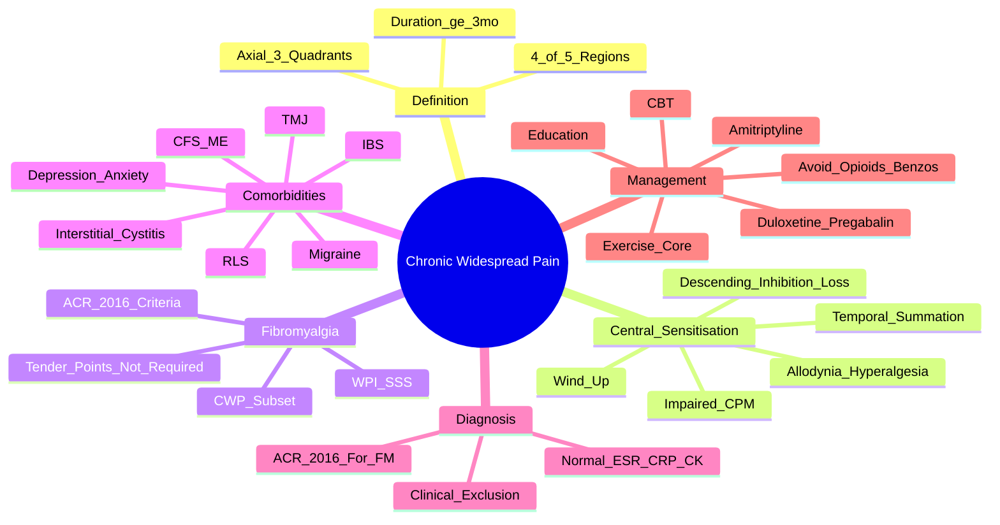

# Chronic Widespread Pain (CWP)

> [!tip] **FCPS/MRCP Priority: HIGH**
> CWP = **pain in ≥4/5 body regions (axial + 3/4 quadrants) for ≥3 months**. **Broader than fibromyalgia** — fibromyalgia = CWP + ACR 2016 criteria (WPI/SSS). **Central sensitisation** core mechanism. **Multidisciplinary management** identical to fibromyalgia: Education → Exercise → CBT → Duloxetine/Pregabalin/Amitriptyline. **Avoid opioids**.

---

## Learning Objectives
By the end of this note you should be able to:
- [ ] Apply **CWP definition**: pain in ≥4/5 body regions (axial + 3/4 quadrants) for ≥3 months
- [ ] Explain **central sensitisation** pathophysiology (wind-up, temporal summation, allodynia, loss of descending inhibition)
- [ ] Differentiate **CWP from fibromyalgia** (CWP = broader category; Fibromyalgia = CWP + ACR 2016 criteria)
- [ ] Apply **multidisciplinary management**: Education → Exercise (core) → CBT → Pharmacotherapy (Duloxetine, Pregabalin, low-dose Amitriptyline)
- [ ] Avoid **opioids, benzodiazepines, muscle relaxants** — no benefit, high harm
- [ ] Recognise **comorbidities**: depression, anxiety, IBS, CFS/ME, migraine, sleep disorders

---

## 1. Definition & Epidemiology

| Feature | Detail |
|---------|--------|
| **Definition** | **Chronic pain** in **≥4 of 5 body regions** (left/right upper, left/right lower, axial) for **≥3 months** |
| **Body Regions (5)** | 1. Left upper, 2. Right upper, 3. Left lower, 4. Right lower, 5. Axial (neck, back, chest, abdomen) |
| **Prevalence** | **10-15%** of general population |
| **Peak Onset** | **30-55 years** |
| **Sex Ratio** | **F:M = 2-3:1** |
| **Overlap with Fibromyalgia** | **All fibromyalgia = CWP**, but **not all CWP = fibromyalgia** |

---

## 2. Pathophysiology — **Central Sensitisation**

```mermaid
flowchart LR
    A[Peripheral Input\n(Nociception)] --> B[Spinal Cord\nDorsal Horn]
    B --> C[**Wind-Up**\nProgressive ↑ response\nto repeated stimuli]
    C --> D[**Temporal Summation**\n↑ pain with repeated\nstimuli at same intensity]
    D --> E[**Loss of Descending\nInhibition**\n↓ serotonin/noradrenaline]
    E --> F[**Impaired Conditioned\nPain Modulation**\n(Diffuse Noxious Inhibitory Controls)]
    F --> G[**Central Sensitisation**\nAllodynia\nHyperalgesia\nWidespread Pain]
    F --> H[**Autonomic/Somatic Symptoms**\nFatigue, Sleep disturbance,\nCognitive dysfunction\nAnxiety/Depression]
```

### Key Central Sensitisation Features
| Feature | Description |
|---------|-------------|
| **Wind-Up** | Progressive increase in dorsal horn neuron response to repeated C-fibre stimulation |
| **Temporal Summation** | Increasing pain perception with repeated identical stimuli |
| **Allodynia** | Pain from non-painful stimulus (light touch, brushing) |
| **Hyperalgesia** | Exaggerated pain response to painful stimulus |
| **Loss of Descending Inhibition** | ↓ Serotonin/noradrenaline → ↓ endogenous pain control |
| **Impaired CPM** | Diffuse Noxious Inhibitory Controls impaired |

---

## 3. Clinical Features

| Domain | Features |
|---------|----------|
| **Pain** | **Chronic widespread** (≥3 months), **≥4/5 body regions**, **bilateral, above & below waist**, axial + ≥3 quadrants |
| **Fatigue** | **Profound, unrelieved by rest** — often most disabling |
| **Sleep** | **Unrefreshing**, difficulty initiating/maintaining, **alpha-delta sleep anomaly** |
| **Cognitive** | **"Brain fog"** — memory lapses, concentration difficulty, word-finding difficulty |
| **Psychiatric** | **Depression, anxiety** (comorbid, not causative) |
| **Somatic** | Headache (tension/migraine), IBS, TMJ dysfunction, dysmenorrhoea, RLS, interstitial cystitis |
| **Examination** | **No objective findings** — no swelling, erythema, synovitis, normal strength/reflexes |

> [!critical] **CWP = Clinical Diagnosis (Exclusion)**
> - **No confirmatory test** — normal ESR/CRP, normal CK, normal imaging
> - **Rule out**: inflammatory (RA, SpA), endocrine (thyroid), malignancy, neurological, vitamin D deficiency

---

## 4. CWP vs Fibromyalgia — **Critical Distinction**

| Feature | **CWP** | **Fibromyalgia (FM)** |
|---------|---------|----------------------|
| **Definition** | Pain in ≥4/5 regions ≥3 months | **CWP + ACR 2016 criteria** (WPI/SSS) |
| **ACR 2016 Criteria** | Not required | **WPI ≥7 & SSS ≥5** OR **WPI 4-6 & SSS ≥9** |
| **Tender Points** | Not assessed | **Not required** (2016 criteria) |
| **Scope** | **Broader category** | **Subset of CWP** |
| **All FM = CWP** | — | **Yes** |
| **All CWP = FM** | **No** (only ~50-60% meet FM criteria) | — |

> [!critical] **CWP = Broader Category; Fibromyalgia = CWP + ACR 2016 Criteria**
> - **CWP = ≥4/5 regions, ≥3 months**
> - **FM = CWP + WPI/SSS criteria**
> - **Many CWP patients don't meet FM criteria** but still need treatment

---

## 4. Differential Diagnosis

| Condition | Distinguishing Features |
|-----------|------------------------|
| **RA / SpA** | **Inflammatory markers ↑**, synovitis, erosions, RF/CCP/HLA-B27 |
| **Hypothyroidism** | **Elevated TSH**, cold intolerance, weight gain, myxoedema |
| **Vitamin D Deficiency** | **Low 25-OH Vit D**, bone pain, proximal myopathy, improves with replacement |
| **Polymyalgia Rheumatica** | **>50y, girdle stiffness >45min, ESR/CRP ↑↑**, dramatic steroid response |
| **CFS/ME** | **Post-exertional malaise** dominant, no widespread pain criteria |
| **Depression** | **Low mood, anhedonia** primary; pain secondary |
| **Lyme Disease** | **Endemic area, EM rash, Borrelia serology+** |
| **Multiple Myeloma** | **Bone pain (focal), anaemia, hypercalcaemia, paraprotein** |
| **Vitamin B12 Deficiency** | Neuropathy, megaloblastic anaemia, subacute combined degeneration |
| **Vitamin D Deficiency** | **Low 25-OH Vit D**, bone pain, proximal myopathy, improves with replacement |
| **Hypoparathyroidism** | Hypocalcaemia, hyperphosphataemia, Chvostek's/Trousseau's sign |

---

## 5. Management — **Multidisciplinary (Same as Fibromyalgia)**

```mermaid
flowchart TD
    A[CWP Diagnosis] --> B[**1. EDUCATION**\nReassurance, pain neuroscience education\nSet realistic expectations]
    B --> C[**2. EXERCISE (CORE)**\nGraded aerobic (walking, swimming)\n+ Resistance training\nStart low, go slow]
    C --> D[**3. CBT / Psychological**\nPain coping, pacing, sleep hygiene\nMindfulness, ACT]
    D --> E[**4. PHARMACOTHERAPY**\nif symptoms persist]
    E --> E1[**Duloxetine 30-60mg daily**\n(SNRI — 1st line)]
    E --> E2[**Pregabalin 150-300mg/day**\nOR **Gabapentin**\n(α2δ ligand — 1st line)]
    E --> E3[**Amitriptyline 10-25mg nocte**\n(low dose, night — sedating)]
    E --> F[**5. NON-PHARM ADJUNCTS**\nHydrotherapy, acupuncture, mindfulness, yoga, tai chi]
    F --> G[**AVOID**\nOpioids, Benzodiazepines, Muscle relaxants\n(No evidence, high harm)]
```

### Pharmacotherapy Details

| Drug | Dose | Mechanism | Key Points |
|------|------|-----------|------------|
| **Duloxetine** | 30mg daily → 60mg daily | **SNRI** (serotonin/noradrenaline reuptake inhibition) | **FDA approved**; nausea, insomnia, sexual dysfunction |
| **Pregabalin** | 75mg BD → 150-300mg/day | **α2δ ligand** (voltage-gated Ca²⁺ channel) | **FDA approved**; dizziness, weight gain, oedema |
| **Gabapentin** | 300mg TDS → 600-1200mg TDS | **α2δ ligand** | Off-label; slower titration; renal dose adjust |
| **Amitriptyline** | 10-25mg nocte | **TCA** (serotonin/noradrenaline + anticholinergic) | **Low dose at night**; anticholinergic SE, sedating |
| **Milnacipran** | 50-100mg BD | **SNRI** | FDA approved (not UK); similar to duloxetine |

> [!warning] **Drugs to AVOID**
> - **Opioids** — no long-term benefit, hyperalgesia, dependence, mortality
> - **Benzodiazepines** — no benefit, dependence, falls, cognitive impairment
> - **Muscle relaxants** (cyclobenzaprine, baclofen) — sedation, no long-term benefit
> - **Corticosteroids** — no role
> - **NSAIDs** — minimal benefit, GI/CV risk

---

## 6. Comorbidities — **Central Sensitivity Syndromes**

| Comorbidity | Prevalence | Shared Mechanism |
|-------------|------------|------------------|
| **IBS** | 30-50% | Visceral hypersensitivity |
| **CFS/ME** | 20-30% | Central sensitisation, fatigue |
| **Migraine** | 30-50% | Central sensitisation, allodynia |
| **TMJ Disorder** | 20-30% | Myofascial pain |
| **Depression/Anxiety** | 40-60% | Shared neurotransmitters (5-HT, NE) |
| **Interstitial Cystitis** | 10-20% | Visceral hypersensitivity |
| **Restless Legs Syndrome** | 15-20% | Dopaminergic, central sensitisation |

---

## 7. FCPS/MRCP High-Yield Summary

| Topic | Key Points |
|-------|------------|
| **Definition** | Chronic pain ≥4/5 body regions (axial + 3 quadrants) ≥3 months |
| **vs Fibromyalgia** | **CWP = broader**; **FM = CWP + ACR 2016** (WPI ≥7 & SSS ≥5 OR WPI 4-6 & SSS ≥9) |
| **Central Sensitisation** | **Wind-up, temporal summation, allodynia, hyperalgesia, loss of descending inhibition, impaired CPM** |
| **Core Symptoms** | **Pain (widespread) + Fatigue + Unrefreshing sleep + Cognitive dysfunction ("brain fog")** |
| **Comorbidities** | IBS, CFS, migraine, TMJ, depression/anxiety, interstitial cystitis, RLS |
| **Diagnosis** | **Clinical** (definition + exclusion); **no confirmatory test**, normal ESR/CRP/CK |
| **Management** | **Education → Exercise (core) → CBT → Duloxetine/Pregabalin → Amitriptyline** |
| **Drugs** | **Duloxetine, Pregabalin, Amitriptyline (low dose)** — **NO opioids, benzos, muscle relaxants** |
| **Multidisciplinary** | Rheumatology + Physio + Psychology + Pain specialist |

---

## 7. Viva Questions (MRCP PACES / FCPS)

| Question | Expected Answer |
|----------|----------------|
| "What is the definition of chronic widespread pain?" | **Pain in ≥4 of 5 body regions** (axial + 3/4 quadrants) **for ≥3 months**. |
| "How does CWP differ from fibromyalgia?" | **CWP = broader category** (pain ≥4/5 regions ≥3 months). **Fibromyalgia = CWP + ACR 2016 criteria** (WPI ≥7 & SSS ≥5 OR WPI 4-6 & SSS ≥9). All FM = CWP, but not all CWP = FM. |
| "What is central sensitisation and what are its key features?" | **Augmented pain processing in CNS**: **wind-up, temporal summation, allodynia, hyperalgesia, loss of descending inhibition, impaired CPM**. |
| "What are the ACR 2016 criteria for fibromyalgia?" | **WPI ≥7 & SSS ≥5** OR **WPI 4-6 & SSS ≥9**, symptoms ≥3 months. **No tender points required** (2016 criteria). |
| "What is the first-line pharmacological treatment for CWP/fibromyalgia?" | **Duloxetine (SNRI) 30-60mg daily** OR **Pregabalin 150-300mg/day** — **1st line**. Amitriptyline 10-25mg nocte also used. |
| "Why should opioids be avoided in CWP/fibromyalgia?" | **No long-term benefit**, **induce hyperalgesia**, **dependence**, **falls**, **mortality risk** — **guidelines strongly recommend against**. |
| "What is the role of exercise in CWP/fibromyalgia?" | **CORE treatment** — **graded aerobic (walking, swimming) + resistance**; **start low, go slow**; improves pain, fatigue, function. |
| "A patient with CWP has IBS, migraine, and depression. What does this suggest?" | **Central sensitivity syndromes** — **comorbidities share central sensitisation pathophysiology** (IBS: visceral hypersensitivity, migraine: allodynia, depression: shared 5-HT/NE pathways). |
| "What drugs should be avoided in CWP/fibromyalgia and why?" | **Opioids (hyperalgesia, dependence), benzodiazepines (dependence, falls), muscle relaxants (sedation), corticosteroids (no role)** — **no evidence of benefit, high harm**. |

---

## 8. Confusions & Mnemonics

| Confusion | Clarification |
|-----------|---------------|
| **CWP vs Fibromyalgia** | **CWP = broader** (pain ≥4/5 regions ≥3 months). **FM = CWP + ACR 2016 criteria (WPI/SSS)**. All FM = CWP, not all CWP = FM. |
| **CWP vs CFS/ME** | **CFS/ME = post-exertional malaise** dominant; CWP = **widespread pain** dominant. Can coexist. |
| **Fibro Fog** | **Cognitive dysfunction** — memory, concentration, word-finding — **not dementia**, reversible. |
| **Amitriptyline Dose** | **Low dose (10-25mg nocte)** — **not antidepressant dose** (75-150mg); sedating, anticholinergic. |
| **Duloxetine vs Pregabalin** | Both 1st line. **Duloxetine** = SNRI (also helps depression); **Pregabalin** = α2δ ligand (also helps neuropathic pain). |
| **Exercise in CWP** | **NOT harmful** — **graded, start low, go slow**; core treatment, improves all domains. |

**Mnemonic: CWP Definition = "4 OUT OF 5 FOR 3 MONTHS"**
- **4** out of **5** body regions
- **O**ut of **5**: Axial + 4 Quadrants
- **U**niversal (≥3 months)

**Mnemonic: Central Sensitisation = "WIND-TALL"**
- **WIND**-up
- **T**emporal summation
- **A**llodynia
- **L**oss of descending inhibition
- **L**impaired CPM

**Mnemonic: CWP vs FM = "CWP > FM"**
- **CWP** = **Broader** (all FM = CWP)
- **FM** = **Subset** (CWP + criteria)

**Mnemonic: Management = "E-E-C-P-A" (EECPA)**
- **E**ducation
- **E**xercise (core)
- **C**BT
- **P**harmacotherapy (Duloxetine/Pregabalin/Amitriptyline)
- **A**void opioids/benzos

**Mnemonic: Drugs to Avoid = "O-B-M-C"**
- **O**pioids
- **B**enzodiazepines
- **M**uscle relaxants
- **C**orticosteroids

**Mnemonic: Comorbidities = "I-C-M-T-D-I-R"**
- **I**BS
- **C**FS/ME
- **M**igraine
- **T**MJ
- **D**epression/Anxiety
- **I**nterstitial cystitis
- **R**LS

---

## 9. Mind Map



---

## 10. One-Page Revision Card

| Domain | Key Points |
|--------|------------|
| **Definition** | Chronic pain **≥4/5 body regions** (axial + 3/4 quadrants) **≥3 months** |
| **vs Fibromyalgia** | **CWP = broader**; **FM = CWP + ACR 2016 criteria** (WPI ≥7 & SSS ≥5 OR WPI 4-6 & SSS ≥9) |
| **Central Sensitisation** | **Wind-up, temporal summation, allodynia, hyperalgesia, loss of descending inhibition, impaired CPM** |
| **Core Symptoms** | **Pain (widespread) + Fatigue + Unrefreshing sleep + Cognitive dysfunction ("brain fog")** |
| **Comorbidities** | IBS, CFS/ME, migraine, TMJ, depression/anxiety, interstitial cystitis, RLS |
| **Diagnosis** | Clinical + exclusion; **normal ESR/CRP/CK**, no inflammatory/structural cause |
| **Management** | **Education → Exercise (core) → CBT → Duloxetine/Pregabalin → Amitriptyline** |
| **Drugs** | **Duloxetine, Pregabalin, Amitriptyline (low dose)** — **NO opioids, benzos, muscle relaxants** |
| **Multidisciplinary** | Rheumatology + Physio + Psychology + Pain specialist |

---

## 11. Spaced Repetition Trackers

| Review Interval | Date Completed | Confidence (1-5) | Notes |
|-----------------|----------------|------------------|-------|
| 24 hours | | | |
| 7 days | | | |
| 15 days | | | |
| 30 days | | | |
| 90 days | | | |

---

## 12. Self-Test Scorecard

| Section | Score /5 | Last Attempt |
|---------|----------|--------------|
| CWP vs FM Distinction | | |
| Central Sensitisation Mechanisms | | |
| Differential Diagnosis | | |
| Pharmacotherapy Selection | | |
| Exercise/CBT Role | | |
| Avoidance of Harmful Drugs | | |
| Viva Questions | | |

---

## Local Navigation
- **Parent Heading**: [[../Soft Tissue Rheumatism and Chronic Pain Syndromes|Soft Tissue Rheumatism and Chronic Pain Syndromes]]
- **Parent Topic Group**: [[Chronic pain syndromes and fibromyalgia]]
- **Chapter Map**: [[../Davidson Chapter 26 - Rheumatology Hierarchy|Rheumatology Hierarchy]]
- **Chapter MOC**: [[../Rheumatology MOC|Rheumatology MOC]]
- **Drug Reference**: [[../../Clinical Approach to Musculoskeletal Disease/Drugs in rheumatology|Drugs in rheumatology]]
- **Related**: [[Fibromyalgia]] · [[Drugs in rheumatology]]
---

> Auto-generated study sections for "Soft Tissue Rheumatism and Chronic Pain Syndromes" — Ch 25: Rheumatology & Bone Disease.

## Flashcards (21 generated)

- Q: What is Wind-Up of Soft Tissue Rheumatism and Chronic Pain Syndromes?
  A: Progressive increase in dorsal horn neuron response to repeated C-fibre stimulation
- Q: What is Temporal Summation of Soft Tissue Rheumatism and Chronic Pain Syndromes?
  A: Increasing pain perception with repeated identical stimuli
- Q: What is Allodynia of Soft Tissue Rheumatism and Chronic Pain Syndromes?
  A: Pain from non-painful stimulus (light touch, brushing)
- Q: What is Hyperalgesia of Soft Tissue Rheumatism and Chronic Pain Syndromes?
  A: Exaggerated pain response to painful stimulus
- Q: What is Loss of Descending Inhibition of Soft Tissue Rheumatism and Chronic Pain Syndromes?
  A: ↓ Serotonin/noradrenaline → ↓ endogenous pain control
- Q: What is Impaired CPM of Soft Tissue Rheumatism and Chronic Pain Syndromes?
  A: Diffuse Noxious Inhibitory Controls impaired
- Q: What is Wind-Up of Soft Tissue Rheumatism and Chronic Pain Syndromes?
  A: Progressive increase in dorsal horn neuron response to repeated C-fibre stimulation
- Q: What is Temporal Summation of Soft Tissue Rheumatism and Chronic Pain Syndromes?
  A: Increasing pain perception with repeated identical stimuli
- Q: What is Allodynia of Soft Tissue Rheumatism and Chronic Pain Syndromes?
  A: Pain from non-painful stimulus (light touch, brushing)
- Q: What is Hyperalgesia of Soft Tissue Rheumatism and Chronic Pain Syndromes?
  A: Exaggerated pain response to painful stimulus
- Q: What is Loss of Descending Inhibition of Soft Tissue Rheumatism and Chronic Pain Syndromes?
  A: ↓ Serotonin/noradrenaline → ↓ endogenous pain control
- Q: What is Impaired CPM of Soft Tissue Rheumatism and Chronic Pain Syndromes?
  A: Diffuse Noxious Inhibitory Controls impaired
- Q: What is the definition of Soft Tissue Rheumatism and Chronic Pain Syndromes?
  A: Chronic pain ≥4/5 body regions (axial + 3 quadrants) ≥3 months
- Q: What is vs Fibromyalgia of Soft Tissue Rheumatism and Chronic Pain Syndromes?
  A: CWP = broader; FM = CWP + ACR 2016 (WPI ≥7 & SSS ≥5 OR WPI 4-6 & SSS ≥9)
- Q: What is Central Sensitisation of Soft Tissue Rheumatism and Chronic Pain Syndromes?
  A: Wind-up, temporal summation, allodynia, hyperalgesia, loss of descending inhibition, impaired CPM
- Q: What are the clinical features of Soft Tissue Rheumatism and Chronic Pain Syndromes?
  A: Pain (widespread) + Fatigue + Unrefreshing sleep + Cognitive dysfunction ("brain fog")
- Q: What is Comorbidities of Soft Tissue Rheumatism and Chronic Pain Syndromes?
  A: IBS, CFS, migraine, TMJ, depression/anxiety, interstitial cystitis, RLS
- Q: What is the investigation of choice for Soft Tissue Rheumatism and Chronic Pain Syndromes?
  A: Clinical (definition + exclusion); no confirmatory test, normal ESR/CRP/CK
- Q: How is Soft Tissue Rheumatism and Chronic Pain Syndromes managed?
  A: Education → Exercise (core) → CBT → Duloxetine/Pregabalin → Amitriptyline
- Q: What is Drugs of Soft Tissue Rheumatism and Chronic Pain Syndromes?
  A: Duloxetine, Pregabalin, Amitriptyline (low dose) — NO opioids, benzos, muscle relaxants
- Q: What is Multidisciplinary of Soft Tissue Rheumatism and Chronic Pain Syndromes?
  A: Rheumatology + Physio + Psychology + Pain specialist

## MCQs (1 generated)

1. **Which of the following best describes Soft Tissue Rheumatism and Chronic Pain Syndromes?**
   A. **CWP = pain in ≥4/5 body regions (axial + 3/4 quadrants) for ≥3 months.**
   B. An unrelated condition not matching the clinical picture of Soft Tissue Rheumatism and Chronic Pain Syndromes
   C. A complication seen late in the disease course of Soft Tissue Rheumatism and Chronic Pain Syndromes
   D. A condition that mimics Soft Tissue Rheumatism and Chronic Pain Syndromes but has a different underlying cause

## SBA Questions (1 generated)

1. A patient with suspected Soft Tissue Rheumatism and Chronic Pain Syndromes presents with: Definition — Chronic pain in ≥4 of 5 body regions (left/right upper, left/right lower, axial) for ≥3 months; Body Regions (5) — 1. Left upper, 2. Right upper, 3. Left lower, 4. Right lower, 5. Axial (neck, back, chest, abdomen); Prevalence — 10-15% of general population. What is the most likely diagnosis?
   A. **Soft Tissue Rheumatism and Chronic Pain Syndromes**
   B. A condition that mimics Soft Tissue Rheumatism and Chronic Pain Syndromes but is not the same entity
   C. A complication of Soft Tissue Rheumatism and Chronic Pain Syndromes rather than the primary diagnosis
   D. An unrelated condition in the same clinical category as Soft Tissue Rheumatism and Chronic Pain Syndromes

