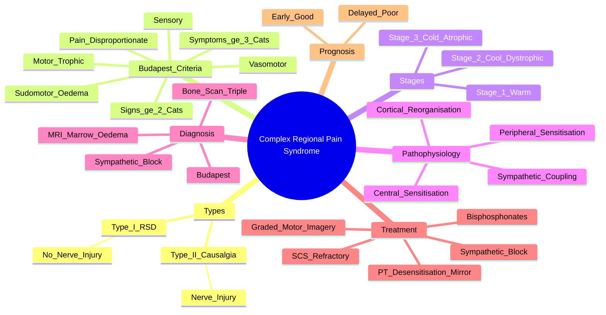

# Complex Regional Pain Syndrome (CRPS)

> [!tip] **FCPS/MRCP Priority: HIGH**
> CRPS = **severe limb pain disproportionate to inciting trauma**. **Budapest criteria** for diagnosis. **Type I (no nerve injury = RSD) vs Type II (nerve injury = causalgia)**. **Early PT = most critical** (desensitisation, graded motor imagery, mirror therapy). **Bisphosphonates** evidence for pain/function. **Early intervention = better prognosis**.

---

## Learning Objectives
By the end of this note you should be able to:
- [ ] Apply **Budapest diagnostic criteria** for CRPS (≥1 sign in ≥2 categories + ≥1 symptom in ≥3 categories)
- [ ] Differentiate **Type I (no nerve injury, formerly RSD)** from **Type II (nerve injury, formerly causalgia)**
- [ ] Recognise **three clinical stages**: acute (warm) → dystrophic (cool) → atrophic (fixed contracture)
- [ ] Select **early multidisciplinary management**: **PT (desensitisation, mirror therapy, graded motor imagery) + bisphosphonates + sympathetic block**
- [ ] Recognise **prognostic importance of early intervention** — delay leads to contracture, atrophy, fixed disability

---

## 1. Definition & Epidemiology

| Feature | Detail |
|---------|--------|
| **Definition** | **Disproportionate limb pain** + **sensory, vasomotor, sudomotor/oedema, motor/trophic changes** after trauma/surgery |
| **Incidence** | 5-26/100,000/year |
| **Peak Age** | 40-60 years |
| **Sex Ratio** | **F:M = 3-4:1** |
| **Triggers** | **Distal radius fracture #1**, sprain, surgery, stroke, MI, immobilisation, minor trauma |

---

## 2. Types

| Type | Former Name | Nerve Injury | Mechanism |
|------|-------------|--------------|-----------|
| **Type I** | **Reflex Sympathetic Dystrophy (RSD)** | **No identifiable nerve injury** | Sympathetic dysfunction, inflammation, central sensitisation |
| **Type II** | **Causalgia** | **Confirmed nerve injury** (peripheral nerve) | Nerve damage + same mechanisms as Type I |

> [!important] **Clinical presentation and management identical** — distinction mainly aetiological.

---

## 3. Diagnostic Criteria — **Budapest Criteria (2007, Revised 2012)**

**All 4 Categories Required for Diagnosis**

| Category | **Signs** (Clinician Observed) | **Symptoms** (Patient Reported) |
|----------|-------------------------------|--------------------------------|
| **1. Sensory** | **Hyperalgesia** (pinprick) **AND/OR Allodynia** (light touch/brush) | **Hyperalgesia** and/or **allodynia** |
| **2. Vasomotor** | **Temperature asymmetry >1°C** (infrared thermometer), **Skin colour changes** (mottled, red, pale) | Temperature asymmetry, colour changes |
| **3. Sudomotor/Oedema** | **Oedema** (circumferential difference), **Sweating changes** (hyper/hypohidrosis) | Oedema, sweating changes |
| **4. Motor/Trophic** | **Decreased ROM**, weakness, tremor, dystonia, **Trophic changes** (hair/nail/skin atrophy) | Decreased ROM, weakness, tremor, dystonia, trophic changes |

### Diagnostic Rule
| Requirement | Detail |
|-------------|--------|
| **Continuing pain** | **Disproportionate** to inciting event |
| **Signs** | **≥1 sign in ≥2 categories** (at time of evaluation) |
| **Symptoms** | **≥1 symptom in ≥3 categories** (patient reported) |
| **Exclusion** | No other diagnosis better explains signs/symptoms |

> [!critical] **Budapest Criteria Must ALL Be Met**
> - **Continuing disproportionate pain** + **≥1 sign in ≥2 categories** + **≥1 symptom in ≥3 categories** + **No other diagnosis**

---

## 3. Pathophysiology

```mermaid
flowchart LR
    A[Trauma/Surgery] --> B[Peripheral Nociceptor Activation]
    B --> C[Peripheral Sensitisation\nNeuropeptide Release (SP, CGRP)\nNeurogenic Inflammation]
    B --> D[Sympathetic Dysfunction\nSympathetic-Afferent Coupling]
    C --> E[Central Sensitisation\nSpinal Cord Wind-Up\nTemporal Summation]
    D --> E
    E --> F[Maladaptive Neuroplasticity\nCortical Reorganisation]
    F --> G[CRPS Clinical Picture\nPain + Autonomic + Motor + Trophic]
```

### Key Mechanisms
| Mechanism | Description |
|---------|-------------|
| **Peripheral Sensitisation** | Neuropeptide release (substance P, CGRP) → neurogenic inflammation |
| **Sympathetic-Afferent Coupling** | Sympathetic efferents activate sensitised nociceptors |
| **Central Sensitisation** | Wind-up, temporal summation, cortical reorganisation (S1 shrinkage) |
| **Genetic Predisposition** | HLA associations, COMT, TNF-α polymorphisms |

---

## 4. Clinical Stages (Not Always Sequential)

| Stage | Name | Features | Duration |
|-------|------|----------|----------|
| **Stage 1** | **Acute / Warm** | **Warm, swollen, erythematous**, hyperhidrosis, **severe pain**, hyperalgesia | 0-3 months |
| **Stage 2** | **Dystrophic / Cool** | **Cool, cyanotic/mottled**, oedema ↓, **skin shiny, dystrophic**, **early contracture** | 3-9 months |
| **Stage 3** | **Atrophic** | **Cool, pale, shiny**, **skin atrophy**, **severe contracture**, **muscle wasting**, osteoporosis (Sudeck's) | >9 months (often years) |

> [!important] **Stages Not Always Sequential**
> - Patients may skip stages or fluctuate
> - **Early intervention prevents progression**

---

## 5. Diagnostic Criteria Summary

```mermaid
flowchart TD
    A[Limb Pain Post-Trauma] --> B[Disproportionate Pain?]
    B -->|No| C[Not CRPS]
    B -->|Yes| D[Budapest Criteria]
    D --> D1[≥1 Sign in ≥2 Categories\n(Sensory, Vasomotor, Sudomotor, Motor)]
    D --> D2[≥1 Symptom in ≥3 Categories]
    D --> D3[No Other Diagnosis]
    D1 --> E[**CRPS Diagnosed**]
    D2 --> E
    D3 --> E
```

### Investigations (Supportive, Not Diagnostic)
| Test | Finding |
|------|---------|
| **Plain X-ray** | **Patchy osteoporosis** (Sudeck's atrophy) — late |
| **Triple Phase Bone Scan** | **Early**: ↑ flow + ↑ uptake; **Late**: ↓ uptake — **sensitive, not specific** |
| **MRI** | Bone marrow oedema (early), soft tissue changes |
| **Thermography** | Temperature asymmetry >1°C |
| **Sympathetic Block** | Diagnostic (pain relief) + therapeutic |
| **Nerve Conduction** | Normal in Type I; abnormal in Type II |

---

## 6. Management — **Early Multidisciplinary = Key**

```mermaid
flowchart TD
    A[CRPS Diagnosis] --> B[**IMMEDIATE MULTIDISCIPLINARY PT**\n(Cornerstone of Treatment)]
    B --> B1[**Desensitisation**\nGraded tactile exposure]
    B1 --> B2[**Graded Motor Imagery**\nLaterality → Imagined movements → Mirror therapy]
    B2 --> B3[**Mirror Therapy**\nVisual feedback for cortical reorganisation]
    B3 --> B4[**Graded Exercise**\nProgressive loading, functional tasks]
    B4 --> C[**PHARMACOTHERAPY**]
    C --> C1[**Bisphosphonates**\nAlendronate/Neridronate/Pamidronate\n(Evidence for pain/function)]
    C1 --> C2[Neuropathic agents\nGabapentin, Amitriptyline, Duloxetine]
    C2 --> C3[NSAIDs (adjunct)]
    C3 --> D[**SYMPATHETIC BLOCK**\nStellate ganglion / Lumbar sympathetic\nDiagnostic + Therapeutic]
    D --> E[**REFRACTORY**\nSpinal Cord Stimulation\nIV Ketamine\nIVIG (limited evidence)]
    E --> F[**AVOID PROLONGED IMMOBILISATION**]
```

### Management Details

| Modality | Details | Evidence |
|----------|---------|----------|
| **Physiotherapy (1st Line)** | **Desensitisation, Graded Motor Imagery, Mirror Therapy, Graded Exercise** — **EARLY = BEST** | **Strongest evidence** — prevents contracture/atrophy |
| **Bisphosphonates** | **Alendronate 70mg weekly**, **Neridronate 100mg IV** (Europe), **Pamidronate 60mg IV** | **RCT evidence** for pain/function improvement |
| **Neuropathic Agents** | Gabapentin, Pregabalin, Amitriptyline, Duloxetine | Symptomatic relief |
| **Sympathetic Block** | Stellate ganglion (upper limb), Lumbar sympathetic (lower limb) | Diagnostic + therapeutic; repeat if benefit |
| **Spinal Cord Stimulation** | **Refractory** (>6-12 months) | Good evidence for pain relief |
| **IV Ketamine** | Refractory, inpatient | NMDA antagonism — short-term benefit |
| **IVIG** | Refractory, limited evidence | Case reports |

> [!critical] **Early PT = Single Most Important Intervention**
> - **Desensitisation** → **Mirror Therapy** → **Graded Motor Imagery** → **Graded Exercise**
> - **Delay → Contracture, Atrophy, Fixed Disability**

---

## 6. Prognosis

| Factor | Prognosis |
|--------|-----------|
| **Early Diagnosis (<3 months)** | **Good** — 80-90% significant improvement |
| **Delayed (>6-12 months)** | **Poor** — contracture, atrophy, fixed disability |
| **Type I vs II** | Similar with treatment |
| **Psychological Factors** | Depression, catastrophising → worse outcome |
| **Recurrence** | 10-30% (new trauma/surgery) |

---

## 7. FCPS/MRCP High-Yield Summary

| Topic | Key Points |
|-------|------------|
| **Definition** | Disproportionate limb pain + sensory/autonomic/motor/trophic changes |
| **Budapest Criteria** | **All 4 categories** (sensory, vasmotor, sudomotor, motor) + **disproportionate pain** + **≥1 sign in ≥2 categories** + **≥1 symptom in ≥3 categories** |
| **Type I vs II** | **I = no nerve injury (RSD)**; **II = nerve injury (causalgia)** — same treatment |
| **Stages** | **1=Acute (warm/swollen) → 2=Dystrophic (cool) → 3=Atrophic (contracture)** |
| **Bone Scan** | **Triple phase**: early ↑ flow/uptake, late ↓ uptake |
| **Key Rx** | **Early PT** (desensitisation, mirror therapy, graded motor imagery) + **Bisphosphonates** + **Sympathetic block** |
| **Prognosis** | **Early (<3mo) = good**; Delayed = contracture/atrophy |
| **Refractory** | Spinal cord stimulation, IV ketamine, IVIG |

---

## 8. Viva Questions (MRCP PACES / FCPS)

| Question | Expected Answer |
|----------|----------------|
| "What are the Budapest criteria for CRPS?" | **Continuing disproportionate pain + ≥1 sign in ≥2 categories (sensory, vasomotor, sudomotor, motor) + ≥1 symptom in ≥3 categories + no other diagnosis.** |
| "How do you differentiate CRPS Type I from Type II?" | **Type I = no nerve injury (RSD)**; **Type II = confirmed nerve injury (causalgia)**. Clinical management identical. |
| "What are the three clinical stages of CRPS?" | **Stage 1 (Acute)**: warm, swollen, hyperhidrotic. **Stage 2 (Dystrophic)**: cool, dystrophic skin, contracture. **Stage 3 (Atrophic)**: cool, shiny, atrophic, fixed contracture. |
| "What is the most important treatment for CRPS?" | **Early multidisciplinary physiotherapy** — desensitisation, graded motor imagery, mirror therapy, graded exercise. **Early intervention prevents contracture/atrophy**. |
| "What bisphosphonates are used in CRPS and what is the evidence?" | **Alendronate, Neridronate, Pamidronate** — **RCT evidence** supports pain reduction and functional improvement. |
| "What is the role of sympathetic blockade in CRPS?" | **Diagnostic (pain relief confirms sympathetically maintained pain) + therapeutic** — stellate ganglion (upper limb) or lumbar sympathetic (lower limb). |
| "What is the bone scan finding in acute CRPS?" | **Triple phase bone scan**: **early phase — increased flow and uptake**; **delayed phase — increased uptake**; late CRPS shows decreased uptake. |
| "What is the prognosis of CRPS if treated early vs late?" | **Early (<3 months): 80-90% good improvement**. **Late (>6-12 months): poor — contracture, atrophy, fixed disability**. |

---

## 9. Confusions & Mnemonics

| Confusion | Clarification |
|-----------|---------------|
| **CRPS Type I vs II** | **Clinical presentation identical** — distinction is nerve injury. Type I = RSD (no nerve injury). Type II = causalgia (nerve injury). |
| **Budapest Criteria** | **All 4 categories required**: sensory, vasomotor, sudomotor/oedema, motor/trophic. **Signs in ≥2, symptoms in ≥3**. |
| **CRPS vs Neuropathic Pain** | CRPS = **autonomic + motor + trophic changes** (temperature asymmetry, oedema, trophic changes). Neuropathic = sensory ± motor, no autonomic/trophic. |
| **Bisphosphonates** | **Not first-line** but **evidence-based** for pain/function. Use with PT. |
| **Stages** | **Not linear** — patients can skip, fluctuate, or have mixed features. |
| **Sympathetic Block** | **Diagnostic + therapeutic** — not curative alone; adjunct to PT. |

**Mnemonic: Budapest = "S-V-S-M" (All 4 Categories)**
- **S**ensory (hyperalgesia/allodynia)
- **V**asomotor (temp asymmetry, colour)
- **S**udomotor/Oedema (oedema, sweating)
- **M**otor/Trophic (weakness, dystonia, trophic changes)

**Mnemonic: Stages = "WARM-COOL-COLD"**
- **WARM** (Stage 1): erythema, oedema, hyperhidrosis
- **COOL** (Stage 2): cyanosis, dystrophic skin, contracture
- **COLD** (Stage 3): pale, shiny, atrophic, fixed contracture

**Mnemonic: Treatment = "PT-BIS-BLOCK" (Priority Order)**
- **PT** (physiotherapy — **1st line**, early)
- **BIS**phosphonates (evidence for pain/function)
- **BLOCK** (sympathetic — diagnostic + therapeutic)

**Mnemonic: Types = "RSD vs CAUSALGIA"**
- **RSD** = Type I = **R**eflex **S**ympathetic **D**ystrophy = **No nerve injury**
- **CAUSALGIA** = Type II = **Nerve injury** confirmed

**Mnemonic: Bone Scan = "EARLY UP, LATE DOWN"**
- **Early**: ↑ flow, ↑ uptake
- **Late**: ↓ uptake

**Mnemonic: Prognosis = "EARLY GOOD, LATE BAD"**
- **<3 months**: 80-90% improve
- **>12 months**: contracture, atrophy, poor

---

## 10. Mind Map



---

## 11. One-Page Revision Card

| Domain | Key Points |
|--------|------------|
| **Types** | **Type I (RSD)**: no nerve injury. **Type II (Causalgia)**: nerve injury. |
| **Budapest** | **Pain disproportionate + ≥1 sign in ≥2 categories + ≥1 symptom in ≥3 categories** (Sensory, Vasomotor, Sudomotor/Oedema, Motor/Trophic) |
| **Stages** | **1=Warm** (oedema, hyperhidrosis) → **2=Cool/Dystrophic** (contracture) → **3=Cold/Atrophic** (fixed contracture) |
| **Bone Scan** | **Triple phase**: early ↑ flow/uptake, late ↓ uptake |
| **Key Rx** | **Early PT** (desensitisation, mirror therapy, graded motor imagery) + **Bisphosphonates** + **Sympathetic block** |
| **Prognosis** | **Early <3mo: 80-90% good** | **Delayed >12mo: contracture/atrophy** |
| **Refractory** | Spinal cord stimulation, IV ketamine, IVIG |

---

## 12. Spaced Repetition Trackers

| Review Interval | Date Completed | Confidence (1-5) | Notes |
|-----------------|----------------|------------------|-------|
| 24 hours | | | |
| 7 days | | | |
| 15 days | | | |
| 30 days | | | |
| 90 days | | | |

---

## 13. Self-Test Scorecard

| Section | Score /5 | Last Attempt |
|---------|----------|--------------|
| Budapest Criteria Application | | |
| Type I vs Type II | | |
| Clinical Staging | | |
| Early PT Protocol | | |
| Bisphosphonate Evidence | | |
| Sympathetic Block Role | | |
| Prognostic Factors | | |
| Viva Questions | | |

---

## Local Navigation
- **Parent Heading**: [[../Soft Tissue Rheumatism and Chronic Pain Syndromes|Soft Tissue Rheumatism and Chronic Pain Syndromes]]
- **Parent Topic Group**: [[Chronic pain syndromes and fibromyalgia]]
- **Chapter Map**: [[../Davidson Chapter 26 - Rheumatology Hierarchy|Rheumatology Hierarchy]]
- **Chapter MOC**: [[../Rheumatology MOC|Rheumatology MOC]]
- **Drug Reference**: [[../../Clinical Approach to Musculoskeletal Disease/Drugs in rheumatology|Drugs in rheumatology]]
- **Related**: [[Fibromyalgia]] · [[Chronic widespread pain]] · [[Drugs in rheumatology]]
---

> Auto-generated study sections for "Soft Tissue Rheumatism and Chronic Pain Syndromes" — Ch 25: Rheumatology & Bone Disease.

## Flashcards (27 generated)

- Q: What is Peripheral Sensitisation of Soft Tissue Rheumatism and Chronic Pain Syndromes?
  A: Neuropeptide release (substance P, CGRP) → neurogenic inflammation
- Q: What is Sympathetic-Afferent Coupling of Soft Tissue Rheumatism and Chronic Pain Syndromes?
  A: Sympathetic efferents activate sensitised nociceptors
- Q: What is Central Sensitisation of Soft Tissue Rheumatism and Chronic Pain Syndromes?
  A: Wind-up, temporal summation, cortical reorganisation (S1 shrinkage)
- Q: What is Genetic Predisposition of Soft Tissue Rheumatism and Chronic Pain Syndromes?
  A: HLA associations, COMT, TNF-α polymorphisms
- Q: What is Plain X-ray of Soft Tissue Rheumatism and Chronic Pain Syndromes?
  A: Patchy osteoporosis (Sudeck's atrophy) — late
- Q: What is Triple Phase Bone Scan of Soft Tissue Rheumatism and Chronic Pain Syndromes?
  A: Early: ↑ flow + ↑ uptake; Late: ↓ uptake — sensitive, not specific
- Q: What is MRI of Soft Tissue Rheumatism and Chronic Pain Syndromes?
  A: Bone marrow oedema (early), soft tissue changes
- Q: What is Thermography of Soft Tissue Rheumatism and Chronic Pain Syndromes?
  A: Temperature asymmetry >1°C
- Q: What is Sympathetic Block of Soft Tissue Rheumatism and Chronic Pain Syndromes?
  A: Diagnostic (pain relief) + therapeutic
- Q: What is Nerve Conduction of Soft Tissue Rheumatism and Chronic Pain Syndromes?
  A: Normal in Type I; abnormal in Type II
- Q: What is Peripheral Sensitisation of Soft Tissue Rheumatism and Chronic Pain Syndromes?
  A: Neuropeptide release (substance P, CGRP) → neurogenic inflammation
- Q: What is Sympathetic-Afferent Coupling of Soft Tissue Rheumatism and Chronic Pain Syndromes?
  A: Sympathetic efferents activate sensitised nociceptors
- Q: What is Central Sensitisation of Soft Tissue Rheumatism and Chronic Pain Syndromes?
  A: Wind-up, temporal summation, cortical reorganisation (S1 shrinkage)
- Q: What is Genetic Predisposition of Soft Tissue Rheumatism and Chronic Pain Syndromes?
  A: HLA associations, COMT, TNF-α polymorphisms
- Q: What is Plain X-ray of Soft Tissue Rheumatism and Chronic Pain Syndromes?
  A: Patchy osteoporosis (Sudeck's atrophy) — late
- Q: What is Triple Phase Bone Scan of Soft Tissue Rheumatism and Chronic Pain Syndromes?
  A: Early: ↑ flow + ↑ uptake; Late: ↓ uptake — sensitive, not specific
- Q: What is MRI of Soft Tissue Rheumatism and Chronic Pain Syndromes?
  A: Bone marrow oedema (early), soft tissue changes
- Q: What is Thermography of Soft Tissue Rheumatism and Chronic Pain Syndromes?
  A: Temperature asymmetry >1°C
- Q: What is Sympathetic Block of Soft Tissue Rheumatism and Chronic Pain Syndromes?
  A: Diagnostic (pain relief) + therapeutic
- Q: What is Nerve Conduction of Soft Tissue Rheumatism and Chronic Pain Syndromes?
  A: Normal in Type I; abnormal in Type II
- Q: What is the definition of Soft Tissue Rheumatism and Chronic Pain Syndromes?
  A: Disproportionate limb pain + sensory/autonomic/motor/trophic changes
- Q: What is Budapest Criteria of Soft Tissue Rheumatism and Chronic Pain Syndromes?
  A: All 4 categories (sensory, vasmotor, sudomotor, motor) + disproportionate pain + ≥1 sign in ≥2 categories + ≥1 symptom in ≥3 categories
- Q: How is Soft Tissue Rheumatism and Chronic Pain Syndromes classified?
  A: I = no nerve injury (RSD); II = nerve injury (causalgia) — same treatment
- Q: What is Bone Scan of Soft Tissue Rheumatism and Chronic Pain Syndromes?
  A: Triple phase: early ↑ flow/uptake, late ↓ uptake
- Q: What is Key Rx of Soft Tissue Rheumatism and Chronic Pain Syndromes?
  A: Early PT (desensitisation, mirror therapy, graded motor imagery) + Bisphosphonates + Sympathetic block
- Q: What is the prognosis of Soft Tissue Rheumatism and Chronic Pain Syndromes?
  A: Early (<3mo) = good; Delayed = contracture/atrophy
- Q: What is Refractory of Soft Tissue Rheumatism and Chronic Pain Syndromes?
  A: Spinal cord stimulation, IV ketamine, IVIG

## MCQs (1 generated)

1. **Which of the following best describes Soft Tissue Rheumatism and Chronic Pain Syndromes?**
   A. **CRPS = severe limb pain disproportionate to inciting trauma.**
   B. An unrelated condition not matching the clinical picture of Soft Tissue Rheumatism and Chronic Pain Syndromes
   C. A complication seen late in the disease course of Soft Tissue Rheumatism and Chronic Pain Syndromes
   D. A condition that mimics Soft Tissue Rheumatism and Chronic Pain Syndromes but has a different underlying cause

## SBA Questions (1 generated)

1. A patient with suspected Soft Tissue Rheumatism and Chronic Pain Syndromes presents with: Peak Age — 40-60 years; Sex Ratio — F:M = 3-4:1; Triggers — Distal radius fracture #1, sprain, surgery, stroke, MI, immobilisation, minor trauma. What is the most likely diagnosis?
   A. **Soft Tissue Rheumatism and Chronic Pain Syndromes**
   B. A condition that mimics Soft Tissue Rheumatism and Chronic Pain Syndromes but is not the same entity
   C. A complication of Soft Tissue Rheumatism and Chronic Pain Syndromes rather than the primary diagnosis
   D. An unrelated condition in the same clinical category as Soft Tissue Rheumatism and Chronic Pain Syndromes

