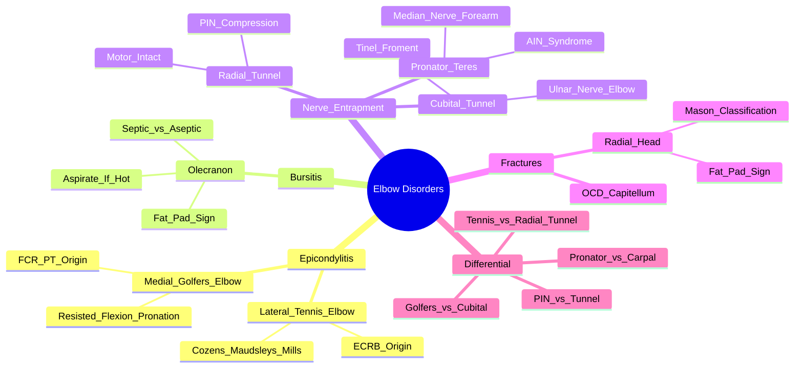

# Elbow Disorders

> [!tip] **FCPS/MRCP Priority: HIGH**
> **Lateral epicondylitis (tennis elbow)** = **Cozen's test +ve**. **Medial epicondylitis (golfer's elbow)** = resisted wrist flexion/pronation. **Olecranon bursitis** = fluctuant swelling, **aspirate if hot/erythematous** (septic/gout/RA). **Radial tunnel syndrome** = deep dorsal forearm pain, resisted middle finger extension, **NO motor deficit** (vs PIN palsy). **Cubital tunnel** = Tinel's at elbow, ulnar nerve distribution.

---

## Learning Objectives
By the end of this note you should be able to:
- [ ] Differentiate **lateral epicondylitis** (Cozen's test) from **radial tunnel syndrome** (motor intact)
- [ ] Differentiate **medial epicondylitis** from **cubital tunnel syndrome** and **pronator teres syndrome**
- [ ] Recognise **olecranon bursitis** — aspirate if hot/erythematous (septic/gout/RA)
- [ ] Identify **radial tunnel syndrome** vs **tennis elbow** — **motor intact in tunnel**
- [ ] Apply **special tests**: Cozen's, Maudsley, Mill's, Tinel's (elbow), Froment's
- [ ] Manage: NSAIDs, physiotherapy, bracing, IA steroid, surgery refractory

---

## 1. Lateral Epicondylitis (Tennis Elbow)

| Feature | Detail |
|---------|--------|
| **Definition** | **Tendinopathy of common extensor origin** (ECRB most common) at lateral epicondyle |
| **Epidemiology** | 1-3% population, **30-50 years**, **manual workers, tennis players** |
| **Pathology** | **Degenerative tendinosis** (angiofibroblastic hyperplasia) — **not inflammatory** |

### Clinical Features
| Feature | Detail |
|---------|--------|
| **Pain** | **Lateral elbow**, radiates to forearm, **worse with gripping/lifting** |
| **Tenderness** | **Lateral epicondyle** (ECRB origin) |
| **Provocative Tests** | **Cozen's test**, **Maudsley's test**, **Mill's test**, **Chair test** |

### Special Tests
| Test | Technique | Positive = |
|------|-----------|------------|
| **Cozen's Test** | Resisted wrist extension + radial deviation + pronation (elbow extended) | **Lateral epicondyle pain** |
| **Maudsley's Test** | **Resisted middle finger extension** (with elbow extended) | **Lateral epicondyle pain** (EDC) |
| **Mill's Test** | Passive wrist flexion + pronation + elbow extension | **Lateral epicondyle pain** (stretch ECRB) |
| **Chair Test** | Lift chair with palm down, elbow extended | **Lateral epicondyle pain** |

---

## 2. Medial Epicondylitis (Golfer's Elbow)

| Feature | Detail |
|---------|--------|
| **Definition** | **Tendinopathy of common flexor origin** (FCR, PT) at medial epicondyle |
| **Epidemiology** | Less common than lateral, **golfers, throwers, manual workers** |

### Clinical Features
| Feature | Detail |
|---------|--------|
| **Pain** | **Medial elbow**, radiates to forearm, worse with gripping/flexion |
| **Tenderness** | **Medial epicondyle** (common flexor origin) |
| **Provocative Tests** | **Resisted wrist flexion**, **resisted pronation**, **golf swing test** |

---

## 3. Olecranon Bursitis

| Feature | Detail |
|---------|--------|
| **Definition** | Inflammation of **olecranon (subcutaneous) bursa** |
| **Aetiology** | **Trauma** (repeated pressure), **infection** (septic), **crystal** (gout, CPPD), **inflammatory** (RA, SLE) |
| **Demographics** | **Male > Female**, students, plumbers, clerics ("student's elbow") |

| Feature | **Aseptic** | **Septic** |
|---------|-------------|------------|
| **Swelling** | **Fluctuant, posterior elbow**, "goose egg" | **Hot, erythematous, tense, painful** |
| **Pain** | Mild-moderate | **Severe, throbbing** |
| **Temperature** | Normal | **Fever, systemic signs** |
| **Skin** | Intact | **Erythema, cellulitis** |
| **Aspirate** | Clear/serous, **WBC <2000** | **Purulent, WBC >50,000, Gram stain +ve** |

> [!critical] **Aspirate if hot/erythematous** — **rule out septic bursitis, gout, CPPD, RA**
> - **Septic**: S. aureus (80%), streptococci — **IV antibiotics + drainage**
> - **Gout/CPPD**: MSU/CPPD crystals — treat underlying
> - **RA/SLE**: Systemic features, RF/CCP, ANA

---

## 4. Nerve Entrapment Syndromes

### Radial Tunnel Syndrome
| Feature | Detail |
|---------|--------|
| **Definition** | **Compression of PIN (Posterior Interosseous Nerve)** in radial tunnel (arcade of Frohse) |
| **Key Differentiator from Tennis Elbow** | **NO MOTOR DEFICIT** (PIN injury = wrist/finger drop); **pain only** |
| **Clinical** | **Deep aching dorsal forearm pain**, **resisted middle finger extension (pain)**, **resisted supination (pain)** |
| **Exam** | **Tenderness 4-5cm distal to lateral epicondyle** (over radial tunnel), **NO weakness** |
| **Special Tests** | **Resisted middle finger extension** (pain in radial tunnel), **resisted supination** |
| **Differential** | **Tennis elbow**: lateral epicondyle tenderness, Cozen's/Maudsley +ve; **Radial tunnel**: deep forearm pain, motor intact |

> [!critical] **Radial Tunnel vs Tennis Elbow**
> - **Tennis elbow**: lateral epicondyle tenderness, Cozen's/Maudsley +ve, **no nerve compression**
> - **Radial tunnel**: **deep dorsal forearm pain**, PIN compression, **motor intact**, resisted middle finger extension painful

### Cubital Tunnel Syndrome
| Feature | Detail |
|---------|--------|
| **Definition** | **Ulnar nerve compression at cubital tunnel** (retrocondylar groove) |
| **Risk Factors** | Prolonged elbow flexion, trauma, arthritis, cubitus valgus |
| **Clinical** | **Numbness/tingling ulnar 1.5 digits**, **Tinel's at elbow**, **worsens with elbow flexion**, **nocturnal symptoms** |
| **Motor (Late)** | **Thenar wasting**, **Froment's sign +ve** (adductor pollicis weakness), **weakness finger abduction/adduction**, **claw hand** |
| **Exam** | **Tinel's at elbow +ve**, elbow flexion test +ve, **Froment's sign** (paper pull → thumb IP flexion) |

### Pronator Teres Syndrome
| Feature | Detail |
|---------|--------|
| **Definition** | **Median nerve compression at pronator teres** (between two heads) |
| **Clinical** | **Proximal forearm pain**, **numbness median nerve distribution (sparing thenar — AIN variant)**, **weakness pronation, thumb opposition** |
| **Exam** | **Tinel's at proximal forearm**, **resisted pronation painful/weak**, **PT tenderness** |
| **AIN Syndrome** | **Pure motor** (branch to FPL, FDP index, pronator quadratus) — **thenar wasting, pinch weakness, "OK sign" abnormal** |

---

## 5. Other Elbow Pathologies

### Radial Head Fracture
| Feature | Detail |
|---------|--------|
| **Mechanism** | **FOOSH** (fall on outstretched hand) |
| **Clinical** | **Lateral elbow pain**, **limited pronation/supination**, swelling |
| **X-ray** | **Fat pad sign** (anterior sail, **posterior = fracture**), **radial head fracture line** |
| **Mason Classification** | I: non-displaced; II: displaced >2mm; III: comminuted |

### Osteochondritis Dissecans (OCD)
| Feature | Detail |
|---------|--------|
| **Demographics** | **Adolescents (10-18y)** |
| **Site** | **Capitellum** (most common) |
| **Clinical** | Vague elbow pain, **locking/catching**, limited ROM |
| **Imaging** | X-ray: lucency, fragmentation; **MRI: gold standard** (stability, fragment) |

### Other
| Condition | Key Features |
|---------|--------------|
| **Median Nerve at Elbow** | Pronator teres syndrome (proximal forearm pain, Tinel's proximal forearm), **AIN syndrome** (pure motor) |
| **Ulnar Neuropathy (Guyon's Canal)** | Wrist level — ulnar numbness/weakness, **spares dorsum hand** (dorsal cutaneous branch spared) |

---

## 6. FCPS/MRCP High-Yield Summary

| Topic | Key Points |
|-------|------------|
| **Tennis Elbow** | **Lateral epicondylitis**, **Cozen's test** (resisted wrist extension + radial deviation), **Maudsley** (resisted middle finger extension) |
| **Golfer's Elbow** | **Medial epicondylitis**, **resisted wrist flexion/pronation**, medial epicondyle tenderness |
| **Olecranon Bursitis** | **Fluctuant posterior swelling**, **aspirate if hot/erythematous** (septic/gout/RA/CPPD) |
| **Radial Tunnel Syndrome** | **Deep dorsal forearm pain**, **resisted middle finger extension**, **NO motor deficit** (vs PIN palsy) |
| **Cubital Tunnel** | **Ulnar nerve at elbow**, **Tinel's at elbow**, numbness ulnar 1.5 digits, **Froment's sign** |
| **Pronator Teres** | Median nerve at pronator teres, proximal forearm pain, Tinel's proximal forearm |
| **Differential: Radial Tunnel vs Tennis Elbow** | **Radial tunnel = motor intact, deep forearm pain, resisted middle finger extension pain**; Tennis elbow = lateral epicondyle tenderness, Cozen's/Maudsley |
| **Emergency** | **Septic olecranon bursitis** → aspirate, IV antibiotics, surgical drainage |
| **X-ray** | **Fat pad sign** (posterior = radial head fracture), **Mason classification** for radial head fractures |

---

## 7. Viva Questions (MRCP PACES / FCPS)

| Question | Expected Answer |
|----------|----------------|
| "How do you differentiate tennis elbow from radial tunnel syndrome?" | **Tennis elbow**: lateral epicondyle tenderness, Cozen's/Maudsley +ve. **Radial tunnel**: deep dorsal forearm pain, **resisted middle finger extension painful**, **NO motor deficit** (PIN intact). |
| "A patient has posterior elbow swelling, hot and erythematous. What do you do?" | **Septic olecranon bursitis** — **ASPIRATE immediately** (Gram stain, culture, crystals, cell count), **IV antibiotics** (flucloxacillin + gentamicin), **surgical drainage** if needed. |
| "What is the difference between tennis elbow and golfer's elbow?" | **Tennis elbow**: lateral epicondyle, **extensor origin** (ECRB), Cozen's/Maudsley. **Golfer's elbow**: medial epicondyle, **flexor origin** (FCR/PT), resisted wrist flexion/pronation. |
| "A patient has numbness in the ulnar 1.5 digits, Tinel's at the elbow, and weakness of finger abduction. Diagnosis?" | **Cubital tunnel syndrome** (ulnar nerve compression at elbow). **Froment's sign +ve** (adductor pollicis weakness). |
| "How do you differentiate radial tunnel syndrome from PIN palsy?" | **Radial tunnel**: **pain only, PIN intact**. **PIN palsy**: **wrist drop, finger drop, thumb extension weakness** (motor deficit). |
| "What is the Mason classification for radial head fractures?" | **Type I**: non-displaced; **Type II**: displaced >2mm; **Type III**: comminuted. **Fat pad sign** on X-ray (posterior = fracture). |
| "What is pronator teres syndrome and how does it differ from carpal tunnel?" | **Median nerve compression at pronator teres** (proximal forearm). **Carpal tunnel = wrist level**; Pronator teres = **proximal forearm, Tinel's proximal forearm, pronation weakness**. |
| "What are the special tests for tennis elbow?" | **Cozen's test** (resisted wrist extension + radial deviation), **Maudsley's test** (resisted middle finger extension), **Mill's test** (passive wrist flexion + pronation + elbow extension). |
| "A patient has olecranon bursitis with negative aspirate for crystals and culture. CRP normal. Diagnosis?" | **Aseptic olecranon bursitis** — NSAIDs, compression, activity modification, consider steroid injection if persistent. |
| "What is Froment's sign and what does it indicate?" | **Patient holds paper between thumb and index → examiner pulls → thumb IP flexes to compensate** = **adductor pollicis weakness** = **ulnar nerve palsy** (cubital tunnel or Guyon's canal). |

---

## 9. Confusions & Mnemonics

| Confusion | Clarification |
|-----------|---------------|
| **Tennis Elbow vs Radial Tunnel** | **Tennis elbow**: lateral epicondyle tenderness, Cozen's/Maudsley. **Radial tunnel**: deep forearm pain, **motor intact**, resisted middle finger extension pain. |
| **Golfer's Elbow vs Cubital Tunnel** | **Golfer's**: medial epicondyle tenderness, resisted wrist flexion/pronation. **Cubital**: ulnar nerve compression, Tinel's at elbow, ulnar numbness, Froment's sign. |
| **Pronator Teres vs Carpal Tunnel** | **Pronator teres**: proximal forearm, Tinel's proximal forearm, pronation weakness. **Carpal tunnel**: wrist, Tinel's wrist, thenar wasting. |
| **AIN Syndrome vs Pronator Teres** | **AIN = pure motor** (FPL, FDP index, PQ); **Pronator teres = sensory + motor**. |
| **Ulnar Neuropathy: Cubital vs Guyon's** | **Cubital**: Tinel's at elbow, **dorsal hand sensation NORMAL** (dorsal cutaneous branch spared). **Guyon's**: wrist, **dorsal hand NUMB**. |
| **Olecranon Bursitis** | **Septic = aspirate + IV abx + drainage**. **Aseptic** = NSAIDs, compression, steroid IA. **Gout/CPPD** = crystals in aspirate. |

**Mnemonic: Tennis Elbow = "COZEN MAUDSLEY MILL"**
- **COZEN**'s test
- **MAUDSLEY**'s test
- **MILL**'s test

**Mnemonic: Golfer's Elbow = "MEDIAL FLEX PRONATE"**
- **MEDIAL** epicondyle
- **FLEX**ion
- **PRONATE**

**Mnemonic: Olecranon Bursitis = "ASP-HOT""
- **A**spirate
- **S**eptic?
- **P**us = **HOT** (hot, erythematous, tense)

**Mnemonic: Radial Tunnel vs Tennis Elbow = "MOTOR INTACT"**
- **M**otor **I**ntact in **R**adial **T**unnel
- **T**ennis **E**lbow = **T**enderness at **E**picondyle

**Mnemonic: Cubital Tunnel = "TINEL FROMENT"**
- **TINEL** at elbow
- **FROMENT**'s sign (thumb IP flexion)

**Mnemonic: Ulnar Nerve = "CUBITAL vs GUYON"**
- **CUBITAL**: elbow, **dorsal hand SPARED** (dorsal cutaneous branch proximal)
- **GUYON**: wrist, **dorsal hand NUMB**

**Mnemonic: Radial Nerve = "PIN vs TUNNEL"**
- **PIN** palsy = **motor deficit** (wrist drop, finger drop)
- **TUNNEL** = **pain only**, motor intact

**Mnemonic: Olecranon = "FLUCTUANT POSTERIOR"**
- **FLUCTUANT** posterior swelling
- **ASP**irate if **HOT**

**Mnemonic: Fat Pad Sign = "ANTERIOR SAIL, POSTERIOR FRACTURE"**
- **ANTERIOR** = sail sign (effusion)
- **POSTERIOR** = fracture (always abnormal)

---

## 10. Mind Map

---

## 11. One-Page Revision Card

| Condition | Key Test | Key Feature |
|-----------|----------|-------------|
| **Tennis Elbow** | **Cozen's / Maudsley** | Lateral epicondyle tenderness, ECRB tendinopathy |
| **Golfer's Elbow** | Resisted wrist flexion/pronation | Medial epicondyle tenderness |
| **Olecranon Bursitis** | **Fluctuant posterior swelling** | **Aspirate if hot/erythematous** (septic/gout) |
| **Radial Tunnel** | **Resisted middle finger extension** | Deep forearm pain, **NO motor deficit** |
| **Cubital Tunnel** | **Tinel's at elbow** + **Froment's sign** | Ulnar 1.5 digits numbness, thenar wasting |
| **Pronator Teres** | Tinel's proximal forearm, pronation weakness | Median nerve at pronator teres |
| **Radial Head Fracture** | Fat pad sign (posterior = fracture) | Mason classification |
| **Differential** | **Radial tunnel = motor intact**; **Cubital = Tinel's elbow + Froment's** | |

---

## 12. Spaced Repetition Trackers

| Review Interval | Date Completed | Confidence (1-5) | Notes |
|-----------------|----------------|------------------|-------|
| 24 hours | | | |
| 7 days | | | |
| 15 days | | | |
| 30 days | | | |
| 90 days | | | |

---

## 13. Self-Test Scorecard

| Section | Score /5 | Last Attempt |
|---------|----------|--------------|
| Tennis vs Golfer's Elbow | | |
| Radial Tunnel vs Tennis Elbow | | |
| Olecranon Bursitis Management | | |
| Nerve Entrapment Differential | | |
| Special Tests Application | | |
| Viva Questions | | |

---

## Local Navigation
- **Parent Heading**: [[../Soft Tissue Rheumatism and Chronic Pain Syndromes|Soft Tissue Rheumatism and Chronic Pain Syndromes]]
- **Parent Topic Group**: [[Regional soft tissue rheumatism]]
- **Chapter Map**: [[../Davidson Chapter 26 - Rheumatology Hierarchy|Rheumatology Hierarchy]]
- **Chapter MOC**: [[../Rheumatology MOC|Rheumatology MOC]]
- **Drug Reference**: [[../../Clinical Approach to Musculoskeletal Disease/Drugs in rheumatology|Drugs in rheumatology]]
- **Related**: [[Shoulder disorders]] · [[Hip and trochanteric bursitis]] · [[Knee disorders]] · [[Wrist/Hand disorders]]
---

> Auto-generated study sections for "Soft Tissue Rheumatism and Chronic Pain Syndromes" — Ch 25: Rheumatology & Bone Disease.

## Flashcards (61 generated)

- Q: What is the definition of Soft Tissue Rheumatism and Chronic Pain Syndromes?
  A: Tendinopathy of common extensor origin (ECRB most common) at lateral epicondyle
- Q: What is the epidemiology of Soft Tissue Rheumatism and Chronic Pain Syndromes?
  A: 1-3% population, 30-50 years, manual workers, tennis players
- Q: What is Pathology of Soft Tissue Rheumatism and Chronic Pain Syndromes?
  A: Degenerative tendinosis (angiofibroblastic hyperplasia) — not inflammatory
- Q: What is Pain of Soft Tissue Rheumatism and Chronic Pain Syndromes?
  A: Lateral elbow, radiates to forearm, worse with gripping/lifting
- Q: What is Tenderness of Soft Tissue Rheumatism and Chronic Pain Syndromes?
  A: Lateral epicondyle (ECRB origin)
- Q: What is the investigation of choice for Soft Tissue Rheumatism and Chronic Pain Syndromes?
  A: Cozen's test, Maudsley's test, Mill's test, Chair test
- Q: What is the definition of Soft Tissue Rheumatism and Chronic Pain Syndromes?
  A: Tendinopathy of common flexor origin (FCR, PT) at medial epicondyle
- Q: What is the epidemiology of Soft Tissue Rheumatism and Chronic Pain Syndromes?
  A: Less common than lateral, golfers, throwers, manual workers
- Q: What is Pain of Soft Tissue Rheumatism and Chronic Pain Syndromes?
  A: Medial elbow, radiates to forearm, worse with gripping/flexion
- Q: What is Tenderness of Soft Tissue Rheumatism and Chronic Pain Syndromes?
  A: Medial epicondyle (common flexor origin)
- Q: What is the investigation of choice for Soft Tissue Rheumatism and Chronic Pain Syndromes?
  A: Resisted wrist flexion, resisted pronation, golf swing test
- Q: What is the definition of Soft Tissue Rheumatism and Chronic Pain Syndromes?
  A: Compression of PIN (Posterior Interosseous Nerve) in radial tunnel (arcade of Frohse)
- Q: What is Key Differentiator from Tennis Elbow of Soft Tissue Rheumatism and Chronic Pain Syndromes?
  A: NO MOTOR DEFICIT (PIN injury = wrist/finger drop); pain only
- Q: What is Clinical of Soft Tissue Rheumatism and Chronic Pain Syndromes?
  A: Deep aching dorsal forearm pain, resisted middle finger extension (pain), resisted supination (pain)
- Q: What is Exam of Soft Tissue Rheumatism and Chronic Pain Syndromes?
  A: Tenderness 4-5cm distal to lateral epicondyle (over radial tunnel), NO weakness
- Q: What is the investigation of choice for Soft Tissue Rheumatism and Chronic Pain Syndromes?
  A: Resisted middle finger extension (pain in radial tunnel), resisted supination
- Q: What is Differential of Soft Tissue Rheumatism and Chronic Pain Syndromes?
  A: Tennis elbow: lateral epicondyle tenderness, Cozen's/Maudsley +ve; Radial tunnel: deep forearm pain, motor intact
- Q: What is the definition of Soft Tissue Rheumatism and Chronic Pain Syndromes?
  A: Ulnar nerve compression at cubital tunnel (retrocondylar groove)
- Q: What causes Soft Tissue Rheumatism and Chronic Pain Syndromes?
  A: Prolonged elbow flexion, trauma, arthritis, cubitus valgus
- Q: What is Clinical of Soft Tissue Rheumatism and Chronic Pain Syndromes?
  A: Numbness/tingling ulnar 1.5 digits, Tinel's at elbow, worsens with elbow flexion, nocturnal symptoms
- Q: What is Motor (Late) of Soft Tissue Rheumatism and Chronic Pain Syndromes?
  A: Thenar wasting, Froment's sign +ve (adductor pollicis weakness), weakness finger abduction/adduction, claw hand
- Q: What is Exam of Soft Tissue Rheumatism and Chronic Pain Syndromes?
  A: Tinel's at elbow +ve, elbow flexion test +ve, Froment's sign (paper pull → thumb IP flexion)
- Q: What is the definition of Soft Tissue Rheumatism and Chronic Pain Syndromes?
  A: Median nerve compression at pronator teres (between two heads)
- Q: What is Clinical of Soft Tissue Rheumatism and Chronic Pain Syndromes?
  A: Proximal forearm pain, numbness median nerve distribution (sparing thenar — AIN variant), weakness pronation, thumb opposition
- Q: What is Exam of Soft Tissue Rheumatism and Chronic Pain Syndromes?
  A: Tinel's at proximal forearm, resisted pronation painful/weak, PT tenderness
- Q: What is AIN Syndrome of Soft Tissue Rheumatism and Chronic Pain Syndromes?
  A: Pure motor (branch to FPL, FDP index, pronator quadratus) — thenar wasting, pinch weakness, "OK sign" abnormal
- Q: What is the mechanism of Soft Tissue Rheumatism and Chronic Pain Syndromes?
  A: FOOSH (fall on outstretched hand)
- Q: What is Clinical of Soft Tissue Rheumatism and Chronic Pain Syndromes?
  A: Lateral elbow pain, limited pronation/supination, swelling
- Q: What is X-ray of Soft Tissue Rheumatism and Chronic Pain Syndromes?
  A: Fat pad sign (anterior sail, posterior = fracture), radial head fracture line
- Q: How is Soft Tissue Rheumatism and Chronic Pain Syndromes classified?
  A: I: non-displaced; II: displaced >2mm; III: comminuted
- Q: What is Pain of Soft Tissue Rheumatism and Chronic Pain Syndromes?
  A: Lateral elbow, radiates to forearm, worse with gripping/lifting
- Q: What is Tenderness of Soft Tissue Rheumatism and Chronic Pain Syndromes?
  A: Lateral epicondyle (ECRB origin)
- Q: What is Pain of Soft Tissue Rheumatism and Chronic Pain Syndromes?
  A: Medial elbow, radiates to forearm, worse with gripping/flexion
- Q: What is Tenderness of Soft Tissue Rheumatism and Chronic Pain Syndromes?
  A: Medial epicondyle (common flexor origin)
- Q: What is the investigation of choice for Soft Tissue Rheumatism and Chronic Pain Syndromes?
  A: Resisted wrist flexion, resisted pronation, golf swing test
- Q: What is the definition of Soft Tissue Rheumatism and Chronic Pain Syndromes?
  A: Compression of PIN (Posterior Interosseous Nerve) in radial tunnel (arcade of Frohse)
- Q: What is Key Differentiator from Tennis Elbow of Soft Tissue Rheumatism and Chronic Pain Syndromes?
  A: NO MOTOR DEFICIT (PIN injury = wrist/finger drop); pain only
- Q: What is Clinical of Soft Tissue Rheumatism and Chronic Pain Syndromes?
  A: Deep aching dorsal forearm pain, resisted middle finger extension (pain), resisted supination (pain)
- Q: What is Exam of Soft Tissue Rheumatism and Chronic Pain Syndromes?
  A: Tenderness 4-5cm distal to lateral epicondyle (over radial tunnel), NO weakness
- Q: What is the investigation of choice for Soft Tissue Rheumatism and Chronic Pain Syndromes?
  A: Resisted middle finger extension (pain in radial tunnel), resisted supination
- Q: What is Differential of Soft Tissue Rheumatism and Chronic Pain Syndromes?
  A: Tennis elbow: lateral epicondyle tenderness, Cozen's/Maudsley +ve; Radial tunnel: deep forearm pain, motor intact
- Q: What is the definition of Soft Tissue Rheumatism and Chronic Pain Syndromes?
  A: Ulnar nerve compression at cubital tunnel (retrocondylar groove)
- Q: What causes Soft Tissue Rheumatism and Chronic Pain Syndromes?
  A: Prolonged elbow flexion, trauma, arthritis, cubitus valgus
- Q: What is Clinical of Soft Tissue Rheumatism and Chronic Pain Syndromes?
  A: Numbness/tingling ulnar 1.5 digits, Tinel's at elbow, worsens with elbow flexion, nocturnal symptoms
- Q: What is Motor (Late) of Soft Tissue Rheumatism and Chronic Pain Syndromes?
  A: Thenar wasting, Froment's sign +ve (adductor pollicis weakness), weakness finger abduction/adduction, claw hand
- Q: What is the definition of Soft Tissue Rheumatism and Chronic Pain Syndromes?
  A: Median nerve compression at pronator teres (between two heads)
- Q: What is Clinical of Soft Tissue Rheumatism and Chronic Pain Syndromes?
  A: Proximal forearm pain, numbness median nerve distribution (sparing thenar — AIN variant), weakness pronation, thumb opposition
- Q: What is Exam of Soft Tissue Rheumatism and Chronic Pain Syndromes?
  A: Tinel's at proximal forearm, resisted pronation painful/weak, PT tenderness
- Q: What is AIN Syndrome of Soft Tissue Rheumatism and Chronic Pain Syndromes?
  A: Pure motor (branch to FPL, FDP index, pronator quadratus) — thenar wasting, pinch weakness, "OK sign" abnormal
- Q: What is the mechanism of Soft Tissue Rheumatism and Chronic Pain Syndromes?
  A: FOOSH (fall on outstretched hand)
- Q: What is Clinical of Soft Tissue Rheumatism and Chronic Pain Syndromes?
  A: Lateral elbow pain, limited pronation/supination, swelling
- Q: What is X-ray of Soft Tissue Rheumatism and Chronic Pain Syndromes?
  A: Fat pad sign (anterior sail, posterior = fracture), radial head fracture line
- Q: What is Tennis Elbow of Soft Tissue Rheumatism and Chronic Pain Syndromes?
  A: Lateral epicondylitis, Cozen's test (resisted wrist extension + radial deviation), Maudsley (resisted middle finger extension)
- Q: What is Golfer's Elbow of Soft Tissue Rheumatism and Chronic Pain Syndromes?
  A: Medial epicondylitis, resisted wrist flexion/pronation, medial epicondyle tenderness
- Q: What is Olecranon Bursitis of Soft Tissue Rheumatism and Chronic Pain Syndromes?
  A: Fluctuant posterior swelling, aspirate if hot/erythematous (septic/gout/RA/CPPD)
- Q: What is Radial Tunnel Syndrome of Soft Tissue Rheumatism and Chronic Pain Syndromes?
  A: Deep dorsal forearm pain, resisted middle finger extension, NO motor deficit (vs PIN palsy)
- Q: What is Cubital Tunnel of Soft Tissue Rheumatism and Chronic Pain Syndromes?
  A: Ulnar nerve at elbow, Tinel's at elbow, numbness ulnar 1.5 digits, Froment's sign
- Q: What is Pronator Teres of Soft Tissue Rheumatism and Chronic Pain Syndromes?
  A: Median nerve at pronator teres, proximal forearm pain, Tinel's proximal forearm
- Q: What is Differential: Radial Tunnel vs Tennis Elbow of Soft Tissue Rheumatism and Chronic Pain Syndromes?
  A: Radial tunnel = motor intact, deep forearm pain, resisted middle finger extension pain; Tennis elbow = lateral epicondyle tenderness, Cozen's/Maudsley
- Q: What is Emergency of Soft Tissue Rheumatism and Chronic Pain Syndromes?
  A: Septic olecranon bursitis → aspirate, IV antibiotics, surgical drainage
- Q: What is X-ray of Soft Tissue Rheumatism and Chronic Pain Syndromes?
  A: Fat pad sign (posterior = radial head fracture), Mason classification for radial head fractures

## MCQs (1 generated)

1. **Which of the following best describes Soft Tissue Rheumatism and Chronic Pain Syndromes?**
   A. **Lateral epicondylitis (tennis elbow) = Cozen's test +ve.**
   B. An unrelated condition not matching the clinical picture of Soft Tissue Rheumatism and Chronic Pain Syndromes
   C. A complication seen late in the disease course of Soft Tissue Rheumatism and Chronic Pain Syndromes
   D. A condition that mimics Soft Tissue Rheumatism and Chronic Pain Syndromes but has a different underlying cause

## SBA Questions (1 generated)

1. A patient with suspected Soft Tissue Rheumatism and Chronic Pain Syndromes presents with: Pain — Lateral elbow, radiates to forearm, worse with gripping/lifting; Tenderness — Lateral epicondyle (ECRB origin); Provocative Tests — Cozen's test, Maudsley's test, Mill's test, Chair test. What is the most likely diagnosis?
   A. **Soft Tissue Rheumatism and Chronic Pain Syndromes**
   B. A condition that mimics Soft Tissue Rheumatism and Chronic Pain Syndromes but is not the same entity
   C. A complication of Soft Tissue Rheumatism and Chronic Pain Syndromes rather than the primary diagnosis
   D. An unrelated condition in the same clinical category as Soft Tissue Rheumatism and Chronic Pain Syndromes

