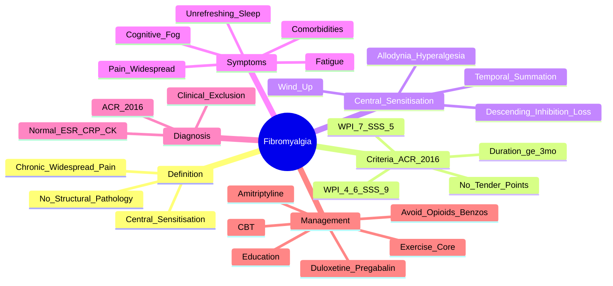

# Fibromyalgia

> [!tip] **FCPS/MRCP Priority: HIGH**
> Fibromyalgia = **central sensitisation syndrome** — **chronic widespread pain + fatigue + unrefreshing sleep + cognitive dysfunction**. **ACR 2016 criteria**: WPI ≥7 & SSS ≥5 OR WPI 4-6 & SSS ≥9; symptoms ≥3 months. **No confirmatory test** — diagnosis clinical. **Multidisciplinary management**: Education → Exercise (core) → CBT → Duloxetine/Pregabalin → Amitriptyline. **Avoid opioids/benzodiazepines**.

---

## Learning Objectives
By the end of this note you should be able to:
- [ ] Apply **ACR 2016 diagnostic criteria** (WPI + SSS, symptoms ≥3 months)
- [ ] Explain **central sensitisation pathophysiology** (wind-up, temporal summation, allodynia, loss of descending inhibition)
- [ ] Differentiate from **inflammatory arthritis (RA, SpA), endocrine (hypothyroid), malignancy, depression, CFS, Lyme, vitamin D deficiency**
- [ ] Select **multidisciplinary management**: Education → Exercise (core) → CBT → Pharmacotherapy (Duloxetine, Pregabalin, low-dose Amitriptyline)
- [ ] **Avoid opioids, benzodiazepines, muscle relaxants** — ineffective and harmful

---

## 1. Definition & Epidemiology

| Feature | Detail |
|---------|--------|
| **Definition** | **Chronic widespread pain** + **central sensitisation** — **no structural/peripheral pathology** |
| **Prevalence** | **2-4%** (higher in women) |
| **Peak Onset** | **30-50 years** |
| **Sex Ratio** | **F:M = 7:1** |
| **Genetics** | Familial aggregation; COMT, SCN9A, TRPV1 polymorphisms |

---

## 2. Pathophysiology — **Central Sensitisation**

```mermaid
flowchart LR
    A[Peripheral Input\n(Nociception)] --> B[Spinal Cord\nDorsal Horn]
    B --> C[**Wind-Up**\nProgressive ↑ response\nto repeated stimuli]
    C --> D[**Temporal Summation**\n↑ pain with repeated\nstimuli at same intensity]
    D --> E[**Loss of Descending\nInhibition**\n↓ serotonin/noradrenaline]
    E --> F[**Impaired Conditioned\nPain Modulation**\n(Diffuse Noxious Inhibitory Controls)]
    F --> G[**Central Sensitisation**\nAllodynia\nHyperalgesia\nWidespread Pain]
    G --> H[**Autonomic/Somatic Symptoms**\nFatigue, Sleep disturbance,\nCognitive dysfunction\nAnxiety/Depression]
```

### Key Central Sensitisation Features
| Feature | Description |
|---------|-------------|
| **Wind-Up** | Progressive increase in dorsal horn neuron response to repeated C-fibre stimulation |
| **Temporal Summation** | Increasing pain perception with repeated identical stimuli |
| **Allodynia** | Pain from non-painful stimulus (light touch, brushing) |
| **Hyperalgesia** | Exaggerated pain response to painful stimulus |
| **Loss of Descending Inhibition** | ↓ Serotonin/noradrenaline → ↓ endogenous pain control |
| **Impaired CPM** | Diffuse Noxious Inhibitory Controls impaired |

---

## 3. Clinical Features

| Domain | Features |
|---------|----------|
| **Pain** | **Chronic widespread** (≥3 months), **axial + 3/4 quadrants**, **bilateral, above & below waist** |
| **Fatigue** | **Profound, unrelieved by rest** — often most disabling |
| **Sleep** | **Unrefreshing**, difficulty initiating/maintaining, **alpha-delta sleep anomaly** |
| **Cognitive** | **"Fibro fog"** — memory lapses, concentration difficulty, word-finding difficulty |
| **Psychiatric** | **Depression, anxiety** (comorbid, not causative) |
| **Somatic** | Headache (tension/migraine), IBS, TMJ dysfunction, dysmenorrhoea, RLS, interstitial cystitis |
| **Examination** | **No objective findings** — no swelling, erythema, synovitis, normal strength/reflexes |

> [!critical] **Fibromyalgia = Clinical Diagnosis (Exclusion)**
> - **No confirmatory test** — normal ESR/CRP, normal CK, normal imaging
> - **Rule out**: inflammatory (RA, SpA), endocrine (thyroid), malignancy, neurological, vitamin D deficiency

---

## 4. Diagnostic Criteria — **ACR 2016 (Fibromyalgia Criteria)**

| Component | Scoring |
|-----------|---------|
| **WPI (Widespread Pain Index)** | 19 body regions (0-19) — patient marks painful areas in past week |
| **SSS (Symptom Severity Scale)** | 0-3 each for: **Fatigue, Unrefreshing sleep, Cognitive symptoms** + **Somatic symptom count** (0-3) |

### Diagnosis
| Criteria | Rule |
|----------|------|
| **Option A** | **WPI ≥7 AND SSS ≥5** |
| **Option B** | **WPI 4-6 AND SSS ≥9** |
| **Duration** | **Symptoms ≥3 months** at similar intensity |
| **Exclusion** | No other disorder explaining symptoms |

> [!important] **ACR 2010 vs 2016**
> - **2010**: Tender point count (≥11/18) + WPI/SSS
> - **2016**: **NO tender points required** — **self-report only** (WPI + SSS)

---

## 5. Differential Diagnosis

| Condition | Distinguishing Features |
|-----------|------------------------|
| **RA / SpA** | **Inflammatory markers ↑**, synovitis, erosions, RF/CCP/HLA-B27 |
| **Hypothyroidism** | **Elevated TSH**, cold intolerance, weight gain, myxoedema |
| **Vitamin D Deficiency** | **Low 25-OH Vit D**, bone pain, proximal myopathy, improves with replacement |
| **Polymyalgia Rheumatica** | **>50y, girdle stiffness >45min, ESR/CRP ↑↑**, dramatic steroid response |
| **SLE** | **ANA+, dsDNA+, renal/skin/CNS**, photosensitivity |
| **CFS/ME** | **Post-exertional malaise** dominant, no widespread pain criteria |
| **Depression** | **Low mood, anhedonia** primary; pain secondary |
| **Lyme Disease** | **Endemic area, EM rash, Borrelia serology+** |
| **Multiple Myeloma** | **Bone pain (focal), anaemia, hypercalcaemia, paraprotein** |
| **Vitamin B12 Deficiency** | **Neuropathy, megaloblastic anaemia, subacute combined degeneration** |

---

## 6. Management — **Multidisciplinary (Stepped Care)**

```mermaid
flowchart TD
    A[Fibromyalgia Diagnosis] --> B[**1. EDUCATION**\nReassurance, pain neuroscience education\nSet realistic expectations]
    B --> C[**2. EXERCISE (CORE)**\nGraded aerobic (walking, swimming)\n+ Resistance training\nStart low, go slow]
    C --> D[**3. CBT / Psychological**\nPain coping, pacing, sleep hygiene\nMindfulness, ACT]
    D --> E[**4. PHARMACOTHERAPY**\nif symptoms persist]
    E --> E1[**Duloxetine 30-60mg daily**\n(SNRI — 1st line)]
    E --> E2[**Pregabalin 150-300mg/day**\nOR **Gabapentin**\n(α2δ ligand — 1st line)]
    E --> E3[**Amitriptyline 10-25mg nocte**\n(low dose, night — sedating)]
    E --> F[**5. NON-PHARM ADJUNCTS**\nHydrotherapy, acupuncture, mindfulness, yoga, tai chi]
    F --> G[**AVOID**\nOpioids, Benzodiazepines, Muscle relaxants\n(No evidence, high harm)]
```

### Pharmacotherapy Details

| Drug | Dose | Mechanism | Key Points |
|------|------|-----------|------------|
| **Duloxetine** | 30mg daily → 60mg daily | **SNRI** (serotonin/noradrenaline reuptake inhibition) | **FDA approved**; nausea, insomnia, sexual dysfunction |
| **Pregabalin** | 75mg BD → 150-300mg/day | **α2δ ligand** (voltage-gated Ca²⁺ channel) | **FDA approved**; dizziness, weight gain, oedema |
| **Gabapentin** | 300mg TDS → 600-1200mg TDS | **α2δ ligand** | Off-label; slower titration; renal dose adjust |
| **Amitriptyline** | 10-25mg nocte | **TCA** (serotonin/noradrenaline + anticholinergic) | **Low dose at night**; anticholinergic SE, sedating |
| **Milnacipran** | 50-100mg BD | **SNRI** | FDA approved (not UK); similar to duloxetine |

> [!warning] **Drugs to AVOID**
> - **Opioids** — no long-term benefit, hyperalgesia, dependence, mortality
> - **Benzodiazepines** — no benefit, dependence, falls, cognitive impairment
> - **Muscle relaxants** (cyclobenzaprine, baclofen) — sedation, no long-term benefit
> - **Corticosteroids** — no role
> - **NSAIDs** — minimal benefit, GI/CV risk

---

## 7. Comorbidities — **Central Sensitivity Syndromes**

| Comorbidity | Prevalence | Shared Mechanism |
|-------------|------------|------------------|
| **IBS** | 30-50% | Visceral hypersensitivity |
| **CFS/ME** | 20-30% | Central sensitisation, fatigue |
| **Migraine** | 30-50% | Central sensitisation, allodynia |
| **TMJ Disorder** | 20-30% | Myofascial pain |
| **Depression/Anxiety** | 40-60% | Shared neurotransmitters (5-HT, NE) |
| **Interstitial Cystitis** | 10-20% | Visceral hypersensitivity |
| **Restless Legs Syndrome** | 15-20% | Dopaminergic, central sensitisation |

---

## 8. FCPS/MRCP High-Yield Summary

| Topic | Key Points |
|-------|------------|
| **Definition** | Chronic widespread pain + **central sensitisation** — **no structural pathology** |
| **ACR 2016 Criteria** | **WPI ≥7 & SSS ≥5** OR **WPI 4-6 & SSS ≥9** (symptoms ≥3 months) — **no tender points needed** |
| **Central Sensitisation** | **Wind-up, temporal summation, allodynia, hyperalgesia, loss of descending inhibition** |
| **Core Symptoms** | **Pain (widespread) + Fatigue + Unrefreshing sleep + Cognitive dysfunction ("fibro fog")** |
| **Comorbidities** | IBS, CFS, migraine, TMJ, depression/anxiety, interstitial cystitis, RLS |
| **Diagnosis** | **Clinical** (ACR 2016 criteria + exclusion); **no confirmatory test**, normal ESR/CRP/CK |
| **Management Hierarchy** | **Education → Exercise (core) → CBT → Duloxetine/Pregabalin → Amitriptyline** |
| **Drugs** | **Duloxetine (SNRI), Pregabalin (α2δ), Amitriptyline (low dose)** — **NO opioids, benzodiazepines** |
| **Multidisciplinary** | Rheumatology + Physio + Psychology + Pain specialist |

---

## 8. Viva Questions (MRCP PACES / FCPS)

| Question | Expected Answer |
|----------|----------------|
| "What are the ACR 2016 criteria for fibromyalgia?" | **WPI ≥7 & SSS ≥5** OR **WPI 4-6 & SSS ≥9**, symptoms ≥3 months. **No tender points required** (2016 criteria). |
| "What is central sensitisation and what are its features?" | **Augmented pain processing** in CNS. Features: **wind-up, temporal summation, allodynia, hyperalgesia, loss of descending inhibition, impaired CPM**. |
| "How do you differentiate fibromyalgia from RA?" | **Fibromyalgia: widespread pain, normal ESR/CRP/CK, no synovitis/erosions, normal exam. RA: inflammatory arthritis, elevated ESR/CRP, +RF/CCP, erosions.** |
| "What is the first-line pharmacological treatment for fibromyalgia?" | **Duloxetine (SNRI) 30-60mg daily** OR **Pregabalin 150-300mg/day** — **1st line**. **Amitriptyline 10-25mg nocte** also used. |
| "Why should opioids be avoided in fibromyalgia?" | **No long-term benefit**, **induce hyperalgesia**, **dependence**, **falls**, **mortality risk** — **guidelines strongly recommend against**. |
| "What is the role of exercise in fibromyalgia?" | **CORE treatment** — **graded aerobic (walking, swimming) + resistance**; **start low, go slow**; improves pain, fatigue, function. |
| "A patient with fibromyalgia has IBS, migraine, and depression. What does this suggest?" | **Central sensitivity syndromes** — **comorbidities share central sensitisation pathophysiology** (IBS: visceral hypersensitivity, migraine: allodynia, depression: shared 5-HT/NE pathways). |
| "What drugs should be avoided in fibromyalgia and why?" | **Opioids (hyperalgesia, dependence), benzodiazepines (dependence, falls), muscle relaxants (sedation), corticosteroids (no role)** — **no evidence of benefit, high harm**. |

---

## 9. Confusions & Mnemonics

| Confusion | Clarification |
|-----------|---------------|
| **Tender Points** | **NOT required in 2016 criteria** (removed from 2010). **Self-report only (WPI + SSS)**. |
| **Fibromyalgia vs CFS/ME** | **CFS/ME = post-exertional malaise** dominant; fibromyalgia = **widespread pain** dominant. Can coexist. |
| **Fibro Fog** | **Cognitive dysfunction** — memory, concentration, word-finding — **not dementia**, reversible. |
| **Amitriptyline Dose** | **Low dose (10-25mg nocte)** — **not antidepressant dose** (75-150mg); sedating, anticholinergic. |
| **Duloxetine vs Pregabalin** | Both 1st line. **Duloxetine** = SNRI (also helps depression); **Pregabalin** = α2δ ligand (also helps neuropathic pain). |
| **Exercise in Fibromyalgia** | **NOT harmful** — **graded, start low, go slow**; core treatment, improves all domains. |

**Mnemonic: ACR 2016 = "WPI + SSS = FIBRO"**
- **WPI** (Widespread Pain Index) 0-19
- **SSS** (Symptom Severity Scale) 0-12
- **≥7 + ≥5** OR **4-6 + ≥9**

**Mnemonic: Central Sensitisation = "WIND-TALL"**
- **WIND**-up
- **T**emporal summation
- **A**llodynia
- **L**oss of descending inhibition
- **L**impaired CPM

**Mnemonic: Symptom Triad = "PAIN-FATIGUE-SLEEP-COG"**
- **PAIN** (widespread)
- **FATIGUE** (profound)
- **SLEEP** (unrefreshing)
- **COG**nitive dysfunction

**Mnemonic: Management = "E-E-C-P-A" (EECPA)**
- **E**ducation
- **E**xercise (core)
- **C**BT
- **P**harmacotherapy (Duloxetine/Pregabalin/Amitriptyline)
- **A**void opioids/benzos

**Mnemonic: Drugs to Avoid = "O-B-M-C"**
- **O**pioids
- **B**enzodiazepines
- **M**uscle relaxants
- **C**orticosteroids

**Mnemonic: Comorbidities = "I-C-M-T-D-I-R"**
- **I**BS
- **C**FS/ME
- **M**igraine
- **T**MJ
- **D**epression/Anxiety
- **I**nterstitial cystitis
- **R**LS

---

## 10. Mind Map



---

## 11. One-Page Revision Card

| Domain | Key Points |
|--------|------------|
| **Definition** | Chronic widespread pain + central sensitisation — **no structural pathology** |
| **Criteria (ACR 2016)** | **WPI ≥7 & SSS ≥5** OR **WPI 4-6 & SSS ≥9**; symptoms ≥3 months; **no tender points** |
| **Central Sensitisation** | Wind-up, temporal summation, allodynia, hyperalgesia, **loss of descending inhibition**, impaired CPM |
| **Core Symptoms** | **Pain (widespread) + Fatigue + Unrefreshing sleep + Cognitive dysfunction ("fibro fog")** |
| **Diagnosis** | Clinical + **ACR 2016** + **exclusion** (normal ESR/CRP/CK, no inflammatory/structural cause) |
| **Management** | **Education → Exercise (core) → CBT → Duloxetine/Pregabalin → Amitriptyline** |
| **Drugs** | **Duloxetine, Pregabalin, Amitriptyline (low dose)** — **NO opioids, benzos, muscle relaxants** |
| **Comorbidities** | IBS, CFS, migraine, TMJ, depression/anxiety, interstitial cystitis, RLS |
| **Multidisciplinary** | Rheumatology + Physio + Psychology + Pain specialist |

---

## 12. Spaced Repetition Trackers

| Review Interval | Date Completed | Confidence (1-5) | Notes |
|-----------------|----------------|------------------|-------|
| 24 hours | | | |
| 7 days | | | |
| 15 days | | | |
| 30 days | | | |
| 90 days | | | |

---

## 13. Self-Test Scorecard

| Section | Score /5 | Last Attempt |
|---------|----------|--------------|
| ACR 2016 Criteria Application | | |
| Central Sensitisation Mechanisms | | |
| Differential Diagnosis | | |
| Pharmacotherapy Selection | | |
| Exercise/CBT Role | | |
| Avoidance of Harmful Drugs | | |
| Viva Questions | | |

---

## Local Navigation
- **Parent Heading**: [[../Soft Tissue Rheumatism and Chronic Pain Syndromes|Soft Tissue Rheumatism and Chronic Pain Syndromes]]
- **Parent Topic Group**: [[Chronic pain syndromes and fibromyalgia]]
- **Chapter Map**: [[../Davidson Chapter 26 - Rheumatology Hierarchy|Rheumatology Hierarchy]]
- **Chapter MOC**: [[../Rheumatology MOC|Rheumatology MOC]]
- **Drug Reference**: [[../../Clinical Approach to Musculoskeletal Disease/Drugs in rheumatology|Drugs in rheumatology]]
- **Related**: [[Chronic widespread pain]] · [[Drugs in rheumatology]]