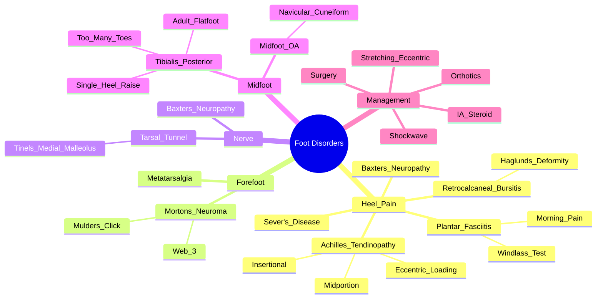

# Foot Disorders

> [!tip] **FCPS/MRCP Priority: HIGH**
> Foot pain = common. **Plantar fasciitis** = most common cause of heel pain (windlass test +ve). **Achilles tendinopathy** (2-6cm above insertion, eccentric loading pain). **Morton's neuroma** (interdigital burning, Mulder's click). **Retrocalcaneal bursitis** (Haglund's deformity). **Tarsal tunnel** (Tinel's at medial malleolus). **Midfoot OA** (tibialis posterior dysfunction → adult acquired flatfoot).

---

## Learning Objectives
By the end of this note you should be able to:
- [ ] Differentiate causes of **heel pain**: plantar fasciitis, Achilles tendinopathy, retrocalcaneal bursitis, Haglund's, Baxter's nerve
- [ ] Diagnose **Morton's neuroma** (interdigital burning, Mulder's click) and **tarsal tunnel syndrome** (Tinel's at medial malleolus)
- [ ] Apply **windlass test** for plantar fasciitis and **eccentric loading** for Achilles tendinopathy
- [ ] Differentiate **midfoot OA** (tibialis posterior dysfunction) from inflammatory arthritis
- [ ] Select imaging: US (dynamic, plantar fascia, Achilles), MRI (gold standard for tears, neuroma, tarsal tunnel)
- [ ] Select management: orthotics, stretching, eccentric loading, IA steroid, shockwave, surgery indications

---

## 1. Heel Pain — Most Common Presentations

| Condition | Location | Key Features |
|-----------|----------|--------------|
| **Plantar Fasciitis** | **Medial calcaneal tubercle** | **Worst first steps morning/after rest**, **windlass test +ve**, tight Achilles |
| **Achilles Tendinopathy** | **2-6cm above insertion** | **Morning stiffness**, **eccentric loading pain**, thickening/nodules |
| **Retrocalcaneal Bursitis** | **Posterior heel, above insertion** | **Haglund's deformity** (pump bump), pain on dorsiflexion |
| **Achilles Insertional Tendinopathy** | **At insertion** | Pain at insertion, calcific deposits, Haglund's |
| **Baxter's Neuropathy** | Medial heel, **abductor digiti minimi** | **Numbness lateral foot**, Tinel's at medial heel |
| **Sever's Disease** (Children) | Calcaneal apophysis | Active children, **squeeze test +ve**, X-ray fragmentation |

> [!critical] **Plantar Fasciitis = most common cause of heel pain** — **windlass test = diagnostic**

---

## 2. Plantar Fasciitis — **Most Common Heel Pain**

| Feature | Detail |
|---------|--------|
| **Aetiology** | Repetitive microtrauma → degenerative fasciosis (not true inflammation) |
| **Risk Factors** | Obesity, prolonged standing, tight Achilles, pes planus/cavus, inappropriate footwear |
| **Clinical** | **Worst first steps morning/after rest**, **tenderness medial calcaneal tubercle**, **windlass test +ve** |
| **Windlass Test** | **Passive dorsiflexion of toes** → tightens plantar fascia → **reproduces heel pain** |
| **Imaging** | US: **fascial thickening >4mm**, hypoechoic, loss of fibrillar pattern; MRI: thickening, oedema |
| **X-ray** | **Heel spur** (inferior calcaneus) — **incidental**, not cause of pain |

> [!critical] **Windlass Test = Passive dorsiflexion of toes → tightens plantar fascia → reproduces heel pain**

### Management
| Step | Treatment |
|------|-----------|
| **1. Conservative** | **Stretching (plantar fascia, Achilles)**, **orthotics** (medial arch support, heel cup), **night splints**, **weight loss**, **activity modification** |
| **2. Pharmacological** | NSAIDs, **topical NSAIDs**, **avoid opioids** |
| **3. Injection** | **Corticosteroid IA** (medial calcaneal, ultrasound-guided) — short-term relief; **risk: fat pad atrophy, rupture** |
| **4. Shockwave (ESWT)** | **Evidence for pain/function** — 3-5 sessions |
| **5. Surgery** | **Refractory >6-12mo** → **partial plantar fascia release** (open/endoscopic) |

---

## 3. Achilles Tendinopathy

| Feature | **Mid-portion (Non-insertional)** | **Insertional** |
|---------|----------------------------------|-----------------|
| **Location** | **2-6cm above insertion** | **At insertion** |
| **Pathology** | **Degenerative (tendinosis) — non-inflammatory** | Degenerative + **enthesopathy** |
| **Clinical** | **Morning stiffness**, **eccentric loading pain**, **thickening/nodules** | Pain at insertion, **Haglund's deformity**, calcific deposits |
| **Exam** | **Tenderness 2-6cm above insertion**, **thickening**, **pain on eccentric loading** | **Pain at insertion**, pain on dorsiflexion, Haglund's |
| **Imaging** | US: **thickening, loss of fibrillar pattern, neovascularisation**; MRI: signal change | US/MRI: Insertional thickening, calcific deposits, retrocalcaneal bursitis |
| **Differential** | Retrocalcaneal bursitis, insertional tendinopathy, Haglund's | Mid-portion tendinopathy, retrocalcaneal bursitis |

> [!critical] **Eccentric loading = hallmark of Achilles tendinopathy pain**; **Morning stiffness = inflammatory component**

### Management
| Phase | Treatment |
|-------|-----------|
| **1. Acute** | **Relative rest**, NSAIDs, heel lift, activity modification |
| **2. Rehab (Core)** | **Alfredson's eccentric loading protocol** (heel drops off step, 3×15 ×2/day, 12 weeks) — **gold standard** |
| **3. Adjuncts** | **Shockwave (ESWT)** — evidence for pain/function; **GTN patches**; **PRP** (limited evidence) |
| **4. Insertional** | Same + **Haglund's excision** if refractory; **avoid steroid IA** (rupture risk) |
| **5. Surgery** | **Refractory >6mo** → debridement, tendon transfer, gastrocnemius recession |

---

## 3. Retrocalcaneal Bursitis & Haglund's Deformity

| Condition | Key Features |
|-----------|--------------|
| **Retrocalcaneal Bursitis** | **Posterior heel pain above insertion**, **palpable swelling**, **pain on dorsiflexion**, **Haglund's deformity** |
| **Haglund's Deformity** | **"Pump bump"** — **posterior superior calcaneal prominence**, **retrocalcaneal bursitis + Achilles insertional tendinopathy** |
| **Calcific Tendinitis** | Calcium hydroxyapatite deposition in Achilles tendon |

| Feature | Detail |
|---------|--------|
| **Imaging** | X-ray: **Haglund's (posterior superior calcaneal prominence)**; MRI: bursitis, tendon thickening |
| **Management** | NSAIDs, **heel lift**, **open-back shoes**, **IA steroid bursa** (avoid Achilles injection), **Haglund's excision + Achilles repair** if refractory |

---

## 4. Morton's Neuroma

| Feature | Detail |
|---------|--------|
| **Definition** | **Perineural fibrosis** of common plantar digital nerve (not true neuroma) |
| **Location** | **3rd webspace (most common) > 2nd webspace** |
| **Clinical** | **Interdigital burning/neuropathic pain**, **radiates to toes**, **Mulder's click** (palpable click on transverse compression), **relieved by removing shoes** |
| **Exam** | **Webspace tenderness**, **Mulder's click** (thumb dorsally, index plantarly, compress), **Tinel's at webspace** |
| **Imaging** | **US: hypoechoic mass in webspace**; MRI: **neuroma (T1/T2 intermediate)** |
| **Differential** | Metatarsalgia, MTP synovitis, stress fracture, tarsal tunnel |

> [!critical] **Mulder's click = palpable click on transverse compression of forefoot** — pathognomonic

### Management
| Step | Treatment |
|------|-----------|
| **1. Conservative** | **Wide toe-box shoes**, **metatarsal pad** (offload webspace), **activity modification** |
| **2. Injection** | **Corticosteroid IA** (webspace, ultrasound-guided) — **70-80% success** |
| **3. Ablation** | **Alcohol sclerosis**, **radiofrequency ablation** |
| **4. Surgery** | **Refractory** → **neurectomy** (dorsal approach) — risk: numbness, stump neuroma |

---

## 5. Tarsal Tunnel Syndrome

| Feature | Detail |
|---------|--------|
| **Definition** | **Compression of posterior tibial nerve** under flexor retinaculum (tarsal tunnel) |
| **Anatomy** | **Posterior tibial nerve, artery, vein, tibialis posterior, flexor digitorum longus, flexor hallucis longus** (Tom, Dick, And Very Nervous Harry) |
| **Clinical** | **Burning/tingling sole**, **Tinel's at medial malleolus**, **numbness plantar foot**, **weakness toe flexion** (late) |
| **Provocative Tests** | **Tinel's at medial malleolus**, **dorsiflexion-eversion** (increases tunnel pressure) |
| **Imaging** | **MRI: nerve thickening, oedema**; US: nerve cross-sectional area |
| **Nerve Conduction** | **Prolonged distal latency**, slowed conduction velocity |
| **Differential** | Plantar fasciitis, Baxter's neuropathy, L5/S1 radiculopathy, diabetic neuropathy |

### Management
| Step | Treatment |
|------|-----------|
| **1. Conservative** | **Orthotics** (medial arch support), **avoid compression**, **activity modification** |
| **2. Pharmacological** | **Gabapentin/Pregabalin**, **amitriptyline**, **duloxetine** |
| **3. Injection** | **Corticosteroid IA** (tarsal tunnel, US-guided) |
| **5. Surgery** | **Refractory** → **tarsal tunnel release** (open/endoscopic) |

---

## 6. Midfoot OA & Tibialis Posterior Dysfunction

| Condition | Key Features |
|-----------|--------------|
| **Tibialis Posterior Dysfunction** | **Adult acquired flatfoot** — **medial arch collapse**, **too many toes sign** (view from behind), **pain medial ankle/arch**, **inability to single heel raise**, **tibialis posterior tendon insetional tendinopathy/tear** |
| **Midfoot OA** | **Navicular/1st cuneiform**, collapse of medial arch, **pain midfoot**, **bony prominence** (dorsal), **stiffness** |
| **Spring Ligament Insufficiency** | Contributes to flatfoot, medial arch collapse |

| Imaging | Findings |
|---------|----------|
| **Weight-bearing X-ray** | **Loss of medial arch**, talonavicular uncoverage, talar head uncovering, **1st metatarsal dorsiflexion** |
| **MRI/US** | **Tibialis posterior tendinopathy/tear**, spring ligament tear |

### Management
| Step | Treatment |
|------|-----------|
| **1. Conservative** | **Orthotics** (medial arch support, UCBL), **ankle brace** (Arizona brace), **weight loss** |
| **2. PT** | **Tibialis posterior strengthening**, intrinsic foot muscles, calf stretch |
| **3. Injection** | **IA steroid** (tibialis posterior sheath, naviculocuneiform joint) |
| **4. Surgery** | **Stage I-II**: tendon transfer (FDL transfer) + medial displacement calcaneal osteotomy + spring ligament repair; **Stage III-IV**: triple arthrodesis |

---

## 7. FCPS/MRCP High-Yield Summary

| Topic | Key Points |
|-------|------------|
| **Plantar Fasciitis** | **Most common heel pain**; **worst first steps morning**; **medial calcaneal tenderness**; **windlass test +ve**; **tight Achilles** |
| **Achilles Tendinopathy** | **2-6cm above insertion**; **morning stiffness**; **eccentric loading pain**; **thickening/nodules** |
| **Retrocalcaneal Bursitis** | **Pain above insertion**; **Haglund's deformity**; **pain on dorsiflexion** |
| **Morton's Neuroma** | **Interdigital (3rd webspace) burning**; **Mulder's click**; **relieved by removing shoes** |
| **Tarsal Tunnel** | **Sole burning/tingling**; **Tinel's at medial malleolus**; **Tibial nerve compression** |
| **Windlass Test** | **Passive toe dorsiflexion → reproduces heel pain** = plantar fasciitis |
| **Eccentric Loading** | **Alfredson's protocol** (heel drops off step, 3×15×2/day, 12 weeks) = **gold standard for Achilles tendinopathy** |
| **Morton's Neuroma** | **3rd webspace**, **Mulder's click**, **IA steroid 1st line** |
| **Tibialis Posterior Dysfunction** | **Adult acquired flatfoot**, **too many toes sign**, **single heel raise unable** |
| **Tarsal Tunnel** | **Tinel's at medial malleolus**, sole numbness, tibial nerve compression |

---

## 8. Viva Questions (MRCP PACES / FCPS)

| Question | Expected Answer |
|----------|----------------|
| "What is the windlass test and what does a positive test indicate?" | **Passive dorsiflexion of the toes** → tightens plantar fascia → **reproduces heel pain** = **positive for plantar fasciitis**. |
| "How do you differentiate plantar fasciitis from Achilles tendinopathy?" | **Plantar fasciitis**: medial calcaneal pain, worst first steps, windlass +ve. **Achilles tendinopathy**: 2-6cm above insertion, eccentric loading pain, thickening. |
| "What is the classic treatment for Achilles tendinopathy?" | **Alfredson's eccentric loading protocol**: heel drops off step, 3×15 reps, twice daily, 12 weeks. **Gold standard**. |
| "A patient has burning pain in the 3rd webspace, worse in tight shoes, relieved by removing shoes. Examination reveals a click on transverse compression of the forefoot. Diagnosis?" | **Morton's neuroma** (interdigital neuroma, perineural fibrosis). **Mulder's click = pathognomonic**. |
| "What is the Tinel's sign at the medial malleolus and what does it indicate?" | **Tapping over medial malleolus → tingling in sole** = **Tarsal tunnel syndrome** (posterior tibial nerve compression). |
| "How do you differentiate plantar fasciitis from Baxter's neuropathy?" | **Plantar fasciitis**: medial calcaneal tenderness, windlass +ve. **Baxter's**: medial heel pain, **abductor digiti minimi wasting**, **numbness lateral foot**, Tinel's medial heel. |
| "What is the windlass mechanism and its relevance to plantar fasciitis?" | **Toe dorsiflexion → plantar fascia tightens → elevates arch**. In plantar fasciitis, this **reproduces pain** at medial calcaneal insertion. |
| "What is Haglund's deformity and how does it relate to Achilles pathology?" | **Posterior superior calcaneal prominence ("pump bump")** → causes **retrocalcaneal bursitis** and **insertional Achilles tendinopathy**. |
| "A patient has medial ankle pain, inability to perform single heel raise, and 'too many toes' sign from behind. Diagnosis?" | **Tibialis posterior dysfunction (Stage II adult acquired flatfoot)**. **Management: orthotics, PT, FDL transfer + medial displacement calcaneal osteotomy if progressive.** |
| "What is the 'too many toes' sign?" | **View from behind: >2 toes visible lateral to heel** = forefoot abduction due to tibialis posterior dysfunction. |

---

## 9. Confusions & Mnemonics

| Confusion | Clarification |
|-----------|---------------|
| **Plantar Fasciitis vs Heel Spur** | **Heel spur = incidental** on X-ray; **Plantar fasciitis = clinical diagnosis** (windlass test). Spur ≠ cause of pain. |
| **Mid-portion vs Insertional Achilles** | **Mid-portion**: 2-6cm above insertion, eccentric loading pain. **Insertional**: at insertion, Haglund's, pain on dorsiflexion. |
| **Morton's Neuroma vs Metatarsalgia** | **Morton's**: interdigital burning, **Mulder's click**, neuroma on US. **Metatarsalgia**: diffuse forefoot pain, callus, no click. |
| **Tarsal Tunnel vs Plantar Fasciitis** | **Tarsal tunnel**: Tinel's at medial malleolus, sole numbness/tingling. **Plantar fasciitis**: medial heel pain, windlass +ve. |
| **Tibialis Posterior Dysfunction** | **Stage I**: tenosynovitis; **II**: flexible flatfoot (single heel raise fails); **III**: rigid flatfoot; **IV**: ankle valgus. |
| **Eccentric Loading Protocol** | **Heel drops off step**, 3×15, twice daily, **12 weeks**, progressive load. **Gold standard** for Achilles tendinopathy. |

**Mnemonic: Heel Pain = "P-A-B-B-S"**
- **P**lantar fasciitis (most common)
- **A**chilles tendinopathy
- **B**ursitis (retrocalcaneal)
- **B**axter's neuropathy
- **S**ever's disease (children)

**Mnemonic: Windlass Test = "TOES UP = PAIN"**
- **T**oes
- **O**nly
- **E**xtend (dorsiflex)
- **S** = **Pain** at heel

**Mnemonic: Achilles = "ALFREDSON = ECCENTRIC"**
- **A**lfredson
- **L**oad
- **F**orce
- **R**epeat
- **E**ccentric
- **D**aily
- **S**tep
- **O**n
- **N**step

**Mnemonic: Morton's = "MULDER'S CLICK"**
- **M**ulder's
- **C**lick (transverse compression)
- **L**ateral (3rd webspace)
- **I**nterdigital
- **C**lick
- **K** (click)

**Mnemonic: Tarsal Tunnel = "TOM DICK AND VERY NERVOUS HARRY"**
- **T**ibialis posterior
- **D**igitorum longus
- **A**rtery (posterior tibial)
- **V**ein
- **N**erve (posterior tibial)
- **H**allucis longus

**Mnemonic: Morton's = "3RD WEB, BURNING, MULDER'S"**
- **3RD** webspace (most common)
- **BURNING** neuropathic pain
- **MULDER'S** click

**Mnemonic: Tibialis Posterior = "TOO MANY TOES"**
- **T**oo
- **M**any
- **T**oes (sign from behind)

---

## 10. Mind Map

---

## 11. One-Page Revision Card

| Condition | Key Test | Key Feature |
|-----------|----------|-------------|
| **Plantar Fasciitis** | **Windlass test +ve** | **Worst first steps morning**, medial calcaneal tenderness |
| **Achilles Tendinopathy** | **Eccentric loading pain** | **2-6cm above insertion**, morning stiffness, thickening |
| **Retrocalcaneal Bursitis** | Pain on dorsiflexion, Haglund's | Pain above insertion, pump bump |
| **Morton's Neuroma** | **Mulder's click** | Interdigital burning (3rd webspace), relieved by removing shoes |
| **Tarsal Tunnel** | **Tinel's at medial malleolus** | Sole burning/numbness, tibial nerve compression |
| **Tibialis Posterior** | **Single heel raise fails**, too many toes sign | Adult acquired flatfoot, medial arch collapse |
| **Eccentric Loading** | **Heel drops off step, 3×15×2/day, 12 weeks** | Alfredson's protocol — gold standard for Achilles |
| **Morton's Neuroma** | **Mulder's click** | 3rd webspace, interdigital burning |
| **Haglund's** | Posterior superior calcaneal prominence | Pump bump, retrocalcaneal bursitis + insertional tendinopathy |

---

## 12. Spaced Repetition Trackers

| Review Interval | Date Completed | Confidence (1-5) | Notes |
|-----------------|----------------|------------------|-------|
| 24 hours | | | |
| 7 days | | | |
| 15 days | | | |
| 30 days | | | |
| 90 days | | | |

---

## 13. Self-Test Scorecard

| Section | Score /5 | Last Attempt |
|--------|----------|--------------|
| Windlass Test Application | | |
| Achilles Tendinopathy Management | | |
| Morton's Neuroma Diagnosis | | |
| Tarsal Tunnel vs Plantar Fasciitis | | |
| Tibialis Posterior Dysfunction Staging | | |
| Eccentric Loading Protocol | | |
| Viva Questions | | |

---

## Local Navigation
- **Parent Heading**: [[../Soft Tissue Rheumatism and Chronic Pain Syndromes|Soft Tissue Rheumatism and Chronic Pain Syndromes]]
- **Parent Topic Group**: [[Regional soft tissue rheumatism]]
- **Chapter Map**: [[../Davidson Chapter 26 - Rheumatology Hierarchy|Rheumatology Hierarchy]]
- **Chapter MOC**: [[../Rheumatology MOC|Rheumatology MOC]]
- **Drug Reference**: [[../../Clinical Approach to Musculoskeletal Disease/Drugs in rheumatology|Drugs in rheumatology]]
- **Related**: [[Hip and trochanteric bursitis]] · [[Knee disorders]] · [[Shoulder disorders]] · [[Regional soft tissue rheumatism]]