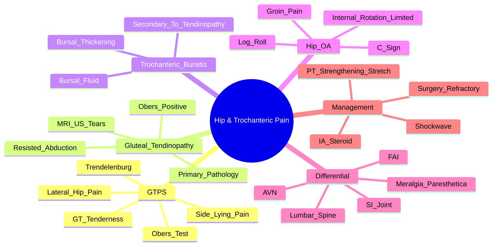

# Hip and Trochanteric Bursitis (Greater Trochanteric Pain Syndrome)

> [!tip] **FCPS/MRCP Priority: HIGH**
> **GTPS = Greater Trochanteric Pain Syndrome** = trochanteric bursitis + gluteal tendinopathy. **Lateral hip pain, tenderness over greater trochanter, pain on side-lying**. **Differentiate from hip OA (C sign, limited IR), lumbar spine, meralgia paresthetica**. **Ober's test (ITB tightness), Trendelenburg sign (gluteal weakness)**. **Gluteal tendinopathy = underlying pathology**; bursitis often secondary.

---

## Learning Objectives
By the end of this note you should be able to:
- [ ] Define **GTPS** and differentiate **trochanteric bursitis**, **gluteal tendinopathy**, **ITB syndrome**
- [ ] Apply clinical tests: **tenderness over greater trochanter, side-lying pain, Ober's test, Trendelenburg sign, resisted abduction**
- [ ] Differentiate **GTPS** from **hip OA** (C sign, limited IR), **lumbar spine**, **meralgia paresthetica**, **hip joint pathology**
- [ ] Apply imaging: **US (dynamic, bursa, tendons)**, **MRI (gold standard for tendinopathy/tears)**
- [ ] Select management: **physiotherapy (gluteal strengthening, ITB stretch)**, **IA steroid**, **shockwave**, **surgery (bursectomy, tendon repair)** refractory

---

## 1. Definitions & Terminology

| Term | Definition |
|------|------------|
| **GTPS (Greater Trochanteric Pain Syndrome)** | **Umbrella term** for lateral hip pain — includes trochanteric bursitis, gluteal tendinopathy, ITB friction syndrome |
| **Trochanteric Bursitis** | Inflammation of the **trochanteric bursa** (subgluteus maximus, subgluteus medius, subgluteus minimus bursae) |
| **Gluteal Tendinopathy** | **Primary pathology** — degenerative tendinopathy of **gluteus medius/minimus** tendons at greater trochanter insertion |
| **ITB Syndrome** | **Iliotibial band friction** over greater trochanter → lateral knee/hip pain |

> [!critical] **GTPS = Umbrella term**; **Gluteal tendinopathy = primary pathology**; **Bursitis often secondary** to tendinopathy

---

## 2. Clinical Features

| Condition | Key Features |
|-----------|-------------|
| **GTPS (Classic)** | **Lateral hip pain**, **tenderness over greater trochanter**, **pain on side-lying** (night pain), **pain on resisted abduction**, **Ober's test +ve (ITB tightness)**, **Trendelenburg sign** (gluteal weakness) |
| **Trochanteric Bursitis** | Tenderness over greater trochanter, pain side-lying, pain on resisted abduction — **inflammation of bursa** |
| **Gluteal Tendinopathy** | **Primary pathology** — pain on **resisted abduction**, **Ober's test +ve**, MRI/US shows **tendinopathy/tears** |
| **ITB Syndrome** | Lateral knee/hip pain, **Ober's test +ve**, snapping sensation over greater trochanter |

> [!critical] **Gluteal tendinopathy = underlying cause**; **Bursitis often secondary** — treat tendinopathy primarily

---

## 3. Differential Diagnosis — **Critical for FCPS/MRCP**

| Condition | Key Features | Differentiator |
|-----------|-------------|----------------|
| **GTPS** | **Lateral hip pain**, GT tenderness, pain side-lying, Ober's +ve, Trendelenburg | **Lateral** pain, **GT tenderness** |
| **Hip OA** | **Groin pain** (C sign), **limited internal rotation (earliest)**, referred knee pain, log roll test | **Groin** pain, **limited IR** |
| **Lumbar Spine (L3-L4)** | **Radiating pain** to lateral hip/thigh, **radiculopathy** (sensory/motor/reflex changes), **Spurling's, SLR** | **Back pain, radicular signs** |
| **SI Joint Dysfunction** | **Buttock/PSIS pain**, **FABER +ve**, **Fortin finger test** | **Buttock** pain |
| **Meralgia Paresthetica** | **Burning/numbness anterolateral thigh**, **no motor deficit**, Tinel's at ASIS | **Pure sensory**, **no hip pain** |
| **Femoroacetabular Impingement (FAI)** | Young active, **groin pain**, **limited flexion + IR**, CAM/PINCER on imaging | **Young**, **limited flexion+IR** |
| **Avascular Necrosis (AVN)** | Steroid/alcohol/sickle cell, **groin/thigh pain**, **limited ROM**, crescent sign X-ray, **MRI double line sign** | **Risk factors**, **crescent sign** |
| **Septic Arthritis** | Acute, febrile, toxic, **joint held in flexion/abduction/external rotation**, **emergency** | **Emergency**, systemic signs |
| **Iliopsoas Bursitis** | Groin pain, **snapping hip**, pain on resisted flexion | **Snapping**, groin |

---

## 3. Clinical Assessment — **Key Tests**

| Test | Technique | Positive = |
|------|-----------|------------|
| **GT Tenderness** | Palpate greater trochanter | **GTPS / Trochanteric bursitis / Gluteal tendinopathy** |
| **Side-Lying Pain** | Lie on affected side | **GTPS / Bursitis** (pain prevents lying on side) |
| **Resisted Abduction** | Resist hip abduction | **Gluteal tendinopathy / Bursitis** (pain/weakness) |
| **Ober's Test** | **Lateral decubitus, affected side up; flex knee 90°, extend hip, allow leg to adduct** | **ITB tightness** (leg fails to adduct to table) → **GTPS / ITB syndrome** |
| **Trendelenburg Sign** | Patient stands on one leg | **Pelvic drop on contralateral side** = **gluteal weakness** |
| **Log Roll Test** | Passive internal/external rotation in supine | **Hip OA** (limited/painful IR) |
| **C Sign** | Patient cups hand over hip (thumb anterior, fingers posterior) | **Hip OA** (groin pain) |
| **FABER Test** | Flexion, ABduction, External Rotation | **SI joint / Hip pathology** |
| **Thomas Test** | Supine, flex contralateral hip → observe ipsilateral thigh | **Hip flexion contracture / psoas tightness** |
| **Hip Flexion + Internal Rotation** | 90° flexion + maximal IR | **FAI / Hip OA** (pain/limitation) |

> [!critical] **Key Differentiators**
> - **GTPS**: **Lateral** pain, GT tenderness, **side-lying pain**, **Ober's +ve**
> - **Hip OA**: **Groin** pain, **C sign**, **limited IR (earliest)**, log roll +
> - **Meralgia Paresthetica**: **Anterolateral thigh numbness**, **no motor deficit**, Tinel's at ASIS

---

## 4. Imaging

| Modality | Indication | Key Findings |
|----------|------------|--------------|
| **X-ray** | First-line | Hip OA (JSN, osteophytes, sclerosis), FAI (CAM/PINCER), AVN (crescent sign) |
| **Ultrasound** | **Dynamic, bursa, tendons** | **Bursal thickening/fluid, gluteal tendinopathy/tears, ITB thickening**, dynamic impingement |
| **MRI** | **Gold standard for tendinopathy/tears** | **Gluteal tendinopathy/tears, bursitis, bone marrow oedema, labral tears, FAI (CAM/PINCER)** |
| **MRI (Double Line Sign)** | AVN | **Double line sign** on T2 (inner hyperintense = granulation, outer hypointense = sclerosis) |
| **CT** | Bony detail for FAI, pre-op planning | CAM/PINCER morphology |

> [!important] **US = Dynamic, bursa/tendons, cheaper**; **MRI = Gold standard for tendinopathy/tears**

---

## 4. Management

### Conservative (1st Line)
| Condition | Physiotherapy | Pharmacological | Injection |
|-----------|---------------|-----------------|-----------|
| **GTPS / Gluteal Tendinopathy** | **Gluteal strengthening (clamshells, side-lying abduction, bridges), ITB stretch (Ober's), core stability, gait retraining** | NSAIDs | **GT bursa steroid** (diagnostic + therapeutic) |
| **ITB Syndrome** | **ITB stretch (Ober's), gluteal strengthening, foam rolling, gait retraining** | NSAIDs | **ITB bursa steroid** |
| **Trochanteric Bursitis** | Same as GTPS | NSAIDs | **Bursa steroid** (diagnostic + therapeutic) |
| **Hip OA** | **GLA:D programme** (neuromuscular exercise), weight loss, gait aids | NSAIDs, **paracetamol** | **IA steroid** (short-term), **hyaluronic acid** (limited) |
| **FAI** | **Core stability, gluteal strengthening, hip mobility, activity modification** | NSAIDs | **IA steroid** (diagnostic) |
| **Iliopsoas Bursitis** | Hip flexor stretch, core stability | NSAIDs | **IA steroid (psoas sheath)** |
| **Meralgia Paresthetica** | Weight loss, loose clothing, avoid compression | **Gabapentin/Pregabalin**, amitriptyline | **Lateral femoral cutaneous nerve block** |

### Interventional / Surgical
| Condition | Indication | Procedure |
|-----------|------------|-----------|
| **GTPS Refractory** | Failed 3-6mo conservative | **Bursectomy (open/arthroscopic) + ITB release + gluteal tendon repair** |
| **Gluteal Tendon Tear** | Full-thickness tear, failed conservative | **Arthroscopic/Open repair** |
| **Hip OA (End-stage)** | Failed conservative, severe pain/disability | **Total Hip Replacement (THR)** |
| **FAI** | Failed conservative, symptomatic | **Hip arthroscopy** (CAM resection, labral repair) |
| **AVN (Early)** | Pre-collapse (Ficat I-II) | **Core decompression ± bone graft** |
| **AVN (Late)** | Post-collapse (Ficat III-IV) | **THR** |

---

## 5. FCPS/MRCP High-Yield Summary

| Topic | Key Points |
|-------|------------|
| **GTPS** | **Lateral hip pain**, **GT tenderness**, **side-lying pain**, **Ober's +ve (ITB tightness)**, **Trendelenburg** (gluteal weakness) |
| **Gluteal Tendinopathy** | **Primary pathology**; **resisted abduction pain**, **Ober's +ve**, **MRI/US tendinopathy** |
| **Hip OA** | **Groin pain (C sign)**, **limited internal rotation (earliest)**, referred knee pain, log roll +ve |
| **Iliopsoas Bursitis** | Groin pain, **snapping hip**, pain on resisted flexion |
| **Meralgia Paresthetica** | **Anterolateral thigh burning/numbness**, **no motor deficit**, Tinel's at ASIS |
| **FAI** | Young active, **groin pain**, **limited flexion + IR**, CAM/PINCER on imaging |
| **AVN** | Steroid/alcohol/sickle cell, **groin/thigh pain**, **crescent sign X-ray**, **MRI double line sign** |
| **Differentiation** | **GTPS = lateral hip, GT tenderness, side-lying**; **Hip OA = groin, C sign, limited IR** |
| **Management** | **Physio first** (gluteal strengthening, ITB stretch); **IA steroid** diagnostic/therapeutic; **shockwave** evidence; **surgery refractory** |

---

## 6. Viva Questions (MRCP PACES / FCPS)

| Question | Expected Answer |
|----------|----------------|
| "A 55yo woman presents with lateral hip pain, worse lying on that side, tenderness over greater trochanter, pain on resisted abduction. Ober's test positive. Diagnosis?" | **Greater Trochanteric Pain Syndrome (GTPS)** — likely **gluteal tendinopathy** with secondary trochanteric bursitis. |
| "How do you differentiate GTPS from hip osteoarthritis?" | **GTPS: lateral hip pain, GT tenderness, side-lying pain, preserved hip ROM. Hip OA: groin pain (C sign), limited internal rotation (earliest), log roll +ve, X-ray JSN/osteophytes.** |
| "What is Ober's test and what does a positive test indicate?" | **Lateral decubitus, affected side up, knee flexed 90°, extend hip, allow leg to adduct**. **Positive = ITB tightness** (leg fails to adduct to table) — seen in GTPS, ITB syndrome. |
| "What is the Trendelenburg sign and what does it indicate?" | **Patient stands on one leg → pelvic drop on contralateral side**. **Positive = gluteal medius weakness** (GTPS, superior gluteal nerve palsy, hip OA, DDH). |
| "How do you differentiate meralgia paresthetica from GTPS?" | **Meralgia = anterolateral thigh burning/numbness, pure sensory, no motor deficit, Tinel's at ASIS. GTPS = lateral hip pain, GT tenderness, side-lying pain, motor weakness possible.** |
| "What is the management of GTPS?" | **1st line: Physiotherapy** (gluteal strengthening — clamshells, side-lying abduction, bridges; ITB stretch via Ober's; core stability). **2nd line: Subgluteal/trochanteric bursa steroid injection** (diagnostic + therapeutic). **3rd line: Shockwave therapy** (evidence for pain/function). **Refractory: Bursectomy + ITB release + gluteal tendon repair.** |
| "What is femoroacetabular impingement (FAI) and how is it classified?" | **CAM** = femoral head-neck asphericity (abnormal bump); **PINCER** = acetabular overcoverage; **Mixed** = both. Young active adults, groin pain, limited flexion + IR. |
| "What is the classic X-ray finding in avascular necrosis of the femoral head?" | **Crescent sign** (subchondral fracture line) on frog-leg lateral; **MRI double line sign** (T2: inner hyperintense granulation, outer hypointense sclerosis). |
| "How do you differentiate trochanteric bursitis from gluteal tendinopathy?" | **Often coexist**; **tendinopathy = primary pathology** (resisted abduction pain, Ober's +ve, tendon thickening/tears on US/MRI). **Bursitis = secondary** (bursal thickening/fluid on US). |
| "What is the management of meralgia paresthetica?" | **Conservative**: weight loss, loose clothing, avoid compression. **Pharmacological**: gabapentin/pregabalin, amitriptyline. **Interventional**: lateral femoral cutaneous nerve block. Surgery (decompression) rarely needed. |

---

## 9. Confusions & Mnemonics

| Confusion | Clarification |
|-----------|---------------|
| **GTPS vs Hip OA** | GTPS = **lateral hip, GT tenderness, side-lying pain**. Hip OA = **groin (C sign), limited IR, log roll +ve**. |
| **Trochanteric Bursitis vs Gluteal Tendinopathy** | **Tendinopathy = primary pathology** (resisted abduction, Ober's +ve, tendon tears). **Bursitis = secondary** (bursal fluid on US). |
| **GTPS vs Lumbar Radiculopathy** | GTPS = **local GT tenderness, no radicular signs**. Lumbar = **radiating pain, sensory/motor/reflex changes, SLR/Spurling's +ve**. |
| **Meralgia Paresthetica** | **Pure sensory** (anterolateral thigh numbness, Tinel's at ASIS), **no motor deficit**, no hip pain. |
| **FAI vs Hip OA** | FAI = **young active, CAM/PINCER, limited flexion+IR**. Hip OA = **older, JSN, osteophytes, limited IR earliest.** |
| **AVN Risk Factors** | **Steroid, alcohol, sickle cell, trauma, decompression sickness, Gaucher, CAIR.** |

**Mnemonic: GTPS = "TENDER SIDE OBER TRENDELENBURG"**
- **TENDER** over greater trochanter
- **SIDE**-lying pain
- **OBER**'s test +ve (ITB tightness)
- **TRENDELENBURG** sign (gluteal weakness)

**Mnemonic: Hip OA = "GROIN C-SIGN LOG ROLL"**
- **GROIN** pain
- **C-SIGN** (patient cups hand over hip)
- **LOG ROLL** test +ve (limited/painful IR)
- **INTERNAL ROTATION** limited (earliest)

**Mnemonic: FAI = "CAM PINCER"**
- **CAM** = femoral head-neck bump (abnormal)
- **PINCER** = acetabular overcoverage
- **MIXED** = both

**Mnemonic: AVN = "STEROID ALCOHOL SICKLE"**
- **STEROID** use
- **ALCOHOL** excess
- **SICKLE** cell disease
- **Creascent sign** X-ray
- **Double line** MRI

**Mnemonic: Meralgia = "ANTEROLATERAL THIGH NUMB"**
- **ANTEROLATERAL** thigh
- **THIGH** burning/numbness
- **NUMB** = sensory only, no motor deficit

**Mnemonic: Ober's Test = "LATERAL, KNEE 90, EXTEND, ADDUCT"**
- **LATERAL** decubitus (affected side up)
- **KNEE** flexed 90°
- **EXTEND** hip
- **ADDUCT** leg → fails to drop = **positive** (ITB tight)

**Mnemonic: Trendelenburg = "STAND ONE LEG → PELVIS DROPS OTHER SIDE"**
- **STAND** on one leg
- **PELVIS DROPS** on contralateral side = **positive** (gluteal weakness)

---

## 10. Mind Map

---

## 11. One-Page Revision Card

| Condition | Key Test | Key Feature |
|-----------|----------|-------------|
| **GTPS** | GT tenderness + side-lying pain + Ober's +ve | Lateral hip pain, GT tenderness, preserved hip ROM |
| **Gluteal Tendinopathy** | Resisted abduction + Ober's +ve | Primary pathology; tendon thickening/tears on US/MRI |
| **Hip OA** | **Log roll (limited IR)** + **C sign** | Groin pain, limited IR (earliest), referred knee pain |
| **Meralgia Paresthetica** | Anterolateral thigh numbness, Tinel's at ASIS | Pure sensory, no motor deficit |
| **FAI** | Limited flexion + IR, CAM/PINCER on imaging | Young active, groin pain |
| **AVN** | Crescent sign X-ray, MRI double line sign | Steroid/alcohol/sickle cell risk factors |
| **Iliopsoas Bursitis** | Snapping hip, groin pain, resisted flexion pain | IA steroid psoas sheath |
| **Meralgia Paresthetica** | Anterolateral thigh numbness, Tinel's at ASIS | Pure sensory, no motor deficit |

---

## 12. Spaced Repetition Trackers

| Review Interval | Date Completed | Confidence (1-5) | Notes |
|-----------------|----------------|------------------|-------|
| 24 hours | | | |
| 7 days | | | |
| 15 days | | | |
| 30 days | | | |
| 90 days | | | |

---

## 13. Self-Test Scorecard

| Section | Score /5 | Last Attempt |
|--------|----------|--------------|
| GTPS vs Hip OA Differentiation | | |
| Clinical Tests (Ober's, Trendelenburg) | | |
| Imaging Interpretation | | |
| Management Algorithms | | |
| Differential Diagnosis | | |
| Viva Questions | | |

---

## Local Navigation
- **Parent Heading**: [[../Soft Tissue Rheumatism and Chronic Pain Syndromes|Soft Tissue Rheumatism and Chronic Pain Syndromes]]
- **Parent Topic Group**: [[Regional soft tissue rheumatism]]
- **Chapter Map**: [[../Davidson Chapter 26 - Rheumatology Hierarchy|Rheumatology Hierarchy]]
- **Chapter MOC**: [[../Rheumatology MOC|Rheumatology MOC]]
- **Drug Reference**: [[../../Clinical Approach to Musculoskeletal Disease/Drugs in rheumatology|Drugs in rheumatology]]
- **Related**: [[Shoulder disorders]] · [[Knee disorders]] · [[Foot disorders]] · [[Regional soft tissue rheumatism]]
---

> Auto-generated study sections for "Soft Tissue Rheumatism and Chronic Pain Syndromes" — Ch 25: Rheumatology & Bone Disease.

## Flashcards (14 generated)

- Q: What is the definition of Soft Tissue Rheumatism and Chronic Pain Syndromes?
  A: # Hip and Trochanteric Bursitis (Greater Trochanteric Pain Syndrome)
- Q: What is GTPS (Greater Trochanteric Pain Syndrome) of Soft Tissue Rheumatism and Chronic Pain Syndromes?
  A: Umbrella term for lateral hip pain — includes trochanteric bursitis, gluteal tendinopathy, ITB friction syndrome
- Q: What is Trochanteric Bursitis of Soft Tissue Rheumatism and Chronic Pain Syndromes?
  A: Inflammation of the trochanteric bursa (subgluteus maximus, subgluteus medius, subgluteus minimus bursae)
- Q: What is Gluteal Tendinopathy of Soft Tissue Rheumatism and Chronic Pain Syndromes?
  A: Primary pathology — degenerative tendinopathy of gluteus medius/minimus tendons at greater trochanter insertion
- Q: What is ITB Syndrome of Soft Tissue Rheumatism and Chronic Pain Syndromes?
  A: Iliotibial band friction over greater trochanter → lateral knee/hip pain
- Q: What is GTPS of Soft Tissue Rheumatism and Chronic Pain Syndromes?
  A: Lateral hip pain, GT tenderness, side-lying pain, Ober's +ve (ITB tightness), Trendelenburg (gluteal weakness)
- Q: What is Gluteal Tendinopathy of Soft Tissue Rheumatism and Chronic Pain Syndromes?
  A: Primary pathology; resisted abduction pain, Ober's +ve, MRI/US tendinopathy
- Q: What is Hip OA of Soft Tissue Rheumatism and Chronic Pain Syndromes?
  A: Groin pain (C sign), limited internal rotation (earliest), referred knee pain, log roll +ve
- Q: What is Iliopsoas Bursitis of Soft Tissue Rheumatism and Chronic Pain Syndromes?
  A: Groin pain, snapping hip, pain on resisted flexion
- Q: What is Meralgia Paresthetica of Soft Tissue Rheumatism and Chronic Pain Syndromes?
  A: Anterolateral thigh burning/numbness, no motor deficit, Tinel's at ASIS
- Q: What is FAI of Soft Tissue Rheumatism and Chronic Pain Syndromes?
  A: Young active, groin pain, limited flexion + IR, CAM/PINCER on imaging
- Q: What is AVN of Soft Tissue Rheumatism and Chronic Pain Syndromes?
  A: Steroid/alcohol/sickle cell, groin/thigh pain, crescent sign X-ray, MRI double line sign
- Q: What is Differentiation of Soft Tissue Rheumatism and Chronic Pain Syndromes?
  A: GTPS = lateral hip, GT tenderness, side-lying; Hip OA = groin, C sign, limited IR
- Q: How is Soft Tissue Rheumatism and Chronic Pain Syndromes managed?
  A: Physio first (gluteal strengthening, ITB stretch); IA steroid diagnostic/therapeutic; shockwave evidence; surgery refractory

## MCQs (1 generated)

1. **Which of the following best describes Soft Tissue Rheumatism and Chronic Pain Syndromes?**
   A. **# Hip and Trochanteric Bursitis (Greater Trochanteric Pain Syndrome)**
   B. An unrelated condition not matching the clinical picture of Soft Tissue Rheumatism and Chronic Pain Syndromes
   C. A complication seen late in the disease course of Soft Tissue Rheumatism and Chronic Pain Syndromes
   D. A condition that mimics Soft Tissue Rheumatism and Chronic Pain Syndromes but has a different underlying cause

## SBA Questions (1 generated)

1. A patient with suspected Soft Tissue Rheumatism and Chronic Pain Syndromes presents with: GTPS (Greater Trochanteric Pain Syndrome) — Umbrella term for lateral hip pain — includes trochanteric bursitis, gluteal tendinopathy, ITB friction syndrome; Trochanteric Bursitis — Inflammation of the trochanteric bursa (subgluteus maximus, subgluteus medius, subgluteus minimus bursae); Gluteal Tendinopathy — Primary pathology — degenerative tendinopathy of gluteus medius/minimus tendons at greater trochanter insertion. What is the most likely diagnosis?
   A. **Soft Tissue Rheumatism and Chronic Pain Syndromes**
   B. A condition that mimics Soft Tissue Rheumatism and Chronic Pain Syndromes but is not the same entity
   C. A complication of Soft Tissue Rheumatism and Chronic Pain Syndromes rather than the primary diagnosis
   D. An unrelated condition in the same clinical category as Soft Tissue Rheumatism and Chronic Pain Syndromes

