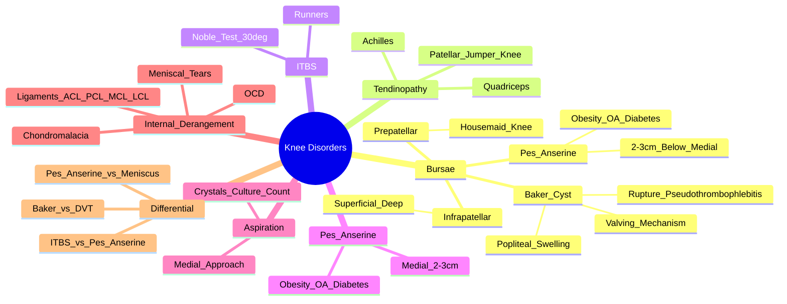

# Knee Disorders

> [!tip] **FCPS/MRCP Priority: CRITICAL**
> **Knee = most commonly affected joint in OA**. **Prepatellar bursitis** (housemaid's knee), **Pes anserine bursitis** (medial, obesity/OA), **Baker's cyst** (communicates with joint, rupture = pseudothrombophlebitis). **Patellar tendinopathy** (jumper's knee). **ITBS** (runners, Noble's test at 30° flexion). **Aspiration: medial approach** (avoid infrapatellar fat pad).

---

## Learning Objectives
By the end of this note you should be able to:
- [ ] Differentiate **prepatellar**, **infrapatellar**, **pes anserine**, **Baker's cyst** — locations, risk factors, clinical features
- [ ] Recognise **Patellar tendinopathy** (jumper's knee) vs **Quadriceps tendinopathy**
- [ ] Diagnose **ITBS** (runners, Noble's test at 30° flexion) and **ITBS vs Pes anserine bursitis**
- [ ] Apply **aspiration technique**: **medial approach** (avoid infrapatellar fat pad), send for crystals, culture, cell count
- [ ] Manage **Baker's cyst rupture** (pseudothrombophlebitis) vs DVT
- [ ] Recognise **meniscal tears** (mechanical symptoms, McMurray's/Apley's) and **ligament injuries** (ACL/PCL/MCL/LCL)

---

## 1. Bursae Around the Knee

| Bursa | Location | Common Name | Risk Factors |
|-------|----------|-------------|-------------|
| **Prepatellar** | **Anterior to patella** | **Housemaid's knee** | **Kneeling** (carpet layers, plumbers, roofers) |
| **Superficial Infrapatellar** | Below patella, **anterior to patellar tendon** | **Clergyman's knee** | Kneeling, prolonged pressure |
| **Deep Infrapatellar** | **Deep to patellar tendon** | — | Less common |
| **Suprapatellar** | **Above patella, communicates with joint** | — | Communicates with knee joint (often part of effusion) |
| **Pes Anserine** | **Anteromedial, 2-3cm below joint line** | **Pes anserine bursitis** | **Obesity, OA knee, diabetes**, overuse |
| **Semimembranosus/Gastrocnemius (Baker's Cyst)** | **Popliteal fossa**, communicates with joint | **Baker's cyst** | **OA, RA, meniscal tears**, valving mechanism |

---

## 2. Key Bursitides — **High-Yield**

### Prepatellar Bursitis (Housemaid's Knee)
| Feature | Detail |
|---------|--------|
| **Location** | **Anterior, fluctuant swelling** over patella |
| **Risk** | **Kneeling occupations** (carpet layers, plumbers, roofers, gardeners) |
| **Clinical** | Anterior swelling, warm, tender, **ROM usually preserved** |
| **Septic** | **Hot, erythematous, fever** — **emergency aspirate** |
| **Imaging** | US: fluid collection anterior to patella |

### Infrapatellar Bursitis (Superficial/Deep)
| Type | Location | Key Feature |
|------|----------|-------------|
| **Superficial** | **Anterior to patellar tendon** | **Clergyman's knee** (kneeling) |
| **Deep** | **Deep to patellar tendon** | Less common, may mimic patellar tendinopathy |

### Pes Anserine Bursitis — **High-Yield**
| Feature | Detail |
|---------|--------|
| **Anatomy** | **Confluence of Sartorius, Gracilis, Semitendinosus** (Pes anserinus = "goose foot") |
| **Location** | **Anteromedial, 2-3cm below joint line** |
| **Risk Factors** | **Obesity**, **OA knee**, **diabetes**, overuse, valgus deformity |
| **Clinical** | **Medial knee pain**, **tenderness 2-3cm below joint line (medial)**, pain on stairs, night pain |
| **Differential** | **Medial meniscal tear** (joint line tenderness), **MCL sprain**, **medial compartment OA** |

> [!critical] **Pes anserine = 2-3cm below joint line medially**; **Obesity + OA + Diabetes = classic triad**

### Baker's Cyst (Popliteal Cyst)
| Feature | Detail |
|---------|--------|
| **Definition** | **Synovial fluid-filled cyst** in popliteal fossa, **communicates with knee joint** via valving mechanism |
| **Aetiology** | **Underlying knee pathology**: **OA (most common), RA, meniscal tears, ACL tears** |
| **Mechanism** | **Valving mechanism** — fluid enters cyst during knee extension, trapped during flexion |
| **Clinical** | **Popliteal fossa swelling**, **palpable fullness**, may cause **knee stiffness**, **calf pain if ruptured** |
| **Rupture** | **Pseudothrombophlebitis** — **calf swelling, pain, erythema**, **Homan's sign +ve**, **mimics DVT** |
| **Imaging** | **US/MRI**: fluid collection in popliteal fossa, **communication with joint** |
| **Management** | **Treat underlying cause** (OA/RA/tear); **aspiration + steroid** if symptomatic; **surgery rarely needed** |

> [!critical] **Baker's cyst rupture = pseudothrombophlebitis** — **calf swelling/pain, Homan's +ve, mimics DVT** — **US/DVT screen first**

---

## 2. Tendinopathies

### Patellar Tendinopathy (Jumper's Knee)
| Feature | Detail |
|---------|--------|
| **Location** | **Inferior pole of patella** (proximal patellar tendon) |
| **Demographics** | **Jumping sports** (basketball, volleyball), **runners** |
| **Clinical** | **Inferior patellar pole tenderness**, **pain on loading** (jumping, squatting, stairs) |
| **Staging** | 1: pain after activity; 2: pain during + after; 3: pain during, after, at rest |
| **Imaging** | US/MRI: **tendon thickening, hypoechoic areas, neovascularisation** |
| **Management** | **Eccentric decline squats** (Alfredson protocol), **shockwave**, **IA steroid** (caution), **surgery refractory** |

### Quadriceps Tendinopathy
| Feature | Detail |
|---------|--------|
| **Location** | **Superior pole of patella** (quadriceps tendon insertion) |
| **Clinical** | **Superior patellar pole tenderness**, pain on resisted extension |
| **Management** | Similar to patellar — **eccentric decline squats**, shockwave, IA steroid (caution) |

---

## 3. Iliotibial Band Syndrome (ITBS) — **Runners**

| Feature | Detail |
|---------|--------|
| **Definition** | **ITB friction over lateral femoral epicondyle** at ~30° flexion |
| **Demographics** | **Runners, cyclists**, long-distance |
| **Clinical** | **Lateral knee pain**, **worse at 30° flexion**, **pain at Noble's compression test** |
| **Noble's Test** | **Compress lateral femoral epicondyle at 30° flexion** → **pain** |
| **Ober's Test** | **ITB tightness** (leg fails to adduct in lateral decubitus) |
| **Imaging** | MRI: ITB thickening, oedema over lateral femoral epicondyle |
| **Management** | **ITB stretch (Ober's), gluteal strengthening, foam rolling, gait retraining**, **IA steroid** (bursa), **shockwave**, **surgery (ITB release) refractory** |

> [!critical] **ITBS = lateral knee pain at 30° flexion**; **Noble's test at 30° flexion = diagnostic**

---

## 4. Pes Anserine Bursitis — **High-Yield**

| Feature | Detail |
|---------|--------|
| **Location** | **Anteromedial, 2-3cm below joint line** (confluence of Sartorius, Gracilis, Semitendinosus) |
| **Risk Factors** | **Obesity, OA knee, diabetes**, valgus deformity, overuse |
| **Clinical** | **Medial knee pain**, **tenderness 2-3cm below joint line (medial)**, pain on stairs, night pain |
| **Differential** | **Medial meniscal tear** (joint line tenderness), **MCL sprain**, **medial compartment OA** |
| **Management** | **Physiotherapy** (quadriceps/hamstring strengthening, stretching), **weight loss**, **IA steroid** (pes anserine bursa), **shockwave**, **surgery rare** |

> [!critical] **Pes anserine = 2-3cm below joint line medially**; **Obesity + OA + Diabetes = classic triad**

---

## 5. Baker's Cyst & Rupture

| Feature | Detail |
|---------|--------|
| **Popliteal swelling**, communicates with joint | **Valving mechanism** (fluid in on extension, trapped on flexion) |
| **Associated with** | **OA, RA, meniscal tears, ACL tears** |
| **Rupture** | **Pseudothrombophlebitis** — calf swelling, pain, erythema, **Homan's sign +ve**, mimics DVT |
| **Diagnosis** | **US/Doppler for DVT first** — if negative, consider cyst rupture |
| **Management** | **Treat underlying cause**; **aspiration + steroid** if symptomatic; **surgery rarely needed** |

---

## 6. Aspiration Technique — **Critical for FCPS/MRCP**

| Parameter | Detail |
|-----------|--------|
| **Approach** | **Medial approach** (avoid infrapatellar fat pad, neurovascular bundle) |
| **Needle** | 18-21G, 3-5cm |
| **Site** | **Medial to patella**, just above joint line, **1-2cm medial to patella** |
| **Direction** | **Posterolateral**, aiming for joint space |
| **Send For** | **Cell count + differential**, **crystals (polarised)**, **culture (aerobic/anaerobic/TB/fungal)**, **glucose** |
| **Contraindications** | Overlying cellulitis, coagulopathy, prosthetic joint (specialist only) |

> [!critical] **Medial approach = standard**; **Avoid lateral** (peroneal nerve risk), **avoid patellar tendon** (rupture risk)

### Synovial Fluid Analysis — Quick Reference

| Finding | **Septic** | **Inflammatory (RA, gout)** | **Non-inflammatory (OA)** |
|---------|------------|----------------------------|---------------------------|
| **WBC** | **>50,000** | 2,000-50,000 | <2,000 |
| **Neutrophils** | **>90%** | 50-70% | <25% |
| **Crystals** | None | **MSU (needle, -ve birefringence), CPPD (rhomboid, +ve birefringence)** | None |
| **Glucose** | **<40 mg/dL** or **<50% serum** | Low | Normal |
| **Culture** | **Positive** | Sterile | Sterile |

---

## 7. Other Key Knee Pathologies

| Condition | Key Features |
|-----------|--------------|
| **Patellar Tendinopathy (Jumper's Knee)** | **Inferior patellar pole tenderness**, jumping/loading pain, US thickening |
| **Quadriceps Tendinopathy** | **Superior patellar pole tenderness**, resisted extension pain |
| **ITBS** | **Lateral knee pain at 30° flexion**, **Noble's test** (compress lateral femoral epicondyle at 30° flexion) |
| **Chondromalacia Patellae** | **Anterior knee pain**, crepitus, **patellar compression test +ve**, climbing stairs pain |
| **Meniscal Tears** | **Mechanical symptoms** (locking, clicking, giving way), **McMurray's test**, **Apley's grind**, joint line tenderness |
| **ACL Injury** | **Anterior drawer, Lachman, pivot shift** — instability, haemarthrosis |
| **PCL Injury** | **Posterior drawer test** — posterior tibial translation |
| **MCL/LCL Injury** | **Valgus/Varus stress test** — medial/lateral opening |
| **Osteochondritis Dissecans** | Adolescent, femoral condyle, locking/catching, loose body |
| **Osgood-Schlatter** | Adolescent, tibial tuberosity tenderness, fragmentation on X-ray |

---

## 8. FCPS/MRCP High-Yield Summary

| Topic | Key Points |
|-------|------------|
| **Prepatellar Bursitis** | **Anterior fluctuant swelling**, **kneeling occupation** (housemaid's knee) |
| **Pes Anserine Bursitis** | **Medial, 2-3cm below joint line**, **obesity/OA/diabetes** risk factors |
| **Baker's Cyst** | **Popliteal swelling**, **communicates with joint**, **rupture = pseudothrombophlebitis** (calf swelling, Homan's +ve) |
| **Patellar Tendinopathy** | **Inferior pole tenderness**, jumping/loading pain |
| **ITBS** | **Runners**, lateral knee pain at **30° flexion**, **Noble's test** (compress lateral femoral epicondyle at 30°) |
| **Pes Anserine** | **2-3cm below joint line medial**, obesity/OA/diabetes risk factors |
| **Aspiration** | **Medial approach** (avoid infrapatellar fat pad), send for crystals, culture, cell count |
| **Synovial Fluid** | **Septic: WBC >50k, >90% neutrophils**; **Gout: MSU needles (-ve birefringence)**; **CPPD: rhomboids (+ve birefringence)** |
| **Meniscal Tears** | McMurray's, Apley's, joint line tenderness |
| **Ligament Injuries** | ACL (Lachman, pivot shift), PCL (posterior drawer), MCL/LCL (valgus/varus stress) |

---

## 8. Viva Questions (MRCP PACES / FCPS)

| Question | Expected Answer |
|----------|----------------|
| "A 60yo obese diabetic woman has medial knee pain, tenderness 2cm below joint line medially. Diagnosis and risk factors?" | **Pes anserine bursitis**. **Risk factors: obesity, OA knee, diabetes**. Tenderness 2-3cm below joint line medially. |
| "What is the classic presentation of Baker's cyst rupture?" | **Pseudothrombophlebitis** — **calf swelling, pain, erythema, Homan's sign +ve** — mimics DVT. **US Doppler first to exclude DVT**. |
| "How do you aspirate a knee joint and what do you send the fluid for?" | **Medial approach** (1-2cm medial to patella, above joint line, posterolateral direction). **Send for**: cell count, crystals (polarised), culture (aerobic/anaerobic/TB/fungal), glucose. |
| "What is the difference between prepatellar and infrapatellar bursitis?" | **Prepatellar**: anterior to patella (housemaid's knee, kneeling). **Infrapatellar**: below patella, superficial (clergyman's knee) or deep (deep to patellar tendon). |
| "What is pes anserine bursitis and its risk factors?" | **Anteromedial knee pain, tenderness 2-3cm below joint line**. **Risk factors: obesity, OA knee, diabetes, valgus deformity**. |
| "What is the Noble's test for ITBS?" | **Compress lateral femoral epicondyle at 30° flexion** — pain at lateral femoral epicondyle = positive for ITBS. |
| "How do you aspirate a knee and what approach do you use?" | **Medial approach** (1-2cm medial to patella, above joint line, posterolateral direction). **Avoid lateral** (peroneal nerve) and **patellar tendon** (rupture risk). |
| "What is the classic presentation of a Baker's cyst rupture?" | **Calf swelling, pain, erythema, Homan's sign** — **pseudothrombophlebitis**. **US Doppler first to exclude DVT**. |
| "What is the Pes anserinus and what muscles form it?" | **Confluence of Sartorius, Gracilis, Semitendinosus** (Pes anserinus = "goose foot"). |
| "How do you differentiate septic from aseptic prepatellar bursitis?" | **Septic**: hot, erythematous, fever, **WBC >50,000, Gram stain +ve**. **Aseptic**: fluctuant, non-tender, normal inflammatory markers. |

---

## 9. Confusions & Mnemonics

| Confusion | Clarification |
|-----------|---------------|
| **Prepatellar vs Infrapatellar** | **Prepatellar** = anterior to patella (housemaid's knee). **Infrapatellar** = below patella, superficial (clergyman's) or deep (deep to tendon). |
| **Baker's Cyst vs DVT** | **Baker's rupture = pseudothrombophlebitis** (calf swelling, Homan's +ve). **US Doppler DVT first** — if negative, treat as cyst rupture. |
| **Pes Anserine vs Medial Meniscus** | **Pes anserine**: 2-3cm **below joint line**, medial. **Medial meniscus**: **joint line tenderness**, McMurray's +ve. |
| **ITBS vs Pes Anserine** | ITBS = **lateral knee pain at 30° flexion**, Noble's test. Pes anserine = **medial pain 2-3cm below joint line**. |
| **Aspiration Approach** | **Medial approach** (avoid infrapatellar fat pad, neurovascular). **Lateral approach = peroneal nerve risk**. |
| **Septic vs Crystal Bursitis** | Septic = hot, fever, WBC >50k, Gram +ve. Crystal = MSU/CPPD crystals, no fever, normal WBC. |

**Mnemonic: Pes Anserine = "PES = 2-3CM BELOW MEDIAL"**
- **P**es
- **E**nserine
- **S** = 2-3cm below joint line medial

**Mnemonic: Baker's Cyst = "POPLITEAL VALVE RUPTURE = PSEUDO-DVT"**
- **P**opliteal fossa
- **V**alving mechanism
- **R**upture = **PSEUDO**thrombophlebitis

**Mnemonic: Aspiration = "MEDIAL APPROACH"**
- **M**edial approach
- **E**vade infrapatellar fat pad
- **D**o not go lateral
- **I**nject/aspirate posterolateral
- **A**bove joint line
- **L**ook for crystals, culture, cell count

**Mnemonic: Pes Anserinus = "SARTORIUS GRACILIS SEMITENDINOSUS"**
- **S**artorius
- **G**racilis
- **S**emitendinosus = **Pes anserinus** ("goose foot")

**Mnemonic: Baker's Cyst Rupture = "CALF PAIN HOMANS"**
- **CALF** swelling
- **PAIN**
- **HOMANS** sign +ve
- **DVT** negative on US

**Mnemonic: ITBS = "NOBLES TEST 30 DEGREES"**
- **NOBLES** test
- **30** degrees flexion
- **LATERAL** femoral epicondyle compression

**Mnemonic: Patellar Tendinopathy = "JUMPER'S KNEE"**
- **J**umping
- **U**mper pole
- **M**orning stiffness
- **P**ain on loading
- **E**ccentric decline squats
- **R**efractory → surgery

**Mnemonic: Aspiration Fluid = "CRYSTAL CULTURE COUNT"**
- **C**rystals (polarised)
- **C**ulture (aerobic/anaerobic)
- **C**ount (cells + differential)

---

## 10. Mind Map

---

## 11. One-Page Revision Card

| Condition | Key Test | Key Feature |
|-----------|----------|-------------|
| **Prepatellar Bursitis** | Anterior fluctuant swelling | Kneeling occupation (housemaid's knee) |
| **Pes Anserine Bursitis** | **Tenderness 2-3cm below joint line medial** | Obesity, OA, diabetes |
| **Baker's Cyst** | Popliteal swelling, communicates with joint | Rupture = **pseudothrombophlebitis** (calf swelling, Homan's sign) |
| **Patellar Tendinopathy** | Inferior pole tenderness | Jumping/loading pain |
| **ITBS** | **Noble's test at 30° flexion** | Runners, lateral knee pain at 30° flexion |
| **Pes Anserine** | **2-3cm below joint line medial** | Obesity + OA + diabetes |
| **Aspiration** | **Medial approach** | Avoid infrapatellar fat pad |
| **Fluid Analysis** | **Septic: WBC>50k, >90% neutrophils**; **Gout: MSU -ve birefringence**; **CPPD: rhomboids +ve birefringence** |
| **Meniscal Tears** | McMurray's, Apley's, joint line tenderness | |
| **Ligaments** | ACL (Lachman, pivot shift), PCL (posterior drawer), MCL/LCL (valgus/varus) | |

---

## 12. Spaced Repetition Trackers

| Review Interval | Date Completed | Confidence (1-5) | Notes |
|-----------------|----------------|------------------|-------|
| 24 hours | | | |
| 7 days | | | |
| 15 days | | | |
| 30 days | | | |
| 90 days | | | |

---

## 13. Self-Test Scorecard

| Section | Score /5 | Last Attempt |
|--------|----------|--------------|
| Bursae Locations & Risk Factors | | |
| Baker's Cyst Rupture | | |
| Aspiration Technique | | |
| Synovial Fluid Interpretation | | |
| ITBS vs Pes Anserine | | |
| Pes Anserine vs Medial Meniscus | | |
| Viva Questions | | |

---

## Local Navigation
- **Parent Heading**: [[../Soft Tissue Rheumatism and Chronic Pain Syndromes|Soft Tissue Rheumatism and Chronic Pain Syndromes]]
- **Parent Topic Group**: [[Regional soft tissue rheumatism]]
- **Chapter Map**: [[../Davidson Chapter 26 - Rheumatology Hierarchy|Rheumatology Hierarchy]]
- **Chapter MOC**: [[../Rheumatology MOC|Rheumatology MOC]]
- **Drug Reference**: [[../../Clinical Approach to Musculoskeletal Disease/Drugs in rheumatology|Drugs in rheumatology]]
- **Related**: [[Hip and trochanteric bursitis]] · [[Foot disorders]] · [[Shoulder disorders]] · [[Elbow disorders]]