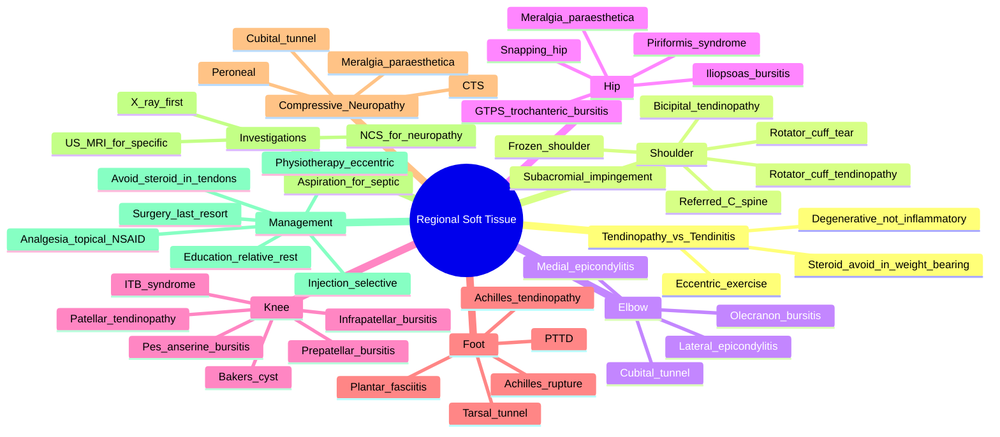

# Regional Soft Tissue Rheumatism — Integrated Overview

> [!tip] **FCPS/MRCP Priority: MEDIUM-HIGH**
> Regional soft tissue disorders are the **most common cause of musculoskeletal pain in adults** and a frequent PACES/viva topic. Must know: **rotator cuff vs frozen shoulder**, **lateral vs medial epicondylitis**, **GTPS (trochanteric bursitis)**, **bursitis at the knee** (prepatellar, infrapatellar, pes anserine), **plantar fasciitis (worst first steps in morning)**, and **Achilles tendinopathy (eccentric loading is gold standard)**. Always **exclude red flags**: septic, fracture, malignancy, referred pain, inflammatory arthritis.

---

## Learning Objectives
By the end of this note you should be able to:
- [ ] Diagnose and differentiate **common regional soft tissue disorders** at shoulder, elbow, hip, knee, and foot
- [ ] Perform **specific provocative tests** (painful arc, Hawkins-Kennedy, Cozen, Speed, Ober, FADIR, McMurray, windlass)
- [ ] Distinguish **tendinopathy, bursitis, enthesitis, and intra-articular pathology**
- [ ] Recognise **red flags** (septic, fracture, malignancy, cauda equina, inflammatory arthritis)
- [ ] Apply **evidence-based management** (rest, activity modification, physiotherapy, injection, surgery)
- [ ] Counsel on **prognosis** and **prevention** of common regional disorders (workplace ergonomics, exercise, weight)

---

## 1. Overview — Soft Tissue Anatomy and Pathology
### Anatomical Substrates
| Tissue | Function | Common Pathology |
|--------|----------|------------------|
| **Tendon** | Muscle-to-bone force transmission | **Tendinopathy** (degenerative), tenosynovitis, rupture |
| **Bursa** | Reduce friction between moving structures | **Bursitis** (subacromial, olecranon, trochanteric, prepatellar, pes anserine, iliopsoas) |
| **Enthesis** | Tendon/ligament insertion into bone | **Enthesitis** (mechanical, seronegative SpA) |
| **Fascia** | Connective tissue support | **Plantar fasciitis**, iliotibial band syndrome |
| **Muscle** | Force generation, joint stability | Strain, tear, myofascial pain |
| **Ligament** | Joint stability | Sprain, rupture |
| **Nerve** | Sensory/motor | Entrapment (CTS, ulnar at elbow, meralgia paraesthetica) |
| **Capsule** | Joint enclosure | Capsulitis (frozen shoulder) |

### Common Pathological Patterns
| Pattern | Mechanism | Examples |
|---------|-----------|----------|
| **Tendinopathy** | **Overuse → degenerative change** (not classic inflammation) | Rotator cuff, tennis/golfer's elbow, Achilles, patellar |
| **Bursitis** | **Friction, trauma, infection, systemic disease** | Subacromial, trochanteric, olecranon, prepatellar, pes anserine |
| **Enthesitis** | **Mechanical or autoimmune** (SpA) | Achilles, plantar fascia (SpA: dactylitis, sausage digit) |
| **Capsulitis** | **Capsular inflammation + fibrosis** | Frozen shoulder, adhesive capsulitis |
| **Compressive neuropathy** | **Entrapment** | Carpal tunnel, ulnar neuropathy, meralgia paraesthetica |

> [!important] **"Tendinitis" is Mostly Misnamed**
> Histology of chronic tendon pain shows **degeneration, neovascularisation, disorganised collagen** — not acute inflammation. Use **tendinopathy**, not tendinitis. NSAIDs offer short-term pain relief only; **load management is curative**.

---

## 2. Shoulder — Most Complex Regional Joint
### Differential by Pain Location
| Region | Likely Diagnosis | Test |
|--------|------------------|------|
| **Anterior + bicipital groove** | **Bicipital tendinopathy**, OA, instability | Speed's, Yergason's, apprehension |
| **Lateral / deltoid** | **Rotator cuff**, subacromial bursitis | Painful arc, Hawkins-Kennedy, Neer, drop arm |
| **Posterior** | Posterior capsule, scapular dyskinesis, C4-C5 referred | Scapular assistance test |
| **Diffuse + stiffness** | **Frozen shoulder** (capsulitis) | Global restriction (active = passive), ER most limited |
| **Referred** | C-spine, cardiac, diaphragm (phrenic — C3-5) | Spurling's, ECG |

### Rotator Cuff — Subacromial Impingement Spectrum
| Stage | Pathology | Management |
|-------|-----------|-----------|
| **1. Tendinopathy** | Reversible oedema, haemorrhage (young overhead athletes) | Rest, ice, NSAID, physiotherapy, **avoid injections** |
| **2. Partial tear** | Fibrosis, tendinosis | PT (rotator cuff strengthening), activity modification, IA steroid (subacromial) |
| **3. Full-thickness tear** | Tendon discontinuity | **Acute traumatic in young**: surgical repair. **Chronic degenerative in elderly**: PT first; repair if refractory |
| **4. Rotator cuff arthropathy** | Cuff tear + glenohumeral OA | **Reverse total shoulder arthroplasty** (RSA) |

#### Specific Tests
| Test | Structure | Positive |
|------|-----------|----------|
| **Painful arc (60-120°)** | Supraspinatus, subacromial bursa | Pain in mid-arc |
| **Hawkins-Kennedy** | Subacromial impingement | Pain on forced IR in 90° flexion |
| **Neer impingement sign** | Subacromial impingement | Pain on passive FF (scapula stabilised) |
| **Empty can (Jobe)** | Supraspinatus | Pain/weakness on resisted elevation in 90° abduction + IR |
| **Drop arm** | Supraspinatus | Arm cannot be slowly lowered from full abduction |
| **External rotation lag** | Infraspinatus | Cannot hold arm in ER |
| **Lift-off (Gerber)** | Subscapularis | Cannot lift hand off back |
| **Belly-press** | Subscapularis | Cannot press belly with palm |

### Frozen Shoulder (Adhesive Capsulitis) — Recall
| Feature | Detail |
|---------|--------|
| **Demographics** | F > M 3:1, 40-60y, **diabetes (5×)**, thyroid disease, post-stroke/MI, post-mastectomy |
| **Phases** | Painful (2-9mo) → adhesive (4-12mo) → resolution (5-24mo); total 12-36mo |
| **Exam** | **Active = passive** restriction; **ER most limited** (capsular pattern) |
| **Imaging** | Plain X-ray normal; MRI: capsular thickening, no rotator cuff tear |
| **Management** | NSAIDs, **intra-articular steroid** (early, hydrodilatation), gentle mobilisation; **arthrolysis** (refractory) |
| **Differential** | Rotator cuff tear (active < passive), OA (loss of passive + crepitus), septic (red, hot, fever) |

---

## 3. Elbow — Epicondylitis and Bursitis
### Lateral Epicondylitis ("Tennis Elbow")
| Feature | Detail |
|---------|--------|
| **Pathology** | **Common extensor origin** (ECRB) tendinopathy; **degenerative**, not inflammatory |
| **Epidemiology** | **30-50y**; dominant arm; 1-3% adults; not just racquet sports (repetitive gripping, computer use) |
| **Symptoms** | **Lateral elbow pain** radiating to forearm; weak grip |
| **Tests** | **Cozen's** (resisted wrist extension + radial deviation → pain), **Maudsley's** (resisted middle finger extension) |
| **Imaging** | Usually clinical; ultrasound shows ECRB thickening/neovessels; MRI if unclear |
| **Management** | **Physiotherapy (eccentric exercises)**; counterforce brace; activity modification; **NSAIDs short-term**; corticosteroid injection (short-term benefit only, **avoid repeated**); PRP (controversial); **surgical release (refractory, 5%)** |
| **Prognosis** | **Self-limiting in 80-90%** over 6-24 months |

### Medial Epicondylitis ("Golfer's Elbow")
- **Common flexor origin** tendinopathy (PT, FCR)
- **Medial elbow pain**; weak grip
- **Resisted wrist flexion + ulnar deviation** → pain
- **Differential**: **Ulnar neuropathy at elbow** (Tinel at cubital tunnel, +/- medial elbow pain); C8 radiculopathy

### Olecranon Bursitis
| Type | Features |
|------|----------|
| **Traumatic / repetitive** | Posterior elbow swelling, fluctuant, **gout, RA predisposition** |
| **Septic** | **Hot, red, tender, fever** — aspirate; **Staph aureus** most common; **antibiotics + drainage** |
| **Gouty** | Acute, hot, +/- tophi; MSU crystals on aspiration |
| **Rheumatoid** | Multiple nodules, often bilateral; chronic |

> [!warning] **Olecranon Bursitis — Always Exclude Septic**
> Most common cause of **infected bursa**; aspirate if any redness/systemic features. **Hot/red bursa + fever = septic until proven otherwise**.

### Cubital Tunnel Syndrome (Ulnar Neuropathy)
- **Compression at medial epicondyle** (cubital tunnel)
- **Numbness in 4th/5th fingers**; weakness of intrinsic hand muscles (Froment's sign, Wartenberg's)
- **Tests**: **Tinel at elbow** (positive), **Elbow flexion test** (30-60s sustained flexion → symptoms)
- **Differential**: C8/T1 radiculopathy, TOS, motor neuron disease
- **Management**: Avoid prolonged elbow flexion, night splint (extended), **surgical decompression** (refractory)

---

## 4. Hip and Pelvis — Bursitis and Referred Pain
### Greater Trochanteric Pain Syndrome (GTPS) — "Trochanteric Bursitis"
| Feature | Detail |
|---------|--------|
| **Pathology** | **Tendinopathy of gluteus medius/minimus** at trochanteric insertion + trochanteric bursitis |
| **Epidemiology** | F > M, 40-60y, **obesity, OA, ITB tightness** |
| **Symptoms** | **Lateral hip pain**, worse lying on side, walking, stairs; **referred down lateral thigh** (pseudo-sciatica) |
| **Tests** | **Tenderness over greater trochanter**; **pain on resisted abduction**; **FABER** (may be uncomfortable); **Ober's** (ITB tightness) |
| **Differential** | Hip OA (groin pain, limited IR), referred L4-5 radiculopathy, **referred from lumbar spine** (40% have lumbar pathology) |
| **Management** | **Physiotherapy** (gluteal strengthening, ITB stretching), weight loss, NSAIDs; **corticosteroid injection** (GTPS bursa, image-guided); **shockwave** (refractory) |

### Iliopsoas Bursitis
- **Groin pain**, snapping sensation (snapping hip), pain on hip extension
- **Differential**: hip OA, inguinal hernia, iliopsoas tendinopathy, FAI
- **Imaging**: Ultrasound (best), MRI
- **Management**: NSAIDs, physiotherapy, **US-guided aspiration + steroid injection**; surgery (refractory)

### Hip "Snapping"
| Type | Cause | Features |
|------|-------|----------|
| **External (lateral)** | ITB/gluteus maximus over greater trochanter | Visible/snap, often painless, young athletes |
| **Internal (anterior)** | Iliopsoas tendon over iliopectineal eminence/iliopsoas bursa | Audible snap in groin, painful |
| **Intra-articular** | Labral tear, loose body | Mechanical, painful, reduced ROM |

### Meralgia Paraesthetica
- **Lateral femoral cutaneous nerve** entrapment under inguinal ligament
- **Burning/numbness anterolateral thigh**; no weakness
- **Risk factors**: Obesity, tight belts, pregnancy, diabetes
- **Diagnosis**: Clinical; **EMG/nerve conduction** (rarely)
- **Management**: Weight loss, loose clothing, NSAIDs, **gabapentin/TCAs**; surgical decompression (rare)

### Piriformis Syndrome (Controversial)
- **Sciatic nerve irritation by piriformis** in deep buttock
- **Buttock pain + sciatica-like symptoms**; pain on resisted abduction/ER in seated position
- **Differential**: Lumbar disc, hip OA, sacroiliac joint
- **Management**: Stretching, NSAIDs, injection (botulinum, steroid); surgery (rare)
- **Caution**: Diagnosis is overused; exclude lumbar pathology first

---

## 5. Knee — Bursitis, Tendinopathy, and Iliotibial Band
### Bursitis Around the Knee
| Bursa | Name | Causes | Features |
|-------|------|--------|----------|
| **Prepatellar** | "Housemaid's knee" | Repetitive kneeling (carpet layers, plumbers, roofers) | Anterior knee swelling, fluctuant, can be **septic** (Staph) |
| **Infrapatellar** | "Clergyman's knee" | Kneeling (deep) | Below patella, anterior |
| **Pes anserine** | — | **Obesity, OA, athletic overuse** | Medial knee pain (2-5cm below joint line), obese women |
| **Baker's (popliteal)** | — | Knee effusion (OA, RA, meniscal) | Posterior knee swelling, can **rupture** → pseudothrombophlebitis |

> [!warning] **Baker's Cyst Rupture**
> - Sudden **calf pain, swelling, redness** mimicking DVT
> - **Homan's sign** may be positive (false +ve DVT)
> - Diagnosis: **Ultrasound** (or MRI) — shows fluid in calf, intact veins
> - Management: Treat underlying cause (effusion); NSAIDs; rarely surgery

### Patellar Tendinopathy ("Jumper's Knee")
- **Patellar tendon (proximal, apex of patella)** tendinopathy
- **Anterior knee pain** after activity, localised at inferior patella
- **Sport**: Basketball, volleyball, high jump
- **Test**: Pain on **resisted knee extension** with palpation
- **Management**: **Eccentric exercises** (decline squat protocol), NSAIDs short-term, **PRP** (controversial); surgery (rare)

### Iliotibial Band Syndrome (ITBS)
- **ITB friction over lateral femoral condyle** (30° flexion)
- **Lateral knee pain** in runners, cyclists
- **Test**: **Noble compression** (pain on ITB compression at 30° flexion)
- **Management**: ITB stretching, gluteal strengthening, foam rolling, gait retraining; avoid steroid injection (fat pad)

---

## 6. Foot and Ankle
### Plantar Fasciitis — Recall
| Feature | Detail |
|---------|--------|
| **Pathology** | **Plantar fascia origin** at medial calcaneal tubercle — repetitive microtrauma, degenerative |
| **Risk factors** | Obesity, prolonged standing, pes planus/cavus, tight Achilles, runners |
| **Symptoms** | **Worst first steps in morning** (post-static dyskinesia), after prolonged sitting |
| **Exam** | **Tenderness at medial calcaneal tubercle**; **windlass test** (passive dorsiflexion of toes → pain) |
| **Imaging** | X-ray: heel spur (incidental); US: thickened fascia (>4mm); MRI: oedema at origin |
| **Management** | **Plantar fascia and Achilles stretching (gold standard)**, night splints, heel cups, ice, NSAIDs; **shockwave** (refractory); **surgery** (last resort, plantar fascia release) |
| **Differential** | **Fat pad contusion** (deep, central heel), **calcaneal stress fracture** (focal, antalgic gait, MRI), **tarsal tunnel** (burning sole, Tinel), **seronegative SpA enthesitis** (Achilles/plantar in young) |

### Achilles Tendinopathy
| Type | Location | Features |
|------|----------|----------|
| **Insertional** | Calcaneal insertion | Often with **Haglund's deformity** (posterosuperior calcaneal bump) |
| **Mid-portion** | 2-7 cm above insertion | Most common, "neovascularisation" on Doppler |
| **Paratenonitis** | Sheath inflammation | Crepitus, swelling (often in runners) |

- **Risk factors**: Fluoroquinolones, sudden training increase, **SpA (unilateral Achilles enthesitis in young)**
- **Exam**: Tenderness, thickening, **Simmonds/Thompson test** negative (intact tendon)
- **Management**: **Eccentric loading exercises (Alfredson protocol)** — gold standard; activity modification; heel raise; **avoid steroid injection** (rupture risk); surgery (chronic)

### Achilles Tendon Rupture
- **Sudden "kick" or "pop"** in calf, often during sport
- **Positive Simmonds/Thompson** (no plantarflexion on calf squeeze)
- **Palpable gap** in tendon
- **Management**: **Non-operative (functional bracing + early rehab)** OR **surgical repair** (athletes, young, active); both have similar outcomes at 1y in general population

### Posterior Tibial Tendon Dysfunction (PTTD)
- **Medial ankle pain**, **progressive flatfoot deformity** (loss of arch)
- **"Too many toes" sign** (lateral deviation of foot)
- **Common in middle-aged women**, obesity, diabetes
- **Management**: Arch support, ankle brace, physiotherapy; surgery (refractory)

### Tarsal Tunnel Syndrome
- **Posterior tibial nerve** compression under flexor retinaculum
- **Burning sole of foot**, worse at night
- **Tinel at tarsal tunnel**
- **Differential**: Plantar fasciitis, peripheral neuropathy, S1 radiculopathy
- **Management**: Footwear modification, NSAIDs, **gabapentin/TCAs**; surgical release (refractory)

---

## 7. Carpal Tunnel Syndrome (CTS) — Most Common Compressive Neuropathy
| Feature | Detail |
|---------|--------|
| **Pathology** | **Median nerve compression under flexor retinaculum** at wrist |
| **Risk factors** | **Pregnancy, hypothyroidism, RA, diabetes, obesity, acromegaly**, vibration, amyloidosis |
| **Symptoms** | **Numbness/tingling in thumb, index, middle, radial half of ring**; **nocturnal symptoms** (shake hand — "flick sign"); pain radiates to forearm |
| **Exam** | **Tinel's** (tinel wrist → symptoms), **Phalen's** (wrist flexion 60s → symptoms); **thenar wasting** (late, severe); **abductor pollicis brevis** weakness |
| **Investigations** | **Nerve conduction study** (gold standard, also rules out proximal lesion — cervical radiculopathy, diabetic neuropathy) |
| **Differential** | **C6 radiculopathy** (neck pain, all of radial forearm), **diabetic neuropathy**, **proximal median neuropathy** (pronator syndrome) |
| **Management** | **Night splint (neutral)**, activity modification, **corticosteroid injection** (carpal tunnel), treat underlying cause; **surgical release** (refractory, thenar wasting, NCS-confirmed) |

> [!warning] **CTS Red Flags (Urgent Surgical Referral)**
> - **Thenar wasting** (chronic denervation)
> - **Sensory loss in median distribution** (progressive)
> - **Constant numbness** (not intermittent)
> - **Bilateral thenar wasting in elderly** → exclude **amyloid** (wild-type ATTR — cardiac, biceps tendon rupture history)

---

## 8. Other Compressive Neuropathies
| Nerve | Site | Symptoms | Tests | Management |
|-------|------|----------|-------|------------|
| **Ulnar** | **Cubital tunnel** (elbow) | 4th/5th finger numbness, intrinsic weakness | Tinel at elbow, **Froment's** (FPL substitution), **Wartenberg's** (abducted little finger) | Night splint (elbow extended), avoid leaning, surgical transposition/release |
| **Ulnar** | **Guyon's canal** (wrist) | 4th/5th finger numbness, no dorsal sensation (sensory branch spared proximally) | Tinel at wrist | Wrist splint, surgery |
| **Radial (posterior interosseous)** | Arcade of Frohse (supinator) | **Wrist/finger drop** without sensory loss | Resisted supination, finger extension | Splint, surgery |
| **Lateral femoral cutaneous** | Inguinal ligament | **Anterolateral thigh** numbness/burning | No specific test; clinical | Weight loss, loose clothing, gabapentin |
| **Peroneal** | Fibular head | **Foot drop**, lateral shin/numbness | Tinel at fibular head, foot dorsiflexion weakness | Foot drop splint, avoid crossing legs, surgery |

---

## 9. Spine-Shoulder Syndrome and Referred Pain
### Patterns of Referral
| Spinal Level | Referred Region |
|--------------|-----------------|
| **C3-5** | Shoulder, diaphragm (referred to shoulder tip from phrenic nerve irritation — gallbladder, splenic rupture) |
| **C5-6** | Lateral arm/shoulder |
| **C7-T1** | Medial arm, forearm, hand |
| **L1-2** | Anterior thigh, inguinal region |
| **L3-4** | Anterior knee, medial shin |
| **L5** | Lateral leg, dorsum of foot, big toe |
| **S1** | Posterior leg, lateral foot, sole |

> [!tip] **Always Consider Referred Pain in Regional Diagnoses**
> - **Shoulder pain** with normal shoulder exam → C-spine, cardiac (left arm), diaphragm (gallbladder, spleen)
> - **Lateral hip pain** with normal hip exam → lumbar spine (L4-5), GTPS
> - **Knee pain** with normal knee exam → hip OA (obturator nerve), L3-4 radiculopathy
> - **Heel pain** with normal X-ray → **lumbar spine** (S1), **seronegative SpA**

---

## 10. Investigations — When to Image
| Indication | Modality |
|------------|----------|
| **Trauma / suspected fracture** | X-ray (rule out fracture first) |
| **Persistent pain >6 weeks despite conservative Rx** | X-ray (OA features, soft tissue calcification) |
| **Suspected full-thickness rotator cuff tear** (active < passive, weakness) | **Ultrasound or MRI** |
| **Suspected septic joint/bursa** | **Aspiration** (urgent) |
| **Suspected tumour** (night pain, mass, weight loss) | **MRI** (urgent) |
| **Suspected stress fracture** | **MRI or bone scan** (X-ray often normal early) |
| **Suspected labral tear (hip)** | **MR arthrogram** |
| **Suspected nerve entrapment** | **Nerve conduction studies** |
| **Suspected seronegative SpA** | **X-ray SI joints, MRI SI joints**, HLA-B27 |

> [!warning] **Imaging Soft Tissues — Pitfalls**
> - **MRI in asymptomatic adults** shows disc bulges, rotator cuff tears, meniscal tears, labral tears — **do not over-interpret**
> - **Always correlate imaging with clinical findings**
> - **Imaging alone does not justify surgery** in regional soft tissue pain

---

## 11. Management — Stepped Approach
### Generic Stepped Pathway
| Step | Intervention |
|------|--------------|
| **1. Education and reassurance** | Diagnosis, prognosis, self-management (90% of regional soft tissue pain improves with time) |
| **2. Activity modification** | Avoid aggravating activity; **relative rest** (NOT complete rest — stiffness worsens) |
| **3. Analgesia** | Paracetamol → topical NSAID → oral NSAID + PPI (short-term) |
| **4. Physiotherapy** | **Eccentric loading** (tendinopathy), **strengthening** (rotator cuff, gluteal, VMO), stretching, manual therapy |
| **5. Injection** | **Corticosteroid** (image-guided, single/joint) — short-term benefit; **avoid repeated** in weight-bearing tendons (rupture) |
| **6. Adjuncts** | **PRP** (controversial), **shockwave** (plantar fasciitis, Achilles), **autologous blood** (tennis elbow) |
| **7. Surgery** | Last resort, only when conservative fails; specific indications (e.g., full-thickness acute cuff tear in young, nerve entrapment) |

### Pharmacotherapy by Region
| Region | First-Line | Cautions |
|--------|------------|----------|
| **Shoulder (impingement)** | Paracetamol, topical/oral NSAID, subacromial steroid | Avoid >3 injections/yr |
| **Tennis elbow** | Topical NSAID, counterforce brace, PT; **avoid steroid** (long-term worse) | PRP controversial |
| **GTPS** | PT, weight loss, GTPS bursa steroid injection | Treat lumbar referred pain if present |
| **Knee bursitis** | Aspiration, steroid injection, treat underlying (OA); septic → antibiotics | Septic = admission + IV antibiotics |
| **Plantar fasciitis** | Stretching, heel cups, night splints, NSAIDs; shockwave for refractory | **Avoid steroid** (fat pad atrophy) |
| **Achilles tendinopathy** | Eccentric loading (Alfredson) | **Avoid steroid** (rupture) |
| **CTS** | Night splint, steroid injection; surgery if wasting | Treat underlying (hypothyroid, RA, pregnancy) |

> [!important] **Avoid Steroid Injections in Weight-Bearing Tendons**
> **Achilles, patellar tendon, posterior tibial tendon** — repeated injection significantly increases **rupture risk**. Use only as last resort and never as first-line.

---

## 12. Red Flags in Regional Soft Tissue Pain
| Red Flag | Concern | Action |
|----------|---------|--------|
| **Hot, red, swollen joint/bursa + fever** | **Septic arthritis, septic bursitis** | Urgent aspiration, IV antibiotics |
| **Severe pain + inability to weight-bear** | **Fracture** (especially stress/insufficiency) | X-ray, MRI, immobilise |
| **Night pain, weight loss, mass** | **Malignancy** (bone/soft tissue) | Urgent MRI, biopsy |
| **Acute neuro deficit (foot drop, saddle anaesthesia)** | **Cord compression, cauda equina, peripheral nerve** | Urgent MRI/surgical referral |
| **Hot, swollen joint with systemic features** | **Inflammatory arthritis** (RA, gout, pseudogout) | Aspiration, urgent rheumatology |
| **Bilateral Achilles enthesitis in young** | **Seronegative SpA** | HLA-B27, SI joint imaging |
| **Young + multiple tendon ruptures** | **Hypercholesterolaemia, Marfan, Ehlers-Danlos** | Lipids, genetic referral |
| **Popliteal mass + DVT signs** | **Baker's cyst** (rupture) vs DVT | **Doppler US** (DVT rule-out) |
| **Recurrent bursitis + chronic skin condition** | **Septic, gout, RA** | Aspiration, look for underlying |

---

## 13. FCPS/MRCP High-Yield Summary
| Topic | Key Points |
|-------|------------|
| **Tendinopathy (not "tendinitis")** | **Degenerative, not inflammatory**; load management is curative; **avoid repeated steroid** in weight-bearing tendons |
| **Rotator cuff** | **Painful arc (60-120°)**, Hawkins-Kennedy, Neer; full-thickness tear → surgery in young/traumatic; PT first in chronic |
| **Frozen shoulder** | F:M 3:1, 40-60y, **diabetes (5×)**, ER most limited, self-limiting 12-36mo |
| **Tennis elbow** | **ECRB tendinopathy**; **Cozen's test**; eccentric exercises, **avoid steroid** (long-term worse) |
| **Olecranon bursitis** | **Septic until proven otherwise** if hot/red/fever; aspirate |
| **GTPS (trochanteric bursitis)** | Lateral hip pain, **gluteus medius tendinopathy** + bursa; obesity association; **40% have lumbar pathology** |
| **Pes anserine bursitis** | Medial knee pain below joint line, obese, OA |
| **Baker's cyst** | Popliteal swelling; **rupture mimics DVT** (pseudothrombophlebitis); treat underlying effusion |
| **Plantar fasciitis** | **Worst first steps in morning**, medial calcaneal tenderness, **stretching is gold standard** |
| **Achilles tendinopathy** | **Eccentric loading (Alfredson protocol)** gold standard; **avoid steroid**; rupture → Simmonds positive |
| **CTS** | **Median nerve** compression; **nocturnal symptoms, thenar wasting**; night splint, steroid, surgical release; **bilateral thenar wasting → amyloid** |
| **Cubital tunnel** | Ulnar nerve; **4th/5th finger numbness, intrinsic weakness**; night splint, surgical transposition |
| **Referred pain** | Hip → knee, lumbar → lateral hip, C-spine → shoulder, S1 → heel, gallbladder → shoulder tip |
| **Steroid caution** | **Avoid in weight-bearing tendons** (Achilles, patellar, PT) — rupture risk |
| **Red flags** | Septic, fracture, malignancy, cauda equina, neuro deficit, SpA in young |

---

## 14. Viva Questions (MRCP PACES / FCPS)
| Question | Expected Answer |
|----------|-----------------|
| "Differentiate rotator cuff tendinopathy from frozen shoulder." | **Tendinopathy**: active < passive, **painful arc**, specific test weakness (drop arm). **Frozen**: active = passive, **ER most limited**, diabetes/thyroid association. |
| "A 45yo woman has pain on resisted wrist extension at the lateral epicondyle. Diagnosis and management?" | **Lateral epicondylitis (tennis elbow)** — ECRB tendinopathy. **Eccentric exercises** (gold standard), counterforce brace, topical NSAID, activity modification. **Avoid steroid** (long-term worse). |
| "Olecranon bursitis in a 50yo man with fever. What's the concern?" | **Septic bursitis** until proven otherwise. **Aspirate**; Staph aureus most common. **Antibiotics + drainage**; consider admission if systemic. |
| "Greater trochanteric pain syndrome — what to look for and how to manage?" | **Lateral hip pain**, tenderness over trochanter, pain on resisted abduction. **Physiotherapy (gluteal strengthening) + weight loss + GTPS bursa steroid injection**; consider lumbar referred pain. |
| "Differentiate Achilles tendinopathy from rupture." | Tendinopathy: chronic, pain on activity, **Simmonds/Thompson negative**. Rupture: sudden "pop", **positive Simmonds/Thompson** (no plantarflexion on calf squeeze), palpable gap. |
| "Baker's cyst — what complication to consider?" | **Rupture → pseudothrombophlebitis** (calf pain/swelling mimicking DVT). **Doppler US** to exclude DVT; treat underlying effusion. |
| "Bilateral carpal tunnel in an elderly man. What to consider?" | **Wild-type ATTR amyloidosis** — consider in elderly, bilateral, biceps tendon rupture history, cardiac involvement. Screen with **serum amyloid, PYP scan, cardiac MRI**. |
| "Septic olecranon bursitis — most common organism?" | **Staphylococcus aureus** (80%+). Aspirate, microscopy, culture, **antibiotics + drainage**. |
| "Achilles tendon — when to image?" | **MRI or ultrasound** if clinical diagnosis unclear, suspected rupture, persistent pain despite 3-6 months of conservative Rx. |

---

## 15. Confusions & Mnemonics
| Confusion | Clarification |
|-----------|---------------|
| **Tendinitis vs tendinopathy** | **Tendinopathy** is correct — chronic tendon pain is degenerative, not inflammatory. Use "tendinopathy" in clinic, exams. |
| **Bursitis vs tendinopathy at trochanter** | GTPS is **predominantly gluteus medius tendinopathy** + bursitis; "trochanteric bursitis" is misleading. |
| **Rotator cuff tear — operate or not?** | Acute traumatic + young → **surgical**. Chronic degenerative + elderly → **PT first** (1y outcomes similar). |
| **Steroid injections — safe or not?** | **Safe** in subacromial bursa, GTPS, knee joint, plantar fascia short-term. **AVOID** in Achilles, patellar, PT tendons, plantar fascia long-term (rupture). |
| **Referred pain patterns** | Hip → knee; Lumbar → lateral hip; C-spine → shoulder; S1 → heel; Phrenic → shoulder (gallbladder, spleen). |
| **Achilles rupture — surgery or not?** | **Both options** — functional bracing (non-operative) and surgery have similar long-term outcomes; surgery may reduce re-rupture slightly. |

**Mnemonic: Shoulder Special Tests = "HAPES-DL-BL"**
- **H**awkins-Kennedy
- **A**nterior apprehension
- **P**ainful arc
- **E**mpty can (Jobe) / **E**xternal rotation lag
- **S**peed's
- **D**rop arm
- **L**ift-off (Gerber)
- **B**elly press

**Mnemonic: CTS = "Flick, Tinel, Phalen"**
- **Flick** sign (shaking hand)
- **Tinel** (wrist percussion)
- **Phalen** (wrist flexion 60s)
- **Thenar wasting** (late)

**Mnemonic: Carpal Tunnel Thenar Wasting in Elderly = "WT-TTR"**
- **W**ild-type
- **T**ransthyretin
- **TTR** (gene)
- Amyloidosis (with cardiac, biceps tendon rupture history)

**Mnemonic: Achilles Tendinopathy Treatment = "EASY"**
- **E**ccentric loading (Alfredson) — gold standard
- **A**ctivity modification
- **S**hoe raise / heel lift
- **Y**ou avoid steroid injection

**Mnemonic: Septic Bursa Recognition = "HOT"**
- **H**ot
- **O**edema/redness
- **T**enderness ± fever → aspirate

---

## 16. Mind Map

---

## 17. One-Page Revision Card
| Domain | Key Points |
|--------|------------|
| **Tendinopathy** | **Degenerative, not inflammatory**; eccentric loading; **avoid steroid in weight-bearing tendons** |
| **Rotator cuff** | Painful arc, Hawkins-Kennedy, Neer, drop arm; young/traumatic tear → surgery; chronic → PT first |
| **Frozen shoulder** | F:M 3:1, 40-60y, **diabetes (5×)**, ER most limited, self-limiting 12-36mo, IA steroid |
| **Tennis elbow** | **ECRB** tendinopathy; Cozen's; **eccentric exercises**; **avoid steroid** (long-term worse) |
| **Olecranon bursitis** | **Septic until proven otherwise** if hot/red/fever (Staph) |
| **GTPS** | Lateral hip pain, gluteus medius tendinopathy; PT + GTPS steroid injection; **40% have lumbar pathology** |
| **Baker's cyst** | Popliteal swelling; **rupture mimics DVT** (pseudothrombophlebitis); treat underlying effusion |
| **Plantar fasciitis** | **Worst first steps in morning**; medial calcaneal tenderness; **stretching first-line** |
| **Achilles** | **Eccentric loading (Alfredson)**; rupture → Simmonds positive; **avoid steroid** |
| **CTS** | Median nerve; nocturnal symptoms, thenar wasting; night splint, steroid, surgical release; **elderly bilateral → ATTR amyloid** |
| **Cubital tunnel** | Ulnar nerve; 4th/5th finger numbness, intrinsic weakness; night splint, surgical transposition |
| **Referred pain** | Hip → knee; Lumbar → lateral hip; C-spine → shoulder; S1 → heel; Phrenic → shoulder |
| **Red flags** | Septic, fracture, malignancy, neuro deficit, SpA in young, amyloidosis (elderly bilateral CTS) |

---

## 18. Spaced Repetition Trackers
| Review Interval | Date Completed | Confidence (1-5) | Notes |
|-----------------|----------------|------------------|-------|
| 24 hours | | | |
| 7 days | | | |
| 15 days | | | |
| 30 days | | | |
| 90 days | | | |

---

## 19. Self-Test Scorecard
| Section | Score /5 | Last Attempt |
|---------|----------|--------------|
| Rotator cuff vs frozen shoulder | | |
| Tennis elbow management | | |
| Olecranon bursitis (septic) | | |
| GTPS | | |
| Knee bursitis | | |
| Plantar fasciitis & Achilles | | |
| Compressive neuropathies (CTS, cubital) | | |
| Referred pain patterns | | |
| Steroid injection cautions | | |
| Viva Questions | | |

---

## Local Navigation
- **Parent Heading**: [[../Soft Tissue Rheumatism and Chronic Pain Syndromes|Soft Tissue Rheumatism and Chronic Pain Syndromes]]
- **Parent Topic Group**: [[Regional soft tissue rheumatism]]
- **Sibling Topics**: [[Shoulder disorders]] · [[Elbow disorders]] · [[Hip and trochanteric bursitis]] · [[Knee disorders]] · [[Foot disorders]]
- **Chapter Map**: [[../Davidson Chapter 26 - Rheumatology Hierarchy|Rheumatology Hierarchy]]
- **Chapter MOC**: [[../Rheumatology MOC|Rheumatology MOC]]
- **Related**: [[../Clinical Approach to Musculoskeletal Disease/Joint examination (GALS)|Joint examination (GALS)]] · [[../Clinical Approach to Musculoskeletal Disease/Drugs in rheumatology|Drugs in rheumatology]] · [[../Soft Tissue Rheumatism and Chronic Pain Syndromes/Complex regional pain syndrome|Complex regional pain syndrome]]
---

> Auto-generated study sections for "Soft Tissue Rheumatism and Chronic Pain Syndromes" — Ch 25: Rheumatology & Bone Disease.

## Flashcards (79 generated)

- Q: What is the definition of Soft Tissue Rheumatism and Chronic Pain Syndromes?
  A: # Regional Soft Tissue Rheumatism — Integrated Overview
- Q: What is Demographics of Soft Tissue Rheumatism and Chronic Pain Syndromes?
  A: F > M 3:1, 40-60y, diabetes (5×), thyroid disease, post-stroke/MI, post-mastectomy
- Q: What is Phases of Soft Tissue Rheumatism and Chronic Pain Syndromes?
  A: Painful (2-9mo) → adhesive (4-12mo) → resolution (5-24mo); total 12-36mo
- Q: What is Exam of Soft Tissue Rheumatism and Chronic Pain Syndromes?
  A: Active = passive restriction; ER most limited (capsular pattern)
- Q: What is Imaging of Soft Tissue Rheumatism and Chronic Pain Syndromes?
  A: Plain X-ray normal; MRI: capsular thickening, no rotator cuff tear
- Q: How is Soft Tissue Rheumatism and Chronic Pain Syndromes managed?
  A: NSAIDs, intra-articular steroid (early, hydrodilatation), gentle mobilisation; arthrolysis (refractory)
- Q: What is Differential of Soft Tissue Rheumatism and Chronic Pain Syndromes?
  A: Rotator cuff tear (active < passive), OA (loss of passive + crepitus), septic (red, hot, fever)
- Q: What is Pathology of Soft Tissue Rheumatism and Chronic Pain Syndromes?
  A: Common extensor origin (ECRB) tendinopathy; degenerative, not inflammatory
- Q: What is the epidemiology of Soft Tissue Rheumatism and Chronic Pain Syndromes?
  A: 30-50y; dominant arm; 1-3% adults; not just racquet sports (repetitive gripping, computer use)
- Q: What are the clinical features of Soft Tissue Rheumatism and Chronic Pain Syndromes?
  A: Lateral elbow pain radiating to forearm; weak grip
- Q: What is the investigation of choice for Soft Tissue Rheumatism and Chronic Pain Syndromes?
  A: Cozen's (resisted wrist extension + radial deviation → pain), Maudsley's (resisted middle finger extension)
- Q: What is Imaging of Soft Tissue Rheumatism and Chronic Pain Syndromes?
  A: Usually clinical; ultrasound shows ECRB thickening/neovessels; MRI if unclear
- Q: How is Soft Tissue Rheumatism and Chronic Pain Syndromes managed?
  A: Physiotherapy (eccentric exercises); counterforce brace; activity modification; NSAIDs short-term; corticosteroid injection (short-term benefit only, avoid repeated); PRP (controversial); surgical release (refractory, 5%)
- Q: What is the prognosis of Soft Tissue Rheumatism and Chronic Pain Syndromes?
  A: Self-limiting in 80-90% over 6-24 months
- Q: What is Pathology of Soft Tissue Rheumatism and Chronic Pain Syndromes?
  A: Tendinopathy of gluteus medius/minimus at trochanteric insertion + trochanteric bursitis
- Q: What is the epidemiology of Soft Tissue Rheumatism and Chronic Pain Syndromes?
  A: F > M, 40-60y, obesity, OA, ITB tightness
- Q: What are the clinical features of Soft Tissue Rheumatism and Chronic Pain Syndromes?
  A: Lateral hip pain, worse lying on side, walking, stairs; referred down lateral thigh (pseudo-sciatica)
- Q: What is the investigation of choice for Soft Tissue Rheumatism and Chronic Pain Syndromes?
  A: Tenderness over greater trochanter; pain on resisted abduction; FABER (may be uncomfortable); Ober's (ITB tightness)
- Q: What is Differential of Soft Tissue Rheumatism and Chronic Pain Syndromes?
  A: Hip OA (groin pain, limited IR), referred L4-5 radiculopathy, referred from lumbar spine (40% have lumbar pathology)
- Q: How is Soft Tissue Rheumatism and Chronic Pain Syndromes managed?
  A: Physiotherapy (gluteal strengthening, ITB stretching), weight loss, NSAIDs; corticosteroid injection (GTPS bursa, image-guided); shockwave (refractory)
- Q: What is Pathology of Soft Tissue Rheumatism and Chronic Pain Syndromes?
  A: Plantar fascia origin at medial calcaneal tubercle — repetitive microtrauma, degenerative
- Q: What causes Soft Tissue Rheumatism and Chronic Pain Syndromes?
  A: Obesity, prolonged standing, pes planus/cavus, tight Achilles, runners
- Q: What are the clinical features of Soft Tissue Rheumatism and Chronic Pain Syndromes?
  A: Worst first steps in morning (post-static dyskinesia), after prolonged sitting
- Q: What is Exam of Soft Tissue Rheumatism and Chronic Pain Syndromes?
  A: Tenderness at medial calcaneal tubercle; windlass test (passive dorsiflexion of toes → pain)
- Q: What is Imaging of Soft Tissue Rheumatism and Chronic Pain Syndromes?
  A: X-ray: heel spur (incidental); US: thickened fascia (>4mm); MRI: oedema at origin
- Q: How is Soft Tissue Rheumatism and Chronic Pain Syndromes managed?
  A: Plantar fascia and Achilles stretching (gold standard), night splints, heel cups, ice, NSAIDs; shockwave (refractory); surgery (last resort, plantar fascia release)
- Q: What is Differential of Soft Tissue Rheumatism and Chronic Pain Syndromes?
  A: Fat pad contusion (deep, central heel), calcaneal stress fracture (focal, antalgic gait, MRI), tarsal tunnel (burning sole, Tinel), seronegative SpA enthesitis (Achilles/plantar in young)
- Q: What is Pathology of Soft Tissue Rheumatism and Chronic Pain Syndromes?
  A: Median nerve compression under flexor retinaculum at wrist
- Q: What causes Soft Tissue Rheumatism and Chronic Pain Syndromes?
  A: Pregnancy, hypothyroidism, RA, diabetes, obesity, acromegaly, vibration, amyloidosis
- Q: What are the clinical features of Soft Tissue Rheumatism and Chronic Pain Syndromes?
  A: Numbness/tingling in thumb, index, middle, radial half of ring; nocturnal symptoms (shake hand — "flick sign"); pain radiates to forearm
- Q: What is Exam of Soft Tissue Rheumatism and Chronic Pain Syndromes?
  A: Tinel's (tinel wrist → symptoms), Phalen's (wrist flexion 60s → symptoms); thenar wasting (late, severe); abductor pollicis brevis weakness
- Q: What is the investigation of choice for Soft Tissue Rheumatism and Chronic Pain Syndromes?
  A: Nerve conduction study (gold standard, also rules out proximal lesion — cervical radiculopathy, diabetic neuropathy)
- Q: What is Differential of Soft Tissue Rheumatism and Chronic Pain Syndromes?
  A: C6 radiculopathy (neck pain, all of radial forearm), diabetic neuropathy, proximal median neuropathy (pronator syndrome)
- Q: How is Soft Tissue Rheumatism and Chronic Pain Syndromes managed?
  A: Night splint (neutral), activity modification, corticosteroid injection (carpal tunnel), treat underlying cause; surgical release (refractory, thenar wasting, NCS-confirmed)
- Q: What is Demographics of Soft Tissue Rheumatism and Chronic Pain Syndromes?
  A: F > M 3:1, 40-60y, diabetes (5×), thyroid disease, post-stroke/MI, post-mastectomy
- Q: What is Phases of Soft Tissue Rheumatism and Chronic Pain Syndromes?
  A: Painful (2-9mo) → adhesive (4-12mo) → resolution (5-24mo); total 12-36mo
- Q: What is Exam of Soft Tissue Rheumatism and Chronic Pain Syndromes?
  A: Active = passive restriction; ER most limited (capsular pattern)
- Q: What is Imaging of Soft Tissue Rheumatism and Chronic Pain Syndromes?
  A: Plain X-ray normal; MRI: capsular thickening, no rotator cuff tear
- Q: How is Soft Tissue Rheumatism and Chronic Pain Syndromes managed?
  A: NSAIDs, intra-articular steroid (early, hydrodilatation), gentle mobilisation; arthrolysis (refractory)
- Q: What is Differential of Soft Tissue Rheumatism and Chronic Pain Syndromes?
  A: Rotator cuff tear (active < passive), OA (loss of passive + crepitus), septic (red, hot, fever)
- Q: What is Pathology of Soft Tissue Rheumatism and Chronic Pain Syndromes?
  A: Common extensor origin (ECRB) tendinopathy; degenerative, not inflammatory
- Q: What is the epidemiology of Soft Tissue Rheumatism and Chronic Pain Syndromes?
  A: 30-50y; dominant arm; 1-3% adults; not just racquet sports (repetitive gripping, computer use)
- Q: What are the clinical features of Soft Tissue Rheumatism and Chronic Pain Syndromes?
  A: Lateral elbow pain radiating to forearm; weak grip
- Q: What is the investigation of choice for Soft Tissue Rheumatism and Chronic Pain Syndromes?
  A: Cozen's (resisted wrist extension + radial deviation → pain), Maudsley's (resisted middle finger extension)
- Q: What is Imaging of Soft Tissue Rheumatism and Chronic Pain Syndromes?
  A: Usually clinical; ultrasound shows ECRB thickening/neovessels; MRI if unclear
- Q: How is Soft Tissue Rheumatism and Chronic Pain Syndromes managed?
  A: Physiotherapy (eccentric exercises); counterforce brace; activity modification; NSAIDs short-term; corticosteroid injection (short-term benefit only, avoid repeated); PRP (controversial); surgical release (refractory, 5%)
- Q: What is Pathology of Soft Tissue Rheumatism and Chronic Pain Syndromes?
  A: Tendinopathy of gluteus medius/minimus at trochanteric insertion + trochanteric bursitis
- Q: What is the epidemiology of Soft Tissue Rheumatism and Chronic Pain Syndromes?
  A: F > M, 40-60y, obesity, OA, ITB tightness
- Q: What are the clinical features of Soft Tissue Rheumatism and Chronic Pain Syndromes?
  A: Lateral hip pain, worse lying on side, walking, stairs; referred down lateral thigh (pseudo-sciatica)
- Q: What is the investigation of choice for Soft Tissue Rheumatism and Chronic Pain Syndromes?
  A: Tenderness over greater trochanter; pain on resisted abduction; FABER (may be uncomfortable); Ober's (ITB tightness)
- Q: What is Differential of Soft Tissue Rheumatism and Chronic Pain Syndromes?
  A: Hip OA (groin pain, limited IR), referred L4-5 radiculopathy, referred from lumbar spine (40% have lumbar pathology)
- Q: What is Pathology of Soft Tissue Rheumatism and Chronic Pain Syndromes?
  A: Plantar fascia origin at medial calcaneal tubercle — repetitive microtrauma, degenerative
- Q: What causes Soft Tissue Rheumatism and Chronic Pain Syndromes?
  A: Obesity, prolonged standing, pes planus/cavus, tight Achilles, runners
- Q: What are the clinical features of Soft Tissue Rheumatism and Chronic Pain Syndromes?
  A: Worst first steps in morning (post-static dyskinesia), after prolonged sitting
- Q: What is Exam of Soft Tissue Rheumatism and Chronic Pain Syndromes?
  A: Tenderness at medial calcaneal tubercle; windlass test (passive dorsiflexion of toes → pain)
- Q: What is Imaging of Soft Tissue Rheumatism and Chronic Pain Syndromes?
  A: X-ray: heel spur (incidental); US: thickened fascia (>4mm); MRI: oedema at origin
- Q: How is Soft Tissue Rheumatism and Chronic Pain Syndromes managed?
  A: Plantar fascia and Achilles stretching (gold standard), night splints, heel cups, ice, NSAIDs; shockwave (refractory); surgery (last resort, plantar fascia release)
- Q: What is Pathology of Soft Tissue Rheumatism and Chronic Pain Syndromes?
  A: Median nerve compression under flexor retinaculum at wrist
- Q: What causes Soft Tissue Rheumatism and Chronic Pain Syndromes?
  A: Pregnancy, hypothyroidism, RA, diabetes, obesity, acromegaly, vibration, amyloidosis
- Q: What are the clinical features of Soft Tissue Rheumatism and Chronic Pain Syndromes?
  A: Numbness/tingling in thumb, index, middle, radial half of ring; nocturnal symptoms (shake hand — "flick sign"); pain radiates to forearm
- Q: What is Exam of Soft Tissue Rheumatism and Chronic Pain Syndromes?
  A: Tinel's (tinel wrist → symptoms), Phalen's (wrist flexion 60s → symptoms); thenar wasting (late, severe); abductor pollicis brevis weakness
- Q: What is the investigation of choice for Soft Tissue Rheumatism and Chronic Pain Syndromes?
  A: Nerve conduction study (gold standard, also rules out proximal lesion — cervical radiculopathy, diabetic neuropathy)
- Q: What is Differential of Soft Tissue Rheumatism and Chronic Pain Syndromes?
  A: C6 radiculopathy (neck pain, all of radial forearm), diabetic neuropathy, proximal median neuropathy (pronator syndrome)
- Q: How is Soft Tissue Rheumatism and Chronic Pain Syndromes managed?
  A: Night splint (neutral), activity modification, corticosteroid injection (carpal tunnel), treat underlying cause; surgical release (refractory, thenar wasting, NCS-confirmed)
- Q: What is Tendinopathy (not "tendinitis") of Soft Tissue Rheumatism and Chronic Pain Syndromes?
  A: Degenerative, not inflammatory; load management is curative; avoid repeated steroid in weight-bearing tendons
- Q: What is Rotator cuff of Soft Tissue Rheumatism and Chronic Pain Syndromes?
  A: Painful arc (60-120°), Hawkins-Kennedy, Neer; full-thickness tear → surgery in young/traumatic; PT first in chronic
- Q: What is Frozen shoulder of Soft Tissue Rheumatism and Chronic Pain Syndromes?
  A: F:M 3:1, 40-60y, diabetes (5×), ER most limited, self-limiting 12-36mo
- Q: What is Tennis elbow of Soft Tissue Rheumatism and Chronic Pain Syndromes?
  A: ECRB tendinopathy; Cozen's test; eccentric exercises, avoid steroid (long-term worse)
- Q: What is Olecranon bursitis of Soft Tissue Rheumatism and Chronic Pain Syndromes?
  A: Septic until proven otherwise if hot/red/fever; aspirate
- Q: What is GTPS (trochanteric bursitis) of Soft Tissue Rheumatism and Chronic Pain Syndromes?
  A: Lateral hip pain, gluteus medius tendinopathy + bursa; obesity association; 40% have lumbar pathology
- Q: What is Pes anserine bursitis of Soft Tissue Rheumatism and Chronic Pain Syndromes?
  A: Medial knee pain below joint line, obese, OA
- Q: What is Baker's cyst of Soft Tissue Rheumatism and Chronic Pain Syndromes?
  A: Popliteal swelling; rupture mimics DVT (pseudothrombophlebitis); treat underlying effusion
- Q: What is Plantar fasciitis of Soft Tissue Rheumatism and Chronic Pain Syndromes?
  A: Worst first steps in morning, medial calcaneal tenderness, stretching is gold standard
- Q: What is Achilles tendinopathy of Soft Tissue Rheumatism and Chronic Pain Syndromes?
  A: Eccentric loading (Alfredson protocol) gold standard; avoid steroid; rupture → Simmonds positive
- Q: What is CTS of Soft Tissue Rheumatism and Chronic Pain Syndromes?
  A: Median nerve compression; nocturnal symptoms, thenar wasting; night splint, steroid, surgical release; bilateral thenar wasting → amyloid
- Q: What is Cubital tunnel of Soft Tissue Rheumatism and Chronic Pain Syndromes?
  A: Ulnar nerve; 4th/5th finger numbness, intrinsic weakness; night splint, surgical transposition
- Q: What is Referred pain of Soft Tissue Rheumatism and Chronic Pain Syndromes?
  A: Hip → knee, lumbar → lateral hip, C-spine → shoulder, S1 → heel, gallbladder → shoulder tip
- Q: What is Steroid caution of Soft Tissue Rheumatism and Chronic Pain Syndromes?
  A: Avoid in weight-bearing tendons (Achilles, patellar, PT) — rupture risk
- Q: What is Red flags of Soft Tissue Rheumatism and Chronic Pain Syndromes?
  A: Septic, fracture, malignancy, cauda equina, neuro deficit, SpA in young

## MCQs (1 generated)

1. **Which of the following best describes Soft Tissue Rheumatism and Chronic Pain Syndromes?**
   A. **# Regional Soft Tissue Rheumatism — Integrated Overview**
   B. An unrelated condition not matching the clinical picture of Soft Tissue Rheumatism and Chronic Pain Syndromes
   C. A complication seen late in the disease course of Soft Tissue Rheumatism and Chronic Pain Syndromes
   D. A condition that mimics Soft Tissue Rheumatism and Chronic Pain Syndromes but has a different underlying cause

