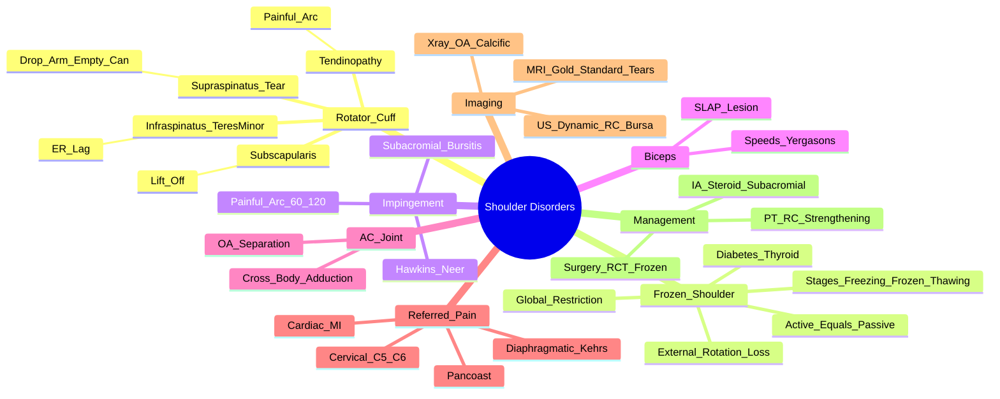

# Shoulder Disorders

> [!tip] **FCPS/MRCP Priority: HIGH**
> Shoulder pain = **3rd most common MSK complaint**. **Frozen shoulder** (global restriction, active = passive loss) vs **Rotator cuff tear** (weakness, drop arm test) vs **Impingement** (painful arc, Hawkins/Neer). **Referred pain** from cervical spine, diaphragm, heart, Pancoast tumour — must exclude.

---

## Learning Objectives
By the end of this note you should be able to:
- [ ] Differentiate **frozen shoulder** (global restriction, active = passive) from **rotator cuff tear** (weakness, drop arm test) and **impingement** (painful arc, Hawkins/Neer)
- [ ] Apply **special tests**: Hawkins/Neer (impingement), Drop arm (supraspinatus tear), Empty can (supraspinatus), Speed's/Yergason's (biceps), Cross-body adduction (AC joint)
- [ ] Identify **red flags** for referred pain: cervical radiculopathy, diaphragmatic irritation, cardiac, Pancoast tumour
- [ ] Select imaging: X-ray (OA, calcific tendinitis), US (dynamic, rotator cuff, bursa), MRI (gold standard for tears)
- [ ] Apply management: NSAIDs, physiotherapy (rotator cuff strengthening, scapular stability), IA steroid, surgery indications

---

## 1. Anatomy & Clinical Approach

| Structure | Function | Common Pathology |
|-----------|----------|-----------------|
| **Rotator Cuff** (Supraspinatus, Infraspinatus, Teres minor, Subscapularis) | Stabilise humeral head, rotate | Tendinopathy, tears (supraspinatus most common) |
| **Subacromial Bursa** | Reduce friction | Bursitis, impingement |
| **Long Head of Biceps** | Elbow flexion, shoulder stabilisation | Tendinopathy, rupture |
| **AC Joint** | Scapular rotation, force transmission | OA, separation |
| **Glenoid Labrum** | Deepen socket, stability | SLAP tears, instability |

---

## 2. Key Differential Diagnoses

| Condition | Mechanism | Key Features |
|-----------|-----------|--------------|
| **Rotator Cuff Tendinopathy/Tear** | Degenerative/Traumatic | **Painful arc (60-120°)**, **drop arm test**, weakness abduction/external rotation |
| **Frozen Shoulder (Adhesive Capsulitis)** | Idiopathic/secondary fibrosis | **Global restriction (active = passive)**, **external rotation most limited**, **diabetes/thyroid association** |
| **Subacromial Impingement/Bursitis** | Mechanical compression | **Painful arc (60-120°)**, **Hawkins/Neer positive**, **subacromial bursa on US** |
| **Bicipital Tendinopathy** | Overuse/degeneration | **Speed's test, Yergason's test**, anterior shoulder pain |
| **AC Joint OA** | Degenerative | **Cross-body adduction test**, superior shoulder pain, AC joint tenderness |
| **Referred Pain** | Visceral/Neurological | **Cervical spine (C5-6), diaphragmatic (liver/spleen), cardiac (MI), Pancoast tumour** |

---

## 3. Clinical Examination — **Special Tests**

### Rotator Cuff / Impingement
| Test | Technique | Positive = |
|------|-----------|------------|
| **Painful Arc** | Active abduction 60-120° | **Subacromial impingement / Supraspinatus tendinopathy** |
| **Hawkins-Kennedy** | 90° forward flexion → internal rotation | **Subacromial impingement** |
| **Neer Impingement** | Forced forward flexion with scapula stabilised | **Subacromial impingement** |
| **Empty Can (Jobe's)** | 90° abduction, 30° forward flexion, thumb down, resist | **Supraspinatus tear/tendinopathy** |
| **Full Can** | 90° abduction, 30° forward flexion, thumb up, resist | **Supraspinatus** (less provocative) |
| **Drop Arm Test** | Abduct to 90° → slowly lower | **Supraspinatus tear** (arm drops) |
| **External Rotation Lag** | Elbow 90°, external rotate → hold | **Infraspinatus/Teres minor tear** |

### Biceps Pathology
| Test | Technique | Positive = |
|------|-----------|------------|
| **Speed's Test** | 90° forward flexion, supinated, resist | **Bicipital tendinopathy** |
| **Yergason's Test** | Elbow 90°, supinate against resistance | **Bicipital tendinopathy / SLAP lesion** |

### AC Joint
| Test | Technique | Positive = |
|------|-----------|------------|
| **Cross-Body Adduction** | 90° forward flexion → adduct across body | **AC joint OA / separation** |

### Frozen Shoulder
| Test | Technique | Positive = |
|------|-----------|------------|
| **Global Restriction** | Compare active vs passive ROM | **Active = Passive restriction** (all directions) |
| **External Rotation** | Elbow 90°, passively externally rotate | **Most severely limited** in frozen shoulder |

---

## 4. Red Flags — **Referred Pain Must Exclude**

| Source | Presentation | Clues |
|--------|--------------|-------|
| **Cervical Radiculopathy (C5-6)** | Neck pain → shoulder/arm, **sensory/motor changes**, **Spurling's test +ve** | Neck movement exacerbates |
| **Diaphragmatic Irritation** (Liver, Spleen, Subphrenic abscess) | **Tip of shoulder pain** (Kehr's sign), **worse lying flat/inspiration** | Abdominal signs, **phrenic nerve (C3-5)** |
| **Cardiac** (MI, Angina) | **Left shoulder/arm pain**, **exertional**, diaphoresis, **ECG changes** | **Crushing, radiating to jaw/arm** |
| **Pancoast Tumour** (Lung apex) | **Shoulder/arm pain + Horner's syndrome** (ptosis, miosis, anhidrosis) | **Wasting thenar eminence**, wasting, weight loss |
| **Cholecystitis** | Right shoulder tip pain | Murphy's sign, RUQ tenderness |

> [!critical] **Always screen for referred pain** — especially **cervical spine, diaphragmatic, cardiac, Pancoast**

---

## 5. Imaging

| Modality | Indication | Key Findings |
|----------|------------|--------------|
| **X-ray** | First-line | AC joint OA, calcific tendinitis, glenohumeral OA, fracture |
| **Ultrasound** | **Dynamic, rotator cuff, bursa, biceps** | **Full/partial tears, bursitis, dynamic impingement**, bipartite tendon |
| **MRI** | **Gold standard for tears** | **Full/partial tears, labral tears (SLAP), bone marrow oedema, capsular thickening** |
| **MR Arthrogram** | Labral tears, subtle tears | Superior for labral pathology |

> [!important] **US = Dynamic, operator-dependent, cheaper**; **MRI = Gold standard for tears, static**

---

## 6. Management

### Conservative (1st Line for Most)
| Condition | Physiotherapy | Pharmacological | Injection |
|-----------|---------------|-----------------|-----------|
| **Rotator Cuff Tendinopathy** | **Rotator cuff strengthening, scapular stability, posterior capsule stretch** | NSAIDs | **Subacromial corticosteroid** (if persistent) |
| **Frozen Shoulder** | **Gentle passive stretching, pendular exercises, gradual active** | NSAIDs, **short-course oral steroids** (if acute) | **Intra-articular steroid** (early), **hydrodilatation** |
| **Subacromial Impingement/Bursitis** | Scapular stability, rotator cuff strengthening, posterior capsule stretch | NSAIDs | **Subacromial steroid** (diagnostic + therapeutic) |
| **Bicipital Tendinopathy** | Eccentric eccentric loading, scapular stability | NSAIDs | **Bicipital sheath steroid** |
| **AC Joint OA** | Scapular stability, activity modification | NSAIDs | **AC joint steroid** |

### Surgical Indications
| Condition | Indication |
|-----------|------------|
| **Rotator Cuff Tear** | **Full-thickness tear + persistent symptoms >3-6mo**, young/active, acute traumatic tear |
| **Frozen Shoulder** | **Failure of 6-12mo conservative** → **arthroscopic capsular release** |
| **Recurrent Instability** | **Traumatic anterior dislocation + Bankart/Hill-Sachs** → arthroscopic Bankart repair |
| **AC Joint OA** | **Failed conservative + significant pain/disability** → distal clavicle excision |

---

## 7. Frozen Shoulder (Adhesive Capsulitis) — **High-Yield**

| Stage | Duration | Features |
|-------|----------|----------|
| **1. Freezing** | 2-9 months | **Severe pain**, progressive restriction, **night pain** |
| **2. Frozen** | 4-12 months | **Pain improves**, **stiffness severe**, **global restriction (active = passive)** |
| **3. Thawing** | 5-24 months | **Gradual recovery** of ROM |

| Feature | Detail |
|---------|--------|
| **Demographics** | 40-60y, **F > M**, **Diabetes (10-20% vs 2-3% general)**, thyroid disease |
| **Key Sign** | **Global restriction: Active = Passive limitation** (external rotation most limited) |
| **Imaging** | X-ray normal; MRI: **capsular thickening, synovitis** (early) |
| **Course** | **Self-limiting 12-18 months** (some residual restriction) |
| **Management** | **Early: steroids (oral/IA) + PT**; **Late: PT + hydrodilatation**; **Refractory: arthroscopic capsular release** |

---

## 6. Rotator Cuff Tears

| Feature | Partial Thickness | Full Thickness |
|---------|------------------|----------------|
| **Pain** | Painful arc, night pain | Night pain, weakness |
| **Strength** | Preserved | **Weakness abduction/external rotation** |
| **Drop Arm Test** | Negative | **Positive** |
| **Ultrasound** | **Focal defect < tendon thickness** | **Full-thickness defect** |
| **MRI** | **Partial signal** | **Full-thickness defect + retraction** |

> [!critical] **Supraspinatus = most commonly torn** (critical zone, poor vascularity)

---

## 7. FCPS/MRCP High-Yield Summary

| Topic | Key Points |
|-------|------------|
| **Painful Arc (60-120°)** | **Subacromial impingement / Supraspinatus tendinopathy** |
| **Hawkins/Neer +ve** | **Subacromial impingement** |
| **Drop Arm Test +ve** | **Supraspinatus tear** |
| **Empty Can +ve** | **Supraspinatus tendinopathy/tear** |
| **Frozen Shoulder** | **Global restriction (active = passive)**, **external rotation most limited**, **diabetes/thyroid**, **self-limiting 12-18mo** |
| **Bicipital Tendinopathy** | **Speed's / Yergason's test +ve** |
| **AC Joint OA** | **Cross-body adduction +ve**, superior shoulder pain |
| **Referred Pain** | **Cervical (C5-6), Diaphragmatic (Kehr's sign), Cardiac, Pancoast** |
| **Imaging** | **US: dynamic, rotator cuff, bursa**; **MRI: gold standard for tears** |
| **Management** | **PT: rotator cuff strengthening, scapular stability**; **IA steroid subacromial/IA**; **Surgery: RCT >3-6mo, Frozen shoulder >6-12mo conservative** |

---

## 8. Viva Questions (MRCP PACES / FCPS)

| Question | Expected Answer |
|----------|----------------|
| "How do you differentiate frozen shoulder from rotator cuff tear on examination?" | **Frozen shoulder: global restriction, active = passive limitation, external rotation most limited. Rotator cuff tear: weakness (abduction/external rotation), drop arm test +ve, passive ROM better than active.** |
| "What is the painful arc and what does it indicate?" | **Pain on abduction 60-120°** — indicates **subacromial impingement / supraspinatus tendinopathy**. |
| "What are Hawkins and Neer tests and what do they test?" | **Hawkins: 90° forward flexion + internal rotation; Neer: forced forward flexion with scapula stabilised**. Both test **subacromial impingement**. |
| "How do you test for supraspinatus tear?" | **Drop arm test** (abduct to 90°, slowly lower — arm drops if tear); **Empty can test** (90° abd, 30° flexion, thumb down, resist). |
| "A 55yo diabetic presents with 6 months of progressive shoulder stiffness, painful at night. Examination shows global restriction, active = passive. X-ray normal. Diagnosis and management?" | **Frozen shoulder (adhesive capsulitis)**. **Diabetes association**. Management: **NSAIDs + intra-articular steroid + physiotherapy** (gentle stretching). If refractory >6-12mo → arthroscopic capsular release. |
| "What is the cross-body adduction test and what does it test?" | **90° forward flexion → adduct across body**. **Positive = AC joint pathology** (OA, separation). |
| "How do you differentiate frozen shoulder from cervical radiculopathy?" | **Frozen shoulder: global restriction, active = passive, no neck symptoms. Cervical radiculopathy: Spurling's test +ve, sensory/motor changes, neck movement exacerbates, preserved passive shoulder ROM.** |
| "What is Kehr's sign?" | **Left shoulder tip pain from diaphragmatic irritation** (splenic rupture, ectopic pregnancy, subphrenic abscess) — **phrenic nerve (C3-5) referral**. |
| "What imaging for suspected rotator cuff tear?" | **US first-line (dynamic, cheaper) → MRI gold standard for tear size/retraction**. |
| "A patient has shoulder pain worse at night, painful arc 60-120°, positive Hawkins/Neer. Ultrasound shows subacromial bursitis and partial supraspinatus tear. Management?" | **NSAIDs + physiotherapy (rotator cuff strengthening, scapular stability, posterior capsule stretch)** → **subacromial corticosteroid injection** if persistent → **surgical repair if full-thickness tear or failed conservative >3-6 months**. |

---

## 9. Confusions & Mnemonics

| Confusion | Clarification |
|-----------|---------------|
| **Frozen Shoulder vs Rotator Cuff Tear** | **Frozen: active = passive restriction, global**. **RCT: weakness, drop arm +ve, passive > active.** |
| **Frozen Shoulder vs Subacromial Impingement** | **Frozen: global stiffness, external rotation most limited**. Impingement: painful arc, Hawkins/Neer +ve, **normal passive ROM**. |
| **AC Joint OA vs Glenohumeral OA** | **AC joint: cross-body adduction +ve, superior pain**. GH OA: global restriction, crepitus, deep joint pain. |
| **Referred vs Primary Shoulder Pain** | Referred: **no shoulder ROM restriction**, pain with neck/abdominal/cardiac provocation, **no local tenderness**. |
| **Biceps Tendinopathy vs SLAP Lesion** | Both: **Speed's/Yergason's +ve**. SLAP: **mechanical symptoms (clicking, catching)**, MRI arthrogram gold standard. |

**Mnemonic: Shoulder Special Tests = "H-N-E-D-S-Y-C"**
- **H**awkins
- **N**eer
- **E**mpty Can
- **D**rop Arm
- **S**peed's
- **Y**ergason's
- **C**ross-body Adduction

**Mnemonic: Frozen Shoulder = "FROZEN"**
- **F**emale > Male
- **R**estricted (global, active = passive)
- **O**ver 40
- **Z**ero passive/active difference
- **E**xternal rotation most limited
- **N**ight pain (freezing phase)

**Mnemonic: Rotator Cuff = "SITS"**
- **S**upraspinatus (abduction 0-15°, painful arc)
- **I**nfraspinatus (external rotation)
- **T**eres minor (external rotation)
- **S**ubscapularis (internal rotation, lift-off test)

**Mnemonic: Impingement Signs = "H-N-P"**
- **H**awkins-Kennedy
- **N**eer
- **P**ainful Arc (60-120°)

**Mnemonic: Referred Pain = "C-D-C-P" (MUST EXCLUDE)**
- **C**ervical (C5-6)
- **D**iaphragmatic (Kehr's sign)
- **C**ardiac (MI)
- **P**ancoast tumour

---

## 10. Mind Map

---

## 11. One-Page Revision Card

| Condition | Key Test | Key Feature |
|-----------|----------|-------------|
| **Frozen Shoulder** | **Active = Passive restriction** | Diabetes, external rotation loss, self-limiting 12-18mo |
| **Rotator Cuff Tear** | **Drop arm test** | Weakness abduction/ER, night pain |
| **Impingement** | **Hawkins/Neer +ve** | Painful arc 60-120° |
| **AC Joint OA** | **Cross-body adduction +ve** | Superior shoulder pain |
| **Bicipital Tendinopathy** | **Speed's / Yergason's +ve** | Anterior shoulder pain |
| **Referred Pain** | **Cervical (C5-6), Diaphragmatic (Kehr's), Cardiac, Pancoast** | No shoulder ROM restriction |

---

## 12. Spaced Repetition Trackers

| Review Interval | Date Completed | Confidence (1-5) | Notes |
|-----------------|----------------|------------------|-------|
| 24 hours | | | |
| 7 days | | | |
| 15 days | | | |
| 30 days | | | |
| 90 days | | | |

---

## 13. Self-Test Scorecard

| Section | Score /5 | Last Attempt |
|--------|----------|--------------|
| Special Tests Application | | |
| Frozen Shoulder vs RCT | | |
| Referred Pain Recognition | | |
| Imaging Selection | | |
| Management Algorithms | | |
| Viva Questions | | |

---

## Local Navigation
- **Parent Heading**: [[../Soft Tissue Rheumatism and Chronic Pain Syndromes|Soft Tissue Rheumatism and Chronic Pain Syndromes]]
- **Parent Topic Group**: [[Regional soft tissue rheumatism]]
- **Chapter Map**: [[../Davidson Chapter 26 - Rheumatology Hierarchy|Rheumatology Hierarchy]]
- **Chapter MOC**: [[../Rheumatology MOC|Rheumatology MOC]]
- **Drug Reference**: [[../../Clinical Approach to Musculoskeletal Disease/Drugs in rheumatology|Drugs in rheumatology]]
- **Related**: [[Hip and trochanteric bursitis]] · [[Elbow disorders]] · [[Knee disorders]] · [[Regional soft tissue rheumatism]]
---

> Auto-generated study sections for "Soft Tissue Rheumatism and Chronic Pain Syndromes" — Ch 25: Rheumatology & Bone Disease.

## Flashcards (1 generated)

- Q: What is the definition of Soft Tissue Rheumatism and Chronic Pain Syndromes?
  A: Shoulder pain = 3rd most common MSK complaint.

## MCQs (1 generated)

1. **Which of the following best describes Soft Tissue Rheumatism and Chronic Pain Syndromes?**
   A. **Shoulder pain = 3rd most common MSK complaint.**
   B. An unrelated condition not matching the clinical picture of Soft Tissue Rheumatism and Chronic Pain Syndromes
   C. A complication seen late in the disease course of Soft Tissue Rheumatism and Chronic Pain Syndromes
   D. A condition that mimics Soft Tissue Rheumatism and Chronic Pain Syndromes but has a different underlying cause

## SBA Questions (1 generated)

1. A patient with suspected Soft Tissue Rheumatism and Chronic Pain Syndromes presents with: Subacromial Bursa — Reduce friction; Long Head of Biceps — Elbow flexion, shoulder stabilisation; AC Joint — Scapular rotation, force transmission. What is the most likely diagnosis?
   A. **Soft Tissue Rheumatism and Chronic Pain Syndromes**
   B. A condition that mimics Soft Tissue Rheumatism and Chronic Pain Syndromes but is not the same entity
   C. A complication of Soft Tissue Rheumatism and Chronic Pain Syndromes rather than the primary diagnosis
   D. An unrelated condition in the same clinical category as Soft Tissue Rheumatism and Chronic Pain Syndromes

