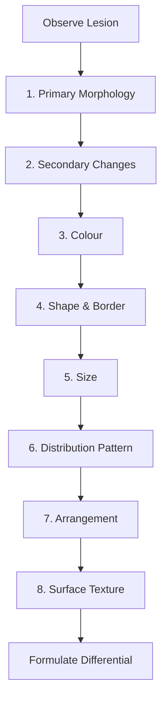

# Approach to Diagnosis Hub

---
tags: [medicine, dermatology, topic-group-hub, scaffold-hub]
davidson_part: Part 3: Clinical Medicine
davidson_chapter: Chapter 29: Dermatology
heading: Structure, Function & Diagnostic Approach
topic_group: Approach to Dermatological Diagnosis
topic:
status: full-fcps-mrcp-hub
priority: critical
created: 2026-06-15
modified: 2026-06-15
exam_relevance: [FCPS, MRCP Part 1, MRCP Part 2, PACES]
see_also:
  - "[[Structure and Function Hub]]"
  - "[[Dermatology MOC]]"
---

# Approach to Dermatological Diagnosis Hub

> [!info]
> **Topic Group 1.2** | **6 Disease Topics** | **Priority: CRITICAL**

---

## Disease Topics in this Group

| # | Topic | Status | Priority |
|---|-------|--------|----------|
| 1 | Lesion morphology (primary/secondary) | 🔴 scaffold | Critical |
| 2 | Distribution patterns | 🔴 scaffold | Critical |
| 3 | Dermatological history taking | 🔴 scaffold | Critical |
| 4 | Skin examination technique | 🔴 scaffold | Critical |
| 5 | Dermoscopy basics | 🔴 scaffold | High |
| 6 | Skin biopsy indications and technique | 🔴 scaffold | High |

---

## High-Yield Summary

| Skill | Key Points | Exam Application |
|-------|------------|------------------|
| **Primary lesions** | Macule, papule, plaque, nodule, vesicle, bulla, pustule, wheal | Describe any rash systematically |
| **Secondary lesions** | Scale, crust, erosion, ulcer, lichenification, excoriation, fissure, atrophy, scar | Indicate evolution, chronicity |
| **Distribution** | Symmetric, asymmetric, dermatomal, Blaschkoid, photo, flexural, extensor, acral | Narrows differential dramatically |
| **History** | Onset, evolution, symptoms (itch/pain/burn), triggers, drugs, systems, family, atopy | 80% diagnosis from history |
| **Examination** | Lighting, palpation, dermoscopy, mucosa, nails, hair, lymph nodes, general | Don't forget mucosa/nails/lymph |
| **Dermoscopy** | Chaos-clues, pigment network, dots/globules, vessels, white structures | Melanoma vs naevus, BCC, clear |
| **Biopsy** | Punch 4mm (inflammatory), shave (epidermal tumours), excisional (melanoma), incisional (large) | Right biopsy = right diagnosis |

---

## Key Algorithms

### Systematic Lesion Description


### Distribution Pattern → Diagnosis
```mermaid
flowchart TD
    A[Distribution] --> B{Pattern}
    B -->|Symmetric| C[Psoriasis, AD, Lichen Planus, Drug eruption, Viral exanthem]
    B -->|Asymmetric| D[Contact dermatitis, Tinea, Fixed drug eruption, Morphea]
    B -->|Dermatomal| E[Herpes Zoster, Herpes Simplex recurrent]
    B -->|Blaschkoid| F[Incontinentia pigmenti, Lichen striatus, CHILD syndrome]
    B -->|Photo-distributed| G[SLE, PMLE, Drug photosensitivity, Porphyria]
    B -->|Flexural| H[Inverse psoriasis, AD, Contact, Candidiasis, Hailey-Hailey]
    B -->|Extensor| I[Psoriasis vulgaris, Lichen planus, Eczema (chronic)]
    B -->|Acral| J[Pustular psoriasis, Syphilis, Pustular drug eruption, Dyshidrotic]
```

---

## FCPS/MRCP Viva Topics

1. **Primary vs secondary lesions** - define all 8 primary, examples of each; secondary = evolution
2. **Distribution patterns** - symmetric vs asymmetric vs dermatomal vs Blaschkoid vs photo vs flexural vs extensor
3. **Dermatological history** - onset, course, symptoms, triggers, drugs, systems, family, atopy, occupation
4. **Examination technique** - lighting (daylight best), palpate (temperature, induration, fluctuance), dermoscopy, mucosa, nails, hair, lymph nodes
5. **Dermoscopy basics** - chaos-clues algorithm, pigment network, globules, dots, vessels, regression structures
6. **Biopsy technique** - punch (inflammatory), shave (epidermal), excisional (melanoma suspicion), incisional (large tumours); DIF = perilesional normal skin

---

## Mnemonics

- **Primary lesions:** `MPVNPBWW` = **M**acule, **P**apule, **P**laque, **N**odule, **V**esicle, **B**ulla, **P**ustule, **W**heal
- **Distribution patterns:** `SADB FAP` = **S**ymmetric, **A**symmetric, **D**ermatomal, **B**laschkoid, **F**lexural, **A**cral, **P**hoto
- **Biopsy choice:** `PUNCH SHAE` = **P**unch = Inflammatory / **SH**ave = Epidermal tumours / **A** Excisional = Melanoma / **E** Incisional = Large tumours

---

## Linkage

- **Parent Hub:** [[Structure and Function Hub]]
- **MOC:** [[Dermatology MOC]]
- **Disease Topics:** See individual files in `01_Structure_Function_Approach/`

---

## Progress
- [ ] Lesion morphology (scaffold → full)
- [ ] Distribution patterns (scaffold → full)
- [ ] Dermatological history taking (scaffold → full)
- [ ] Skin examination technique (scaffold → full)
- [ ] Dermoscopy basics (scaffold → full)
- [ ] Skin biopsy indications and technique (scaffold → full)