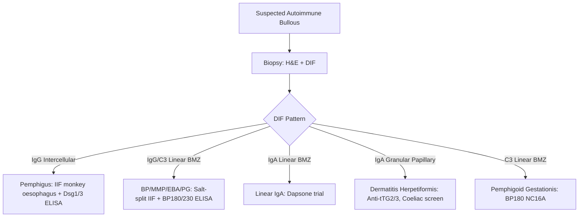

# Investigations Hub

---
tags: [medicine, dermatology, topic-group-hub, scaffold-hub]
davidson_part: Part 3: Clinical Medicine
davidson_chapter: Chapter 29: Dermatology
heading: Structure, Function & Diagnostic Approach
topic_group: Investigations in Dermatology
topic:
status: full-fcps-mrcp-hub
priority: high
created: 2026-06-15
modified: 2026-06-15
exam_relevance: [FCPS, MRCP Part 1, MRCP Part 2, PACES]
see_also:
  - "[[Structure and Function Hub]]"
  - "[[Dermatology MOC]]"
---

# Investigations in Dermatology Hub

> [!info]
> **Topic Group 1.3** | **5 Disease Topics** | **Priority: HIGH**

---

## Disease Topics in this Group

| # | Topic | Status | Priority |
|---|-------|--------|----------|
| 1 | Laboratory investigations | 🔴 scaffold | High |
| 2 | Imaging in dermatology | 🔴 scaffold | Medium |
| 3 | Patch testing and allergy testing | 🔴 scaffold | High |
| 4 | Direct/indirect immunofluorescence | 🔴 scaffold | Critical |
| 5 | Molecular diagnostics | 🔴 scaffold | Medium |

---

## High-Yield Summary

| Investigation | Indication | Key Interpretation |
|---------------|------------|-------------------|
| **FBC, U&E, LFT** | Baseline for systemic therapy, DRESS, erythroderma | Eosinophilia (DRESS, parasites), neutrophilia (AGEP, infection) |
| **ESR/CRP** | Vasculitis, infection, inflammatory disease | Raised in vasculitis, cellulitis, erythroderma |
| **Autoantibodies** | CTD workup | ANA (screen), dsDNA/Sm (SLE), Scl-70 (SSc diffuse), centromere (SSc limited), Ro/La (Sjögren/SCLE), Mi-2/TIF1γ/NXP2/MDA5/SAE (DM) |
| **ANCA** | Vasculitis | c-ANCA/PR3 = GPA; p-ANCA/MPO = MPA/EGPA |
| **Immunoglobulins/Electrophoresis** | Paraneoplastic, amyloidosis, myeloma | Monoclonal spike = myeloma/Waldenstrom |
| **Patch testing** | Allergic contact dermatitis | Standard series + specific; read D2/D4; relevance assessment |
| **Prick testing** | Type I hypersensitivity (urticaria, anaphylaxis) | Wheal ≥3mm at 15 min |
| **DIF** | Autoimmune bullous, vasculitis, lupus, DH | Perilesional skin; IgG intercellular (pemphigus), linear BMZ (BP), granular IgA (DH), vessel IgG/IgA/C3 (vasculitis) |
| **IIF** | Pemphigus, BP, PG, PG | Monkey oesophagus (pemphigus), salt-split skin (BP vs EBA), BP180/230 ELISA |
| **KOH microscopy** | Fungal infections | Hyphae (dermatophytes); yeast/pseudohyphae (Candida); spaghetti-and-meatballs (Malassezia) |
| **Skin scraping** | Scabies | Mite, eggs, faeces (scybala); dermoscopy = delta wing/jet with contrail |
| **Tzanck smear** | HSV/VZV, pemphigus | Multinucleated giant cells (herpes); acantholytic cells (pemphigus) |
| **Molecular/Genetic** | Genodermatoses, melanoma prognostication, targeted therapy | FLG (ichthyosis vulgaris), BRAF (melanoma), HLA-B*58:01 (allopurinol) |

---

## Key Algorithms

### Autoimmune Bullous Workup

---

## FCPS/MRCP Viva Topics

1. **DIF patterns** - intercellular (pemphigus), linear BMZ (BP/MMP/EBA/PG), granular papillary (DH), vessel deposits (vasculitis)
2. **Salt-split skin** - roof (epidermal) = BP/PG; floor (dermal) = EBA/MMP
3. **Patch testing** - standard series, methodology, reading D2/D4, relevance (current/past/uncertain)
4. **KOH prep** - hyphae (dermatophyte), yeast+pseudohyphae (Candida), spaghetti-and-meatballs (Malassezia)
5. **Scabies diagnosis** - burrows, dermoscopy (delta wing), skin scraping (mite/eggs/scybala)
6. **Autoantibody panel for CTD** - ANA screen, then specific: dsDNA/Sm (SLE), Scl-70 (SSc diffuse), centromere (SSc limited), Ro/La (Sjögren/SCLE), Mi-2/TIF1γ/NXP2/MDA5/SAE (DM)
7. **ANCA** - c-ANCA/PR3 = GPA; p-ANCA/MPO = MPA/EGPA; atypical ANCA = UC/autoimmune hepatitis

---

## Mnemonics

- **DIF Patterns:** `FISH NET LINEAR GRANULAR` = **FISH NET** = Pemphigus (intercellular IgG); **LINEAR** = BP/MMP/EBA/PG (IgG/C3 BMZ); **GRANULAR** = DH (IgA papillary)
- **Salt-split:** `ROOF FLOOR` = **ROOF** = BP, PG (epidermal/roof); **FLOOR** = EBA, MMP (dermal/floor)
- **CTD Antibodies:** `SLE SSc DM SJ` = **SLE** = dsDNA, Sm; **SSc** = Scl-70 (diffuse), Centromere (limited); **DM** = Mi-2, TIF1γ, NXP2, MDA5, SAE; **SJ** = Ro/La

---

## Linkage

- **Parent Hub:** [[Structure and Function Hub]]
- **MOC:** [[Dermatology MOC]]
- **Disease Topics:** See individual files in `01_Structure_Function_Approach/`

---

## Progress
- [ ] Laboratory investigations (scaffold → full)
- [ ] Imaging in dermatology (scaffold → full)
- [ ] Patch testing and allergy testing (scaffold → full)
- [ ] Direct/indirect immunofluorescence (scaffold → full)
- [ ] Molecular diagnostics (scaffold → full)