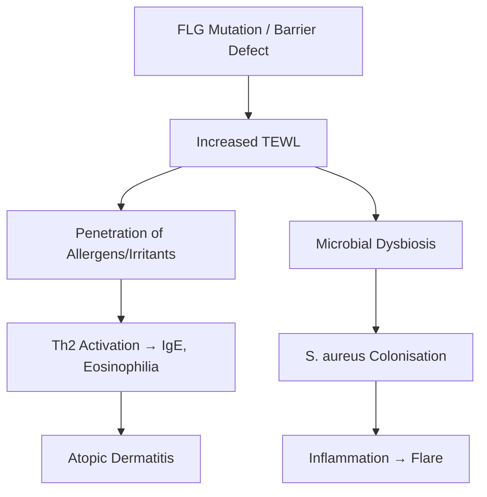

# Skin Structure and Function Hub

---
tags: [medicine, dermatology, topic-group-hub, scaffold-hub]
davidson_part: Part 3: Clinical Medicine
davidson_chapter: Chapter 29: Dermatology
heading: Structure, Function & Diagnostic Approach
topic_group: Skin Structure & Function
topic:
status: full-fcps-mrcp-hub
priority: high
created: 2026-06-15
modified: 2026-06-15
exam_relevance: [FCPS, MRCP Part 1, MRCP Part 2, PACES]
see_also:
  - "[[Structure and Function Hub]]"
  - "[[Dermatology MOC]]"
---

# Skin Structure & Function Hub

> [!info]
> **Topic Group 1.1** | **4 Disease Topics** | **Priority: HIGH**

---

## Disease Topics in this Group

| # | Topic | Status | Priority |
|---|-------|--------|----------|
| 1 | Skin anatomy and histology | 🔴 scaffold | High |
| 2 | Epidermal barrier function | 🔴 scaffold | High |
| 3 | Cutaneous immune system | 🔴 scaffold | High |
| 4 | Skin microbiome | 🔴 scaffold | Medium |

---

## High-Yield Summary

| Component | Key Points | Clinical Relevance |
|-----------|------------|-------------------|
| **Epidermis** | Stratum basale → spinosum → granulosum → lucidum → corneum; Keratinocytes 90%, Melanocytes, Langerhans, Merkel | Barrier, immunity, sensation |
| **Dermis** | Papillary (loose CT) + Reticular (dense CT); Collagen I/III, elastin, GAGs; Fibroblasts, mast cells, vessels, nerves | Structural support, thermoregulation |
| **Hypodermis** | Adipose tissue, fascia, vessels, nerves | Insulation, shock absorption |
| **Barrier function** | Corneocytes + lipid lamellae (ceramides, cholesterol, FFA); FLG → NMF; pH 4.5-5.5 (acid mantle) | AD = FLG mutation → barrier defect |
| **Cutaneous immunity** | Langerhans cells (APC), T-resident memory (TRM), keratinocyte cytokines, antimicrobial peptides | Psoriasis, contact dermatitis, infections |
| **Microbiome** | Corynebacterium (moist), Staphylococcus (dry), Cutibacterium (sebaceous), Malassezia (lipophilic) | Dysbiosis → AD, acne, seborrhoeic dermatitis |

---

## Key Algorithms

### Skin Barrier Defect → Disease

---

## FCPS/MRCP Viva Topics

1. **Epidermal layers** - basale, spinosum, granulosum, lucidum, corneum; keratinocyte differentiation
2. **Barrier lipids** - ceramides 50%, cholesterol 25%, free fatty acids 15%; FLG → NMF
3. **Langerhans cells** - antigen presentation, migrate to lymph nodes, CD1a+, Birbeck granules
4. **Skin microbiome** - site-specific, dysbiosis in AD (S. aureus), acne (C. acnes), seborrhoeic (Malassezia)
5. **Dermal collagen** - Type I (80%), Type III (15%); ageing = fragmentation, reduced synthesis
6. **Melanin** - eumelanin (brown/black), pheomelanin (red/yellow); MC1R variants → skin type

---

## Linkage

- **Parent Hub:** [[Structure and Function Hub]]
- **MOC:** [[Dermatology MOC]]
- **Disease Topics:** See individual files in `01_Structure_Function_Approach/`

---

## Progress
- [ ] Skin anatomy and histology (scaffold → full)
- [ ] Epidermal barrier function (scaffold → full)
- [ ] Cutaneous immune system (scaffold → full)
- [ ] Skin microbiome (scaffold → full)