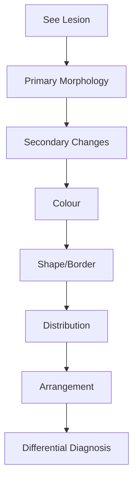
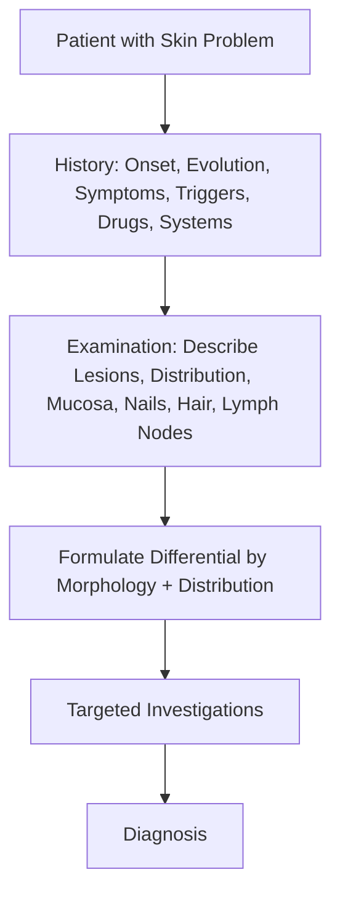

# Structure and Function Hub

---
tags: [medicine, dermatology, heading-hub, scaffold-hub]
davidson_part: Part 3: Clinical Medicine
davidson_chapter: Chapter 29: Dermatology
heading: Structure, Function & Diagnostic Approach
topic_group:
topic:
status: full-fcps-mrcp-hub
priority: critical
created: 2026-06-15
modified: 2026-06-15
exam_relevance: [FCPS, MRCP Part 1, MRCP Part 2, PACES]
see_also:
  - "[[Dermatology MOC]]"
  - "[[Davidson Chapter 29 - Dermatology Hierarchy]]"
---

# Structure, Function & Diagnostic Approach Hub

> [!info]
> **Davidson Ch29 Section 1** | **4 Topic Groups, 12 Disease Topics** | **Priority: CRITICAL**

---

## Topic Groups in this Section

| # | Topic Group | Disease Topics | Status |
|---|-------------|----------------|--------|
| 1.1 | Skin Structure & Function | 4 | 🔴 scaffold |
| 1.2 | Approach to Dermatological Diagnosis | 6 | 🔴 scaffold |
| 1.3 | Investigations in Dermatology | 5 | 🔴 scaffold |
| 1.4 | Treatment Principles in Dermatology | 5 | 🔴 scaffold |

---

## High-Yield Summary Table

| Concept | Key Points | Exam Relevance |
|---------|------------|----------------|
| **Primary lesions** | Macule, papule, plaque, nodule, vesicle, bulla, pustule, wheal | MRCP P1: describe lesion morphology |
| **Secondary lesions** | Scale, crust, erosion, ulcer, lichenification, excoriation, fissure | MRCP P2/PACES: recognise evolution |
| **Distribution patterns** | Symmetric, dermatomal, Blaschkoid, photo, flexural, extensor | FCPS: differential by distribution |
| **Dermoscopy** | Chaos-clues, pigment network, dots/globules, vessels | MRCP P2: melanoma vs naevus |
| **Biopsy technique** | Punch (4mm), shave, excisional, incisional | PACES: procedure counselling |
| **Topical potency** | Vedamurthy scale: VII (weak) → I (superpotent) | FCPS/MRCP: steroid ladder |
| **Fingertip unit (FTU)** | 1 FTU = 0.5g = covers 2% BSA (2 palms) | MRCP P2: prescribing calculations |
| **Biologics screening** | TB (IGRA/CXR), Hep B/C, HIV, VZV, malignancy history | MRCP P2: pre-biologic workup |

---

## Key Algorithms

### Lesion Description Algorithm

### Diagnostic Approach

---

## FCPS/MRCP Viva Topics (High-Yield)

1. **Describe the primary skin lesions** - name all 8 with examples
2. **Secondary lesions** - how do they evolve from primary?
3. **Distribution patterns** - what diagnoses fit each pattern?
4. **Dermoscopy structures** - chaos-clues algorithm for pigmented lesions
5. **Biopsy types** - when to use punch vs shave vs excisional
6. **Topical steroid potency ladder** - 7 groups, examples, body site adjustments
7. **FTU calculation** - how many FTUs for face, arm, leg, trunk?
8. **Biologic screening** - mandatory tests before anti-TNF/IL-17/IL-23/JAKi
9. **Koebner phenomenon** - which diseases, clinical significance
10. **Nikolsky sign** - technique, positive in which conditions

---

## Quick Revision Card

| Topic | Must Know |
|-------|-----------|
| **Primary lesions** | 8 types + examples |
| **Distribution** | Photo = SLE/PMLE/Drug; Flexural = AD/Inverse psoriasis; Extensor = Psoriasis/LP |
| **Dermoscopy** | Network absent = melanoma; Comedo-like = SK; Moth-eaten = BCC |
| **Steroid potency** | Group I-IV = potent/very potent (avoid face/flexures >2w); Group V-VII = mild/mod |
| **FTU** | Adult: Face 1, Hand 1, Foot 2, Arm 3, Leg 6, Trunk front/back 7 each |
| **Biopsy** | Punch for inflammatory; Shave for epidermal tumours; Excisional for melanoma |
| **Pre-biologic** | CXR/IGRA, HBsAg/HBcAb, HCV Ab, HIV, VZV IgG, FBC, LFT, U&E, malignancy screen |

---

## Linkage

- **MOC:** [[Dermatology MOC]]
- **Hierarchy:** [[Davidson Chapter 29 - Dermatology Hierarchy]]
- **Section Dir:** `01_Structure_Function_Approach/`
- **Next Hub:** [[../02_Papulosquamous_Eczematous/Papulosquamous and Eczematous Hub]]

---

## Progress
- [ ] 1.1 Skin Structure & Function Hub
- [ ] 1.2 Approach to Diagnosis Hub
- [ ] 1.3 Investigations Hub
- [ ] 1.4 Treatment Principles Hub
- [ ] 4 Topic Group Hubs (scaffold-hub)
- [ ] 12 Disease Topics (scaffold → full-fcps-mrcp-note)