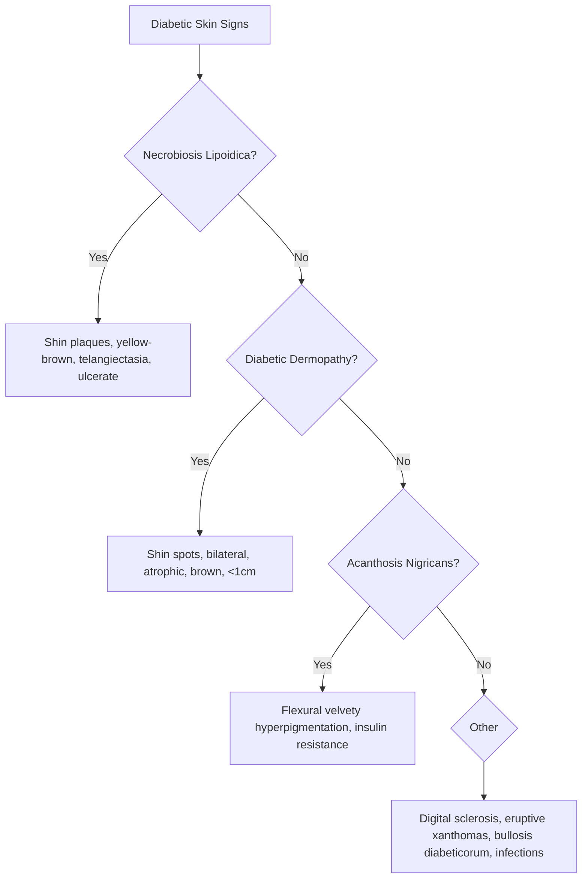

# Dermatological Manifestations of Systemic Disease Hub

> [!info]
> **Davidson Ch29 Section 10** | **4 Topic Groups, 14 Disease Topics** | **Priority: CRITICAL**

---

## Topic Groups in this Section

| # | Topic Group | Disease Topics | Status |
|---|-------------|----------------|--------|
| 10.1 | Connective Tissue Diseases | 6 | 🔴 scaffold |
| 10.2 | Vasculitis Syndromes | 6 | 🔴 scaffold |
| 10.3 | Metabolic, Nutritional & Endocrine | 8 | 🔴 scaffold |
| 10.4 | Other Systemic Associations | 4 | 🔴 scaffold |

---

## High-Yield Summary Table

| Systemic Disease | Key Cutaneous Feature | Pathognomonic Sign | Antibody Association | Malignancy Risk |
|------------------|----------------------|-------------------|---------------------|-----------------|
| **SLE** | Malar rash, photosensitivity, discoid, alopecia, oral ulcers | Discoid lupus (scarring) | ANA, anti-dsDNA, anti-Sm, anti-Ro/La | SLE itself |
| **Dermatomyositis** | Heliotrope, Gottron papules, shawl/V-sign, mechanic's hands, periungual telangiectasia | Gottron papules (pathognomonic) | anti-Mi-2, TIF1γ, NXP2, MDA5, SAE | **High (ovarian, lung, GI)** |
| **Systemic Sclerosis** | Sclerodactyly, calcinosis, telangiectasia, Raynaud, salt-and-pepper | Sclerodactyly (scleroderma) | anti-Scl-70 (diffuse), anti-centromere (limited) | Lung (PAH, ILD) |
| **MCTD** | Overlap: SLE + SSc + DM features, puffy hands | Puffy hands, high-titre anti-U1-RNP | **Anti-U1-RNP (high titre)** | PAH |
| **Sjögren** | Sicca, annular erythema, vasculitis, Raynaud | Annular erythema (subacute cutaneous-like) | Anti-Ro/SSA, Anti-La/SSB | Lymphoma (MALT) |
| **Antiphospholipid Syndrome** | Livedo reticularis, ulcers, necrosis, thromboses | Livedo racemosa (not physiological) | **Lupus anticoagulant, anti-cardiolipin, anti-β2GPI** | Thrombosis |

---

## Key Algorithms

### Connective Tissue Disease Skin Signs
```mermaid
flowchart TD
    A[Patient with CTD skin signs] --> B{Malar rash + photosensitivity?}
    B -->|Yes| C[Think SLE: ANA, dsDNA, Sm, Ro/La, complement]
    B -->|No| D{Heliotrope + Gottron?}
    D -->|Yes| E[Dermatomyositis: Myositis panel (Mi-2, TIF1γ,NXP2,MDA5,SAE), MALIGNANCY SCREEN]
    D -->|No| F{Skin thickening + Raynaud?}
    F -->|Yes| G[Systemic Sclerosis: ANA, Scl-70 (diffuse), Centromere (limited)]
    F -->|No| H{Puffy hands + high titre RNP?}
    H -->|Yes| I[MCTD: Anti-U1-RNP high titre]
    H -->|No| J{Sicca + annular erythema?}
    J -->|Yes| K[Sjögren: Anti-Ro/La]
    J -->|No| L{Livedo + thrombosis?}
    L -->|Yes| M[APS: Lupus anticoagulant, aCL, anti-β2GPI]
```

### Dermatomyositis Malignancy Screening
```mermaid
flowchart TD
    A[New Dermatomyositis Diagnosis] --> B[Age >40?]
    B -->|Yes| C[Comprehensive Malignancy Screen]
    C --> D[CT Chest/Abdomen/Pelvis]
    C --> E[Mammogram (women)]
    C --> F[Pelvic US / CA-125 (ovarian)]
    C --> G[GI Endoscopy / Colonoscopy]
    C --> H[Age-appropriate screening]
    B -->|No| I[Standard age-appropriate screening]
```

### Diabetes Skin Manifestations


---

## FCPS/MRCP Viva Topics (High-Yield)

1. **SLE skin criteria** - malar, discoid, photosensitivity, oral ulcers, alopecia, ANA/dsDNA/Sm
2. **Dermatomyositis** - heliotrope, Gottron, shawl/V-sign, mechanic's hands, periungual telangiectasia, **MALIGNANCY SCREEN age >40**
3. **Systemic sclerosis** - limited (CREST: Calcinosis, Raynaud, Esophageal, Sclerodactyly, Telangiectasia) vs diffuse; anti-centromere vs Scl-70
4. **MCTD** - overlap, puffy hands, high-titre anti-U1-RNP, PAH risk
5. **Sjögren skin** - annular erythema, vasculitis, lymphoma risk (MALT)
6. **Antiphospholipid syndrome** - livedo reticularis/racemosa, arterial/venous thrombosis, obstetric morbidity, catastrophic APS
7. **Diabetes skin** - necrobiosis lipoidica (shins, ulcerate), diabetic dermopathy (shin spots), acanthosis nigricans (insulin resistance), bullosis diabeticorum
8. **Thyroid skin** - myxoedema (pretibial, non-pitting), thyroid acropachy (clubbing), vitiligo/alopecia association
9. **Porphyria cutanea tarda** - fragile skin, bullae on hands, hypertrichosis, urine porphyrins, phlebotomy/hydroxychloroquine
10. **Sarcoidosis skin** - lupus pernio (nose/face), erythema nodosum, scar sarcoidosis, Löfgren syndrome
11. **Amyloidosis skin** - waxy papules, macroglossia, purpura (pinch), Congo red + apple-green birefringence
12. **Paraneoplastic dermatoses** - Acanthosis nigricans maligna (gastric), Dermatomyositis (ovarian/lung), Leser-Trélat (seborrheic keratosis eruption), Sweet syndrome, Bazex (acral psoriasis-like + malignancy)

---

## Mnemonics

- **CREST (Limited SSc):** `CREST` = **C**alcinosis, **R**aynaud, **E**sophageal dysmotility, **S**clerodactyly, **T**elangiectasia
- **Dermatomyositis signs:** `HELIOTROPE` = **H**eliotrope rash, **E**xtramammary Paget? No - **G**ottron papules, **S**hawl sign, **V**-sign, **M**echanic's hands, **P**eriungual telangiectasia
- **SLE skin:** `SKIN SLE` = **S**kin (discoid, malar, photosensitive), **K**eratinizing? No - **M**alar, **P**hotosensitivity, **O**ral ulcers, **A**lopecia, **L**upus pernio? No - **L**ivedo, **U**lcera (mucosal)
- **Diabetes shin signs:** `SHIN` = **S**hin spots (dermopathy), **H**yperpigmented? No - **N**ecrobiosis **L**ipoidica, **I**nsulin resistance (acanthosis nigricans)

---

## Quick Revision Card

| Disease | Pathognomonic Skin Sign | Key Antibody | Must-Do |
|---------|------------------------|--------------|---------|
| **SLE** | Discoid lupus (scarring) | anti-dsDNA, anti-Sm | Monitor renal, complement |
| **Dermatomyositis** | Gottron papules | Mi-2, TIF1γ, NXP2, MDA5, SAE | **Malignancy screen if >40** |
| **Systemic Sclerosis (Limited)** | Sclerodactyly + Telangiectasia | Anti-centromere | PAH screen (echo, PFT) |
| **Systemic Sclerosis (Diffuse)** | Rapid skin thickening | Anti-Scl-70 (topo I) | ILD screen (HRCT, PFT) |
| **MCTD** | Puffy hands | **Anti-U1-RNP (high titre)** | PAH screen |
| **Sjögren** | Annular erythema | Anti-Ro/SSA, Anti-La/SSB | Lymphoma surveillance |
| **Antiphospholipid Syndrome** | Livedo racemosa | Lupus anticoagulant, aCL, anti-β2GPI | Thrombosis prophylaxis |
| **Diabetes** | Necrobiosis lipoidica (shins) | - | Glycaemic control |
| **Porphyria Cutanea Tarda** | Fragile skin, bullae hands | Urine porphyrins ↑ | Phlebotomy, low-dose HCQ |
| **Sarcoidosis** | Lupus pernio (face) | ACE, chest X-ray | Exclude TB, screen eyes |

---

## Linkage

- **MOC:** [[Dermatology MOC]]
- **Hierarchy:** [[Davidson Chapter 29 - Dermatology Hierarchy]]
- **Section Dir:** `10_Systemic_Disease_Manifestations/`
- **Previous Hub:** [[../09_Hair_Nail_Disorders/Hair and Nail Hub]]
- **Next Hub:** [[../11_Genodermatoses/Genodermatoses Hub]]

---

## Progress
- [ ] 10.1 Connective Tissue Diseases Hub (scaffold-hub)
- [ ] 10.2 Vasculitis Syndromes Hub (scaffold-hub)
- [ ] 10.3 Metabolic/Nutritional/Endocrine Hub (scaffold-hub)
- [ ] 10.4 Other Systemic Associations Hub (scaffold-hub)
- [ ] 14 Disease Topics (scaffold → full-fcps-mrcp-note)