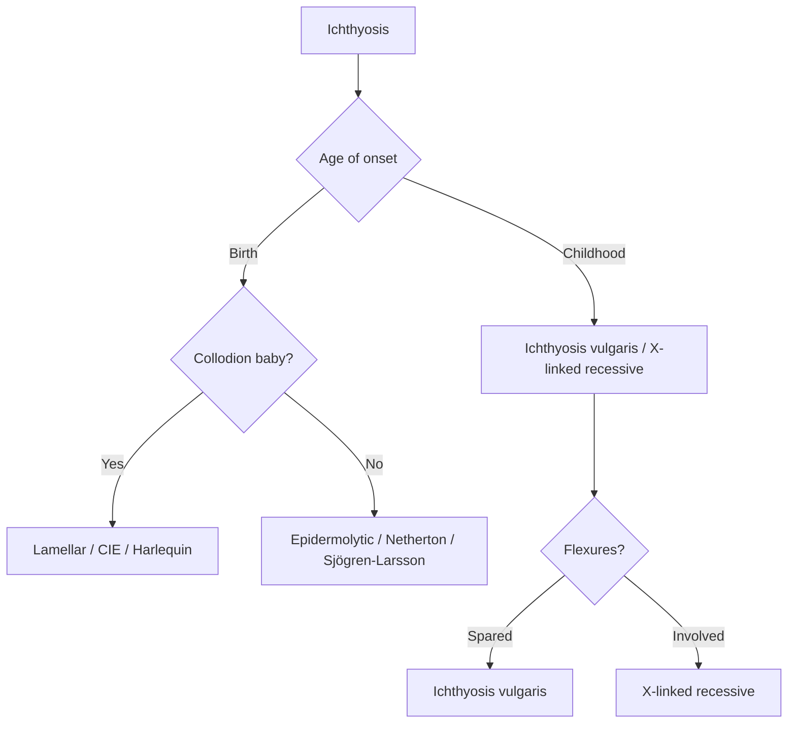

# Genodermatoses Hub

> [!info]
> **Davidson Ch29 Section 11** | **4 Topic Groups, 12 Disease Topics** | **Priority: HIGH**

---

## Topic Groups in this Section

| # | Topic Group | Disease Topics | Status |
|---|-------------|----------------|--------|
| 11.1 | Ichthyoses & Keratinisation Disorders | 6 | 🔴 scaffold |
| 11.2 | Ectodermal Dysplasias | 4 | 🔴 scaffold |
| 11.3 | Phakomatoses (Neurocutaneous Syndromes) | 6 | 🔴 scaffold |
| 11.4 | Other Genodermatoses | 8 | 🔴 scaffold |

---

## High-Yield Summary Table

| Genodermatosis | Inheritance | Key Clinical | Gene/Protein | Key Feature |
|----------------|-------------|--------------|--------------|-------------|
| **Ichthyosis vulgaris** | AD | Fine white scales, sparing flexures, atopic association | **FLG** (filaggrin) | Most common ichthyosis |
| **X-linked recessive ichthyosis** | XLR | Dark brown scales, flexures spared, corneal opacities | **STS** (steroid sulfatase) | X-linked, males affected |
| **Lamellar ichthyosis** | AR | Collodion baby → large plate-like scales, ectropion | **TGM1** (transglutaminase-1) | Autosomal recessive |
| **CIE** | AR | Collodion baby → erythroderma + fine scales | **TGM1, ALOX12B, ALOXE3, NIPAL4** | Non-bullous |
| **Epidermolytic ichthyosis** | AD | Blistering at birth → verrucous scaling | **KRT1, KRT10** | Bullous → hyperkeratotic |
| **Keratosis pilaris** | AD | Follicular papules, upper arms/thighs, "chicken skin" | **FLG** association | Benign, common |
| **Hypohidrotic ectodermal dysplasia** | XLR | Hypohidrosis, hypotrichosis, hypodontia, characteristic facies | **EDA/EDAR/EDARADD** | Heat intolerance |
| **Neurofibromatosis type 1** | AD | Café-au-lait ≥6, neurofibromas, axillary freckling, Lisch nodules, optic glioma | **NF1** (neurofibromin) | **NIH criteria ≥2 features** |
| **Tuberous Sclerosis** | AD | Ash-leaf spots, facial angiofibromas, shagreen patch, ungual fibromas, seizures, renal AML | **TSC1/TSC2** | **Major/minor criteria** |
| **Sturge-Weber** | Sporadic | Facial port-wine stain (V1), leptomeningeal angioma, glaucoma, seizures | **GNAQ** somatic | Facial capillary malformation |
| **Darier disease** | AD | Greasy keratotic papules, flexural, nail changes (V-notches), mucosal | **ATP2A2** (SERCA2) | Acantholysis |
| **Hailey-Hailey** | AD | Intertriginous erosions/vesicles, "dilapidated brick wall" histology | **ATP2C1** (SPCA1) | Improves with sweat? No - worsens |

---

## Key Algorithms

### Ichthyosis Classification


### Phakomatoses Recognition
```mermaid
flowchart TD
    A[Neurocutaneous Syndrome] --> B{Café-au-lait macules?}
    B -->|≥6| C[Neurofibromatosis Type 1]
    B -->|No| D{Ash-leaf spots?}
    D -->|Yes| E[Tuberous Sclerosis]
    D -->|No| F{Facial port-wine stain (V1)?}
    F -->|Yes| G[Sturge-Weber]
    F -->|No| H{Other: Von Hippel-Lindau, Ataxia-telangiectasia}
```

### Ectodermal Dysplasia
```mermaid
flowchart TD
    A[Ectodermal Dysplasia] --> B{Sweating?}
    B -->|Absent/Hypohidrosis| C[Hypohidrotic: EDA/EDAR - XLR]
    B -->|Normal| D[Hidrotic: GJB6 - AD (Clouston)]
    C --> E[Heat intolerance, hypodontia, hypotrichosis, characteristic facies]
    D --> F[Palmoplantar keratoderma, nail dystrophy, normal sweat]
```

---

## FCPS/MRCP Viva Topics (High-Yield)

1. **Ichthyosis vulgaris** - AD, FLG mutation, flexural sparing, atopic association, most common
2. **X-linked recessive ichthyosis** - STS deficiency, males, corneal opacities, cryptorchidism, scalp sparing
3. **Lamellar vs CIE** - both AR, collodion baby, lamellar = plate-like scales, CIE = erythroderma + fine scales
4. **Epidermolytic ichthyosis** - KRT1/10, blistering neonate → verrucous, palmoplantar keratoderma
5. **Hypohidrotic ectodermal dysplasia** - XLR, EDA/EDAR, heat intolerance, hypodontia, hypotrichosis
6. **NF1 diagnostic criteria (NIH)** - ≥2 of: ≥6 CALMs, ≥2 neurofibromas/1 plexiform, axillary/inguinal freckling, optic glioma, ≥2 Lisch nodules, bony dysplasia, 1st-degree relative
7. **Tuberous sclerosis criteria** - Major: facial angiofibromas, ungual fibromas, shagreen patch, cortical tubers, SEN, cardiac rhabdomyoma, renal AML, LAM; Major criteria: 2 major OR 1 major + 2 minor
8. **Sturge-Weber** - facial port-wine stain V1 distribution, leptomeningeal angioma, glaucoma, seizures, GNAQ somatic mutation
9. **Darier disease** - AD, ATP2A2, greasy keratotic papules flexural, nail V-notches, longitudinal stripes, mucosal
10. **Hailey-Hailey** - AD, ATP2C1, intertriginous, "dilapidated brick wall" acantholysis, worsens with heat/sweat
11. **Incontinentia pigmenti** - XLD (lethal in males), Blaschkoid stages: vesicular → verrucous → hyperpigmented → atrophic/hypopigmented
12. **Porphyria cutanea tarda** - uroporphyrinogen decarboxylase deficiency, fragile skin, bullae hands, hypertrichosis, Fe overload, HCV, alcohol, estrogen

---

## Mnemonics

- **Ichthyosis types:** `IVXLEC` = **I**chthyosis **V**ulgaris (AD, FLG), **X**-linked recessive (STS), **L**amellar (AR, TGM1), **E**pidermolytic (AD, KRT1/10), **C**IE (AR, non-bullous)
- **NF1 criteria:** `CALF` = **C**afé-au-lait ≥6, **A**xillary freckling, **L**isch nodules, **F**amily history (+ neurofibromas, optic glioma, bony dysplasia)
- **TSC criteria:** `TUBEROUS` = **T**ubers (cortical), **U**ngual fibromas, **B**rain (SEN), **E**pilepsy, **R**enal AML, **O**ne major + 2 minor = definite, **U**ll **S**hagreen patch
- **Sturge-Weber:** `STURGE` = **S**omatic GNAQ, **T**rigeminal V1 port-wine, **U**n LAM? No - **R**etinal? No - **G**laucoma, **E**pilepsy (leptomeningeal angioma)

---

## Quick Revision Card

| Genodermatosis | Inheritance | Gene | Key Clinical | Key Test |
|----------------|-------------|------|--------------|----------|
| **Ichthyosis vulgaris** | AD | FLG | Fine scales, flexural sparing, atopy | Clinical |
| **X-linked ichthyosis** | XLR | STS | Dark scales, corneal opacities, males | STS enzyme |
| **Lamellar ichthyosis** | AR | TGM1 | Collodion baby → plate scales | Genetic |
| **CIE** | AR | TGM1/ALOX | Collodion baby → erythroderma + fine | Genetic |
| **Epidermolytic ichthyosis** | AD | KRT1/10 | Blistering neonate → verrucous | Genetic |
| **Hypohidrotic ED** | XLR | EDA/EDAR | Heat intolerance, hypodontia, hypotrichosis | Clinical + genetic |
| **NF1** | AD | NF1 | ≥6 CALMs, neurofibromas, freckling, Lisch | NIH criteria |
| **Tuberous Sclerosis** | AD | TSC1/2 | Ash-leaf, angiofibromas, shagreen, AML | Major/Minor criteria |
| **Sturge-Weber** | Sporadic | GNAQ | Facial PWS V1, leptomeningeal, glaucoma | MRI brain |
| **Darier** | AD | ATP2A2 | Greasy flexural papules, nail V-notches | Clinical + biopsy |
| **Hailey-Hailey** | AD | ATP2C1 | Intertriginous erosions, brick wall | Biopsy |

---

## Linkage

- **MOC:** [[Dermatology MOC]]
- **Hierarchy:** [[Davidson Chapter 29 - Dermatology Hierarchy]]
- **Section Dir:** `11_Genodermatoses/`
- **Previous Hub:** [[../10_Systemic_Disease_Manifestations/Systemic Manifestations Hub]]
- **Next Hub:** [[../12_HIV_Immunocompromise/HIV Immunocompromise Hub]]

---

## Progress
- [ ] 11.1 Ichthyoses Hub (scaffold-hub)
- [ ] 11.2 Ectodermal Dysplasias Hub (scaffold-hub)
- [ ] 11.3 Phakomatoses Hub (scaffold-hub)
- [ ] 11.4 Other Genodermatoses Hub (scaffold-hub)
- [ ] 12 Disease Topics (scaffold → full-fcps-mrcp-note)