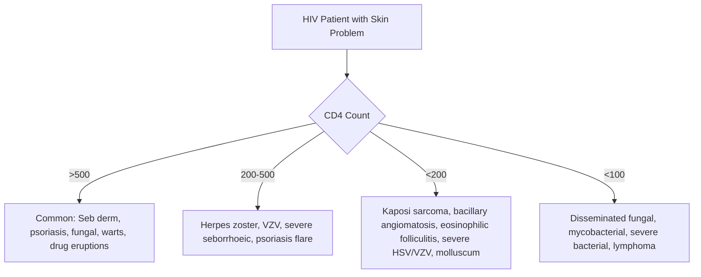
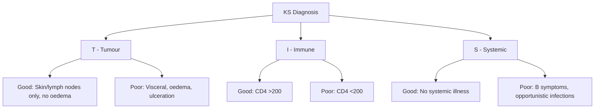
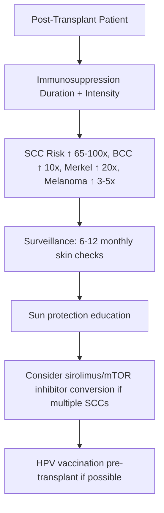

# HIV Immunocompromise Hub

---
tags: [medicine, dermatology, heading-hub, scaffold-hub]
davidson_part: Part 3: Clinical Medicine
davidson_chapter: Chapter 29: Dermatology
heading: Cutaneous Manifestations of HIV/AIDS & Immunocompromise
topic_group:
topic:
status: full-fcps-mrcp-hub
priority: high
created: 2026-06-15
modified: 2026-06-15
exam_relevance: [FCPS, MRCP Part 1, MRCP Part 2, PACES]
see_also:
  - "[[Dermatology MOC]]"
  - "[[Davidson Chapter 29 - Dermatology Hierarchy]]"
  - "[[../11_Genodermatoses/Genodermatoses Hub]]"
---

# HIV & Immunocompromise Hub

> [!info]
> **Davidson Ch29 Section 12** | **3 Topic Groups, 8 Disease Topics** | **Priority: HIGH**

---

## Topic Groups in this Section

| # | Topic Group | Disease Topics | Status |
|---|-------------|----------------|--------|
| 12.1 | HIV-Associated Dermatoses | 6 | 🔴 scaffold |
| 12.2 | Post-Transplant Dermatoses | 5 | 🔴 scaffold |
| 12.3 | Other Immunocompromised States | 4 | 🔴 scaffold |

---

## High-Yield Summary Table

| Condition | Clinical Key | CD4 Association | Management | Key Point |
|-----------|--------------|-----------------|------------|-----------|
| **Seborrhoeic dermatitis (HIV)** | Scalp/face scaling, severe, refractory | <200 | Antifungals, mild steroids, ART | Flares with immune recovery |
| **Psoriasis (HIV)** | Severe, refractory, inverse, pustular | <200 | UVB, acitretin (avoid MTX), biologics ✓ | Paradoxical on ART |
| **Eosinophilic folliculitis (Ofuji)** | Pruritic follicular papules, shoulders/arms | <200 | Topical steroids, antihistamines, UVB, ART | Clinical diagnosis |
| **Kaposi Sarcoma** | Violaceous plaques/nodules, mucosal, lymphoedema | <200 | ART, local RT, chemo (liposomal doxorubicin), immunotherapy | HHV-8 driven |
| **Bacillary Angiomatosis** | Vascular papules/nodules, fever, immunocompromised | <100 | **Doxycycline/erythromycin** | Bartonella henselae/quintana |
| **Molluscum (HIV)** | Giant, extensive, facial, refractory | <100 | Curettage, topical, ART | Extensive = low CD4 |
| **Herpes Simplex/Zoster (HIV)** | Severe, chronic, extensive, recurrent | <200 | High-dose aciclovir/valaciclovir, IV if severe | Resistance possible |
| **Drug Eruptions (HIV)** | High incidence (TMP-SMX, ART), SCAR risk | Any | Avoid culprit, desensitisation if needed | SCARs more common |

---

## Key Algorithms

### HIV Dermatoses by CD4 Count

### Kaposi Sarcoma Staging (TIS)

### Post-Transplant Skin Cancer Risk

---

## FCPS/MRCP Viva Topics (High-Yield)

1. **HIV dermatoses by CD4** - seborrhoeic (>500), herpes zoster (200-500), KS/eosinophilic folliculitis/bacillary angiomatosis (<200)
2. **Kaposi sarcoma** - HHV-8, TIS staging, violaceous plaques/nodules, mucosal, lymphoedema, ART 1st line
3. **Eosinophilic folliculitis (Ofuji)** - pruritic follicular papules shoulders/arms, CD4<200, eosinophils in infiltrate, UVB helps
4. **Bacillary angiomatosis** - Bartonella henselae/quintana, vascular lesions, fever, **doxycycline 1st line**, CD4<100
5. **Drug reactions in HIV** - high incidence with TMP-SMX, ART, SCARs more common, desensitisation for TMP-SMX
6. **Post-transplant skin cancer** - SCC 65-100x risk, field carcinogenesis, 6-12 monthly surveillance, mTOR inhibitors reduce risk
7. **Post-transplant warts** - extensive, refractory, HPV-related, treat with cryo/laser/immunotherapy, consider reduction
8. **Immunosuppressed infections** - HSV/VZV severe/chronic, fungal (candidiasis, dermatophytes, moulds), TB atypical
9. **IRIS (Immune Reconstitution Inflammatory Syndrome)** - paradoxical worsening of dermatoses (KS, herpes, BCG) after ART initiation
10. **Primary immunodeficiency skin signs** - chronic mucocutaneous candidiasis (AIRE/STAT1), hyper-IgE (STAT3), Wiskott-Aldrich (WAS)

---

## Mnemonics

- **HIV dermatoses by CD4:** `HIV SKIN` = **H**IV = **S**eb derm (>500), **K**S (<200), **I**mmuno folliculitis (<200), **N**eoplasms/Infections (<100)
- **KS TIS Staging:** `TIS` = **T**umour (Good: skin/nodes only / Poor: visceral, oedema), **I**mmune (Good: CD4>200 / Poor: CD4<200), **S**ystemic (Good: asymptomatic / Poor: B symptoms, OIs)
- **Bacillary Angiomatosis:** `BA = BARTONELLA` = **B**acillary **A**ngiomatosis = **B**artonella, **A**ngiomatous, **R**esponsive to **T**etracyclines, **O**ccurs in **N**eutropenic/Immunocompromised, **N**eeds **E**rythromycin/Doxycycline, **L**esions **L**ike KS, **A**ngioid
- **Transplant SCC risk:** `TRANSPLANT SCC` = **T**RANSPLANT = **S**CC risk 65-100x, **C**onverts to mTOR (sirolimus) reduces, **C**ancer surveillance 6-12 monthly

---

## Quick Revision Card

| Condition | CD4 Trigger | Key Clinical | 1st Line | Pearl |
|-----------|-------------|--------------|----------|-------|
| **Seb derm (HIV)** | >200 | Severe, refractory scaling | Ketoconazole + mild TCS | Flares on ART (IRIS) |
| **Psoriasis (HIV)** | <200 | Severe, inverse, pustular | UVB, Acitretin, Biologics | Avoid MTX (hepatotoxicity) |
| **Eosinophilic Folliculitis** | <200 | Pruritic follicular shoulders | Topical TCS, UVB, ART | Ofuji disease |
| **Kaposi Sarcoma** | <200 | Violaceous plaques/nodules | **ART**, RT, Liposomal Doxo | HHV-8, TIS staging |
| **Bacillary Angiomatosis** | <100 | Vascular papules, fever | **Doxycycline** | Bartonella |
| **Molluscum (HIV)** | <100 | Giant, extensive, facial | Curettage, ART | Extensive = low CD4 |
| **HSV/VZV (HIV)** | <200 | Severe, chronic, resistant | High-dose Valaciclovir/IV Aciclovir | Resistance testing |
| **Post-Tx SCC** | Duration | Multiple, aggressive | Surgery, mTOR conversion, surveillance | 65-100x risk |
| **IRIS Dermatoses** | Post-ART | Paradoxical worsening | Continue ART, steroids if severe | KS, herpes, BCG |

---

## Linkage

- **MOC:** [[Dermatology MOC]]
- **Hierarchy:** [[Davidson Chapter 29 - Dermatology Hierarchy]]
- **Section Dir:** `12_HIV_Immunocompromise/`
- **Previous Hub:** [[../11_Genodermatoses/Genodermatoses Hub]]
- **Next Hub:** [[../13_Special_Populations/Special Populations Hub]]

---

## Progress
- [ ] 12.1 HIV-Associated Dermatoses Hub (scaffold-hub)
- [ ] 12.2 Post-Transplant Dermatoses Hub (scaffold-hub)
- [ ] 12.3 Other Immunocompromised Hub (scaffold-hub)
- [ ] 8 Disease Topics (scaffold → full-fcps-mrcp-note)