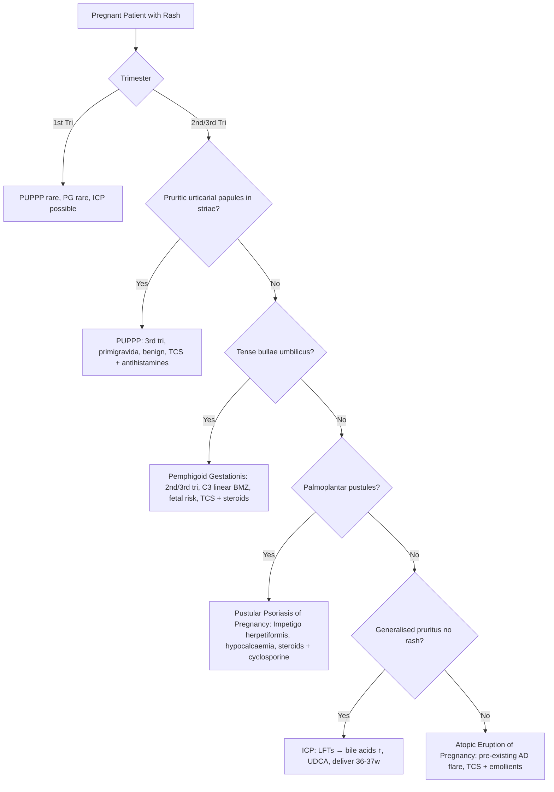

# Special Populations Hub

---
tags: [medicine, dermatology, heading-hub, scaffold-hub]
davidson_part: Part 3: Clinical Medicine
davidson_chapter: Chapter 29: Dermatology
heading: Dermatology in Special Populations
topic_group:
topic:
status: full-fcps-mrcp-hub
priority: high
created: 2026-06-15
modified: 2026-06-15
exam_relevance: [FCPS, MRCP Part 1, MRCP Part 2, PACES]
see_also:
  - "[[Dermatology MOC]]"
  - "[[Davidson Chapter 29 - Dermatology Hierarchy]]"
  - "[[../12_HIV_Immunocompromise/HIV Immunocompromise Hub]]"
---

# Special Populations Hub

> [!info]
> **Davidson Ch29 Section 13** | **3 Topic Groups, 10 Disease Topics** | **Priority: HIGH**

---

## Topic Groups in this Section

| # | Topic Group | Disease Topics | Status |
|---|-------------|----------------|--------|
| 13.1 | Paediatric Dermatology | 7 | 🔴 scaffold |
| 13.2 | Dermatology in Pregnancy | 7 | 🔴 scaffold |
| 13.3 | Geriatric Dermatology | 6 | 🔴 scaffold |

---

## High-Yield Summary Table

| Population | Key Conditions | Key Considerations | Teratogenic Drugs (Avoid) | Safe Drugs |
|------------|----------------|-------------------|---------------------------|------------|
| **Paediatric** | AD (infancy), haemangiomas, infections, genodermatoses, nappy rash | Growth, development, parental adherence, vaccine schedule | - | Emollients, mild TCS, NB-UVB |
| **Pregnancy** | PUPPP, pemphigoid gestationis, ICP, pustular psoriasis preg, atopic eruption preg | Maternal-fetal safety, placental transfer, breastfeeding | **Retinoids, MTX, MMF, Hydroxyurea, Thalidomide, TNFα (certolizumab OK)** | TCS, UVB, Azathioprine, Ciclosporin, Certolizumab |
| **Geriatric** | Pruritus, pressure ulcers, leg ulcers, skin cancers, drug eruptions | Polypharmacy, comorbidities, skin fragility, adherence | - | Review meds, emollients, compression |

---

## Key Algorithms

### Pregnancy-Specific Dermatoses


### Teratogenicity Categories (FDA Old / Current)
```mermaid
flowchart TD
    A[Avoid in Pregnancy] --> B[Category X: Retinoids (isotretinoin, acitretin), Thalidomide]
    A --> C[Category D: MTX, MMF, Hydroxyurea, Valproate, ACEi]
    A --> D[Biologics: Anti-TNF (except certolizumab - no Fc) → avoid 2nd/3rd tri]
    A --> E[JAK Inhibitors: Avoid]
    A --> F[Ciclosporin/AZ/MTX: AZ/MTX avoid; Ciclosporin cautious; Tacrolimus topical OK]
```

### Paediatric Vascular Tumours
```mermaid
flowchart TD
    A[Infantile Vascular Lesion] --> B{Proliferating?}
    B -->|Yes| C[Infantile Haemangioma: 3 phases - proliferative (0-12m), involuting (1-7y), involuted]
    C --> D{Complicated?}
    D -->|Yes (ulceration, airway, vision, hepatic)| E[Propranolol 1-3mg/kg/d, topical timolol superficial]
    D -->|No| F[Observation, photograph, reassure]
    B -->|No| G[Vascular Malformation: Capillary (port-wine), Venous, Lymphatic, Arteriovenous]
    G --> H[Referral: Laser (port-wine), Sclerotherapy, Embolisation, Sirolimus (complex)]
```

---

## FCPS/MRCP Viva Topics (High-Yield)

1. **Pregnancy dermatoses** - PUPPP (3rd tri, primigravida, striae, benign), PG (bullae, C3 linear BMZ, fetal risk), ICP (pruritus, bile acids↑, UDCA, deliver 36-37w), Pustular psoriasis of pregnancy (hypocalcaemia, impetigo herpetiformis), Atopic eruption of pregnancy
2. **Teratogenic drugs** - Retinoids (X), MTX (D), MMF (D), Hydroxyurea, Thalidomide (X), Anti-TNF (avoid 2nd/3rd except certolizumab), JAKi (avoid)
3. **Safe in pregnancy** - TCS (all potencies, avoid clobetasol prolonged), UVB (narrowband), Azathioprine, Ciclosporin, Certolizumab (no Fc), Hydroxychloroquine
4. **Infantile haemangioma** - proliferative 0-12m, involution 1-7y, propranolol 1st line for complicated, topical timolol for superficial
5. **Vascular malformations** - port-wine (capillary, laser), venous, lymphatic, arteriovenous (ISSVA classification)
6. **Genodermatoses in infancy** - collodion baby (lamellar/CIE), harlequin ichthyosis, epidermolytic, Netherton, incontinentia pigmenti
7. **Paediatric infections** - impetigo, molluscum, warts, tinea capitis (griseofulvin), scabies, HSV, eczema herpeticum
8. **Geriatric pruritus** - xerosis, drugs, systemic (renal, hepatic, thyroid, malignancy), neuropathic
9. **Leg ulcers** - venous (gaiter, lipodermatosclerosis, compression), arterial (punched-out, painful, ABPI), mixed
10. **Pressure ulcers** - NPUAP staging, prevention (repositioning, nutrition, support surfaces), wound care

---

## Mnemonics

- **Pregnancy dermatoses:** `PUPPP_PG_ICP` = **P**UPPP (3rd tri, primigravida, **P**ruritic **U**rticarial **P**apules **P**laques in **P**regnancy) / **P**emphigoid **G**estationis (bullae, C3 linear, fetal risk) / **I**CP (pruritus, bile acids, UDCA, deliver 36-37w)
- **Teratogens:** `RETINOID MTX` = **R**etinoids (X), **E**thanol? No - **M**TX (D), **M**MF (D), **T**halidomide (X), **J**AKi (avoid), **A**nti-TNF (avoid 2nd/3rd)
- **Safe in pregnancy:** `SAFE DRUGS` = **S**teroids (topical), **A**zathioprine, **F**olic acid (with MTX), **E**mollients, **D**iphenhydramine, **R**UVB, **U**stekinumab? No - **G**lycocorticoids (ciclosporin), **S**ulfasalazine
- **Infantile haemangioma:** `PROPRANOLOL` = **P**roliferating phase, **R**equires treatment if **O**bstructive/**U**lcerated/**P**Rolaps/**R**etinopathy/**A**nemia/**N**ecrosis/**O**rgan/**L**ife-threatening = **PROPRANOLOL**

---

## Quick Revision Card

| Population | Key Condition | Key Feature | 1st Line | Red Flag |
|------------|---------------|-------------|----------|----------|
| **Pregnancy** | PUPPP | 3rd tri, primigravida, striae | TCS + antihistamine | - |
| **Pregnancy** | Pemphigoid Gestationis | Tense bullae, umbilicus→generalised | TCS + systemic steroids | **Fetal risk (prematurity, SGA)** |
| **Pregnancy** | ICP | Pruritus no rash, bile acids↑ | **UDCA**, deliver 36-37w | **Stillbirth risk** |
| **Pregnancy** | Pustular Psoriasis Preg | Palmoplantar pustules, hypocalcaemia | Steroids + Cyclosporine | **Maternal/fetal mortality** |
| **Infant** | Haemangioma | Proliferative 0-12m | Propranolol if complicated | Airway, vision, hepatic |
| **Infant** | Port-wine stain | Capillary malformation, V1? | Pulsed dye laser | **Sturge-Weber if V1** |
| **Geriatric** | Pruritus | Xerosis, drugs, systemic | Emollients, treat cause | **Malignancy occult** |
| **Geriatric** | Venous ulcer | Gaiter, lipodermatosclerosis | **Compression** (ABPI>0.8) | ABPI<0.5 = arterial |
| **Geriatric** | Pressure ulcer | Sacrum/heel, NPUAP staging | Prevention, nutrition, offloading | Osteomyelitis |

---

## Linkage

- **MOC:** [[Dermatology MOC]]
- **Hierarchy:** [[Davidson Chapter 29 - Dermatology Hierarchy]]
- **Section Dir:** `13_Special_Populations/`
- **Previous Hub:** [[../12_HIV_Immunocompromise/HIV Immunocompromise Hub]]
- **Next Hub:** [[../14_Emergencies/Emergencies Hub]]

---

## Progress
- [ ] 13.1 Paediatric Dermatology Hub (scaffold-hub)
- [ ] 13.2 Dermatology in Pregnancy Hub (scaffold-hub)
- [ ] 13.3 Geriatric Dermatology Hub (scaffold-hub)
- [ ] 10 Disease Topics (scaffold → full-fcps-mrcp-note)