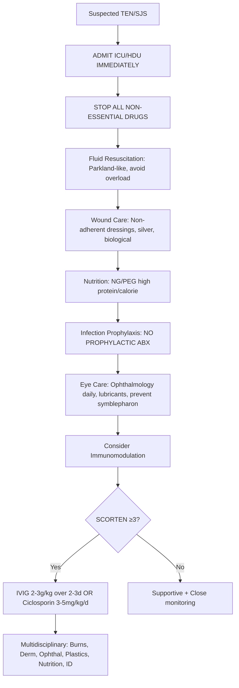
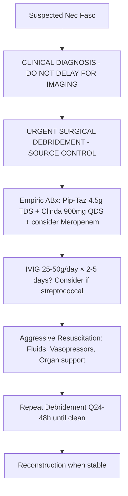
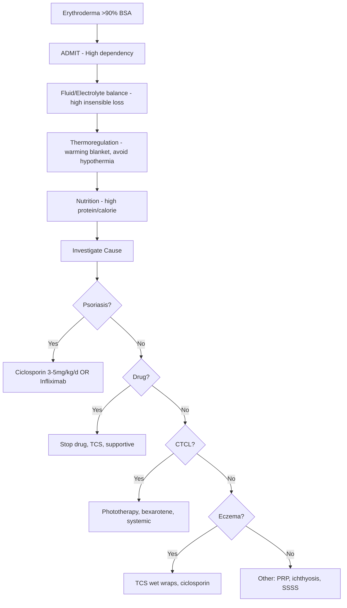

# Dermatological Emergencies Hub

> [!info]
> **Davidson Ch29 Section 14** | **3 Topic Groups, 10 Disease Topics** | **Priority: CRITICAL**

---

## Topic Groups in this Section

| # | Topic Group | Disease Topics | Status |
|---|-------------|----------------|--------|
| 14.1 | Life-Threatening Drug Reactions | 4 | 🔴 scaffold |
| 14.2 | Infectious Emergencies | 7 | 🔴 scaffold |
| 14.3 | Other Dermatological Emergencies | 6 | 🔴 scaffold |

---

## High-Yield Summary Table

| Emergency | Key Recognition | Immediate Action | Mortality | Disposition |
|-----------|-----------------|------------------|-----------|-------------|
| **TEN** | >30% BSA detachment, mucosa ≥2, Nikolsky+ | **ICU**, STOP drug, fluids, nutrition, consider IVIG/ciclosporin | 30-50% | Burns unit / ICU |
| **SJS** | <10% BSA detachment, mucosa ≥2 | **ICU/HDU**, STOP drug, supportive | 5-10% | HDU / Derm |
| **DRESS** | Fever, eosinophilia, organ involvement, latency 2-6w | STOP drug, prednisolone 1mg/kg, monitor organs | 5-10% | Medical ward / HDU |
| **AGEP** | Acute pustules, neutrophilia, fever, latency 1-5d | STOP drug, supportive, topical steroids | <5% | Derm ward |
| **Necrotising Fasciitis** | Pain >> erythema, crepitus, rapid spread, LRINEC≥6 | **EMERGENCY SURGERY** + Pip-Taz + Clinda + IVIG | 20-40% | ICU + Theatre |
| **Staphylococcal Scalded Skin** | Neonates/children, diffuse erythema, Nikolsky+, no mucosa | IV Flucloxacillin + Clindamycin, fluids, skin care | <5% (kids) | Paeds / Burns |
| **Eczema Herpeticum** | AD + punched-out erosions, punched-out vesicles, fever | **IV Aciclovir urgent**, swabs, bacterial cover | Low if treated | Paeds / Derm HDU |
| **Mucormycosis** | Immunocompromised, black eschar, angioinvasion, palatal necrosis | **Surgery + Liposomal Amphotericin B**, control diabetes | 50-80% | ICU + ENT + MaxFax |
| **Erythroderma** | >90% BSA erythema, thermoregulation failure, high output cardiac failure | Fluids, thermoregulation, nutrition, treat cause (TCS, ciclosporin) | 10-30% | HDU / Derm |
| **Sweet Syndrome** | Fever, neutrophilia, tender plaques/papules, neutrophils in dermis | Prednisolone 0.5-1mg/kg, investigate underlying (malignancy, drugs) | Low | Derm / Med |

---

## Key Algorithms

### TEN/SJS Emergency Protocol

### Necrotising Fasciitis - Surgical Emergency

### Erythroderma Assessment

---

## FCPS/MRCP Viva Topics (High-Yield)

1. **TEN vs SJS vs overlap** - BSA detachment %, SCORTEN, immediate ICU admission, STOP drug
2. **SCORTEN** - 7 variables, score ≥3 = 35% mortality, each variable 1 point
3. **DRESS vs AGEP** - RegiSCAR vs EUROSCAR, eosinophilia vs neutrophilia, latency
4. **Necrotising fasciitis** - LRINEC ≥6, PAIN OUT OF PROPORTION, surgical emergency, ABx regimen
5. **Staphylococcal scalded skin syndrome** - exfoliative toxin, Ritter disease, neonates/children, Nikolsky+, mucosa spared, IV flucloxacillin + clindamycin
6. **Eczema herpeticum** - AD + punched-out erosions/vesicles, fever, **IV aciclovir urgent**, Tzanck/PCR
7. **Erythroderma** - >90% BSA, causes (psoriasis, drugs, CTCL, eczema), thermoregulation, high-output cardiac failure, ciclosporin for psoriasis
8. **Sweet syndrome** - fever, neutrophilia, tender plaques, dense dermal neutrophils, steroids, investigate malignancy/drugs
9. **Mucormycosis** - immunocompromised/DKA, angioinvasion, black eschar, palatal necrosis, **surgery + liposomal amphotericin B**
10. **Drug reaction monitoring** - SCARs: SJS/TEN (1-4w), DRESS (2-6w), AGEP (1-5d), FDE (hours-days)

---

## Mnemonics

- **SCORTEN (TEN):** `SCORTEN` = **S**evere malignancy, **C**ardiac disease, **O**lder >40, **R**ate BSA >10%, **T**achycardia >120, **E**pidermal detachment >10%, **N** urea >10 mmol/L
- **RegiSCAR (DRESS):** `REGISCAR` = **R**ash >50% BSA, **E**osinophilia >1.5, **G**lycemia? No - **G**landular (lymphadenopathy), **I**nterstitial? No - **I**ntrapulmonary? No - **S**ystemic organ, **C**ytopenia, **A**typical lymphs, **R**esolution >15d → ≥5 = definite
- **EUROSCAR (AGEP):** `EUROSCAR` = **E**xtensive pustules **U**nder 4 days, **R**apid onset, **O**rgan? No - **O**rgan rare, **S**terile pustules histology, **C**onfirmed neutrophilic, **A**bsent eosinophilia, **R**esolution <15d
- **LRINEC (Nec Fasc):** `CR HWN` = **C**RP >150, **R**enal (Cr >141), **H**b <11, **W**BC >25, **N**a <135
- **TEN vs SJS vs Overlap:** `BSA%` = **SJS** <10%, **Overlap** 10-30%, **TEN** >30% (all have mucosa ≥2)

---

## Quick Revision Card

| Emergency | Recognition | Immediate | Key Score | Mortality |
|-----------|-------------|-----------|-----------|-----------|
| **TEN** | >30% BSA detach, mucosa ≥2 | ICU, STOP drug, fluids, wound care | SCORTEN ≥3 = 35%+ | 30-50% |
| **SJS** | <10% BSA detach, mucosa ≥2 | HDU/ICU, STOP drug | SCORTEN | 5-10% |
| **SJS/TEN Overlap** | 10-30% BSA, mucosa ≥2 | ICU, STOP drug | SCORTEN | 20-30% |
| **DRESS** | Fever, eosinophilia, organ, 2-6w | STOP drug, Pred 1mg/kg | RegiSCAR ≥5 | 5-10% |
| **AGEP** | Pustules, neutrophilia, 1-5d | STOP drug, supportive | EUROSCAR | <5% |
| **Nec Fasc** | Pain>>erythema, crepitus, rapid | **SURGERY** + Pip-Taz+Clinda+IVIG | LRINEC ≥6 | 20-40% |
| **SSSS** | Neonates, diffuse, Nikolsky+, no mucosa | IV Fluclox + Clinda | Clinical | <5% |
| **Eczema Herpeticum** | AD + punched-out erosions | **IV Aciclovir** | Clinical | Low if Rx |
| **Erythroderma** | >90% BSA erythema | Fluids, temp, nutrition, Ciclosporin (Pso) | - | 10-30% |
| **Sweet Syndrome** | Fever, neutrophilia, tender plaques | Pred 0.5-1mg/kg | - | Low |

---

## Linkage

- **MOC:** [[Dermatology MOC]]
- **Hierarchy:** [[Davidson Chapter 29 - Dermatology Hierarchy]]
- **Section Dir:** `14_Emergencies/`
- **Previous Hub:** [[../13_Special_Populations/Special Populations Hub]]
- **Chapter Complete:** ✅ All 14 Heading Hubs created

---

## Progress
- [ ] 14.1 Life-Threatening Drug Reactions Hub (scaffold-hub)
- [ ] 14.2 Infectious Emergencies Hub (scaffold-hub)
- [ ] 14.3 Other Emergencies Hub (scaffold-hub)
- [ ] 10 Disease Topics (scaffold → full-fcps-mrcp-note)