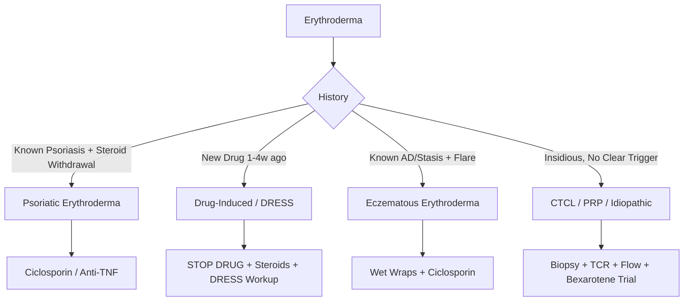

# Erythroderma Hub

---
tags: [medicine, dermatology, topic-group-hub, scaffold-hub]
davidson_part: Part 3: Clinical Medicine
davidson_chapter: Chapter 29: Dermatology
heading: Papulosquamous & Eczematous Disorders
topic_group: Erythroderma
topic:
status: full-fcps-mrcp-hub
priority: critical
created: 2026-06-15
modified: 2026-06-15
exam_relevance: [FCPS, MRCP Part 1, MRCP Part 2, PACES]
see_also:
  - "[[Papulosquamous and Eczematous Hub]]"
  - "[[Dermatology MOC]]"
---

# Erythroderma Hub

> [!info]
> **Topic Group 2.5** | **4 Disease Topics** | **Priority: CRITICAL**

---

## Disease Topics in this Group

| # | Topic | Status | Priority |
|---|-------|--------|----------|
| 1 | Erythroderma causes and approach | 🔴 scaffold | Critical |
| 2 | Psoriatic erythroderma | 🔴 scaffold | High |
| 3 | Drug-induced erythroderma | 🔴 scaffold | High |
| 4 | Erythroderma in cutaneous T-cell lymphoma | 🔴 scaffold | High |

---

## High-Yield Summary

| Cause | Frequency | Key Features | Urgency |
|-------|-----------|--------------|---------|
| **Psoriasis** | ~25% | Pre-existing psoriasis, sudden withdrawal steroids, pustular → erythrodermic | High |
| **Drug-induced** | ~20% | Latency 1-4w, eosinophilia, fever, DRESS overlap | **Stop drug immediately** |
| **Eczema (AD, contact, stasis)** | ~15% | Pre-existing eczema, severe flare, superinfection | High |
| **CTCL (MF/SS)** | ~10% | Insidious, lymphadenopathy, Sézary cells, TCR rearrangement | Specialist referral |
| **Pityriasis rubra pilaris** | ~5% | Orange-red, islands of sparing, palmoplantar keratoderma | High |
| **Other** | ~25% | Ichthyosis, drug reaction, SJS/TEN overlap, lymphoma, leukaemia, idiopathic | Variable |

---

## Key Algorithms

### Erythroderma Workup
```mermaid
flowchart TD
    A[Erythroderma >90% BSA] --> B[ADMIT HDU/ICU]
    B --> C[Emergency: Fluids, Electrolytes, Temperature, Nutrition, Infection screen]
    C --> D[History: Drugs, Pre-existing skin disease, Systems]
    D --> E[Exam: Lymph nodes, Liver/Spleen, Nails, Mucosa, Scalp]
    E --> F[Investigations]
    F --> G[FBC, U&E, LFT, CRP, ESR, IgE, Tryptase]
    F --> H[Blood film: Sézary cells?]
    F --> I[Skin Biopsy: H&E + DIF + TCR rearrangement]
    F --> J[Patch test if drug? (delayed)]
    F --> K[HIV, HTLV-1, Flow cytometry if CTCL suspected]
    G & H & I & J & K --> L{Differential}
    L -->|Psoriasis| M[Ciclosporin 3-5mg/kg OR Infliximab]
    L -->|Drug| N[STOP DRUG, Pred 1mg/kg, Monitor organs]
    L -->|Eczema| O[Wet wraps, Ciclosporin, Treat infection]
    L -->|CTCL| P[Referral: Bexarotene, ECP, Mogamulizumab]
    L -->|PRP| Q[Acitretin, MTX, IL-17/23]
```

### Red Man Syndrome Differentiation


---

## FCPS/MRCP Viva Topics

1. **Erythroderma definition** - >90% BSA erythema, scaling, thermoregulation failure, high-output cardiac failure
2. **Causes** - Psoriasis (25%), Drugs (20%), Eczema (15%), CTCL (10%), PRP (5%), Others
3. **Emergency management** - Admit HDU, fluids (high insensible loss), temperature regulation, nutrition, infection screen
4. **Workup** - FBC (eosinophilia), U&E, LFT, IgE, blood film (Sézary), biopsy (H&E + DIF + TCR), HIV/HTLV-1
5. **Psoriatic erythroderma** - steroid withdrawal trigger, ciclosporin 1st line, infliximab if failing
6. **Drug-induced erythroderma** - STOP drug, DRESS overlap, prednisolone 1mg/kg, monitor organs
7. **CTCL erythroderma** - Sézary syndrome (B2 blood), T-cell receptor rearrangement, bexarotene, ECP, mogamulizumab
8. **PRP erythroderma** - islands of sparing, palmoplantar keratoderma, acitretin 1st line
9. **Complications** - hypothermia, high-output cardiac failure, infection, electrolyte imbalance, protein loss
10. **Biopsy timing** - wait 2-4w if possible for TCR rearrangement, but don't delay treatment

---

## Mnemonics

- **Erythroderma causes:** `RED SKIN` = **R**CTCL, **E**czema, **D**rugs, **S**eborrhoeic? No - **S**treptococcal? No - **K**eratinisation (ichthyosis), **I**d reaction, **N**eoplasia (CTCL), **P**soriasis, **R**ed man syndrome
- **Emergency ABCs:** `FLUIDS TEMP NUTRITION INFECTION` = **FLUIDS** (insensible loss 2-3L/day), **TEMP** (thermoregulation failure), **NUTRITION** (high protein loss), **INFECTION** (S. aureus, herpes)
- **Erythroderma biopsy:** `H&E DIF TCR` = **H**&E (spongiosis vs psoriasiform vs epidermotropism), **DIF** (vessel deposits, BMZ), **TCR** (clonality = CTCL)

---

## Linkage

- **Parent Hub:** [[Papulosquamous and Eczematous Hub]]
- **MOC:** [[Dermatology MOC]]
- **Disease Topics:** See individual files in `02_Papulosquamous_Eczematous/`

---

## Progress
- [ ] Erythroderma causes and approach (scaffold → full)
- [ ] Psoriatic erythroderma (scaffold → full)
- [ ] Drug-induced erythroderma (scaffold → full)
- [ ] Erythroderma in CTCL (scaffold → full)