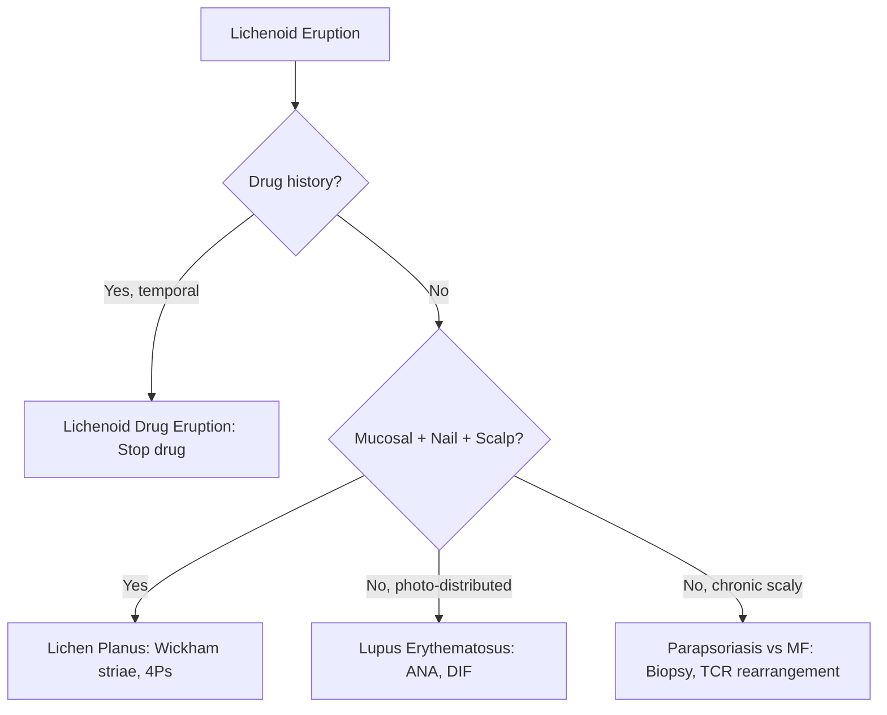

# Other Papulosquamous Hub

---
tags: [medicine, dermatology, topic-group-hub, scaffold-hub]
davidson_part: Part 3: Clinical Medicine
davidson_chapter: Chapter 29: Dermatology
heading: Papulosquamous & Eczematous Disorders
topic_group: Other Papulosquamous Disorders
topic:
status: full-fcps-mrcp-hub
priority: high
created: 2026-06-15
modified: 2026-06-15
exam_relevance: [FCPS, MRCP Part 1, MRCP Part 2, PACES]
see_also:
  - "[[Papulosquamous and Eczematous Hub]]"
  - "[[Dermatology MOC]]"
---

# Other Papulosquamous Disorders Hub

> [!info]
> **Topic Group 2.2** | **6 Disease Topics** | **Priority: HIGH**

---

## Disease Topics in this Group

| # | Topic | Status | Priority |
|---|-------|--------|----------|
| 1 | Lichen planus (cutaneous, mucosal, nail, scalp) | 🔴 scaffold | Critical |
| 2 | Lichenoid drug eruption | 🔴 scaffold | High |
| 3 | Pityriasis rosea | 🔴 scaffold | High |
| 4 | Pityriasis rubra pilaris | 🔴 scaffold | Medium |
| 5 | Parapsoriasis (small/large plaque) | 🔴 scaffold | Medium |
| 6 | Cutaneous T-cell lymphoma (early/MF/SS) | 🔴 scaffold | Critical |

---

## High-Yield Summary

| Disorder | Key Clinical | Histology | Key Differential | Management |
|----------|--------------|-----------|------------------|------------|
| **Lichen planus** | 4Ps: Pruritic, Purple, Polygonal, Planar; Wickham striae, Koebner, mucosal (reticular/erosive), nail (longitudinal striation/pterygium), scalp (LPP) | Sawtooth rete, basal degeneration, band-like lymphocytic infiltrate | Lichenoid drug, lupus, lichenoid keratosis | Potent TCS, phototherapy, systemic (acitretin, MTX, HCQ) |
| **Lichenoid drug eruption** | Similar to LP + photodistribution, resolves on withdrawal | Identical to LP + eosinophils, parakeratosis | Lichen planus, fixed drug eruption | **Stop drug**, TCS, phototherapy |
| **Pityriasis rosea** | Herald patch → Christmas tree distribution, self-limiting 6-12w, HHV-6/7 | Superficial perivascular lymphocytic, focal parakeratosis | Tinea, guttate psoriasis, syphilis, drug eruption | Reassurance, emollients, antihistamines, UVB if prolonged |
| **Pityriasis rubra pilaris** | Orange-red scaly plaques, islands of sparing, palmoplantar keratoderma, follicular papules | Alternating ortho/parakeratosis, follicular plugging | Psoriasis, erythroderma, ichthyosis | Acitretin (1st line), MTX, biologics (IL-17/23), UVB |
| **Parapsoriasis** | Small plaque (digitate, benign) vs Large plaque (pre-MF, poikiloderma) | Superficial perivascular lymphocytic | MF (large plaque), eczema, psoriasis | Small: observe/TCS; Large: phototherapy, monitor for MF |
| **CTCL (MF/SS)** | MF: patches → plaques → tumours; SS: erythroderma + Sézary cells >1000/μL | Epidermotropism, Pautrier microabscesses, cerebriform nuclei | Parapsoriasis, erythroderma, drug eruption | Stage-based: skin-directed (UVB, topical, RT) → systemic (bexarotene, IFN, HDACi, anti-CCR4) |

---

## Key Algorithms

### Lichenoid Reaction Differential


### CTCL Staging → Management
```mermaid
flowchart TD
    A[CTCL Diagnosis] --> B{Stage}
    B -->|IA/IB (Patches/Plagues <10%/10-20%)| C[Skin-directed: TCS, NB-UVB, PUVA, RT, Bexarotene gel]
    B -->|IIA/IIB (Tumours)| D[Skin-directed +/− Systemic: Bexarotene, IFN-α, HDACi (vorinostat)]
    B -->|III (Erythroderma)| E[Systemic: Bexarotene, IFN-α, ECP, Anti-CCR4 (mogamulizumab)]
    B -->|IVA/IVB (Nodal/Visceral)| F[Systemic: Chemotherapy, Anti-CCR4, Allo-SCT]
```

---

## FCPS/MRCP Viva Topics

1. **Lichen planus** - 4Ps, Wickham striae, mucosal variants (reticular/erosive/bullous), nail (pterygium, longitudinal striation), LPP (scarring alopecia), HCV association
2. **Lichenoid drug eruption** - drugs (ACEi, beta-blockers, antimalarials, NSAIDs, gold), photo-distribution, eosinophils on biopsy, resolves on withdrawal
3. **Pityriasis rosea** - herald patch, Christmas tree (Langer's lines), self-limiting 6-12w, HHV-6/7, syphilis serology if palmar/plantar/mucosal
4. **Pityriasis rubra pilaris** - orange-red plaques, islands of sparing, palmoplantar keratoderma, follicular papules (nutmeg grater), Type V (classic adult), acitretin 1st line
5. **Parapsoriasis** - small plaque (digitate, benign, TCS) vs large plaque (poikiloderma, pre-MF, phototherapy), biopsy + TCR if large plaque
6. **Mycosis fungoides** - patches → plaques → tumours, epidermotropism, Pautrier microabscesses, TCR rearrangement, staging (TNMB)
7. **Sézary syndrome** - erythroderma + Sézary cells >1000/μL (cerebriform nuclei), CD4+CD7-/CD26-, B2 lymphoma
8. **LP vs Lichenoid drug** - drug history, photo-distribution, eosinophils, resolution on withdrawal

---

## Mnemonics

- **Lichen planus 4Ps:** `4Ps` = **P**rutitic, **P**urple, **P**olygonal, **P**lanar + **W**ickham striae
- **LP associations:** `LP HCV` = **L**ichen **P**lanus → **H**CV (screen), **C**ancer (oral SCC in erosive), **V**accines? No
- **CTCL staging:** `TNMB` = **T**umour (skin), **N**odes, **M**etastasis (visceral), **B**lood (Sézary count)
- **PRP types:** `PRP 1-6` = **I** Classical adult, **II** Atypical adult, **III** Classical juvenile, **IV** Circumscribed juvenile, **V** HIV-associated, **VI** Early onset

---

## Linkage

- **Parent Hub:** [[Papulosquamous and Eczematous Hub]]
- **MOC:** [[Dermatology MOC]]
- **Disease Topics:** See individual files in `02_Papulosquamous_Eczematous/`

---

## Progress
- [ ] Lichen planus (scaffold → full)
- [ ] Lichenoid drug eruption (scaffold → full)
- [ ] Pityriasis rosea (scaffold → full)
- [ ] Pityriasis rubra pilaris (scaffold → full)
- [ ] Parapsoriasis (scaffold → full)
- [ ] Cutaneous T-cell lymphoma (scaffold → full)