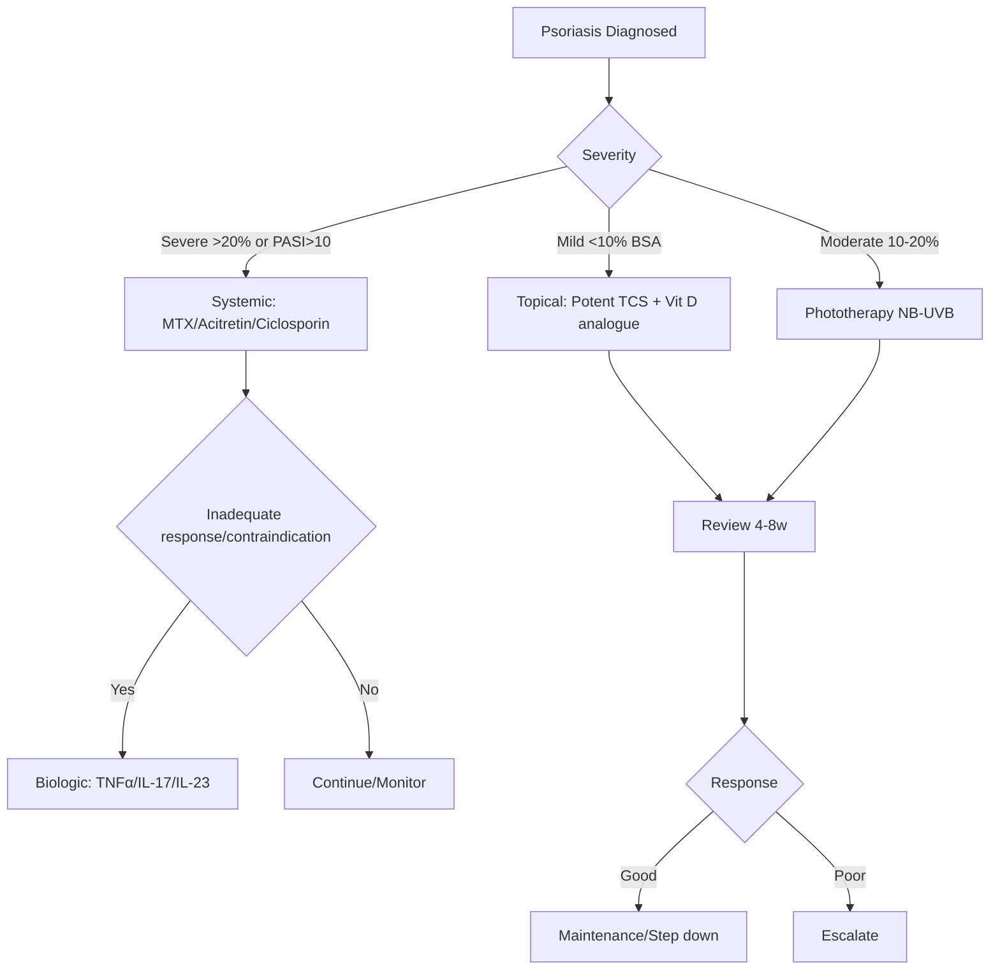

# Papulosquamous and Eczematous Hub

---
tags: [medicine, dermatology, heading-hub, scaffold-hub]
davidson_part: Part 3: Clinical Medicine
davidson_chapter: Chapter 29: Dermatology
heading: Papulosquamous & Eczematous Disorders
topic_group:
topic:
status: full-fcps-mrcp-hub
priority: critical
created: 2026-06-15
modified: 2026-06-15
exam_relevance: [FCPS, MRCP Part 1, MRCP Part 2, PACES]
see_also:
  - "[[Dermatology MOC]]"
  - "[[Davidson Chapter 29 - Dermatology Hierarchy]]"
  - "[[../01_Structure_Function_Approach/Structure and Function Hub]]"
---

# Papulosquamous & Eczematous Disorders Hub

> [!info]
> **Davidson Ch29 Section 2** | **5 Topic Groups, 24 Disease Topics** | **Priority: CRITICAL**

---

## Topic Groups in this Section

| # | Topic Group | Disease Topics | Status |
|---|-------------|----------------|--------|
| 2.1 | Psoriasis | 7 | 🔴 scaffold |
| 2.2 | Other Papulosquamous Disorders | 6 | 🔴 scaffold |
| 2.3 | Atopic Dermatitis & Related Eczemas | 5 | 🔴 scaffold |
| 2.4 | Contact Dermatitis | 5 | 🔴 scaffold |
| 2.5 | Erythroderma | 4 | 🔴 scaffold |

---

## High-Yield Summary Table

| Disease | Key Clinical | Key Investigation | First-Line Management | Biologic Target |
|---------|--------------|-------------------|----------------------|-----------------|
| **Psoriasis vulgaris** | Symmetric extensor plaques, silvery scale, Auspitz, nail pitting | Clinical (+ biopsy if atypical) | Potent TCS + Vitamin D analogue | TNFα, IL-17, IL-23, JAK |
| **Guttate psoriasis** | Acute onset, prodromal strep, teardrop papules | Throat swab, ASOT | UVB, TCS, treat strep | Same as vulgaris |
| **Pustular psoriasis** | Sterile pustules on erythema, fever, leucocytosis | FBC, CRP, LFT, electrolytes | Acitretin, cyclosporine, IL-17/23 | IL-17/23, JAK |
| **Erythrodermic psoriasis** | >90% BSA erythema, thermoregulation failure | Hospital admission, fluid balance | Cyclosporine, infliximab, acitretin | TNFα, IL-17/23 |
| **Atopic dermatitis** | Pruritic flexural dermatitis, personal/family atopy | Clinical, IgE, patch test if contact | Emollients, TCS/TCI, phototherapy | Dupilumab, JAKi |
| **Allergic contact dermatitis** | Acute: vesicles; Chronic: lichenification, geometric | Patch testing (baseline series) | Avoidance, potent TCS | - |
| **Erythroderma** | >90% BSA erythema, scaling, thermoregulation failure | Skin biopsy, FBC, LFT, IgE, T-cell clonality | Treat cause, supportive, ciclosporin | Cause-dependent |

---

## Key Algorithms

### Psoriasis Management Algorithm


### Eczema Management (Stepped Care)
```mermaid
flowchart TD
    A[Atopic Dermatitis] --> B[Emollients + Avoid triggers]
    B --> C{Control}
    C -->|Uncontrolled| D[Mild TCS face/flexures, Moderate TCS body]
    D --> E{Control}
    E -->|Uncontrolled| F[TCI (tacrolimus/pimecrolimus)]
    F --> G{Control}
    G -->|Uncontrolled| H[Phototherapy NB-UVB]
    H --> I{Control}
    I -->|Uncontrolled| J[Systemic: Ciclosporin first, then MTX/AZA/MMF]
    J --> K{Control}
    K -->|Uncontrolled| L[Biologic: Dupilumab / JAKi]
```

---

## FCPS/MRCP Viva Topics (High-Yield)

1. **Psoriasis** - types, Koebner, Auspitz, nail changes, PASI, comorbidities, biologic sequencing
2. **Atopic dermatitis** - Hanifin-Rajka/UK criteria, EASI/SCORAD, filaggrin, dupilumab/JAKi
3. **Contact dermatitis** - allergic vs irritant, patch testing methodology, standard series
4. **Lichen planus** - 4Ps, Wickham striae, mucosal variants, association with HCV
5. **Pityriasis rosea** - herald patch, Christmas tree distribution, self-limiting, HHV-6/7
6. **Erythroderma** - causes (psoriasis, drugs, CTCL, eczema), red man syndrome workup
7. **Psoriatic arthritis** - CASPAR criteria, domains, TNFα vs IL-17/23
8. **Pustular psoriasis** - GPP vs PPP, IL-36 pathway, spesolimab
9. **Cutaneous T-cell lymphoma** - MF vs SS, Sézary count, TCR gene rearrangement

---

## Mnemonics

- **Psoriasis associations:** `PSORIASIS` = **P**soriatic arthritis, **S**treptococcal trigger (guttate), **O**besity, **R**heumatoid (no, but metabolic), **I**schaemic heart disease, **A**lcoholic liver disease, **S**moking, **I**nflammatory bowel disease, **S**tress
- **Atopic march:** `A`topic dermatitis → `F`ood allergy → `A`sthma → `R`hinitis
- **Contact dermatitis:** `ALLERGIC` = **A**cute vesicles, **L**ichenified chronic, **L**ocalised to contact site, **E**czematous, **R**eaction delayed (type IV), **G**eometric borders, **I**tch prominent, **C**onfirmed by patch test
- **Erythroderma causes:** `RED SKIN` = **R**CTCL, **E**czema, **D**rugs, **S**eborrhoeic, **K**eratinisation (ichthyosis), **I**d reaction, **N**eoplasia (CTCL), **P**soriasis

---

## Quick Revision Card

| Disease | Dx Criteria | Severity Score | 1st Line | Biologic |
|---------|-------------|----------------|----------|----------|
| **Psoriasis** | Clinical | PASI, BSA, DLQI | TCS + Calcipotriol | TNFα → IL-17 → IL-23 |
| **Guttate Psoriasis** | Clinical + strep | PASI | UVB, treat strep | As vulgaris |
| **Atopic Dermatitis** | UK/Hanifin-Rajka | EASI, SCORAD, DLQI | Emollients + TCS | Dupilumab, JAKi |
| **Contact Dermatitis** | History + Patch test | - | Avoidance + TCS | - |
| **Lichen Planus** | Clinical (4Ps) | - | Potent TCS, phototherapy | - |
| **Erythroderma** | >90% BSA erythema | - | Treat cause + supportive | Cause-dependent |

---

## Linkage

- **MOC:** [[Dermatology MOC]]
- **Hierarchy:** [[Davidson Chapter 29 - Dermatology Hierarchy]]
- **Section Dir:** `02_Papulosquamous_Eczematous/`
- **Previous Hub:** [[../01_Structure_Function_Approach/Structure and Function Hub]]
- **Next Hub:** [[../03_Urticaria_Erythema_Purpura/Urticaria Erythema Purpura Hub]]

---

## Progress
- [ ] 2.1 Psoriasis Hub (scaffold-hub)
- [ ] 2.2 Other Papulosquamous Hub (scaffold-hub)
- [ ] 2.3 Atopic Dermatitis Hub (scaffold-hub)
- [ ] 2.4 Contact Dermatitis Hub (scaffold-hub)
- [ ] 2.5 Erythroderma Hub (scaffold-hub)
- [ ] 24 Disease Topics (scaffold → full-fcps-mrcp-note)