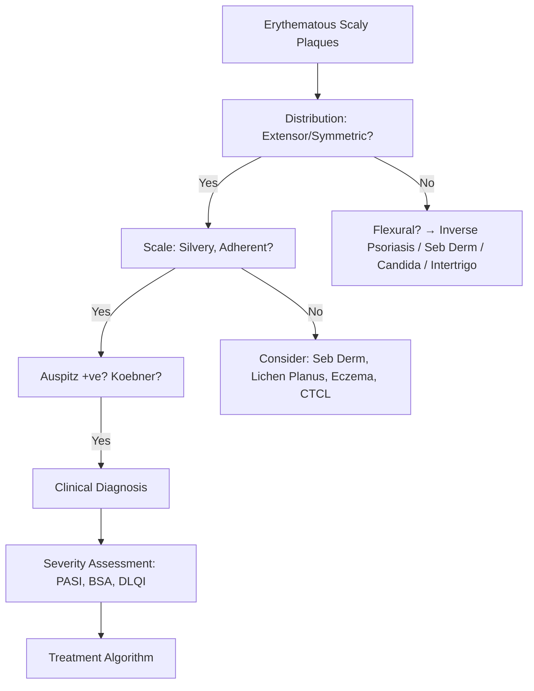
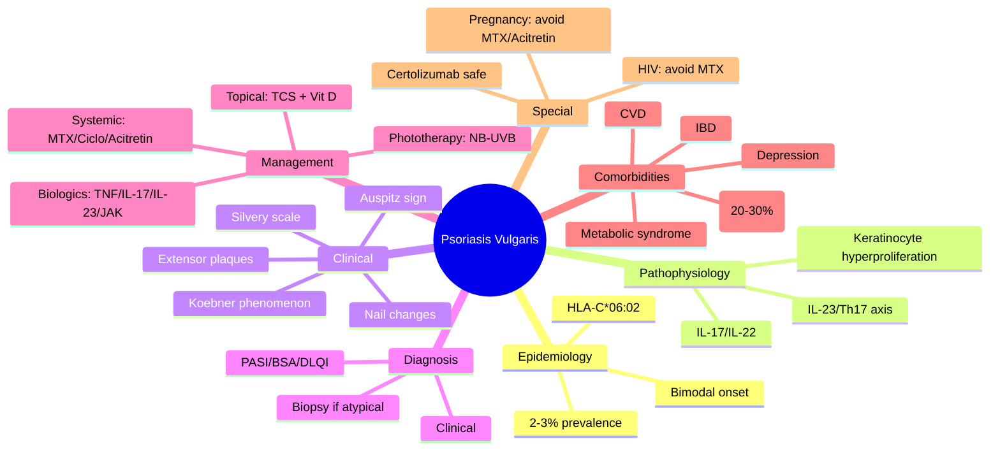
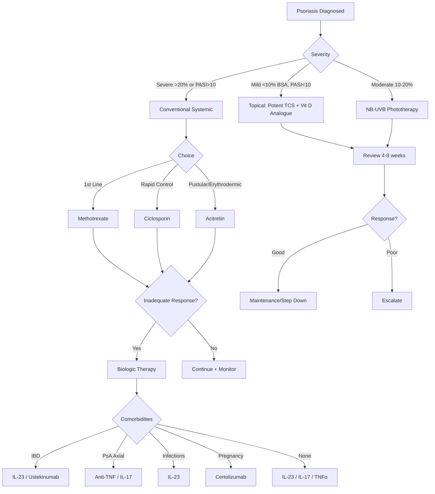

---

tags: [medicine, dermatology, davidson, psoriasis, fcps, mrcp]
davidson_part: Part 3: Clinical Medicine
davidson_chapter: Chapter 29: Dermatology
heading: Papulosquamous & Eczematous Disorders
topic_group: Psoriasis
topic: Psoriasis Vulgaris (Chronic Plaque Psoriasis)
status: full-fcps-mrcp-note
priority: critical
cards: 25
created: 2026-06-15
modified: 2026-06-15
exam_relevance: [FCPS, MRCP Part 1, MRCP Part 2, PACES]
see_also:
  - "[[Psoriasis Hub]]"
  - "[[Guttate Psoriasis]]"
  - "[[Psoriatic Arthritis]]"
  - "[[Nail Psoriasis]]"
  - "[[Dermatology MOC]]"
---

## Definition

Chronic plaque psoriasis is a chronic immune-mediated inflammatory skin disease characterised by well-demarcated erythematous plaques covered with silvery scale. Affects 2-3% of population, bimodal onset (16-22 and 57-62 years). Strong genetic predisposition (HLA-C*06:02 strongest, also HLA-B13, B17, B37, DR7). Pathogenesis: dysregulated Th1/Th17 immunity with IL-23/IL-17 axis activation, keratinocyte hyperproliferation (turnover 3-5 days vs normal 28 days), neutrophil infiltration.

## Clinical Features and Presentation

Clinical presentation: Well-demarcated, erythematous, indurated plaques with silvery-white micaceous scale, symmetric on extensor surfaces (elbows, knees), scalp (often first site), lumbosacral region, and nails. Auspitz sign: pinpoint bleeding on scale removal. Active lesions may be surrounded by annular plaque. Plaques typically persist for months-years with slow centrifugal expansion. Pruritus variable. Severity scoring: PASI (Psoriasis Area Severity Index) <10 mild, 10-20 moderate, >20 severe; BSA <10% mild, >10% moderate-severe; DLQI for QoL. Special sites: scalp, nails, flexures (inverse), palms/soles, genital.


# Psoriasis Vulgaris (Chronic Plaque Psoriasis)

Related: [[Guttate Psoriasis]], [[Psoriatic Arthritis]], [[Nail Psoriasis]], [[Scalp Psoriasis]], [[Erythrodermic Psoriasis]], [[Pustular Psoriasis]]

> [!tip]
> Most common form of psoriasis (80-90%). Symmetric extensor plaques with silvery scale. Th17/IL-23 axis central. Biologics transformed management.

---

## Learning Objectives
- [ ] Define psoriasis vulgaris and describe epidemiology
- [ ] Explain Th17/IL-23 pathway and genetic associations (HLA-C*06:02)
- [ ] Describe clinical features: morphology, distribution, variants, nail changes
- [ ] Apply PASI, BSA, DLQI for severity assessment
- [ ] Outline stepwise management algorithm (NICE/ESD)
- [ ] Differentiate from seborrhoeic dermatitis, lichen planus, eczema, cutaneous T-cell lymphoma
- [ ] Recall biologic sequencing and screening requirements
- [ ] Identify comorbidities (metabolic syndrome, PsA, CVD, IBD, depression)
- [ ] Answer viva questions on Auspitz sign, Koebner, biologic choice
- [ ] Apply mnemonics for comorbidities and biologic order

---

## 1. Definition / Epidemiology / Classification

### Definition
Chronic immune-mediated inflammatory skin disease characterised by hyperproliferation of keratinocytes and inflammatory infiltrate, driven by Th1/Th17/IL-23 axis, presenting as well-demarcated erythematous plaques with adherent silvery scale.

### Epidemiology
- **Prevalence:** 2-3% worldwide (higher in Caucasians, lower in Asians/Africans)
- **Age of onset:** Bimodal: 15-25 years (Type I, HLA-C*06:02+) and 50-60 years (Type II, HLA-C*06:02-)
- **Sex ratio:** Equal
- **Genetics:** 30-40% family history; **HLA-C*06:02** strongest association (Type I, guttate, Koebner); PSORS1 locus on 6p21

### Classification (by morphology)
| Variant | Key Features | Prevalence |
|---------|-------------|------------|
| **Chronic Plaque (Vulgaris)** | Large, well-demarcated, silvery scale, symmetric extensor | 80-90% |
| **Guttate** | Acute, teardrop papules, post-streptococcal | 10-20% |
| **Pustular (Generalised/Palmoplantar)** | Sterile pustules on erythema | <5% |
| **Erythrodermic** | >90% BSA erythema, exfoliation | Rare, emergency |
| **Inverse/Flexural** | Flexures, minimal scale, shiny | Common in obesity |
| **Scalp** | Thick adherent scale, extends beyond hairline | 50-80% of patients |
| **Nail** | Pitting, onycholysis, oil spots, subungual hyperkeratosis | 80% lifetime |

---

## 2. Aetiology / Pathophysiology

### Aetiology
- **Genetic:** HLA-C*06:02 (PSORS1), IL23R, TNFAIP3, TNIP1, LCE3B/3C deletions
- **Environmental:** Streptococcal infection (guttate), stress, trauma (Koebner), drugs (beta-blockers, lithium, antimalarials, NSAIDs), smoking, alcohol, obesity, HIV
- **Immunological:** Th1/Th17 dysregulation, IL-23/IL-17 axis central, TNF-α, dendritic cell activation

### Pathophysiology
```mermaid
flowchart TD
    A[Trigger: Strep/Stress/Trauma/Drugs] --> B[Keratinocyte Alarmins: LL-37, ADAMTS-like]
    B --> C[Plasmacytoid DC → IFN-α → Myeloid DC Activation]
    C --> D[DC produce IL-23, IL-12, TNF-α]
    D --> E[Th1/Th17 Differentiation]
    E --> F[IL-17A/F, IL-22, TNF-α → Keratinocyte]
    F --> G[Keratinocyte Hyperproliferation + Chemokines]
    G --> H[Neutrophil Recruitment (Munro microabscesses)]
    H --> I[Clinical Plaque Formation]
    I --> J[Positive Feedback Loop]
```

### Key Cytokine Pathways
- **IL-23/IL-17 axis:** Central driver; IL-23 maintains Th17 cells → IL-17A/F, IL-22
- **TNF-α:** Early amplifier, synergises with IL-17
- **IFN-α:** Plasmacytoid DC initiation
- **IL-36:** Pustular psoriasis (GPP/PPP) via IL-36R

---

## 3. Clinical Features

### History
- Chronic relapsing course, pruritus (variable), burning, pain (fissures)
- Family history (30-40%), trigger identification (strep, stress, drugs, trauma)
- Joint symptoms (screen for PsA: morning stiffness, dactylitis, enthesitis)
- Nail involvement, scalp involvement
- Comorbidity screen: metabolic syndrome, CVD, IBD, depression

### Examination (Lesion Morphology)
| Feature | Description |
|---------|-------------|
| **Primary lesion** | Erythematous papule → plaque |
| **Scale** | Silvery-white, adherent, mica-like |
| **Borders** | Well-demarcated, sharp |
| **Distribution** | Symmetric extensor (elbows, knees), scalp, lumbosacral, gluteal cleft |
| **Auspitz sign** | Pinpoint bleeding after scale removal (dilated dermal capillaries) |
| **Koebner phenomenon** | New lesions at trauma sites (scratches, burns, surgery) - 25% |
| **Colour** | Salmon-pink (fair skin), violaceous/hyperpigmented (dark skin) |

### Specific Clinical Variants
| Variant | Key Features |
|---------|-------------|
| **Vulgaris** | Large plaques, extensor, scalp, sacral |
| **Inverse** | Flexures (axillae, groin, inframammary), minimal scale, macerated |
| **Sebopsoriasis** | Overlap with seborrhoeic dermatitis (face, scalp, chest) |
| **Palmoplantar** | Well-demarcated plaques on palms/soles, fissuring |
| **Nail** | Pitting (matrix), onycholysis/oil spots (bed), subungual hyperkeratosis, splinter haemorrhages |
| **Scalp** | Thick scale extending beyond hairline, "psoriatic crown" |

### Associated Findings
- **Nail changes:** 80% lifetime; pitting (most specific), onycholysis, oil spots, subungual hyperkeratosis, splinter haemorrhages
- **Psoriatic Arthritis:** 20-30% develop; screen with CASPAR criteria
- **Comorbidities:** Metabolic syndrome (2x), CVD (1.5x), IBD (Crohn's > UC), Depression (2x), Uveitis, NAFLD

---

## 4. Diagnostic Approach / Algorithm



### Diagnostic Criteria (Clinical)
- **Well-demarcated erythematous plaques with silvery scale**
- **Typical distribution** (extensor, scalp, sacral, umbilicus, gluteal cleft)
- **Auspitz sign** (pinpoint bleeding on scale removal)
- **Koebner phenomenon** (isomorphic response)
- **Nail changes** (pitting, onycholysis, oil spots)
- **Family history** supportive

### Severity Assessment
| Tool | Parameters | Cut-offs |
|------|-----------|----------|
| **PASI** | Area (0.1-0.4 per region) × Severity (E,I,D 0-4) | <10 mild, 10-20 moderate, >20 severe |
| **BSA** | 1 palm = 1% BSA | <3% mild, 3-10% moderate, >10% severe |
| **DLQI** | 10 questions, 0-3 each | 0-1 no effect, 2-5 small, 6-10 moderate, 11-20 very large, 21-30 extremely large |
| **PGA** | Physician Global Assessment | 0-5 (clear to very severe) |

---

## 5. Investigations

### First-Line
| Investigation | Indication | Expected Finding |
|---------------|------------|------------------|
| **Clinical diagnosis** | Typical presentation | Usually sufficient |
| **Skin biopsy** | Atypical, diagnostic uncertainty | Acanthosis, parakeratosis, Munro microabscesses, dilated capillaries, sparse perivascular lymphocytic infiltrate |
| **FBC, U&E, LFT, Lipids, HbA1c** | Baseline for systemic therapy | Screen metabolic syndrome |
| **CXR** | Pre-biologic (TB screen) | Exclude active TB |

### Second-Line / Specialised
| Investigation | Indication | Interpretation |
|---------------|------------|----------------|
| **HLA-C*06:02** | Research, predict Type I vs II | +ve = early onset, guttate, Koebner, good response to methotrexate |
| **HLA-B*27** | Suspected PsA axial involvement | +ve = increased axial disease risk |
| **Imaging (X-ray/US/MRI)** | Suspected PsA | Erosions, enthesitis, dactylitis, sacroiliitis |

---

## 6. Differential Diagnosis

| Differential | Distinguishing Features | Key Test |
|--------------|------------------------|----------|
| **Seborrhoeic dermatitis** | Greasy yellow scale, face/scalp/chest, no Auspitz, improves with antifungals | Clinical, KOH if scaling |
| **Lichen planus** | Purple polygonal papules, Wickham striae, mucosal, nail pterygium | Clinical, biopsy (sawtooth) |
| **Nummular eczema** | Coin-shaped, exudative/crusty, no silvery scale, very pruritic | Clinical, patch test if contact |
| **Cutaneous T-cell lymphoma (MF)** | Poikiloderma, variable plaques, older, slowly progressive, erythroderma | Biopsy + TCR rearrangement |
| **Pityriasis rubra pilaris** | Orange-red plaques, islands of sparing, palmoplantar keratoderma, follicular papules | Clinical, biopsy |
| **Tinea corporis** | Annular, active border, central clearing, KOH +ve | KOH microscopy, culture |
| **Secondary syphilis** | Copper-red papules, palmoplantar, mucous patches, systemic | RPR/VDRL + TPHA |

---

## 7. Management

### General Measures
- Emollients (reduce scale, improve barrier)
- Avoid triggers (stress, trauma, drugs, smoking, alcohol)
- Weight loss (improves severity, treatment response)
- Smoking cessation
- Screen/manage comorbidities (BP, lipids, glucose, mood)

### Topical Therapy (Mild: BSA <10%, PASI <10)
| Agent | Strength/Vehicle | Regimen | Duration | Notes |
|-------|------------------|---------|----------|-------|
| **Potent TCS** (Betamethasone dipropionate, Mometasone) | Cream/ointment | Once daily | 4 weeks max continuous | Avoid face/flexures >2w |
| **Vitamin D Analogue** (Calcipotriol, Calcitriol, Tacalcitol) | Ointment/cream | Once/twice daily | 8 weeks | Max 100g/week; avoid face |
| **Combination TCS + Vit D** (Calcipotriol/Betamethasone gel/ointment) | Gel/ointment | Once daily | 4-8 weeks | **Most effective topical**; synergy |
| **TCI** (Tacrolimus 0.1%, Pimecrolimus 1%) | Ointment/cream | Twice daily | Long-term OK | Face/flexures; burning; no atrophy |
| **Coal Tar** (Liquor carbonis detergens) | Bath oil, shampoo, ointment | Daily | Chronic | Messy, smell, photosensitising |
| **Salicylic Acid** (2-6%) | Ointment | 1-2x daily | Short-term | Keratolytic for thick scale |

### Phototherapy (Moderate: BSA 10-20%, PASI 10-20)
| Modality | Protocol | Contraindications |
|----------|----------|-------------------|
| **NB-UVB 311nm** | 3x/week, incremental (e.g., 70% of MED start), max 30-40 sessions | Photosensitising drugs, XP, skin cancer history, inability to attend |
| **PUVA** (UVA + 8-MOP) | 2x/week, incremental | Same + cataract risk, hepatic/renal impairment, pregnancy |

### Systemic Therapy (Severe: BSA >20%, PASI >20, or failing topical/phototherapy)
| Agent | Dose | Monitoring | Contraindications |
|-------|------|------------|-------------------|
| **Methotrexate** | 7.5-25mg weekly + Folate 5mg/week | FBC, LFT, U&E q1-3m; CXR baseline; Fibroscan if long-term | Pregnancy (X), liver disease, alcohol excess, renal impairment, blood dyscrasias |
| **Ciclosporin** | 2.5-5mg/kg/day | BP, Renal, Lipids, Mg, Uric acid q1-2m; max 1-2 years | Uncontrolled HTN, renal impairment, malignancy, pregnancy (cautious) |
| **Acitretin** | 25-50mg/day | LFT, Lipids (TG/Chol), Pregnancy test monthly | **Pregnancy X (3y washout)**, hyperlipidaemia, liver disease |
| **Apremilast** (PDE4 inhibitor) | 30mg BD (titrate) | Weight, mood, GI | Severe renal impairment, pregnancy (limited data) |
| **Fumarates** (DMF) | 120-240mg/day | FBC, LFT, Renal, Lymphocytes | GI intolerance, flushing, lymphopenia |

### Biologics / Targeted Therapy (Severe, failing conventional)
| Agent | Target | Dose | Screening | Monitoring |
|-------|--------|------|-----------|------------|
| **Adalimumab** | TNF-α | 80mg → 40mg q2w | TB (IGRA/CXR), Hep B/C, HIV, VZV, malignancy | FBC, LFT, U&E q3-6m; TB annually |
| **Etanercept** | TNF-α | 50mg q1w or 25mg q2w | Same | Same |
| **Infliximab** | TNF-α | 5mg/kg w0,2,6 then q8w | Same + antibodies | Same + infusion reactions |
| **Certolizumab** | TNF-α (no Fc) | 400mg w0,2,4 then q2w/4w | **Safe in pregnancy** | Same |
| **Secukinumab** | IL-17A | 300mg w0-4 then q4w | TB, IBD screen (caution) | FBC, LFT; candidiasis risk |
| **Ixekizumab** | IL-17A | 160mg → 80mg q4w (then q12w) | Same | Same |
| **Brodalumab** | IL-17RA | 210mg w0-2 then q2w | Same + suicide ideation warning | Same |
| **Guselkumab** | IL-23p19 | 100mg w0,4 then q8w | TB | FBC, LFT; lower infection risk |
| **Risankizumab** | IL-23p19 | 150mg w0,4 then q12w | TB | q12w convenient |
| **Tildrakizumab** | IL-23p19 | 100mg w0,4 then q12w | TB | q12w |
| **Ustekinumab** | IL-12/23p40 | 45/90mg w0,4 then q12w | TB | q12w |
| **Deucravacitinib** (TYK2) | TYK2 | 6mg daily | TB, CBC | Oral, convenient |
| **Baricitinib** (JAK1/2) | JAK1/2 | 4mg/2mg daily | TB, VZV, CBC, LFT, Lipids | Thrombosis risk, pregnancy avoid |
| **Upadacitinib** (JAK1) | JAK1 | 15/30mg daily | Same | Same |
| **Abrocitinib** (JAK1) | JAK1 | 100/200mg daily | Same | Same |

### Biologic Sequencing Algorithm
```mermaid
flowchart TD
    A[Failed Conventional Systemics] --> B{Comorbidities}
    B -->|IBD| C[IL-23 preferred (Guselkumab/Risankizumab) OR Ustekinumab]
    B -->|PsA with axial| D[Anti-TNF (Adalimumab) OR IL-17/23]
    B -->|Recurrent infections| E[IL-23 (lower infection risk)]
    B -->|Pregnancy planning| F[Certolizumab (no Fc) OR Ciclosporin short-term]
    B -->|No specific contraindication| G[IL-23 (convenience q8-12w) OR IL-17 (speed) OR Anti-TNF]
    G --> H[Review at 16w (PASI75/90), switch if inadequate]
```

---

## 8. Drug Interactions / Contraindications / Comorbidity Cautions

| Drug | Interaction / Caution | Management |
|------|----------------------|------------|
| **MTX + NSAIDs** | Reduced renal clearance → MTX toxicity | Avoid or monitor closely |
| **MTX + Trimethoprim** | Folate antagonism → marrow suppression | Avoid co-trimoxazole |
| **Ciclosporin + Statins** | Rhabdomyolysis risk | Dose reduce statin or switch |
| **Ciclosporin + Diltiazem/Verapamil** | CYP3A4 inhibition → ciclosporin ↑ | Monitor levels |
| **Acitretin + Tetracyclines** | Pseudotumor cerebri risk | Avoid combination |
| **Biologics + Live Vaccines** | Infection risk | Give live vaccines ≥4w before starting |
| **Anti-TNF + Demyelination** | New/worsening MS | Avoid if history of demyelination |
| **Anti-TNF + Heart Failure** | Worsening NYHA III/IV | Avoid |
| **IL-17 + IBD** | Flare risk | Ustekinumab/IL-23 preferred if IBD |

---

## 9. Procedures (if applicable)

### Procedure: Skin Biopsy (Punch 4mm)
- **Indications:** Atypical presentation, diagnostic uncertainty, rule out CTCL
- **Contraindications:** Anticoagulation (relative), local infection
- **Preparation:** Local anaesthetic (lidocaine 1% ± adrenaline), clean site
- **Complications:** Bleeding, infection, scarring, nerve damage
- **Viva Pearls:** 4mm punch for inflammatory; shave for epidermal tumours; excisional for melanoma; DIF = perilesional normal skin in Michel's transport

---

## 10. Complications

| Complication | Frequency | Management |
|--------------|-----------|------------|
| **Psoriatic Arthritis** | 20-30% | Refer rheumatology, csDMARD → bDMARD |
| **Metabolic Syndrome** | 2-3x general | Lifestyle, screen BP/glucose/lipids |
| **Cardiovascular Disease** | 1.5x risk | Aggressive risk factor modification |
| **Depression/Psychological** | 2x risk | Screen, refer psychology, consider biologic (improves QoL) |
| **Inflammatory Bowel Disease** | Crohn's > UC | Gastro referral, avoid IL-17 if active IBD |
| **Uveitis** | Rare | Ophthalmology referral |
| **Infection (on biologics)** | Dose-dependent | Screen, monitor, hold if serious |

---

## 11. Red Flags / Emergencies

| Red Flag | Immediate Action |
|----------|------------------|
| **Erythroderma** (>90% BSA) | Admit HDU, fluids, thermoregulation, ciclosporin/infliximab |
| **Generalised Pustular Psoriasis** | Admit, acitretin/ciclosporin/spesolimab, electrolytes (hypocalcaemia) |
| **Severe flare on biologic** | Assess for infection, consider dose escalation/switch |
| **Suicidal ideation (brodalumab)** | Mental health referral, switch biologic |
| **TB reactivation** | Stop biologic, start anti-TB therapy |

---

## 12. Prognosis

| Factor | Good Prognosis | Poor Prognosis |
|--------|----------------|----------------|
| **Age of onset** | Late onset (Type II) | Early onset (Type I) |
| **HLA-C*06:02** | Negative | Positive (more severe, earlier) |
| **Extent at diagnosis** | Limited | Extensive |
| **Nail involvement** | Absent | Present (predicts PsA) |
| **Comorbidities** | None | Metabolic syndrome, PsA |
| **Treatment response** | Good topical response | Refractory, multiple failures |

- **Natural history:** Chronic relapsing-remitting, unpredictable flares/remissions
- **Remission:** Spontaneous remission rare; treatment-induced remission common with biologics
- **Mortality:** Increased CVD mortality, but biologics may reduce long-term risk

---

## 13. Topic Correlation

| Related Topic | Link | Key Overlap |
|---------------|------|-------------|
| **Guttate Psoriasis** | [[Guttate Psoriasis]] | Streptococcal trigger, acute, UVB responsive |
| **Psoriatic Arthritis** | [[Psoriatic Arthritis]] | CASPAR, MTX first csDMARD, same biologics |
| **Nail Psoriasis** | [[Nail Psoriasis]] | NAPSI, intralesional TCS, systemic if severe |
| **Scalp Psoriasis** | [[Scalp Psoriasis]] | Vehicle selection, tar/salicylic acid |
| **Pustular Psoriasis** | [[Pustular Psoriasis]] | IL-36 pathway, spesolimab, emergency |
| **Erythrodermic Psoriasis** | [[Erythrodermic Psoriasis]] | Emergency, ciclosporin/infliximab |

---

## 14. Special Situations

| Situation | Consideration |
|-----------|---------------|
| **Pregnancy** | UVB safe; TCS (mild-mod face/flexures, potent body); **MTX/Acitretin CONTRAINDICATED**; Certolizumab only biologic safe throughout; Ciclosporin cautious; Avoid JAKi |
| **Lactation** | UVB, TCS, Certolizumab (low milk transfer); Avoid MTX/Acitretin |
| **Paediatric** | NB-UVB safe; TCS cautious potency; MTX used (monitor growth); Etanercept approved >4y; Ustekinumab >6y; Secukinumab >6y |
| **Renal Impairment** | Avoid ciclosporin; MTX dose reduce (contraindicated if eGFR<30); Acitretin caution; Biologics OK (dose unchanged) |
| **Hepatic Impairment** | Avoid MTX; Ciclosporin caution; Acitretin caution; Biologics OK |
| **Immunocompromised** | Avoid conventional immunosuppressants; Biologics case-by-case (certolizumab/ustekinumab lower risk); Screen infections |
| **HIV** | Psoriasis often severe/refractory; UVB, acitretin, biologics (certolizumab/ustekinumab preferred); **Avoid MTX** (hepatotoxicity) |

---

## FCPS/MRCP High-Yield Summary

| Category | Key Points |
|----------|------------|
| **Definition** | Chronic inflammatory, Th17/IL-23, hyperproliferation, silvery scale plaques |
| **Epidemiology** | 2-3%, bimodal onset (15-25, 50-60), HLA-C*06:02 Type I |
| **Pathophysiology** | IL-23 → Th17 → IL-17/IL-22 → keratinocyte hyperproliferation + chemokines |
| **Clinical** | Extensor plaques, silvery scale, Auspitz+, Koebner+, nail pitting/oil spots |
| **Diagnosis** | Clinical; biopsy if atypical (acanthosis, parakeratosis, Munro abscesses) |
| **Investigations** | Baseline FBC/LFT/U&E/lipids/HbA1c; CXR pre-biologic; HLA-C*06:02 research |
| **Management** | Stepwise: Emollients → TCS+VitD → NB-UVB → MTX/Ciclosporin/Acitretin → Biologics |
| **Biologic Sequence** | TNFα → IL-17 → IL-23 → JAKi (consider comorbidities) |
| **Screening** | TB (IGRA/CXR), Hep B/C, HIV, VZV, malignancy, pregnancy test |
| **Complications** | PsA (20-30%), MetSyn, CVD, Depression, IBD, Uveitis |
| **Viva Pearls** | Auspitz=pinpoint bleed; Koebner=trauma-induced; PASI<10 mild; HLA-C*06:02=early onset; Certolizumab=pregnancy safe |
| **Drug Doses** | MTX 7.5-25mg/wk+Folate; Ciclosporin 2.5-5mg/kg; Acitretin 25-50mg; Adalimumab 40mg q2w; Secukinumab 300mg q4w; Guselkumab 100mg q8w |
| **HLA Associations** | HLA-C*06:02 (Type I), HLA-B*27 (PsA axial) |
| **Scoring Systems** | PASI, BSA, DLQI, PGA, NAPSI |

---

## Viva Questions (PACES/FCPS Style)

1. **Q:** Define psoriasis vulgaris and describe its epidemiology.
   **A:** Chronic immune-mediated inflammatory skin disease, 2-3% prevalence, bimodal onset (Type I 15-25y HLA-C*06:02+, Type II 50-60y HLA-C*06:02-), equal sex, 30-40% family history.

2. **Q:** What are the diagnostic clinical features of psoriasis vulgaris?
   **A:** Well-demarcated erythematous plaques with adherent silvery scale, symmetric extensor distribution (elbows, knees, scalp, sacral), Auspitz sign (pinpoint bleeding on scale removal), Koebner phenomenon (trauma-induced lesions), nail changes (pitting, onycholysis, oil spots).

3. **Q:** How do you assess severity of psoriasis?
   **A:** PASI (gold standard, combines area and severity), BSA (1 palm = 1%), DLQI (quality of life), PGA (physician global). Mild: PASI<10/BSA<10%, Moderate: PASI 10-20/BSA 10-20%, Severe: PASI>20/BSA>20%.

4. **Q:** Outline the stepwise management of psoriasis.
   **A:** Mild: Emollients + Potent TCS + Vitamin D analogue (combination best). Moderate: NB-UVB phototherapy. Severe/Refractory: Conventional systemics (MTX 1st line, Ciclosporin rapid, Acitretin) → Biologics (TNFα → IL-17 → IL-23 → JAKi).

5. **Q:** What screening is required before starting biologic therapy?
   **A:** TB (IGRA or CXR), Hepatitis B (HBsAg, HBcAb), Hepatitis C, HIV, VZV IgG (vaccinate if -ve), malignancy history, pregnancy test, FBC/U&E/LFT.

6. **Q:** How do you choose between biologic classes?
   **A:** IBD → Ustekinumab/IL-23 (avoid IL-17); PsA axial → Anti-TNF/IL-17; Infections → IL-23; Pregnancy → Certolizumab; No contraindications → IL-23 (convenience) or IL-17 (speed).

7. **Q:** What are the comorbidities associated with psoriasis?
   **A:** Psoriatic arthritis (20-30%), Metabolic syndrome (obesity, diabetes, hypertension, dyslipidaemia), Cardiovascular disease (1.5x), Depression/anxiety (2x), Inflammatory bowel disease (Crohn's > UC), Uveitis, NAFLD.

8. **Q:** What is the Auspitz sign and Koebner phenomenon?
   **A:** Auspitz: pinpoint bleeding after removing scale (dilated tortuous dermal capillaries). Koebner: isomorphic response - new psoriatic lesions at sites of trauma (scratch, burn, surgery, tattoo) in 25% patients.

9. **Q:** How does management differ in pregnancy?
   **A:** UVB safe; TCS (avoid potent on face/flexures >2w); **MTX/Acitretin CONTRAINDICATED (X)**; Certolizumab only biologic safe throughout (no Fc); Ciclosporin cautious; JAKi avoid.

10. **Q:** What HLA associations are important in psoriasis?
    **A:** HLA-C*06:02 = Type I (early onset, guttate, Koebner+, good MTX response); HLA-B*27 = PsA axial involvement.

11. **Q:** Describe the histopathology of psoriasis.
    **A:** Acanthosis (epidermal hyperplasia), parakeratosis (retained nuclei in stratum corneum), Munro microabscesses (neutrophils in stratum corneum), Kogoj spongiform pustules (neutrophils in spinous layer), dilated tortuous dermal capillaries, sparse perivascular lymphocytic infiltrate.

12. **Q:** What is the role of IL-23/IL-17 axis in psoriasis pathogenesis?
    **A:** Central driver. IL-23 from dendritic cells maintains Th17 cells → produce IL-17A/F, IL-22, TNF-α → act on keratinocytes → hyperproliferation, antimicrobial peptides, chemokines → neutrophil recruitment (Munro abscesses) → clinical plaque.

---

## Common Confusions / Exam Traps

| Confusion | Clarification |
|-----------|---------------|
| **PASI vs BSA** | PASI = weighted score (area × severity); BSA = surface area only; both used together for biologic eligibility |
| **MTX vs Acitretin** | MTX = 1st line conventional; Acitretin = 2nd/3rd line, teratogenic (3y washout), better for pustular/erythrodermic |
| **IL-17 vs IL-23** | IL-17 (secukinumab/ixekizumab) faster onset, IBD flare risk; IL-23 (guselkumab/risankizumab) longer interval, lower infection risk, preferred in IBD |
| **Certolizumab in pregnancy** | Only anti-TNF safe throughout (no Fc → no placental transfer); others stop 2nd/3rd trimester |
| **Guttate vs Vulgaris** | Guttate = acute, teardrop, post-strep, often self-limiting, UVB excellent; Vulgaris = chronic, plaques, relapsing |
| **Nail pitting vs Onycholysis** | Pitting = nail MATRIX (proximal); Onycholysis/oil spots = nail BED (distal) |

---

## Mnemonics

1. **Psoriasis Comorbidities:** `PSORIASIS` = **P**sA, **S**treptococcal (guttate), **O**besity, **R**educed QoL, **I**schaemic heart disease, **A**lcohol, **S**moking, **I**BD, **S**tress
2. **Biologic Order:** `T-I-J` = **T**NFα first, **I**L-17 second, **J**AKi/IL-23 third
3. **HLA-C*06:02:** `C*06:02` = **C**hronic plaque **T**ype **I**, **E**arly onset, **G**uttate, **K**oebner+, **M**TX response good
4. **PASI Calculation:** `HEAD-ARM-TRUNK-LEG` = **H**ead/neck (0.1), **A**rms (0.2), **T**runk (0.3), **L**egs (0.4) × Severity (Erythema, Induration, Desquamation 0-4 each)
5. **Pregnancy Avoid:** `TERATOGEN` = **T**eratogenic: **M**TX, **A**citretin (3y), **J**AKi, **A**nti-TNF (except Certolizumab), **L**ive vaccines

---

## Mind Map



---

## Flowchart (Management Algorithm)



---

## Suggested Visuals / Image Notes

| Image | Description | Source |
|-------|-------------|--------|
| Chronic plaque psoriasis elbows | Symmetric well-demarcated plaques with silvery scale | Clinical atlas |
| Auspitz sign | Pinpoint bleeding after scale removal | Clinical photo |
| Nail psoriasis | Pitting, onycholysis, oil spots | Clinical photo |
| Scalp psoriasis | Thick scale extending beyond hairline | Clinical photo |
| Inverse psoriasis | Flexural shiny plaques without scale | Clinical photo |
| PASI calculation diagram | Body regions with weighting | Teaching slide |

---

## Suggested Video References

| Topic | Platform | Link/Duration |
|-------|----------|---------------|
| Psoriasis pathophysiology | YouTube/Medscape | 15 min |
| Biologic mechanism of action | EADV/YouTube | 20 min |
| PASI scoring tutorial | YouTube | 10 min |
| Psoriasis in pregnancy management | BAD guidelines | 15 min |

---

## One-Page Revision Card

| **Topic** | **Psoriasis Vulgaris** |
|-----------|------------------------|
| **Definition** | Chronic Th17/IL-23 mediated inflammatory skin disease, silvery scale plaques |
| **Key Clinical** | Extensor plaques, silvery scale, Auspitz+, Koebner+, nail pitting/oil spots |
| **Dx Criteria** | Clinical; Biopsy: acanthosis, parakeratosis, Munro abscesses |
| **Differentials** | Seb derm, Lichen planus, Nummular eczema, CTCL, Tinea, Syphilis |
| **Investigations** | Baseline FBC/LFT/U&E/lipids; CXR pre-biologic; HLA-C*06:02 research |
| **Management (Steps)** | 1. Emollients + TCS+VitD 2. NB-UVB 3. MTX/Ciclo/Acitretin 4. Biologics (TNF→IL17→IL23→JAK) |
| **Key Drugs/Doses** | MTX 15mg/wk+Folate; Ciclo 3mg/kg; Adalimumab 40mg q2w; Secukinumab 300mg q4w; Guselkumab 100mg q8w |
| **Red Flags** | Erythroderma, GPP, Suicidal ideation (brodalumab), TB reactivation |
| **Prognosis** | Chronic relapsing; 20-30% PsA; Biologics → PASI90 in 70-80% |
| **Viva Pearls** | Auspitz=pinpoint bleed; Koebner=trauma; PASI<10 mild; HLA-C*06:02=Type I; Certolizumab=pregnancy |
| **Mnemonics** | PSORIASIS comorbidities; T-I-J biologic order; C*06:02=early/Koebner/MTX response |

---

## Spaced Repetition Trackers

### 24-Hour Recall Prompts
- [ ] Explain psoriasis vulgaris pathophysiology in 2 minutes (IL-23/Th17 axis)
- [ ] List the stepwise management from mild to severe
- [ ] State first-line biologic choice for a patient with IBD
- [ ] Compare psoriasis vulgaris with guttate psoriasis
- [ ] Draw the biologic sequencing algorithm from memory

### Revision Schedule
- [ ] **Day 1** completed (creation + 24h recall)
- [ ] **Day 3** revision completed
- [ ] **Day 7** revision completed
- [ ] **Day 15** revision completed
- [ ] **Day 30** revision completed
- [ ] **Day 90** revision completed

---

## Must Know / Should Know / Nice to Know

### Must Know (Core for passing)
- [ ] Definition, epidemiology, HLA-C*06:02
- [ ] Clinical features: plaques, scale, Auspitz, Koebner, nail changes
- [ ] PASI/BSA/DLQI severity assessment
- [ ] Stepwise management: TCS+VitD → NB-UVB → MTX → Biologics
- [ ] Biologic screening: TB, Hep B/C, HIV, VZV, malignancy
- [ ] PsA screening (CASPAR), comorbidities

### Should Know (High probability)
- [ ] Biologic mechanisms and sequencing rationale
- [ ] Pregnancy management (avoid MTX/Acitretin, certolizumab safe)
- [ ] Histopathology (acanthosis, parakeratosis, Munro abscesses)
- [ ] Drug interactions (MTX+NSAIDs, Ciclo+statins)
- [ ] Differential diagnosis table

### Nice to Know (Differentiator)
- [ ] Deucravacitinib (TYK2), novel agents
- [ ] HLA-C*06:02 predicts MTX response
- [ ] Fibroscan for MTX hepatotoxicity monitoring
- [ ] EADV/GRAPPA guidelines updates
- [ ] Cost-effectiveness of biologic sequencing

---

## My Weak Points
- [ ] Biologic switching criteria and evidence
- [ ] PASI calculation by hand
- [ ] COVID-19 vaccine timing with biologics
- [ ] Paediatric dosing for biologics

---

## Self-Test Scorecard

| Section | Score /5 |
|---------|----------|
| Definition & Classification | |
| Aetiology & Pathophysiology | |
| Clinical Features | |
| Diagnostic Approach | |
| Investigations | |
| Differential Diagnosis | |
| Management | |
| Complications & Red Flags | |
| Prognosis & Special Situations | |
| Viva Questions | |
| **TOTAL** | **/50** |

> [!tip]
> **Interpretation:** <35 = weak topic, 35-44 = acceptable but insecure, 45+ = strong exam-ready topic.

---

## Exam Answer Modes

### Long Answer Skeleton
1. Definition & classification (plaque, guttate, pustular, erythrodermic, inverse, nail, scalp)
2. Aetiopathogenesis (genetic HLA-C*06:02, environmental triggers, IL-23/Th17 axis)
3. Clinical features (morphology, distribution, variants, nail, scalp, comorbidities)
4. Diagnostic criteria & investigations (clinical, biopsy, PASI/BSA/DLQI)
5. Differential diagnosis (seb derm, lichen planus, eczema, CTCL, tinea, syphilis)
6. Management (stepwise algorithm, topical, phototherapy, systemic, biologics, sequencing)
7. Complications & prognosis (PsA, metabolic, CVD, depression, mortality)
8. Special situations (pregnancy, paediatric, renal/hepatic, HIV, immunocompromised)

### Short Note Skeleton
- Definition: Chronic Th17/IL-23 mediated inflammatory disease, 2-3% prevalence
- Clinical: Extensor plaques, silvery scale, Auspitz+, Koebner+, nail pitting
- Diagnosis: Clinical + PASI/BSA/DLQI; biopsy if atypical
- Management: 1) TCS+VitD 2) NB-UVB 3) MTX/Ciclo/Acitretin 4) Biologics (TNF→IL17→IL23→JAK)
- Prognosis: Chronic relapsing, 20-30% PsA, biologics achieve PASI90 70-80%

### Viva One-Liners
- **Q:** Auspitz sign → **A:** Pinpoint bleeding after scale removal (dilated dermal capillaries)
- **Q:** Koebner phenomenon → **A:** New lesions at trauma sites (25% patients)
- **Q:** First-line systemic → **A:** Methotrexate 7.5-25mg weekly + folate 5mg/week
- **Q:** Biologic for IBD patient → **A:** Ustekinumab or IL-23 (guselkumab/risankizumab) - avoid IL-17
- **Q:** Pregnancy safe biologic → **A:** Certolizumab (no Fc, no placental transfer)
- **Q:** HLA-C*06:02 → **A:** Type I psoriasis: early onset, guttate, Koebner+, good MTX response
- **Q:** PASI mild/moderate/severe → **A:** <10 / 10-20 / >20

### Ward-Case Discussion Points
- Describe lesion morphology systematically (primary, secondary, distribution, arrangement)
- Calculate PASI from exam findings
- Demonstrate joint screening for PsA (dactylitis, enthesitis, nail changes)
- Counsel on lifestyle (weight loss, smoking cessation, alcohol reduction)
- Explain biologic screening and monitoring to patient

### Last-Night-Before-Exam Sheet
- **Top 5 facts:** 1) IL-23/Th17 central 2) PASI<10 mild 3) MTX 1st line systemic 4) Certolizumab pregnancy 5) 20-30% PsA
- **3 drug doses:** MTX 15mg/wk, Adalimumab 40mg q2w, Secukinumab 300mg q4w
- **2 algorithms:** Stepwise management; Biologic selection by comorbidity
- **1 mnemonic:** `PSORIASIS` comorbidities; `T-I-J` biologic order
- **Must-know differential:** Seb derm (greasy, face/scalp) vs Psoriasis (silvery, extensor)

---

## Summary

Psoriasis vulgaris is the most common form of psoriasis (80-90%), a chronic Th17/IL-23 mediated inflammatory skin disease affecting 2-3% of the population. It presents with symmetric well-demarcated erythematous plaques with adherent silvery scale on extensor surfaces, scalp, and sacral region. Key diagnostic signs include Auspitz sign (pinpoint bleeding) and Koebner phenomenon (trauma-induced lesions). Nail involvement occurs in 80% (pitting, onycholysis, oil spots). Severity is assessed by PASI, BSA, and DLQI. Management follows a stepwise approach: topical therapy (potent TCS + vitamin D analogue) for mild disease, NB-UVB phototherapy for moderate, and conventional systemics (methotrexate first-line, ciclosporin for rapid control, acitretin for pustular/erythrodermic) for severe disease, followed by biologics (TNF-α → IL-17 → IL-23 → JAK inhibitors) with sequencing guided by comorbidities. Key comorbidities include psoriatic arthritis (20-30%), metabolic syndrome, cardiovascular disease, depression, and IBD. In pregnancy, avoid methotrexate and acitretin; certolizumab is the only biologic safe throughout. Regular monitoring for comorbidities and treatment toxicity is essential.

---

## MCQs (10)

1. **Question:** Which HLA allele is most strongly associated with Type I (early-onset) psoriasis vulgaris?
   **Options:** A. HLA-B*27 B. HLA-C*06:02 C. HLA-DR4 D. HLA-A*29
   **Answer:** B
   **Explanation:** HLA-C*06:02 (PSORS1 locus) is the strongest genetic association with Type I psoriasis (onset <40y), guttate psoriasis, Koebner phenomenon, and predicts good response to methotrexate.

2. **Question:** What is the most characteristic histopathological finding in psoriasis vulgaris?
   **Options:** A. Sawtooth rete ridges B. Munro microabscesses C. Interface dermatitis D. Granulomatous inflammation
   **Answer:** B
   **Explanation:** Munro microabscesses (neutrophils in stratum corneum) are characteristic. Also: acanthosis, parakeratosis, Kogoj spongiform pustules, dilated dermal capillaries.

3. **Question:** Which biologic is considered safe throughout pregnancy?
   **Options:** A. Adalimumab B. Etanercept C. Certolizumab D. Infliximab
   **Answer:** C
   **Explanation:** Certolizumab lacks an Fc region, so it does not cross the placenta. All other anti-TNF agents should be stopped by 2nd/3rd trimester.

4. **Question:** A 35-year-old man with severe plaque psoriasis and active Crohn's disease requires biologic therapy. Which class is preferred?
   **Options:** A. Anti-TNF (adalimumab) B. IL-17 inhibitor (secukinumab) C. IL-23 inhibitor (guselkumab) D. JAK inhibitor (upadacitinib)
   **Answer:** C
   **Explanation:** IL-23 inhibitors (guselkumab, risankizumab) and ustekinumab are preferred in IBD. IL-17 inhibitors (secukinumab, ixekizumab) may flare IBD. Anti-TNF is also effective but IL-23 has better safety/convenience.

5. **Question:** What is the minimum PASI score generally required for biologic eligibility in the UK (NICE)?
   **Options:** A. PASI 5 B. PASI 10 C. PASI 15 D. PASI 20
   **Answer:** B
   **Explanation:** NICE typically requires PASI ≥10 AND DLQI >10 for biologic funding, after failure of conventional systemics.

6. **Question:** Which investigation is NOT routinely required before starting methotrexate for psoriasis?
   **Options:** A. FBC B. LFT C. Chest X-ray D. HLA-B*27
   **Answer:** D
   **Explanation:** Baseline FBC, LFT, U&E, CXR (for TB/fibrosis), hepatitis serology, renal function, pregnancy test are required. HLA-B*27 is for psoriatic arthritis axial involvement screening.

7. **Question:** What does the Auspitz sign represent?
   **Options:** A. Wickham striae B. Pinpoint bleeding after scale removal C. Nail pitting D. Koebner phenomenon
   **Answer:** B
   **Explanation:** Auspitz sign = pinpoint bleeding points after removing the silvery scale, due to dilated tortuous dermal capillaries with thinned overlying epidermis.

8. **Question:** A patient on ciclosporin for psoriasis develops hypertension and renal impairment. What is the most appropriate action?
   **Options:** A. Increase dose B. Reduce dose/stop and switch C. Add ACE inhibitor D. Continue with closer monitoring
   **Answer:** B
   **Explanation:** Ciclosporin causes dose-dependent nephrotoxicity and hypertension. Maximum treatment duration 1-2 years. Reduce dose or stop and switch to alternative if renal impairment or uncontrolled HTN.

9. **Question:** Which physical urticaria is NOT associated with psoriasis?
   **Options:** A. Dermographism B. Cold urticaria C. Koebner phenomenon D. Cholinergic urticaria
   **Answer:** C
   **Explanation:** Koebner phenomenon (isomorphic response) is a feature of psoriasis, lichen planus, vitiligo - NOT a physical urticaria. Physical urticarias are dermographism, cold, heat, solar, pressure, vibratory, cholinergic.

10. **Question:** What is the typical distribution of guttate psoriasis?
    **Options:** A. Palms and soles B. Flexural areas C. Trunk and proximal limbs (teardrop papules) D. Face and neck only
    **Answer:** C
    **Explanation:** Guttate psoriasis presents acutely with numerous small (2-10mm) teardrop-shaped papules on the trunk and proximal limbs, often 1-3 weeks after streptococcal pharyngitis.

---

## SBA Questions (10)

1. **Scenario:** A 28-year-old woman with severe plaque psoriasis (PASI 18, BSA 25%) has failed methotrexate and ciclosporin. She is planning pregnancy in the next year. Which biologic is MOST appropriate?
   **Options:** A. Adalimumab B. Secukinumab C. Guselkumab D. Certolizumab
   **Answer:** D
   **Explanation:** Certolizumab is the only anti-TNF without an Fc region, so it does not cross the placenta and is safe throughout pregnancy. Other biologics should be stopped before conception or in 2nd/3rd trimester.

2. **Scenario:** A 45-year-old man with psoriasis presents with a 3-month history of morning back stiffness improving with exercise, and heel pain. Examination shows psoriatic plaques and enthesitis at the Achilles insertion. What is the MOST likely diagnosis?
   **Options:** A. Rheumatoid arthritis B. Ankylosing spondylitis C. Psoriatic arthritis with axial involvement D. Mechanical low back pain
   **Answer:** C
   **Explanation:** Psoriatic arthritis can have axial involvement (spondylitis) indistinguishable from AS. Enthesitis (Achilles) and psoriasis support PsA. HLA-B*27 may be positive.

3. **Scenario:** A 60-year-old diabetic man with psoriasis is started on acitretin. Which laboratory parameter requires CLOSEST monitoring?
   **Options:** A. HbA1c B. Fasting triglycerides C. Serum creatinine D. TSH
   **Answer:** B
   **Explanation:** Acitretin commonly causes hypertriglyceridaemia (and hypercholesterolaemia). Monitor lipids at baseline, 4 weeks, then 3-monthly. Also hepatotoxicity, mucocutaneous toxicity, teratogenicity.

4. **Scenario:** A patient on adalimumab for psoriasis develops a new cough, fever, and weight loss 6 months after starting. CXR shows apical infiltrates. What is the MOST likely diagnosis?
   **Options:** A. Community-acquired pneumonia B. Tuberculosis reactivation C. Psoriasis flare D. Drug-induced lung disease
   **Answer:** B
   **Explanation:** Anti-TNF therapy carries risk of TB reactivation (typically 6-12 months after starting). Requires urgent TB workup (IGRA, sputum AFB, culture) and anti-TB therapy. Hold biologic.

5. **Scenario:** A 30-year-old woman with guttate psoriasis following streptococcal pharyngitis. Which treatment is MOST appropriate first-line?
   **Options:** A. Oral methotrexate B. NB-UVB phototherapy C. Oral acitretin D. Biologic therapy
   **Answer:** B
   **Explanation:** Guttate psoriasis is often self-limiting and highly responsive to NB-UVB. Treat streptococcal infection (penicillin). Systemics/biologics rarely needed unless severe/persistent.

6. **Scenario:** A 50-year-old man with severe psoriasis on ciclosporin 4mg/kg/day develops a rising creatinine (from 85 to 140 μmol/L) over 3 months. Blood pressure is 150/95 mmHg. What is the BEST management?
   **Options:** A. Increase ciclosporin dose B. Add ACE inhibitor and continue C. Reduce ciclosporin dose and switch to alternative D. Stop ciclosporin and start methotrexate immediately
   **Explanation:** Ciclosporin nephrotoxicity is dose-dependent and reversible if caught early. Reduce dose by 25-50%, control BP, and plan switch to alternative (methotrexate, acitretin, or biologic) as 1-2 year max duration.

7. **Scenario:** A 25-year-old woman with psoriasis vulgaris asks about the risk of her child developing psoriasis. Her husband is unaffected. What is the approximate risk?
   **Options:** A. <5% B. 10-15% C. 25-30% D. >50%
   **Answer:** B
   **Explanation:** With one affected parent, risk is ~10-15%. With both parents affected, risk rises to ~50%. HLA-C*06:02 increases susceptibility but not deterministic.

8. **Scenario:** Which nail finding is MOST specific for psoriasis?
   **Options:** A. Longitudinal ridging B. Onycholysis C. Nail pitting D. Beau's lines
   **Answer:** C
   **Explanation:** Nail pitting (due to proximal matrix involvement) is the most specific nail sign of psoriasis. Onycholysis and oil spots are also common but less specific. Beau's lines = systemic illness.

9. **Scenario:** A patient with psoriasis presents with erythroderma (>90% BSA) and fever. What is the IMMEDIATE management priority?
   **Options:** A. Start methotrexate B. Admit to HDU for fluid resuscitation and temperature control C. Start narrowband UVB D. Perform skin biopsy
   **Answer:** B
   **Explanation:** Erythroderma is a dermatological emergency. Admit to HDU/ICU for fluid/electrolyte management (high insensible loss), thermoregulation, nutritional support, infection screen, cardiac monitoring. Ciclosporin or infliximab for psoriatic cause.

10. **Scenario:** A 40-year-old woman with severe psoriasis is started on secukinumab. Which adverse effect is MOST specifically associated with IL-17 inhibitors?
    **Options:** A. Tuberculosis reactivation B. Hepatitis B reactivation C. Inflammatory bowel disease flare D. Demyelinating disease
    **Answer:** C
    **Explanation:** IL-17 inhibitors (secukinumab, ixekizumab, brodalumab) carry risk of new-onset or exacerbation of inflammatory bowel disease (Crohn's > UC). Anti-TNF is associated with TB reactivation, demyelination, HBsAg reactivation.

---

## Flashcards

- **Q:** What cytokine axis is central to psoriasis pathogenesis?
  **A:** IL-23/Th17/IL-17 axis
- **Q:** What does PASI stand for and what are the cut-offs?
  **A:** Psoriasis Area Severity Index; <10 mild, 10-20 moderate, >20 severe
- **Q:** Which anti-TNF is safe in pregnancy?
  **A:** Certolizumab (no Fc region, no placental transfer)
- **Q:** What is the Koebner phenomenon?
  **A:** Development of new psoriatic lesions at sites of skin trauma (scratch, burn, surgery) in ~25% patients
- **Q:** What is the Auspitz sign?
  **A:** Pinpoint bleeding after removing psoriatic scale, due to dilated tortuous dermal capillaries
- **Q:** First-line conventional systemic for severe psoriasis?
  **A:** Methotrexate 7.5-25mg weekly + folic acid 5mg/week
- **Q:** Biologic to avoid in active IBD?
  **A:** IL-17 inhibitors (secukinumab, ixekizumab, brodalumab) - may flare IBD; prefer IL-23 or anti-TNF
- **Q:** Maximum duration of ciclosporin for psoriasis?
  **A:** 1-2 years (due to cumulative nephrotoxicity)
- **Q:** Acitretin pregnancy washout period?
  **A:** 3 years (Category X teratogen)
- **Q:** Nail pitting indicates involvement of which structure?
  **A:** Nail matrix (proximal)

---

## Answer Key with Explanations

### MCQs
1. **B** - HLA-C*06:02 at PSORS1 locus is the strongest genetic risk factor for Type I psoriasis.
2. **B** - Munro microabscesses (neutrophils in stratum corneum) are pathognomonic. Also Kogoj spongiform pustules.
3. **C** - Certolizumab lacks Fc region → no placental transfer → safe in pregnancy.
4. **C** - IL-23 inhibitors (guselkumab, risankizumab) and ustekinumab preferred in IBD; IL-17 may flare Crohn's.
5. **B** - NICE criteria: PASI ≥10 AND DLQI >10 after conventional systemic failure.
6. **D** - HLA-B*27 is for PsA axial screening, not routine pre-MTX.
7. **B** - Auspitz = pinpoint bleeding on scale removal (dilated dermal capillaries).
8. **B** - Ciclosporin causes dose-dependent nephrotoxicity/HTN; reduce/stop and switch if creatinine rising.
9. **C** - Guttate = teardrop papules on trunk/proximal limbs post-strep; UVB 1st line.
10. **C** - Koebner is isomorphic response in psoriasis, not a physical urticaria.

### SBAs
1. **D** - Certolizumab only biologic safe throughout pregnancy (no Fc).
2. **C** - PsA with axial involvement (morning stiffness, improvement with exercise, enthesitis).
3. **B** - Acitretin → hypertriglyceridaemia (monitor lipids 4w then 3-monthly).
4. **B** - TB reactivation 6-12m post anti-TNF; apical CXR changes typical.
5. **B** - Guttate psoriasis → NB-UVB 1st line; often self-limiting post-strep.
6. **C** - Ciclosporin nephrotoxicity → reduce dose, plan switch (max 1-2 years).
7. **B** - One affected parent = ~10-15% risk; both parents = ~50%.
8. **C** - Nail pitting (matrix) most specific; oil spots/onycholysis (bed) also common.
9. **B** - Erythroderma = emergency → HDU admission, fluids, temp, nutrition, infection screen.
10. **C** - IL-17 inhibitors → IBD flare risk (new or worsening Crohn's/UC).

---

## Local Navigation (for Dashboard UI)

**Parent Heading Hub:** [[Papulosquamous and Eczematous Hub]]  
**Parent Topic Group Hub:** [[Psoriasis Hub]]  
**Chapter Hierarchy:** [[Davidson Chapter 29 - Dermatology Hierarchy]]  
**Chapter MOC:** [[Dermatology MOC]]  
**Drug Reference:** [[../00_Index/Dermatology Drug Reference]]  
**Related Topics:** [[Guttate Psoriasis]], [[Psoriatic Arthritis]], [[Nail Psoriasis]], [[Scalp Psoriasis]], [[Erythrodermic Psoriasis]], [[Pustular Psoriasis]]