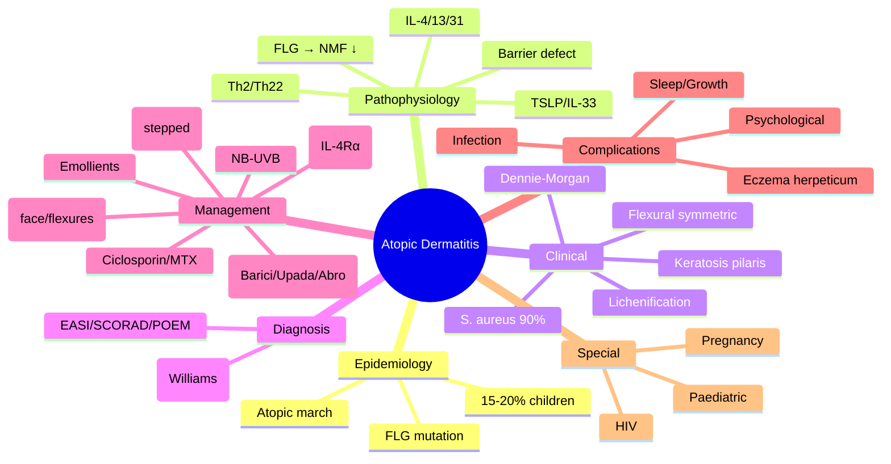
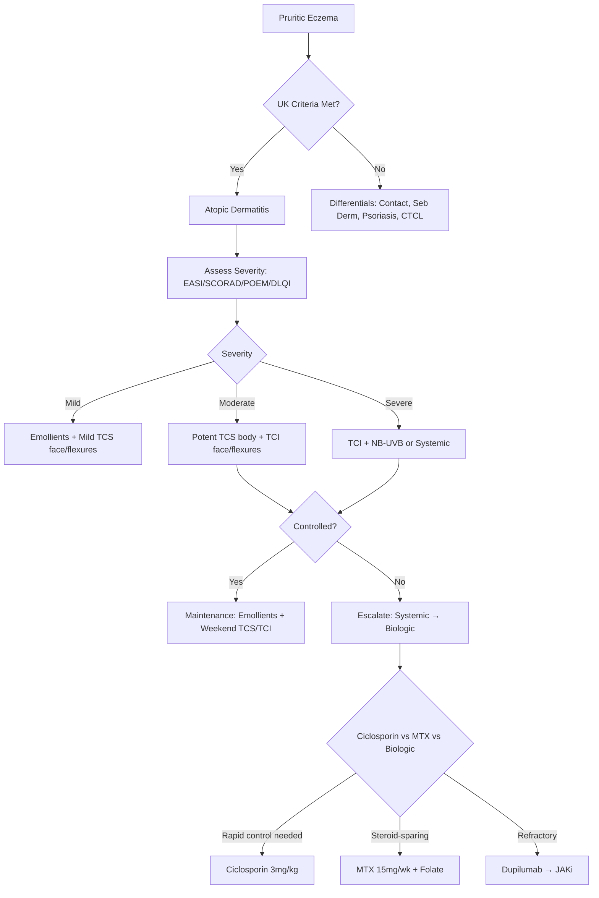

---

tags: [medicine, dermatology, davidson, atopic dermatitis, eczema, fcps, mrcp]
davidson_part: Part 3: Clinical Medicine
davidson_chapter: Chapter 29: Dermatology
heading: Papulosquamous & Eczematous Disorders
topic_group: Atopic Dermatitis & Related Eczemas
topic: Atopic Dermatitis
status: full-fcps-mrcp-note
priority: critical
cards: 25
created: 2026-06-15
modified: 2026-06-15
exam_relevance: [FCPS, MRCP Part 1, MRCP Part 2, PACES]
see_also:
  - "[[Atopic Dermatitis Hub]]"
  - "[[Contact Dermatitis]]"
  - "[[Psoriasis Vulgaris (Chronic Plaque)]]"
  - "[[Asteatotic Eczema]]"
  - "[[Nummular Eczema]]"
  - "[[Gravitational Eczema]]"
  - "[[Pompholyx]]"
  - "[[Eczema Herpeticum]]"
  - "[[Dermatology MOC]]"
---

## Definition

Atopic dermatitis (AD, eczema) is a chronic, relapsing, intensely pruritic inflammatory skin disease, often beginning in infancy (60% in first year, 90% by age 5) and persisting into adulthood in 10-30%. Affects 15-20% of children, 1-3% of adults. Part of the 'atopic triad' (eczema, asthma, allergic rhinitis). Strong genetic component: filaggrin (FLG) loss-of-function mutations in 30% of moderate-severe (impaired epidermal barrier); Th2-skewed immune dysregulation (IL-4, IL-13, IL-31, TSLP). UK criteria: itchy skin + ≥3 of: history of flexural involvement, history of dry skin, onset before age 2, personal/family atopy, visible flexural dermatitis.

## Clinical Features and Presentation

Clinical presentation: Acute eczema — erythema, vesicles, weeping, oedema, intense pruritus. Chronic eczema — lichenification, excoriations, dryness, scaling, pigmentary changes (post-inflammatory hypo- or hyper-pigmentation). Distribution: infants — face (cheeks), scalp, extensor surfaces; children — flexures (antecubital, popliteal), neck, wrists, ankles; adults — flexures, hands, head/neck. Associated features: xerosis (dry skin), ichthyosis vulgaris (in 10%), keratosis pilaris, Dennie-Morgan folds (extra infraorbital folds), pityriasis alba, white dermographism, facial pallor, infraorbital darkening (allergic shiners). Triggers: soaps, detergents, wool, heat, sweat, stress, infection (Staph aureus in 90% of flares), allergens (food in children, aeroallergens).


# Atopic Dermatitis (Atopic Eczema)

Related: [[Contact Dermatitis]], [[Psoriasis]], [[Asteatotic Eczema]], [[Nummular Eczema]], [[Gravitational Eczema]], [[Pompholyx]], [[Eczema Herpeticum]], [[Food Allergy]], [[Allergic March]], [[Filaggrin]]

> [!tip]
> Most common chronic inflammatory skin disease in children. FLG mutation = barrier defect → Th2/Th22 inflammation. Stepped management: emollients → TCS/TCI → phototherapy → systemic → biologics (dupilumab/JAKi).

---

## Learning Objectives
- [ ] Define atopic dermatitis and describe epidemiology/natural history
- [ ] Explain FLG mutation, barrier defect, Th2/Th22/Th17 immunity
- [ ] Apply UK diagnostic criteria (Williams) and Hanifin-Rajka criteria
- [ ] Describe clinical features by age (infant, child, adult) and distribution
- [ ] Use EASI, SCORAD, POEM, DLQI for severity assessment
- [ ] Outline stepped management algorithm (NICE/ESD)
- [ ] Differentiate from contact dermatitis, seborrhoeic dermatitis, psoriasis, cutaneous T-cell lymphoma
- [ ] Recall dupilumab (IL-4Rα), tralokinumab (IL-13), JAK inhibitors (baricitinib/upadacitinib/abrocitinib)
- [ ] Identify complications: eczema herpeticum, infection, sleep loss, growth failure, psychological
- [ ] Answer viva questions on diagnostic criteria, management steps, biologics
- [ ] Apply mnemonics for diagnostic criteria and management steps

---

## 1. Definition / Epidemiology / Classification

### Definition
Chronic relapsing pruritic inflammatory skin disease characterised by epidermal barrier dysfunction (filaggrin deficiency), immune dysregulation (Th2/Th22/Th17), and intense pruritus leading to lichenification, with strong personal/family atopic history (asthma, allergic rhinitis, food allergy).

### Epidemiology
- **Prevalence:** 15-20% children, 2-10% adults (increasing)
- **Age of onset:** 60% by age 1, 85% by age 5; adult-onset possible
- **Sex ratio:** Equal in childhood; female predominance in adulthood
- **Natural history:** 70% clear by adolescence; persistence predictors: early onset, severe, family history, FLG mutation, associated atopy
- **Atopic march:** AD → Food allergy → Asthma → Allergic rhinitis

### Classification
| By Age | Distribution | Key Features |
|--------|-------------|--------------|
| **Infantile (0-2y)** | Face (cheeks), scalp, extensor limbs, trunk | Exudative, vesicular, crusted; napkin area spared |
| **Childhood (2-12y)** | Flexures (antecubital, popliteal), neck, wrists, ankles | Lichenified, dry, excoriated; infra-auricular fissures |
| **Adult (>12y)** | Flexures, hands, eyelids, nipples, periorbital | Chronic lichenified, hand dermatitis common; may be localised |
| **By phenotype** | Extrinsic (IgE+) vs Intrinsic (IgE-) | Extrinsic = 80%, high IgE, specific IgE +ve; Intrinsic = 20%, normal IgE |

---

## 2. Aetiology / Pathophysiology

### Aetiology
- **Genetic:** **FLG** (filaggrin) loss-of-function mutations (R501X, 2282del4) in 30-50% Europeans; other: SPINK5, CARD11, IL4R, IL13, TSLP, OVOL1, KIF3A
- **Environmental:** Irritants (soaps, detergents), allergens (dust mite, pet dander, pollen), microbes (S. aureus), climate (low humidity, heat), stress, food allergens (children)
- **Immunological:** Th2/Th22 dominance (acute), Th1/Th17 (chronic); IL-4, IL-13, IL-31, TSLP, IL-25, IL-33; IgE-mediated (extrinsic)

### Pathophysiology
```mermaid
flowchart TD
    A[FLG Mutation / Barrier Defect] --> B[Increased TEWL, pH ↑, Penetration of Allergens/Irritants]
    B --> C[Keratinocyte Alarmins: TSLP, IL-25, IL-33]
    C --> D[DC Activation → Th2/Th22 Differentiation]
    D --> E[IL-4, IL-13, IL-31, IL-22, TSLP]
    E --> F[Barrier Dysfunction: ↓FLG, ↓Ceramides, ↓AMPs]
    F --> G[S. aureus Colonisation (90%)]
    G --> H[Superantigens → Polyclonal T-cell Activation]
    H --> I[Inflammation → Pruritus → Scratching]
    I --> B[Vicious Cycle]
    E --> J[IgE Class Switching → Sensitisation]
    J --> K[Atopic March: Food Allergy → Asthma → Rhinitis]
```

### Key Molecular Pathways
- **FLG → NMF:** Filaggrin broken down to natural moisturising factors (NMFs) → hydration, pH regulation
- **Th2 cytokines:** IL-4/IL-13 → barrier downregulation, IgE switching, eosinophilia; IL-31 → pruritus; IL-22 → acanthosis
- **TSLP/IL-33/IL-25:** Epithelial alarmins → initiate Th2 response
- **S. aureus:** Superantigens (SEA-SEE) → massive T-cell activation → flare

---

## 3. Clinical Features

### History
- **Pruritus** (hallmark, worse at night, sleep disturbance)
- **Chronic relapsing** course (>6 months)
- **Personal/family atopy** (asthma, allergic rhinitis, food allergy, AD)
- **Early onset** (infancy/childhood)
- **Triggers:** Heat, sweat, wool, soaps, dust, stress, foods (children), infections

### Examination by Age
| Feature | Infant (0-2y) | Child (2-12y) | Adult (>12y) |
|---------|--------------|--------------|--------------|
| **Distribution** | Face (cheeks), scalp, extensors, trunk | Flexures (antecubital, popliteal), neck, wrists, ankles | Flexures, hands, eyelids, nipples, periorbital |
| **Morphology** | Erythematous papules, vesicles, oozing, crusting | Lichenified plaques, excoriations, dry skin | Chronic lichenified, hand dermatitis, prurigo nodularis |
| **Napkin area** | **Spared** (occlusion protective) | - | - |
| **Specific signs** | Cradle cap (seborrhoeic overlap) | Infra-auricular fissures, Dennie-Morgan folds | Periorbital darkening, hand dermatitis |

### Lesion Morphology
| Feature | Description |
|---------|-------------|
| **Primary** | Erythematous papules (often follicular), vesicles (acute) |
| **Secondary** | Excoriations, lichenification, crusting, scaling, fissures |
| **Chronic changes** | Lichenification (thickened skin, exaggerated markings), prurigo nodularis, hyper/hypopigmentation |
| **Distribution** | **Symmetric flexural** (antecubital, popliteal, neck) = classic |

### Associated Findings
- **Dennie-Morgan folds** = infraorbital skin folds (atopy marker)
- **Keratosis pilaris** = follicular hyperkeratosis (upper arms/thighs)
- **Pityriasis alba** = hypopigmented facial patches (post-inflammatory)
- **Hyperlinear palms** = increased palmar creases (FLG association)
- **Hertoghe sign** = loss of lateral eyebrows (atopy/thyroid)
- **White dermatographism** = delayed blanching on stroking (vasomotor instability)
- **S. aureus colonisation** >90% lesional skin

---

## 4. Diagnostic Approach / Algorithm

```mermaid
flowchart TD
    A[Pruritic Eczematous Eruption] --> B{UK Diagnostic Criteria?}
    B -->|Yes (≥3 major + 3 minor)| C[Atopic Dermatitis]
    B -->|No| D{Consider Differential}
    D -->|Contact pattern| E[Contact Dermatitis: Patch Test]
    D -->|Scalp/face, greasy| F[Seborrhoeic Dermatitis]
    D -->|Extensor, silvery scale| G[Psoriasis]
    D -->|Older, poikiloderma| H[CTCL: Biopsy + TCR]
    D -->|Immunodeficiency| I[Hyper-IgE, WAS, CID: Immunology]
    C --> J[Severity Assessment: EASI/SCORAD/POEM/DLQI]
    J --> K[Stepped Management]
```

### UK Diagnostic Criteria (Williams) - VALIDATED
**Major Criteria (must have 1):**
1. Pruritus
2. **Visible flexural dermatitis** (cheeks in <4y) OR history of flexural involvement

**Minor Criteria (need 3 of 5):**
1. History of flexural involvement (if not major)
2. History of asthma or allergic rhinitis (or atopic sibling if <4y)
3. History of generalised dry skin (xerosis)
4. Onset <2 years (if <4y)
5. Personal history of food allergy (if <4y)

### Hanifin-Rajka Criteria (Classic)
**Major (need 3):** Pruritus, Typical morphology/distribution, Chronic/relapsing, Personal/family atopy
**Minor (need 3):** Xerosis, Ichthyosis/palmar hyperlinearity/Keratosis pilaris, Immediate skin test reactivity, Elevated IgE, Early onset, Nipple eczema, Chelitis, Dennie-Morgan folds, Keratoconus, Cataracts, Orbital darkening, Facial pallor/erythema, Pityriasis alba, Anterior subcapsular cataracts

### Severity Assessment
| Tool | Components | Score Range | Interpretation |
|------|------------|-------------|----------------|
| **EASI** | Area (0-6) × Severity (E,I,E,P 0-3) per region | 0-72 | <7 mild, 7-21 moderate, 21-50 severe, >50 very severe |
| **SCORAD** | A (extent 0-100) + B (intensity 0-18) + C (subjective 0-20) | 0-103 | <25 mild, 25-50 moderate, >50 severe |
| **POEM** | 7 questions (itch, sleep, bleeding, weeping, cracking, flaking, dryness) | 0-28 | ≤2 clear, 3-7 mild, 8-16 moderate, 17-24 severe, ≥25 very severe |
| **DLQI** | 10 QoL questions | 0-30 | See psoriasis |

---

## 5. Investigations

### Routine (Clinical diagnosis usually sufficient)
| Investigation | Indication | Expected Finding |
|---------------|------------|------------------|
| **Skin swab** | Suspected infection (impetigo, eczema herpeticum) | S. aureus, HSV PCR |
| **Bloods (FBC, IgE, eosinophils)** | Severe/refractory, allergic workup | Eosinophilia, elevated total IgE |
| **Specific IgE / Skin prick test** | Suspected food/environmental allergy | Identify triggers (children) |
| **Patch testing** | Suspected allergic contact dermatitis | Relevant allergens |

### Specialised
| Investigation | Indication | Interpretation |
|---------------|------------|----------------|
| **FLG mutation testing** | Research, severe early-onset, ichthyosis vulgaris | R501X, 2282del4 common in Europeans |
| **TARC (CCL17)** | Disease activity biomarker | Correlates with severity/EASI |
| **Skin biopsy** | Atypical, rule out CTCL | Spongiosis, acanthosis, dermal perivascular infiltrate; NO Munro abscesses |

---

## 6. Differential Diagnosis

| Differential | Distinguishing Features | Key Test |
|--------------|------------------------|----------|
| **Allergic Contact Dermatitis** | Geometric borders, acute vesicles, specific exposure | **Patch testing +ve** |
| **Irritant Contact Dermatitis** | Hands, occupational, no sensitisation | Patch test -ve, history |
| **Seborrhoeic Dermatitis** | Greasy yellow scale, scalp/face/chest, no flexures | Clinical, KOH if doubted |
| **Psoriasis** | Extensor, silvery scale, Auspitz+, nail pitting | Clinical, biopsy |
| **Cutaneous T-cell Lymphoma (MF)** | Older, poikiloderma, variable plaques, erythroderma, lymphadenopathy | **Biopsy + TCR rearrangement** |
| **Scabies** | Burrows, nocturnal itch, contact history, family affected | Dermoscopy (delta wing), scraping |
| **Ichthyosis Vulgaris** | Generalised scaling, flexures SPARRED, FLG mutation | Clinical, genetic |
| **Nutritional Deficiency** | Zinc (acrodermatitis enteropathica), biotin, EFA | Serum levels, response to supplementation |
| **Immunodeficiency** | Recurrent infections, failure to thrive, eczema + infections | Immunoglobulins, lymphocyte subsets, genetic |

---

## 7. Management

### General Measures (ALL patients)
- **Emollients:** Leave-on (creams/ointments) + wash-off (soap substitutes); Apply liberally ≥2x/day, down hair follicles; 250-500g/week adult
- **Trigger avoidance:** Soaps, detergents, wool, overheating, known allergens
- **Education:** Written action plan, eczema school, psychological support
- **Nail care:** Keep short, cotton gloves at night

### Stepwise Management (NICE/ESD)
```mermaid
flowchart TD
    A[Atopic Dermatitis] --> B[Step 1: Emollients + Avoid triggers]
    B --> C{Controlled?}
    C -->|No| D[Step 2: Topical Corticosteroids]
    D --> D1[Face/Flexures/Genital: Mild-Mod (Group V-VI) HC 1%, Eumovate]
    D1 --> D2[Body/Scalp: Moderate-Potent (Group III-IV) Betnovate, Elocon]
    D2 --> D3[Max 2w continuous potent; weekend therapy for maintenance]
    D --> E{Controlled?}
    E -->|No| F[Step 3: Topical Calcineurin Inhibitors]
    F --> F1[Tacrolimus 0.1% (adult) / 0.03% (child>2) ointment]
    F1 --> F2[Pimecrolimus 1% cream]
    F2 --> F3[No atrophy, OK face/flexures, burning sensation, black box (theoretical lymphoma)]
    F --> G{Controlled?}
    G -->|No| H[Step 4: Phototherapy]
    H --> H1[NB-UVB 3x/week, incremental]
    H1 --> H2[PUVA if NB-UVB fails]
    H --> I{Controlled?}
    I -->|No| J[Step 5: Conventional Systemic]
    J --> J1[Ciclosporin 2.5-5mg/kg: RAPID control, max 1-2y]
    J1 --> J2[Methotrexate 7.5-25mg/wk + Folate: Steroid-sparing]
    J2 --> J3[Azathioprine 1-3mg/kg (TPMT): Slow onset]
    J3 --> J4[Mycophenolate 1-2g/day: Alternative]
    J --> K{Controlled?}
    K -->|No| L[Step 6: Biologics / JAK Inhibitors]
    L --> L1[Dupilumab: IL-4Rα, 300mg q2w (600mg load)]
    L1 --> L2[Tralokinumab: IL-13, 300mg q2w (600mg load)]
    L2 --> L3[Baricitinib: JAK1/2, 4mg/2mg daily]
    L3 --> L4[Upadacitinib: JAK1, 15/30mg daily]
    L4 --> L5[Abrocitinib: JAK1, 100/200mg daily]
    L --> M{Controlled?}
    M -->|No| N[Specialist MDT]
```

### Topical Corticosteroid Selection
| Site | Potency | Examples | Max Duration |
|------|---------|----------|--------------|
| Face, neck, flexures, genital, children <12 | Mild-Moderate (V-VI) | HC 1%, Eumovate (clobetasone) | 2 weeks |
| Trunk, limbs, adults | Moderate-Potent (III-IV) | Betnovate (betamethasone), Elocon (mometasone) | 4 weeks |
| Palms, soles, thick lichenified | Potent-Very Potent (I-II) | Dermovate (clobetasol), Nerisone Forte | 2-4 weeks |

### Topical Calcineurin Inhibitors
| Agent | Strength | Indication | Advantage | Caution |
|-------|----------|------------|-----------|---------|
| **Tacrolimus** | 0.03% (2-15y), 0.1% (adult) | Moderate-severe, face/flexures | No atrophy, steroid-sparing | Burning, EtOH flushing, theoretical lymphoma |
| **Pimecrolimus** | 1% cream | Mild-moderate, face/flexures | Less burning | Less potent than tacrolimus |

### Biologics / JAK Inhibitors (Licensed for Moderate-Severe AD)
| Agent | Target | Dose | Key Features | Monitoring |
|-------|--------|------|--------------|------------|
| **Dupilumab** | IL-4Rα (blocks IL-4/IL-13) | 600mg load → 300mg q2w SC | **1st biologic**, conjunctivitis (10%), helminth risk | CBC, eosinophils |
| **Tralokinumab** | IL-13 | 600mg load → 300mg q2w SC | No conjunctivitis, less injection site reaction | Similar |
| **Baricitinib** | JAK1/2 | 4mg daily (2mg if renal/elderly) | Oral, rapid, also for alopecia areata | CBC, LFT, lipids, VZV, thrombosis risk |
| **Upadacitinib** | JAK1 | 15mg (30mg if inadequate) daily | Oral, high efficacy, PsA also | Same + CPK |
| **Abrocitinib** | JAK1 | 100mg (200mg if inadequate) daily | Oral, dose-flexible | Same |

### Management in Special Sites
- **Hand dermatitis:** Potent TCS + barrier creams + cotton gloves; consider patch testing
- **Eyelid dermatitis:** Tacrolimus 0.03%/pimecrolimus (avoid TCS prolonged)
- **Nipple/areola:** Tacrolimus/pimecrolimus, mild TCS short-term
- **Infected AD:** Flucloxacillin (S. aureus) + TCS; HSV → IV aciclovir (emergency)

---

## 8. Drug Interactions / Contraindications / Comorbidity Cautions

| Drug | Interaction / Caution | Management |
|------|----------------------|------------|
| **TCS + TCI** | No major interaction; TCI can be used with TCS | Sequential or combination OK |
| **Ciclosporin + Statins** | Rhabdomyolysis | Dose reduce statin |
| **Ciclosporin + Diltiazem/Verapamil** | CYP3A4 inhibition | Monitor ciclosporin levels |
| **MTX + NSAIDs/Trimethoprim** | Marrow suppression | Avoid or monitor |
| **Dupilumab + Live Vaccines** | Avoid live vaccines during treatment | Give ≥4w before |
| **JAKi + Strong CYP3A4 inhibitors** | ↑ JAKi levels | Dose adjust (upadacitinib/abrocitinib) |
| **JAKi + VZV** | Herpes zoster risk | Screen VZV IgG, vaccinate if -ve before starting |
| **JAKi + Thrombosis risk** | Avoid if high VTE risk | Assess risk factors |

---

## 9. Procedures (if applicable)

### Procedure: Wet Wraps
- **Indications:** Severe flare, erythroderma, poor TCS absorption
- **Technique:** Emollient → TCS → damp tubular bandage/garment → dry outer layer; 2-14 days
- **Complications:** Folliculitis, maceration, hypothermia (children), discomfort
- **Viva Pearls:** Potent TCS under wet wraps = 10x penetration (use mild/mod); monitor temperature in children

### Procedure: Phototherapy (NB-UVB)
- **Indications:** Widespread AD failing topicals
- **Contraindications:** Photosensitising drugs, XP, skin cancer history, inability to attend
- **Protocol:** 3x/week, start 70% MED, increment 10-20% per session
- **Complications:** Erythema, photoaging, cataract (PUVA), skin cancer (long-term PUVA)

---

## 10. Complications

| Complication | Frequency | Management |
|--------------|-----------|------------|
| **Bacterial Infection (S. aureus)** | >90% colonised, 30-50% infected | Flucloxacillin + TCS; decolonisation (chlorhexidine, mupirocin) |
| **Eczema Herpeticum (Kaposi Varicelliform)** | 3% AD, emergency | **IV Aciclovir** urgent, admission, IV fluids |
| **Molluscum Contagiosum** | Extensive in AD | Curettage, topical (potassium hydroxide), immunomodulators |
| **Viral Warts** | Refractory, extensive | Cryotherapy, immunotherapy, cimetidine? |
| **Sleep Disturbance** | 80% children, impacts growth/behaviour | Sedating antihistamine (chlorphenamine), optimise control |
| **Growth Failure** | Severe AD, chronic steroid use | Monitor growth, minimise potent TCS, treat inflammation |
| **Psychological Impact** | Depression, anxiety, bullying, family stress | Screen, refer psychology, patient support groups |
| **Ocular** | Keratoconus, cataracts (atopic), atopic keratoconjunctivitis | Ophthalmology referral |
| **Contact Allergy** | Increased risk (barrier defect) | Patch testing if suspected |

---

## 11. Red Flags / Emergencies

| Red Flag | Immediate Action |
|----------|------------------|
| **Eczema Herpeticum** (punched-out erosions, vesicles, fever, malaise) | **IV Aciclovir 10mg/kg q8h** (child) / 5mg/kg q8h (adult) + admission |
| **Erythroderma** (>90% BSA) | Admit HDU, fluids, thermoregulation, ciclosporin |
| **Severe Infection** (cellulitis, sepsis) | IV antibiotics (flucloxacillin + clindamycin) |
| **Suicidal ideation (JAKi)** | Mental health referral, switch |
| **Growth failure (child)** | Paediatric review, minimise potent TCS, optimise control |

---

## 12. Prognosis

| Factor | Good Prognosis | Poor Prognosis |
|--------|----------------|----------------|
| **Age of onset** | Late onset (>2y) | Early onset (<6m) |
| **Severity** | Mild (EASI<7) | Severe (EASI>21) |
| **FLG mutation** | Absent | Present (esp. homozygous) |
| **Family atopy** | None | Both parents |
| **Associated atopy** | None | Asthma + Rhinitis + Food allergy |
| **Treatment response** | Good topical response | Refractory, multiple systemics |

- **Natural history:** 70% clear by adolescence; persistent if early onset, severe, FLG+, multiple atopy
- **Remission:** Possible but unpredictable; "atopic march" to asthma/rhinitis
- **Mortality:** Not directly fatal; eczema herpeticum mortality if delayed treatment

---

## 13. Topic Correlation

| Related Topic | Link | Key Overlap |
|---------------|------|-------------|
| **Contact Dermatitis** | [[Contact Dermatitis]] | Patch testing, TCS/TCI, barrier repair |
| **Psoriasis** | [[Psoriasis Vulgaris (Chronic Plaque)]] | Differential, TCS, biologics (different targets) |
| **Asteatotic Eczema** | [[Asteatotic Eczema]] | Elderly, xerosis, emollients |
| **Nummular Eczema** | [[Nummular Eczema]] | Coin-shaped, Staph infection, potent TCS |
| **Gravitational Eczema** | [[Gravitational Eczema]] | Venous hypertension, compression |
| **Pompholyx** | [[Pompholyx]] | Palmoplantar vesicles, stress/sweat triggers |
| **Eczema Herpeticum** | [[Eczema Herpeticum]] | Emergency, IV aciclovir, AD background |
| **Food Allergy** | - | Children, specific IgE, elimination diet if proven |

---

## 14. Special Situations

| Situation | Consideration |
|-----------|---------------|
| **Pregnancy** | TCS (mild-mod face/flexures, potent body); UVB safe; **Ciclosporin cautious**; MTX/Acitretin CONTRAINDICATED; Dupilumab (limited data, animal studies OK); JAKi AVOID |
| **Lactation** | TCS, UVB safe; Dupilumab (low milk transfer); Avoid MTX/Acitretin/JAKi |
| **Paediatric** | Mild TCS face/flexures; Wet wraps for flares; Sedating antihistamine for sleep; Growth monitoring; Dupilumab >6m (EU) / >6y (US); Upadacitinib >12y |
| **Renal Impairment** | Avoid ciclosporin; MTX dose adjust (avoid if eGFR<30); Dupilumab/JAKi OK (dose adjust if severe) |
| **Hepatic Impairment** | Avoid MTX; Ciclosporin caution; Dupilumab/JAKi OK |
| **Immunocompromised** | Avoid conventional immunosuppressants; Dupilumab preferred (no immunosuppression); JAKi caution |
| **HIV** | AD often severe; UVB, TCS, Dupilumab; **Avoid MTX** (hepatotoxicity); Screen infections |

---

## FCPS/MRCP High-Yield Summary

| Category | Key Points |
|----------|------------|
| **Definition** | Chronic pruritic inflammatory, barrier defect (FLG), Th2/Th22, personal/family atopy |
| **Epidemiology** | 15-20% children, 2-10% adults; 60% by age 1; atopic march (AD→food→asthma→rhinitis) |
| **Pathophysiology** | FLG mutation → barrier defect → allergen penetration → TSLP/IL-33 → Th2 (IL-4/13/31) → inflammation |
| **Clinical** | Flexural symmetric, lichenification, Dennie-Morgan folds, keratosis pilaris, hyperlinear palms, S. aureus |
| **Diagnosis** | UK Criteria (Williams): Pruritus + Flexural + 3 minor (asthma/rhinitis, xerosis, onset<2y, atopic sibling, food allergy) |
| **Severity** | EASI (0-72), SCORAD (0-103), POEM (0-28), DLQI (0-30) |
| **Management** | E-T-P-S-C-D: **E**mollients → **T**CS → **T**CI → **P**hototherapy → **C**iclosporin/MTX → **D**upilumab/JAKi |
| **Biologics** | Dupilumab (IL-4Rα) 1st line; Tralokinumab (IL-13); JAKi (baricitinib/upadacitinib/abrocitinib) |
| **Screening** | VZV for JAKi; TB/Hep B/C/HIV for dupilumab? No - dupilumab low infection risk; Live vaccines before biologics |
| **Complications** | Eczema herpeticum (EMERGENCY: IV aciclovir), S. aureus, sleep loss, growth failure, psychological |
| **Viva Pearls** | UK criteria = validated; FLG=barrier; Dennie-Morgan folds=atopy; TCI=no atrophy face/flexures; Dupilumab=conjunctivitis |
| **Drug Doses** | Dupilumab 600mg→300mg q2w; Tacrolimus 0.1%/0.03%; Ciclosporin 3mg/kg; MTX 15mg/wk+Folate; Baricitinib 4mg daily |
| **HLA/Genetics** | FLG R501X, 2282del4 (Europeans); CARD11, IL4R, TSLP, OVOL1 |
| **Scoring** | EASI, SCORAD, POEM, DLQI |

---

## Viva Questions (PACES/FCPS Style)

1. **Q:** What are the UK diagnostic criteria for atopic dermatitis (Williams criteria)?
   **A:** Major: Pruritus + visible flexural dermatitis (cheeks in <4y). Minor (need 3): History flexural, Personal/family asthma/rhinitis, Generalised dry skin, Onset <2y, Personal food allergy (if <4y).

2. **Q:** How does filaggrin mutation lead to atopic dermatitis?
   **A:** FLG loss-of-function → ↓NMF → ↑TEWL, ↑skin pH → barrier defect → allergen/irritant penetration → keratinocyte alarmins (TSLP/IL-33) → Th2 activation (IL-4/13/31) → inflammation → further barrier downregulation (vicious cycle).

3. **Q:** Describe the stepped management of atopic dermatitis.
   **A:** 1) Emollients + trigger avoidance 2) TCS (mild-mod face/flexures, potent body) 3) TCI (tacrolimus/pimecrolimus) face/flexures 4) NB-UVB phototherapy 5) Systemic: Ciclosporin (rapid), MTX (steroid-sparing), AZA/MMF 6) Biologics: Dupilumab (IL-4Rα) 1st line, Tralokinumab (IL-13), JAKi (baricitinib/upadacitinib/abrocitinib).

4. **Q:** What are the advantages of topical calcineurin inhibitors over topical corticosteroids?
   **A:** No skin atrophy (safe face/flexures/eyelids), no tachyphylaxis, steroid-sparing, long-term maintenance OK. Disadvantages: burning, alcohol flushing, theoretical lymphoma risk (black box), cost.

5. **Q:** Describe the mechanism and dosing of dupilumab.
   **A:** Anti-IL-4Rα → blocks IL-4 and IL-13 signalling → reduces Th2 inflammation. Dose: 600mg loading → 300mg SC q2w. Conjunctivitis (10%, usually mild), eosinophilia, helminth risk.

6. **Q:** What are JAK inhibitors approved for atopic dermatitis and their monitoring?
   **A:** Baricitinib (JAK1/2) 4mg/2mg daily, Upadacitinib (JAK1) 15/30mg daily, Abrocitinib (JAK1) 100/200mg daily. Monitor: CBC, LFT, lipids, CK (upadacitinib), VZV status, thrombosis risk, pregnancy avoid.

7. **Q:** How do you diagnose and manage eczema herpeticum?
   **A:** Clinical: AD + sudden worsening with punched-out erosions/vesicles, fever, malaise. Tzanck/PCR for HSV. **EMERGENCY: Admit + IV Aciclovir 10mg/kg q8h (child) / 5mg/kg q8h (adult)**. Bacterial cover if superinfected.

8. **Q:** What are the clinical differences between atopic dermatitis and psoriasis?
   **A:** AD: flexural, ill-defined, lichenified, excoriations, Dennie-Morgan, keratosis pilaris, hyperlinear palms, family atopy. Psoriasis: extensor, well-demarcated, silvery scale, Auspitz+, Koebner+, nail pitting, scalp "psoriatic crown".

9. **Q:** How does management differ in pregnancy?
   **A:** TCS safe (mild-mod face/flexures, potent body, avoid prolonged potent); UVB safe; Ciclosporin cautious (monitor BP/renal); **MTX/Acitretin CONTRAINDICATED**; Dupilumab limited human data (animal OK); **JAKi AVOID**.

10. **Q:** What is the atopic march?
    **A:** Sequential development of atopic diseases: Atopic Dermatitis (infancy) → Food Allergy (1-3y) → Asthma (3-5y) → Allergic Rhinitis (5y+). Early severe AD + FLG mutation + food sensitisation = higher march risk.

11. **Q:** Describe Dennie-Morgan folds and their significance.
    **A:** Infraorbital skin folds (double/triple fold below lower eyelid). Marker of atopy, seen in AD, allergic rhinitis. Not pathognomonic but supportive.

12. **Q:** What is the role of wet wraps in severe AD?
    **A:** Enhance TCS penetration 10x (use mild/mod TCS under wraps). Indications: severe flare, erythroderma, poor absorption. Technique: Emollient → TCS → damp bandage → dry outer layer. Monitor for folliculitis, hypothermia (children).

---

## Common Confusions / Exam Traps

| Confusion | Clarification |
|-----------|---------------|
| **UK vs Hanifin-Rajka** | UK (Williams) = validated, 3 minor + pruritus + flexural; Hanifin-Rajka = classic, 3 major + 3 minor; UK preferred for epidemiology/research |
| **EASI vs SCORAD** | EASI = objective only (area × severity); SCORAD = objective + subjective (pruritus/sleep); EASI preferred for trials |
| **TCI vs TCS potency** | Tacrolimus 0.1% ≈ Potent TCS (Group III); Pimecrolimus 1% ≈ Mild-Mod TCS (Group V-VI) |
| **Dupilumab vs JAKi** | Dupilumab = SC q2w, conjunctivitis, no CBC monitoring; JAKi = oral daily, CBC/LFT/lipids, VZV screen, thrombosis risk, faster onset |
| **Extrinsic vs Intrinsic AD** | Extrinsic = IgE+, high total IgE, specific IgE+ (80%); Intrinsic = IgE-, normal IgE, no specific sensitisation (20%) |
| **AD vs Contact Dermatitis** | AD = symmetric flexural, chronic, atopy history; Contact = geometric, acute vesicles, exposure history, patch test +ve |

---

## Mnemonics

1. **UK Criteria (Williams):** `VISIBLE FLEX` = **V**isible flexural, **I**tch (major), **S**ibling atopy, **I**nfant onset <2y, **B**... **L**..., **E**czema history, **F**ood allergy, **L**ung (asthma), **E**xperience (xerosis), **X**... → Minimum 3 minor + Pruritus + Flexural
2. **Atopic March:** `A-F-A-R` = **A**topic **D**ermatitis → **F**ood Allergy → **A**sthma → **R**hinitis
3. **Management Steps:** `E-T-P-S-C-D` = **E**mollients, **T**CS, **T**CI, **P**hototherapy, **C**iclosporin/MTX (Systemic), **D**upilumab/JAKi (Biologics)
4. **FLG Mutation:** `FLG-NMF` = **F**ilaggrin → **N**atural **M**oisturising **F**actors → Hydration, pH, Barrier
5. **AD Clinical Signs:** `DENNIE MORGAN` = **D**ennie-Morgan folds, **E**czema flexural, **N**ail pitting? No - **K**eratosis pilaris, **E**xcoriations, **M**... **O**rbital darkening, **R**hinitis, **G**eneralised dryness, **A**sthma, **N**onn (hyperlinear palms, pityriasis alba, S. aureus)
6. **Eczema Herpeticum Emergency:** `PUNCH IV ACIC` = **PUNCH**ed-out erosions → **IV ACIC**lovir urgent

---

## Mind Map



---

## Flowchart (Diagnostic & Management Algorithm)



---

## Suggested Visuals / Image Notes

| Image | Description | Source |
|-------|-------------|--------|
| Infantile AD cheeks | Erythematous, oozing, crusted cheeks with perioral sparing | Clinical atlas |
| Childhood AD flexures | Lichenified plaques antecubital/popliteal fossae | Clinical atlas |
| Adult hand dermatitis | Chronic lichenified hand eczema | Clinical atlas |
| Dennie-Morgan folds | Infraorbital double skin folds | Clinical photo |
| Keratosis pilaris | Follicular hyperkeratosis upper arms | Clinical photo |
| Eczema herpeticum | Punched-out erosions on AD background | Emergency atlas |
| Wet wrap technique | Layered bandaging demonstration | Teaching slide |

---

## Suggested Video References

| Topic | Platform | Link/Duration |
|-------|----------|---------------|
| AD pathophysiology (FLG/Th2) | YouTube/EADV | 20 min |
| UK diagnostic criteria tutorial | BAD/YouTube | 10 min |
| Stepped management algorithm | NICE/YouTube | 15 min |
| Dupilumab mechanism | Sanofi/YouTube | 10 min |
| JAK inhibitors in AD | Pfizer/Eli Lilly/YouTube | 15 min |
| Eczema herpeticum emergency | BAD guidelines | 10 min |

---

## One-Page Revision Card

| **Topic** | **Atopic Dermatitis** |
|-----------|----------------------|
| **Definition** | Chronic pruritic inflammatory, FLG barrier defect, Th2/Th22, atopy |
| **Key Clinical** | Flexural symmetric, lichenification, Dennie-Morgan, keratosis pilaris, S. aureus |
| **Dx Criteria** | UK (Williams): Pruritus + Flexural + 3 minor (asthma/rhinitis, xerosis, onset<2y, atopic sibling, food allergy) |
| **Differentials** | Contact dermatitis, Seborrhoeic dermatitis, Psoriasis, CTCL, Scabies, Ichthyosis |
| **Investigations** | Swabs if infected; IgE/eosinophils if allergic; Patch test if contact suspected; FLG genetic (research) |
| **Management (Steps)** | 1. Emollients 2. TCS (stepped potency) 3. TCI (face/flexures) 4. NB-UVB 5. Ciclosporin/MTX 6. Dupilumab/JAKi |
| **Key Drugs/Doses** | Dupilumab 600→300mg q2w; Tacrolimus 0.1%/0.03%; Ciclosporin 3mg/kg; MTX 15mg/wk+Folate; Baricitinib 4mg |
| **Red Flags** | Eczema herpeticum (IV aciclovir!), Erythroderma, Growth failure, Suicidal (JAKi) |
| **Prognosis** | 70% clear by teens; Persistent if early/severe/FLG+/multi-atopy |
| **Viva Pearls** | UK criteria validated; FLG=barrier; TCI=no atrophy; Dupilumab=conjunctivitis; JAKi=CBC/LFT/VZV/thrombosis |
| **Mnemonics** | A-F-A-R (march); E-T-P-S-C-D (steps); VISIBLE FLEX (UK criteria) |

---

## Spaced Repetition Trackers

### 24-Hour Recall Prompts
- [ ] Recite UK diagnostic criteria from memory (major + 3 minor)
- [ ] Draw the stepped management algorithm (E-T-P-S-C-D)
- [ ] Explain FLG → barrier defect → Th2 pathway in 2 minutes
- [ ] Compare dupilumab vs JAK inhibitors (route, monitoring, side effects)
- [ ] List eczema herpeticum emergency management

### Revision Schedule
- [ ] **Day 1** completed (creation + 24h recall)
- [ ] **Day 3** revision completed
- [ ] **Day 7** revision completed
- [ ] **Day 15** revision completed
- [ ] **Day 30** revision completed
- [ ] **Day 90** revision completed

---

## Must Know / Should Know / Nice to Know

### Must Know (Core for passing)
- [ ] UK diagnostic criteria (Williams)
- [ ] FLG mutation & barrier pathophysiology
- [ ] Clinical features by age (infant, child, adult)
- [ ] Stepped management: Emollients → TCS → TCI → NB-UVB → Systemic → Biologics
- [ ] Dupilumab (IL-4Rα) 1st biologic, conjunctivitis side effect
- [ ] JAK inhibitors (baricitinib/upadacitinib/abrocitinib) - monitoring
- [ ] Eczema herpeticum = EMERGENCY (IV aciclovir)
- [ ] Pregnancy: avoid MTX/Acitretin/JAKi; TCS/UVB/dupilumab cautious

### Should Know (High probability)
- [ ] EASI/SCORAD/POEM scoring details
- [ ] TCI advantages (no atrophy) vs disadvantages (burning, black box)
- [ ] Ciclosporin (rapid, 1-2y max) vs MTX (slow, long-term)
- [ ] Differential diagnosis table (contact, psoriasis, CTCL, seborrhoeic)
- [ ] Atopic march sequence and risk factors
- [ ] Paediatric dosing and growth monitoring

### Nice to Know (Differentiator)
- [ ] Tralokinumab (IL-13) vs dupilumab (IL-4Rα)
- [ ] TARC (CCL17) biomarker for disease activity
- [ ] Wet wrap technique and potent TCS dilution
- [ ] Microbiome dysbiosis (S. aureus) and bleach baths
- [ ] Cost-effectiveness of biologics in AD
- [ ] Emerging therapies (Nemolizumab anti-IL-31R)

---

## My Weak Points
- [ ] EASI calculation by hand (body region weighting)
- [ ] JAK inhibitor specific monitoring differences (baricitinib vs upadacitinib vs abrocitinib)
- [ ] Dupilumab in pregnancy - latest human data
- [ ] Cost-effectiveness comparisons for NICE submissions

---

## Self-Test Scorecard

| Section | Score /5 |
|---------|----------|
| Definition & Classification | |
| Aetiology & Pathophysiology | |
| Clinical Features | |
| Diagnostic Approach | |
| Investigations | |
| Differential Diagnosis | |
| Management | |
| Complications & Red Flags | |
| Prognosis & Special Situations | |
| Viva Questions | |
| **TOTAL** | **/50** |

> [!tip]
> **Interpretation:** <35 = weak topic, 35-44 = acceptable but insecure, 45+ = strong exam-ready topic.

---

## Exam Answer Modes

### Long Answer Skeleton
1. Definition & epidemiology (prevalence, atopic march, natural history)
2. Aetiopathogenesis (FLG, barrier defect, Th2/Th22/Th17, alarmins, S. aureus)
3. Clinical features (age-based distribution, morphology, associated signs - Dennie-Morgan, keratosis pilaris, hyperlinear palms)
4. Diagnostic criteria (UK Williams validated, Hanifin-Rajka classic) & severity scores (EASI, SCORAD, POEM, DLQI)
5. Differential diagnosis (contact, seborrhoeic, psoriasis, CTCL, scabies, ichthyosis)
6. Management (stepped E-T-P-S-C-D: emollients, TCS, TCI, phototherapy, systemic, biologics/JAKi)
7. Complications (eczema herpeticum emergency, infection, sleep, growth, psychological, ocular)
8. Special situations (pregnancy, lactation, paediatric, renal/hepatic, immunocompromised, HIV)

### Short Note Skeleton
- Definition: Chronic pruritic inflammatory, FLG barrier defect, Th2/Th22, atopy history
- Clinical: Flexural symmetric, lichenified, Dennie-Morgan, keratosis pilaris, S. aureus 90%
- Diagnosis: UK criteria (pruritus + flexural + 3 minor); EASI/SCORAD/POEM severity
- Management: 1) Emollients 2) TCS (stepped) 3) TCI (face/flexures) 4) NB-UVB 5) Ciclosporin/MTX 6) Dupilumab/JAKi
- Prognosis: 70% clear by adolescence; persistent if early/severe/FLG+/multi-atopy

### Viva One-Liners
- **Q:** UK criteria → **A:** Pruritus + flexural dermatitis + 3 minor (asthma/rhinitis, xerosis, onset<2y, atopic sibling, food allergy)
- **Q:** FLG mutation → **A:** Barrier defect → ↓NMF → ↑TEWL → allergen penetration → Th2 inflammation
- **Q:** TCI vs TCS → **A:** No atrophy (safe face/flexures), no tachyphylaxis; burning, black box lymphoma
- **Q:** Dupilumab → **A:** Anti-IL-4Rα (blocks IL-4/13), 300mg q2w, conjunctivitis 10%, eosinophilia
- **Q:** JAKi monitoring → **A:** CBC, LFT, lipids, VZV screen, thrombosis risk, pregnancy avoid
- **Q:** Eczema herpeticum → **A:** Punched-out erosions on AD + fever → IV aciclovir EMERGENCY
- **Q:** Atopic march → **A:** AD → Food allergy → Asthma → Rhinitis
- **Q:** Pregnancy AD → **A:** TCS/UVB safe; MTX/Acitretin/JAKi AVOID; Dupilumab cautious; Ciclosporin monitor

### Ward-Case Discussion Points
- Demonstrate flexural distribution and lichenification
- Apply UK criteria at bedside
- Calculate EASI from exam findings
- Show TCI application technique (face/flexures)
- Counsel patient on emollient use (500g/week, downward strokes)
- Discuss sleep impact and sedating antihistamine use

### Last-Night-Before-Exam Sheet
- **Top 5 facts:** 1) FLG barrier defect 2) UK criteria 3) E-T-P-S-C-D steps 4) Dupilumab 1st biologic 5) Eczema herpeticum = IV aciclovir
- **3 drug doses:** Dupilumab 300mg q2w; Tacrolimus 0.1%; Ciclosporin 3mg/kg
- **2 algorithms:** UK diagnostic criteria; Stepped management (E-T-P-S-C-D)
- **1 mnemonic:** `A-F-A-R` (atopic march) or `E-T-P-S-C-D` (management)
- **Must-know differential:** Contact dermatitis (geometric, patch test+) vs AD (flexural, symmetric, atopy)

---

## Summary

Atopic dermatitis is the most common chronic inflammatory skin disease (15-20% children), driven by filaggrin (FLG) loss-of-function mutations causing epidermal barrier defect, leading to allergen penetration, keratinocyte alarmin release (TSLP, IL-33), Th2/Th22 polarisation (IL-4, IL-13, IL-31), and a vicious cycle of inflammation-pruritus-scratching. Diagnosis uses validated UK (Williams) criteria: pruritus + flexural dermatitis + 3 minor criteria. Clinical presentation varies by age: infantile (face/extensors, exudative), childhood (flexural, lichenified), adult (flexural, hands, eyelids). Severity scored by EASI/SCORAD/POEM/DLQI. Management follows E-T-P-S-C-D steps: Emollients → Topical Corticosteroids (stepped potency) → Topical Calcineurin Inhibitors (tacrolimus/pimecrolimus, no atrophy) → NB-UVB Phototherapy → Conventional Systemics (ciclosporin rapid, methotrexate steroid-sparing) → Biologics (dupilumab anti-IL-4Rα first-line) + JAK inhibitors (baricitinib/upadacitinib/abrocitinib). Key complications: eczema herpeticum (emergency: IV aciclovir), S. aureus infection, sleep disturbance, growth failure, psychological burden. Pregnancy: TCS/UVB safe; MTX/acitretin/JAKi contraindicated; dupilumab cautious; ciclosporin monitor.

---

## MCQs (10)

1. **Question:** Which genetic mutation is most strongly associated with atopic dermatitis in Europeans?
   **Options:** A. CARD11 B. FLG (filaggrin) C. IL4R D. TSLP
   **Answer:** B
   **Explanation:** FLG loss-of-function mutations (R501X, 2282del4) are present in 30-50% of European AD patients, causing barrier defect → atopic dermatitis and ichthyosis vulgaris.

2. **Question:** According to UK (Williams) diagnostic criteria, which is a MAJOR criterion?
   **Options:** A. History of asthma B. Onset before age 2 C. Pruritus D. Elevated IgE
   **Answer:** C
   **Explanation:** Major criteria: 1) Pruritus, 2) Visible flexural dermatitis (or cheeks in <4y). Minor criteria (need 3): flexural history, asthma/rhinitis, xerosis, onset<2y, food allergy.

3. **Question:** What is the most specific clinical sign differentiating atopic dermatitis from psoriasis?
   **Options:** A. Symmetric distribution B. Nail pitting C. Flexural lichenification D. Auspitz sign
   **Answer:** D
   **Explanation:** Auspitz sign (pinpoint bleeding on scale removal) is specific for psoriasis. Flexural lichenification is classic for AD. Nail pitting = psoriasis.

4. **Question:** Which topical calcineurin inhibitor is licensed for children aged 2-15 years?
   **Options:** A. Tacrolimus 0.1% B. Tacrolimus 0.03% C. Pimecrolimus 1% D. Both B and C
   **Answer:** D
   **Explanation:** Tacrolimus 0.03% and Pimecrolimus 1% are licensed for children ≥2 years. Tacrolimus 0.1% is for adults only.

5. **Question:** What is the FIRST-LINE biologic for moderate-severe atopic dermatitis?
   **Options:** A. Tralokinumab B. Baricitinib C. Dupilumab D. Upadacitinib
   **Answer:** C
   **Explanation:** Dupilumab (anti-IL-4Rα, blocks IL-4/IL-13) is the first approved and recommended first-line biologic for AD.

6. **Question:** Eczema herpeticum is a dermatological emergency requiring:
   **Options:** A. Oral aciclovir B. IV aciclovir C. Topical aciclovir D. Valaciclovir
   **Answer:** B
   **Explanation:** Eczema herpeticum (Kaposi varicelliform eruption) = widespread HSV on AD background with punched-out erosions, vesicles, fever. Requires urgent admission and IV aciclovir (10mg/kg q8h child, 5mg/kg q8h adult).

7. **Question:** Which JAK inhibitor is approved for BOTH atopic dermatitis AND alopecia areata?
   **Options:** A. Baricitinib B. Upadacitinib C. Abrocitinib D. Ruxolitinib
   **Answer:** A
   **Explanation:** Baricitinib (JAK1/2) is approved for moderate-severe AD AND severe alopecia areata. Upadacitinib/abrocitinib are AD only (upadacitinib also PsA/RA).

8. **Question:** In the UK (Williams) criteria, how many MINOR criteria are required alongside the major criteria?
   **Options:** A. 1 B. 2 C. 3 D. 4
   **Answer:** C
   **Explanation:** Major: Pruritus + Flexural dermatitis. Minor (need 3 of 5): 1) Flexural history, 2) Asthma/rhinitis (or atopic sibling if <4y), 3) Generalised dry skin, 4) Onset <2y, 5) Food allergy (if <4y).

9. **Question:** Which scoring system includes SUBJECTIVE symptoms (pruritus, sleep loss)?
   **Options:** A. EASI B. SCORAD C. PASI D. BSA
   **Explanation:** SCORAD = A (extent) + B (intensity) + C (subjective: pruritus VAS + sleep loss VAS). EASI/PASI/BSA are purely objective.

10. **Question:** What is the maximum recommended duration for ciclosporin in atopic dermatitis?
    **Options:** A. 3 months B. 6 months C. 1-2 years D. 5 years
    **Answer:** C
    **Explanation:** Ciclosporin provides rapid control but cumulative nephrotoxicity limits use to 1-2 years maximum. Monitor renal function, BP, lipids, magnesium, uric acid monthly.

---

## SBA Questions (10)

1. **Scenario:** An 8-year-old boy with severe atopic dermatitis (EASI 35) has failed potent TCS, tacrolimus, and 3 months of NB-UVB. He has no significant comorbidities. What is the MOST appropriate next step?
   **Options:** A. Trial pimecrolimus B. Start ciclosporin C. Start methotrexate D. Start dupilumab
   **Answer:** D
   **Explanation:** After failing topical therapy and phototherapy, dupilumab is the preferred next step for moderate-severe AD in children (licensed >6m EU, >6y US). Ciclosporin/MTX are conventional systemics but biologics preferred for long-term management.

2. **Scenario:** A 30-year-old woman with atopic dermatitis on dupilumab develops bilateral conjunctival injection, watering, and foreign body sensation. Visual acuity is normal. What is the MOST likely cause?
   **Options:** A. Herpes simplex keratitis B. Dupilumab-associated conjunctivitis C. Atopic keratoconjunctivitis D. Contact lens intolerance
   **Answer:** B
   **Explanation:** Conjunctivitis occurs in ~10% of dupilumab-treated patients, typically mild-moderate, bilateral, non-infectious. Manage with lubricants, topical steroids, ophthalmology review if persistent.

3. **Scenario:** A 25-year-old man with severe AD is started on upadacitinib 30mg daily. Which monitoring is MOST critical in the first 3 months?
   **Options:** A. Thyroid function B. CBC, LFT, lipids, CK D. Vitamin D level E. DEXA scan
   **Answer:** B
   **Explanation:** JAK inhibitors require monitoring of CBC (neutropenia, lymphopenia, anaemia), LFT, lipids (↑TG/Chol), CK (upadacitinib), plus VZV screening, thrombosis risk assessment, pregnancy avoidance.

4. **Scenario:** A 6-month-old infant presents with severe facial and truncal eczema, poor sleep, and failure to thrive. Parents report cow's milk intolerance. What is the MOST appropriate initial investigation?
   **Options:** A. Skin prick test to cow's milk B. Total IgE C. FLG mutation testing D. Specific IgE to cow's milk
   **Answer:** D
   **Explanation:** In infants with suspected food allergy driving AD, specific IgE (or skin prick test) to the suspected food is appropriate. Total IgE is non-specific. FLG testing is not routine clinical practice.

5. **Scenario:** A pregnant woman (12 weeks) with severe AD on methotrexate 15mg weekly presents for review. What is the MOST appropriate immediate action?
   **Options:** A. Reduce methotrexate to 7.5mg B. Stop methotrexate immediately and switch to UVB C. Continue methotrexate with high-dose folate D. Switch to ciclosporin
   **Answer:** B
   **Explanation:** Methotrexate is teratogenic (Category X) and MUST be stopped immediately in pregnancy. UVB is safe in pregnancy. Ciclosporin can be used with caution (monitor BP/renal). Dupilumab limited human data.

6. **Scenario:** A 40-year-old man with AD on baricitinib 4mg daily presents with a painful vesicular rash in a thoracic dermatome. What is the MOST likely diagnosis?
   **Options:** A. Contact dermatitis B. Herpes zoster C. Eczema herpeticum D. Drug eruption
   **Answer:** B
   **Explanation:** JAK inhibitors increase herpes zoster risk (VZV reactivation). Dermatomal vesicular rash = shingles. Treat with valaciclovir 1g q8h ×7d. Hold baricitinib until resolved.

7. **Scenario:** A patient with severe AD on dupilumab develops a parasitic infection (Strongyloides). What is the MOST appropriate management?
   **Options:** A. Stop dupilumab permanently B. Treat parasitic infection, continue dupilumab if AD controlled C. Switch to JAK inhibitor D. Reduce dupilumab dose
   **Answer:** B
   **Explanation:** Dupilumab may increase helminth infection risk (IL-4/13 role in parasite immunity). Treat the infection (ivermectin/albendazole), continue dupilumab if AD controlled. Monitor eosinophils.

8. **Scenario:** A 10-year-old child with severe AD has widespread punched-out erosions, vesicles, fever (39°C), and lethargy. Mother reports 2-day history. What is the IMMEDIATE management?
   **Options:** A. Oral flucloxacillin B. Oral valaciclovir C. IV aciclovir + admission D. High-potent TCS wet wraps
   **Answer:** C
   **Explanation:** Eczema herpeticum = EMERGENCY. AD background + sudden punched-out erosions/vesicles + fever + malaise. Requires IV aciclovir 10mg/kg q8h + admission + fluids + bacterial cover if superinfected.

9. **Scenario:** An elderly patient (78y) presents with "crazy-paving" erythematous scaly patches on the shins, worse in winter. No atopy history. What is the MOST likely diagnosis?
   **Options:** A. Atopic dermatitis B. Asteatotic eczema C. Nummular eczema D. Gravitational eczema
   **Answer:** B
   **Explanation:** Asteatotic eczema = elderly, winter, shins, "crazy-paving" fissures, xerosis. No atopy. Manage with greasy emollients, mild TCS, humidification.

10. **Scenario:** A patient with AD on dupilumab achieves EASI-75 at 16 weeks but develops persistent conjunctivitis despite lubricants and topical steroids. What is the NEXT best step?
    **Options:** A. Stop dupilumab and start JAK inhibitor B. Continue dupilumab, add topical tacrolimus to eyes C. Reduce dupilumab to 300mg monthly D. Switch to tralokinumab
    **Answer:** D
    **Explanation:** Tralokinumab (anti-IL-13) has lower conjunctivitis rates than dupilumab (anti-IL-4Rα). If dupilumab conjunctivitis persistent despite treatment, switching to tralokinumab is appropriate. JAKi also option.

---

## Flashcards

- **Q:** What are the 2 major UK (Williams) criteria for AD?
  **A:** 1) Pruritus, 2) Visible flexural dermatitis (cheeks if <4y)
- **Q:** FLG mutation → what defect?
  **A:** Barrier defect → ↓NMF → ↑TEWL → allergen penetration → Th2 inflammation
- **Q:** Atopic march sequence?
  **A:** AD → Food allergy → Asthma → Allergic rhinitis (A-F-A-R)
- **Q:** TCI advantage over TCS?
  **A:** No atrophy (safe face/flexures/eyelids), no tachyphylaxis
- **Q:** Dupilumab target and dose?
  **A:** IL-4Rα (blocks IL-4/13), 600mg load → 300mg q2w SC
- **Q:** JAKi approved for AD?
  **A:** Baricitinib (JAK1/2), Upadacitinib (JAK1), Abrocitinib (JAK1)
- **Q:** Eczema herpeticum emergency treatment?
  **A:** IV aciclovir 10mg/kg q8h (child) / 5mg/kg q8h (adult) + admission
- **Q:** Pregnancy AD - avoid?
  **A:** MTX (X), Acitretin (X), JAKi (avoid); Safe: TCS, UVB, Ciclosporin (cautious), Dupilumab (limited data)
- **Q:** SCORAD vs EASI difference?
  **A:** SCORAD includes subjective (pruritus, sleep); EASI objective only
- **Q:** Dennie-Morgan folds = ?
  **A:** Infraorbital skin folds, marker of atopy

---

## Answer Key with Explanations

### MCQs
1. **B** - FLG mutations (R501X, 2282del4) in 30-50% European AD. strongest genetic association.
2. **C** - Major criteria: Pruritus + Flexural dermatitis. Minor need 3: asthma/rhinitis, xerosis, onset<2y, atopic sibling, food allergy.
3. **D** - Auspitz sign = psoriasis. AD = flexural lichenification.
4. **D** - Tacrolimus 0.03% and Pimecrolimus 1% licensed for children ≥2y. Tacrolimus 0.1% = adults only.
5. **C** - Dupilumab (anti-IL-4Rα) is first licensed and recommended first-line biologic for AD.
6. **B** - Eczema herpeticum = IV aciclovir emergency (10mg/kg q8h child, 5mg/kg q8h adult).
7. **A** - Baricitinib approved for AD AND alopecia areata. Upadacitinib/abrocitinib AD only.
8. **C** - UK criteria: Major (pruritus + flexural) + 3 minor (asthma/rhinitis, xerosis, onset<2y, atopic sibling, food allergy).
9. **B** - SCORAD = A(extent) + B(intensity) + C(subjective pruritus/sleep). EASI/PASI/BSA objective only.
10. **C** - Ciclosporin max 1-2 years due to cumulative nephrotoxicity.

### SBAs
1. **D** - After topical + phototherapy failure, dupilumab preferred (licensed >6m EU, >6y US). Systemics 2nd line.
2. **B** - Dupilumab conjunctivitis ~10%, bilateral, non-infectious, manage with lubricants/topical steroids.
3. **B** - JAKi monitoring: CBC, LFT, lipids, CK (upadacitinib), VZV screen, thrombosis risk.
4. **D** - Specific IgE to suspected food appropriate for infant food allergy workup.
5. **B** - MTX teratogenic (X) → STOP immediately in pregnancy. UVB safe alternative.
6. **B** - JAKi ↑ herpes zoster risk. Dermatomal vesicular rash = shingles. Valaciclovir 1g q8h ×7d.
7. **B** - Dupilumab + helminths: treat infection, continue if AD controlled. Monitor eosinophils.
8. **C** - Eczema herpeticum = IV aciclovir + admission + fluids + bacterial cover.
9. **B** - Asteatotic eczema: elderly, winter, shins, crazy-paving, xerosis, no atopy.
10. **D** - Tralokinumab (anti-IL-13) lower conjunctivitis rate than dupilumab (anti-IL-4Rα). Switch if persistent.

---

## Local Navigation (for Dashboard UI)

**Parent Heading Hub:** [[Papulosquamous and Eczematous Hub]]  
**Parent Topic Group Hub:** [[Atopic Dermatitis Hub]]  
**Chapter Hierarchy:** [[Davidson Chapter 29 - Dermatology Hierarchy]]  
**Chapter MOC:** [[Dermatology MOC]]  
**Drug Reference:** [[../00_Index/Dermatology Drug Reference]]  
**Related Topics:** [[Contact Dermatitis]], [[Psoriasis Vulgaris (Chronic Plaque)]], [[Asteatotic Eczema]], [[Nummular Eczema]], [[Gravitational Eczema]], [[Pompholyx]], [[Eczema Herpeticum]]