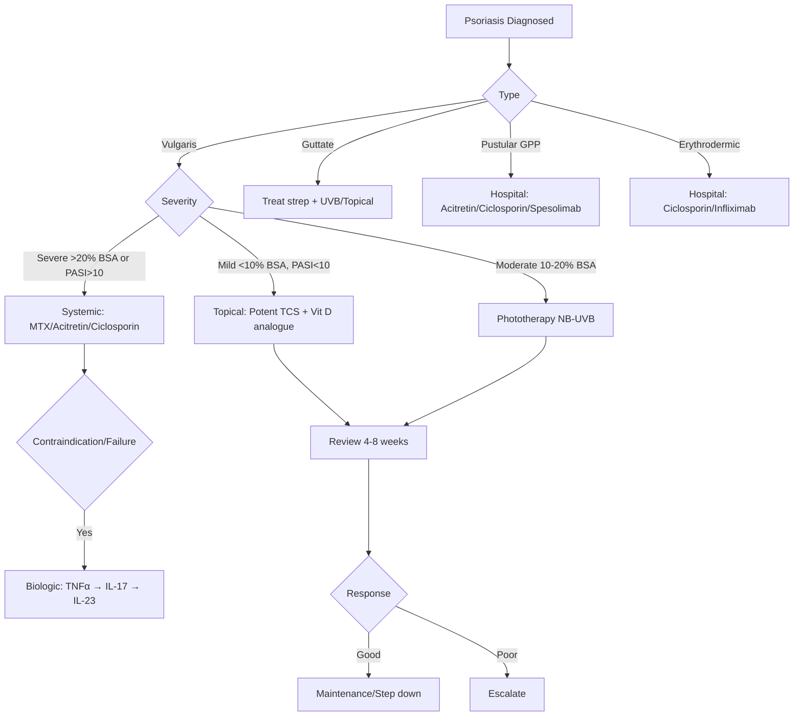
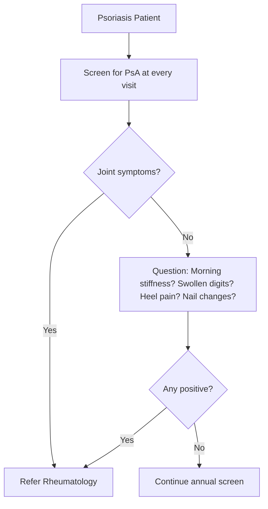

# Psoriasis Hub

---
tags: [medicine, dermatology, topic-group-hub, scaffold-hub]
davidson_part: Part 3: Clinical Medicine
davidson_chapter: Chapter 29: Dermatology
heading: Papulosquamous & Eczematous Disorders
topic_group: Psoriasis
topic:
status: full-fcps-mrcp-hub
priority: critical
created: 2026-06-15
modified: 2026-06-15
exam_relevance: [FCPS, MRCP Part 1, MRCP Part 2, PACES]
see_also:
  - "[[Papulosquamous and Eczematous Hub]]"
  - "[[Dermatology MOC]]"
---

# Psoriasis Hub

> [!info]
> **Topic Group 2.1** | **7 Disease Topics** | **Priority: CRITICAL**

---

## Disease Topics in this Group

| # | Topic | Status | Priority |
|---|-------|--------|----------|
| 1 | Psoriasis vulgaris (chronic plaque) | 🔴 scaffold | Critical |
| 2 | Guttate psoriasis | 🔴 scaffold | High |
| 3 | Pustular psoriasis (generalised, palmoplantar) | 🔴 scaffold | High |
| 4 | Erythrodermic psoriasis | 🔴 scaffold | Critical |
| 5 | Psoriatic arthritis (dermatology perspective) | 🔴 scaffold | High |
| 6 | Nail psoriasis | 🔴 scaffold | High |
| 7 | Scalp psoriasis | 🔴 scaffold | Medium |

---

## High-Yield Summary

| Variant | Key Clinical | Pathophysiology | Severity Score | 1st Line | Biologic Target |
|---------|--------------|-----------------|----------------|----------|-----------------|
| **Vulgaris** | Symmetric extensor plaques, silvery scale, Auspitz, Koebner, nail pitting | Th1/Th17, IL-23/IL-17 axis, keratinocyte hyperproliferation | PASI, BSA, DLQI | TCS + Vit D analogue | TNFα, IL-17, IL-23, JAK |
| **Guttate** | Acute, prodromal strep, teardrop papules, trunk/proximal limbs | Post-streptococcal, molecular mimicry | PASI | UVB, TCS, treat strep | As vulgaris |
| **Pustular (GPP)** | Sterile pustules on erythema, fever, leucocytosis, hypocalcaemia | IL-36 pathway dysregulation | GPPGA | Acitretin, Ciclosporin, IL-36Ra (spesolimab) | IL-17, IL-23, JAK |
| **Pustular (PPP)** | Palmoplantar sterile pustules, smokers, bone/joint pain | IL-36, smoking association | PPPASI | Potent TCS, acitretin, phototherapy | IL-17, IL-23 |
| **Erythrodermic** | >90% BSA erythema, exfoliation, thermoregulation failure, high output cardiac failure | Massive cytokine release | Hospital admission | Ciclosporin, Infliximab, Acitretin | TNFα, IL-17, IL-23 |
| **PsA** | Joint pain/swelling, dactylitis, enthesitis, nail changes, axial | Enthesitis-driven, synovitis | CASPAR criteria, DAPSA | NSAID → csDMARD (MTX) → bDMARD | TNFα, IL-17, IL-23, JAK |
| **Nail** | Pitting, onycholysis, oil spots, subungual hyperkeratosis, splinter haemorrhages | Nail matrix/bed involvement | NAPSI | Intralesional TCS, systemic if severe | As vulgaris |
| **Scalp** | Thick adherent scale, hairline extension, pruritus | Koebner at hairline | Psoriasis Scalp Severity Index | TCS (lotion/mousse), Vit D, tar, salicylic acid | As vulgaris |

---

## Key Algorithms

### Psoriasis Management (NICE/ESD)

### Psoriatic Arthritis Screening

---

## FCPS/MRCP Viva Topics

1. **Psoriasis vulgaris** - clinical features, Auspitz sign, Koebner, nail changes, PASI calculation, comorbidities
2. **Guttate psoriasis** - streptococcal trigger, acute onset, teardrop papules, self-limiting? treat strep
3. **Pustular psoriasis** - GPP vs PPP, IL-36 pathway, spesolimab (anti-IL-36R), hypocalcaemia risk
4. **Erythrodermic psoriasis** - medical emergency, >90% BSA, fluid/electrolyte, thermoregulation, ciclosporin/infliximab
5. **Psoriatic arthritis** - CASPAR criteria (≥3 points), domains (peripheral, axial, dactylitis, enthesitis, skin/nail), MTX first csDMARD
6. **Biologic sequencing** - TNFα (adalimumab) → IL-17 (secukinumab/ixekizumab) → IL-23 (guselkumab/risankizumab) → JAKi
7. **Nail psoriasis** - NAPSI, pitting (matrix), onycholysis/oil spots (bed), intralesional triamcinolone
8. **Scalp psoriasis** - vehicle selection (lotion/mousse), tar/salicylic acid for scale removal
9. **Comorbidities** - Metabolic syndrome, CVD, IBD, depression, psoriatic arthritis, uveitis
10. **Pregnancy** - UVB safe, TCS safe, MTX/acitretin CONTRAINDICATED, certolizumab only biologic

---

## Mnemonics

- **Psoriasis clinical:** `PLAQUE` = **P**laques, **L**arge, **A**uspitiz, **Q**... **U**niform, **E**xtensor, **K**oebner, **N**ail pitting
- **Comorbidities:** `PSORIASIS` = **P**sA, **S**treptococcal (guttate), **O**besity, **R**heumatic? No - **R**educed QoL, **I**schaemic heart disease, **A**lcohol, **S**moking, **I**BD, **S**tress
- **Biologic order:** `T-I-J` = **T**NFα first, **I**L-17 second, **J**AKi/IL-23 third
- **CASPAR criteria:** `CASPAR` = **C**urrent psoriasis (2pts), **A**nxillary? No - **A**rthritis, **S**pinal? No - **S**A (psoriatic nail) (1pt), **P**... = **P**arent/relative (1pt), **A**nti-CCP negative (1pt), **R**adiographic (1pt) → ≥3 pts

---

## Linkage

- **Parent Hub:** [[Papulosquamous and Eczematous Hub]]
- **MOC:** [[Dermatology MOC]]
- **Disease Topics:** See individual files in `02_Papulosquamous_Eczematous/`

---

## Progress
- [ ] Psoriasis vulgaris (scaffold → full)
- [ ] Guttate psoriasis (scaffold → full)
- [ ] Pustular psoriasis (scaffold → full)
- [ ] Erythrodermic psoriasis (scaffold → full)
- [ ] Psoriatic arthritis (scaffold → full)
- [ ] Nail psoriasis (scaffold → full)
- [ ] Scalp psoriasis (scaffold → full)