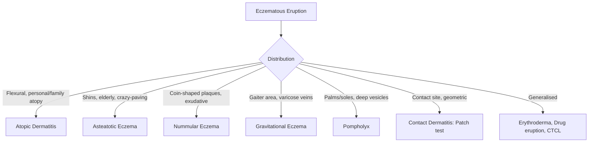

# Atopic Dermatitis Hub

---
tags: [medicine, dermatology, topic-group-hub, scaffold-hub]
davidson_part: Part 3: Clinical Medicine
davidson_chapter: Chapter 29: Dermatology
heading: Papulosquamous & Eczematous Disorders
topic_group: Atopic Dermatitis & Related Eczemas
topic:
status: full-fcps-mrcp-hub
priority: critical
created: 2026-06-15
modified: 2026-06-15
exam_relevance: [FCPS, MRCP Part 1, MRCP Part 2, PACES]
see_also:
  - "[[Papulosquamous and Eczematous Hub]]"
  - "[[Dermatology MOC]]"
---

# Atopic Dermatitis & Related Eczemas Hub

> [!info]
> **Topic Group 2.3** | **5 Disease Topics** | **Priority: CRITICAL**

---

## Disease Topics in this Group

| # | Topic | Status | Priority |
|---|-------|--------|----------|
| 1 | Atopic dermatitis (adult, paediatric) | 🔴 scaffold | Critical |
| 2 | Asteatotic eczema | 🔴 scaffold | Medium |
| 3 | Nummular (discoid) eczema | 🔴 scaffold | High |
| 4 | Gravitational (stasis) eczema | 🔴 scaffold | High |
| 5 | Pompholyx (dyshidrotic eczema) | 🔴 scaffold | High |

---

## High-Yield Summary

| Eczema Type | Key Clinical | Key Feature | Severity Score | 1st Line | Biologic |
|-------------|--------------|-------------|----------------|----------|----------|
| **Atopic Dermatitis** | Pruritic flexural dermatitis, personal/family atopy, early onset, xerosis, lichenification | FLG mutation (50%), Th2/Th22, barrier defect | EASI, SCORAD, DLQI, POEM | Emollients, TCS/TCI, NB-UVB, Ciclosporin | **Dupilumab** (IL-4Rα), **Tralokinumab** (IL-13), JAKi |
| **Asteatotic Eczema** | Crazy-paving cracks, shins, elderly, winter, xerosis | Barrier failure, low humidity | Clinical | Emollients (greasy), mild TCS | - |
| **Nummular Eczema** | Coin-shaped plaques, exudative/crusty, legs/arms, winter, Staphylococcus | Bacterial superinfection common | Clinical | Potent TCS, antibiotics if infected, phototherapy | - |
| **Gravitational Eczema** | Ankle/gaiter distribution, varicose veins, lipodermatosclerosis, ulcer risk | Venous hypertension → inflammation | Clinical | Compression (ABPI>0.8), emollients, TCS | - |
| **Pompholyx** | Deep-seated vesicles palms/soles/lateral fingers, intense pruritus, recurrent, stress/sweat | Spongiosis, sweat duct obstruction | Clinical | Potent TCS, soaks (KMnO4), TCI, phototherapy, botulinum | - |

---

## Key Algorithms

### Atopic Dermatitis Stepped Management
```mermaid
flowchart TD
    A[Atopic Dermatitis] --> B[Emollients + Avoid triggers + Education]
    B --> C{Control?}
    C -->|No| D[Mild TCS face/flexures, Moderate TCS body]
    D --> E{Control?}
    E -->|No| F[TCI: Tacrolimus 0.1%/0.03% or Pimecrolimus 1%]
    F --> G{Control?}
    G -->|No| H[NB-UVB 3x/week]
    H --> I{Control?}
    I -->|No| J[Systemic: Ciclosporin 1st line (rapid), then MTX/AZA/MMF]
    J --> K{Control?}
    K -->|No| L[Biologic: Dupilumab (IL-4Rα) / Tralokinumab (IL-13) / JAKi (Baricitinib/Upadacitinib/Abrocitinib)]
    L --> M{Control?}
    M -->|No| N[Specialist MDT]
```

### Eczema Subtype Recognition


---

## FCPS/MRCP Viva Topics

1. **Atopic dermatitis** - UK diagnostic criteria (Williams), Hanifin-Rajka, FLG mutation, Th2/Th17/Th22, EASI/SCORAD/POEM
2. **Stepped management** - emollients → TCS → TCI → phototherapy → ciclosporin → dupilumab/JAKi
3. **Dupilumab** - anti-IL-4Rα, blocks IL-4/IL-13, 300mg q2w (loading 600mg), conjunctivitis side effect
4. **JAK inhibitors in AD** - baricitinib, upadacitinib, abrocitinib; CBC/LFT/lipids, VZV, thrombosis, pregnancy avoid
5. **Asteatotic eczema** - elderly, winter, shins, crazy-paving, greasy emollients
6. **Nummular eczema** - coin-shaped, exudative, Staph superinfection, potent TCS + antibiotics
7. **Gravitational eczema** - venous hypertension, lipodermatosclerosis, atrophie blanche, compression therapy, ulcer prevention
8. **Pompholyx** - deep vesicles palms/soles, pruritus, stress/sweat trigger, potent TCS, KMnO4 soaks, botulinum toxin
9. **Topical calcineurin inhibitors** - tacrolimus/pimecrolimus, no atrophy, face/flexures OK, burning, black box warning
10. **Infection in AD** - S. aureus (90% colonised), eczema herpeticum (emergency), molluscum extensive

---

## Mnemonics

- **AD diagnostic criteria (UK):** `VISIBLE` = **V**isible flexural dermatitis, **I**tch, **S**tart <2y, **I**nvolvement generalised (infants), **B**y history (atopy), **L**ichenification, **E**arly onset
- **AD management steps:** `E-T-P-S-C-D` = **E**mollients, **T**CS, **T**CI, **P**hototherapy, **S**ystemic (Ciclosporin), **D**upilumab/JAKi
- **FLG mutation:** `FLG` = **F**ilaggrin gene, **L**oss-of-function, **G** → barrier defect → AD, Ichthyosis vulgaris, peanut allergy
- **Eczema types by site:** `FACE GATOR` = **F**lexural = AD, **A**nkle/gaiter = Gravitational, **C**oin = Nummular, **E**lderly shins = Asteatotic, **G**loves/socks = Pompholyx

---

## Linkage

- **Parent Hub:** [[Papulosquamous and Eczematous Hub]]
- **MOC:** [[Dermatology MOC]]
- **Disease Topics:** See individual files in `02_Papulosquamous_Eczematous/`

---

## Progress
- [ ] Atopic dermatitis (scaffold → full)
- [ ] Asteatotic eczema (scaffold → full)
- [ ] Nummular eczema (scaffold → full)
- [ ] Gravitational eczema (scaffold → full)
- [ ] Pompholyx (scaffold → full)