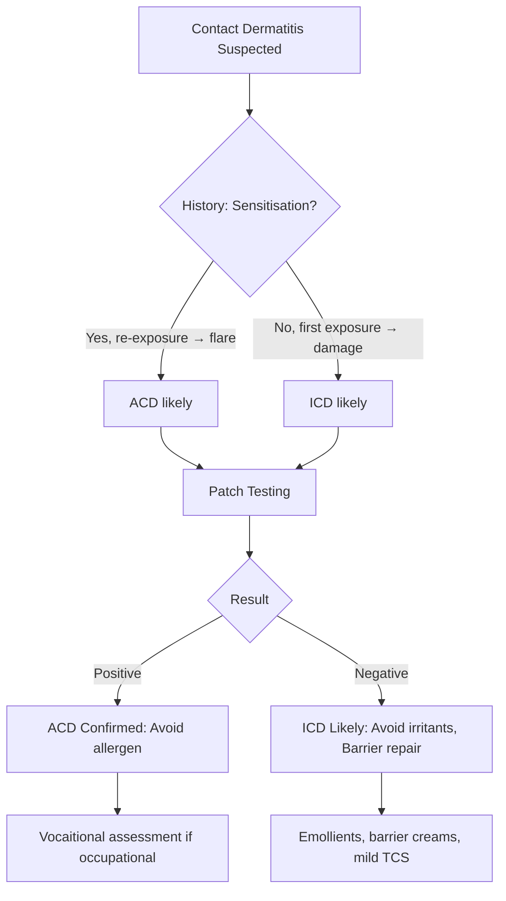

# Contact Dermatitis Hub

---
tags: [medicine, dermatology, topic-group-hub, scaffold-hub]
davidson_part: Part 3: Clinical Medicine
davidson_chapter: Chapter 29: Dermatology
heading: Papulosquamous & Eczematous Disorders
topic_group: Contact Dermatitis
topic:
status: full-fcps-mrcp-hub
priority: critical
created: 2026-06-15
modified: 2026-06-15
exam_relevance: [FCPS, MRCP Part 1, MRCP Part 2, PACES]
see_also:
  - "[[Papulosquamous and Eczematous Hub]]"
  - "[[Dermatology MOC]]"
---

# Contact Dermatitis Hub

> [!info]
> **Topic Group 2.4** | **5 Disease Topics** | **Priority: CRITICAL**

---

## Disease Topics in this Group

| # | Topic | Status | Priority |
|---|-------|--------|----------|
| 1 | Allergic contact dermatitis | 🔴 scaffold | Critical |
| 2 | Irritant contact dermatitis | 🔴 scaffold | High |
| 3 | Occupational contact dermatitis | 🔴 scaffold | High |
| 4 | Plant-induced dermatitis | 🔴 scaffold | Medium |
| 5 | Patch testing methodology | 🔴 scaffold | Critical |

---

## High-Yield Summary

| Type | Pathophysiology | Key Clinical | Diagnosis | 1st Line |
|------|-----------------|--------------|-----------|----------|
| **Allergic Contact (ACD)** | Type IV hypersensitivity, sensitisation → elicitation | Acute: vesicles, oedema; Chronic: lichenification, fissuring; Geometric borders | **Patch testing** (standard series + specific) | **Avoidance**, potent TCS, barrier repair |
| **Irritant Contact (ICD)** | Direct cytotoxic damage, no sensitisation, dose-dependent | Acute: chemical burn; Chronic: dry, fissured, hypertrophic; Hands common | History + exclusion of ACD (patch test -ve) | **Avoidance**, barrier creams, mild-mod TCS |
| **Occupational** | ACD +/ ICD, workplace exposure, legal implications | Hands/forearms, improves off work, specific allergens (epoxy, rubber, chromate) | Patch testing + workplace visit | Avoidance, redeployment, compensation |
| **Plant-Induced** | ACD (Sesquiterpene lactones - Compositae; Urushiol - Toxicodendron) | Linear streaks, airborne (face/neck), gardening/hiking | Patch testing (plant series) | Avoidance, TCS, barrier |
| **Patch Testing** | Type IV in vivo, standardised | Apply D0, read D2/D4; +? to +++; Relevance: current/past/uncertain | **Baseline series** (BDS) + specific | Methodology, interpretation, quality control |

---

## Key Algorithms

### ACD vs ICD Differentiation


### Patch Testing Protocol
```mermaid
flowchart TD
    A[Patch Test Indicated] --> B[Apply Baseline Series (BDS) + Specific]
    B --> C[D0: Apply Chambers (Finn/IQ) to Upper Back]
    C --> D[D2 (48h): Remove, Initial Reading]
    D --> E[D4 (96h) or D7: Final Reading]
    E --> F[Grade: ? + +++ (IR/Reproducibility)]
    F --> G[Assess Relevance]
    G --> H{Current Exposure?}
    H -->|Yes| I[Current Relevance]
    H -->|Past| J[Past Relevance]
    H -->|Unknown| K[Uncertain Relevance]
    I & J & K --> L[Written Report + Avoidance Advice]
```

---

## FCPS/MRCP Viva Topics

1. **ACD vs ICD** - mechanism (Type IV vs direct toxicity), clinical (vesicles vs dry/fissured), patch test (+ve vs -ve)
2. **Patch testing** - methodology (Finn chambers, D0/D2/D4), standard series (BDS), grading (+? to +++), relevance assessment
3. **Common allergens** - Nickel (jewellery), Fragrance mix (cosmetics), PPD (hair dye), Rubber chemicals (gloves), Chromate (cement), Epoxy (adhesives), Colophony (plasters)
4. **Occupational dermatitis** - hands/forearms, improves weekends/holidays, employer duties (COSHH), compensation
5. **Plant dermatitis** - Compositae (chrysanthemum, daisy) = sesquiterpene lactones, airborne face/neck; Toxicodendron (poison ivy/oak) = urushiol, linear streaks
6. **Hand dermatitis** - ICD > ACD, wet work, atopic background, chronic → lichenification, patch test essential
7. **Photoallergic vs phototoxic** - photoallergic (immune, eczematous, less dose-dependent); phototoxic (direct, sunburn-like, dose-dependent)
8. **Patch test pitfalls** - angry back syndrome, active dermatitis, immunosuppressants, topical steroids on test site, reading too early/late

---

## Mnemonics

- **Common patch test allergens:** `NICKEL FRAGRANCE PPD RUBBER CHROMATE EPOXY` = **N**ickel, **F**ragrance mix, **P**PD, **R**ubber accelerators, **CH**romate, **E**poxy
- **ACD features:** `ACUTE GEOMETRIC` = **A**cute vesicles, **C**hronic lichenification, **U**rticaria? No, **T**ype IV, **E**licitation, **G**eometric borders, **E**czematous, **O**ccupational, **M**aybe photo, **E**czema chronic, **T**est patch, **R**elevance, **I**mproves avoidance, **C**hronic if missed
- **Patch test reading:** `D2 D4` = **D**ay 2 (48h) + **D**ay 4 (96h); Grade ? (doubtful), + (weak), ++ (strong), +++ (extreme); IR = irritant reaction
- **Occupational:** `COSHH` = **C**ontrol **O**f **S**ubstances **H**azardous to **H**ealth (UK regulations)

---

## Linkage

- **Parent Hub:** [[Papulosquamous and Eczematous Hub]]
- **MOC:** [[Dermatology MOC]]
- **Disease Topics:** See individual files in `02_Papulosquamous_Eczematous/`

---

## Progress
- [ ] Allergic contact dermatitis (scaffold → full)
- [ ] Irritant contact dermatitis (scaffold → full)
- [ ] Occupational contact dermatitis (scaffold → full)
- [ ] Plant-induced dermatitis (scaffold → full)
- [ ] Patch testing methodology (scaffold → full)