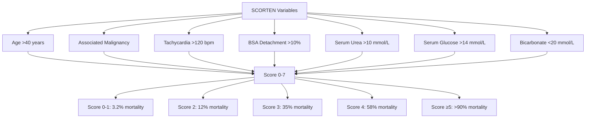

# Erythema Multiforme SJS TEN Hub

---
tags: [medicine, dermatology, topic-group-hub, scaffold-hub]
davidson_part: Part 3: Clinical Medicine
davidson_chapter: Chapter 29: Dermatology
heading: Urticaria, Erythema & Purpura
topic_group: Erythema Multiforme, SJS & TEN
topic:
status: full-fcps-mrcp-hub
priority: critical
created: 2026-06-15
modified: 2026-06-15
exam_relevance: [FCPS, MRCP Part 1, MRCP Part 2, PACES]
see_also:
  - "[[Urticaria Erythema Purpura Hub]]"
  - "[[Dermatology MOC]]"
---

# Erythema Multiforme, SJS & TEN Hub

> [!info]
> **Topic Group 3.2** | **6 Disease Topics** | **Priority: CRITICAL**

---

## Disease Topics in this Group

| # | Topic | Status | Priority |
|---|-------|--------|----------|
| 1 | Erythema multiforme (minor, major) | 🔴 scaffold | High |
| 2 | Stevens-Johnson syndrome (SJS) | 🔴 scaffold | Critical |
| 3 | Toxic epidermal necrolysis (TEN) | 🔴 scaffold | Critical |
| 4 | SJS/TEN overlap | 🔴 scaffold | Critical |
| 5 | SCORTEN scoring | 🔴 scaffold | Critical |
| 6 | Mycoplasma-induced SJS | 🔴 scaffold | High |

---

## High-Yield Summary

| Condition | BSA Detachment | Mucosal Sites | Key Features | Score | Mortality |
|-----------|----------------|---------------|--------------|-------|-----------|
| **EM Minor** | None | 0-1 (usually oral) | Target lesions (iris), acral, HSV-associated | - | <1% |
| **EM Major** | <10% | ≥2 | Target lesions + mucosal, HSV/drug | - | <5% |
| **SJS** | <10% | ≥2 | Macules → blisters → necrosis, prodrome | SCORTEN | 5-10% |
| **SJS/TEN Overlap** | 10-30% | ≥2 | Mixed features | SCORTEN | 20-30% |
| **TEN** | >30% | ≥2 | Large sheet necrosis, Nikolsky+, sepsis risk | SCORTEN | 30-50% |

---

## Key Algorithms

### SJS/TEN/EM Spectrum
```mermaid
flowchart TD
    A[Acute Mucocutaneous Reaction] --> B{Target Lesions?}
    B -->|Yes, classic iris| C[Erythema Multiforme]
    C --> D{Mucosal Sites}
    D -->|0-1| E[EM Minor]
    D -->|≥2| F[EM Major]
    B -->|No target (macules→necrosis)| G{Mucosal ≥2?}
    G -->|Yes| H{BSA Detachment}
    H -->|<10%| I[SJS]
    H -->|10-30%| J[SJS/TEN Overlap]
    H -->|>30%| K[TEN]
    G -->|No| L[Other: DRESS, AGEP, FDE]
```

### SCORTEN Calculation (Day 1-3)


---

## FCPS/MRCP Viva Topics

1. **SJS vs TEN vs Overlap** - BSA detachment % is KEY: SJS <10%, Overlap 10-30%, TEN >30%; all have ≥2 mucosal sites
2. **Erythema Multiforme** - target/iris lesions, acral distribution, HSV-associated (70%), minor (1 mucosa), major (≥2 mucosa)
3. **SCORTEN** - 7 variables, each 1 point, calculate at admission, day 1-3, predicts mortality
4. **Culprit drugs** - Allopurinol, Carbamazepine, Lamotrigine, Sulfonamides, NSAIDs, Nevirapine, Phenytoin, Oxicams
5. **HLA associations** - HLA-B*58:01 (Allopurinol), HLA-B*15:02 (Carbamazepine - Asian), HLA-A*31:01 (Carbamazepine - European), HLA-B*57:01 (Abacavir)
6. **Management** - **STOP culprit drug IMMEDIATELY**, ICU/HDU admission, fluid resuscitation (like burns), wound care, nutrition, ophthalmology daily, NO prophylactic antibiotics, consider IVIG 2-3g/kg or Ciclosporin 3-5mg/kg (controversial)
7. **Complications** - Sepsis, multiorgan failure, ocular (symblepharon, blindness), oesophageal strictures, pulmonary, renal
8. **Mycoplasma-induced SJS** - children/young adults, prominent mucosal (respiratory, genital), less skin detachment, self-limiting, macrolides
9. **RegiSCAR (DRESS) vs SCORTEN** - DRESS: eosinophilia, organ involvement, latency 2-6w; SJS/TEN: necrosis, mucosal, latency 1-4w
10. **Long-term sequelae** - ocular (dry eye, symblepharon), skin (pigmentation, scarring), pulmonary, psychological

---

## Mnemonics

- **SJS/TEN drugs:** `SCAR DRUGS` = **S**ulfonamides, **C**arbamazepine, **A**llopurinol, **R**are, **D**apsone, **R**ifampicin, **U**rate-lowering (allopurinol), **G**abapentin?, **S** NSAIDs
- **SCORTEN:** `SCORTEN` = **S**evere malignancy, **C**ardiac disease, **O**lder >40, **R**ate BSA >10%, **T**achycardia >120, **E**pidermal detachment >10%, **N** urea >10 mmol/L
- **BSA cutoffs:** `SJS/TEN BSA` = **SJS** <10%, **Overlap** 10-30%, **TEN** >30% (ALL have mucosa ≥2)
- **HLA-Drug:** `HLA BAD` = **HLA-B*58:01** = Allopurinol, **HLA-B*15:02** = Carbamazepine (Asian), **HLA-A*31:01** = Carbamazepine (European), **HLA-B*57:01** = Abacavir

---

## Linkage

- **Parent Hub:** [[Urticaria Erythema Purpura Hub]]
- **MOC:** [[Dermatology MOC]]
- **Disease Topics:** See individual files in `03_Urticaria_Erythema_Purpura/`

---

## Progress
- [ ] Erythema multiforme (scaffold → full)
- [ ] Stevens-Johnson syndrome (scaffold → full)
- [ ] Toxic epidermal necrolysis (scaffold → full)
- [ ] SJS/TEN overlap (scaffold → full)
- [ ] SCORTEN scoring (scaffold → full)
- [ ] Mycoplasma-induced SJS (scaffold → full)