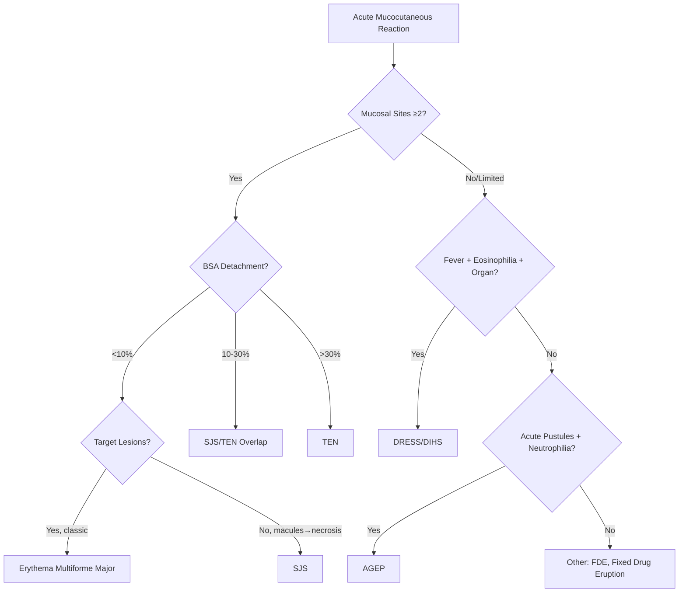
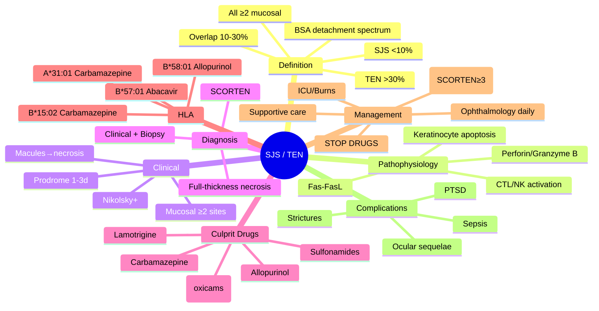
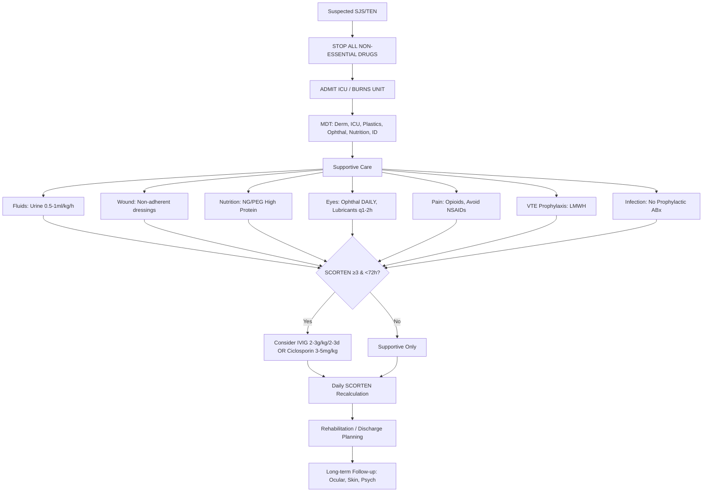

# Stevens-Johnson Syndrome (SJS) & Toxic Epidermal Necrolysis (TEN)

---

tags: [medicine, dermatology, davidson, sjs, ten, scar, fcps, mrcp]
davidson_part: Part 3: Clinical Medicine
davidson_chapter: Chapter 29: Dermatology
heading: Urticaria, Erythema & Purpura
topic_group: Erythema Multiforme, SJS & TEN
topic: Stevens-Johnson Syndrome (SJS) / Toxic Epidermal Necrolysis (TEN)
status: full-fcps-mrcp-note
priority: critical
cards: 25
created: 2026-06-15
modified: 2026-06-15
exam_relevance: [FCPS, MRCP Part 1, MRCP Part 2, PACES]
see_also:
  - "[[Erythema Multiforme SJS TEN Hub]]"
  - "[[Erythema Multiforme]]"
  - "[[DRESS Syndrome]]"
  - "[[AGEP]]"
  - "[[Drug Eruptions Hub]]"
  - "[[Dermatology MOC]]"
---

## Definition

Stevens-Johnson syndrome (SJS) and toxic epidermal necrolysis (TEN) are severe cutaneous adverse reactions (SCARs) on a spectrum. SJS: <10% BSA detachment plus targetoid lesions and prominent mucosal involvement (≥2 sites). TEN: >30% BSA detachment. SJS/TEN overlap: 10-30% BSA. Mortality: SJS 10%, TEN 25-35% (SCORTEN). Most commonly drug-induced (sulfonamides, anticonvulsants, allopurinol, NSAIDs, nevirapine). Onset 1-3 weeks after drug exposure. Considered dermatological emergency.

## Clinical Features and Presentation

Clinical presentation: Prodrome (fever, malaise, URI symptoms 1-3 days before rash) followed by widespread dusky erythematous macules progressing to atypical targetoid lesions, flaccid bullae, skin sloughing, and erosions. Mucosal involvement (≥2 sites — oral, ocular, genital) is characteristic. Nikolsky sign positive (epidermis sloughs with lateral pressure). Ocular involvement (30-50%): conjunctival injection, pseudomembrane, corneal ulceration, synechiae, blindness. Respiratory, GI, renal involvement can occur. Long-term sequelae: ocular (SJS), skin scarring, pigmentation, psychological.


# Stevens-Johnson Syndrome (SJS) / Toxic Epidermal Necrolysis (TEN)

Related: [[Erythema Multiforme]], [[DRESS Syndrome]], [[AGEP]], [[Fixed Drug Eruption]], [[Toxic Epidermal Necrolysis]], [[SCORTEN]], [[HLA Drug Associations]], [[RegiSCAR]], [[EUROSCAR]]

> [!tip]
> Life-threatening drug reactions on spectrum by BSA detachment: SJS <10%, Overlap 10-30%, TEN >30%. ALL have ≥2 mucosal sites. IMMEDIATE drug cessation + ICU care. SCORTEN predicts mortality.

---

## Learning Objectives
- [ ] Define SJS, TEN, and SJS/TEN overlap by BSA detachment and mucosal involvement
- [ ] Differentiate from EM, DRESS, AGEP, FDE using clinical features and timing
- [ ] Calculate SCORTEN and interpret mortality risk
- [ ] List high-risk culprit drugs and HLA associations
- [ ] Outline emergency management: STOP drug, ICU admission, supportive care, immunomodulation
- [ ] Describe complications and long-term sequelae
- [ ] Recall HLA-B*58:01 (allopurinol), B*15:02 (carbamazepine), B*57:01 (abacavir)
- [ ] Answer viva questions on SJS vs TEN vs overlap, SCORTEN, drug cessation
- [ ] Apply mnemonics for SCORTEN and culprit drugs

---

## 1. Definition / Epidemiology / Classification

### Definition
SJS and TEN are severe, life-threatening mucocutaneous reactions (usually drug-induced) characterised by widespread keratinocyte apoptosis leading to epidermal detachment and mucosal erosion. They represent a spectrum of the same disease process.

- **SJS:** BSA detachment <10% + ≥2 mucosal sites
- **SJS/TEN Overlap:** BSA detachment 10-30% + ≥2 mucosal sites
- **TEN:** BSA detachment >30% + ≥2 mucosal sites

### Epidemiology
- **Incidence:** SJS 1-6/million/year; TEN 0.4-1.2/million/year
- **Mortality:** SJS ~5-10%; Overlap ~20-30%; TEN ~30-50% (SCORTEN-dependent)
- **Age:** All ages; TEN more common in elderly
- **Sex:** Slight female predominance
- **Risk factors:** HIV (↑100x), malignancy, autoimmune disease, HLA risk alleles, previous drug reaction

### Classification (by BSA detachment)
| Category | BSA Detachment | Mucosal Sites | Typical Mortality |
|----------|----------------|---------------|-------------------|
| **Erythema Multiforme Major** | <10% (target lesions) | 1 (usually oral) | <5% |
| **Stevens-Johnson Syndrome (SJS)** | <10% (macules → blisters) | ≥2 | 5-10% |
| **SJS/TEN Overlap** | 10-30% | ≥2 | 20-30% |
| **Toxic Epidermal Necrolysis (TEN)** | >30% | ≥2 | 30-50% |

---

## 2. Aetiology / Pathophysiology

### Aetiology
- **Drugs (>80% cases):** Allopurinol, carbamazepine, lamotrigine, sulfonamides, NSAIDs (oxicams), nevirapine, phenytoin, antibiotics
- **Infections:** Mycoplasma pneumoniae (especially children, EM/SJS overlap), HSV, CMV, EBV
- **Idiopathic:** ~10-20%
- **Vaccines:** Rare

### Pathophysiology
```mermaid
flowchart TD
    A[Drug / Metabolite] --> B[HLA-Restricted Presentation to CD8+ T-cells]
    B --> C[Activation of Cytotoxic T-lymphocytes (CTLs) & NK Cells]
    C --> D[Perforin/Granzyme B Release]
    D --> E[Fas-FasL Interaction]
    E --> F[Keratinocyte Apoptosis]
    F --> G[Full-Thickness Epidermal Necrosis]
    G --> H[Dermo-Epidermal Separation]
    H --> I[Blister Formation → Detachment]
    I --> J[Systemic Cytokine Storm: TNF-α, IFN-γ, IL-6, IL-15]
    J --> K[Multi-Organ Involvement]
```

### Key Mechanisms
- **Granzyme B / Perforin:** Main cytotoxic pathway from CTLs
- **Fas-FasL:** Death receptor pathway, soluble FasL elevated in blister fluid
- **GM-CSF:** Promotes CTL survival
- **HLA-Restricted:** Specific HLA alleles present drug/metabolite to T-cells

---

## 3. Clinical Features

### History
- **Prodrome (1-3 days):** Fever, malaise, myalgia, arthralgia, cough, sore throat
- **Drug exposure:** Typically 1-4 weeks prior (allopurinol up to 8 weeks)
- **Mucosal symptoms:** Oral pain, dysphagia, odynophagia, genital pain, ocular burning
- **Skin pain:** Burning > pruritus, Nikolsky sign positive

### Examination

#### Cutaneous
| Stage | Features |
|-------|----------|
| **Early** | Macules, atypical targets (2 zones only), purpuric macules |
| **Progression** | Coalescing macules → flaccid bullae → sheet-like epidermal detachment |
| **Nikolsky sign** | **Positive** (lateral pressure → epidermal shearing) |
| **Distribution** | Trunk, face, proximal limbs; palms/soles often involved |
| **BSA assessment** | Rule of 9s / Lund-Browder; **detached + detachable** |

#### Mucosal (≥2 sites required)
| Site | Features |
|------|----------|
| **Oral** (95%) | Erosions, ulcers, pseudomembranes, lips crusted, unable to eat/drink |
| **Ocular** (80%) | Conjunctivitis, pseudomembranes, symblepharon risk, corneal ulceration |
| **Genital** (70%) | Erosions, ulceration, dysuria, stenosis risk |
| **Respiratory** | Tracheobronchitis, pneumonitis |
| **GI** | Oesophagitis, ulceration, bleeding |

### Key Differentiators
| Feature | SJS/TEN | Erythema Multiforme Major | DRESS |
|---------|---------|---------------------------|-------|
| **Lesion morphology** | Macules → necrosis, NO true targets | Classic target (3 zones) | Morbilliform → oedema → purpura |
| **Mucosal sites** | ≥2 (often severe) | 1 (usually oral) | Variable, usually mild |
| **BSA detachment** | SJS<10%, Ovlp10-30%, TEN>30% | <10% (rarely detaches) | Usually 0% (erythroderma) |
| **Nikolsky** | Positive | Negative | Negative |
| **Latency** | 1-4 weeks | 1-2 weeks (post-infectious) | 2-6 weeks |
| **Systemic** | Sepsis, MOF | Mild | **Eosinophilia, organ involvement** |
| **HLA** | Drug-specific | Not HLA-linked | Drug-specific |

---

## 4. Diagnostic Approach / Algorithm



### Diagnostic Criteria (Bastuji-Garin / SCORTEN Consortium)
1. **Acute onset** macular/targetoid eruption
2. **≥2 mucosal sites** involved (oral, ocular, genital, respiratory, GI)
3. **Epidermal detachment** (BSA %)
4. **Skin biopsy:** Full-thickness epidermal necrosis, sparse dermal infiltrate, dermal-epidermal separation
5. **Exclusion** of SSSS, TEN-like disorders (graft-vs-host, pemphigus, bullous lupus)

### Skin Biopsy (if diagnosis uncertain)
- **H&E:** Full-thickness epidermal necrosis, vacuolar basal degeneration, sparse lymphocytic infiltrate, dermal-epidermal separation
- **DIF:** Negative (vs pemphigus/BP) or non-specific fibrin at BMZ
- **Tzanck:** Acantholytic cells absent (vs pemphigus/SSSS)

---

## 5. Investigations

### Immediate (on admission)
| Investigation | Purpose |
|---------------|---------|
| **FBC, U&E, LFT, CRP, glucose** | Baseline, SCORTEN components, organ function |
| **Coagulation screen** | DIC risk, bleeding |
| **Blood cultures** | Sepsis screen |
| **ABG** | Respiratory compensation, metabolic acidosis |
| **CXR** | Aspiration, pneumonitis, baseline pre-bronchoscopy |
| **ECG** | Baseline, tachycardia (SCORTEN) |
| **Serum amylase/lipase** | Pancreatitis (rare) |

### Severity Scoring (SCORTEN) - Calculate at Admission, Day 1-3
| Variable | Points |
|----------|--------|
| Age >40 years | 1 |
| Associated malignancy | 1 |
| Tachycardia >120 bpm | 1 |
| BSA detachment >10% | 1 |
| Serum urea >10 mmol/L | 1 |
| Serum glucose >14 mmol/L | 1 |
| Bicarbonate <20 mmol/L | 1 |

| SCORTEN Score | Predicted Mortality |
|---------------|---------------------|
| 0-1 | 3.2% |
| 2 | 12% |
| 3 | 35% |
| 4 | 58% |
| ≥5 | >90% |

### Causality Assessment
- **ALDEN (Algorithm of Drug Causality for SJS/TEN):** Scores drug probability (very probable, probable, possible, unlikely)
- **RegiSCAR:** For DRESS (not SJS/TEN)
- **WHO-UMC:** Standard causality categories

---

## 6. Differential Diagnosis

| Differential | Distinguishing Features |
|--------------|------------------------|
| **Erythema Multiforme Major** | Classic target lesions (3 zones), ≤1 mucosal site, HSV-associated, self-limiting |
| **DRESS/DIHS** | Latency 2-6w, eosinophilia, organ involvement (liver/kidney), facial oedema, RegiSCAR ≥5 |
| **AGEP** | Acute pustules (<5d), neutrophilia, fever, EUROSCAR, minimal mucosal |
| **Staphylococcal Scalded Skin Syndrome** | Children, periorificial, **mucosa SPARED**, Nikolsky+, phage group II Staph, toxin-mediated |
| **Pemphigus Vulgaris** | Flaccid bullae, Nikolsky+, **mucosa first**, DIF: IgG intercellular, chronic |
| **Bullous Lupus** | SLE context, DIF: IgG/IgM/IgA/C3 granular BMZ + intercellular |
| **Linear IgA Disease** | IgA linear BMZ, children (chronic bullous of childhood) or adults, dapsone responsive |
| **Graft-vs-Host Disease** | Post-transplant, NIH criteria, skin/liver/GI, biopsy: vacuolar interface + apoptosis |

---

## 7. Management

### IMMEDIATE (Golden Hours)
```mermaid
flowchart TD
    A[Suspected SJS/TEN] --> B[STOP ALL NON-ESSENTIAL DRUGS IMMEDIATELY]
    B --> C[ADMIT TO ICU / BURNS UNIT / HIGH DEPENDENCY]
    C --> D[MULTIDISCIPLINARY TEAM: Derm, ICU, Plastics, Ophthal, Nutrition, ID, Pharmacy]
    D --> E[Supportive Care - BURNS PROTOCOL]
    E --> F[Fluid Resuscitation: Hartmann's/PlasmaLyte, avoid overload, urine output 0.5-1ml/kg/h]
    F --> G[Wound Care: Non-adherent dressings (silicone, paraffin gauze), silver, biological (Biobrane)]
    G --> H[Nutrition: NG/PEG high protein/calorie (1.5-2g/kg protein, 35-40kcal/kg)]
    H --> I[Eye Care: Ophthalmology DAILY, lubricants q1-2h, prevent symblepharon, amniotic membrane]
    I --> J[Pain Control: Opioids, avoid NSAIDs, topical lignocaine]
    J --> K[Infection: NO PROPHYLACTIC ABX; treat proven sepsis (blood culture guided)]
    K --> L[VTE Prophylaxis: LMWH if not bleeding]
    L --> M[Immunomodulation Decision]
```

### Immunomodulation (Controversial, Early <48-72h)
| Agent | Dose | Evidence | Indication |
|-------|------|----------|------------|
| **IVIG** | 2-3g/kg over 2-3 days (1g/kg/day) | Mixed; some meta-analyses show benefit if early | SCORTEN ≥3, early presentation |
| **Ciclosporin** | 3-5mg/kg/day IV/oral | Growing evidence for mortality benefit | SCORTEN ≥3, alternative to IVIG |
| **TNF-α inhibitors** (Infliximab/Etanercept) | Single dose | Case reports/series | Refractory, specialist only |
| **Corticosteroids** | Controversial | Historical use; ↑ infection risk, delayed healing | Generally AVOIDED; if used: short course high-dose |

> **Consensus:** No RCT-proven mortality benefit for any immunomodulator. Supportive care in specialist unit is the cornerstone. IVIG or ciclosperin considered for SCORTEN ≥3 within 48-72h.

### SJS/TEN Overlap & TEN Specific
- **TEN:** Higher fluid needs, greater protein loss, higher infection risk, longer ICU stay
- **Airway management:** Early intubation if laryngeal oedema, extensive oral/tracheal involvement
- **Renal:** Monitor for ATN (hypovolaemia, nephrotoxic drugs, sepsis)

---

## 8. Drug Interactions / Contraindications / Comorbidity Cautions

| Drug | Interaction / Caution |
|------|----------------------|
| **All non-essential drugs** | STOP immediately - including the culprit and any potential cross-reactors |
| **NSAIDs** | Avoid (pain control with opioids) |
| **Corticosteroids** | Controversial; if used, short course only; ↑ sepsis risk |
| **Prophylactic antibiotics** | NOT recommended (promotes resistance, fungal overgrowth) |
| **ACE inhibitors** | Caution with ciclosporin (renal) |

### Cross-Reactivity Groups (Avoid in confirmed allergy)
- **Aromatic anticonvulsants:** Carbamazepine, phenytoin, phenobarbital, lamotrigine, oxcarbazepine (↔ cross-reactivity ~50-80%)
- **Sulfonamides:** Sulfamethoxazole, sulfadiazine, sulfadoxine, dapsone (← caution with dapsone in subsequent use)
- **Allopurinol:** Oxipurinol (metabolite); avoid febuxostat? (different structure but caution)
- **NSAIDs (oxicams):** Piroxicam, tenoxicam, meloxicam

---

## 9. Procedures (if applicable)

### Procedure: Skin Biopsy (Punch/Incisional)
- **Indications:** Diagnostic confirmation, exclude mimics
- **Site:** Lesional edge (transition zone) or fresh blister
- **Technique:** 4mm punch or incisional; H&E + DIF
- **Complications:** Bleeding, infection, delayed healing (fragile skin)
- **Viva Pearls:** Full-thickness necrosis = SJS/TEN; acantholysis = pemphigus/SSSS; DIF negative in SJS/TEN

### Procedure: Bronchoscopy
- **Indications:** Suspected tracheobronchial involvement, atelectasis, secretion retention
- **Findings:** Membranous tracheobronchitis, pseudomembranes, sloughed epithelium
- **Complications:** Bleeding, laryngospasm, hypoxia

---

## 10. Complications

| Complication | Frequency | Management |
|--------------|-----------|------------|
| **Sepsis** | 30-50% TEN | Early diagnosis, blood cultures, targeted ABx, source control |
| **Multiorgan Failure** | Severe TEN | ICU support, renal replacement, vasopressors |
| **Ocular Sequelae** | 25-50% survivors | Symblepharon, trichiasis, dry eye, corneal ulceration, blindness; **Daily ophthalmology**, amniotic membrane, lubricants |
| **Oesophageal Strictures** | 5-15% | Dysphagia, dilatation, stenting |
| **Genital Stenosis** | 5-10% | Urethral/vaginal stenosis, surgical reconstruction |
| **Pulmonary** | Bronchiolitis obliterans | Chronic cough, obstruction, steroids, bronchodilators |
| **Renal** | ATN, interstitial nephritis | Fluid management, avoid nephrotoxins |
| **Psychological** | PTSD, depression, body image | Early psychology referral, support groups |

---

## 11. Red Flags / Emergencies

| Red Flag | Immediate Action |
|----------|------------------|
| **Rapid progression** (BSA increasing hourly) | ICU admission, prepare for intubation |
| **Laryngeal oedema** (stridor, voice change) | Emergency intubation, ENT |
| **Haemodynamic instability** | Vasopressors, fluid resuscitation, echo |
| **Severe metabolic acidosis** (HCO3<15) | Bicarbonate, RRT if renal failure |
| **Seizures** (electrolyte, metabolic) | Benzodiazepines, correct cause |
| **Massive haemorrhage** (GI, mucosal) | Transfusion, endoscopy, interventional radiology |

---

## 12. Prognosis

| Factor | Good Prognosis | Poor Prognosis |
|--------|----------------|----------------|
| **SCORTEN** | 0-1 | ≥3 |
| **Age** | <40 | >60 |
| **BSA detachment** | <10% (SJS) | >50% (TEN) |
| **Culprit drug stopped** | <24h | >72h |
| **Malignancy** | No | Yes |
| **HIV** | No | Yes (CD4<200) |

- **Mortality:** SJS 5-10%, Overlap 20-30%, TEN 30-50% (SCORTEN-dependent)
- **Recovery:** Epidermal re-epithelialisation 2-3 weeks; mucosal healing longer
- **Long-term sequelae:** Ocular (most common), skin pigmentation, scarring, strictures, psychological

---

## 13. Topic Correlation

| Related Topic | Link | Key Overlap |
|---------------|------|-------------|
| **Erythema Multiforme** | [[Erythema Multiforme]] | Target lesions, HSV, 1 mucosa, self-limiting |
| **DRESS Syndrome** | [[DRESS Syndrome]] | Latency 2-6w, eosinophilia, organ involvement, RegiSCAR |
| **AGEP** | [[AGEP]] | Pustules, neutrophilia, 1-5d latency, EUROSCAR |
| **Fixed Drug Eruption** | [[Fixed Drug Eruption]] | Recurrent same site, hyperpigmentation, less severe |
| **Drug Eruptions** | [[Drug Eruptions Hub]] | SCAR spectrum, ALDEN causality |
| **Toxic Epidermal Necrolysis** | [[Toxic Epidermal Necrolysis]] | Same spectrum, >30% BSA |

---

## 14. Special Situations

| Situation | Consideration |
|-----------|---------------|
| **Pregnancy** | Same management; fetal monitoring; culprit drugs often different (avoid known teratogens) |
| **Paediatric** | Mycoplasma-induced SJS common; lower mortality; IVIG often used; family support critical |
| **HIV** | ↑ risk 100x; drug reactions more frequent; same management; ART interactions |
| **Malignancy** | ↑ risk; chemo drugs as culprits; careful drug review; MDT oncology |
| **Re-exposure** | **Absolute contraindication** to culprit + cross-reactors; medical alert bracelet |

---

## FCPS/MRCP High-Yield Summary

| Category | Key Points |
|----------|------------|
| **Definition** | SJS<TEN spectrum by BSA detachment: SJS<10%, Ovlp10-30%, TEN>30%; ALL ≥2 mucosa |
| **Clinical** | Prodrome 1-3d → macules→necrosis→detachment; Nikolsky+; mucosal erosions (oral/ocular/genital) |
| **Diagnosis** | Clinical + biopsy (full-thickness necrosis); exclude SSSS (mucosa spared), pemphigus (DIF+) |
| **Culprit Drugs** | Allopurinol, Carbamazepine, Lamotrigine, Sulfonamides, NSAIDs (oxicams), Nevirapine, Phenytoin |
| **HLA Associations** | B*58:01 (Allopurinol), B*15:02 (Carbamazepine-Asian), A*31:01 (Carbamazepine-Euro), B*57:01 (Abacavir) |
| **SCORTEN** | 7 variables (age>40, cancer, HR>120, BSA>10%, urea>10, glucose>14, HCO3<20); score≥3=35% mortality |
| **Management** | 1) STOP all drugs 2) ICU/Burns unit 3) Supportive (fluids, wound, nutrition, eyes, pain, VTE) 4) Consider IVIG 2-3g/kg or Ciclosporin 3-5mg/kg if SCORTEN≥3 & early 5) NO prophylactic ABx |
| **Complications** | Sepsis, MOF, ocular (symblepharon, blindness), strictures (oesophageal, genital), bronchiolitis obliterans, PTSD |
| **Viva Pearls** | SJS<10%/Ovlp10-30%/TEN>30%; SCORTEN calc; Allopurinol=B*58:01; Carbamazepine=B*15:02/A*31:01; STOP drug immediately |
| **Drug Doses** | IVIG 2-3g/kg/2-3d; Ciclosporin 3-5mg/kg; Fluids: urine 0.5-1ml/kg/h; Nutrition: 1.5-2g/kg protein |
| **Sequelae** | Ocular >50%, strictures, pigmentation, PTSD |

---

## Viva Questions (PACES/FCPS Style)

1. **Q:** How do you distinguish SJS, SJS/TEN overlap, and TEN?
   **A:** By BSA epidermal detachment: SJS <10%, Overlap 10-30%, TEN >30%. ALL require ≥2 mucosal sites involvement.

2. **Q:** What is the SCORTEN scoring system and how do you interpret it?
   **A:** 7 variables (age>40, malignancy, HR>120, BSA>10%, urea>10, glucose>14, HCO3<20), each 1 point. Score 0-1: 3.2% mortality; 2: 12%; 3: 35%; 4: 58%; ≥5: >90%. Calculate at admission and day 1-3.

3. **Q:** What are the most common culprit drugs for SJS/TEN?
   **A:** Allopurinol, carbamazepine, lamotrigine, sulfonamides (cotrimoxazole), NSAIDs (oxicams: piroxicam), nevirapine, phenytoin, phenobarbital, oxicams.

4. **Q:** What HLA associations are important for SJS/TEN risk?
   **A:** HLA-B*58:01 (allopurinol - all populations), HLA-B*15:02 (carbamazepine - Asian), HLA-A*31:01 (carbamazepine - European), HLA-B*57:01 (abacavir), HLA-B*38:01 (allopurinol - European), HLA-C*06:02 (lamotrigine? no).

5. **Q:** Outline the immediate management of suspected SJS/TEN.
   **A:** 1) STOP ALL non-essential drugs IMMEDIATELY. 2) ADMIT to ICU/Burns unit. 3) Multidisciplinary team. 4) Supportive care: fluids (urine 0.5-1ml/kg/h), wound care (non-adherent dressings), nutrition (NG/PEG high protein), daily ophthalmology, pain control (opioids), VTE prophylaxis. 5) Consider IVIG 2-3g/kg or ciclosporin 3-5mg/kg if SCORTEN≥3 within 48-72h. 6) NO prophylactic antibiotics.

6. **Q:** How does SJS/TEN differ from Erythema Multiforme Major?
   **A:** EM Major: classic target lesions (3 zones), ≤1 mucosal site, HSV-associated, self-limiting, Nikolsky−. SJS/TEN: macules→necrosis (no true targets), ≥2 mucosal sites, Nikolsky+, drug-induced, life-threatening.

7. **Q:** How does SJS/TEN differ from DRESS?
   **A:** DRESS: latency 2-6w, eosinophilia, organ involvement (liver/kidney/lung/heart), facial oedema, RegiSCAR≥5. SJS/TEN: latency 1-4w, necrosis/detachment, ≥2 mucosal, Nikolsky+, SCORTEN, no eosinophilia.

8. **Q:** What is the role of IVIG and ciclosporin in SJS/TEN?
   **A:** Controversial, no RCT evidence. Consider if SCORTEN≥3 within 48-72h. IVIG 2-3g/kg over 2-3d (blocks FasL). Ciclosporin 3-5mg/kg/day (inhibits CTL). Corticosteroids generally avoided (infection risk).

9. **Q:** What are the long-term ocular sequelae of SJS/TEN?
   **A:** Symblepharon (lid-fornix adhesion), trichiasis (misdirected lashes), dry eye (goblet cell loss), corneal ulceration/vascularisation, blindness. Prevention: daily ophthalmology, lubricants q1-2h, amniotic membrane transplantation, early lysis of adhesions.

10. **Q:** How does Staphylococcal Scalded Skin Syndrome differ from TEN?
    **A:** SSSS: children, periorificial crusting, **mucosa SPARED**, superficial split (granular layer), phage group II Staph exfoliative toxin, Nikolsky+. TEN: all ages, **≥2 mucosal sites**, full-thickness necrosis, drug-induced.

11. **Q:** What is the ALDEN algorithm?
    **A:** Algorithm of Drug Causality for SJS/TEN: scores drugs as very probable (>7), probable (4-7), possible (2-3), unlikely (<2) based on timing, dechallenge, rechallenge, known risk, alternative causes.

12. **Q:** What cross-reactivity should be avoided after carbamazepine-induced SJS?
    **A:** Aromatic anticonvulsants: phenytoin, phenobarbital, lamotrigine, oxcarbazepine, primidone (cross-reactivity 50-80%). Avoid all. Use non-aromatic alternatives (levetiracetam, valproate, topiramate, gabapentin).

---

## Common Confusions / Exam Traps

| Confusion | Clarification |
|-----------|---------------|
| **SJS vs TEN vs Overlap** | BSA detachment is KEY: SJS<10%, Overlap10-30%, TEN>30% (all ≥2 mucosa) |
| **Nikolsky sign** | Positive in SJS/TEN/SSSS/pemphigus; Negative in EM/DRESS/AGEP/pemphigoid |
| **EM Major vs SJS** | EM = target lesions (3 zones), 1 mucosa, HSV, self-limiting; SJS = macules→necrosis, ≥2 mucosa, drug |
| **SCORTEN vs RegiSCAR** | SCORTEN = SJS/TEN mortality predictor; RegiSCAR = DRESS diagnostic criteria |
| **DRESS vs SJS/TEN** | DRESS = eosinophilia, organ involvement, latency 2-6w, NO significant detachment |
| **SSSS vs TEN** | SSSS = children, mucosa spared, superficial split, Staph toxin; TEN = all ages, mucosa involved, full-thickness, drugs |
| **Corticosteroids in SJS/TEN** | Controversial, generally AVOIDED (infection risk); if used, short course high-dose only |
| **Prophylactic antibiotics** | NOT recommended (resistance, fungal overgrowth); treat proven infection only |
| **Culprit drug timing** | Allopurinol up to 8 weeks; most others 1-4 weeks; DRESS 2-6 weeks |

---

## Mnemonics

1. **SCORTEN Variables:** `SCORTEN` = **S**evere malignancy, **C**ardiac disease, **O**lder >40, **R**ate BSA >10%, **T**achycardia >120, **E**pidermal detachment >10%, **N** urea >10 mmol/L
2. **Culprit Drugs:** `SCAR DRUGS` = **S**ulfonamides, **C**arbamazepine, **A**llopurinol, **R**are, **D**apsone, **R**ifampicin, **U**rate-lowering (allopurinol), **G**abapentin?, **S** NSAIDs (oxicams)
3. **HLA-Drug:** `HLA BAD` = **HLA-B*58:01** = Allopurinol, **HLA-B*15:02** = Carbamazepine (Asian), **HLA-A*31:01** = Carbamazepine (European), **HLA-B*57:01** = Abacavir
4. **SJS/TEN vs DRESS vs AGEP Latency:** `1-4-2-6-1-5` = **SJS/TEN** 1-4w, **DRESS** 2-6w, **AGEP** 1-5d
5. **BSA Cutoffs:** `SJS/OVERLAP/TEN` = **SJS** <10%, **Overlap** 10-30%, **TEN** >30% (ALL ≥2 mucosa)
6. **SSSS vs TEN:** `MUCOSA` = **S**SSS **MUCOSA** **SPARED**; **T**EN **MUCOSA** **INVOLVED**

---

## Mind Map



---

## Flowchart (Management Algorithm)



---

## Suggested Visuals / Image Notes

| Image | Description | Source |
|-------|-------------|--------|
| SJS early macules | Dusky macules with central necrosis | Clinical atlas |
| TEN sheet detachment | Large areas of epidermal detachment | Burns unit photo |
| Nikolsky sign | Epidermal shearing with lateral pressure | Clinical demonstration |
| Oral mucosal erosions | Extensive erosions, pseudomembranes | Clinical photo |
| Ocular pseudomembranes | Conjunctival pseudomembranes | Ophthalmology atlas |
| SCORTEN calculator | Bedside scoring tool | Teaching slide |

---

## Suggested Video References

| Topic | Platform | Link/Duration |
|-------|----------|---------------|
| SJS/TEN pathophysiology | YouTube/BAD | 20 min |
| SCORTEN calculation tutorial | YouTube | 10 min |
| Supportive care in burns unit | BAPS/YouTube | 30 min |
| Ocular management of SJS/TEN | RCOphth/YouTube | 20 min |
| HLA screening for carbamazepine | YouTube | 10 min |

---

## One-Page Revision Card

| **Topic** | **SJS / TEN** |
|-----------|---------------|
| **Definition** | Drug-induced keratinocyte apoptosis spectrum: SJS<10%, Overlap10-30%, TEN>30% BSA; ALL ≥2 mucosa |
| **Key Clinical** | Prodrome→macules→necrosis→detachment; Nikolsky+; mucosal erosions oral/ocular/genital |
| **Dx Criteria** | Clinical + biopsy (full-thickness necrosis); SCORTEN for prognosis |
| **Differentials** | EM Major (targets, 1 mucosa), DRESS (eosinophils, organ), SSSS (mucosa spared), Pemphigus (DIF+) |
| **Investigations** | FBC/U&E/LFT/glucose/ABG (SCORTEN); blood cultures; biopsy if uncertain; ALDEN causality |
| **Management** | 1. STOP DRUGS 2. ICU/Burns 3. Supportive (fluids, wounds, nutrition, eyes, pain) 4. IVIG/Ciclo if SCORTEN≥3 5. NO prophylactic ABx |
| **Key Drugs** | IVIG 2-3g/kg/2-3d; Ciclosporin 3-5mg/kg; Fluids urine 0.5-1ml/kg/h; Nutrition 1.5-2g/kg protein |
| **Red Flags** | Rapid progression, laryngeal oedema, haemodynamic instability, metabolic acidosis |
| **Prognosis** | SCORTEN: 0-1=3%, 2=12%, 3=35%, 4=58%, ≥5=>90% |
| **Viva Pearls** | BSA cutoffs; SCORTEN calc; Allopurinol=B*58:01; Carbamazepine=B*15:02/A*31:01; STOP drug immediately |
| **Mnemonics** | SCORTEN=S/C/O/R/T/E/N; SJS/Ovlp/TEN BSA cutoffs; HLA BAD drugs |

---

## Spaced Repetition Trackers

### 24-Hour Recall Prompts
- [ ] Recite SCORTEN 7 variables and mortality for score 3
- [ ] Differentiate SJS/TEN/Overlap by BSA%
- [ ] List 5 culprit drugs and their HLA associations
- [ ] Outline immediate 5-step management (STOP, ICU, Supportive, Immunomod, MDT)
- [ ] Compare SJS vs EM Major vs DRESS vs SSSS

### Revision Schedule
- [ ] **Day 1** completed (creation + 24h recall)
- [ ] **Day 3** revision completed
- [ ] **Day 7** revision completed
- [ ] **Day 15** revision completed
- [ ] **Day 30** revision completed
- [ ] **Day 90** revision completed

---

## Must Know / Should Know / Nice to Know

### Must Know (Core for passing)
- [ ] SJS/TEN/Overlap definitions by BSA%
- [ ] SCORTEN calculation and interpretation
- [ ] Immediate management: STOP drugs, ICU, supportive care
- [ ] Top 5 culprit drugs (allopurinol, carbamazepine, lamotrigine, sulfonamides, NSAIDs)
- [ ] Key HLA associations (B*58:01, B*15:02, A*31:01, B*57:01)
- [ ] Differentiation from EM, DRESS, AGEP, SSSS, pemphigus
- [ ] Ocular sequelae (symblepharon, blindness) and prevention
- [ ] NO prophylactic antibiotics; NO routine steroids

### Should Know (High probability)
- [ ] IVIG vs ciclosporin evidence and dosing
- [ ] ALDEN causality algorithm
- [ ] Cross-reactivity groups (aromatic anticonvulsants, sulfonamides)
- [ ] Paediatric differences (Mycoplasma SJS, lower mortality)
- [ ] Long-term sequelae and follow-up schedule
- [ ] Pregnancy and HIV considerations

### Nice to Know (Differentiator)
- [ ] TNF-α inhibitors (infliximab) case reports
- [ ] Granzyme B/perforin/FasL mechanistic details
- [ ] Cost-effectiveness of IVIG
- [ ] Genetic screening implementation (B*15:02 pre-carbamazepine in Asians)
- [ ] Psychiatric sequelae (PTSD, depression) management

---

## My Weak Points
- [ ] SCORTEN calculation speed (practice)
- [ ] ALDEN algorithm details
- [ ] Ocular management specifics (amniotic membrane timing)
- [ ] Cost-effectiveness data for immunomodulation

---

## Self-Test Scorecard

| Section | Score /5 |
|---------|----------|
| Definition & Classification | |
| Aetiology & Pathophysiology | |
| Clinical Features | |
| Diagnostic Approach | |
| Investigations | |
| Differential Diagnosis | |
| Management | |
| Complications & Red Flags | |
| Prognosis & Special Situations | |
| Viva Questions | |
| **TOTAL** | **/50** |

> [!tip]
> **Interpretation:** <35 = weak topic, 35-44 = acceptable but insecure, 45+ = strong exam-ready topic.

---

## Exam Answer Modes

### Long Answer Skeleton
1. Definition & classification (SJS<10%, Overlap10-30%, TEN>30%; all ≥2 mucosa)
2. Pathophysiology (CTL/NK → perforin/granzyme B + Fas-FasL → keratinocyte apoptosis)
3. Clinical features (prodrome, macules→necrosis, Nikolsky+, mucosal ≥2 sites)
4. Diagnostic criteria (clinical, biopsy full-thickness necrosis, SCORTEN)
5. Differential diagnosis (EM Major, DRESS, AGEP, SSSS, pemphigus, bullous lupus)
6. Management (STOP drugs, ICU/burns, supportive, IVIG/ciclosporin if SCORTEN≥3, MDT)
7. Complications & sequelae (sepsis, ocular, strictures, pulmonary, psychological)
8. Special situations (paediatric, HIV, pregnancy, malignancy, re-exposure prevention)

### Short Note Skeleton
- Definition: Drug-induced keratinocyte apoptosis spectrum by BSA detachment (SJS<10%, Ovlp10-30%, TEN>30%), all ≥2 mucosa
- Clinical: Prodrome→macules→necrosis→detachment; Nikolsky+; oral/ocular/genital erosions
- Diagnosis: Clinical + biopsy (full-thickness necrosis); SCORTEN for prognosis
- Management: 1) STOP drugs 2) ICU/burns 3) Supportive (fluids, wounds, nutrition, eyes) 4) Consider IVIG/ciclosporin if SCORTEN≥3 5) MDT
- Prognosis: SCORTEN 0-1=3%, 2=12%, 3=35%, 4=58%, ≥5=>90%

### Viva One-Liners
- **Q:** SJS vs TEN vs Overlap → **A:** BSA detachment: SJS<10%, Ovlp10-30%, TEN>30% (all ≥2 mucosa)
- **Q:** SCORTEN → **A:** 7 vars (age>40, cancer, HR>120, BSA>10%, urea>10, glucose>14, HCO3<20); score≥3=35% mortality
- **Q:** Culprit drugs → **A:** Allopurinol, carbamazepine, lamotrigine, sulfonamides, NSAIDs (oxicams), nevirapine
- **Q:** HLA-B*58:01 → **A:** Allopurinol (all populations); B*15:02 = carbamazepine (Asian); A*31:01 = carbamazepine (Euro); B*57:01 = abacavir
- **Q:** Immediate management → **A:** STOP drugs, ICU, supportive, consider IVIG/ciclosporin if SCORTEN≥3, MDT
- **Q:** SJS vs EM Major → **A:** EM=targets(3 zones), 1 mucosa, HSV, self-limiting; SJS=macules→necrosis, ≥2 mucosa, drugs
- **Q:** SSSS vs TEN → **A:** SSSS=children, mucosa SPARED, superficial split; TEN=all ages, mucosa INVOLVED, full-thickness
- **Q:** Ocular sequelae → **A:** Symblepharon, trichiasis, dry eye, corneal ulceration, blindness; daily ophth, lubricants, amniotic membrane
- **Q:** IVIG dose → **A:** 2-3g/kg over 2-3 days (1g/kg/day), consider if SCORTEN≥3 within 48-72h
- **Q:** Cross-reactivity carbamazepine → **A:** Avoid all aromatic anticonvulsants (phenytoin, phenobarbital, lamotrigine, oxcarbazepine)

### Ward-Case Discussion Points
- Calculate SCORTEN at bedside
- Demonstrate Nikolsky sign technique
- Assess mucosal involvement (oral, ocular, genital)
- Plan wound care (non-adherent dressings)
- Coordinate MDT (burns, ophthalmology, nutrition, pharmacy)
- Counsel family on prognosis and stopping all drugs

### Last-Night-Before-Exam Sheet
- **Top 5 facts:** 1) BSA cutoffs SJS<10%/Ovlp10-30%/TEN>30% 2) SCORTEN≥3=35% 3) Allopurinol #1 drug 4) STOP drugs immediately 5) Ocular sequelae common
- **3 drug doses:** IVIG 2g/kg/d×2d, Ciclosporin 3mg/kg/d, Fluids urine 0.5-1ml/kg/h
- **2 algorithms:** SCORTEN calculation; Management (STOP→ICU→Supportive→Immunomod)
- **1 mnemonic:** `SCORTEN` = Severe malignancy, Cardiac, Older>40, Rate BSA>10%, Tachycardia>120, Epidermal>10%, uN>10
- **Must-know differential:** SSSS (mucosa spared, children) vs TEN (mucosa involved, drugs)

---

## Summary

Stevens-Johnson Syndrome (SJS) and Toxic Epidermal Necrolysis (TEN) represent a spectrum of life-threatening drug-induced mucocutaneous reactions classified by body surface area (BSA) epidermal detachment: SJS <10%, SJS/TEN overlap 10-30%, TEN >30% — all with involvement of ≥2 mucosal sites. Pathophysiology involves HLA-restricted drug presentation activating cytotoxic T-cells and NK cells, leading to keratinocyte apoptosis via perforin/granzyme B and Fas-FasL pathways. Clinical presentation includes a 1-3 day prodrome (fever, malaise) followed by dusky macules progressing to coalescing necrosis and sheet-like epidermal detachment with positive Nikolsky sign. Mucosal involvement (≥2 sites: oral, ocular, genital) is universal and severe. Diagnosis is clinical, supported by skin biopsy showing full-thickness epidermal necrosis. The SCORTEN score (7 variables: age>40, malignancy, HR>120, BSA>10%, urea>10, glucose>14, bicarbonate<20) predicts mortality: score 0-1=3.2%, 2=12%, 3=35%, 4=58%, ≥5=>90%. Immediate management: STOP all non-essential drugs, admit to ICU/burns unit, multidisciplinary supportive care (fluids, wound care, nutrition, daily ophthalmology, pain control, VTE prophylaxis, NO prophylactic antibiotics). Immunomodulation (IVIG 2-3g/kg or ciclosporin 3-5mg/kg) considered for SCORTEN≥3 within 48-72h. Common culprit drugs: allopurinol, carbamazepine, lamotrigine, sulfonamides, NSAIDs (oxicams), nevirapine. Key HLA associations: HLA-B*58:01 (allopurinol), HLA-B*15:02 (carbamazepine-Asian), HLA-A*31:01 (carbamazepine-European), HLA-B*57:01 (abacavir). Complications include sepsis, multiorgan failure, ocular sequelae (symblepharon, blindness), strictures, bronchiolitis obliterans, and PTSD. Cross-reactivity avoidance crucial (aromatic anticonvulsants, sulfonamides). Re-exposure absolutely contraindicated.

---

## MCQs (10)

1. **Question:** What is the key criterion distinguishing SJS from TEN?
   **Options:** A. Number of mucosal sites B. BSA epidermal detachment C. Presence of Nikolsky sign D. Drug causality
   **Answer:** B
   **Explanation:** SJS = <10% BSA detachment; SJS/TEN overlap = 10-30%; TEN = >30%. All have ≥2 mucosal sites.

2. **Question:** Which SCORTEN variable carries the highest weight?
   **Explanation:** All 7 variables carry equal weight (1 point each). No single variable is weighted higher.

3. **Question:** A patient presents with acute onset widespread erythema, flaccid bullae, and epidermal detachment affecting 45% BSA. Oral, ocular, and genital mucosae are eroded. Nikolsky sign is positive. What is the diagnosis?
   **Options:** A. SJS B. SJS/TEN Overlap C. TEN D. Erythema Multiforme Major
   **Answer:** C
   **Explanation:** BSA detachment >30% with ≥2 mucosal sites = Toxic Epidermal Necrolysis (TEN).

4. **Question:** Which drug is the MOST common cause of SJS/TEN worldwide?
   **Options:** A. Carbamazepine B. Allopurinol C. Lamotrigine D. Cotrimoxazole
   **Answer:** B
   **Explanation:** Allopurinol is the most common culprit globally, followed by carbamazepine, lamotrigine, sulfonamides, and oxicam NSAIDs.

5. **Question:** Which HLA allele is associated with allopurinol-induced SJS/TEN across all populations?
   **Options:** A. HLA-B*15:02 B. HLA-B*58:01 C. HLA-A*31:01 D. HLA-B*57:01
   **Answer:** B
   **Explanation:** HLA-B*58:01 is strongly associated with allopurinol-induced SJS/TEN in all ethnic groups. Screening recommended before initiation in high-prevalence populations.

6. **Question:** What is the recommended fluid resuscitation target in SJS/TEN?
   **Options:** A. Urine output 0.5-1ml/kg/h B. CVP >12mmHg C. MAP >65mmHg D. Lactate <2mmol/L
   **Answer:** A
   **Explanation:** Fluid resuscitation targets urine output 0.5-1ml/kg/h (similar to burns). Avoid overload (pulmonary oedema risk). Use Hartmann's/PlasmaLyte.

7. **Question:** Which statement about IVIG in SJS/TEN is CORRECT?
   **Options:** A. Proven mortality benefit in RCTs B. Dose 0.5g/kg/day for 5 days C. Consider if SCORTEN ≥3 within 48-72h D. Contraindicated in renal failure
   **Answer:** C
   **Explanation:** IVIG (2-3g/kg over 2-3 days) is considered for SCORTEN ≥3 if given early (<48-72h). Evidence is mixed, no RCT-proven benefit. Not contraindicated in renal failure (dose adjust).

8. **Question:** A 10-year-old child develops SJS 2 weeks after a respiratory illness. Mycoplasma PCR is positive. What is the MOST likely trigger?
   **Options:** A. Drug reaction B. Mycoplasma pneumoniae C. Herpes simplex D. EBV
   **Explanation:** Mycoplasma pneumoniae is a common trigger for SJS/Erythema Multiforme spectrum in children, often with prominent mucosal involvement.

9. **Question:** Which ocular sequela is MOST characteristic of SJS/TEN?
   **Options:** A. Cataract B. Glaucoma C. Symblepharon D. Retinal detachment
   **Answer:** C
   **Explanation:** Symblepharon (adhesion of bulbar to palpebral conjunctiva) is classic. Also trichiasis, dry eye, corneal ulceration/vascularisation.

10. **Question:** What is the cross-reactivity risk between carbamazepine and other aromatic anticonvulsants?
    **Options:** A. <10% B. 20-30% C. 50-80% D. >90%
    **Answer:** C
    **Explanation:** Aromatic anticonvulsants (phenytoin, phenobarbital, lamotrigine, oxcarbazepine, primidone) show 50-80% cross-reactivity with carbamazepine. All should be avoided after carbamazepine-induced SJS/TEN.

---

## SBA Questions (10)

1. **Scenario:** A 45-year-old man on allopurinol for gout for 3 weeks presents with fever, facial oedema, diffuse erythematous macules progressing to blisters, and oral/ocular erosions. BSA detachment is 8%. SCORTEN is 2. What is the MOST appropriate immediate management?
   **Options:** A. Reduce allopurinol dose B. Stop allopurinol, admit to ICU, supportive care C. Start prednisolone 1mg/kg D. Start IVIG 2g/kg immediately
   **Answer:** B
   **Explanation:** SJS (BSA<10%, ≥2 mucosa). Immediate: STOP allopurinol, ICU admission, supportive care. SCORTEN 2 = 12% mortality; immunomodulation (IVIG/ciclosporin) generally reserved for SCORTEN≥3.

2. **Scenario:** A 25-year-old Asian woman is prescribed carbamazepine for trigeminal neuralgia. Which test should be performed BEFORE starting?
   **Options:** A. HLA-B*27 B. HLA-B*58:01 C. HLA-B*15:02 D. HLA-A*31:01
   **Answer:** C
   **Explanation:** HLA-B*15:02 screening is mandatory before carbamazepine in Asian populations (strong association with SJS/TEN). HLA-A*31:01 is for European populations.

3. **Scenario:** A patient with TEN (BSA 55%, SCORTEN 4) is admitted to the burns unit. On day 2, they develop hypotension, tachycardia, and rising lactate. Blood cultures grow Pseudomonas aeruginosa. What is the MOST appropriate antibiotic strategy?
   **Options:** A. Continue no antibiotics (no prophylaxis) B. Start empirical broad-spectrum IV antibiotics C. Start oral ciprofloxacin D. Wait for sensitivity results
   **Answer:** B
   **Explanation:** Prophylactic antibiotics NOT recommended, but TREAT proven sepsis with culture-guided (or empirical broad-spectrum if unstable) IV antibiotics. Pseudomonas sepsis in TEN requires urgent anti-pseudomonal coverage.

4. **Scenario:** A 60-year-old woman with SJS (BSA 5%) develops severe conjunctival injection and inability to open eyes on day 3. What is the MOST appropriate immediate ophthalmology intervention?
   **Options:** A. Topical steroids only B. Lubricants q1-2h + daily ophthalmology review C. Urgent amniotic membrane transplantation D. Systemic ciclosporin
   **Answer:** B
   **Explanation:** Daily ophthalmology review with frequent lubricants (q1-2h) is the cornerstone of ocular management. Amniotic membrane considered for persistent epithelial defects. Systemic ciclosporin for immunomodulation, not primary ocular care.

5. **Scenario:** A patient recovers from SJS secondary to lamotrigine. Which drug class should be AVOIDED lifelong due to cross-reactivity?
   **Options:** A. Sulfonamides B. Aromatic anticonvulsants C. NSAIDs D. Allopurinol
   **Answer:** B
   **Explanation:** Aromatic anticonvulsants (carbamazepine, phenytoin, phenobarbital, oxcarbazepine, primidone) share cross-reactivity with lamotrigine (~50-80%). All should be avoided.

6. **Scenario:** A 30-year-old woman with SJS (BSA 8%, SCORTEN 1) is recovering. Which long-term follow-up is MOST critical?
   **Options:** A. Annual skin cancer screening B. Ophthalmology review 3-6 monthly for 1-2 years C. Pulmonary function tests yearly D. Echocardiogram annually
   **Answer:** B
   **Explanation:** Ocular sequelae (symblepharon, trichiasis, dry eye, corneal scarring) are the MOST COMMON long-term complications. Require 3-6 monthly ophthalmology review for 1-2 years post-discharge.

7. **Scenario:** A patient with SJS has a SCORTEN of 3 on admission. The intensivist asks about IVIG. What is the evidence-based recommendation?
   **Options:** A. IVIG is standard of care for all SJS/TEN B. IVIG should NOT be used (harmful) C. IVIG 2-3g/kg over 2-3 days MAY be considered if early (<72h) D. IVIG only if SCORTEN ≥5
   **Answer:** C
   **Explanation:** IVIG (2-3g/kg over 2-3 days) may be considered for SCORTEN≥3 if given early (<48-72h). No RCT evidence, but observational data suggest possible benefit. Not standard for all.

8. **Scenario:** A 40-year-old man with TEN (BSA 40%) develops dysphagia 3 months post-discharge. Barium swallow shows a mid-oesophageal stricture. What is the MOST likely aetiology?
   **Options:** A. Reflux oesophagitis B. SJS/TEN-related oesophageal stricture C. Eosinophilic oesophagitis D. Malignancy
   **Answer:** B
   **Explanation:** Oesophageal strictures occur in 5-15% of SJS/TEN survivors due to mucosal healing with fibrosis. Present with dysphagia months-years later. Require dilatation ± stenting.

9. **Scenario:** A patient with carbamazepine-induced SJS (HLA-B*15:02 positive) requires an alternative anticonvulsant. Which is SAFEST?
   **Options:** A. Phenytoin B. Oxcarbazepine C. Levetiracetam D. Lamotrigine
   **Answer:** C
   **Explanation:** Levetiracetam is non-aromatic, no cross-reactivity with carbamazepine. Phenytoin, oxcarbazepine, lamotrigine are aromatic and cross-react (50-80%).

10. **Scenario:** A 50-year-old woman on allopurinol develops SJS. She has chronic kidney disease (eGFR 25). Which immunomodulator is PREFERRED if SCORTEN≥3?
    **Options:** A. IVIG B. Ciclosporin C. Infliximab D. High-dose steroids
    **Answer:** A
    **Explanation:** IVIG is preferred in renal impairment (dose not renally adjusted). Ciclosporin is nephrotoxic and requires careful monitoring/dose reduction. Infliximab/TNF-α inhibitors less evidence.

---

## Flashcards

- **Q:** SJS vs TEN vs Overlap BSA cutoffs?
  **A:** SJS <10%, Overlap 10-30%, TEN >30% (ALL ≥2 mucosa)
- **Q:** SCORTEN 7 variables?
  **A:** Age>40, Malignancy, HR>120, BSA>10%, Urea>10, Glucose>14, HCO3<20
- **Q:** SCORTEN ≥3 mortality?
  **A:** 35%
- **Q:** Top culprit drug for SJS/TEN?
  **A:** Allopurinol
- **Q:** HLA-B*58:01 associated drug?
  **A:** Allopurinol
- **Q:** HLA-B*15:02 associated drug?
  **A:** Carbamazepine (Asian)
- **Q:** Carbamazepine cross-reactivity group?
  **A:** Aromatic anticonvulsants (phenytoin, phenobarbital, lamotrigine, oxcarbazepine)
- **Q:** Immediate SJS/TEN management?
  **A:** STOP drugs, ICU, supportive, consider IVIG/ciclosporin if SCORTEN≥3
- **Q:** SSSS vs TEN key difference?
  **A:** SSSS mucosa SPARED; TEN mucosa INVOLVED
- **Q:** Ocular sequelae of SJS/TEN?
  **A:** Symblepharon, trichiasis, dry eye, corneal ulceration, blindness

---

## Answer Key with Explanations

### MCQs
1. **B** - BSA detachment is the defining criterion: SJS<10%, Overlap10-30%, TEN>30%.
2. **All equal** - Each of the 7 SCORTEN variables contributes 1 point.
3. **C** - >30% BSA detachment with ≥2 mucosal sites = TEN.
4. **B** - Allopurinol is the most common global cause of SJS/TEN.
5. **B** - HLA-B*58:01 for allopurinol (all populations).
6. **A** - Urine output 0.5-1ml/kg/h is the resuscitation target (burns protocol).
7. **C** - IVIG 2-3g/kg over 2-3 days considered for SCORTEN≥3 if early.
8. **B** - Mycoplasma pneumoniae common SJS trigger in children.
9. **C** - Symblepharon is the classic ocular sequela.
10. **C** - 50-80% cross-reactivity between aromatic anticonvulsants.

### SBAs
1. **B** - SJS (BSA<10%, ≥2 mucosa): STOP drug, ICU, supportive. SCORTEN 2 = 12% mortality; immunomodulation usually SCORTEN≥3.
2. **C** - HLA-B*15:02 screening mandatory before carbamazepine in Asians.
3. **B** - Proven sepsis (Pseudomonas) requires empirical broad-spectrum IV antibiotics (anti-pseudomonal).
4. **B** - Daily ophthalmology + frequent lubricants (q1-2h) is standard ocular care.
5. **B** - Aromatic anticonvulsants cross-react with lamotrigine (50-80%), avoid all.
6. **B** - Ocular sequelae most common; 3-6 monthly ophth review for 1-2 years.
7. **C** - IVIG 2-3g/kg over 2-3d MAY be considered for SCORTEN≥3 early; not standard for all.
8. **B** - Oesophageal strictures 5-15% SJS/TEN survivors; mid-oesophageal, dysphagia → dilatation.
9. **C** - Levetiracetam non-aromatic, no cross-reactivity; others are aromatic.
10. **A** - IVIG preferred in renal impairment (no renal dose adjustment); ciclosporin nephrotoxic.

---

## Local Navigation (for Dashboard UI)

**Parent Heading Hub:** [[Urticaria Erythema Purpura Hub]]  
**Parent Topic Group Hub:** [[Erythema Multiforme SJS TEN Hub]]  
**Chapter Hierarchy:** [[Davidson Chapter 29 - Dermatology Hierarchy]]  
**Chapter MOC:** [[Dermatology MOC]]  
**Drug Reference:** [[../00_Index/Dermatology Drug Reference]]  
**Related Topics:** [[Erythema Multiforme]], [[DRESS Syndrome]], [[AGEP]], [[Fixed Drug Eruption]], [[Drug Eruptions Hub]], [[Toxic Epidermal Necrolysis]], [[SCORTEN]], [[HLA Drug Associations]]