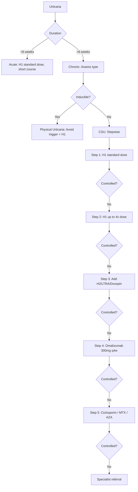

# Urticaria and Angioedema Hub

---
tags: [medicine, dermatology, topic-group-hub, scaffold-hub]
davidson_part: Part 3: Clinical Medicine
davidson_chapter: Chapter 29: Dermatology
heading: Urticaria, Erythema & Purpura
topic_group: Urticaria & Angioedema
topic:
status: full-fcps-mrcp-hub
priority: critical
created: 2026-06-15
modified: 2026-06-15
exam_relevance: [FCPS, MRCP Part 1, MRCP Part 2, PACES]
see_also:
  - "[[Urticaria Erythema Purpura Hub]]"
  - "[[Dermatology MOC]]"
---

# Urticaria & Angioedema Hub

> [!info]
> **Topic Group 3.1** | **7 Disease Topics** | **Priority: CRITICAL**

---

## Disease Topics in this Group

| # | Topic | Status | Priority |
|---|-------|--------|----------|
| 1 | Acute spontaneous urticaria | 🔴 scaffold | High |
| 2 | Chronic spontaneous urticaria | 🔴 scaffold | Critical |
| 3 | Chronic inducible urticarias (physical urticarias) | 🔴 scaffold | High |
| 4 | Urticarial vasculitis | 🔴 scaffold | High |
| 5 | Hereditary angioedema (C1-INH deficiency) | 🔴 scaffold | Critical |
| 6 | ACE inhibitor angioedema | 🔴 scaffold | High |
| 7 | Brute force urticaria approach | 🔴 scaffold | High |

---

## High-Yield Summary

| Type | Duration | Key Features | Pathophysiology | 1st Line | Biologic |
|------|----------|--------------|-----------------|----------|----------|
| **Acute Spontaneous** | <6 weeks | Wheals ± angioedema, often viral/post-infectious | Histamine release, mast cell degranulation | H1 antihistamine | - |
| **Chronic Spontaneous (CSU)** | >6 weeks | Daily/near-daily wheals, autoimmunity (anti-FcεRI, anti-IgE) | Autoimmune (Type IIb), unknown | H1 → 4x dose → Omalizumab | **Omalizumab** (anti-IgE) |
| **Physical Urticarias** | Inducible | Dermographism, cold, heat, solar, pressure, vibration, cholinergic | Specific trigger → mast cell activation | Avoid trigger + H1 | Omalizumab (refractory) |
| **Urticarial Vasculitis** | >24h lesions, purpuric, burning, systemic | Complement consumption (low C3/C4), hypocomplementaemic | Immune complex, C1q autoantibody | H1 → Dapsone → HCQ → Immunosuppress | - |
| **Hereditary Angioedema (HAE)** | Recurrent, non-pruritic, no urticaria, family history | **C4 low, C1-INH low/non-functional** (Type I/II) or **normal C1-INH** (Type III) | Bradykinin-mediated (C1-INH deficiency) | **C1-INH concentrate, Icatibant, Lanadelumab** (prophylaxis) | Lanadelumab (prophylaxis) |
| **ACEi Angioedema** | Months-years on ACEi, non-pruritic, tongue/lips/bowel | Bradykinin accumulation (ACE degrades bradykinin) | **Stop ACEi** (switch ARB), Icatibant if severe | Icatibant, C1-INH |

---

## Key Algorithms

### Urticaria Stepwise Management (EAACI/GA²LEN)


### Angioedema Differential
```mermaid
flowchart TD
    A[Angioedema] --> B{Urticaria present?}
    B -->|Yes| C[Histaminergic: CSU, Acute, Allergic]
    B -->|No (isolated)| D{ACEi?}
    D -->|Yes| E[ACE Inhibitor Angioedema: Bradykinin, Stop ACEi]
    D -->|No| F{Family History?}
    F -->|Yes| G[Hereditary Angioedema: C4 low, C1-INH level/function]
    F -->|No| H[Acquired C1-INH Deficiency: Lymphoproliferative, C4 low, C1-INH low]
    F -->|No| I[Idiopathic Non-Histaminergic: Trial H1 → Icatibant/C1-INH]
```

---

## FCPS/MRCP Viva Topics

1. **Urticaria classification** - spontaneous vs inducible, acute (<6w) vs chronic (>6w)
2. **Stepwise management (EAACI)** - H1 → 4x H1 → add H2/LTRA/doxepin → omalizumab → ciclosporin
3. **Chronic Spontaneous Urticaria** - autoimmune (anti-FcεRI, anti-IgE), autologous serum skin test (ASST), omalizumab 300mg q4w
4. **Physical urticarias** - dermographism (stroking), cold (ice cube test), heat, solar, delayed pressure, vibratory, cholinergic (sweat)
5. **Urticarial vasculitis** - lesions >24h, purpuric, burning not itch, low C3/C4, hypocomplementaemic (anti-C1q), systemic (lupus, hepatitis)
6. **Hereditary Angioedema** - C1-INH deficiency (Type I low, Type II dysfunctional, Type III normal), C4 **always low**, bradykinin-mediated, **no urticaria**, prophylaxis lanadelumab
7. **ACE inhibitor angioedema** - bradykinin accumulation, onset months-years, **switch to ARB**, icatibant/C1-INH for acute attacks
8. **Urticaria activity score (UAS7)** - daily wheals + itch score ×7 days, UAS7 ≥28 = severe
9. **Omalizumab** - anti-IgE, 300mg SC q4w, monitor for anaphylaxis, parasite risk in endemic areas
10. **Differential of angioedema without urticaria** - HAE, ACEi, acquired C1-INH deficiency, idiopathic non-histaminergic

---

## Mnemonics

- **Urticaria types:** `SPIN` = **S**pontaneous (acute/chronic), **P**hysical (inducible), **I**nducible, **N**... (autoimmune)
- **Physical urticarias:** `COLD HEAT PRESS SOLAR VIBE CHOLIN` = **C**old, **H**eat, **P**ressure (delayed), **S**olar, **VI**bratory, **CHOLIN**ergic
- **HAE types:** `HAE 1-2-3` = **Type I**: C1-INH low (85%), **Type II**: C1-INH dysfunctional (15%), **Type III**: C1-INH normal (FXII mutation, oestrogen-related)
- **Angioedema algorithm:** `ACEi STOP` = **ACEi** angioedema → **S**TOP ACEi, **T**rial ARB, **O**malizumab? No - **P**rotocol: Icatibant/C1-INH

---

## Linkage

- **Parent Hub:** [[Urticaria Erythema Purpura Hub]]
- **MOC:** [[Dermatology MOC]]
- **Disease Topics:** See individual files in `03_Urticaria_Erythema_Purpura/`

---

## Progress
- [ ] Acute spontaneous urticaria (scaffold → full)
- [ ] Chronic spontaneous urticaria (scaffold → full)
- [ ] Chronic inducible urticarias (scaffold → full)
- [ ] Urticarial vasculitis (scaffold → full)
- [ ] Hereditary angioedema (scaffold → full)
- [ ] ACE inhibitor angioedema (scaffold → full)
- [ ] Brute force urticaria approach (scaffold → full)