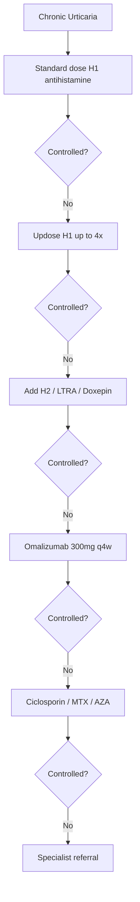
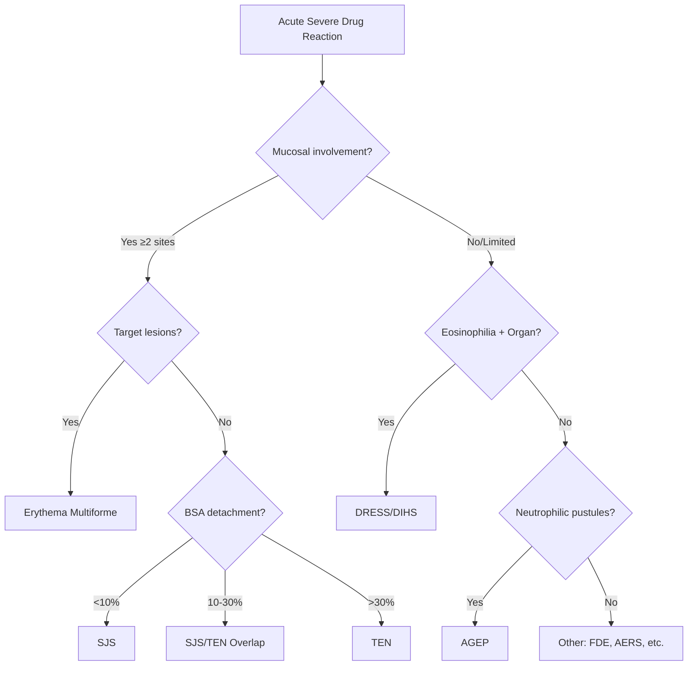

# Urticaria Erythema Purpura Hub

---
tags: [medicine, dermatology, heading-hub, scaffold-hub]
davidson_part: Part 3: Clinical Medicine
davidson_chapter: Chapter 29: Dermatology
heading: Urticaria, Erythema & Purpura
topic_group:
topic:
status: full-fcps-mrcp-hub
priority: critical
created: 2026-06-15
modified: 2026-06-15
exam_relevance: [FCPS, MRCP Part 1, MRCP Part 2, PACES]
see_also:
  - "[[Dermatology MOC]]"
  - "[[Davidson Chapter 29 - Dermatology Hierarchy]]"
  - "[[../02_Papulosquamous_Eczematous/Papulosquamous and Eczematous Hub]]"
---

# Urticaria, Erythema & Purpura Hub

> [!info]
> **Davidson Ch29 Section 3** | **4 Topic Groups, 16 Disease Topics** | **Priority: CRITICAL**

---

## Topic Groups in this Section

| # | Topic Group | Disease Topics | Status |
|---|-------------|----------------|--------|
| 3.1 | Urticaria & Angioedema | 7 | 🔴 scaffold |
| 3.2 | Erythema Multiforme, SJS & TEN | 6 | 🔴 scaffold |
| 3.3 | Figurate Erythemas | 4 | 🔴 scaffold |
| 3.4 | Purpura & Vasculitis | 8 | 🔴 scaffold |

---

## High-Yield Summary Table

| Disease | Key Clinical | Key Investigation | First-Line Management | Red Flag |
|---------|--------------|-------------------|----------------------|----------|
| **Chronic spontaneous urticaria** | Wheals >6w, daily/near daily | Clinical, exclude trigger | H1 antihistamine → ↑dose → omalizumab | Angioedema airway |
| **Hereditary angioedema** | Recurrent non-pruritic swelling, +ve family, C4 low | C4, C1-INH level/function | C1-INH concentrate, icatibant, lanadelumab | Laryngeal oedema |
| **SJS/TEN** | Target lesions → blisters → necrosis, mucosal ≥2 sites, SCORTEN | Clinical, biopsy (full thickness), SCORTEN | STOP culprit drug, ICU supportive, consider IVIG/ciclosporin | BSA >30% = TEN, mortality |
| **DRESS** | Fever, rash, eosinophilia, organ involvement, latency 2-6w | RegiSCAR ≥5, eosinophils >1.5, LFTs | STOP drug, systemic steroids, monitor organs | Hepatic failure, myocarditis |
| **IgA vasculitis (HSP)** | Palpable purpura (legs/buttocks), abdominal pain, arthritis, renal | Clinical, urine ACR, biopsy (IgA deposits) | Supportive, steroids if renal/gi | Renal impairment |
| **ANCA vasculitis** | Purpura + systemic (renal, lung, ENT, nerves) | ANCA (c-ANCA/PR3, p-ANCA/MPO), biopsy | Induction: CYC + steroids / RTX + steroids | RPGN, alveolar haemorrhage |

---

## Key Algorithms

### Urticaria Stepwise Management (EAACI/GA²LEN)


### SJS/TEN/DRESS/AGEP Differentiation


### Palpable Purpura Approach
```mermaid
flowchart TD
    A[Palpable Purpura] --> B{Systemic features?}
    B -->|No (isolated cutaneous)| C[Skin biopsy → IgA vasculitis vs Cryoglobulinaemic vs ANCA]
    B -->|Yes| D[Urgent: FBC, U&E, LFT, CRP, Urine ACR, ANCA, Cryoglobulins, C3/C4, ANA, Biopsy]
    D --> E{ANCA +ve?}
    E -->|c-ANCA/PR3| F[GPA]
    E -->|p-ANCA/MPO| G[MPA/EGPA]
    E -->|Negative| H{IgA deposits?}
    H -->|Yes| I[IgA Vasculitis HSP]
    H -->|No| J[Cryoglobulinaemic / Other]
```

---

## FCPS/MRCP Viva Topics (High-Yield)

1. **Urticaria classification** - spontaneous vs inducible, acute vs chronic
2. **Stepwise management** - H1 → ↑dose → add-on → omalizumab → ciclosporin
3. **Hereditary angioedema** - C1-INH deficiency, types I/II/III, acute vs prophylaxis
4. **SJS vs TEN vs overlap** - BSA detachment % is key, SCORTEN mortality
5. **SCORTEN** - 7 variables, each 1 point, ≥3 = >35% mortality
6. **DRESS vs AGEP** - RegiSCAR vs EUROSCAR, eosinophilia vs neutrophilic pustules
7. **Palpable purpura DDx** - IgA vasculitis, ANCA vasculitis, cryoglobulinaemia, infection
8. **ANCA patterns** - c-ANCA/PR3=GPA, p-ANCA/MPO=MPA/EGPA
9. **IgA vasculitis (HSP)** - tetrad, renal biopsy IgA, long-term urinary monitoring
10. **Figurate erythemas** - EM minor/major, SJS, EM-like in mycoplasma, urticarial vasculitis

---

## Mnemonics

- **SCORTEN (SJS/TEN):** `SCORTEN` = **S**evere malignancy, **C**ardiac disease, **O**lder >40, **R**ate BSA >10%, **T**achycardia >120, **E**pidermal detachment >10%, **N** urea >10mmol/L
- **RegiSCAR (DRESS):** `RegiSCAR` = **R**ash, **E**osinophilia, **G**lycemia (no), **I**nterstitial (no), **S**ystemic (organ), **C**ytopenia, **A**NA (no), **R**esponse (no) — *Use actual criteria: Fever >38, Lymphadenopathy, Eosinophilia, Atypical lymphs, Organ involvement, Skin biopsy, Resolution >15d, Exclusion*
- **EUROSCAR (AGEP):** `EUROSCAR` = **E**xtensive pustules, **U**rticaria (no), **R**apid onset <4d, **O**rgan (no), **S**terile pustules, **C**onfirmed biopsy, **A**NI, **R**esolution <15d — *Use actual: Acute onset, Generalised pustules, Neutrophilia, Histology, Resolution <15d, Skin biopsy, Exclusion*
- **IgA Vasculitis (HSP) Tetrad:** `PARK` = **P**urpura (palpable, legs), **A**bdominal pain, **R**enal (haematuria/proteinuria), **K**nees/ankles arthritis

---

## Quick Revision Card

| Condition | Key Feature | Severity Score | 1st Line | Emergency |
|-----------|-------------|----------------|----------|-----------|
| **CSU** | Wheals >6w | UAS7 | H1 → 4x → omalizumab | Angioedema |
| **HAE** | C4 low, C1-INH low | - | C1-INH conc, icatibant | Airway |
| **SJS/TEN** | Target → necrosis, mucosa | SCORTEN | STOP drug, supportive | BSA >30% |
| **DRESS** | Fever, eosinophilia, organ | RegiSCAR | STOP drug, prednisolone | Hepatic |
| **AGEP** | Pustules, neutrophilia | EUROSCAR | STOP drug, supportive | Rare |
| **IgA Vasculitis** | Purpura + GI/Renal/Arthro | - | Supportive, steroids if renal | RPGN |
| **ANCA Vasculitis** | Purpura + systemic | BVAS | CYC/RTX + steroids | RPGN, DAH |

---

## Linkage

- **MOC:** [[Dermatology MOC]]
- **Hierarchy:** [[Davidson Chapter 29 - Dermatology Hierarchy]]
- **Section Dir:** `03_Urticaria_Erythema_Purpura/`
- **Previous Hub:** [[../02_Papulosquamous_Eczematous/Papulosquamous and Eczematous Hub]]
- **Next Hub:** [[../04_Vesiculobullous/Vesiculobullous Hub]]

---

## Progress
- [ ] 3.1 Urticaria & Angioedema Hub (scaffold-hub)
- [ ] 3.2 EM/SJS/TEN Hub (scaffold-hub)
- [ ] 3.3 Figurate Erythemas Hub (scaffold-hub)
- [ ] 3.4 Purpura & Vasculitis Hub (scaffold-hub)
- [ ] 16 Disease Topics (scaffold → full-fcps-mrcp-note)