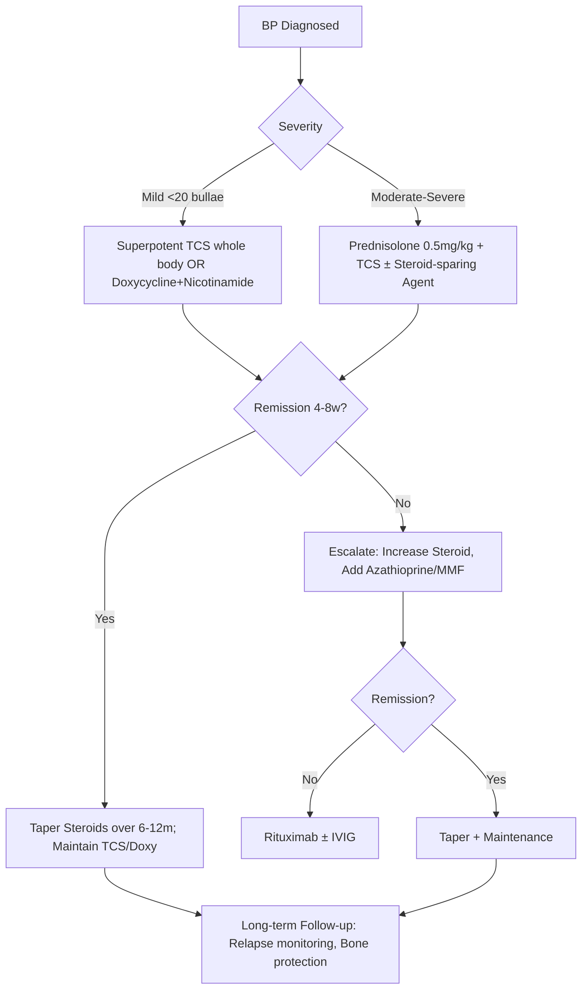
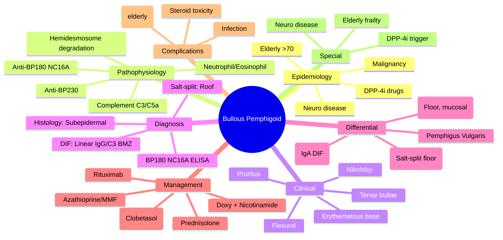

---

tags: [medicine, dermatology, davidson, bullous pemphigoid, fcps, mrcp]
davidson_part: Part 3: Clinical Medicine
davidson_chapter: Chapter 29: Dermatology
heading: Vesiculobullous Disorders
topic_group: Autoimmune Bullous Diseases
topic: Bullous Pemphigoid
status: full-fcps-mrcp-note
priority: critical
cards: 25
created: 2026-06-15
modified: 2026-06-15
exam_relevance: [FCPS, MRCP Part 1, MRCP Part 2, PACES]
see_also:
  - "[[Pemphigus Vulgaris]]"
  - "[[Vesiculobullous Hub]]"
  - "[[Dermatology MOC]]"
  - "[[Linear IgA Disease]]"
  - "[[Epidermolysis Bullosa Acquisita]]"
  - "[[Mucous Membrane Pemphigoid]]"
---

## Definition

Bullous pemphigoid (BP) is the most common autoimmune bullous disease, affecting elderly (>70 years), with subepidermal blistering from autoantibodies against BP180 (collagen XVII) and BP230 (hemidesmosomal proteins) at the basement membrane zone. Tense bullae on normal/erythematous skin, often with urticarial/eczematous prodrome. Mucosal involvement uncommon (10-30%, mild). Associated with neurological disease (Parkinson's, dementia, stroke), drugs (diuretics, DPP-4 inhibitors, penicillins, vaccines), and malignancy (controversial). Mortality 10-30% (elderly, comorbidity). Treatment: topical clobetasol first-line (BLISTER trial), systemic steroids, steroid-sparing agents (azathioprine, doxycycline, MMF, methotrexate), rituximab, dupilumab, IVIG.

## Clinical Features and Presentation

Clinical presentation: Tense bullae (0.5-3 cm) on normal or erythematous/urticarial skin, often with clear or haemorrhagic fluid. Prodrome (pruritic urticarial/eczematous patch for weeks-months) common. Distribution: trunk, flexures, intertriginous; mucosa 10-30% (mild oral). Nikolsky sign typically negative (vs pemphigus). Older patients (>70). May be associated with neurological disease, drugs. Severity: BPDAI (Bullous Pemphigoid Disease Area Index).


# Bullous Pemphigoid

Related: [[Pemphigus Vulgaris]], [[Linear IgA Disease]], [[Epidermolysis Bullosa Acquisita]], [[Mucous Membrane Pemphigoid]], [[Drug-Induced Bullous Disorders]], [[Dermatitis Herpetiformis]]

> [!tip]
> Most common autoimmune bullous disease in the elderly. Subepidermal blister, tense bullae, negative Nikolsky sign. Anti-BP180/BP230 antibodies. First-line: doxycycline/nicotinamide or potent topical steroids.

---

## Learning Objectives
- [ ] Define bullous pemphigoid and describe epidemiology
- [ ] Explain pathophysiology: anti-BP180/BP230 antibodies targeting hemidesmosomes
- [ ] Describe clinical features: tense bullae on erythematous/urticarial base, elderly, pruritus
- [ ] Apply diagnostic criteria and investigations (DIF, IIF, ELISA)
- [ ] Differentiate from pemphigus vulgaris, linear IgA disease, EBA, drug-induced pemphigoid
- [ ] Outline management algorithm (potent TCS first-line, doxycycline, systemic steroids, rituximab)
- [ ] Identify complications and monitoring requirements
- [ ] Recall FCPS/MRCP high-yield facts: DIF linear BMZ, salt-split roof, BP180/230 ELISA
- [ ] Answer viva questions on Nikolsky sign, DIF patterns, treatment sequencing
- [ ] Apply mnemonics for BP vs pemphigus, DIF patterns, salt-split

---

## 1. Definition / Epidemiology / Classification

### Definition
Bullous pemphigoid (BP) is a chronic autoimmune subepidermal blistering disease characterised by autoantibodies (predominantly IgG) targeting the hemidesmosomal proteins BP180 (type XVII collagen) and BP230, resulting in complement-mediated inflammation and subepidermal blister formation.

### Epidemiology
- **Incidence:** 7-43 per million per year (increasing with ageing population)
- **Age:** Predominantly >70 years (peak 80s); rare <50 years
- **Sex:** Slight female predominance (1.5:1)
- **Risk factors:** Neurological disease (dementia, Parkinson's, stroke), psoriasis (biologics), malignancy, drugs (DPP-4 inhibitors, loop diuretics, penicillin, sulfas)
- **Mortality:** 2-3x age-matched controls (sepsis, cardiovascular, steroid complications); 1-year mortality ~30% in elderly

### Classification
| Variant | Features |
|---------|----------|
| **Classic (Generalised)** | Tense bullae on erythematous/urticarial base, widespread |
| **Localised (Vesicular)** | Limited to one area, often legs |
| **Erythrodermic** | Generalised erythroderma with few bullae, mimics erythroderma |
| **Nodular (Prurigo)** | Pruritic nodules, minimal bullae |
| **Infantile** | <1 year, acral distribution, self-limiting |
| **Drug-induced** | DPP-4 inhibitors, loop diuretics, NSAIDs, penicillamine, TNF-α inhibitors |

---

## 2. Aetiology / Pathophysiology

### Aetiology
- **Autoimmunity:** Loss of tolerance to hemidesmosomal proteins
- **Genetic:** HLA-DQB1*03:01 (strongest association), HLA-DRB1*04, HLA-DQB1*03:02
- **Drug triggers:** DPP-4 inhibitors (linagliptin, vildagliptin, sitagliptin), loop diuretics (furosemide), ACE inhibitors, penicillamine, TNF-α inhibitors, IL-17/23 inhibitors
- **Neurological association:** Dementia, Parkinson's, stroke, MS (possible epitope spreading)

### Pathophysiology
```mermaid
flowchart TD
    A[Autoantibodies: Anti-BP180 (NC16A domain) & Anti-BP230] --> B[Binding to Hemidesmosomes at Basement Membrane Zone]
    B --> C[Complement Activation (C3, C5a)]
    C --> D[Neutrophil & Eosinophil Recruitment]
    D --> E[Release of Proteases (MMP-9, Elastase), ROS]
    E --> F[Degradation of BP180/BP230, Hemidesmosome Disassembly]
    F --> G[Subepidermal Split → Blister Formation]
    G --> H[Clinical Bullous Pemphigoid]
    
    A -.-> I[Epitope Spreading: Initial anti-NC16A → spreading to other domains]
    J[Drug Exposure] -.-> K[Drug acts as hapten or alters BP180 conformation] --> A
```

### Key Target Antigens
| Antigen | Location | Function | Antibody Target |
|---------|----------|----------|-----------------|
| **BP180 (COL17A1)** | Hemidesmosome transmembrane protein | Anchors keratin filaments to BMZ | **NC16A domain** (immunodominant), C-terminal |
| **BP230 (DST)** | Intracellular hemidesmosome plaque | Links BP180 to keratin intermediate filaments | C-terminal domain |

---

## 3. Clinical Features

### History
- **Pruritus:** Often precedes bullae by weeks-months (prodromal phase)
- **Age:** >70 years typical
- **Drug history:** Review for DPP-4 inhibitors, furosemide, penicillamine, biologics
- **Neurological history:** Dementia, Parkinson's, stroke
- **Malignancy:** Age-appropriate screening

### Examination
| Feature | Description |
|---------|-------------|
| **Primary lesion** | Tense bullae (1-4 cm) on erythematous or urticarial base |
| **Distribution** | Flexural (axillae, groin), abdomen, trunk, limbs; spares face/neck usually |
| **Mucosal involvement** | 10-20% (oral > genital), usually mild, non-scarring |
| **Nikolsky sign** | **Negative** (blisters intact, no epidermal shearing) |
| **Asboe-Hansen sign** | Positive (pressure on bulla extends it peripherally) |
| **Pruritus** | Intense, often severe, sleep disturbance |

### Prodromal Phase
- Weeks to months of pruritus, eczematous/urticarial plaques **before** bullae appear
- Often misdiagnosed as eczema, drug eruption, scabies

### Associated Findings
- **Eosinophilia:** Peripheral blood eosinophilia common (10-30%)
- **IgE:** Elevated total IgE, eosinophil cationic protein
- **Comorbidities:** Neurological disease, psoriasis, malignancy, diabetes

---

## 4. Diagnostic Approach / Algorithm

```mermaid
flowchart TD
    A[Elderly with Tense Bullae + Pruritus] --> B[Clinical Suspicion: BP]
    B --> C[Biopsy: H&E + DIF (Perilesional Skin)]
    C --> D{DIF: Linear IgG/C3 at BMZ?}
    D -->|Yes| E[Salt-Split Skin IIF]
    E --> F{Antibody Binding: Roof (Epidermal)?}
    F -->|Yes| G[Bullous Pemphigoid / Pemphigoid Gestationis]
    F -->|No (Floor/Dermal)| H[EBA / MMP (some)]
    D -->|No| I[Consider: Linear IgA, DH, Drug-Induced, Pemphigus]
    G --> J[BP180/BP230 ELISA for Confirmation]
    J --> K[Diagnosis Confirmed]
```

### Diagnostic Criteria (Consensus)
**Major criteria:**
1. Pruritus and/or skin lesions (urticarial plaques, tense bullae)
2. Linear IgG and/or C3 along BMZ on DIF
3. Anti-BP180 NC16A antibodies positive (ELISA)

**Minor criteria:**
1. Subepidermal blister on histology
2. No mucosal involvement or mild
3. Age >70 years
3. Eosinophilia

**Definite BP:** 2 major + 1 minor OR 3 major

---

## 5. Investigations

### First-Line
| Investigation | Indication | Expected Finding |
|---------------|------------|------------------|
| **Skin biopsy (H&E)** | Confirm subepidermal blister | Subepidermal blister, eosinophilic infiltrate, papillary dermal oedema |
| **DIF (Direct Immunofluorescence)** | **Gold standard** | **Linear IgG and/or C3 along BMZ** (perilesional skin, not bulla roof) |
| **BP180 NC16A ELISA** | Confirmation, monitoring | Positive in 80-90% (sensitivity 89%, specificity 98%) |
| **BP230 ELISA** | Confirmation, monitoring | Positive in 60-70% |
| **FBC, U&E, LFT** | Baseline for treatment | Eosinophilia (supportive) |

### Second-Line / Specialised
| Investigation | Indication | Interpretation |
|---------------|------------|----------------|
| **IIF (Salt-split skin)** | Differentiate BP vs EBA | **Roof (epidermal side)** = BP; **Floor (dermal side)** = EBA |
| **IIF (Monkey oesophagus)** | Screen circulating antibodies | Linear BMZ (vs intercellular in pemphigus) |
| **Total IgE / Eosinophils** | Supportive | Elevated IgE, eosinophilia |
| **HLA typing** | Research | HLA-DQB1*03:01 |

### Biopsy Clues (Histopathology)
| Feature | Finding |
|---------|---------|
| **Epidermis** | Intact over bulla roof |
| **Blister level** | Subepidermal (lamina lucida) |
| **Infiltrate** | Eosinophils ± neutrophils, papillary dermal oedema |
| **Special stains** | PAS-negative (vs fungi) |

### DIF/IIF Patterns - CRITICAL FOR VIVA
| Condition | DIF | Salt-Split IIF | IIF (Monkey Oesophagus) |
|-----------|-----|----------------|-------------------------|
| **Bullous Pemphigoid** | **Linear IgG/C3 BMZ** | **Roof (epidermal)** | Linear BMZ |
| **Pemphigus Vulgaris** | IgG intercellular (fishnet) | N/A | Intercellular (fishnet) |
| **Epidermolysis Bullosa Acquisita** | Linear IgG BMZ | **Floor (dermal)** | Linear BMZ |
| **Mucous Membrane Pemphigoid** | Linear IgG/C3 BMZ | Floor (mostly) | Linear BMZ |
| **Linear IgA Disease** | Linear IgA BMZ | Variable | Linear IgA BMZ |
| **Dermatitis Herpetiformis** | IgA granular papillary dermis | N/A | Negative |

---

## 6. Differential Diagnosis

| Differential | Distinguishing Features | Key Test |
|--------------|------------------------|----------|
| **Pemphigus Vulgaris** | Flaccid bullae, +ve Nikolsky, mucosal dominant, acantholysis | DIF: IgG intercellular; Anti-Dsg3 ELISA |
| **Linear IgA Disease** | Younger, annular "string of pearls", IgA linear BMZ | DIF: Linear IgA; Dapsone responsive |
| **Epidermolysis Bullosa Acquisita** | Mechanobullous, trauma sites, scarring, milia | **Salt-split: Floor**; Anti-type VII collagen |
| **Mucous Membrane Pemphigoid** | Mucosal dominant (ocular, oral), scarring, anti-laminin-332 | DIF: Linear IgG/C3; Salt-split: Floor; Anti-laminin-332 |
| **Dermatitis Herpetiformis** | Intensely pruritic papules/vesicles, elbows/knees, gluten-sensitive | DIF: IgA granular papillary; Anti-tTG2/3 |
| **Drug-Induced Pemphigoid** | Drug trigger (DPP-4i, furosemide), identical features | Drug history, resolves on withdrawal |
| **Pemphigoid Gestationis** | Pregnancy/postpartum, C3 linear BMZ, anti-BP180 NC16A | Pregnancy, fetal risk, C3 DIF |
| **Bullous Lupus/Erythematosus** | SLE context, anti-type VII collagen, neutrophilic infiltrate | SLE serology, anti-type VII collagen |

---

## 7. Management

### General Measures
- Wound care: Non-adherent dressings, silver, avoid trauma
- Skin care: Emollients, soap substitutes
- Treat pruritus: Sedating antihistamines, gabapentin if neuropathic
- Nutritional support: High protein, vitamin D, calcium
- Vaccinations: Influenza, pneumococcal, COVID, shingles (before immunosuppression)

### First-Line (Mild-Moderate: <20 bullae, limited BSA)
| Agent | Dose/Regimen | Duration | Monitoring |
|-------|-------------|----------|------------|
| **Potent/Superpotent TCS** (Clobetasol 0.05%, Betamethasone dipropionate 0.05%) | Whole body daily (up to 30-40g/day) | 4-8 weeks, then taper | Skin atrophy, HPA axis (rare with short-term) |
| **Doxycycline + Nicotinamide** | Doxycycline 100mg BD + Nicotinamide 500mg TDS | 6-12 weeks | GI upset, photosensitivity |

> **Evidence:** BLISTER trial (Lancet 2017) - Doxycycline non-inferior to prednisolone for remission at 6 weeks, fewer severe adverse events. TCS (EG: Clobetasol) also effective (Joly et al., NEJM 2002).

### Systemic Therapy (Moderate-Severe: >20 bullae, extensive BSA, failing TCS)
| Agent | Dose | Duration | Monitoring |
|-------|------|----------|------------|
| **Oral Prednisolone** | 0.5-0.75 mg/kg/day (max 50-60mg) | Taper over 6-12 months | BP, glucose, bone, eyes, infection, HPA axis |
| **Doxycycline + Nicotinamide** | 100mg BD + 500mg TDS | 3-6 months | GI, photosensitivity |
| **Azathioprine** | 1-3 mg/kg/day (TPMT test) | 12-18 months | FBC, LFT (q1-3m), TPMT |
| **Mycophenolate Mofetil** | 1-2 g/day | 12-18 months | FBC, LFT, U&E |
| **Methotrexate** | 7.5-15 mg/week + Folate | 12-18 months | FBC, LFT, CXR baseline |
| **Dapsone** | 50-150mg/day (G6PD test) | 6-12 months | FBC, methaemoglobin, neuropathy |

### Biologics / Targeted Therapy (Refractory, Relapsing, Contraindications to Conventional)
| Agent | Indication | Dose | Evidence |
|-------|------------|------|----------|
| **Rituximab** | Refractory, relapsing, steroid-sparing | 375mg/m² weekly ×4 OR 1g ×2 (2 weeks apart) | Case series, RCT ongoing; rapid remission, steroid-sparing |
| **Omalizumab** | Refractory, IgE-mediated | 300mg q2-4wk SC | Case reports, anti-IgE |
| **Dupilumab** | Refractory, eosinophilic | 600mg → 300mg q2wk | Case reports, anti-IL-4Rα |
| **IVIG** | Refractory, rapid control needed | 2g/kg over 2-5 days | Adjunct, short-term |

### Management Algorithm


### Treatment of Specific Variants
| Variant | First-line | Second-line |
|---------|------------|-------------|
| **Classic** | TCS or Prednisolone + TCS | Azathioprine/MMF/Rituximab |
| **Erythrodermic** | Prednisolone IV/PO + TCS | Rituximab, IVIG |
| **Drug-Induced** | **STOP drug** + TCS/Doxy | Prednisolone if extensive |
| **Infantile** | Mild TCS, observation | Rarely systemic needed |
| **Mucosal Dominant** | Dapsone, Prednisolone, Rituximab | MMF, IVIG |

---

## 8. Drug Interactions / Contraindications / Comorbidity Cautions

| Drug/Condition | Interaction / Caution | Management |
|----------------|----------------------|------------|
| **Prednisolone + NSAIDs** | GI ulceration | PPI prophylaxis |
| **Prednisolone + Anticoagulants** | Altered INR | Monitor INR |
| **Azathioprine + Allopurinol** | Severe myelosuppression | **Reduce azathioprine to 25% dose** |
| **Azathioprine + Warfarin** | Reduced anticoagulation | Monitor INR |
| **Dapsone + Rifampicin** | Reduced dapsone levels | Monitor, adjust dose |
| **Rituximab + Live Vaccines** | Infection risk | **Give live vaccines ≥4w before** |
| **Rituximab + Hepatitis B** | HBV reactivation | Screen HBsAg/HBcAb; prophylaxis if +ve |
| **DPP-4 Inhibitors** | Trigger for BP | **Stop DPP-4i**; switch to alternative |
| **Osteoporosis** | Steroid-induced | Calcium, Vitamin D, Bisphosphonate (oral/IV) |
| **Diabetes** | Steroid-induced hyperglycaemia | Monitor glucose, adjust hypoglycaemics |
| **Elderly/Frail** | Falls, fractures, infection | Minimise steroids, use TCS/Doxy first-line |

---

## 9. Procedures (if applicable)

### Procedure: Skin Biopsy (Punch 4mm)
- **Indications:** Diagnostic confirmation, rule out mimics
- **Contraindications:** Anticoagulation (relative), local infection
- **Preparation:** Local anaesthetic (lidocaine 1% ± adrenaline), clean site
- **Complications:** Bleeding, infection, scarring, nerve damage
- **Viva Pearls:** H&E for histology; **DIF = perilesional normal skin in Michel's transport**; salt-split for IIF

---

## 10. Complications

| Complication | Frequency | Management |
|--------------|-----------|------------|
| **Secondary Infection** (S. aureus, sepsis) | Common | Topical/systemic antibiotics, wound care |
| **Steroid Side Effects** (HTN, DM, osteoporosis, cataract, glaucoma) | Dose-dependent | Prophylaxis, minimise dose, steroid-sparing agents |
| **Immunosuppression** (opportunistic infections, malignancy) | With systemic therapy | Vaccinations, screening, monitoring |
| **Mucosal Scarring** (oral, ocular, genital) | Rare in BP | Ophthalmology refer if ocular |
| **Nutritional Deficiencies** | Chronic disease | Supplements, dietitian |
| **Mortality** | ~30% at 1 year (elderly) | Comorbidity management, infection control |

---

## 11. Red Flags / Emergencies

| Red Flag | Immediate Action |
|----------|------------------|
| **Sepsis** (fever, hypotension, confusion) | Blood cultures, IV fluids, broad-spectrum IV antibiotics, ICU |
| **Massive Bullae + Fluid Loss** | Burns unit referral, fluid resuscitation, electrolyte replacement |
| **Ocular Involvement** (corneal ulcer, symblepharon) | **Urgent ophthalmology**, lubricants, amniotic membrane |
| **Upper GI Bleed** (steroid + NSAID) | PPI, endoscopy, transfusion if needed |
| **Severe Hypokalaemia/Hyperglycaemia** | Correct electrolytes, insulin sliding scale |

---

## 12. Prognosis

| Factor | Good Prognosis | Poor Prognosis |
|--------|----------------|----------------|
| **Age** | <70 years | >80 years |
| **Extent** | Localised | Generalised/erythrodermic |
| **Mucosal Involvement** | None | Present |
| **Response to TCS/Doxy** | Rapid remission | Refractory |
| **Comorbidities** | None | Dementia, malignancy, frailty |

- **Natural history:** Chronic relapsing; remission rate 50-70% at 1 year; median remission time 6 months
- **Relapse:** 30-50% after stopping treatment; often within 3-6 months of taper
- **Mortality:** 2-3x age-matched; mainly sepsis, cardiovascular, steroid complications

---

## 13. Topic Correlation

| Related Topic | Link | Key Overlap |
|---------------|------|-------------|
| **Pemphigus Vulgaris** | [[Pemphigus Vulgaris]] | DIF patterns, Nikolsky, anti-desmoglein vs anti-BP180 |
| **Linear IgA Disease** | [[Linear IgA Disease]] | DIF IgA vs IgG, dapsone response, annular lesions |
| **Epidermolysis Bullosa Acquisita** | [[Epidermolysis Bullosa Acquisita]] | Salt-split floor vs roof, anti-type VII collagen |
| **Mucous Membrane Pemphigoid** | [[Mucous Membrane Pemphigoid]] | Mucosal dominance, scarring, anti-laminin-332 |
| **Drug-Induced Bullous** | [[Drug-Induced Bullous Disorders]] | DPP-4 inhibitors, furosemide, resolves on withdrawal |
| **Pemphigoid Gestationis** | [[Pemphigoid Gestationis]] | Pregnancy, C3 linear BMZ, fetal risk |

---

## 14. Special Situations

| Situation | Consideration |
|-----------|---------------|
| **Pregnancy** | Pemphigoid gestationis distinct; BP rare in pregnancy; TCS safe, prednisolone cautious |
| **Lactation** | TCS, prednisolone (low dose), dapsone (avoid if G6PD deficient infant) |
| **Paediatric** | Infantile BP: self-limiting, TCS, rare systemic needed |
| **Renal Impairment** | Azathioprine/MMF dose adjust; dapsone caution; prednisolone OK |
| **Hepatic Impairment** | Azathioprine/MMF caution; methotrexate avoid; prednisolone OK |
| **Elderly/Frail** | **First-line TCS/Doxy (BLISTER trial)**; minimise steroids; bone protection; falls risk |
| **HIV/Immunocompromised** | Rituximab preferred over conventional immunosuppressants; screen infections |
| **Malignancy** | Rituximab preferred; age-appropriate screening; stop DPP-4i if on |

---

## FCPS/MRCP High-Yield Summary

| Category | Key Points |
|----------|------------|
| **Definition** | Subepidermal autoimmune blistering; anti-BP180/BP230 IgG; tense bullae, elderly |
| **Epidemiology** | >70 years, increasing incidence, neuro disease association, DPP-4i trigger |
| **Pathophysiology** | Anti-BP180 NC16A → complement → neutrophils/eosinophils → hemidesmosome degradation |
| **Clinical** | Pruritic tense bullae on erythematous/urticarial base, flexural, Nikolsky− |
| **Diagnosis** | DIF: Linear IgG/C3 BMZ; Salt-split: Roof; BP180 NC16A ELISA (+ve 80-90%) |
| **Differential** | Pemphigus (flaccid, Nikolsky+, intercellular DIF), EBA (salt-split floor), Linear IgA (IgA DIF) |
| **Management** | **1st: Superpotent TCS OR Doxycycline+Nicotinamide**; 2nd: Prednisolone + Azathioprine/MMF; 3rd: Rituximab |
| **BLISTER Trial** | Doxycycline non-inferior to prednisolone, fewer severe AEs |
| **Complications** | Infection, steroid toxicity, mortality 30% at 1yr (comorbidity-driven) |
| **Viva Pearls** | Nikolsky−, DIF linear BMZ, salt-split roof, BP180 NC16A ELISA, doxycycline 1st line |
| **Drug Doses** | Clobetasol 0.05% whole body; Doxy 100mg BD + Nicotinamide 500mg TDS; Pred 0.5mg/kg |
| **HLA** | HLA-DQB1*03:01 |
| **Scoring** | BPDAI (Bullous Pemphigoid Disease Area Index), ABSIS (Autoimmune Bullous Skin Disorder Intensity Score) |

---

## Viva Questions (PACES/FCPS Style)

1. **Q:** Describe the clinical features of bullous pemphigoid.
   **A:** Elderly patient, intense pruritus (often prodromal), tense bullae on erythematous/urticarial base, flexural distribution, Nikolsky sign **negative**, mucosal involvement in 10-20% (mild, non-scarring).

2. **Q:** What is the Nikolsky sign and how does it differ in BP vs pemphigus?
   **A:** Nikolsky sign = epidermal shearing with lateral pressure. **Positive in pemphigus vulgaris** (suprabasal acantholysis, flaccid bullae). **Negative in BP** (subepidermal split, tense bullae intact).

3. **Q:** What are the DIF findings in bullous pemphigoid?
   **A:** **Linear IgG and/or C3 deposition along the basement membrane zone** (perilesional skin). Salt-split IIF: antibodies bind to **roof (epidermal side)**.

4. **Q:** What is the target antigen in bullous pemphigoid?
   **A:** **BP180 (COL17A1, type XVII collagen)** - specifically the **NC16A domain** (immunodominant). BP230 (DST) also targeted (intracellular hemidesmosome plaque protein).

5. **Q:** How do you differentiate BP from epidermolysis bullosa acquisita (EBA)?
   **A:** **Salt-split skin IIF**: BP = antibodies bind to **roof (epidermal side)**; EBA = antibodies bind to **floor (dermal side)**. EBA: mechanobullous, trauma sites, milia, scarring, anti-type VII collagen (COL7A1).

6. **Q:** What is the first-line treatment for bullous pemphigoid?
   **A:** **Superpotent topical steroids (clobetasol 0.05% whole body) OR Doxycycline 100mg BD + Nicotinamide 500mg TDS**. BLISTER trial showed doxycycline non-inferior to prednisolone with fewer severe AEs.

7. **Q:** When do you use rituximab in bullous pemphigoid?
   **A:** Refractory disease, relapsing despite conventional immunosuppressants, steroid-sparing needed, contraindications to conventional agents. Dose: 375mg/m² weekly ×4 or 1g ×2 (2 weeks apart).

8. **Q:** What are the associations of bullous pemphigoid?
   **A:** Age >70, neurological disease (dementia, Parkinson's, stroke), malignancy, DPP-4 inhibitors (linagliptin, vildagliptin, sitagliptin), loop diuretics (furosemide), penicillamine, TNF-α/IL-17/23 inhibitors.

9. **Q:** What is the BLISTER trial and its significance?
   **A:** RCT (Lancet 2017) comparing doxycycline 200mg/day vs prednisolone 0.5mg/kg/day for BP. **Doxycycline non-inferior for remission at 6 weeks, significantly fewer severe adverse events** (18% vs 36%). Supports doxycycline as first-line alternative to steroids.

10. **Q:** How do you monitor a patient on azathioprine for BP?
    **A:** **TPMT testing before starting**; FBC, LFT every 1-3 months; reduce dose if on allopurinol (reduce to 25%); monitor for myelosuppression, hepatotoxicity.

11. **Q:** What is the Asboe-Hansen sign?
    **A:** Pressure on a bulla causes it to extend peripherally. Positive in BP (tense bullae), also in pemphigus.

12. **Q:** How does BP differ from pemphigoid gestationis?
    **A:** PG: pregnancy/postpartum, **C3 linear BMZ** (DIF), anti-BP180 NC16A, fetal risk (prematurity, SGA); BP: elderly, IgG/C3 linear BMZ, no fetal risk.

---

## Common Confusions / Exam Traps

| Confusion | Clarification |
|-----------|---------------|
| **BP vs Pemphigus DIF** | BP = **Linear IgG/C3 BMZ**; Pemphigus = **IgG intercellular (fishnet)** |
| **BP vs EBA Salt-Split** | BP = **Roof (epidermal)**; EBA = **Floor (dermal)** |
| **BP vs Pemphigus Clinical** | BP = **Tense bullae, Nikolsky−, elderly**; Pemphigus = **Flaccid bullae, Nikolsky+, mucosal dominant** |
| **Doxycycline vs Prednisolone** | BLISTER trial: **Doxycycline 1st line alternative** (non-inferior, safer); Prednisolone for severe/refractory |
| **Drug-Induced BP** | DPP-4 inhibitors (linagliptin, vildagliptin, sitagliptin), furosemide, penicillamine, TNF-α/IL-17/23 inhibitors |
| **Mucosal Involvement** | BP = 10-20%, mild; Pemphigus = >50%, severe; MMP = dominant, scarring |
| **Rituximab Dosing** | 375mg/m² weekly ×4 **OR** 1g ×2 (2 weeks apart) - both used |
| **Salvage Therapy** | Omalizumab, Dupilumab, IVIG - case reports/series only |

---

## Mnemonics

1. **BP vs Pemphigus:** `PEM` = **P**emphigus = **E**pidermal split (suprabasal), **M**ucosal dominant, flaccid, Nikolsky+ / `BP` = **B**ullous **P**emphigoid = **B**asement membrane split (subepidermal), **P**ruritic, tense, Nikolsky−
2. **DIF Patterns:** `FISH NET LINEAR GRANULAR` = **FISH NET** = Pemphigus (intercellular IgG); **LINEAR** = BP/MMP/EBA (IgG/C3 BMZ); **GRANULAR** = DH (IgA papillary)
3. **Salt-Split:** `ROOF FLOOR` = **ROOF** = BP, PG (epidermal/roof); **FLOOR** = EBA, MMP (dermal/floor)
4. **BP Targets:** `BP 180/230` = **BP180** = NC16A domain (transmembrane, ELISA target); **BP230** = intracellular plaque (DST gene)
5. **BLISTER Trial:** `BLISTER` = **B**ullous Pemphigoid **L**ancet **I** **S**teroids **T**rial **E**vidence **R**eview → Doxy non-inferior, safer
6. **BP Clinical:** `TENSE` = **T**ense bullae, **E**lderly, **N**ikolsky−, **S**ubepidermal, **E**osinophils

---

## Mind Map



---

## Flowchart (Diagnostic / Management Algorithm)

```mermaid
flowchart TD
    A[Elderly + Tense Bullae + Pruritus] --> B[Biopsy: H&E + DIF]
    B --> C{DIF: Linear IgG/C3 BMZ?}
    C -->|Yes| D[Salt-Split IIF]
    D --> E{Roof (Epidermal)?}
    E -->|Yes| F[Bullous Pemphigoid Confirmed]
    E -->|No (Floor)| G[EBA / MMP]
    C -->|No| H[Consider: Linear IgA, DH, Pemphigus]
    F --> I[BP180 NC16A ELISA]
    I --> J[Management Decision]
    J --> K{Severity}
    K -->|Mild| L[Clobetasol 0.05% OR Doxy+Nicotinamide]
    K -->|Mod-Severe| M[Pred 0.5mg/kg + TCS ± Azathioprine/MMF]
    L & M --> N[Remission?]
    N -->|Yes| O[Taper over 6-12m, Bone protection]
    N -->|No| P[Rituximab / IVIG / Add MMF]
```

---

## Suggested Visuals / Image Notes

| Image | Description | Source |
|-------|-------------|--------|
| Classic BP bullae | Tense bullae on erythematous base, flexural abdomen | Clinical atlas |
| Nikolsky sign negative | Intact bulla roof with lateral pressure | Clinical photo |
| DIF linear BMZ | Linear IgG/C3 at basement membrane zone | Immunofluorescence |
| Salt-split roof | Antibody binding to epidermal (roof) side | IIF technique |
| Eosinophilic infiltrate | H&E: subepidermal blister with eosinophils | Histopathology |

---

## Suggested Video References

| Topic | Platform | Link/Duration |
|-------|----------|---------------|
| BP pathophysiology / DIF | YouTube / BAD | 15 min |
| BLISTER trial summary | Lancet / YouTube | 10 min |
| Salt-split technique | BAD / YouTube | 8 min |
| Rituximab in BP | BAD / EADV | 12 min |

---

## One-Page Revision Card

| **Topic** | **Bullous Pemphigoid** |
|-----------|------------------------|
| **Definition** | Subepidermal autoimmune blistering, anti-BP180/BP230, tense bullae, elderly |
| **Key Clinical** | Pruritic tense bullae on erythematous base, flexural, Nikolsky−, eosinophilia |
| **Dx Criteria** | DIF: Linear IgG/C3 BMZ; Salt-split: Roof; BP180 NC16A ELISA +ve |
| **Differentials** | Pemphigus (flaccid, Nikolsky+, intercellular DIF), EBA (floor), Linear IgA (IgA DIF), MMP (mucosal) |
| **Investigations** | H&E, DIF (perilesional), Salt-split IIF, BP180/BP230 ELISA, FBC, U&E, LFT |
| **Management (Steps)** | 1. Clobetasol 0.05% whole body OR Doxy 100mg BD + Nicotinamide 500mg TDS 2. Pred 0.5mg/kg + Azathioprine/MMF 3. Rituximab |
| **Key Drugs/Doses** | Clobetasol 0.05% 30-40g/day; Doxy 100mg BD + Nicotinamide 500mg TDS; Pred 0.5mg/kg; Aza 2mg/kg |
| **Red Flags** | Sepsis, massive fluid loss, ocular involvement, GI bleed |
| **Prognosis** | Chronic relapsing; 30% 1yr mortality (comorbidities); relapse common on taper |
| **Viva Pearls** | Nikolsky−; DIF linear BMZ; Salt-split roof; BP180 NC16A; Doxy 1st line (BLISTER); DPP-4i trigger |
| **Mnemonics** | BP=Basement membrane, Pruritic, Tense, Elderly; ROOF=BP/PG; FISH NET=Pemphigus |

---

## Spaced Repetition Trackers

### 24-Hour Recall Prompts
- [ ] Explain BP pathophysiology in 2 minutes (anti-BP180 → complement → hemidesmosome degradation)
- [ ] Draw the DIF/salt-split pattern for BP vs pemphigus vs EBA
- [ ] List the first-line treatment options and BLISTER trial conclusion
- [ ] Compare BP with pemphigus vulgaris and EBA in a table
- [ ] State the drug triggers (DPP-4i, furosemide, penicillamine)

### Revision Schedule
- [ ] **Day 1** completed (creation + 24h recall)
- [ ] **Day 3** revision completed
- [ ] **Day 7** revision completed
- [ ] **Day 15** revision completed
- [ ] **Day 30** revision completed
- [ ] **Day 90** revision completed

---

## Must Know / Should Know / Nice to Know

### Must Know (Core for passing)
- [ ] DIF: Linear IgG/C3 BMZ; Salt-split roof; BP180 NC16A ELISA
- [ ] Clinical: Tense bullae, Nikolsky−, elderly, pruritus, flexural
- [ ] First-line: Superpotent TCS OR Doxycycline + Nicotinamide (BLISTER trial)
- [ ] Differential: Pemphigus (intercellular DIF), EBA (salt-split floor), MMP (mucosal)
- [ ] Associations: Age >70, neurological disease, DPP-4 inhibitors, malignancy

### Should Know (High probability)
- [ ] Rituximab dosing and indications (refractory, steroid-sparing)
- [ ] TPMT testing for azathioprine; allopurinol interaction
- [ ] BLISTER trial details (non-inferiority, safety)
- [ ] Salt-split technique and interpretation (roof vs floor)
- [ ] Drug-induced BP (DPP-4i, furosemide, penicillamine)
- [ ] PG vs BP: C3 linear BMZ, pregnancy, fetal risk

### Nice to Know (Differentiator)
- [ ] Omalizumab/Dupilumab case reports for refractory BP
- [ ] BPDAI/ABSIS scoring systems
- [ ] Anti-BP230 vs anti-BP180 clinical correlation
- [ ] HLA-DQB1*03:01 association
- [ ] Cost-effectiveness of doxycycline vs prednisolone
- [ ] Paediatric/infantile BP features

---

## My Weak Points
- [ ] Rituximab monitoring (IgG levels, B-cell depletion)
- [ ] BP vs MMP salt-split nuances (some MMP also roof)
- [ ] Cost-effectiveness data for NICE
- [ ] Pregnancy management if BP occurs in pregnancy

---

## Self-Test Scorecard

| Section | Score /5 |
|---------|----------|
| Definition & Classification | |
| Aetiology & Pathophysiology | |
| Clinical Features | |
| Diagnostic Approach | |
| Investigations | |
| Differential Diagnosis | |
| Management | |
| Complications & Red Flags | |
| Prognosis & Special Situations | |
| Viva Questions | |
| **TOTAL** | **/50** |

> [!tip]
> **Interpretation:** <35 = weak topic, 35-44 = acceptable but insecure, 45+ = strong exam-ready topic.

---

## Exam Answer Modes

### Long Answer Skeleton
1. Definition & epidemiology (elderly, increasing incidence, neuro/malignancy/DPP-4i associations)
2. Pathophysiology (anti-BP180 NC16A, complement, hemidesmosome degradation, eosinophils)
3. Clinical features (tense bullae, erythematous base, Nikolsky−, pruritus, flexural, mucosal 10-20%)
4. Diagnostic criteria (clinical, DIF linear IgG/C3 BMZ, salt-split roof, BP180 NC16A ELISA ± BP230)
5. Differential diagnosis (pemphigus vulgaris, EBA, linear IgA, MMP, drug-induced, DH, PG)
6. Management (stepwise: TCS/Doxy → prednisolone + steroid-sparing → rituximab; BLISTER trial evidence)
7. Complications & prognosis (infection, steroid toxicity, mortality in elderly, relapse rate)
8. Special situations (elderly/frail, drug-induced, renal/hepatic impairment, pregnancy, immunocompromised)

### Short Note Skeleton
- Definition: Subepidermal autoimmune blistering, anti-BP180/BP230, tense bullae, elderly
- Clinical: Pruritic tense bullae on erythematous base, Nikolsky−, flexural, eosinophilia
- Diagnosis: DIF linear IgG/C3 BMZ; salt-split roof; BP180 NC16A ELISA +
- Management: 1) Clobetasol/Doxy+Nicotinamide 2) Pred + Aza/MMF 3) Rituximab (refractory)
- Prognosis: Chronic relapsing, 30% 1yr mortality (comorbidities)

### Viva One-Liners
- **Q:** Nikolsky sign in BP → **A:** Negative (subepidermal split, tense bullae intact)
- **Q:** DIF pattern in BP → **A:** Linear IgG and/or C3 along basement membrane zone
- **Q:** Salt-split IIF in BP → **A:** Antibodies bind to **roof (epidermal side)**
- **Q:** Target antigen → **A:** BP180 (COL17A1) NC16A domain (major), BP230 (DST) intracellular
- **Q:** First-line treatment → **A:** Superpotent TCS (clobetasol) **OR** Doxycycline 100mg BD + Nicotinamide 500mg TDS
- **Q:** BLISTER trial → **A:** Doxycycline non-inferior to prednisolone for remission, fewer severe AEs
- **Q:** BP vs EBA → **A:** Salt-split: BP=roof, EBA=floor; BP=anti-BP180, EBA=anti-type VII collagen
- **Q:** Drug trigger → **A:** DPP-4 inhibitors (linagliptin, vildagliptin, sitagliptin), furosemide, penicillamine
- **Q:** Rituximab dose → **A:** 375mg/m² weekly ×4 OR 1g ×2 (2 weeks apart)
- **Q:** Asboe-Hansen sign → **A:** Pressure on bulla extends it peripherally (positive in BP)

### Ward-Case Discussion Points
- Demonstrate tense bullae vs flaccid bullae
- Perform Nikolsky sign (explain negative result)
- Interpret DIF and salt-split results
- Explain BLISTER trial to patient
- Discuss steroid-sparing strategy with family
- Plan bone protection and vaccinations

### Last-Night-Before-Exam Sheet
- **Top 5 facts:** 1) DIF linear IgG/C3 BMZ 2) Salt-split roof 3) BP180 NC16A target 4) Doxy 1st line (BLISTER) 5) Nikolsky−
- **3 drug doses:** Clobetasol 0.05% 30g/day; Doxy 100mg BD + Nicotinamide 500mg TDS; Pred 0.5mg/kg
- **2 algorithms:** Diagnostic (H&E+DIF → salt-split → ELISA); Management (TCS/Doxy → Pred+Aza → Rituximab)
- **1 mnemonic:** `BP = Basement membrane, Pruritic, Tense, Elderly` / `ROOF = BP/PG`
- **Must-know differential:** Pemphigus (flaccid, Nikolsky+, intercellular DIF) vs BP (tense, Nikolsky−, linear DIF)

---

## Summary

Bullous pemphigoid is the most common autoimmune subepidermal blistering disease, affecting predominantly the elderly (>70 years). Pathophysiology involves autoantibodies targeting the hemidesmosomal proteins BP180 (NC16A domain) and BP230, leading to complement-mediated inflammation and subepidermal blister formation. Clinically, patients present with intense pruritus (often prodromal) followed by tense bullae on erythematous or urticarial bases, typically in flexural distribution. Nikolsky sign is negative. Diagnosis relies on direct immunofluorescence (DIF) showing linear IgG and/or C3 deposition along the basement membrane zone, confirmed by salt-split IIF showing antibody binding to the roof (epidermal side) and BP180 NC16A ELISA positivity (80-90% sensitivity). The BLISTER trial (Lancet 2017) established doxycycline 100mg BD + nicotinamide 500mg TDS as non-inferior to prednisolone for first-line treatment, with fewer severe adverse events. Superpotent topical steroids (clobetasol 0.05%) are equally effective first-line. For moderate-severe disease, oral prednisolone (0.5 mg/kg/day) with steroid-sparing agents (azathioprine, mycophenolate) is used. Rituximab is reserved for refractory/relapsing cases. Complications include sepsis, steroid toxicity, and mortality (~30% at 1 year, comorbidity-driven). Key associations: age >70, neurological disease, malignancy, DPP-4 inhibitors, loop diuretics. Differentiation from pemphigus vulgaris (flaccid bullae, Nikolsky+, intercellular DIF), EBA (salt-split floor, anti-type VII collagen), and linear IgA disease (IgA linear DIF) is essential for exams.

---

## MCQs (10)

1. **Question:** Which is the most common target antigen in bullous pemphigoid?
   **Options:** A. Desmoglein 1 B. Desmoglein 3 C. BP180 (COL17A1) NC16A domain D. Type VII collagen
   **Answer:** C
   **Explanation:** BP180 (type XVII collagen, COL17A1) NC16A domain is the immunodominant target in bullous pemphigoid. Desmogleins are pemphigus targets; type VII collagen is EBA.

2. **Question:** What is the characteristic DIF finding in bullous pemphigoid?
   **Options:** A. IgG intercellular (fishnet) B. Linear IgG/C3 at BMZ C. IgA granular papillary dermis D. IgA linear BMZ
   **Answer:** B
   **Explanation:** Bullous pemphigoid shows linear deposition of IgG and/or C3 along the basement membrane zone on DIF (perilesional skin). Intercellular = pemphigus; granular IgA = dermatitis herpetiformis; linear IgA = linear IgA disease.

3. **Question:** Salt-split skin IIF in bullous pemphigoid shows antibody binding to which side?
   **Options:** A. Floor (dermal) B. Roof (epidermal) C. Both D. Neither
   **Answer:** B
   **Explanation:** In BP, autoantibodies bind to BP180 on the epidermal (roof) side of salt-split skin. EBA and some MMP bind to the floor (dermal side).

4. **Question:** According to the BLISTER trial, which first-line treatment for bullous pemphigoid was non-inferior to prednisolone with fewer severe adverse events?
   **Options:** A. Azathioprine B. Doxycycline + Nicotinamide C. Mycophenolate mofetil D. Methotrexate
   **Answer:** B
   **Explanation:** The BLISTER trial (Lancet 2017) showed doxycycline 200mg/day + nicotinamide was non-inferior to prednisolone 0.5mg/kg/day for remission at 6 weeks, with significantly fewer severe adverse events (18% vs 36%).

5. **Question:** Which drug class is most strongly associated with triggering bullous pemphigoid?
   **Options:** A. ACE inhibitors B. DPP-4 inhibitors C. Statins D. Beta-blockers
   **Answer:** B
   **Explanation:** DPP-4 inhibitors (linagliptin, sitagliptin, vildagliptin) have the strongest and most well-documented association with drug-induced bullous pemphigoid. Loop diuretics (furosemide) and penicillamine are also triggers.

6. **Question:** How does the Nikolsky sign differ between bullous pemphigoid and pemphigus vulgaris?
   **Options:** A. Positive in both B. Negative in both C. Negative in BP, positive in pemphigus D. Positive in BP, negative in pemphigus
   **Answer:** C
   **Explanation:** Nikolsky sign (epidermal shearing) is **negative in BP** (subepidermal split, tense bullae) and **positive in pemphigus vulgaris** (suprabasal acantholysis, flaccid bullae).

7. **Question:** Which HLA allele is most strongly associated with bullous pemphigoid?
   **Options:** A. HLA-B*58:01 B. HLA-B*15:02 C. HLA-DQB1*03:01 D. HLA-A*31:01
   **Answer:** C
   **Explanation:** HLA-DQB1*03:01 is the strongest genetic risk factor for bullous pemphigoid. HLA-B*58:01 = allopurinol SJS/TEN; HLA-B*15:02 = carbamazepine SJS/TEN (Asian); HLA-A*31:01 = carbamazepine SJS/TEN (European).

8. **Question:** What is the characteristic histology of bullous pemphigoid?
   **Options:** A. Suprabasal acantholysis B. Full-thickness epidermal necrosis C. Subepidermal blister with eosinophilic infiltrate D. Intraepidermal pustules
   **Answer:** C
   **Explanation:** BP shows a subepidermal blister (lamina lucida level) with an eosinophilic ± neutrophilic infiltrate and papillary dermal oedema. Acantholysis = pemphigus; full-thickness necrosis = SJS/TEN; intraepidermal pustules = AGEP.

9. **Question:** In which scenario would rituximab be the preferred treatment for bullous pemphigoid?
   **Options:** A. First-line mild disease B. Elderly patient with dementia C. Refractory to conventional immunosuppressants D. Drug-induced BP after stopping culprit drug
   **Answer:** C
   **Explanation:** Rituximab is reserved for refractory/relapsing disease, steroid-sparing needs, or contraindications to conventional agents. First-line = TCS/Doxy; drug-induced = stop drug; elderly = prefer TCS/Doxy.

10. **Question:** What is the Asboe-Hansen sign?
    **Options:** A. Epidermal shearing with lateral pressure B. Bulla extension with pressure C. Target lesion formation D. Mucosal vesicle formation
    **Answer:** B
    **Explanation:** Asboe-Hansen sign = pressure on a bulla causes it to extend peripherally. Nikolsky sign = epidermal shearing with lateral pressure.

---

## SBA Questions (10)

1. **Scenario:** An 82-year-old woman with dementia presents with a 2-month history of intense pruritus and new tense bullae on erythematous bases over her abdomen and thighs. Nikolsky sign is negative. DIF shows linear IgG and C3 at the BMZ. BP180 NC16A ELISA is positive. What is the MOST appropriate FIRST-LINE treatment?
   **Options:** A. Oral prednisolone 0.5 mg/kg/day B. Oral doxycycline 100mg BD + nicotinamide 500mg TDS C. IV rituximab 375mg/m² D. Oral azathioprine 2mg/kg/day
   **Answer:** B
   **Explanation:** BLISTER trial supports doxycycline + nicotinamide as first-line (non-inferior to prednisolone, safer in elderly). TCS also first-line. Rituximab/azathioprine reserved for refractory/severe disease.

2. **Scenario:** A 75-year-old man on sitagliptin for type 2 diabetes develops tense bullae on his trunk and limbs. Biopsy shows subepidermal blister with eosinophils. DIF: linear IgG/C3 at BMZ. What is the MOST appropriate initial management?
   **Options:** A. Increase sitagliptin dose B. Stop sitagliptin, start topical clobetasol C. Start prednisolone 1mg/kg D. Refer for rituximab
   **Answer:** B
   **Explanation:** DPP-4 inhibitors (sitagliptin) are known triggers. Stop culprit drug + start first-line topical therapy (clobetasol) or doxycycline/nicotinamide.

3. **Scenario:** A patient with bullous pemphigoid on prednisolone 40mg/day and azathioprine 2mg/kg/day develops a rising creatinine and is started on allopurinol for gout. What is the CRITICAL interaction to address?
   **Options:** A. Increase azathioprine dose B. Reduce azathioprine to 25% dose C. Stop prednisolone D. Switch to febuxostat
   **Answer:** B
   **Explanation:** Allopurinol inhibits xanthine oxidase, preventing azathioprine metabolism → severe myelosuppression. **Reduce azathioprine to 25% of original dose** (or stop). Febuxostat does not interact.

4. **Scenario:** A 30-year-old pregnant woman at 28 weeks gestation develops tense bullae on her abdomen and limbs. DIF shows linear C3 at BMZ. BP180 NC16A ELISA positive. What is the diagnosis?
   **Options:** A. Bullous pemphigoid B. Pemphigoid gestationis C. Drug-induced pemphigoid D. Erythema multiforme
   **Answer:** B
   **Explanation:** Pemphigoid gestationis: pregnancy/postpartum, **C3 linear BMZ** (DIF), anti-BP180 NC16A +ve, fetal risk. BP shows IgG ± C3 linear BMZ.

5. **Scenario:** A 65-year-old man with BP on prednisolone 30mg/day develops a new cough, fever, and right basal crackles. CXR shows consolidation. What is the MOST appropriate action regarding immunosuppression?
   **Options:** A. Stop prednisolone immediately B. Continue prednisolone, add antibiotics C. Increase prednisolone D. Switch to rituximab
   **Answer:** B
   **Explanation:** In infection, **continue current immunosuppression** (don't abruptly stop steroids due to adrenal crisis risk) and treat infection with appropriate antibiotics. Taper steroids once infection controlled.

6. **Scenario:** A patient with confirmed BP on DIF (linear IgG/C3 BMZ) has antibodies binding to the FLOOR on salt-split skin IIF. What is the MOST likely alternative diagnosis?
   **Options:** A. Pemphigus vulgaris B. Epidermolysis bullosa acquisita C. Linear IgA disease D. Dermatitis herpetiformis
   **Answer:** B
   **Explanation:** Floor (dermal) binding on salt-split = **EBA** (or MMP). BP = roof (epidermal) binding. EBA = anti-type VII collagen, mechanobullous, scarring, milia.

7. **Scenario:** A patient with BP on prednisolone 20mg/day and azathioprine 150mg/day is found to have TPMT deficiency (homozygous low activity). What is the BEST management?
   **Options:** A. Continue azathioprine with close monitoring B. Stop azathioprine, switch to mycophenolate mofetil C. Increase prednisolone dose D. Reduce azathioprine to 50%
   **Answer:** B
   **Explanation:** TPMT deficiency (homozygous) = **high risk of life-threatening myelosuppression** with standard azathioprine doses. Stop azathioprine, switch to alternative (MMF, methotrexate, rituximab).

8. **Scenario:** A patient with BP on doxycycline + nicotinamide achieves remission at 8 weeks. What is the recommended duration of maintenance therapy?
   **Options:** A. Stop immediately B. 3-6 months total, then taper C. 12 months total, then taper D. Lifelong
   **Answer:** B
   **Explanation:** Doxycycline + nicotinamide typically continued for **3-6 months total** after remission, then tapered. Prednisolone requires 6-12 month taper. Relapse risk highest in first 3-6 months post-taper.

9. **Scenario:** An 80-year-old woman with BP and osteoporosis (T-score -3.0) requires systemic therapy. Which agent is MOST appropriate to add for bone protection?
   **Options:** A. Calcium only B. Vitamin D only C. Oral bisphosphonate (alendronate) D. Denosumab
   **Answer:** C
   **Explanation:** Steroid-induced osteoporosis → **oral bisphosphonate (alendronate/risedronate)** first-line for fracture prevention. Calcium + Vitamin D as adjunct. Denosumab alternative if oral bisphosphonate contraindicated.

10. **Scenario:** A patient with BP achieves remission on prednisolone 40mg/day. What is the recommended tapering schedule?
    **Options:** A. Reduce by 10mg every week B. Reduce by 5mg every 2-4 weeks C. Reduce by 2.5mg every week D. Stop abruptly once remission achieved
    **Answer:** B
    **Explanation:** Prednisolone taper: **reduce by 5mg every 2-4 weeks** (slower at lower doses <10mg). Monitor for relapse (increase bullae, pruritus). Rapid taper → flare risk.

---

## Flashcards

- **Q:** BP target antigen + domain?
  **A:** BP180 (COL17A1) NC16A domain (major), BP230 (DST) intracellular
- **Q:** BP DIF pattern?
  **A:** Linear IgG and/or C3 at basement membrane zone
- **Q:** BP salt-split IIF?
  **A:** Roof (epidermal side) - distinguishes from EBA (floor)
- **Q:** BP vs Pemphigus Nikolsky?
  **A:** BP = negative; Pemphigus = positive
- **Q:** BP clinical triad?
  **A:** Elderly + Tense bullae + Pruritus + Nikolsky−
- **Q:** BP first-line (BLISTER)?
  **A:** Doxycycline 100mg BD + Nicotinamide 500mg TDS OR Superpotent TCS
- **Q:** BP drug triggers?
  **A:** DPP-4 inhibitors (linagliptin, sitagliptin, vildagliptin), furosemide, penicillamine, TNF-α/IL-17/23 inhibitors
- **Q:** BP vs EBA salt-split?
  **A:** BP = roof; EBA = floor (anti-type VII collagen)
- **Q:** Rituximab dose BP?
  **A:** 375mg/m² weekly ×4 OR 1g ×2 (2 weeks apart)
- **Q:** BLISTER trial conclusion?
  **A:** Doxycycline non-inferior to prednisolone, fewer severe AEs (18% vs 36%)

---

## Answer Key with Explanations

### MCQs
1. **C** - BP180 (COL17A1) NC16A domain is the major target antigen in BP.
2. **B** - Linear IgG/C3 at BMZ is pathognomonic DIF for BP.
3. **B** - Salt-split: BP antibodies bind to roof (epidermal side).
4. **B** - BLISTER trial: Doxycycline + nicotinamide non-inferior to prednisolone, safer.
5. **B** - DPP-4 inhibitors (sitagliptin, linagliptin, vildagliptin) strongest drug association.
6. **C** - Nikolsky− in BP (subepidermal), Nikolsky+ in pemphigus (suprabasal).
7. **C** - HLA-DQB1*03:01 strongest BP association.
8. **C** - Subepidermal blister with eosinophilic infiltrate = BP histology.
9. **C** - Rituximab for refractory/relapsing disease, steroid-sparing.
10. **B** - Asboe-Hansen: pressure extends bulla peripherally.

### SBAs
1. **B** - BLISTER trial: doxycycline + nicotinamide 1st line (non-inferior, safer).
2. **B** - DPP-4 inhibitor (sitagliptin) → stop drug + topical clobetasol/doxy.
3. **B** - Allopurinol + azathioprine → reduce azathioprine to 25% dose.
4. **B** - Pregnancy + C3 linear BMZ = pemphigoid gestationis (not BP).
5. **B** - Infection on immunosuppression → continue steroids, add antibiotics.
6. **B** - Salt-split floor = EBA (anti-type VII collagen).
7. **B** - TPMT deficiency → stop azathioprine, switch to MMF/rituximab.
8. **B** - Doxycycline/nicotinamide 3-6 months total after remission.
9. **C** - Steroid-induced osteoporosis → oral bisphosphonate first-line.
10. **B** - Prednisolone taper: 5mg reduction every 2-4 weeks.

---

## Local Navigation (for Dashboard UI)

**Parent Heading Hub:** [[Vesiculobullous Hub]]  
**Parent Topic Group Hub:** [[Autoimmune Bullous Diseases Hub]]  
**Chapter Hierarchy:** [[Davidson Chapter 29 - Dermatology Hierarchy]]  
**Chapter MOC:** [[Dermatology MOC]]  
**Drug Reference:** [[../00_Index/Dermatology Drug Reference]]  
**Related Topics:** [[Pemphigus Vulgaris]], [[Linear IgA Disease]], [[Epidermolysis Bullosa Acquisita]], [[Mucous Membrane Pemphigoid]], [[Drug-Induced Bullous Disorders]], [[Dermatitis Herpetiformis]]

## PasTest Scenario SBAs (Clinical Vignettes)

> **Auto-generated PasTest/Mediscope-style scenario SBAs** grounded in the authored source. Each scenario tests a real clinical fact (triad, specific sign, contraindication, trial, first-line Rx) extracted from the topic. *Source: Ch 26: Dermatology — Bullous Pemphigoid*

**Q1.** Which of the following features is most specific or characteristic of Bullous Pemphigoid?

  - **A.** Age:
  - **B.** A feature common to many acute inflammatory conditions
  - **C.** A non-specific sign that does not localise the diagnosis
  - **D.** An investigation finding rather than a clinical feature

  > **Answer: A** — Age:
  >
  > *Source:* ---
### History
- **Pruritus:** Often precedes bullae by weeks-months (prodromal phase)
- **Age:** >70 years typical
- **Drug history:** Review for DPP-4 inhibitors, furosemide, penicillamine, biologi

**Q2.** Which landmark clinical trial provided evidence relevant to the management of Bullous Pemphigoid (specifically: doxycycline non-inferior to prednisolone with fewer severe AEs)?

  - **A.** BLISTER trial
  - **B.** A different but related trial in the same area
  - **C.** A guideline (not a trial) addressing the same question
  - **D.** An observational/cohort study addressing similar outcomes

  > **Answer: A** — BLISTER trial
  >
  > *Source:* BLISTER trial showed doxycycline non-inferior to prednisolone with fewer severe AEs

**Q3.** What is the most appropriate first-line therapy for Bullous Pemphigoid?

  - **A.** Potent/Superpotent TCS
  - **B.** An advanced/surgical therapy reserved for refractory disease
  - **C.** Symptomatic treatment only, no disease-modifying therapy
  - **D.** Empiric broad-spectrum therapy without specific indication

  > **Answer: A** — Potent/Superpotent TCS
  >
  > *Source:* **Potent/Superpotent TCS** (Clobetasol 0.05%, Betamethasone dipropionate 0.05%)   Whole body daily (up to 30-40g/day)   4-8 weeks, then taper   Skin atrophy, HPA axis (rare with short-term)

