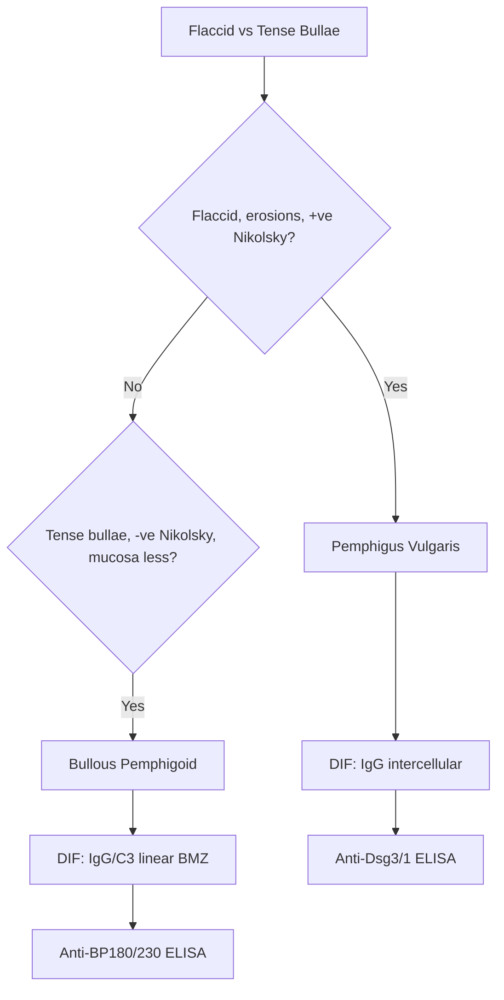

# Vesiculobullous Hub

---
tags: [medicine, dermatology, heading-hub, scaffold-hub]
davidson_part: Part 3: Clinical Medicine
davidson_chapter: Chapter 29: Dermatology
heading: Vesiculobullous Disorders
topic_group:
topic:
status: full-fcps-mrcp-hub
priority: critical
created: 2026-06-15
modified: 2026-06-15
exam_relevance: [FCPS, MRCP Part 1, MRCP Part 2, PACES]
see_also:
  - "[[Dermatology MOC]]"
  - "[[Davidson Chapter 29 - Dermatology Hierarchy]]"
  - "[[../03_Urticaria_Erythema_Purpura/Urticaria Erythema Purpura Hub]]"
---

# Vesiculobullous Disorders Hub

> [!info]
> **Davidson Ch29 Section 4** | **4 Topic Groups, 18 Disease Topics** | **Priority: CRITICAL**

---

## Topic Groups in this Section

| # | Topic Group | Disease Topics | Status |
|---|-------------|----------------|--------|
| 4.1 | Autoimmune Bullous Diseases | 9 | 🔴 scaffold |
| 4.2 | Drug-Induced Bullous Disorders | 5 | 🔴 scaffold |
| 4.3 | Inherited Bullous Disorders | 4 | 🔴 scaffold |
| 4.4 | Other Vesiculobullous Conditions | 6 | 🔴 scaffold |

---

## High-Yield Summary Table

| Disease | Level of Split | Key Antibody | DIF Pattern | 1st Line Management |
|---------|----------------|--------------|-------------|---------------------|
| **Pemphigus vulgaris** | Suprabasal (desmoglein 3) | Anti-Dsg3 (mucosal), Anti-Dsg1+3 (mucocutaneous) | IgG intercellular (fishnet) | Systemic steroids ± rituximab |
| **Pemphigus foliaceus** | Subcorneal (desmoglein 1) | Anti-Dsg1 | IgG intercellular (superficial) | Systemic steroids ± rituximab |
| **Bullous pemphigoid** | Subepidermal (BP180/BP230) | Anti-BP180, BP230 | IgG/C3 linear BMZ | Potent TCS (doxycycline/niacinamide) |
| **Mucous membrane pemphigoid** | Subepidermal | Anti-BP180, laminin-332, α6β4 | IgG/C3 linear BMZ | Dapsone, MMF, rituximab |
| **Linear IgA disease** | Subepidermal | IgA anti-BP180/200 | IgA linear BMZ | Dapsone, sulfapyridine |
| **Epidermolysis bullosa acquisita** | Subepidermal (type VII collagen) | Anti-type VII collagen | IgG linear BMZ (dermal side) | Dapsone, steroids, IVIG, rituximab |
| **Dermatitis herpetiformis** | Subepidermal (transglutaminase 3) | Anti-tTG3, anti-tTG2 (coeliac) | IgA granular papillary dermis | Dapsone, gluten-free diet |
| **Pemphigoid gestationis** | Subepidermal | Anti-BP180 (NC16A) | C3 linear BMZ | TCS, steroids, early delivery |

---

## Key Algorithms

### DIF Pattern Recognition
```mermaid
flowchart TD
    A[Bullous Disease Suspected] --> B[Biopsy for H&E + DIF]
    B --> C{DIF Pattern}
    C -->|IgG intercellular (fishnet)| D[Pemphigus]
    C -->|IgG/C3 linear BMZ| E[BP / MMP / PG / EBA]
    C -->|IgA linear BMZ| F[Linear IgA Disease]
    C -->|IgA granular papillary| G[Dermatitis Herpetiformis]
    C -->|C3 linear BMZ| H[Pemphigoid Gestationis]
    D --> I{Level?}
    I -->|Suprabasal| J[Pemphigus Vulgaris]
    I -->|Subcorneal| K[Pemphigus Foliaceus]
    E --> L{Salt-split skin IIF}
    L -->|Epidermal (roof)| M[BP / PG]
    L -->|Dermal (floor)| N[EBA / MMP (some)]
```

### Pemphigus vs Bullous Pemphigoid


---

## FCPS/MRCP Viva Topics (High-Yield)

1. **Pemphigus vulgaris** - Dsg3 vs Dsg1, mucosal dominance, Nikolsky+, DIF fishnet, rituximab 1st line biologic
2. **Bullous pemphigoid** - tense bullae, elderly, Nikolsky-, DIF linear BMZ, doxycycline/TCS 1st line
3. **DIF patterns** - intercellular (pemphigus), linear BMZ (BP/MMP/EBA/PG), linear IgA (LAD), granular papillary (DH)
4. **Salt-split skin** - roof = BP/PG, floor = EBA/MMP
5. **Dermatitis herpetiformis** - gluten-sensitive, IgA granular, dapsone, GFD, coeliac association
6. **Mucous membrane pemphigoid** - ocular/cicatricial, multiple anti-BMZ antibodies, malignancy screen (laminin-332)
6. **Linear IgA disease** - children (chronic bullous of childhood) vs adults, dapsone responsive
7. **EBA** - mechanobullous, type VII collagen, resistant, IVIG/rituximab
8. **Pemphigoid gestationis** - pregnancy/postpartum, C3 linear, fetal risk (transient)
9. **Drug-induced bullous** - FDE, pseudoephedrine, D-penicillamine, furosemide
10. **Inherited EB** - simplex (KRT5/14), junctional (LAMB3/COL17A1), dystrophic (COL7A1)

---

## Mnemonics

- **Pemphigus vs BP:** `PEM` = **P**emphigus = **E**pidermal (suprabasal), **M**ucosal dominant, flaccid, Nikolsky+ / `BP` = **B**ullous **P**emphigoid = **B**asement membrane (subepidermal), **P**ruritic, tense, Nikolsky-
- **DIF Patterns:** `FISH NET` = Pemphigus (intercellular IgG), `LINEAR` = BP/MMP/EBA/PG (linear IgG/C3 at BMZ), `GRANULAR` = DH (IgA papillary), `IgA LINEAR` = LAD
- **Salt-split:** `ROOF` = BP, PG (epidermal side) / `FLOOR` = EBA, MMP (dermal side)
- **Dsg targets:** `Dsg3` = Mucosal (vulgaris), `Dsg1` = Cutaneous (foliaceus), `Dsg1+3` = Mucocutaneous vulgaris

---

## Quick Revision Card

| Disease | Split Level | Autoantibody | DIF | 1st Line |
|---------|-------------|--------------|-----|----------|
| **Pemphigus vulgaris** | Suprabasal | Anti-Dsg3 (+Dsg1) | IgG intercellular | Steroids + Rituximab |
| **Pemphigus foliaceus** | Subcorneal | Anti-Dsg1 | IgG intercellular (superficial) | Steroids ± Rituximab |
| **Bullous pemphigoid** | Subepidermal | Anti-BP180/230 | IgG/C3 linear BMZ | Potent TCS / Doxycycline |
| **Mucous membrane pemphigoid** | Subepidermal | Anti-laminin-332, BP180 | IgG/C3 linear BMZ | Dapsone, MMF, Rituximab |
| **Linear IgA disease** | Subepidermal | IgA anti-BP180 | IgA linear BMZ | Dapsone |
| **EBA** | Subepidermal | Anti-type VII collagen | IgG linear BMZ (dermal side) | Dapsone, IVIG, Rituximab |
| **Dermatitis herpetiformis** | Subepidermal | Anti-tTG3, tTG2 | IgA granular papillary | Dapsone + GFD |
| **Pemphigoid gestationis** | Subepidermal | Anti-BP180 NC16A | C3 linear BMZ | TCS, Steroids |

---

## Linkage

- **MOC:** [[Dermatology MOC]]
- **Hierarchy:** [[Davidson Chapter 29 - Dermatology Hierarchy]]
- **Section Dir:** `04_Vesiculobullous/`
- **Previous Hub:** [[../03_Urticaria_Erythema_Purpura/Urticaria Erythema Purpura Hub]]
- **Next Hub:** [[../05_Drug_Eruptions/Drug Eruptions Hub]]

---

## Progress
- [ ] 4.1 Autoimmune Bullous Hub (scaffold-hub)
- [ ] 4.2 Drug-Induced Bullous Hub (scaffold-hub)
- [ ] 4.3 Inherited Bullous Hub (scaffold-hub)
- [ ] 4.4 Other Vesiculobullous Hub (scaffold-hub)
- [ ] 18 Disease Topics (scaffold → full-fcps-mrcp-note)